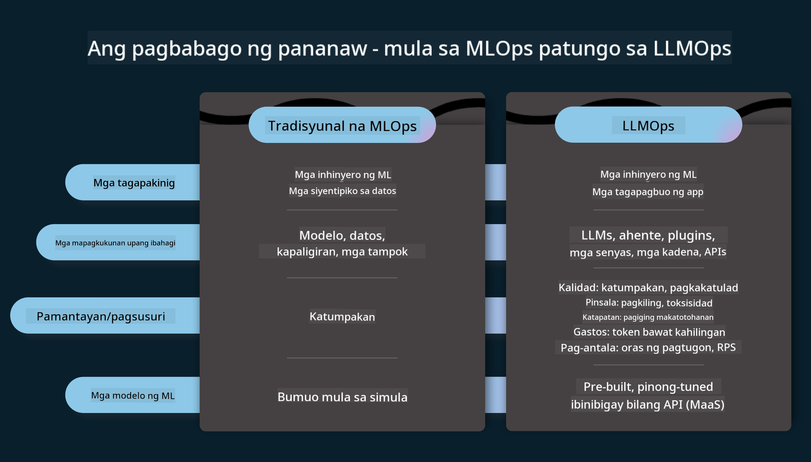
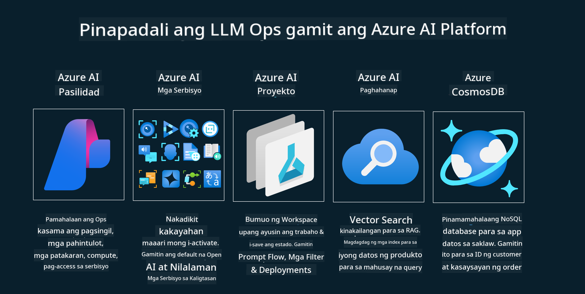
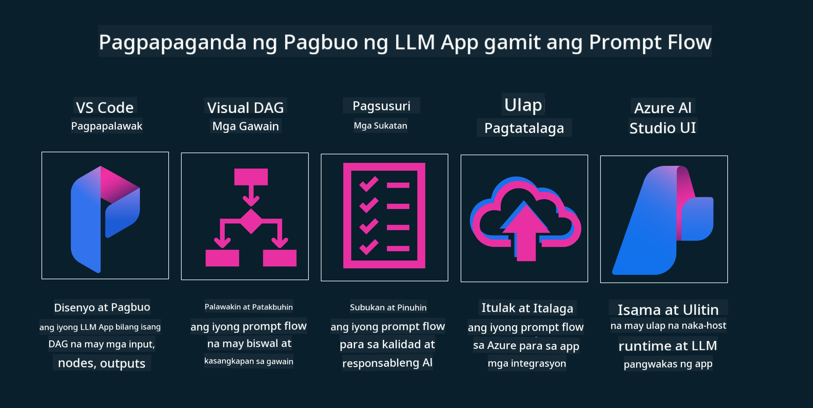

<!--
CO_OP_TRANSLATOR_METADATA:
{
  "original_hash": "27a5347a5022d5ef0a72ab029b03526a",
  "translation_date": "2025-05-20T00:53:49+00:00",
  "source_file": "14-the-generative-ai-application-lifecycle/README.md",
  "language_code": "tl"
}
-->

# Ang Lifecycle ng Generative AI Application

Isang mahalagang tanong para sa lahat ng AI applications ay ang kaugnayan ng AI features, dahil ang AI ay isang mabilis na umuunlad na larangan. Upang matiyak na ang iyong aplikasyon ay nananatiling kaugnay, maaasahan, at matatag, kailangan mong patuloy na subaybayan, suriin, at pagbutihin ito. Dito pumapasok ang generative AI lifecycle.

Ang generative AI lifecycle ay isang balangkas na gumagabay sa iyo sa mga yugto ng pagbuo, pag-deploy, at pagpapanatili ng isang generative AI application. Nakakatulong ito sa iyo na tukuyin ang iyong mga layunin, sukatin ang iyong pagganap, kilalanin ang iyong mga hamon, at ipatupad ang iyong mga solusyon. Nakakatulong din ito na ihanay ang iyong aplikasyon sa mga etikal at legal na pamantayan ng iyong domain at ng iyong mga stakeholder. Sa pamamagitan ng pagsunod sa generative AI lifecycle, maaari mong matiyak na ang iyong aplikasyon ay palaging nagbibigay ng halaga at nasisiyahan ang iyong mga gumagamit.

## Panimula

Sa kabanatang ito, ikaw ay:

- Mauunawaan ang Paradigm Shift mula sa MLOps patungo sa LLMOps
- Ang LLM Lifecycle
- Lifecycle Tooling
- Lifecycle Metrification at Evaluation

## Mauunawaan ang Paradigm Shift mula sa MLOps patungo sa LLMOps

Ang LLMs ay isang bagong tool sa arsenal ng Artificial Intelligence, sila ay lubhang makapangyarihan sa mga gawain ng pagsusuri at pagbuo para sa mga aplikasyon, gayunpaman ang kapangyarihan na ito ay may ilang mga kahihinatnan sa kung paano natin pinadadali ang mga gawain ng AI at Classic Machine Learning.

Dahil dito, kailangan natin ng bagong Paradigm upang iakma ang tool na ito sa isang dynamic, na may tamang insentibo. Maaari nating i-kategorya ang mga lumang AI apps bilang "ML Apps" at ang mga bagong AI Apps bilang "GenAI Apps" o simpleng "AI Apps", na sumasalamin sa mainstream na teknolohiya at mga teknik na ginamit sa oras na iyon. Binabago nito ang ating naratibo sa maraming paraan, tingnan ang sumusunod na paghahambing.

Pansinin na sa LLMOps, mas nakatuon tayo sa mga App Developers, gamit ang mga pagsasama bilang pangunahing punto, gamit ang "Models-as-a-Service" at iniisip ang mga sumusunod na puntos para sa mga sukatan.

- Kalidad: Kalidad ng tugon
- Panganib: Responsible AI
- Katapatan: Pagkakabatay ng tugon (May kahulugan ba? Tama ba?)
- Gastos: Badyet ng Solusyon
- Latency: Avg. na oras para sa tugon ng token

## Ang LLM Lifecycle

Una, upang maunawaan ang lifecycle at ang mga pagbabago, pansinin ang susunod na infographic.

Tulad ng iyong napansin, ito ay naiiba sa karaniwang Lifecycles mula sa MLOps. Ang LLMs ay may maraming bagong mga kinakailangan, tulad ng Prompting, iba't ibang mga teknik upang mapabuti ang kalidad (Fine-Tuning, RAG, Meta-Prompts), iba't ibang pagsusuri at responsibilidad sa responsible AI, sa huli, mga bagong sukatan ng pagsusuri (Kalidad, Panganib, Katapatan, Gastos at Latency).

Halimbawa, tingnan kung paano tayo nag-iisip. Gamit ang prompt engineering upang mag-eksperimento sa iba't ibang LLMs upang tuklasin ang mga posibilidad upang subukan kung ang kanilang Hypothesis ay maaaring tama.

Tandaan na ito ay hindi linear, ngunit integrated loops, iterative at may isang overarching cycle.

Paano natin matutuklasan ang mga hakbang na iyon? Tingnan natin ang detalye kung paano natin maitatayo ang isang lifecycle.

Mukhang medyo kumplikado ito, mag-focus tayo sa tatlong malalaking hakbang muna.

1. Ideating/Exploring: Paggalugad, dito maaari tayong mag-explore ayon sa pangangailangan ng ating negosyo. Pagprototyping, paglikha ng isang [PromptFlow](https://microsoft.github.io/promptflow/index.html?WT.mc_id=academic-105485-koreyst) at subukan kung ito ay sapat na mahusay para sa ating Hypothesis.
2. Building/Augmenting: Implementasyon, ngayon, sinisimulan natin ang pagsusuri para sa mas malalaking dataset na magpatupad ng mga teknik, tulad ng Fine-tuning at RAG, upang suriin ang katatagan ng ating solusyon. Kung hindi, ang muling pag-implement nito, pagdaragdag ng mga bagong hakbang sa ating daloy o muling pag-istruktura ng data, ay maaaring makatulong. Pagkatapos ng pagsubok sa ating daloy at sa ating scale, kung ito ay gumagana at suriin ang ating Metrics, ito ay handa na para sa susunod na hakbang.
3. Operationalizing: Pagsasama, ngayon pagdaragdag ng Monitoring at Alerts Systems sa ating sistema, pag-deploy at pagsasama ng aplikasyon sa ating Application.

Pagkatapos, mayroon tayong overarching cycle ng Pamamahala, na nakatuon sa seguridad, pagsunod at pamamahala.

Binabati kita, ngayon handa na ang iyong AI App na gumana at operational. Para sa isang hands-on na karanasan, tingnan ang [Contoso Chat Demo.](https://nitya.github.io/contoso-chat/?WT.mc_id=academic-105485-koreys)

Ngayon, ano ang mga tool na maaari nating gamitin?

## Lifecycle Tooling

Para sa Tooling, ang Microsoft ay nagbibigay ng [Azure AI Platform](https://azure.microsoft.com/solutions/ai/?WT.mc_id=academic-105485-koreys) at [PromptFlow](https://microsoft.github.io/promptflow/index.html?WT.mc_id=academic-105485-koreyst) upang mapadali at gawing madali ang iyong cycle na ipatupad at handa na.

Ang [Azure AI Platform](https://azure.microsoft.com/solutions/ai/?WT.mc_id=academic-105485-koreys), ay nagbibigay-daan sa iyo na gamitin ang [AI Studio](https://ai.azure.com/?WT.mc_id=academic-105485-koreys). Ang AI Studio ay isang web portal na nagbibigay-daan sa iyo na tuklasin ang mga modelo, mga halimbawa at mga tool. Pamahalaan ang iyong mga resources, UI development flows at SDK/CLI options para sa Code-First development.

Ang Azure AI, ay nagbibigay-daan sa iyo na gamitin ang maraming mga resources, upang pamahalaan ang iyong mga operasyon, serbisyo, proyekto, vector search at mga pangangailangan sa databases.

Magtayo, mula sa Proof-of-Concept(POC) hanggang sa malalaking scale na mga aplikasyon gamit ang PromptFlow:

- Magdisenyo at Bumuo ng mga apps mula sa VS Code, gamit ang visual at functional tools
- Subukan at i-fine-tune ang iyong mga apps para sa kalidad na AI, nang madali.
- Gamitin ang Azure AI Studio upang isama at ulitin sa cloud, I-push at I-deploy para sa mabilis na pagsasama.

## Mahusay! Ipagpatuloy ang iyong Pag-aaral!

Kamangha-mangha, ngayon matuto nang higit pa tungkol sa kung paano namin istraktura ang isang aplikasyon upang gamitin ang mga konsepto sa [Contoso Chat App](https://nitya.github.io/contoso-chat/?WT.mc_id=academic-105485-koreyst), upang suriin kung paano idinadagdag ng Cloud Advocacy ang mga konsepto na iyon sa mga demonstrasyon. Para sa higit pang nilalaman, tingnan ang aming [Ignite breakout session!
](https://www.youtube.com/watch?v=DdOylyrTOWg)

Ngayon, tingnan ang Lesson 15, upang maunawaan kung paano [Retrieval Augmented Generation at Vector Databases](../15-rag-and-vector-databases/README.md?WT.mc_id=academic-105485-koreyst) nakakaapekto sa Generative AI at upang gawing mas nakakaengganyo ang mga Aplikasyon!

**Paunawa**:  
Ang dokumentong ito ay isinalin gamit ang AI translation service na [Co-op Translator](https://github.com/Azure/co-op-translator). Habang pinagsisikapan naming maging tumpak, pakitandaan na ang mga awtomatikong pagsasalin ay maaaring maglaman ng mga pagkakamali o hindi tumpak na impormasyon. Ang orihinal na dokumento sa kanyang katutubong wika ang dapat ituring na mapagkakatiwalaang sanggunian. Para sa kritikal na impormasyon, inirerekomenda ang propesyonal na pagsasaling-wika ng tao. Hindi kami mananagot para sa anumang hindi pagkakaintindihan o maling interpretasyon na dulot ng paggamit ng pagsasaling ito.