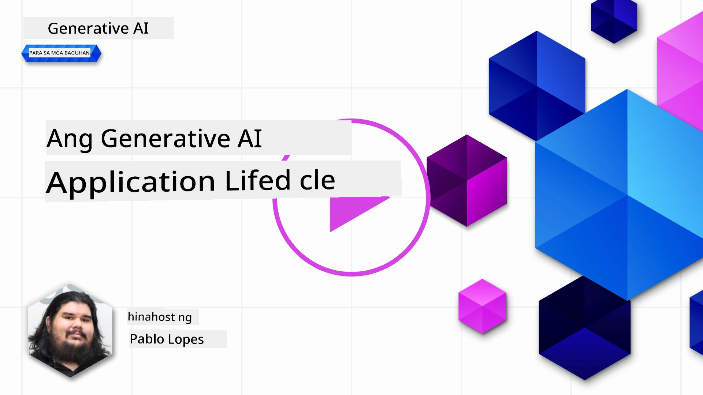
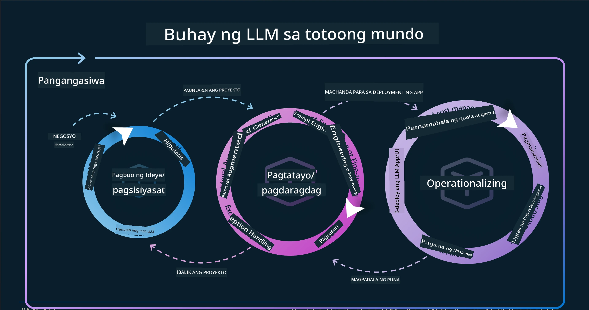
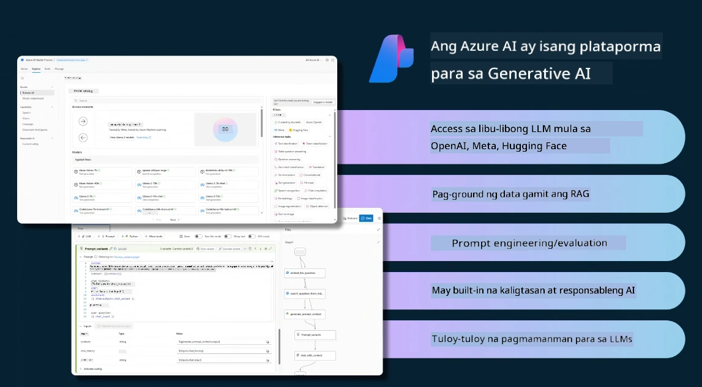
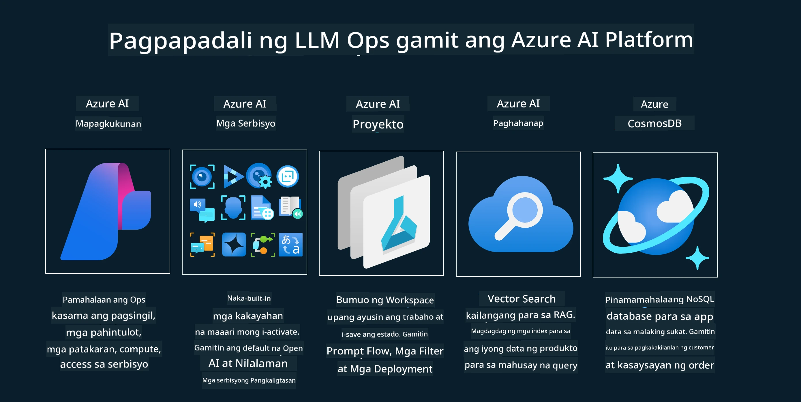
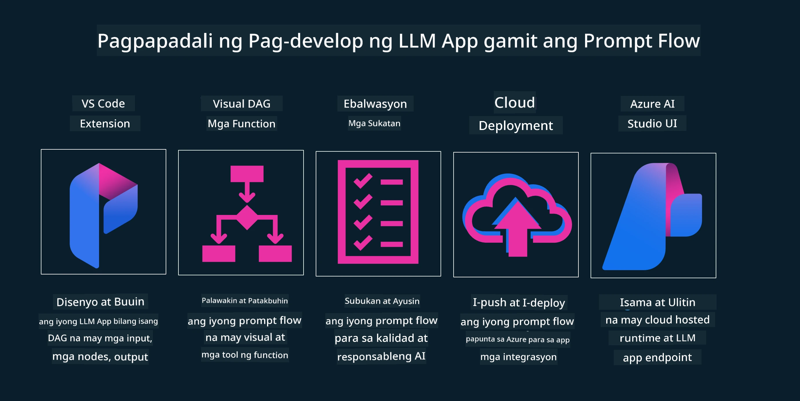

# Ang Lifecycle ng Generative AI Application

Isang mahalagang tanong para sa lahat ng AI application ay ang kaugnayan ng mga tampok ng AI, dahil ang AI ay isang mabilis na umuunlad na larangan, upang matiyak na ang iyong aplikasyon ay nananatiling kaugnay, mapagkakatiwalaan, at matatag, kailangan mong subaybayan, suriin, at patuloy na pagbutihin ito. Dito pumapasok ang lifecycle ng generative AI.

Ang lifecycle ng generative AI ay isang balangkas na gumagabay sa iyo sa mga yugto ng pagdevelop, pagdeploy, at pagpapanatili ng isang generative AI application. Tinutulungan ka nitong tukuyin ang iyong mga layunin, sukatin ang iyong pagganap, kilalanin ang iyong mga hamon, at ipatupad ang iyong mga solusyon. Tinutulungan ka rin nitong ihanay ang iyong aplikasyon sa mga etikal at legal na pamantayan ng iyong larangan at mga stakeholder. Sa pamamagitan ng pagsunod sa lifecycle ng generative AI, maipapasaubili mong ang iyong aplikasyon ay palaging nagbibigay ng halaga at nasisiyahan ang iyong mga gumagamit.

## Panimula

Sa kabanatang ito, matututuhan mo ang mga sumusunod:

- Maunawaan ang Paradigm Shift mula MLOps patungong LLMOps
- Ang LLM Lifecycle
- Lifecycle Tooling
- Lifecycle Metrification at Pagsusuri

## Maunawaan ang Paradigm Shift mula MLOps patungong LLMOps

Ang LLMs ay bagong kasangkapan sa arsenal ng Artificial Intelligence, napakalakas sila sa mga gawaing pagsusuri at pagbuo para sa mga aplikasyon, ngunit ang kapangyarihang ito ay may mga epekto sa kung paano natin pinapaayos ang mga AI at Classic Machine Learning na gawain.

Dahil dito, kailangan natin ng bagong Paradigm upang iangkop ang kasangkapang ito nang dinamiko, na may tamang insentibo. Maaari nating ilarawan ang mga lumang AI apps bilang "ML Apps" at ang mas bagong AI Apps bilang "GenAI Apps" o simpleng "AI Apps", na sumasalamin sa pangunahing teknolohiya at mga teknik na ginamit noong panahong iyon. Binabago nito ang ating kuwento sa maraming paraan, tingnan ang sumusunod na paghahambing.

Pansinin na sa LLMOps, mas nakatuon tayo sa mga App Developers, ginagamit ang integrasyon bilang mahalagang punto, ginagamit ang "Models-as-a-Service" at iniisip ang mga sumusunod na panukat para sa mga metric.

- Kalidad: Kalidad ng tugon
- Pinsala: Responsableng AI
- Katapatan: Katumpakan ng tugon (Makatwiran ba? Tama ba?)
- Gastos: Badyet ng Solusyon
- Latensya: Avg. na oras para sa tugon ng token

## Ang LLM Lifecycle

Una, upang maunawaan ang lifecycle at mga pagbabago, pansinin ang sumusunod na infographic.

Tulad ng mapapansin, iba ito sa karaniwang Lifecycles mula sa MLOps. Ang LLMs ay may maraming bagong pangangailangan, gaya ng Prompting, iba't ibang mga teknik upang mapabuti ang kalidad (Fine-Tuning, RAG, Meta-Prompts), iba't ibang pagtatasa at responsibilidad gamit ang responsableng AI, at sa huli, mga bagong evaluation metrics (Kalidad, Pinsala, Katapatan, Gastos at Latensya).

Halimbawa, tingnan kung paano tayo bumubuo ng ideya. Ginagamit ang prompt engineering upang subukan ang iba't ibang LLMs upang tuklasin ang mga posibilidad para matesting kung tama ang kanilang Hypothesis.

Pansinin na hindi ito linear, kundi mahahabang integrated loops, iterative at may sumasaklaw na cycle.

Paano natin pwedeng tuklasin ang mga hakbang na iyon? Tingnan natin nang detalyado kung paano tayo makakabuo ng lifecycle.

Maaaring mukhang komplikado ito, unahin natin ang tatlong pangunahing hakbang.

1. Ideating/Exploring: Paggalugad, dito pwede tayong mag-explore ayon sa ating mga pangangailangan sa negosyo. Prototyping, paggawa ng [PromptFlow](https://microsoft.github.io/promptflow/index.html?WT.mc_id=academic-105485-koreyst) at pagsubok kung sapat na ito para sa ating Hypothesis.
1. Building/Augmenting: Pagpapatupad, ngayon, sisimulan nating suriin para sa mas malalaking datasets, magpatupad ng mga teknik, tulad ng Fine-tuning at RAG, upang suriin ang katatagan ng ating solusyon. Kung hindi ito mapanatili, maaaring makatulong ang muling pagpapatupad, pagdagdag ng mga bagong hakbang sa ating daloy, o muling pag-aayos ng data. Pagkatapos subukan ang ating daloy at sukat, kung ito ay gumagana at naabot ang ating mga Metric, handa na ito para sa susunod na hakbang.
1. Operationalizing: Integrasyon, ngayon ay idinadagdag ang Monitoring at Alerts Systems sa ating sistema, deployment at aplikasyon ng integrasyon sa ating Application.

Pagkatapos, meron tayong sumasaklaw na cycle ng Pamamahala, na nakatuon sa seguridad, pagsunod, at pamamahala.

Binabati kita, handa na ang iyong AI App para gamitin at ma-operational. Para sa hands-on na karanasan, tingnan ang [Contoso Chat Demo.](https://nitya.github.io/contoso-chat/?WT.mc_id=academic-105485-koreyst)

Ngayon, ano'ng mga tools ang maaari nating gamitin?

## Lifecycle Tooling

Para sa tooling, nagbibigay ang Microsoft ng [Azure AI Platform](https://azure.microsoft.com/solutions/ai/?WT.mc_id=academic-105485-koreyst) at [PromptFlow](https://microsoft.github.io/promptflow/index.html?WT.mc_id=academic-105485-koreyst) upang gawing madali at handa ang iyong cycle para gamitin.

Ang [Azure AI Platform](https://azure.microsoft.com/solutions/ai/?WT.mc_id=academic-105485-koreyst) ay nagpapahintulot sa iyo na gamitin ang [AI Studio](https://ai.azure.com/?WT.mc_id=academic-105485-koreyst). Ang AI Studio ay portal sa web na nagpapahintulot sa iyo na mag-explore ng mga modelo, sample, at mga tool. Pinamamahalaan ang iyong mga resources, UI development flows at mga opsyon ng SDK/CLI para sa Code-First development.

Pinapayagan ka ng Azure AI na gamitin ang maraming resources upang pamahalaan ang iyong mga operasyon, serbisyo, proyekto, vector search at mga pangangailangan sa database.

Magbuo, mula sa Proof-of-Concept(POC) hanggang sa malakihang aplikasyon gamit ang PromptFlow:

- Disenyo at pagtayo ng mga app mula sa VS Code, gamit ang biswal at functional na mga tool
- Subukan at i-fine-tune ang iyong mga app para sa kalidad ng AI, nang madali.
- Gamitin ang Azure AI Studio upang magsama at ulitin gamit ang cloud, i-push at i-deploy para sa mabilis na integrasyon.

## Mahusay! Ipagpatuloy ang iyong Pag-aaral!

Kahanga-hanga, ngayon matutunan pa kung paano natin istruktura ang isang aplikasyon upang magamit ang mga konsepto gamit ang [Contoso Chat App](https://nitya.github.io/contoso-chat/?WT.mc_id=academic-105485-koreyst), upang makita kung paano idinadagdag ng Cloud Advocacy ang mga konsepto sa mga demonstrasyon. Para sa karagdagang nilalaman, tingnan ang aming [Ignite breakout session!](https://www.youtube.com/watch?v=DdOylyrTOWg)

Ngayon, tingnan ang Lesson 15, upang maunawaan kung paano nakaapekto ang [Retrieval Augmented Generation at Vector Databases](../15-rag-and-vector-databases/README.md?WT.mc_id=academic-105485-koreyst) sa Generative AI at upang makagawa ng mas nakakaengganyong mga Application!

---

<!-- CO-OP TRANSLATOR DISCLAIMER START -->
**Paliwanag**:  
Ang dokumentong ito ay naisalin gamit ang AI translation service na [Co-op Translator](https://github.com/Azure/co-op-translator). Bagamat aming ipinagpupunyagi ang katumpakan, pakatandaan na ang mga awtomatikong salin ay maaaring maglaman ng mga kamalian o di-tumpak na pagsasalin. Ang orihinal na dokumento sa orihinal nitong wika ang dapat ituring na pangunahing sanggunian. Para sa mahahalagang impormasyon, inirerekomenda ang propesyonal na pagsasaling-tao. Hindi kami mananagot sa anumang mga hindi pagkakaunawaan o maling interpretasyon na maaaring lumitaw mula sa paggamit ng pagsasaling ito.
<!-- CO-OP TRANSLATOR DISCLAIMER END -->