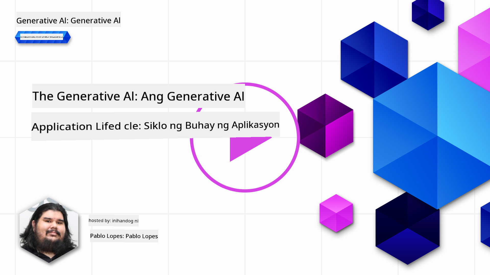
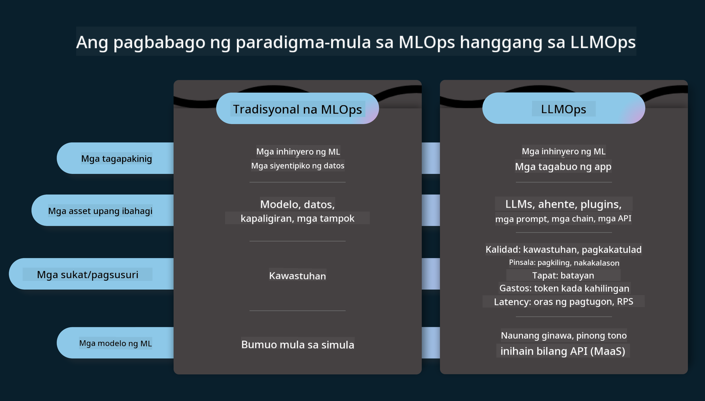
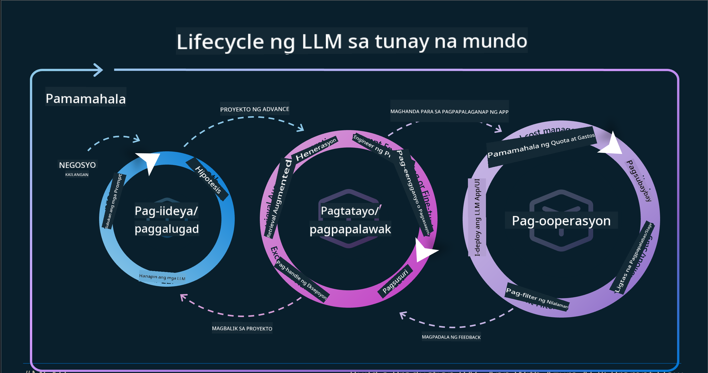
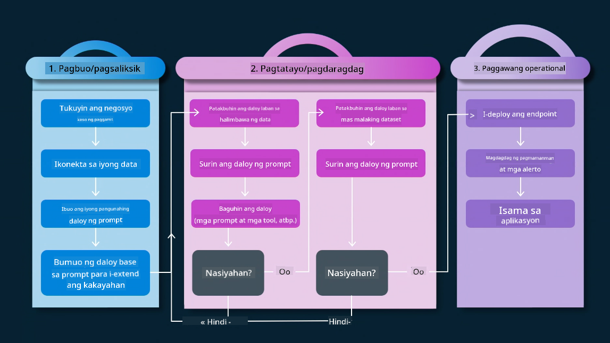
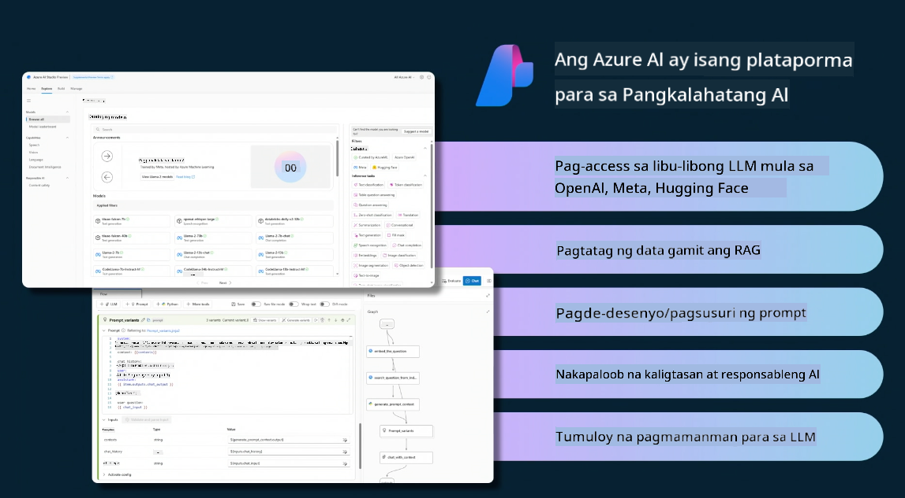
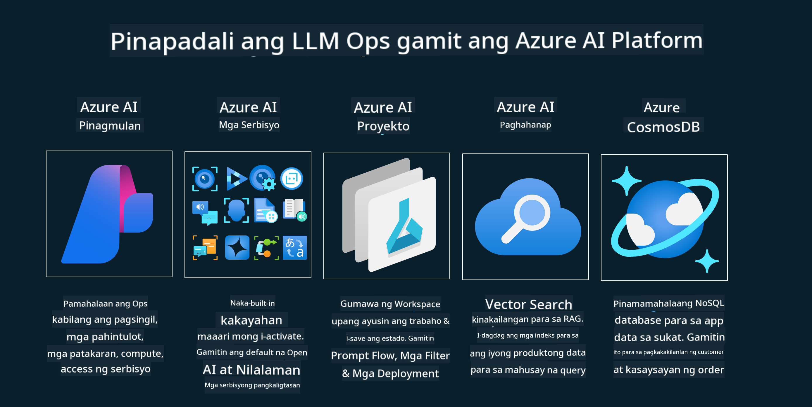
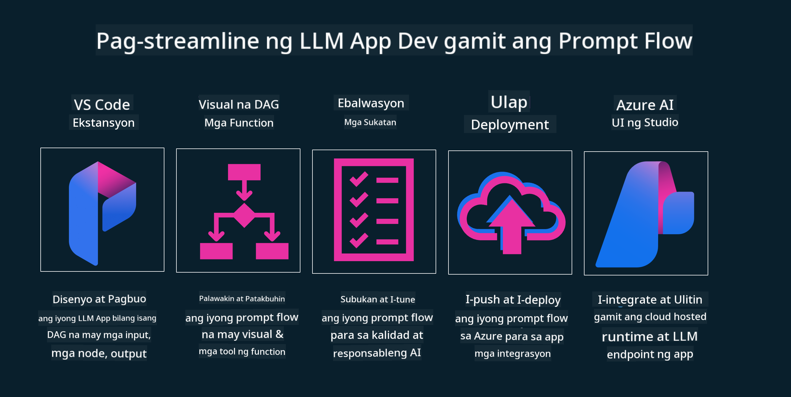

<!--
CO_OP_TRANSLATOR_METADATA:
{
  "original_hash": "27a5347a5022d5ef0a72ab029b03526a",
  "translation_date": "2025-06-25T22:08:06+00:00",
  "source_file": "14-the-generative-ai-application-lifecycle/README.md",
  "language_code": "tl"
}
-->

# Ang Lifecycle ng Aplikasyon ng Generative AI

Isang mahalagang tanong para sa lahat ng AI applications ay ang kahalagahan ng mga AI features, dahil ang AI ay isang mabilis na umuunlad na larangan. Upang matiyak na ang iyong aplikasyon ay nananatiling may kaugnayan, maaasahan, at matibay, kailangan mong subaybayan, suriin, at pagbutihin ito nang patuloy. Dito pumapasok ang lifecycle ng generative AI.

Ang lifecycle ng generative AI ay isang balangkas na gumagabay sa iyo sa mga yugto ng pagbuo, pag-deploy, at pagpapanatili ng isang generative AI application. Tinutulungan ka nitong tukuyin ang iyong mga layunin, sukatin ang iyong pagganap, tukuyin ang iyong mga hamon, at ipatupad ang iyong mga solusyon. Tinutulungan ka rin nitong i-align ang iyong aplikasyon sa mga pamantayan ng etika at legal ng iyong domain at mga stakeholder. Sa pamamagitan ng pagsunod sa lifecycle ng generative AI, maaari mong matiyak na ang iyong aplikasyon ay palaging nagbibigay ng halaga at nagbibigay kasiyahan sa iyong mga gumagamit.

## Panimula

Sa kabanatang ito, ikaw ay:

- Mauunawaan ang Paradigm Shift mula sa MLOps patungo sa LLMOps
- Ang LLM Lifecycle
- Mga Kagamitan sa Lifecycle
- Pagsukat at Pagsusuri ng Lifecycle

## Mauunawaan ang Paradigm Shift mula sa MLOps patungo sa LLMOps

Ang LLMs ay isang bagong kasangkapan sa arsenal ng Artificial Intelligence, sila ay lubhang makapangyarihan sa mga gawain ng pagsusuri at pagbuo para sa mga aplikasyon, gayunpaman ang kapangyarihang ito ay may ilang mga kahihinatnan sa kung paano natin pinapadali ang mga gawain ng AI at Classic Machine Learning.

Sa ganito, kailangan natin ng bagong Paradigm upang iakma ang kasangkapan na ito sa isang dynamic, na may tamang insentibo. Maaari nating ikategorya ang mga lumang AI apps bilang "ML Apps" at ang mga bagong AI Apps bilang "GenAI Apps" o simpleng "AI Apps", na sumasalamin sa mainstream na teknolohiya at mga teknik na ginamit sa panahon. Ito ay nagbabago ng ating kuwento sa maraming paraan, tingnan ang sumusunod na paghahambing.

Mapapansin na sa LLMOps, mas nakatuon tayo sa mga App Developers, gamit ang mga integrasyon bilang pangunahing punto, gamit ang "Models-as-a-Service" at iniisip ang mga sumusunod na punto para sa mga sukatan.

- Kalidad: Kalidad ng tugon
- Pinsala: Responsableng AI
- Katapatan: Pundasyon ng tugon (May katuturan ba? Tama ba?)
- Gastos: Badyet ng Solusyon
- Latency: Karaniwang oras para sa tugon ng token

## Ang LLM Lifecycle

Una, upang maunawaan ang lifecycle at ang mga pagbabago, pansinin ang susunod na infographic.

Gaya ng iyong mapapansin, ito ay naiiba sa karaniwang Lifecycles mula sa MLOps. Ang LLMs ay may maraming bagong kinakailangan, gaya ng Prompting, iba't ibang teknik upang mapabuti ang kalidad (Fine-Tuning, RAG, Meta-Prompts), iba't ibang pagsusuri at responsibilidad sa responsableng AI, sa huli, bagong mga sukatan ng pagsusuri (Kalidad, Pinsala, Katapatan, Gastos at Latency).

Halimbawa, tingnan kung paano tayo nag-iisip. Gamit ang prompt engineering upang mag-eksperimento sa iba't ibang LLMs upang tuklasin ang mga posibilidad upang subukan kung ang kanilang Hypothesis ay maaaring tama.

Pansinin na ito ay hindi linear, kundi integrated loops, iterative at may isang overarching cycle.

Paano natin ma-eexplore ang mga hakbang na ito? Tingnan natin ang detalye kung paano natin maitatayo ang isang lifecycle.

Maaaring mukhang medyo kumplikado ito, mag-focus muna tayo sa tatlong malalaking hakbang.

1. Pag-iisip/Pagsasaliksik: Pagsaliksik, dito maaari tayong mag-explore ayon sa ating mga pangangailangan sa negosyo. Pag-prototype, paglikha ng isang [PromptFlow](https://microsoft.github.io/promptflow/index.html?WT.mc_id=academic-105485-koreyst) at pagsubok kung ito ay sapat na mahusay para sa ating Hypothesis.
2. Pagbuo/Pagpapalawak: Implementasyon, ngayon, sinisimulan natin ang pagsusuri para sa mas malalaking datasets na nagpatupad ng mga teknik, tulad ng Fine-tuning at RAG, upang suriin ang tibay ng ating solusyon. Kung hindi, muling ipatupad ito, magdagdag ng mga bagong hakbang sa ating daloy o muling istruktura ang data, maaaring makatulong. Pagkatapos subukan ang ating daloy at ang ating scale, kung ito ay gumagana at suriin ang ating Mga Sukatan, ito ay handa na para sa susunod na hakbang.
3. Pag-ooperasyon: Pagsasama, ngayon ay pagdaragdag ng Monitoring at Alerts Systems sa ating sistema, pag-deploy at application integration sa ating Aplikasyon.

Pagkatapos, mayroon tayong overarching cycle ng Pamamahala, na nakatuon sa seguridad, pagsunod, at pamamahala.

Binabati kita, ngayon mayroon ka ng iyong AI App na handa na at operational. Para sa hands-on na karanasan, tingnan ang [Contoso Chat Demo.](https://nitya.github.io/contoso-chat/?WT.mc_id=academic-105485-koreys)

Ngayon, ano ang mga tool na maaari nating gamitin?

## Mga Kagamitan sa Lifecycle

Para sa Tooling, nagbibigay ang Microsoft ng [Azure AI Platform](https://azure.microsoft.com/solutions/ai/?WT.mc_id=academic-105485-koreys) at [PromptFlow](https://microsoft.github.io/promptflow/index.html?WT.mc_id=academic-105485-koreyst) upang mapadali at gawing madali ang iyong cycle na ipatupad at handa na.

Ang [Azure AI Platform](https://azure.microsoft.com/solutions/ai/?WT.mc_id=academic-105485-koreys), ay nagbibigay-daan sa iyo upang gamitin ang [AI Studio](https://ai.azure.com/?WT.mc_id=academic-105485-koreys). Ang AI Studio ay isang web portal na nagbibigay-daan sa iyo upang I-explore ang mga modelo, sample at mga tool. Pamahalaan ang iyong mga resources, UI development flows at mga opsyon ng SDK/CLI para sa Code-First development.

Ang Azure AI, ay nagbibigay-daan sa iyo upang gamitin ang maramihang mga resources, upang pamahalaan ang iyong mga operasyon, serbisyo, proyekto, vector search at mga pangangailangan sa databases.

Magbuo, mula sa Proof-of-Concept(POC) hanggang sa malakihang mga aplikasyon gamit ang PromptFlow:

- Magdisenyo at Bumuo ng mga apps mula sa VS Code, gamit ang visual at functional tools
- Subukan at fine-tune ang iyong mga apps para sa kalidad ng AI, nang madali.
- Gamitin ang Azure AI Studio upang I-integrate at I-iterate gamit ang cloud, I-push at I-deploy para sa mabilis na integrasyon.

## Mahusay! Ipagpatuloy ang Iyong Pag-aaral!

Kamangha-mangha, ngayon ay matuto pa tungkol sa kung paano natin istruktura ang isang aplikasyon upang gamitin ang mga konsepto sa [Contoso Chat App](https://nitya.github.io/contoso-chat/?WT.mc_id=academic-105485-koreyst), upang suriin kung paano ang Cloud Advocacy ay nagdaragdag ng mga konsepto sa mga demonstrasyon. Para sa higit pang nilalaman, tingnan ang aming [Ignite breakout session!
](https://www.youtube.com/watch?v=DdOylyrTOWg)

Ngayon, tingnan ang Lesson 15, upang maunawaan kung paano ang [Retrieval Augmented Generation at Vector Databases](../15-rag-and-vector-databases/README.md?WT.mc_id=academic-105485-koreyst) ay nakakaapekto sa Generative AI at upang makagawa ng mas nakaka-engganyong mga Aplikasyon!

**Paunawa**:  
Ang dokumentong ito ay isinalin gamit ang AI translation service na [Co-op Translator](https://github.com/Azure/co-op-translator). Habang nagsusumikap kami para sa katumpakan, mangyaring tandaan na ang mga awtomatikong pagsasalin ay maaaring maglaman ng mga pagkakamali o hindi pagkaka-ayon. Ang orihinal na dokumento sa sariling wika nito ang dapat ituring na mapagkakatiwalaang pinagmulan. Para sa mahalagang impormasyon, inirerekomenda ang propesyonal na pagsasaling-wika ng tao. Hindi kami mananagot sa anumang hindi pagkakaintindihan o maling interpretasyon na dulot ng paggamit ng pagsasaling ito.