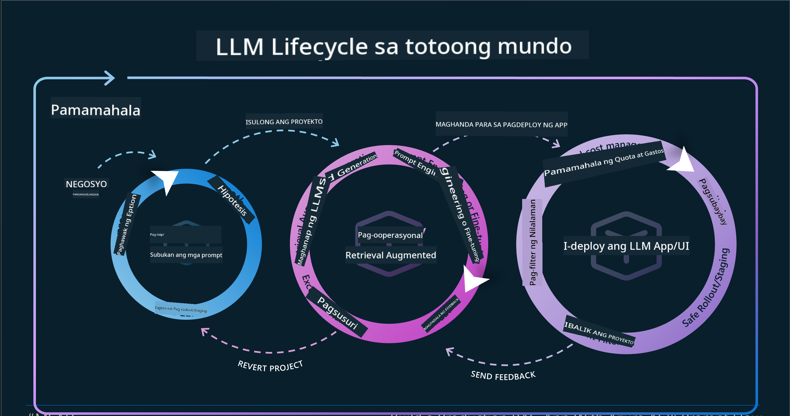
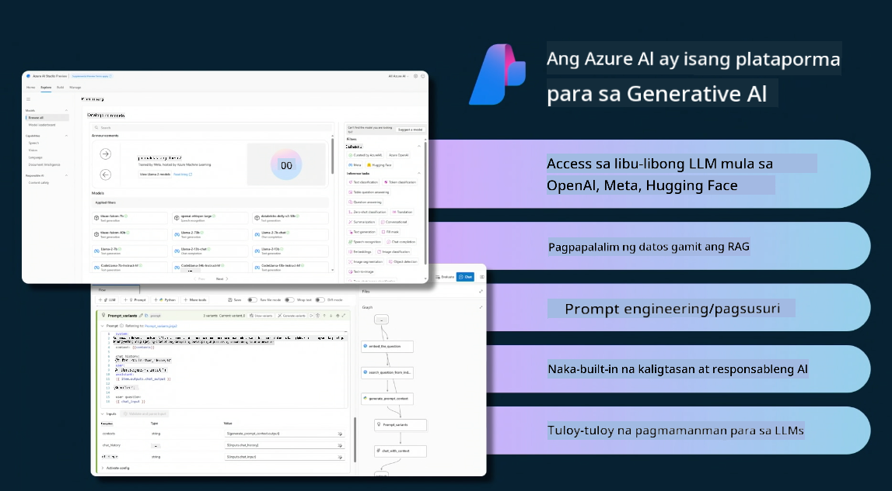
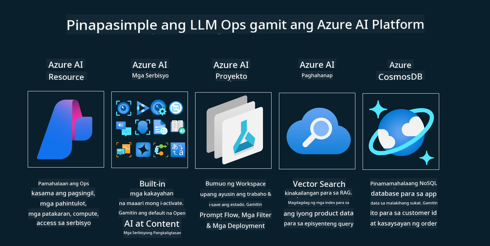

<!--
CO_OP_TRANSLATOR_METADATA:
{
  "original_hash": "27a5347a5022d5ef0a72ab029b03526a",
  "translation_date": "2025-07-09T15:56:57+00:00",
  "source_file": "14-the-generative-ai-application-lifecycle/README.md",
  "language_code": "tl"
}
-->

# Ang Siklo ng Buhay ng Generative AI Application

Isang mahalagang tanong para sa lahat ng AI application ay ang kaugnayan ng mga AI feature, dahil mabilis ang pag-unlad ng AI, upang matiyak na nananatiling makabuluhan, maaasahan, at matatag ang iyong application, kailangan mo itong subaybayan, suriin, at pagbutihin nang tuloy-tuloy. Dito pumapasok ang siklo ng buhay ng generative AI.

Ang siklo ng buhay ng generative AI ay isang balangkas na gumagabay sa iyo sa mga yugto ng pagbuo, pag-deploy, at pagpapanatili ng isang generative AI application. Tinutulungan ka nitong tukuyin ang iyong mga layunin, sukatin ang iyong pagganap, kilalanin ang iyong mga hamon, at ipatupad ang mga solusyon. Tinutulungan ka rin nitong iayon ang iyong application sa mga etikal at legal na pamantayan ng iyong larangan at mga stakeholder. Sa pagsunod sa siklo ng buhay ng generative AI, masisiguro mong palaging nagbibigay halaga at nasisiyahan ang iyong mga gumagamit.

## Panimula

Sa kabanatang ito, matututuhan mo ang mga sumusunod:

- Maunawaan ang Paradigm Shift mula MLOps patungong LLMOps
- Ang Siklo ng Buhay ng LLM
- Mga Kasangkapan para sa Siklo ng Buhay
- Pagsukat at Pagsusuri ng Siklo ng Buhay

## Maunawaan ang Paradigm Shift mula MLOps patungong LLMOps

Ang LLMs ay bagong kasangkapan sa arsenal ng Artificial Intelligence, napakalakas nila sa mga gawain ng pagsusuri at paglikha para sa mga application, ngunit may mga epekto ang kapangyarihang ito sa kung paano natin pinapasimple ang AI at mga klasikong gawain sa Machine Learning.

Dahil dito, kailangan natin ng bagong Paradigm upang maiangkop ang kasangkapang ito sa isang dinamiko, na may tamang mga insentibo. Maaari nating ikategorya ang mga lumang AI app bilang "ML Apps" at ang mga bagong AI app bilang "GenAI Apps" o simpleng "AI Apps", na sumasalamin sa mga pangunahing teknolohiya at teknik na ginagamit sa panahon. Binabago nito ang ating kwento sa maraming paraan, tingnan ang sumusunod na paghahambing.

Pansinin na sa LLMOps, mas nakatuon tayo sa mga App Developer, gamit ang mga integrasyon bilang pangunahing punto, paggamit ng "Models-as-a-Service" at iniisip ang mga sumusunod na punto para sa mga sukatan.

- Kalidad: Kalidad ng tugon
- Pinsala: Responsableng AI
- Katapatan: Katumpakan ng tugon (May katuturan ba? Tama ba ito?)
- Gastos: Badyet ng solusyon
- Latency: Karaniwang oras para sa tugon ng token

## Ang Siklo ng Buhay ng LLM

Una, upang maunawaan ang siklo ng buhay at mga pagbabago, pansinin ang sumusunod na infographic.

Mapapansin mo na ito ay iba sa karaniwang Siklo ng Buhay mula sa MLOps. Maraming bagong pangangailangan ang LLMs, tulad ng Prompting, iba't ibang teknik para mapabuti ang kalidad (Fine-Tuning, RAG, Meta-Prompts), iba't ibang pagsusuri at responsibilidad sa responsableng AI, at sa huli, mga bagong sukatan ng pagsusuri (Kalidad, Pinsala, Katapatan, Gastos at Latency).

Halimbawa, tingnan kung paano tayo nag-iisip. Ginagamit ang prompt engineering upang subukan ang iba't ibang LLM upang tuklasin ang mga posibilidad at subukan kung tama ang kanilang Hypothesis.

Tandaan na hindi ito linear, kundi mga integrated loop, paulit-ulit at may pangkalahatang siklo.

Paano natin maaaring tuklasin ang mga hakbang na ito? Tingnan natin nang detalyado kung paano tayo makakabuo ng siklo ng buhay.

Maaaring medyo komplikado ito, magpokus muna tayo sa tatlong pangunahing hakbang.

1. Ideating/Exploring: Pagsisiyasat, dito maaari tayong mag-eksperimento ayon sa pangangailangan ng negosyo. Gumagawa ng prototype, lumilikha ng [PromptFlow](https://microsoft.github.io/promptflow/index.html?WT.mc_id=academic-105485-koreyst) at sinusubukan kung sapat ang bisa nito para sa ating Hypothesis.
1. Building/Augmenting: Pagpapatupad, ngayon, sinisimulan nating suriin ang mas malalaking dataset, ipinatutupad ang mga teknik tulad ng Fine-tuning at RAG upang suriin ang tibay ng ating solusyon. Kung hindi ito gumana, ang muling pagpapatupad, pagdagdag ng mga bagong hakbang sa ating daloy o muling pagsasaayos ng data ay maaaring makatulong. Pagkatapos subukan ang ating daloy at sukat, kung gumagana ito at pumasa sa ating mga sukatan, handa na ito para sa susunod na hakbang.
1. Operationalizing: Integrasyon, ngayon ay idinadagdag ang mga sistema ng Monitoring at Alerts sa ating sistema, deployment at integrasyon ng application sa ating Application.

Pagkatapos, mayroon tayong pangkalahatang siklo ng Pamamahala, na nakatuon sa seguridad, pagsunod at pamamahala.

Binabati kita, handa na ang iyong AI App para gamitin at patakbuhin. Para sa hands-on na karanasan, tingnan ang [Contoso Chat Demo.](https://nitya.github.io/contoso-chat/?WT.mc_id=academic-105485-koreys)

Ngayon, anong mga kasangkapan ang maaari nating gamitin?

## Mga Kasangkapan para sa Siklo ng Buhay

Para sa mga kasangkapan, nagbibigay ang Microsoft ng [Azure AI Platform](https://azure.microsoft.com/solutions/ai/?WT.mc_id=academic-105485-koreys) at [PromptFlow](https://microsoft.github.io/promptflow/index.html?WT.mc_id=academic-105485-koreyst) na nagpapadali at ginagawang madali ang pagpapatupad ng iyong siklo.

Ang [Azure AI Platform](https://azure.microsoft.com/solutions/ai/?WT.mc_id=academic-105485-koreys), ay nagbibigay-daan sa iyo na gamitin ang [AI Studio](https://ai.azure.com/?WT.mc_id=academic-105485-koreys). Ang AI Studio ay isang web portal na nagpapahintulot sa iyo na tuklasin ang mga modelo, mga halimbawa at mga kasangkapan. Pamahalaan ang iyong mga resources, UI development flows at mga opsyon ng SDK/CLI para sa Code-First development.

Pinapayagan ka ng Azure AI na gamitin ang iba't ibang resources upang pamahalaan ang iyong mga operasyon, serbisyo, proyekto, vector search at mga pangangailangan sa database.

Gumawa mula sa Proof-of-Concept (POC) hanggang sa malalaking aplikasyon gamit ang PromptFlow:

- Disenyo at Buoin ang mga app mula sa VS Code, gamit ang mga visual at functional na kasangkapan
- Subukan at i-fine-tune ang iyong mga app para sa kalidad ng AI, nang madali.
- Gamitin ang Azure AI Studio para sa Integrasyon at Iterasyon sa cloud, Push at Deploy para sa mabilis na integrasyon.

## Mahusay! Ipagpatuloy ang Iyong Pag-aaral!

Kahanga-hanga, ngayon alamin pa kung paano natin istrukturahin ang isang application upang magamit ang mga konsepto gamit ang [Contoso Chat App](https://nitya.github.io/contoso-chat/?WT.mc_id=academic-105485-koreyst), upang makita kung paano idinadagdag ng Cloud Advocacy ang mga konseptong ito sa mga demonstrasyon. Para sa karagdagang nilalaman, tingnan ang aming [Ignite breakout session!](https://www.youtube.com/watch?v=DdOylyrTOWg)

Ngayon, tingnan ang Lesson 15, upang maunawaan kung paano nakakaapekto ang [Retrieval Augmented Generation at Vector Databases](../15-rag-and-vector-databases/README.md?WT.mc_id=academic-105485-koreyst) sa Generative AI at upang makagawa ng mas kapana-panabik na mga Application!

**Paalala**:  
Ang dokumentong ito ay isinalin gamit ang AI translation service na [Co-op Translator](https://github.com/Azure/co-op-translator). Bagamat nagsusumikap kami para sa katumpakan, pakatandaan na ang mga awtomatikong pagsasalin ay maaaring maglaman ng mga pagkakamali o di-tumpak na impormasyon. Ang orihinal na dokumento sa kanyang sariling wika ang dapat ituring na pangunahing sanggunian. Para sa mahahalagang impormasyon, inirerekomenda ang propesyonal na pagsasalin ng tao. Hindi kami mananagot sa anumang hindi pagkakaunawaan o maling interpretasyon na maaaring magmula sa paggamit ng pagsasaling ito.