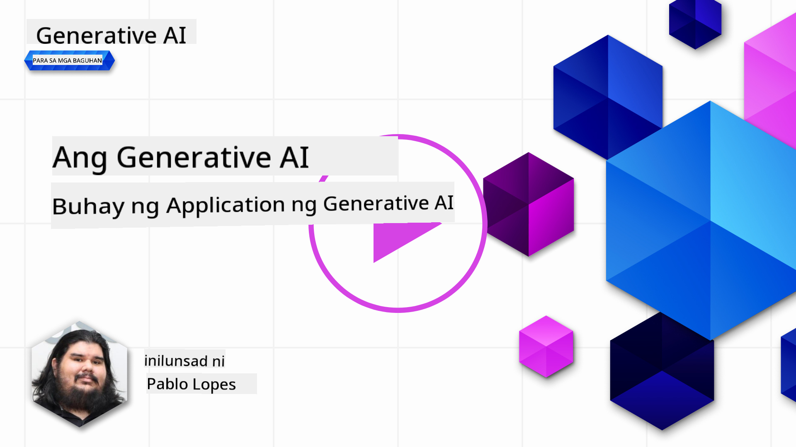

<!--
CO_OP_TRANSLATOR_METADATA:
{
  "original_hash": "b9d32511b27373a1b21b5789d4fda057",
  "translation_date": "2025-10-17T13:18:05+00:00",
  "source_file": "14-the-generative-ai-application-lifecycle/README.md",
  "language_code": "tl"
}
-->

# Ang Lifecycle ng Generative AI Application

Isang mahalagang tanong para sa lahat ng AI applications ay ang kaugnayan ng mga AI features, dahil mabilis ang pag-unlad ng larangan ng AI. Upang masiguro na ang iyong application ay nananatiling kaugnay, maaasahan, at matatag, kailangan mong patuloy na i-monitor, suriin, at pagbutihin ito. Dito pumapasok ang generative AI lifecycle.

Ang generative AI lifecycle ay isang framework na gumagabay sa iyo sa mga yugto ng pagbuo, pag-deploy, at pagpapanatili ng generative AI application. Tinutulungan ka nitong tukuyin ang iyong mga layunin, sukatin ang iyong performance, kilalanin ang iyong mga hamon, at ipatupad ang iyong mga solusyon. Tinutulungan ka rin nitong i-align ang iyong application sa mga etikal at legal na pamantayan ng iyong domain at mga stakeholder. Sa pagsunod sa generative AI lifecycle, masisiguro mong palaging nagbibigay ng halaga ang iyong application at nasisiyahan ang iyong mga user.

## Panimula

Sa kabanatang ito, ikaw ay:

- Mauunawaan ang Paradigm Shift mula MLOps patungong LLMOps
- Ang LLM Lifecycle
- Mga Tool para sa Lifecycle
- Pagsukat at Pagsusuri ng Lifecycle

## Mauunawaan ang Paradigm Shift mula MLOps patungong LLMOps

Ang LLMs ay bagong kasangkapan sa arsenal ng Artificial Intelligence. Napakalakas nito sa mga gawain ng pagsusuri at pagbuo para sa mga application, ngunit ang kapangyarihang ito ay may mga epekto sa kung paano natin pinadadali ang mga gawain sa AI at Classic Machine Learning.

Dahil dito, kailangan natin ng bagong Paradigm upang iakma ang kasangkapang ito sa isang dynamic na paraan, na may tamang insentibo. Maaari nating ikategorya ang mga lumang AI apps bilang "ML Apps" at ang mga bagong AI Apps bilang "GenAI Apps" o simpleng "AI Apps," na sumasalamin sa mainstream na teknolohiya at mga teknik na ginagamit sa panahon. Binabago nito ang ating naratibo sa maraming paraan, tingnan ang sumusunod na paghahambing.

Pansinin na sa LLMOps, mas nakatuon tayo sa mga App Developers, gamit ang mga integrasyon bilang pangunahing punto, gamit ang "Models-as-a-Service" at iniisip ang mga sumusunod na puntos para sa metrics.

- Kalidad: Kalidad ng tugon
- Panganib: Responsable AI
- Katapatan: Pagkakatugma ng tugon (May saysay ba? Tama ba?)
- Gastos: Badyet ng Solusyon
- Latency: Karaniwang oras para sa tugon ng token

## Ang LLM Lifecycle

Una, upang maunawaan ang lifecycle at ang mga pagbabago, tingnan ang sumusunod na infographic.

Tulad ng iyong napansin, ito ay naiiba sa karaniwang Lifecycles mula sa MLOps. Ang LLMs ay may maraming bagong pangangailangan, tulad ng Prompting, iba't ibang teknik upang mapabuti ang kalidad (Fine-Tuning, RAG, Meta-Prompts), iba't ibang pagsusuri at responsibilidad sa responsable AI, at sa huli, mga bagong evaluation metrics (Kalidad, Panganib, Katapatan, Gastos, at Latency).

Halimbawa, tingnan kung paano tayo nag-iideya. Gamit ang prompt engineering upang mag-eksperimento sa iba't ibang LLMs upang tuklasin ang mga posibilidad at subukan kung ang kanilang Hypothesis ay maaaring tama.

Pansinin na ito ay hindi linear, ngunit integrated loops, iterative, at may overarching cycle.

Paano natin ma-eexplore ang mga hakbang na ito? Tingnan natin nang mas detalyado kung paano tayo makakabuo ng lifecycle.

Mukhang medyo komplikado ito, mag-focus muna tayo sa tatlong malalaking hakbang.

1. Pag-iideya/Pagsasaliksik: Pagsasaliksik, dito maaari tayong mag-eksperimento ayon sa pangangailangan ng negosyo. Pag-prototype, paggawa ng [PromptFlow](https://microsoft.github.io/promptflow/index.html?WT.mc_id=academic-105485-koreyst) at subukan kung ito ay sapat na epektibo para sa ating Hypothesis.
2. Pagbuo/Pagpapahusay: Implementasyon, ngayon, sinisimulan nating suriin para sa mas malalaking datasets, magpatupad ng mga teknik tulad ng Fine-tuning at RAG, upang suriin ang katatagan ng ating solusyon. Kung hindi ito gumagana, ang muling pag-implementa, pagdaragdag ng mga bagong hakbang sa ating flow, o pagre-restructure ng data ay maaaring makatulong. Pagkatapos subukan ang ating flow at scale, kung ito ay gumagana at nasusuri ang ating Metrics, handa na ito para sa susunod na hakbang.
3. Pag-ooperasyon: Integrasyon, ngayon ay idinagdag ang Monitoring at Alerts Systems sa ating sistema, deployment, at application integration sa ating Application.

Pagkatapos, mayroon tayong overarching cycle ng Management, na nakatuon sa seguridad, pagsunod, at pamamahala.

Binabati kita, ngayon ay handa na ang iyong AI App at operational. Para sa hands-on na karanasan, tingnan ang [Contoso Chat Demo.](https://nitya.github.io/contoso-chat/?WT.mc_id=academic-105485-koreys)

Ngayon, anong mga tool ang maaari nating gamitin?

## Mga Tool para sa Lifecycle

Para sa Tooling, nagbibigay ang Microsoft ng [Azure AI Platform](https://azure.microsoft.com/solutions/ai/?WT.mc_id=academic-105485-koreys) at [PromptFlow](https://microsoft.github.io/promptflow/index.html?WT.mc_id=academic-105485-koreyst) upang gawing madali ang iyong cycle na ipatupad at handa nang gamitin.

Ang [Azure AI Platform](https://azure.microsoft.com/solutions/ai/?WT.mc_id=academic-105485-koreys), ay nagbibigay-daan sa iyo na gamitin ang [AI Studio](https://ai.azure.com/?WT.mc_id=academic-105485-koreys). Ang AI Studio ay isang web portal na nagbibigay-daan sa iyo upang mag-explore ng mga modelo, sample, at mga tool. Pamahalaan ang iyong mga resources, UI development flows, at mga SDK/CLI options para sa Code-First development.

Ang Azure AI ay nagbibigay-daan sa iyo na gamitin ang maraming resources upang pamahalaan ang iyong mga operasyon, serbisyo, proyekto, vector search, at mga pangangailangan sa database.

Bumuo, mula Proof-of-Concept (POC) hanggang sa malalaking scale na applications gamit ang PromptFlow:

- Magdisenyo at Bumuo ng apps mula sa VS Code, gamit ang visual at functional tools
- Subukan at fine-tune ang iyong apps para sa kalidad ng AI, nang madali.
- Gamitin ang Azure AI Studio upang mag-integrate at mag-iterate gamit ang cloud, Push, at Deploy para sa mabilis na integrasyon.

## Mahusay! Ipagpatuloy ang Iyong Pag-aaral!

Napakaganda, ngayon alamin pa kung paano natin istruktura ang isang application upang magamit ang mga konsepto gamit ang [Contoso Chat App](https://nitya.github.io/contoso-chat/?WT.mc_id=academic-105485-koreyst), upang suriin kung paano idinadagdag ng Cloud Advocacy ang mga konseptong ito sa mga demonstrasyon. Para sa higit pang nilalaman, tingnan ang aming [Ignite breakout session!
](https://www.youtube.com/watch?v=DdOylyrTOWg)

Ngayon, tingnan ang Lesson 15, upang maunawaan kung paano [Retrieval Augmented Generation at Vector Databases](../15-rag-and-vector-databases/README.md?WT.mc_id=academic-105485-koreyst) nakakaapekto sa Generative AI at upang makagawa ng mas nakaka-engganyong Applications!

---

**Paunawa**:  
Ang dokumentong ito ay isinalin gamit ang AI translation service na [Co-op Translator](https://github.com/Azure/co-op-translator). Bagamat sinisikap naming maging tumpak, pakatandaan na ang mga awtomatikong pagsasalin ay maaaring maglaman ng mga pagkakamali o hindi pagkakatugma. Ang orihinal na dokumento sa kanyang katutubong wika ang dapat ituring na opisyal na sanggunian. Para sa mahalagang impormasyon, inirerekomenda ang propesyonal na pagsasalin ng tao. Hindi kami mananagot sa anumang hindi pagkakaunawaan o maling interpretasyon na dulot ng paggamit ng pagsasaling ito.