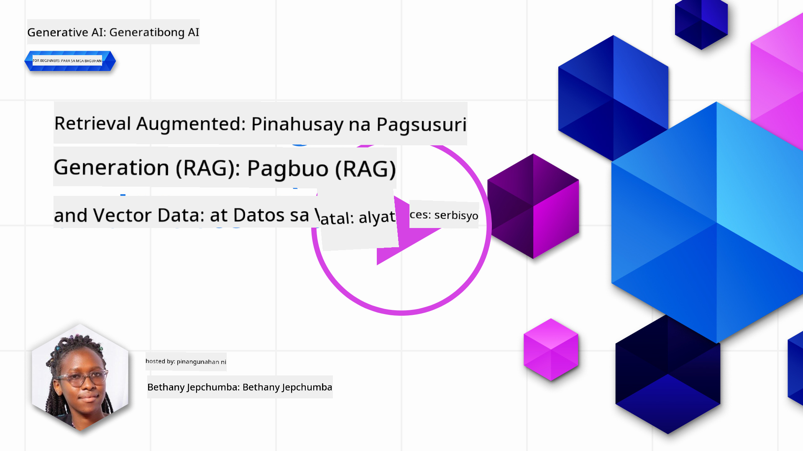
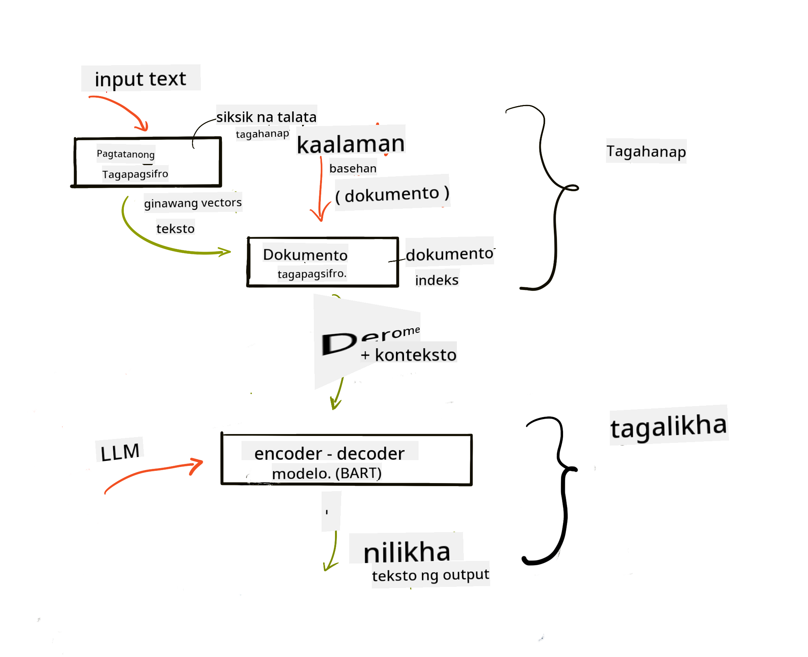
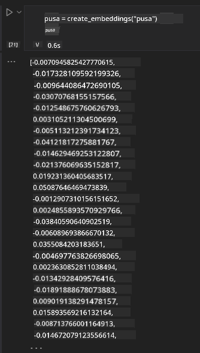

<!--
CO_OP_TRANSLATOR_METADATA:
{
  "original_hash": "e2861bbca91c0567ef32bc77fe054f9e",
  "translation_date": "2025-05-20T01:38:11+00:00",
  "source_file": "15-rag-and-vector-databases/README.md",
  "language_code": "tl"
}
-->
# Retrieval Augmented Generation (RAG) at Mga Vector Database

[](https://aka.ms/gen-ai-lesson15-gh?WT.mc_id=academic-105485-koreyst)

Sa aralin ng mga search application, sandali nating tinalakay kung paano i-integrate ang sarili mong data sa Large Language Models (LLMs). Sa araling ito, mas malalim nating tatalakayin ang mga konsepto ng pag-ground ng iyong data sa iyong LLM application, ang mga mekanismo ng proseso at ang mga pamamaraan para sa pag-iimbak ng data, kabilang ang mga embeddings at teksto.

> **Darating na ang Video**

## Panimula

Sa araling ito, tatalakayin natin ang sumusunod:

- Isang pagpapakilala sa RAG, ano ito at bakit ito ginagamit sa AI (artificial intelligence).

- Pag-unawa kung ano ang mga vector database at paglikha ng isa para sa ating application.

- Isang praktikal na halimbawa kung paano i-integrate ang RAG sa isang application.

## Mga Layunin sa Pagkatuto

Pagkatapos makumpleto ang araling ito, magagawa mong:

- Ipaliwanag ang kahalagahan ng RAG sa pagkuha at pagproseso ng data.

- I-setup ang RAG application at i-ground ang iyong data sa isang LLM

- Epektibong pag-integrate ng RAG at Vector Databases sa mga LLM Applications.

## Ang Ating Scenario: pagpapahusay ng ating LLMs gamit ang sarili nating data

Para sa araling ito, nais nating idagdag ang ating sariling mga tala sa startup ng edukasyon, na nagpapahintulot sa chatbot na makakuha ng higit pang impormasyon sa iba't ibang paksa. Gamit ang mga tala na mayroon tayo, mas makakapag-aral ang mga mag-aaral at mas mauunawaan ang iba't ibang paksa, na nagpapadali sa pagrerebyu para sa kanilang mga pagsusulit. Upang likhain ang ating scenario, gagamitin natin ang:

- `Azure OpenAI:` ang LLM na gagamitin natin upang lumikha ng ating chatbot

- `AI for beginners' lesson on Neural Networks`: ito ang magiging data na i-ground natin sa ating LLM

- `Azure AI Search` at `Azure Cosmos DB:` vector database upang iimbak ang ating data at lumikha ng isang search index

Makakagawa ang mga gumagamit ng mga practice quiz mula sa kanilang mga tala, mga flash card para sa pagrerebyu at ibuod ito sa mga maikling pangkalahatang-ideya. Upang makapagsimula, tingnan natin kung ano ang RAG at kung paano ito gumagana:

## Retrieval Augmented Generation (RAG)

Ang isang LLM powered chatbot ay nagpoproseso ng mga user prompt upang makabuo ng mga tugon. Ito ay idinisenyo upang maging interactive at makipag-ugnayan sa mga gumagamit sa isang malawak na hanay ng mga paksa. Gayunpaman, ang mga tugon nito ay limitado sa konteksto na ibinigay at sa pundasyong training data nito. Halimbawa, ang cutoff ng kaalaman ng GPT-4 ay noong Setyembre 2021, nangangahulugang kulang ito ng kaalaman sa mga kaganapan na naganap pagkatapos ng panahong ito. Bukod dito, ang data na ginamit upang sanayin ang LLMs ay hindi kasama ang mga kumpidensyal na impormasyon tulad ng personal na mga tala o isang manwal ng produkto ng kumpanya.

### Paano gumagana ang RAGs (Retrieval Augmented Generation)


Ipagpalagay na nais mong mag-deploy ng isang chatbot na lumikha ng mga quiz mula sa iyong mga tala, kakailanganin mo ng koneksyon sa knowledge base. Dito pumapasok ang RAG. Ang RAGs ay gumagana sa ganitong paraan:

- **Knowledge base:** Bago ang retrieval, ang mga dokumentong ito ay kailangang ma-ingest at ma-preprocess, karaniwang hinahati ang malalaking dokumento sa mas maliliit na bahagi, ini-transform ang mga ito sa text embedding at iniimbak sa isang database.

- **User Query:** nagtatanong ang user ng isang tanong

- **Retrieval:** Kapag nagtatanong ang isang user, kinukuha ng embedding model ang kaugnay na impormasyon mula sa ating knowledge base upang magbigay ng higit pang konteksto na isasama sa prompt.

- **Augmented Generation:** pinapahusay ng LLM ang tugon nito batay sa data na nakuha. Pinapayagan nito ang tugon na mabuo hindi lamang batay sa pre-trained data kundi pati na rin sa kaugnay na impormasyon mula sa idinagdag na konteksto. Ang nakuha na data ay ginagamit upang palakasin ang mga tugon ng LLM. Pagkatapos ay nagbabalik ang LLM ng sagot sa tanong ng user.



Ang architecture para sa RAGs ay ipinatutupad gamit ang mga transformer na binubuo ng dalawang bahagi: isang encoder at isang decoder. Halimbawa, kapag nagtatanong ang isang user, ang input text ay 'encoded' sa mga vector na kumukuha ng kahulugan ng mga salita at ang mga vector ay 'decoded' sa ating document index at bumubuo ng bagong teksto batay sa user query. Ginagamit ng LLM ang parehong encoder-decoder model upang makabuo ng output.

Dalawang paraan kapag ipinatutupad ang RAG ayon sa iminungkahing papel: [Retrieval-Augmented Generation para sa mga Knowledge intensive NLP (natural language processing software) Tasks](https://arxiv.org/pdf/2005.11401.pdf?WT.mc_id=academic-105485-koreyst) ay:

- **_RAG-Sequence_** gamit ang nakuha na mga dokumento upang hulaan ang pinakamahusay na posibleng sagot sa isang user query

- **RAG-Token** gamit ang mga dokumento upang bumuo ng susunod na token, pagkatapos ay kunin ang mga ito upang sagutin ang tanong ng user

### Bakit mo gagamitin ang RAGs?

- **Information richness:** tinitiyak na ang mga text responses ay up to date at kasalukuyan. Sa gayon, pinapahusay nito ang performance sa mga domain specific tasks sa pamamagitan ng pag-access sa internal knowledge base.

- Binabawasan ang fabrication sa pamamagitan ng paggamit ng **verifiable data** sa knowledge base upang magbigay ng konteksto sa mga tanong ng user.

- Ito ay **cost effective** dahil mas matipid ang mga ito kumpara sa fine-tuning ng isang LLM

## Paglikha ng isang knowledge base

Ang ating application ay batay sa ating personal na data i.e., ang Neural Network lesson sa AI For Beginners curriculum.

### Vector Databases

Ang isang vector database, hindi katulad ng mga tradisyonal na database, ay isang espesyal na database na idinisenyo upang mag-imbak, mag-manage at maghanap ng mga embedded vectors. Iniimbak nito ang mga numerical na representasyon ng mga dokumento. Ang paghahati ng data sa numerical embeddings ay nagpapadali para sa ating AI system na maunawaan at ma-proseso ang data.

Iniimbak natin ang ating mga embeddings sa vector databases dahil ang LLMs ay may limitasyon sa bilang ng mga token na tinatanggap nila bilang input. Dahil hindi mo maipapasa ang buong embeddings sa isang LLM, kailangan nating hatiin ang mga ito sa mga chunks at kapag nagtatanong ang isang user, ang mga embeddings na pinakakatulad sa tanong ang ibabalik kasama ng prompt. Ang chunking ay nakakatipid din sa gastos sa bilang ng mga token na dumadaan sa isang LLM.

Ilan sa mga kilalang vector databases ay ang Azure Cosmos DB, Clarifyai, Pinecone, Chromadb, ScaNN, Qdrant at DeepLake. Maaari kang lumikha ng isang Azure Cosmos DB model gamit ang Azure CLI sa pamamagitan ng sumusunod na command:

```bash
az login
az group create -n <resource-group-name> -l <location>
az cosmosdb create -n <cosmos-db-name> -r <resource-group-name>
az cosmosdb list-keys -n <cosmos-db-name> -g <resource-group-name>
```

### Mula sa teksto patungo sa embeddings

Bago natin iimbak ang ating data, kailangan muna natin itong i-convert sa vector embeddings bago ito iimbak sa database. Kung ikaw ay nagtatrabaho sa malalaking dokumento o mahabang teksto, maaari mo itong hatiin batay sa mga query na inaasahan mo. Ang chunking ay maaaring gawin sa antas ng pangungusap, o sa antas ng talata. Dahil ang chunking ay nagdedeliver ng mga kahulugan mula sa mga salitang nakapaligid sa kanila, maaari kang magdagdag ng iba pang konteksto sa isang chunk, halimbawa, sa pamamagitan ng pagdaragdag ng pamagat ng dokumento o paglalagay ng ilang teksto bago o pagkatapos ng chunk. Maaari mong hatiin ang data tulad ng sumusunod:

```python
def split_text(text, max_length, min_length):
    words = text.split()
    chunks = []
    current_chunk = []

    for word in words:
        current_chunk.append(word)
        if len(' '.join(current_chunk)) < max_length and len(' '.join(current_chunk)) > min_length:
            chunks.append(' '.join(current_chunk))
            current_chunk = []

    # If the last chunk didn't reach the minimum length, add it anyway
    if current_chunk:
        chunks.append(' '.join(current_chunk))

    return chunks
```

Kapag nahati na, maaari nating i-embed ang ating teksto gamit ang iba't ibang embedding models. Ilan sa mga modelong maaari mong gamitin ay: word2vec, ada-002 ng OpenAI, Azure Computer Vision at marami pang iba. Ang pagpili ng modelong gagamitin ay nakasalalay sa mga wikang ginagamit mo, ang uri ng nilalamang naka-encode (teksto/larawan/audio), ang laki ng input na maaari nitong i-encode at haba ng embedding output.

Isang halimbawa ng naka-embed na teksto gamit ang modelong `text-embedding-ada-002` ng OpenAI ay:


## Retrieval at Vector Search

Kapag nagtatanong ang isang user, ini-transform ng retriever ito sa isang vector gamit ang query encoder, pagkatapos ay hinahanap nito sa ating document search index ang mga kaugnay na vectors sa dokumento na may kaugnayan sa input. Kapag tapos na, kino-convert nito ang parehong input vector at document vectors sa teksto at ipinapasa ito sa LLM.

### Retrieval

Nangyayari ang retrieval kapag ang sistema ay sumusubok na mabilis na mahanap ang mga dokumento mula sa index na tumutugon sa search criteria. Ang layunin ng retriever ay makuha ang mga dokumento na gagamitin upang magbigay ng konteksto at i-ground ang LLM sa iyong data.

May ilang paraan upang magsagawa ng search sa loob ng ating database tulad ng:

- **Keyword search** - ginagamit para sa text searches

- **Semantic search** - gumagamit ng semantic na kahulugan ng mga salita

- **Vector search** - kino-convert ang mga dokumento mula sa teksto patungo sa vector representations gamit ang embedding models. Ang retrieval ay gagawin sa pamamagitan ng pag-query sa mga dokumento na ang vector representations ay pinakamalapit sa tanong ng user.

- **Hybrid** - isang kombinasyon ng parehong keyword at vector search.

Isang hamon sa retrieval ay kapag walang katulad na tugon sa query sa database, ang sistema ay magbabalik ng pinakamahusay na impormasyong makukuha nila, gayunpaman, maaari kang gumamit ng mga taktika tulad ng pag-set up ng maximum distance para sa relevance o paggamit ng hybrid search na pinagsasama ang parehong keyword at vector search. Sa araling ito gagamitin natin ang hybrid search, isang kombinasyon ng parehong vector at keyword search. Iimbak natin ang ating data sa isang dataframe na may mga column na naglalaman ng mga chunks pati na rin ang mga embeddings.

### Vector Similarity

Ang retriever ay maghahanap sa knowledge database para sa mga embeddings na malapit sa isa't isa, ang pinakamalapit na kapitbahay, dahil sila ay mga teksto na magkatulad. Sa senaryo na nagtatanong ang isang user, ito ay unang na-embed at pagkatapos ay itinugma sa mga katulad na embeddings. Ang karaniwang sukat na ginagamit upang malaman kung gaano kahawig ang iba't ibang vectors ay ang cosine similarity na batay sa anggulo sa pagitan ng dalawang vectors.

Maaari nating sukatin ang pagkakatulad gamit ang iba pang alternatibo tulad ng Euclidean distance na ang tuwid na linya sa pagitan ng mga endpoints ng vector at dot product na sumusukat sa kabuuan ng mga produkto ng magkakasunod na elemento ng dalawang vectors.

### Search index

Kapag gumagawa ng retrieval, kailangan nating bumuo ng isang search index para sa ating knowledge base bago tayo magsagawa ng search. Ang isang index ay mag-iimbak ng ating mga embeddings at mabilis na makakakuha ng mga pinakakatulad na chunks kahit na sa isang malaking database. Maaari tayong lumikha ng ating index nang lokal gamit ang:

```python
from sklearn.neighbors import NearestNeighbors

embeddings = flattened_df['embeddings'].to_list()

# Create the search index
nbrs = NearestNeighbors(n_neighbors=5, algorithm='ball_tree').fit(embeddings)

# To query the index, you can use the kneighbors method
distances, indices = nbrs.kneighbors(embeddings)
```

### Re-ranking

Kapag na-query mo na ang database, maaaring kailanganin mong i-sort ang mga resulta mula sa pinaka-kaugnay. Ang isang reranking LLM ay gumagamit ng Machine Learning upang mapabuti ang relevance ng mga search results sa pamamagitan ng pag-aayos ng mga ito mula sa pinaka-kaugnay. Gamit ang Azure AI Search, ang reranking ay awtomatikong ginagawa para sa iyo gamit ang isang semantic reranker. Isang halimbawa kung paano gumagana ang reranking gamit ang pinakamalapit na kapitbahay:

```python
# Find the most similar documents
distances, indices = nbrs.kneighbors([query_vector])

index = []
# Print the most similar documents
for i in range(3):
    index = indices[0][i]
    for index in indices[0]:
        print(flattened_df['chunks'].iloc[index])
        print(flattened_df['path'].iloc[index])
        print(flattened_df['distances'].iloc[index])
    else:
        print(f"Index {index} not found in DataFrame")
```

## Pagsasama-sama ng lahat

Ang huling hakbang ay ang pagdaragdag ng ating LLM sa halo upang makakuha ng mga tugon na naka-ground sa ating data. Maaari natin itong ipatupad tulad ng sumusunod:

```python
user_input = "what is a perceptron?"

def chatbot(user_input):
    # Convert the question to a query vector
    query_vector = create_embeddings(user_input)

    # Find the most similar documents
    distances, indices = nbrs.kneighbors([query_vector])

    # add documents to query  to provide context
    history = []
    for index in indices[0]:
        history.append(flattened_df['chunks'].iloc[index])

    # combine the history and the user input
    history.append(user_input)

    # create a message object
    messages=[
        {"role": "system", "content": "You are an AI assistant that helps with AI questions."},
        {"role": "user", "content": history[-1]}
    ]

    # use chat completion to generate a response
    response = openai.chat.completions.create(
        model="gpt-4",
        temperature=0.7,
        max_tokens=800,
        messages=messages
    )

    return response.choices[0].message

chatbot(user_input)
```

## Pagsusuri sa ating application

### Mga Sukatan ng Pagsusuri

- Kalidad ng mga tugon na ibinigay na tinitiyak na ito ay tunog natural, fluent at parang tao

- Groundedness ng data: pagsusuri kung ang tugon na nagmula sa ibinigay na mga dokumento

- Relevance: pagsusuri kung ang tugon ay tumutugma at may kaugnayan sa tanong na tinanong

- Fluency - kung ang tugon ay may katuturan sa gramatika

## Mga Gamit ng paggamit ng RAG (Retrieval Augmented Generation) at vector databases

Mayroong maraming iba't ibang mga gamit kung saan ang mga function calls ay maaaring mapabuti ang iyong app tulad ng:

- Tanong at Pagsagot: pag-ground ng iyong data ng kumpanya sa isang chat na maaaring gamitin ng mga empleyado upang magtanong.

- Mga Sistema ng Rekomendasyon: kung saan maaari kang lumikha ng isang sistema na nagtutugma sa pinaka-katulad na mga halaga halimbawa mga pelikula, restaurant at marami pang iba.

- Mga serbisyo ng Chatbot: maaari mong iimbak ang kasaysayan ng chat at i-personalize ang pag-uusap batay sa data ng user.

- Paghahanap ng larawan batay sa vector embeddings, kapaki-pakinabang kapag gumagawa ng pagkilala ng larawan at pagtukoy ng anomaly.

## Buod

Tinalakay natin ang mga pangunahing bahagi ng RAG mula sa pagdaragdag ng ating data sa application, ang query ng user at output. Upang mapadali ang paglikha ng RAG, maaari mong gamitin ang mga framework tulad ng Semanti Kernel, Langchain o Autogen.

## Takdang Aralin

Upang ipagpatuloy ang iyong pag-aaral ng Retrieval Augmented Generation (RAG) maaari kang bumuo:

- Bumuo ng isang front-end para sa application gamit ang framework ng iyong pinili

- Gamitin ang isang framework, alinman sa LangChain o Semantic Kernel, at muling likhain ang iyong application.

Binabati kita sa pagkumpleto ng aralin 👏.

## Ang Pagkatuto ay Hindi Dito Nagtatapos, Ipagpatuloy ang Paglalakbay

Pagkatapos makumpleto ang araling ito, tingnan ang aming [Generative AI Learning collection](https://aka.ms/genai-collection?WT.mc_id=academic-105485-koreyst) upang ipagpatuloy ang pag-level up ng iyong kaalaman sa Generative AI!

**Paunawa**:  
Ang dokumentong ito ay isinalin gamit ang serbisyo ng AI na pagsasalin [Co-op Translator](https://github.com/Azure/co-op-translator). Bagamat sinisikap namin ang kawastuhan, mangyaring tandaan na ang mga awtomatikong pagsasalin ay maaaring maglaman ng mga error o hindi pagkakatumpak. Ang orihinal na dokumento sa kanyang katutubong wika ay dapat ituring na mapagkakatiwalaang pinagmulan. Para sa mahalagang impormasyon, inirerekomenda ang propesyonal na pagsasalin ng tao. Hindi kami mananagot sa anumang hindi pagkakaintindihan o maling interpretasyon na dulot ng paggamit ng pagsasaling ito.