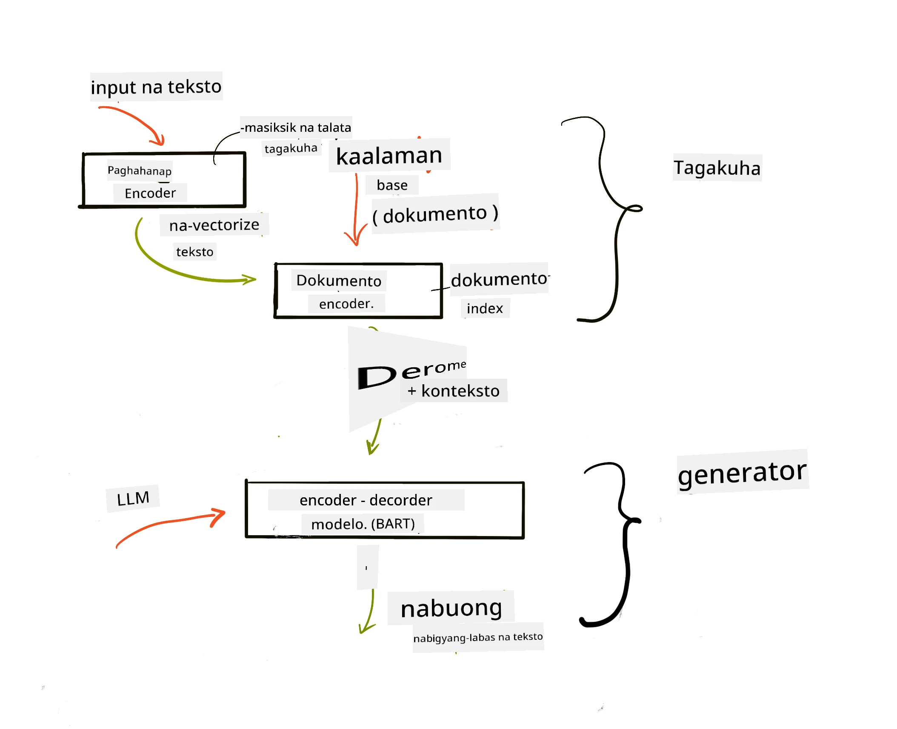

# Retrieval Augmented Generation (RAG) at Mga Vector Databases

[](https://youtu.be/4l8zhHUBeyI?si=BmvDmL1fnHtgQYkL)

Sa aralin tungkol sa mga search application, mabilis nating natutunan kung paano i-integrate ang sarili mong data sa Large Language Models (LLMs). Sa araling ito, tatalakayin pa natin nang mas malalim ang mga konsepto ng pagpapatibay ng iyong data sa iyong LLM application, ang mekaniks ng proseso, at ang mga paraan ng pag-iimbak ng data, kabilang ang parehong embeddings at teksto.

> **Video Darating Pa**

## Panimula

Sa araling ito, tatalakayin natin ang mga sumusunod:

- Isang pagpapakilala sa RAG, kung ano ito at bakit ito ginagamit sa AI (artificial intelligence).

- Pag-unawa kung ano ang mga vector database at paano gumawa ng isa para sa ating aplikasyon.

- Isang praktikal na halimbawa kung paano mag-integrate ng RAG sa isang aplikasyon.

## Mga Layunin sa Pagkatuto

Pagkatapos makumpleto ang araling ito, magagawa mong:

- Ipaliwanag ang kahalagahan ng RAG sa pagkuha at pagproseso ng data.

- Mag-setup ng RAG na aplikasyon at i-ground ang iyong data sa isang LLM.

- Mabisang integrasyon ng RAG at mga Vector Database sa mga LLM Application.

## Ang Ating Senaryo: pagpapahusay ng ating mga LLM gamit ang sariling data

Para sa araling ito, nais nating idagdag ang sariling mga tala sa education startup, na nagpapahintulot sa chatbot na makakuha ng mas maraming impormasyon sa iba't ibang asignatura. Gamit ang mga tala na meron tayo, mas magiging mahusay ang pag-aaral at pag-unawa ng mga mag-aaral sa iba't ibang paksa, na nagpapadali sa kanilang paghahanda para sa mga pagsusulit. Para sa ating senaryo, gagamitin natin:

- `Azure OpenAI:` ang LLM na gagamitin natin upang gumawa ng chatbot

- `AI for beginners' lesson on Neural Networks`: ito ang magiging data na ipapaloob natin sa LLM

- `Azure AI Search` at `Azure Cosmos DB:` vector database para iimbak ang data at gumawa ng search index

Makakagawa ang mga users ng practice quizzes mula sa kanilang mga tala, revision flash cards, at kayang ibuod ito sa mga maikling overview. Para magsimula, tignan muna natin kung ano ang RAG at paano ito gumagana:

## Retrieval Augmented Generation (RAG)

Isang chatbot na pinapagana ng LLM ang nagpoproseso ng mga prompt ng user upang makabuo ng mga sagot. Dinisenyo ito upang maging interaktibo at makipag-ugnayan sa mga user sa malawak na hanay ng mga paksa. Ngunit, limitado ang mga sagot nito sa ibinigay na konteksto at sa training data nito. Halimbawa, ang cutoff ng kaalaman ng GPT-4 ay Setyembre 2021, ibig sabihin, wala itong kaalaman sa mga pangyayari pagkatapos ng panahong iyon. Bukod dito, ang data na ginamit sa pag-train ng LLMs ay hindi kasama ang mga kumpidensyal na impormasyon tulad ng personal na tala o manual ng produkto ng isang kumpanya.

### Paano gumagana ang mga RAG (Retrieval Augmented Generation)


Sabihin nating gusto mong mag-deploy ng chatbot na gumagawa ng mga pagsusulit mula sa iyong mga tala, kakailanganin mo ng koneksyon sa knowledge base. Dito pumapasok ang RAG. Ganito ang operasyon ng mga RAG:

- **Knowledge base:** Bago ang retrieval, kailangang i-ingest at i-preprocess ang mga dokumentong ito, karaniwang hinahati ang malalaking dokumento sa mas maliliit na bahagi, ine-embed ang mga ito sa teksto, at iniimbak sa database.

- **User Query:** nagtatanong ang user ng tanong

- **Retrieval:** Kapag nagtatanong ang user, dinadala ng embedding model ang kaugnay na impormasyon mula sa knowledge base upang magbigay ng mas maraming konteksto na isasama sa prompt.

- **Augmented Generation:** pinapalakas ng LLM ang sagot nito batay sa retrieved na data. Pinapayagan nito ang sagot na hindi lamang batay sa pre-trained na data kundi pati sa makabuluhang impormasyon mula sa dagdag na konteksto. Ginagamit ang retrieved na data upang palakasin ang mga sagot ng LLM. Pagkatapos ay ibinabalik ng LLM ang sagot sa tanong ng user.



Ang arkitektura para sa mga RAG ay ipinatutupad gamit ang mga transformer na binubuo ng dalawang bahagi: encoder at decoder. Halimbawa, kapag nagtatanong ang user, ang input na teksto ay 'encoded' sa mga vector na kumakatawan sa kahulugan ng mga salita at ang mga vector ay ni-'decode' sa ating document index at lumilikha ng bagong teksto base sa tanong ng user. Ginagamit ng LLM ang parehong encoder-decoder model upang makabuo ng output.

Dalawang paraan sa pagpapatupad ng RAG ayon sa panukalang papel: [Retrieval-Augmented Generation for Knowledge intensive NLP (natural language processing software) Tasks](https://arxiv.org/pdf/2005.11401.pdf?WT.mc_id=academic-105485-koreyst) ay:

- **_RAG-Sequence_** gamit ang retrieved na mga dokumento upang hulaan ang pinakamahusay na sagot sa tanong ng user

- **RAG-Token** gamit ang mga dokumento upang i-generate ang susunod na token, pagkatapos ay i-retrieve ito para sagutin ang query ng user

### Bakit gagamitin ang mga RAG?

- **Kakayahan sa impormasyon:** tiniyak na ang mga sagot sa teksto ay bago at napapanahon. Pinapahusay nito ang pagganap sa mga domain-specific na gawain sa pamamagitan ng pag-access sa internal knowledge base.

- Binabawasan ang pagbayang sagot (fabrication) gamit ang **maaring mapatunayan na data** sa knowledge base upang bigyang konteksto ang mga tanong ng user.

- **Mas matipid** dahil mas mura ito kumpara sa fine-tuning ng isang LLM

## Paggawa ng knowledge base

Ang ating aplikasyon ay nakabase sa sariling data, halimbawa ay ang Neural Network lesson sa AI For Beginners curriculum.

### Mga Vector Database

Ang vector database, hindi katulad ng mga tradisyunal na database, ay isang espesyal na database na dinisenyo upang mag-imbak, mag-manage, at maghanap ng mga embedded vectors. Iniimbak nito ang numerikal na representasyon ng mga dokumento. Ang paghati-hati ng data sa mga numerikal na embeddings ay nagpapadali sa ating AI system na maunawaan at maproseso ang data.

Iniimbak natin ang embeddings sa mga vector database dahil may limitasyon ang LLM sa dami ng tokens na tinatanggap nito bilang input. Dahil hindi pwedeng ipasa lahat ng embeddings sa LLM, kailangang hatiin ang mga ito sa mga bahagi at kapag nagtanong ang user, ang embeddings na pinaka-malapit sa tanong ay ibabalik kasama ang prompt. Nakakatulong din ang paghati sa pagbaba ng gastos sa bilang ng mga token na ipinapasa sa isang LLM.

Ilan sa mga kilalang vector database ay Azure Cosmos DB, Clarifyai, Pinecone, Chromadb, ScaNN, Qdrant, at DeepLake. Maaari kang gumawa ng modelo sa Azure Cosmos DB gamit ang Azure CLI sa sumusunod na utos:

```bash
az login
az group create -n <resource-group-name> -l <location>
az cosmosdb create -n <cosmos-db-name> -r <resource-group-name>
az cosmosdb list-keys -n <cosmos-db-name> -g <resource-group-name>
```

### Mula teksto hanggang embeddings

Bago natin i-imbak ang ating data, kailangan muna itong gawing vector embeddings bago i-store sa database. Kapag nagtatrabaho ka sa mga malalaking dokumento o mahahabang teksto, maaari mong hatiin ang mga ito base sa inaasahang mga query. Pwedeng hatiin ang mga ito sa antas ng pangungusap o talata. Dahil ang paghahati ay nakukuha ang kahulugan mula sa mga salitang nakapaligid, maaari kang magdagdag ng ibang konteksto sa isang chunk, halimbawa, sa pamamagitan ng paglagay ng pamagat ng dokumento o ilang teksto bago o pagkatapos ng chunk. Maaari mong hatiin ang data sa ganito:

```python
def split_text(text, max_length, min_length):
    words = text.split()
    chunks = []
    current_chunk = []

    for word in words:
        current_chunk.append(word)
        if len(' '.join(current_chunk)) < max_length and len(' '.join(current_chunk)) > min_length:
            chunks.append(' '.join(current_chunk))
            current_chunk = []

    # Kung ang huling bahagi ay hindi umabot sa pinakamababang haba, idagdag pa rin ito
    if current_chunk:
        chunks.append(' '.join(current_chunk))

    return chunks
```

Kapag nahati na, maaari na nating i-embed ang teksto gamit ang iba't ibang embedding models. Ilan sa mga modelong magagamit ay: word2vec, ada-002 ng OpenAI, Azure Computer Vision, at marami pang iba. Ang pagpili ng modelong gagamitin ay depende sa wika na ginagamit mo, uri ng content na ie-encode (teksto/larawan/audio), laki ng input na kaya nitong i-encode, at haba ng embedding output.

Isang halimbawa ng embedded na teksto gamit ang OpenAI na `text-embedding-ada-002` model ay:


## Retrieval at Vector Search

Kapag nagtatanong ang user, pinapasa ng retriever ang tanong bilang vector gamit ang query encoder, pagkatapos ay hahanapin nito sa ating document search index ang mga kaugnay na vector sa dokumento na may kaugnayan sa input. Kapag natapos, iko-convert nito ang parehong input vector at document vectors sa teksto at ipapasa ang mga ito sa LLM.

### Retrieval

Nangyayari ang retrieval kapag sinubukan ng sistema na mabilisang hanapin ang mga dokumento mula sa index na pumapasa sa mga criteria ng paghahanap. Layunin ng retriever na makahanap ng mga dokumento na gagamitin upang magbigay ng konteksto at i-ground ang LLM sa iyong data.

Ilan sa mga paraan para magsagawa ng paghahanap sa database ay:

- **Keyword search** - ginagamit sa paghahanap ng teksto

- **Vector search** - kinokonvert ang mga dokumento mula teksto sa vector representations gamit ang embedding models, na nagpapahintulot sa **semantic search** gamit ang kahulugan ng mga salita. Magaganap ang retrieval sa pamamagitan ng pag-query sa mga dokumento kung saan ang vector representations ay pinakamalapit sa tanong ng user.

- **Hybrid** - kumbinasyon ng keyword at vector search.

Isang hamon sa retrieval ay kapag walang katulad na sagot sa query sa database, ibabalik ng sistema ang pinakamahusay na impormasyon na makukuha nito, ngunit maaari mong gamitin ang mga taktika tulad ng pag-set ng maximum na distansya para sa relevance o paggamit ng hybrid search na pinagsasama ang keyword at vector search. Sa araling ito gagamit tayo ng hybrid search, kumbinasyon ng vector at keyword search. Iimbak natin ang data sa dataframe na may mga kolum na naglalaman ng mga chunks pati na rin ng embeddings.

### Vector Similarity

Hahanapin ng retriever sa knowledge database ang mga embeddings na magkalapit, ang pinakamalapit na kapitbahay, dahil ito ay mga teksto na magkatulad. Sa senaryo na nagtatanong ang user, una itong ie-embed at pagkatapos ay itatapat sa mga katulad na embeddings. Ang karaniwang ginagamit na sukat para malaman kung gaano magkakatulad ang iba't ibang vector ay cosine similarity na nakabatay sa anggulo sa pagitan ng dalawang vector.

Maaari rin nating sukatin ang similarity gamit ang ibang alternatibo tulad ng Euclidean distance na sukat ng tuwid na linya sa pagitan ng dulo ng mga vectors at dot product na sumusukat sa kabuuan ng produkto ng magkatugmang elemento ng dalawang vectors.

### Search index

Kapag ginagawa ang retrieval, kailangan nating gumawa ng search index para sa ating knowledge base bago magsagawa ng paghahanap. Iniimbak ng index ang ating mga embeddings at mabilis na naghahanap ng pinaka-katulad na mga chunks kahit na sa malaking database. Maaari tayong gumawa ng index nang lokal gamit ang:

```python
from sklearn.neighbors import NearestNeighbors

embeddings = flattened_df['embeddings'].to_list()

# Gumawa ng search index
nbrs = NearestNeighbors(n_neighbors=5, algorithm='ball_tree').fit(embeddings)

# Upang mag-query sa index, maaari mong gamitin ang kneighbors na pamamaraan
distances, indices = nbrs.kneighbors(embeddings)
```

### Re-ranking

Kapag nakapag-query ka na sa database, maaaring kailanganin mong isaayos ang mga resulta mula sa pinaka-nauukol. Gumagamit ang reranking LLM ng Machine Learning upang mapaganda ang kaugnayan ng resulta ng paghahanap sa pamamagitan ng pag-aayos ng mga ito mula sa pinaka-nauukol. Sa Azure AI Search, ang reranking ay awtomatikong ginagawa gamit ang isang semantic reranker. Halimbawa kung paano gumagana ang reranking gamit ang nearest neighbours:

```python
# Hanapin ang mga pinaka-magkatulad na dokumento
distances, indices = nbrs.kneighbors([query_vector])

index = []
# I-print ang mga pinaka-magkatulad na dokumento
for i in range(3):
    index = indices[0][i]
    for index in indices[0]:
        print(flattened_df['chunks'].iloc[index])
        print(flattened_df['path'].iloc[index])
        print(flattened_df['distances'].iloc[index])
    else:
        print(f"Index {index} not found in DataFrame")
```

## Pagsasama-sama ng lahat

Ang huling hakbang ay ang pagdagdag ng ating LLM upang makakuha ng mga sagot na naka-ground sa ating data. Maaari natin itong ipatupad sa ganito:

```python
user_input = "what is a perceptron?"

def chatbot(user_input):
    # I-convert ang tanong sa isang query vector
    query_vector = create_embeddings(user_input)

    # Hanapin ang mga dokumentong pinaka-magkatulad
    distances, indices = nbrs.kneighbors([query_vector])

    # idagdag ang mga dokumento sa query upang magbigay ng konteksto
    history = []
    for index in indices[0]:
        history.append(flattened_df['chunks'].iloc[index])

    # pagsamahin ang kasaysayan at ang input ng gumagamit
    history.append(user_input)

    # gumawa ng isang message object
    messages=[
        {"role": "system", "content": "You are an AI assistant that helps with AI questions."},
        {"role": "user", "content": "\n\n".join(history) }
    ]

    # gamitin ang chat completion upang gumawa ng tugon
    response = openai.chat.completions.create(
        model="gpt-4",
        temperature=0.7,
        max_tokens=800,
        messages=messages
    )

    return response.choices[0].message

chatbot(user_input)
```

## Pagsusuri ng ating aplikasyon

### Mga Sukatan sa Pagsusuri

- Kalidad ng mga sagot na ibinigay na nagpapakita ng natural, fluent, at parang tao na pagsasalita

- Groundedness ng data: pagsusuri kung ang sagot ay nagmula sa ibinigay na mga dokumento

- Relevance: pagsusuri kung ang sagot ay tumutugma at may kaugnayan sa tanong

- Fluency - kung ang sagot ay may tamang gramatika

## Mga Gamit ng RAG (Retrieval Augmented Generation) at mga vector database

Maraming iba't ibang gamit kung saan makatutulong ang function calls sa pagpapabuti ng iyong app tulad ng:

- Question and Answering: pag-ground ng data ng kumpanya sa chat na magagamit ng mga empleyado upang magtanong.

- Recommendation Systems: kung saan maaari kang gumawa ng sistema na tumutugma sa pinaka-magkatulad na mga halaga halimbawa mga pelikula, restawran, at marami pa.

- Chatbot services: maaari mong iimbak ang history ng chat at gawing personalized ang pag-uusap base sa data ng user.

- Image search gamit ang vector embeddings, kapaki-pakinabang sa image recognition at anomaly detection.

## Buod

Napag-aralan natin ang mga pangunahing bahagi ng RAG mula sa pagdagdag ng ating data sa aplikasyon, ang query ng user, at output. Para pasimplehin ang paggawa ng RAG, maaari mong gamitin ang mga frameworks tulad ng Semantic Kernel, Langchain, o Autogen.

## Takdang Aralin

Para ipagpatuloy ang iyong pag-aaral tungkol sa Retrieval Augmented Generation (RAG), maaari kang gumawa ng:

- Gumawa ng front-end para sa aplikasyon gamit ang framework na pipiliin mo

- Gamitin ang isang framework, alinman ang LangChain o Semantic Kernel, at muling likhain ang iyong aplikasyon.

Binabati kita sa pagkumpleto ng aralin 👏.

## Hindi dito natatapos ang pagkatuto, ipagpatuloy ang Paglalakbay

Pagkatapos makumpleto ang araling ito, tingnan ang aming [Generative AI Learning collection](https://aka.ms/genai-collection?WT.mc_id=academic-105485-koreyst) upang ipagpatuloy ang pagpapalawak ng iyong kaalaman sa Generative AI!

---

<!-- CO-OP TRANSLATOR DISCLAIMER START -->
**Pahayag ng Pagwawaksi**:
Ang dokumentong ito ay isinalin gamit ang serbisyo ng AI na pagsasalin na [Co-op Translator](https://github.com/Azure/co-op-translator). Bagamat nagsusumikap kami para sa katumpakan, pakatunayan na ang mga awtomatikong pagsasalin ay maaaring maglaman ng mga pagkakamali o maling interpretasyon. Ang orihinal na dokumento sa orihinal nitong wika ang dapat ituring na opisyal na sanggunian. Para sa mga mahahalagang impormasyon, inirerekomenda ang propesyonal na pagsasalin ng tao. Hindi kami mananagot sa anumang hindi pagkakaunawaan o maling pagpapakahulugan na nagmula sa paggamit ng pagsasaling ito.
<!-- CO-OP TRANSLATOR DISCLAIMER END -->