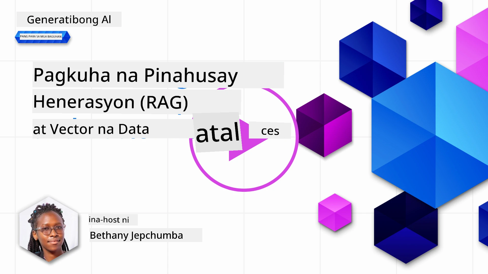
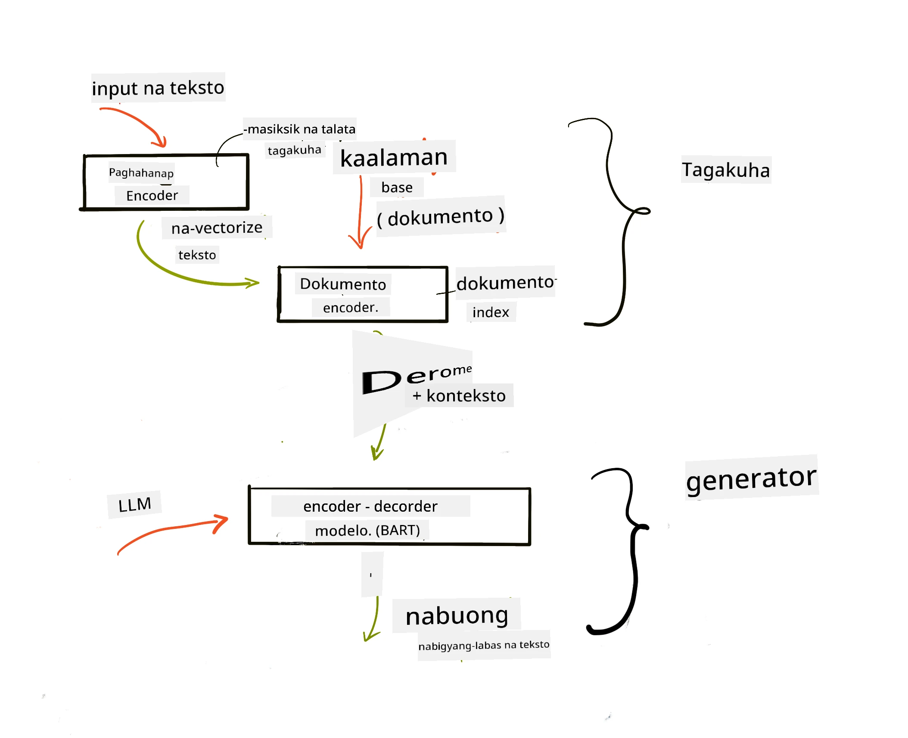

# Retrieval Augmented Generation (RAG) at Vector Databases

[](https://youtu.be/4l8zhHUBeyI?si=BmvDmL1fnHtgQYkL)

Sa lesson tungkol sa mga search application, pansamantala nating natutunan kung paano i-integrate ang sarili mong data sa Large Language Models (LLMs). Sa lesson na ito, mas palalalimin pa natin ang mga konsepto ng grounding ng iyong data sa iyong LLM application, ang mekaniks ng proseso at mga pamamaraan para sa pag-iimbak ng data, kabilang ang embeddings at teksto.

> **Darating na Video**

## Panimula

Sa lesson na ito tatalakayin natin ang mga sumusunod:

- Isang panimula sa RAG, kung ano ito at bakit ito ginagamit sa AI (artificial intelligence).

- Pag-unawa sa kung ano ang mga vector database at paggawa ng isa para sa ating aplikasyon.

- Isang praktikal na halimbawa kung paano i-integrate ang RAG sa isang aplikasyon.

## Mga Layunin sa Pag-aaral

Pagkatapos makumpleto ang lesson na ito, magagawa mong:

- Ipaliwanag ang kahalagahan ng RAG sa pagkuha at pagproseso ng data.

- I-set up ang RAG na aplikasyon at i-ground ang iyong data sa isang LLM.

- Epektibong integrasyon ng RAG at mga Vector Database sa mga LLM Application.

## Ang Ating Senaryo: pagpapahusay sa ating mga LLM gamit ang sariling data

Para sa lesson na ito, nais nating magdagdag ng ating sariling mga tala sa education startup, na nagpapahintulot sa chatbot na makakuha ng mas maraming impormasyon tungkol sa iba't ibang paksa. Gamit ang mga tala na mayroon tayo, makakagawa ang mga mag-aaral ng mas mahusay na pag-aaral at mas mauunawaan ang iba't ibang mga paksa, na nagpapadali sa pag-review para sa kanilang mga pagsusulit. Upang likhain ang ating senaryo, gagamitin natin:

- `Azure OpenAI:` ang LLM na gagamitin natin para likhain ang ating chatbot

- `AI for beginners' lesson on Neural Networks`: ito ang magiging data na i-ground natin sa ating LLM

- `Azure AI Search` at `Azure Cosmos DB:` vector database para i-store ang ating data at gumawa ng search index

Magagawa ng mga user na gumawa ng practice quizzes mula sa kanilang mga tala, flash cards para sa revision at isa-summarize ito sa mga maikling overview. Para magsimula, tignan muna natin kung ano ang RAG at paano ito gumagana:

## Retrieval Augmented Generation (RAG)

Ang isang LLM powered chatbot ay nagpo-process ng mga prompt mula sa user para makabuo ng mga sagot. Ito ay dinisenyo upang maging interactive at nakikipag-ugnayan sa mga user sa malawak na hanay ng mga paksa. Gayunpaman, ang mga sagot nito ay limitado lamang sa kontekstong ibinibigay at sa pangunahin nitong training data. Halimbawa, ang kaalaman ng GPT-4 ay naputol noong Setyembre 2021, ibig sabihin, wala itong kaalaman sa mga pangyayari pagkatapos ng panahong iyon. Bukod dito, ang data na ginamit para i-train ang mga LLM ay hindi kasama ang mga kumpidensyal na impormasyon tulad ng personal na mga tala o manual ng produkto ng isang kumpanya.

### Paano gumagana ang RAG (Retrieval Augmented Generation)


Halimbawa, nais mong mag-deploy ng isang chatbot na gumagawa ng mga pagsusulit mula sa iyong mga tala, kailangan mo ng koneksyon sa knowledge base. Dito pumapasok ang RAG. Gumagana ang mga RAG ng ganito:

- **Knowledge base:** Bago ang retrieval, kailangang i-ingest at i-preprocess ang mga dokumentong ito, karaniwang hinahati ang malalaking dokumento sa mas maliliit na chunks, kino-convert sila sa text embedding at ini-store sa database.

- **User Query:** ang user ay nagtatanong

- **Retrieval:** Kapag may tanong ang user, kinukuha ng embedding model ang kaugnay na impormasyon mula sa knowledge base para magbigay ng dagdag na konteksto na isasama sa prompt.

- **Augmented Generation:** pinapaganda ng LLM ang kanyang sagot base sa data na nakuha. Pinapayagan nito ang sagot na hindi lang naka-base sa pre-trained data kundi pati na rin sa kaugnay na impormasyon mula sa naidagdag na konteksto. Ginagamit ang retrieved data para ma-augment ang sagot ng LLM. Pagkatapos nito, ibinabalik ng LLM ang sagot sa tanong ng user.



Ang arkitektura para sa mga RAG ay ipinatutupad gamit ang transformers na binubuo ng dalawang bahagi: encoder at decoder. Halimbawa, kapag may tanong ang user, ang input na teksto ay ini-encode sa mga vectors na kumakatawan sa kahulugan ng mga salita at ang vectors ay i-de decode sa ating document index at bumubuo ng bagong teksto batay sa tanong ng user. Ginagamit ng LLM ang parehong encoder-decoder model para gumawa ng output.

May dalawang pamamaraan sa pag-implementa ng RAG ayon sa mungkahing papel: [Retrieval-Augmented Generation for Knowledge intensive NLP (natural language processing software) Tasks](https://arxiv.org/pdf/2005.11401.pdf?WT.mc_id=academic-105485-koreyst):

- **_RAG-Sequence_** gamit ang mga retrieved na dokumento para hulaan ang pinakamainam na sagot sa tanong ng user

- **RAG-Token** gamit ang mga dokumento para gumawa ng susunod na token, pagkatapos ay i-retrieve ang mga ito para sagutin ang query ng user

### Bakit mo gagamitin ang RAG? 

- **Kayamanan ng impormasyon:** Tinitiyak na ang mga sagot sa teksto ay napapanahon at kasalukuyan. Kaya nito pinapahusay ang performance sa mga domain-specific na gawain sa pamamagitan ng pag-access sa internal knowledge base.

- Binabawasan ang peke o gawang sagot sa pamamagitan ng paggamit ng **pinapatunayang data** mula sa knowledge base para magbigay ng konteksto sa mga query ng user.

- Ito ay **cost effective** dahil mas mura ito kumpara sa fine-tuning ng isang LLM.

## Paglikha ng knowledge base

Ang ating aplikasyon ay base sa ating personal na data, ibig sabihin, ang lesson na Neural Network mula sa AI For Beginners na kurikulum.

### Vector Databases

Ang vector database, hindi tulad ng tradisyunal na mga database, ay isang espesyal na database na dinisenyo para mag-imbak, mangasiwa at maghanap ng embedded vectors. Iniimbak nito ang numerikal na representasyon ng mga dokumento. Ang paghahati ng data sa mga numerikal na embeddings ay nagpapadali para sa ating AI system na maunawaan at ma-proseso ang data.

Iniimbak natin ang ating mga embeddings sa vector databases dahil may limitasyon ang mga LLM sa bilang ng tokens na tinatanggap nila bilang input. Dahil hindi mo maipapasa ang buong embeddings sa isang LLM, kailangang hatiin ang mga ito sa chunks at kapag may tanong ang user, ibabalik ang mga embedding na pinakamalapit sa tanong kasama ang prompt. Nakakabawas din ang chunking sa mga gastusin sa bilang ng tokens na ipinapasa sa LLM.

Ilan sa mga kilalang vector databases ay Azure Cosmos DB, Clarifyai, Pinecone, Chromadb, ScaNN, Qdrant at DeepLake. Maaari kang gumawa ng Azure Cosmos DB model gamit ang Azure CLI gamit ang sumusunod na utos:

```bash
az login
az group create -n <resource-group-name> -l <location>
az cosmosdb create -n <cosmos-db-name> -r <resource-group-name>
az cosmosdb list-keys -n <cosmos-db-name> -g <resource-group-name>
```

### Mula sa teksto patungong embeddings

Bago natin i-store ang data, kailangang i-convert ito sa vector embeddings bago ito ilagay sa database. Kung gumagawa ka sa malalaking dokumento o mahahabang teksto, maaari mo itong hatiin base sa mga inaasahang query. Pwede itong gawin sa antas ng pangungusap o talata. Dahil kumukuha ng kahulugan ang chunking mula sa mga salitang nakapaligid dito, maaari kang magdagdag ng ibang konteksto sa chunk, halimbawa ay ang pamagat ng dokumento o isama ang ilang teksto bago o pagkatapos ng chunk. Maaari mong chunkin ang data gaya ng sumusunod:

```python
def split_text(text, max_length, min_length):
    words = text.split()
    chunks = []
    current_chunk = []

    for word in words:
        current_chunk.append(word)
        if len(' '.join(current_chunk)) < max_length and len(' '.join(current_chunk)) > min_length:
            chunks.append(' '.join(current_chunk))
            current_chunk = []

    # Kung ang huling bahagi ay hindi umabot sa minimum na haba, idagdag pa rin ito
    if current_chunk:
        chunks.append(' '.join(current_chunk))

    return chunks
```

Kapag nakahati na, maaari natin i-embed ang ating teksto gamit ang iba't ibang embedding models. Ilan sa mga modelong pwede mong gamitin ay word2vec, ada-002 mula sa OpenAI, Azure Computer Vision at marami pang iba. Ang pagpili ng modelong gagamitin ay depende sa lenggwahe na ginagamit mo, uri ng content na ie-encode (teksto/larawan/audio), laki ng input na maaaring i-encode at haba ng output embedding.

Halimbawa ng embedded na teksto gamit ang OpenAI na `text-embedding-ada-002` model ay:


## Retrieval at Vector Search

Kapag may tanong ang user, kino-convert muna ng retriever ito sa vector gamit ang query encoder, pagkatapos hinahanap nito sa ating document search index ang mga kaugnay na vectors sa dokumento na may kinalaman sa input. Pagkatapos nito, kino-convert nito ang parehong input vector at document vectors pabalik sa teksto at ipinapasa ito sa LLM.

### Retrieval

Nangyayari ang retrieval kapag tinatangka ng sistema na mabilis na hanapin ang mga dokumento mula sa index na tumutugon sa paghahanap. Ang layunin ng retriever ay makuha ang mga dokumento na gagamitin para magbigay ng konteksto at ma-ground ang LLM sa iyong data.

May ilang paraan para magsagawa ng paghahanap sa ating database gaya ng:

- **Keyword search** - ginagamit para sa text searches

- **Vector search** - kino-convert ang mga dokumento mula sa teksto patungo sa vector representations gamit ang embedding models, na nagpapahintulot ng **semantic search** gamit ang kahulugan ng mga salita. Ginagawa ang retrieval sa pamamagitan ng pag-query sa mga dokumento na may vector representations na pinakamalapit sa tanong ng user.

- **Hybrid** - kombinasyon ng parehong keyword at vector search.

Isang hamon sa retrieval ang pagkakaroon ng walang katulad na sagot sa query sa database, kaya magbabalik ang sistema ng pinakamainam na impormasyon na kaya nitong kunin, gayunpaman, maaari mong gamitin ang mga taktika tulad ng pagtatakda ng maximum distance para sa relevance o paggamit ng hybrid search na pinagsasama ang keyword at vector search. Sa lesson na ito gagamit tayo ng hybrid search, kombinasyon ng parehong vector at keyword search. I-store natin ang ating data sa isang dataframe na may mga column na naglalaman ng chunks pati na rin ang embeddings.

### Vector Similarity

Hahanapin ng retriever sa knowledge database ang mga embedding na malapit sa isa't isa, ang pinakamalapit na kapitbahay, dahil ito ay mga tekstong magkatulad. Sa senaryo na nagtatanong ang user, ito muna ay ie-embed pagkatapos ay ie-match sa mga katulad na embeddings. Ang karaniwang sukatan na ginagamit para alamin kung gaano magkakatulad ang iba't ibang vector ay cosine similarity na batay sa anggulo sa pagitan ng dalawang vector.

Maaari rin nating sukatin ang similarity gamit ang iba pang paraan tulad ng Euclidean distance na ang distansya ay tuwid na linya sa pagitan ng endpoints ng vector at dot product na sumusukat sa kabuuan ng mga produkto ng magkakatugmang elemento ng dalawang vector.

### Search index

Kapag gumagawa ng retrieval, kailangan nating gumawa ng search index para sa ating knowledge base bago tayo magsagawa ng paghahanap. Ang index ay nag-iimbak ng ating mga embeddings at mabilis na makakakuha ng pinaka-katulad na chunks kahit sa malaking database. Maaari nating likhain ang ating index locally gamit ang:

```python
from sklearn.neighbors import NearestNeighbors

embeddings = flattened_df['embeddings'].to_list()

# Gumawa ng index para sa paghahanap
nbrs = NearestNeighbors(n_neighbors=5, algorithm='ball_tree').fit(embeddings)

# Para mag-query sa index, maaari mong gamitin ang method na kneighbors
distances, indices = nbrs.kneighbors(embeddings)
```

### Re-ranking

Kapag na-query mo na ang database, maaaring kailanganin mong ayusin ang mga resulta mula sa pinaka-relevant. Gumagamit ang reranking LLM ng Machine Learning para pagandahin ang relevance ng mga resulta sa paghahanap sa pamamagitan ng pag-aayos ng mga ito mula sa pinaka-relevant. Sa paggamit ng Azure AI Search, awtomatiko ang reranking gamit ang semantic reranker. Isang halimbawa kung paano gumagana ang reranking gamit ang nearest neighbours:

```python
# Hanapin ang mga dokumentong pinaka-katulad
distances, indices = nbrs.kneighbors([query_vector])

index = []
# I-print ang mga dokumentong pinaka-katulad
for i in range(3):
    index = indices[0][i]
    for index in indices[0]:
        print(flattened_df['chunks'].iloc[index])
        print(flattened_df['path'].iloc[index])
        print(flattened_df['distances'].iloc[index])
    else:
        print(f"Index {index} not found in DataFrame")
```

## Pagsasama-sama ng lahat

Ang huling hakbang ay ang pagdagdag ng ating LLM sa proseso upang makakuha ng mga sagot na naka-ground sa ating data. Maaaring ipatupad ito ng ganito:

```python
user_input = "what is a perceptron?"

def chatbot(user_input):
    # I-convert ang tanong sa isang query vector
    query_vector = create_embeddings(user_input)

    # Hanapin ang mga pinaka-magkakatulad na dokumento
    distances, indices = nbrs.kneighbors([query_vector])

    # idagdag ang mga dokumento sa query upang magbigay ng konteksto
    history = []
    for index in indices[0]:
        history.append(flattened_df['chunks'].iloc[index])

    # pagsamahin ang kasaysayan at ang input ng user
    history.append(user_input)

    # gumawa ng isang message object
    messages=[
        {"role": "system", "content": "You are an AI assistant that helps with AI questions."},
        {"role": "user", "content": "\n\n".join(history) }
    ]

    # gamitin ang Responses API upang gumawa ng sagot
    response = client.responses.create(
        model="gpt-4o-mini",
        temperature=0.7,
        max_output_tokens=800,
        input=messages,
        store=False,
    )

    return response.output_text

chatbot(user_input)
```

## Pagsusuri sa ating aplikasyon

### Mga Sukatan sa Pagsusuri

- Kalidad ng mga sagot na ibinibigay na tinitiyak na natural, tuloy-tuloy at parang tao ang dating

- Groundedness ng data: sinusuri kung ang sagot ay nagmula sa mga ibinigay na dokumento

- Relevance: sinusuri kung ang sagot ay tumutugma at may kinalaman sa tanong na itinatanong

- Fluency - kung ang sagot ay tama ang grammar at may sentido

## Mga Gamit ng RAG (Retrieval Augmented Generation) at vector databases

Maraming iba’t ibang gamit kung saan makakatulong ang function calls para mapabuti ang iyong app tulad ng:

- Question and Answering: pag-ground ng data ng iyong kumpanya sa isang chat na maaaring gamitin ng mga empleyado para magtanong.

- Recommendation Systems: kung saan makakalikha ka ng system na nagmamatch ng pinaka-katulad na mga halaga gaya ng mga pelikula, restawran at marami pang iba.

- Chatbot services: maaari mong i-store ang chat history at i-personalize ang usapan base sa data ng user.

- Paghahanap ng larawan base sa vector embeddings, kapaki-pakinabang sa image recognition at anomaly detection.

## Buod

Napag-aralan natin ang mga pangunahing bahagi ng RAG mula sa pagdagdag ng data sa aplikasyon, query ng user at output. Para mapadali ang paggawa ng RAG, maaari mong gamitin ang mga frameworks gaya ng Semantic Kernel, Langchain o Autogen.

## Takdang-Aralin

Para ipagpatuloy ang pag-aaral ng Retrieval Augmented Generation (RAG) maaari kang gumawa ng:

- Gumawa ng front-end para sa aplikasyon gamit ang framework na iyong napili

- Gamitin ang isang framework, alinman sa LangChain o Semantic Kernel, at muling likhain ang iyong aplikasyon.

Binabati kita sa pagkumpleto ng lesson 👏.

## Hindi dito nagtatapos ang pag-aaral, ipagpatuloy ang Paglalakbay

Pagkatapos makumpleto ang lesson na ito, bisitahin ang aming [Generative AI Learning collection](https://aka.ms/genai-collection?WT.mc_id=academic-105485-koreyst) upang ipagpatuloy ang paghasa ng iyong kaalaman sa Generative AI!

---

<!-- CO-OP TRANSLATOR DISCLAIMER START -->
**Pagtatanggi**:
Ang dokumentong ito ay isinalin gamit ang serbisyo ng AI translation na [Co-op Translator](https://github.com/Azure/co-op-translator). Bagama't nagsusumikap kami para sa katumpakan, pakatandaan na ang awtomatikong pagsasalin ay maaaring maglaman ng mga pagkakamali o hindi pagkakatugma. Ang orihinal na dokumento sa orihinal nitong wika ang dapat ituring na pangunahing sanggunian. Para sa mahahalagang impormasyon, inirerekomenda ang propesyonal na pagsasalin ng tao. Hindi kami mananagot sa anumang maling pagkakaintindi o maling interpretasyon na nagmula sa paggamit ng pagsasaling ito.
<!-- CO-OP TRANSLATOR DISCLAIMER END -->