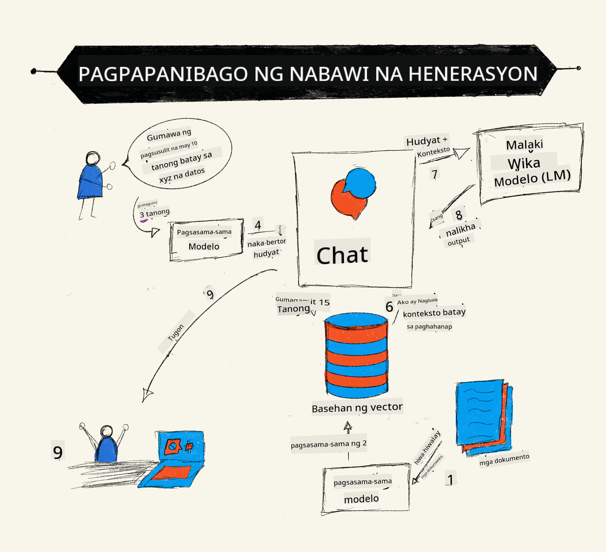
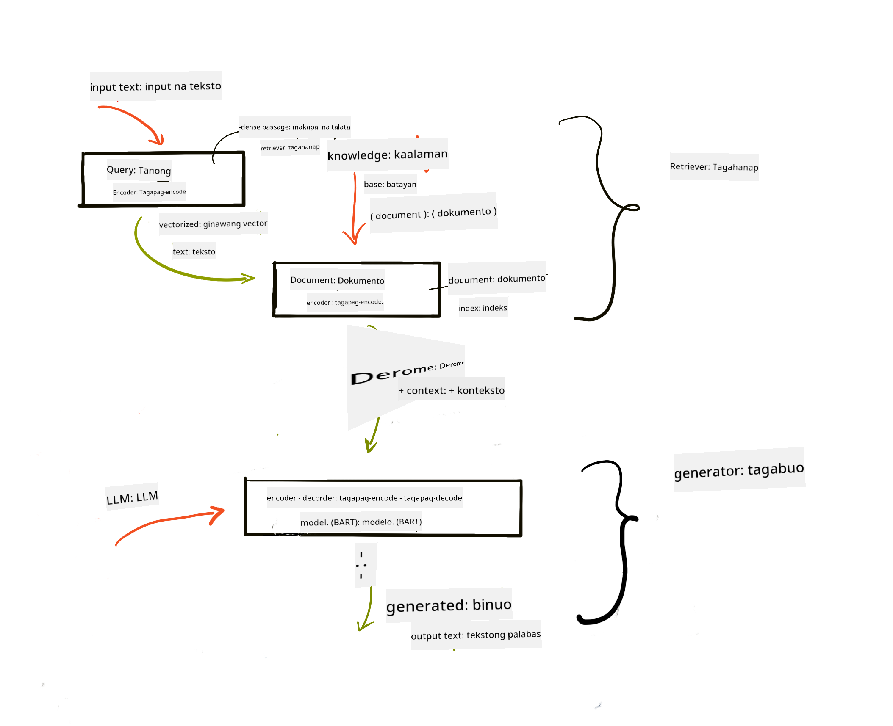
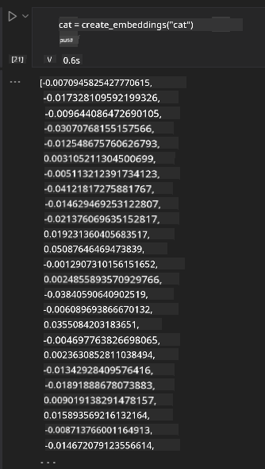

<!--
CO_OP_TRANSLATOR_METADATA:
{
  "original_hash": "e2861bbca91c0567ef32bc77fe054f9e",
  "translation_date": "2025-06-25T22:41:29+00:00",
  "source_file": "15-rag-and-vector-databases/README.md",
  "language_code": "tl"
}
-->
# Retrieval Augmented Generation (RAG) at Vector Databases

Sa aralin ng mga search application, bahagyang natutunan natin kung paano i-integrate ang sariling data sa Large Language Models (LLMs). Sa araling ito, mas malalim nating tatalakayin ang mga konsepto ng pag-ground ng iyong data sa iyong LLM application, ang mekanika ng proseso at mga pamamaraan ng pag-iimbak ng data, kabilang ang mga embeddings at teksto.

> **Darating na ang Video**

## Panimula

Sa araling ito, saklawin natin ang sumusunod:

- Isang pagpapakilala sa RAG, kung ano ito at bakit ito ginagamit sa AI (artipisyal na intelihensiya).

- Pag-unawa sa kung ano ang mga vector databases at paglikha ng isa para sa ating aplikasyon.

- Isang praktikal na halimbawa kung paano i-integrate ang RAG sa isang aplikasyon.

## Mga Layunin sa Pag-aaral

Pagkatapos makumpleto ang araling ito, magagawa mong:

- Ipaliwanag ang kahalagahan ng RAG sa pag-retrieve at pagproseso ng data.

- I-setup ang RAG application at i-ground ang iyong data sa isang LLM.

- Epektibong integrasyon ng RAG at Vector Databases sa LLM Applications.

## Ang Ating Senaryo: pagpapahusay ng ating LLMs gamit ang sariling data

Para sa araling ito, nais nating idagdag ang ating sariling mga tala sa education startup, na nagpapahintulot sa chatbot na makakuha ng mas maraming impormasyon sa iba't ibang paksa. Gamit ang mga tala na mayroon tayo, ang mga mag-aaral ay makakapag-aral nang mas mabuti at makakaunawa sa iba't ibang paksa, na mas pinapadali ang pag-revise para sa kanilang mga pagsusulit. Upang likhain ang ating senaryo, gagamitin natin ang:

- `Azure OpenAI:` ang LLM na gagamitin natin upang likhain ang ating chatbot

- `AI for beginners' lesson on Neural Networks`: ito ang data na i-ground natin sa ating LLM

- `Azure AI Search` at `Azure Cosmos DB:` vector database upang iimbak ang ating data at lumikha ng search index

Magkakaroon ng kakayahan ang mga user na lumikha ng mga practice quizzes mula sa kanilang mga tala, mga revision flash cards at isummarize ito sa concise overviews. Upang makapagsimula, tingnan natin kung ano ang RAG at paano ito gumagana:

## Retrieval Augmented Generation (RAG)

Ang LLM powered chatbot ay nagpoproseso ng mga prompt ng user upang makabuo ng mga tugon. Ito ay dinisenyo upang maging interactive at nakikipag-ugnayan sa mga user sa iba't ibang paksa. Gayunpaman, ang mga tugon nito ay limitado sa konteksto na ibinigay at sa foundational training data nito. Halimbawa, ang GPT-4 knowledge cutoff ay Setyembre 2021, ibig sabihin, kulang ito ng kaalaman sa mga kaganapan na naganap pagkatapos ng panahong ito. Bukod pa rito, ang data na ginamit upang sanayin ang mga LLM ay hindi kasama ang kumpidensyal na impormasyon tulad ng personal na tala o manual ng produkto ng isang kumpanya.

### Paano gumagana ang RAGs (Retrieval Augmented Generation)



Ipagpalagay na nais mong mag-deploy ng chatbot na lumilikha ng mga pagsusulit mula sa iyong mga tala, kakailanganin mo ng koneksyon sa knowledge base. Dito pumapasok ang RAG upang magligtas. Ang RAGs ay gumagana bilang mga sumusunod:

- **Knowledge base:** Bago ang retrieval, kailangan munang ma-ingest at ma-preprocess ang mga dokumentong ito, karaniwang hinahati ang malalaking dokumento sa mas maliliit na bahagi, binabago ang mga ito sa text embedding at iniimbak sa isang database.

- **User Query:** ang user ay nagtatanong ng isang tanong

- **Retrieval:** Kapag ang user ay nagtatanong ng isang tanong, ang embedding model ay nagre-retrieve ng kaugnay na impormasyon mula sa ating knowledge base upang magbigay ng mas maraming konteksto na isasama sa prompt.

- **Augmented Generation:** ang LLM ay pinapahusay ang tugon nito batay sa data na na-retrieve. Pinapayagan nito ang tugon na nabuo na hindi lamang batay sa pre-trained data kundi pati na rin sa kaugnay na impormasyon mula sa idinagdag na konteksto. Ang na-retrieve na data ay ginagamit upang i-augment ang mga tugon ng LLM. Ang LLM pagkatapos ay nagbabalik ng sagot sa tanong ng user.



Ang arkitektura para sa RAGs ay ipinatupad gamit ang transformers na binubuo ng dalawang bahagi: isang encoder at isang decoder. Halimbawa, kapag ang user ay nagtatanong ng isang tanong, ang input text ay 'encoded' sa vectors na kumukuha ng kahulugan ng mga salita at ang vectors ay 'decoded' sa ating document index at bumubuo ng bagong teksto batay sa query ng user. Ang LLM ay gumagamit ng parehong encoder-decoder model upang makabuo ng output.

Dalawang diskarte kapag ipinatutupad ang RAG ayon sa iminungkahing papel: [Retrieval-Augmented Generation for Knowledge intensive NLP (natural language processing software) Tasks](https://arxiv.org/pdf/2005.11401.pdf?WT.mc_id=academic-105485-koreyst) ay:

- **_RAG-Sequence_** gamit ang na-retrieve na mga dokumento upang hulaan ang pinakamabuting posibleng sagot sa query ng user

- **RAG-Token** gamit ang mga dokumento upang bumuo ng susunod na token, pagkatapos ay i-retrieve ang mga ito upang sagutin ang query ng user

### Bakit gagamit ka ng RAGs? 

- **Information richness:** tinitiyak na ang mga text responses ay napapanahon at kasalukuyan. Samakatuwid, pinapahusay nito ang pagganap sa domain specific tasks sa pamamagitan ng pag-access sa internal knowledge base.

- Binabawasan ang fabrication sa pamamagitan ng paggamit ng **verifiable data** sa knowledge base upang magbigay ng konteksto sa mga query ng user.

- Ito ay **cost effective** dahil mas ekonomikal ang mga ito kumpara sa pag-fine-tune ng isang LLM

## Paglikha ng knowledge base

Ang aming aplikasyon ay batay sa aming personal na data i.e., ang Neural Network lesson sa AI For Beginners curriculum.

### Vector Databases

Ang vector database, hindi tulad ng tradisyunal na databases, ay isang espesyal na database na idinisenyo upang mag-imbak, pamahalaan at maghanap ng embedded vectors. Iniimbak nito ang mga numerical representations ng mga dokumento. Ang paghahati ng data sa numerical embeddings ay nagpapadali para sa ating AI system na maunawaan at maproseso ang data.

Iniimbak natin ang ating embeddings sa vector databases dahil ang LLMs ay may limitasyon sa bilang ng mga tokens na tinatanggap nila bilang input. Dahil hindi mo maipapasa ang buong embeddings sa isang LLM, kailangan nating hatiin ito sa mga chunks at kapag ang user ay nagtatanong, ang embeddings na pinaka-katulad sa tanong ay ibabalik kasama ng prompt. Ang pag-chunking ay nagbabawas din ng gastos sa bilang ng mga tokens na ipinapasa sa isang LLM.

Ang ilang sikat na vector databases ay kinabibilangan ng Azure Cosmos DB, Clarifyai, Pinecone, Chromadb, ScaNN, Qdrant at DeepLake. Maaari kang lumikha ng Azure Cosmos DB model gamit ang Azure CLI sa pamamagitan ng sumusunod na command:

```bash
az login
az group create -n <resource-group-name> -l <location>
az cosmosdb create -n <cosmos-db-name> -r <resource-group-name>
az cosmosdb list-keys -n <cosmos-db-name> -g <resource-group-name>
```

### Mula sa teksto patungo sa embeddings

Bago natin iimbak ang ating data, kailangan natin itong i-convert sa vector embeddings bago ito iimbak sa database. Kung ikaw ay nagtatrabaho sa malalaking dokumento o mahabang teksto, maaari mong i-chunk ang mga ito batay sa mga query na inaasahan mo. Ang pag-chunking ay maaaring gawin sa antas ng pangungusap, o sa antas ng talata. Dahil ang pag-chunking ay kumukuha ng kahulugan mula sa mga salitang nakapaligid sa kanila, maaari kang magdagdag ng ibang konteksto sa isang chunk, halimbawa, sa pamamagitan ng pagdaragdag ng pamagat ng dokumento o pagdaragdag ng ilang teksto bago o pagkatapos ng chunk. Maaari mong i-chunk ang data sa sumusunod na paraan:

```python
def split_text(text, max_length, min_length):
    words = text.split()
    chunks = []
    current_chunk = []

    for word in words:
        current_chunk.append(word)
        if len(' '.join(current_chunk)) < max_length and len(' '.join(current_chunk)) > min_length:
            chunks.append(' '.join(current_chunk))
            current_chunk = []

    # If the last chunk didn't reach the minimum length, add it anyway
    if current_chunk:
        chunks.append(' '.join(current_chunk))

    return chunks
```

Kapag na-chunk na, maaari na nating i-embed ang ating teksto gamit ang iba't ibang embedding models. Ang ilang mga modelo na maaari mong gamitin ay kinabibilangan ng: word2vec, ada-002 ng OpenAI, Azure Computer Vision at marami pang iba. Ang pagpili ng modelong gagamitin ay depende sa mga wikang ginagamit mo, sa uri ng nilalaman na naka-encode (teksto/imahe/audio), ang laki ng input na maaari nitong i-encode at haba ng embedding output.

Isang halimbawa ng embedded text gamit ang OpenAI's `text-embedding-ada-002` model ay:


## Retrieval at Vector Search

Kapag ang user ay nagtatanong ng isang tanong, ang retriever ay nag-transform nito sa isang vector gamit ang query encoder, pagkatapos ay hinahanap nito sa ating document search index ang mga kaugnay na vectors sa dokumento na may kaugnayan sa input. Kapag tapos na, kinokonvert nito ang parehong input vector at document vectors sa teksto at ipinapasa ito sa LLM.

### Retrieval

Ang retrieval ay nangyayari kapag sinusubukan ng sistema na mabilis na mahanap ang mga dokumento mula sa index na tumutugon sa pamantayan ng paghahanap. Ang layunin ng retriever ay makuha ang mga dokumento na gagamitin upang magbigay ng konteksto at i-ground ang LLM sa iyong data.

Mayroong ilang mga paraan upang magsagawa ng paghahanap sa loob ng aming database tulad ng:

- **Keyword search** - ginagamit para sa mga text searches

- **Semantic search** - gumagamit ng semantic meaning ng mga salita

- **Vector search** - kinokonvert ang mga dokumento mula sa teksto patungo sa vector representations gamit ang embedding models. Ang retrieval ay gagawin sa pamamagitan ng pag-query sa mga dokumento na ang vector representations ay pinakamalapit sa tanong ng user.

- **Hybrid** - isang kumbinasyon ng parehong keyword at vector search.

Isang hamon sa retrieval ay dumating kapag walang katulad na tugon sa query sa database, ang sistema ay pagkatapos ay magbabalik ng pinakamahusay na impormasyon na maaari nilang makuha, gayunpaman, maaari mong gamitin ang mga taktika tulad ng pag-set up ng maximum distance para sa relevance o paggamit ng hybrid search na pinagsasama ang parehong keyword at vector search. Sa araling ito, gagamit tayo ng hybrid search, isang kumbinasyon ng parehong vector at keyword search. Iimbak natin ang ating data sa isang dataframe na may mga kolum na naglalaman ng mga chunks pati na rin ang mga embeddings.

### Vector Similarity

Ang retriever ay maghahanap sa knowledge database para sa mga embeddings na malapit sa isa't isa, ang pinakamalapit na kapitbahay, dahil sila ay mga teksto na magkatulad. Sa senaryo na ang user ay nagtatanong ng query, ito ay unang naka-embed pagkatapos ay itinutugma sa mga katulad na embeddings. Ang karaniwang sukat na ginagamit upang malaman kung gaano kalapit ang pagkakatulad ng iba't ibang vectors ay cosine similarity na batay sa anggulo sa pagitan ng dalawang vectors.

Maaari nating sukatin ang pagkakatulad gamit ang iba pang alternatibo na maaari nating gamitin ay Euclidean distance na ang tuwid na linya sa pagitan ng mga endpoint ng vector at dot product na sumusukat sa kabuuan ng mga produkto ng mga kaukulang elemento ng dalawang vectors.

### Search index

Kapag gumagawa ng retrieval, kailangan nating bumuo ng search index para sa ating knowledge base bago tayo magsagawa ng paghahanap. Ang isang index ay mag-iimbak ng ating embeddings at maaaring mabilis na i-retrieve ang pinaka-katulad na chunks kahit sa isang malaking database. Maaari nating likhain ang ating index nang lokal gamit ang:

```python
from sklearn.neighbors import NearestNeighbors

embeddings = flattened_df['embeddings'].to_list()

# Create the search index
nbrs = NearestNeighbors(n_neighbors=5, algorithm='ball_tree').fit(embeddings)

# To query the index, you can use the kneighbors method
distances, indices = nbrs.kneighbors(embeddings)
```

### Re-ranking

Kapag na-query mo na ang database, maaaring kailangan mong i-sort ang mga resulta mula sa pinaka-kaugnay. Ang isang reranking LLM ay gumagamit ng Machine Learning upang mapabuti ang kaugnayan ng mga resulta ng paghahanap sa pamamagitan ng pag-order sa kanila mula sa pinaka-kaugnay. Gamit ang Azure AI Search, ang reranking ay awtomatikong ginagawa para sa iyo gamit ang isang semantic reranker. Isang halimbawa ng kung paano gumagana ang reranking gamit ang nearest neighbours:

```python
# Find the most similar documents
distances, indices = nbrs.kneighbors([query_vector])

index = []
# Print the most similar documents
for i in range(3):
    index = indices[0][i]
    for index in indices[0]:
        print(flattened_df['chunks'].iloc[index])
        print(flattened_df['path'].iloc[index])
        print(flattened_df['distances'].iloc[index])
    else:
        print(f"Index {index} not found in DataFrame")
```

## Pagsasama-sama ng lahat

Ang huling hakbang ay ang pagdaragdag ng ating LLM sa timpla upang makakuha ng mga tugon na naka-ground sa ating data. Maaari natin itong ipatupad sa sumusunod na paraan:

```python
user_input = "what is a perceptron?"

def chatbot(user_input):
    # Convert the question to a query vector
    query_vector = create_embeddings(user_input)

    # Find the most similar documents
    distances, indices = nbrs.kneighbors([query_vector])

    # add documents to query  to provide context
    history = []
    for index in indices[0]:
        history.append(flattened_df['chunks'].iloc[index])

    # combine the history and the user input
    history.append(user_input)

    # create a message object
    messages=[
        {"role": "system", "content": "You are an AI assistant that helps with AI questions."},
        {"role": "user", "content": history[-1]}
    ]

    # use chat completion to generate a response
    response = openai.chat.completions.create(
        model="gpt-4",
        temperature=0.7,
        max_tokens=800,
        messages=messages
    )

    return response.choices[0].message

chatbot(user_input)
```

## Pagsusuri sa ating aplikasyon

### Mga Sukatan sa Pagsusuri

- Kalidad ng mga tugon na ibinigay na tinitiyak na ito ay natural, fluent at parang tao

- Groundedness ng data: pagsusuri kung ang tugon ay nagmula sa mga ibinigay na dokumento

- Kaugnayan: pagsusuri kung ang tugon ay tumutugma at may kaugnayan sa tanong na tinanong

- Fluency - kung ang tugon ay may katuturan sa gramatika

## Mga Gamit ng paggamit ng RAG (Retrieval Augmented Generation) at vector databases

Maraming iba't ibang mga gamit kung saan ang mga function calls ay maaaring mapabuti ang iyong app tulad ng:

- Question and Answering: grounding ng data ng iyong kumpanya sa isang chat na maaaring gamitin ng mga empleyado upang magtanong.

- Recommendation Systems: kung saan maaari kang lumikha ng sistema na tumutugma sa mga pinaka-katulad na halaga halimbawa mga pelikula, restawran at marami pang iba.

- Chatbot services: maaari mong iimbak ang chat history at i-personalize ang pag-uusap batay sa data ng user.

- Image search batay sa vector embeddings, kapaki-pakinabang kapag gumagawa ng image recognition at anomaly detection.

## Buod

Saklaw natin ang mga pundamental na lugar ng RAG mula sa pagdaragdag ng ating data sa aplikasyon, ang user query at output. Upang mapadali ang paglikha ng RAG, maaari mong gamitin ang mga frameworks tulad ng Semantic Kernel, Langchain o Autogen.

## Takdang-aralin

Upang ipagpatuloy ang iyong pag-aaral ng Retrieval Augmented Generation (RAG) maaari kang bumuo ng:

- Bumuo ng front-end para sa aplikasyon gamit ang framework na iyong pinili

- Gamitin ang isang framework, alinman sa LangChain o Semantic Kernel, at muling likhain ang iyong aplikasyon.

Binabati kita sa pagtatapos ng aralin 👏.

## Ang pag-aaral ay hindi nagtatapos dito, ipagpatuloy ang Paglalakbay

Pagkatapos makumpleto ang araling ito, tingnan ang aming [Generative AI Learning collection](https://aka.ms/genai-collection?WT.mc_id=academic-105485-koreyst) upang ipagpatuloy ang pagpapalawak ng iyong kaalaman sa Generative AI!

**Pagtatatuwa**:  
Ang dokumentong ito ay isinalin gamit ang AI translation service na [Co-op Translator](https://github.com/Azure/co-op-translator). Habang nagsusumikap kami para sa katumpakan, pakitandaan na ang mga awtomatikong pagsasalin ay maaaring maglaman ng mga pagkakamali o hindi pagkakatumpakan. Ang orihinal na dokumento sa kanyang katutubong wika ay dapat ituring na awtoritatibong mapagkukunan. Para sa mahahalagang impormasyon, inirerekomenda ang propesyonal na pagsasalin ng tao. Hindi kami mananagot para sa anumang hindi pagkakaunawaan o maling interpretasyon na dulot ng paggamit ng pagsasaling ito.