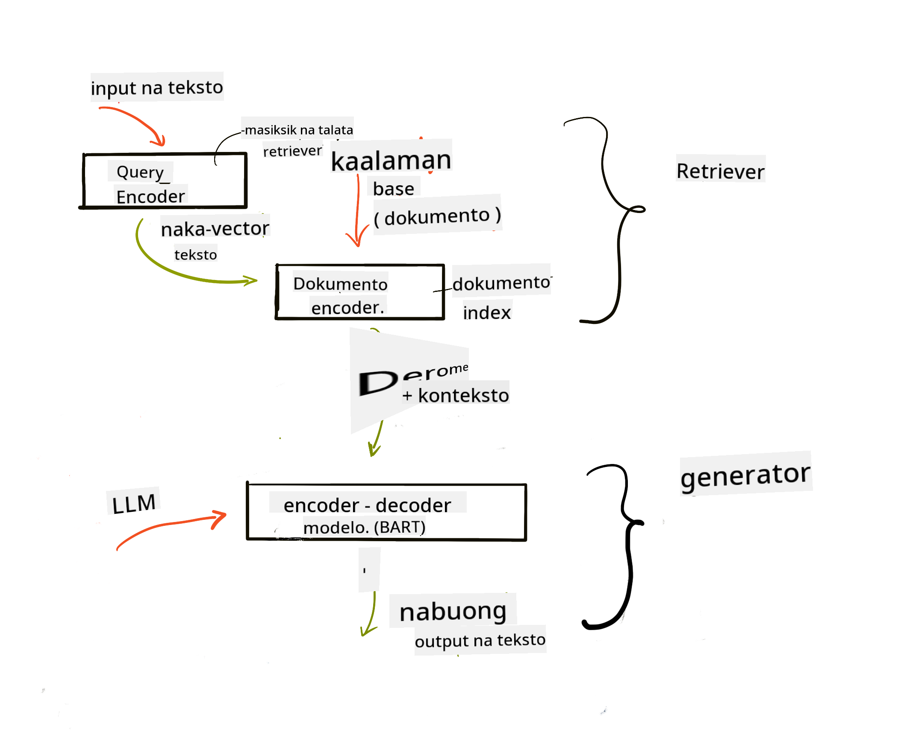

<!--
CO_OP_TRANSLATOR_METADATA:
{
  "original_hash": "b4b0266fbadbba7ded891b6485adc66d",
  "translation_date": "2025-10-17T13:15:26+00:00",
  "source_file": "15-rag-and-vector-databases/README.md",
  "language_code": "tl"
}
-->
# Retrieval Augmented Generation (RAG) at Vector Databases

[](https://youtu.be/4l8zhHUBeyI?si=BmvDmL1fnHtgQYkL)

Sa aralin tungkol sa search applications, bahagyang tinalakay natin kung paano isama ang sariling data sa Large Language Models (LLMs). Sa araling ito, mas malalim nating pag-aaralan ang mga konsepto ng pag-ground ng iyong data sa LLM application, ang mekanismo ng proseso, at ang mga pamamaraan ng pag-iimbak ng data, kabilang ang embeddings at text.

> **Video Coming Soon**

## Panimula

Sa araling ito, tatalakayin natin ang mga sumusunod:

- Panimula sa RAG, kung ano ito at bakit ito ginagamit sa AI (artificial intelligence).

- Pag-unawa sa kung ano ang vector databases at paggawa ng isa para sa ating aplikasyon.

- Isang praktikal na halimbawa kung paano isama ang RAG sa isang aplikasyon.

## Mga Layunin sa Pag-aaral

Pagkatapos makumpleto ang araling ito, magagawa mo ang sumusunod:

- Ipaliwanag ang kahalagahan ng RAG sa pagkuha at pagproseso ng data.

- I-setup ang RAG application at i-ground ang iyong data sa isang LLM.

- Epektibong pagsasama ng RAG at Vector Databases sa LLM Applications.

## Ang Ating Scenario: pagpapahusay ng ating LLM gamit ang sariling data

Para sa araling ito, nais nating idagdag ang ating sariling mga tala sa education startup, na magpapahintulot sa chatbot na makakuha ng mas maraming impormasyon tungkol sa iba't ibang paksa. Gamit ang mga tala na mayroon tayo, mas makakapag-aral ang mga mag-aaral at mas mauunawaan ang iba't ibang paksa, na magpapadali sa pagre-review para sa kanilang mga pagsusulit. Para sa ating scenario, gagamit tayo ng:

- `Azure OpenAI:` ang LLM na gagamitin natin para gumawa ng chatbot.

- `AI for beginners' lesson on Neural Networks:` ito ang data na i-ground natin sa ating LLM.

- `Azure AI Search` at `Azure Cosmos DB:` vector database para iimbak ang ating data at gumawa ng search index.

Magagawa ng mga user na gumawa ng practice quizzes mula sa kanilang mga tala, mga flash card para sa pagre-review, at i-summarize ito sa maikling overviews. Para makapagsimula, tingnan natin kung ano ang RAG at paano ito gumagana:

## Retrieval Augmented Generation (RAG)

Ang LLM-powered chatbot ay nagpoproseso ng mga prompt ng user para makabuo ng mga sagot. Ito ay idinisenyo upang maging interactive at makipag-ugnayan sa mga user sa iba't ibang paksa. Gayunpaman, ang mga sagot nito ay limitado sa konteksto na ibinigay at sa foundational training data nito. Halimbawa, ang knowledge cutoff ng GPT-4 ay noong Setyembre 2021, ibig sabihin, kulang ito sa kaalaman tungkol sa mga pangyayari pagkatapos ng panahong ito. Bukod dito, ang data na ginamit sa pag-train ng LLMs ay hindi kasama ang mga kumpidensyal na impormasyon tulad ng personal na tala o manual ng produkto ng isang kumpanya.

### Paano gumagana ang RAGs (Retrieval Augmented Generation)


Halimbawa, gusto mong mag-deploy ng chatbot na gumagawa ng quizzes mula sa iyong mga tala, kakailanganin mo ng koneksyon sa knowledge base. Dito papasok ang RAG. Ang RAGs ay gumagana sa ganitong paraan:

- **Knowledge base:** Bago ang retrieval, kailangang ma-ingest at ma-preprocess ang mga dokumento, kadalasang hinahati ang malalaking dokumento sa mas maliliit na bahagi, ginagawang text embedding, at iniimbak sa isang database.

- **User Query:** nagtatanong ang user.

- **Retrieval:** Kapag nagtatanong ang user, ang embedding model ay kumukuha ng kaugnay na impormasyon mula sa ating knowledge base upang magbigay ng mas maraming konteksto na isasama sa prompt.

- **Augmented Generation:** pinapahusay ng LLM ang sagot nito batay sa data na nakuha. Pinapayagan nito ang sagot na mabuo hindi lamang batay sa pre-trained data kundi pati na rin sa kaugnay na impormasyon mula sa idinagdag na konteksto. Ang nakuha na data ay ginagamit upang i-augment ang mga sagot ng LLM. Ang LLM ay nagbibigay ng sagot sa tanong ng user.



Ang arkitektura ng RAGs ay ipinatutupad gamit ang transformers na binubuo ng dalawang bahagi: isang encoder at isang decoder. Halimbawa, kapag nagtatanong ang user, ang input text ay 'encoded' sa vectors na kumukuha ng kahulugan ng mga salita at ang vectors ay 'decoded' sa ating document index at bumubuo ng bagong text batay sa tanong ng user. Ang LLM ay gumagamit ng parehong encoder-decoder model upang makabuo ng output.

Dalawang paraan sa pagpapatupad ng RAG ayon sa iminungkahing papel: [Retrieval-Augmented Generation for Knowledge intensive NLP (natural language processing software) Tasks](https://arxiv.org/pdf/2005.11401.pdf?WT.mc_id=academic-105485-koreyst) ay:

- **_RAG-Sequence_** gamit ang nakuha na mga dokumento upang mahulaan ang pinakamahusay na posibleng sagot sa tanong ng user.

- **RAG-Token** gamit ang mga dokumento upang bumuo ng susunod na token, pagkatapos ay kunin ang mga ito upang sagutin ang tanong ng user.

### Bakit gagamit ng RAGs?

- **Information richness:** tinitiyak na ang mga text responses ay napapanahon at kasalukuyan. Pinapahusay nito ang performance sa domain-specific tasks sa pamamagitan ng pag-access sa internal knowledge base.

- Binabawasan ang fabrication sa pamamagitan ng paggamit ng **verifiable data** sa knowledge base upang magbigay ng konteksto sa mga tanong ng user.

- Ito ay **cost effective** dahil mas matipid ito kumpara sa fine-tuning ng isang LLM.

## Paglikha ng knowledge base

Ang ating aplikasyon ay batay sa ating personal na data i.e., ang Neural Network lesson sa AI For Beginners curriculum.

### Vector Databases

Ang vector database, hindi tulad ng tradisyunal na databases, ay isang espesyal na database na idinisenyo upang mag-imbak, mag-manage, at maghanap ng embedded vectors. Iniimbak nito ang numerical representations ng mga dokumento. Ang pag-breakdown ng data sa numerical embeddings ay nagpapadali sa ating AI system na maunawaan at ma-proseso ang data.

Iniimbak natin ang ating embeddings sa vector databases dahil ang LLMs ay may limitasyon sa bilang ng mga tokens na tinatanggap bilang input. Dahil hindi mo maipapasa ang buong embeddings sa isang LLM, kailangan nating hatiin ang mga ito sa chunks at kapag nagtatanong ang user, ang embeddings na pinaka-katulad sa tanong ay ibabalik kasama ang prompt. Ang chunking ay nakakatipid din sa gastos sa bilang ng mga tokens na ipinapasa sa isang LLM.

Ang ilang sikat na vector databases ay kinabibilangan ng Azure Cosmos DB, Clarifyai, Pinecone, Chromadb, ScaNN, Qdrant, at DeepLake. Maaari kang gumawa ng Azure Cosmos DB model gamit ang Azure CLI sa pamamagitan ng sumusunod na command:

```bash
az login
az group create -n <resource-group-name> -l <location>
az cosmosdb create -n <cosmos-db-name> -r <resource-group-name>
az cosmosdb list-keys -n <cosmos-db-name> -g <resource-group-name>
```

### Mula sa text patungo sa embeddings

Bago natin iimbak ang ating data, kailangan muna natin itong i-convert sa vector embeddings bago ito iimbak sa database. Kung nagtatrabaho ka sa malalaking dokumento o mahabang texts, maaari mo itong hatiin batay sa mga query na inaasahan mo. Ang chunking ay maaaring gawin sa sentence level, o sa paragraph level. Dahil ang chunking ay kumukuha ng kahulugan mula sa mga salitang nakapaligid dito, maaari kang magdagdag ng ibang konteksto sa isang chunk, halimbawa, sa pamamagitan ng pagdaragdag ng pamagat ng dokumento o pagsasama ng ilang text bago o pagkatapos ng chunk. Maaari mong hatiin ang data sa ganitong paraan:

```python
def split_text(text, max_length, min_length):
    words = text.split()
    chunks = []
    current_chunk = []

    for word in words:
        current_chunk.append(word)
        if len(' '.join(current_chunk)) < max_length and len(' '.join(current_chunk)) > min_length:
            chunks.append(' '.join(current_chunk))
            current_chunk = []

    # If the last chunk didn't reach the minimum length, add it anyway
    if current_chunk:
        chunks.append(' '.join(current_chunk))

    return chunks
```

Kapag na-chunk na, maaari nating i-embed ang ating text gamit ang iba't ibang embedding models. Ang ilang models na maaari mong gamitin ay: word2vec, ada-002 ng OpenAI, Azure Computer Vision, at marami pang iba. Ang pagpili ng model na gagamitin ay depende sa mga wika na ginagamit mo, uri ng content na encoded (text/images/audio), laki ng input na maaari nitong i-encode, at haba ng embedding output.

Isang halimbawa ng embedded text gamit ang model ng OpenAI na `text-embedding-ada-002` ay:


## Retrieval at Vector Search

Kapag nagtatanong ang user, ang retriever ay nagta-transform nito sa isang vector gamit ang query encoder, pagkatapos ay hinahanap nito sa ating document search index ang mga kaugnay na vectors sa dokumento na may kaugnayan sa input. Kapag tapos na, kino-convert nito ang parehong input vector at document vectors sa text at ipinapasa ito sa LLM.

### Retrieval

Ang retrieval ay nangyayari kapag sinusubukan ng system na mabilis na mahanap ang mga dokumento mula sa index na tumutugon sa search criteria. Ang layunin ng retriever ay makuha ang mga dokumento na gagamitin upang magbigay ng konteksto at i-ground ang LLM sa iyong data.

May ilang paraan upang magsagawa ng search sa loob ng ating database tulad ng:

- **Keyword search** - ginagamit para sa text searches.

- **Semantic search** - gumagamit ng semantic meaning ng mga salita.

- **Vector search** - kino-convert ang mga dokumento mula sa text patungo sa vector representations gamit ang embedding models. Ang retrieval ay gagawin sa pamamagitan ng pag-query sa mga dokumento na ang vector representations ay pinakamalapit sa tanong ng user.

- **Hybrid** - kombinasyon ng parehong keyword at vector search.

Ang hamon sa retrieval ay kapag walang katulad na sagot sa query sa database, ang system ay magbabalik ng pinakamahusay na impormasyon na makukuha nila, gayunpaman, maaari kang gumamit ng mga taktika tulad ng pag-set up ng maximum distance para sa relevance o paggamit ng hybrid search na pinagsasama ang parehong keyword at vector search. Sa araling ito gagamit tayo ng hybrid search, kombinasyon ng parehong vector at keyword search. Iimbak natin ang ating data sa isang dataframe na may mga column na naglalaman ng mga chunks pati na rin ang embeddings.

### Vector Similarity

Ang retriever ay maghahanap sa knowledge database para sa mga embeddings na malapit sa isa't isa, ang pinakamalapit na kapitbahay, dahil sila ay mga texts na magkatulad. Sa scenario na nagtatanong ang user, ito ay unang ini-embed pagkatapos ay itinatapat sa mga katulad na embeddings. Ang karaniwang sukat na ginagamit upang malaman kung gaano kasimilar ang iba't ibang vectors ay cosine similarity na batay sa anggulo sa pagitan ng dalawang vectors.

Maaari nating sukatin ang similarity gamit ang iba pang alternatibo tulad ng Euclidean distance na ang tuwid na linya sa pagitan ng endpoints ng vector at dot product na sumusukat sa kabuuan ng mga produkto ng magkatugmang elemento ng dalawang vectors.

### Search index

Kapag gumagawa ng retrieval, kailangan nating bumuo ng search index para sa ating knowledge base bago tayo magsagawa ng search. Ang index ay mag-iimbak ng ating embeddings at maaaring mabilis na makuha ang pinaka-katulad na chunks kahit sa isang malaking database. Maaari tayong gumawa ng index nang lokal gamit ang:

```python
from sklearn.neighbors import NearestNeighbors

embeddings = flattened_df['embeddings'].to_list()

# Create the search index
nbrs = NearestNeighbors(n_neighbors=5, algorithm='ball_tree').fit(embeddings)

# To query the index, you can use the kneighbors method
distances, indices = nbrs.kneighbors(embeddings)
```

### Re-ranking

Kapag na-query mo na ang database, maaaring kailanganin mong ayusin ang mga resulta mula sa pinaka-kaugnay. Ang isang reranking LLM ay gumagamit ng Machine Learning upang mapabuti ang relevance ng mga resulta ng search sa pamamagitan ng pag-aayos ng mga ito mula sa pinaka-kaugnay. Gamit ang Azure AI Search, ang reranking ay awtomatikong ginagawa para sa iyo gamit ang isang semantic reranker. Isang halimbawa kung paano gumagana ang reranking gamit ang nearest neighbours:

```python
# Find the most similar documents
distances, indices = nbrs.kneighbors([query_vector])

index = []
# Print the most similar documents
for i in range(3):
    index = indices[0][i]
    for index in indices[0]:
        print(flattened_df['chunks'].iloc[index])
        print(flattened_df['path'].iloc[index])
        print(flattened_df['distances'].iloc[index])
    else:
        print(f"Index {index} not found in DataFrame")
```

## Pagsasama-sama ng lahat

Ang huling hakbang ay ang pagdaragdag ng ating LLM sa mix upang makakuha ng mga sagot na naka-ground sa ating data. Maaari natin itong ipatupad sa ganitong paraan:

```python
user_input = "what is a perceptron?"

def chatbot(user_input):
    # Convert the question to a query vector
    query_vector = create_embeddings(user_input)

    # Find the most similar documents
    distances, indices = nbrs.kneighbors([query_vector])

    # add documents to query  to provide context
    history = []
    for index in indices[0]:
        history.append(flattened_df['chunks'].iloc[index])

    # combine the history and the user input
    history.append(user_input)

    # create a message object
    messages=[
        {"role": "system", "content": "You are an AI assistant that helps with AI questions."},
        {"role": "user", "content": history[-1]}
    ]

    # use chat completion to generate a response
    response = openai.chat.completions.create(
        model="gpt-4",
        temperature=0.7,
        max_tokens=800,
        messages=messages
    )

    return response.choices[0].message

chatbot(user_input)
```

## Pagsusuri sa ating aplikasyon

### Evaluation Metrics

- Kalidad ng mga sagot na ibinigay, tinitiyak na ito ay tunog natural, fluent, at parang tao.

- Groundedness ng data: pagsusuri kung ang sagot ay nagmula sa ibinigay na mga dokumento.

- Relevance: pagsusuri kung ang sagot ay tumutugma at may kaugnayan sa tanong na itinatanong.

- Fluency - kung ang sagot ay may grammatical sense.

## Mga Gamit ng RAG (Retrieval Augmented Generation) at vector databases

Maraming iba't ibang use cases kung saan ang function calls ay maaaring mapabuti ang iyong app tulad ng:

- Question and Answering: pag-ground ng data ng iyong kumpanya sa isang chat na maaaring gamitin ng mga empleyado upang magtanong.

- Recommendation Systems: kung saan maaari kang gumawa ng system na tumutugma sa pinaka-katulad na mga halaga tulad ng mga pelikula, restaurant, at marami pang iba.

- Chatbot services: maaari mong iimbak ang history ng chat at i-personalize ang pag-uusap batay sa data ng user.

- Image search batay sa vector embeddings, kapaki-pakinabang kapag gumagawa ng image recognition at anomaly detection.

## Buod

Tinalakay natin ang mga pangunahing aspeto ng RAG mula sa pagdaragdag ng ating data sa aplikasyon, ang tanong ng user, at output. Upang gawing mas simple ang paggawa ng RAG, maaari kang gumamit ng mga framework tulad ng Semantic Kernel, Langchain, o Autogen.

## Takdang Aralin

Upang ipagpatuloy ang iyong pag-aaral ng Retrieval Augmented Generation (RAG) maaari kang gumawa ng:

- Gumawa ng front-end para sa aplikasyon gamit ang framework na iyong napili.

- Gumamit ng framework, alinman sa LangChain o Semantic Kernel, at muling likhain ang iyong aplikasyon.

Binabati kita sa pagkumpleto ng aralin 👏.

## Hindi dito nagtatapos ang pag-aaral, ipagpatuloy ang Paglalakbay

Pagkatapos makumpleto ang araling ito, tingnan ang aming [Generative AI Learning collection](https://aka.ms/genai-collection?WT.mc_id=academic-105485-koreyst) upang ipagpatuloy ang pagpapalawak ng iyong kaalaman sa Generative AI!

---

**Paunawa**:  
Ang dokumentong ito ay isinalin gamit ang AI translation service [Co-op Translator](https://github.com/Azure/co-op-translator). Bagamat sinisikap naming maging tumpak, mangyaring tandaan na ang mga awtomatikong pagsasalin ay maaaring maglaman ng mga pagkakamali o hindi pagkakatugma. Ang orihinal na dokumento sa kanyang katutubong wika ang dapat ituring na opisyal na sanggunian. Para sa mahalagang impormasyon, inirerekomenda ang propesyonal na pagsasalin ng tao. Hindi kami mananagot sa anumang hindi pagkakaunawaan o maling interpretasyon na dulot ng paggamit ng pagsasaling ito.