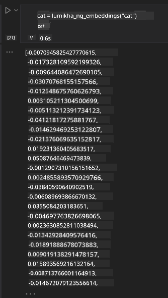

<!--
CO_OP_TRANSLATOR_METADATA:
{
  "original_hash": "e2861bbca91c0567ef32bc77fe054f9e",
  "translation_date": "2025-07-09T16:17:33+00:00",
  "source_file": "15-rag-and-vector-databases/README.md",
  "language_code": "tl"
}
-->
# Retrieval Augmented Generation (RAG) at Vector Databases

[](https://aka.ms/gen-ai-lesson15-gh?WT.mc_id=academic-105485-koreyst)

Sa aralin tungkol sa search applications, bahagyang nating natalakay kung paano isasama ang sarili mong data sa Large Language Models (LLMs). Sa araling ito, mas paiigtingin natin ang pag-unawa sa mga konsepto ng pag-ground ng data sa iyong LLM application, ang mekanismo ng proseso, at mga paraan ng pag-iimbak ng data, kabilang ang embeddings at teksto.

> **Video Darating Na**

## Panimula

Sa araling ito, tatalakayin natin ang mga sumusunod:

- Isang pagpapakilala sa RAG, kung ano ito at bakit ito ginagamit sa AI (artificial intelligence).

- Pag-unawa sa kung ano ang vector databases at kung paano gumawa ng isa para sa ating aplikasyon.

- Isang praktikal na halimbawa kung paano isasama ang RAG sa isang aplikasyon.

## Mga Layunin sa Pagkatuto

Pagkatapos makumpleto ang araling ito, magagawa mong:

- Ipaliwanag ang kahalagahan ng RAG sa pagkuha at pagproseso ng data.

- I-setup ang RAG application at i-ground ang iyong data sa isang LLM.

- Epektibong pagsasama ng RAG at Vector Databases sa mga LLM Applications.

## Ang Ating Senaryo: pagpapahusay ng ating mga LLM gamit ang sariling data

Para sa araling ito, nais nating idagdag ang sariling mga tala sa education startup, na magbibigay-daan sa chatbot na makakuha ng mas maraming impormasyon tungkol sa iba't ibang asignatura. Sa paggamit ng mga tala na mayroon tayo, mas magiging madali para sa mga mag-aaral na mag-aral at maintindihan ang iba't ibang paksa, na makakatulong sa kanilang pag-review para sa mga pagsusulit. Para likhain ang ating senaryo, gagamit tayo ng:

- `Azure OpenAI:` ang LLM na gagamitin natin para gumawa ng chatbot

- `AI for beginners' lesson on Neural Networks:` ito ang data na pag-uugatan ng ating LLM

- `Azure AI Search` at `Azure Cosmos DB:` vector database para iimbak ang data at gumawa ng search index

Magkakaroon ang mga user ng kakayahang gumawa ng practice quizzes mula sa kanilang mga tala, revision flash cards, at gumawa ng mga maikling buod. Para magsimula, tingnan muna natin kung ano ang RAG at paano ito gumagana:

## Retrieval Augmented Generation (RAG)

Ang isang chatbot na pinapagana ng LLM ay nagpoproseso ng mga tanong ng user upang makabuo ng mga sagot. Dinisenyo ito upang maging interactive at makipag-ugnayan sa mga user sa iba't ibang paksa. Gayunpaman, limitado ang mga sagot nito sa konteksto na ibinigay at sa mga datos na ginamit sa pagsasanay nito. Halimbawa, ang GPT-4 ay may knowledge cutoff noong Setyembre 2021, ibig sabihin, wala itong kaalaman sa mga pangyayaring naganap pagkatapos ng panahong iyon. Bukod dito, ang data na ginamit sa pagsasanay ng LLMs ay hindi kasama ang mga kumpidensyal na impormasyon tulad ng personal na tala o manual ng produkto ng isang kumpanya.

### Paano gumagana ang RAGs (Retrieval Augmented Generation)


Isipin na nais mong mag-deploy ng chatbot na gumagawa ng mga pagsusulit mula sa iyong mga tala, kakailanganin mo ng koneksyon sa knowledge base. Dito pumapasok ang RAG. Gumagana ang RAGs sa mga sumusunod na paraan:

- **Knowledge base:** Bago ang retrieval, kailangang i-ingest at i-preprocess ang mga dokumentong ito, karaniwang hinahati ang malalaking dokumento sa mas maliliit na bahagi, kino-convert sa text embedding, at iniimbak sa database.

- **User Query:** nagtatanong ang user

- **Retrieval:** Kapag may tanong ang user, kinukuha ng embedding model ang mga kaugnay na impormasyon mula sa knowledge base upang magbigay ng karagdagang konteksto na isasama sa prompt.

- **Augmented Generation:** pinapahusay ng LLM ang sagot nito base sa nakuha nitong data. Pinapayagan nito na ang sagot ay hindi lang batay sa pre-trained data kundi pati na rin sa mga kaugnay na impormasyon mula sa karagdagang konteksto. Ginagamit ang nakuha na data upang palawakin ang mga sagot ng LLM. Pagkatapos, ibinabalik ng LLM ang sagot sa tanong ng user.


Ang arkitektura ng RAGs ay ipinatutupad gamit ang transformers na binubuo ng dalawang bahagi: encoder at decoder. Halimbawa, kapag may tanong ang user, ang input na teksto ay 'ine-encode' sa mga vector na kumakatawan sa kahulugan ng mga salita at ang mga vector ay 'dine-decode' sa ating document index at gumagawa ng bagong teksto base sa tanong ng user. Ginagamit ng LLM ang encoder-decoder model upang makabuo ng output.

Dalawang paraan ng pagpapatupad ng RAG ayon sa panukalang papel: [Retrieval-Augmented Generation for Knowledge intensive NLP (natural language processing software) Tasks](https://arxiv.org/pdf/2005.11401.pdf?WT.mc_id=academic-105485-koreyst) ay:

- **_RAG-Sequence_** gamit ang mga nakuha na dokumento upang hulaan ang pinakamainam na sagot sa tanong ng user

- **RAG-Token** gamit ang mga dokumento upang bumuo ng susunod na token, pagkatapos ay kunin ito upang sagutin ang tanong ng user

### Bakit gagamit ng RAGs?

- **Yaman ng impormasyon:** tinitiyak na ang mga sagot sa teksto ay napapanahon at kasalukuyan. Pinapahusay nito ang performance sa mga domain-specific na gawain sa pamamagitan ng pag-access sa internal knowledge base.

- Binabawasan ang peke o imbento sa pamamagitan ng paggamit ng **verifiable data** sa knowledge base upang magbigay ng konteksto sa mga tanong ng user.

- **Mas matipid** ito kumpara sa fine-tuning ng isang LLM

## Paglikha ng knowledge base

Ang ating aplikasyon ay nakabase sa sariling data, halimbawa, ang Neural Network lesson sa AI For Beginners curriculum.

### Vector Databases

Ang vector database, hindi tulad ng tradisyunal na database, ay isang espesyal na database na dinisenyo upang mag-imbak, mag-manage, at maghanap ng embedded vectors. Iniimbak nito ang numerikal na representasyon ng mga dokumento. Ang paghahati ng data sa numerikal na embeddings ay nagpapadali para sa ating AI system na maintindihan at maproseso ang data.

Iniimbak natin ang ating embeddings sa vector databases dahil may limitasyon ang LLMs sa bilang ng tokens na tinatanggap nila bilang input. Dahil hindi mo maaaring ipasa ang buong embeddings sa isang LLM, kailangan natin itong hatiin sa mga bahagi at kapag may tanong ang user, ang mga embeddings na pinakamalapit sa tanong ang ibabalik kasama ng prompt. Nakakatulong din ang paghahati upang mabawasan ang gastos sa bilang ng tokens na ipinapasa sa LLM.

Ilan sa mga kilalang vector databases ay Azure Cosmos DB, Clarifyai, Pinecone, Chromadb, ScaNN, Qdrant, at DeepLake. Maaari kang gumawa ng Azure Cosmos DB model gamit ang Azure CLI sa sumusunod na utos:

```bash
az login
az group create -n <resource-group-name> -l <location>
az cosmosdb create -n <cosmos-db-name> -r <resource-group-name>
az cosmosdb list-keys -n <cosmos-db-name> -g <resource-group-name>
```

### Mula teksto patungong embeddings

Bago natin iimbak ang data, kailangan muna itong i-convert sa vector embeddings bago ito ilagay sa database. Kung nagtatrabaho ka sa malalaking dokumento o mahahabang teksto, maaari mo itong hatiin base sa mga tanong na inaasahan mo. Maaaring gawin ang paghahati sa antas ng pangungusap o talata. Dahil ang paghahati ay kumukuha ng kahulugan mula sa mga salitang nakapaligid, maaari kang magdagdag ng ibang konteksto sa isang bahagi, halimbawa, sa pamamagitan ng paglalagay ng pamagat ng dokumento o pagsama ng ilang teksto bago o pagkatapos ng bahagi. Maaari mong hatiin ang data tulad ng sumusunod:

```python
def split_text(text, max_length, min_length):
    words = text.split()
    chunks = []
    current_chunk = []

    for word in words:
        current_chunk.append(word)
        if len(' '.join(current_chunk)) < max_length and len(' '.join(current_chunk)) > min_length:
            chunks.append(' '.join(current_chunk))
            current_chunk = []

    # If the last chunk didn't reach the minimum length, add it anyway
    if current_chunk:
        chunks.append(' '.join(current_chunk))

    return chunks
```

Kapag nahati na, maaari na nating i-embed ang teksto gamit ang iba't ibang embedding models. Ilan sa mga modelong maaari mong gamitin ay: word2vec, ada-002 ng OpenAI, Azure Computer Vision, at marami pang iba. Ang pagpili ng modelong gagamitin ay depende sa mga wikang ginagamit mo, uri ng content na ie-encode (teksto/larawan/audio), laki ng input na kaya nitong i-encode, at haba ng embedding output.

Isang halimbawa ng embedded text gamit ang OpenAI `text-embedding-ada-002` model ay:


## Retrieval at Vector Search

Kapag may tanong ang user, kino-convert ito ng retriever sa vector gamit ang query encoder, pagkatapos ay hahanapin nito sa ating document search index ang mga kaugnay na vector sa dokumento na may kaugnayan sa input. Kapag natapos, kino-convert nito pareho ang input vector at document vectors pabalik sa teksto at ipinapasa ito sa LLM.

### Retrieval

Nangyayari ang retrieval kapag sinusubukan ng sistema na mabilis na hanapin ang mga dokumento mula sa index na tumutugon sa mga pamantayan ng paghahanap. Layunin ng retriever na makuha ang mga dokumentong gagamitin upang magbigay ng konteksto at i-ground ang LLM sa iyong data.

May ilang paraan upang magsagawa ng paghahanap sa ating database tulad ng:

- **Keyword search** - ginagamit para sa paghahanap ng teksto

- **Semantic search** - ginagamit ang kahulugan ng mga salita

- **Vector search** - kino-convert ang mga dokumento mula teksto patungong vector representations gamit ang embedding models. Ginagawa ang retrieval sa pamamagitan ng pagtatanong sa mga dokumentong may vector representations na pinakamalapit sa tanong ng user.

- **Hybrid** - kombinasyon ng keyword at vector search.

Isang hamon sa retrieval ay kapag walang katulad na sagot sa query sa database, ibabalik ng sistema ang pinakamainam na impormasyon na makukuha nito, ngunit maaari kang gumamit ng mga taktika tulad ng pagtatakda ng maximum distance para sa relevance o paggamit ng hybrid search na pinagsasama ang keyword at vector search. Sa araling ito gagamit tayo ng hybrid search, kombinasyon ng vector at keyword search. I-iimbak natin ang data sa isang dataframe na may mga kolum na naglalaman ng mga bahagi pati na rin ng embeddings.

### Vector Similarity

Hahanapin ng retriever sa knowledge database ang mga embeddings na magkalapit, ang pinakamalapit na kapitbahay, dahil ito ay mga teksto na magkatulad. Sa senaryo na may tanong ang user, ito ay unang ie-embed at pagkatapos ay itutugma sa mga katulad na embeddings. Ang karaniwang sukatan na ginagamit upang malaman kung gaano kahawig ang iba't ibang vectors ay cosine similarity na base sa anggulo sa pagitan ng dalawang vectors.

Maaari rin nating sukatin ang similarity gamit ang ibang alternatibo tulad ng Euclidean distance na ang linyang tuwid sa pagitan ng mga dulo ng vector, at dot product na sumusukat sa kabuuan ng produkto ng mga katumbas na elemento ng dalawang vectors.

### Search index

Kapag nagsasagawa ng retrieval, kailangan nating gumawa ng search index para sa ating knowledge base bago magsagawa ng paghahanap. Ang index ay nag-iimbak ng ating embeddings at mabilis na nakakakuha ng mga pinaka-katulad na bahagi kahit sa malaking database. Maaari nating likhain ang ating index nang lokal gamit ang:

```python
from sklearn.neighbors import NearestNeighbors

embeddings = flattened_df['embeddings'].to_list()

# Create the search index
nbrs = NearestNeighbors(n_neighbors=5, algorithm='ball_tree').fit(embeddings)

# To query the index, you can use the kneighbors method
distances, indices = nbrs.kneighbors(embeddings)
```

### Re-ranking

Kapag nakapag-query ka na sa database, maaaring kailanganin mong ayusin ang mga resulta mula sa pinaka-kaugnay. Gumagamit ang reranking LLM ng Machine Learning upang pagandahin ang kaugnayan ng mga resulta sa paghahanap sa pamamagitan ng pag-aayos ng mga ito mula sa pinaka-kaugnay. Sa paggamit ng Azure AI Search, awtomatikong ginagawa ang reranking gamit ang semantic reranker. Isang halimbawa kung paano gumagana ang reranking gamit ang nearest neighbours:

```python
# Find the most similar documents
distances, indices = nbrs.kneighbors([query_vector])

index = []
# Print the most similar documents
for i in range(3):
    index = indices[0][i]
    for index in indices[0]:
        print(flattened_df['chunks'].iloc[index])
        print(flattened_df['path'].iloc[index])
        print(flattened_df['distances'].iloc[index])
    else:
        print(f"Index {index} not found in DataFrame")
```

## Pagsasama-sama ng lahat

Ang huling hakbang ay ang pagdagdag ng ating LLM upang makakuha ng mga sagot na naka-ground sa ating data. Maaari natin itong ipatupad tulad ng sumusunod:

```python
user_input = "what is a perceptron?"

def chatbot(user_input):
    # Convert the question to a query vector
    query_vector = create_embeddings(user_input)

    # Find the most similar documents
    distances, indices = nbrs.kneighbors([query_vector])

    # add documents to query  to provide context
    history = []
    for index in indices[0]:
        history.append(flattened_df['chunks'].iloc[index])

    # combine the history and the user input
    history.append(user_input)

    # create a message object
    messages=[
        {"role": "system", "content": "You are an AI assistant that helps with AI questions."},
        {"role": "user", "content": history[-1]}
    ]

    # use chat completion to generate a response
    response = openai.chat.completions.create(
        model="gpt-4",
        temperature=0.7,
        max_tokens=800,
        messages=messages
    )

    return response.choices[0].message

chatbot(user_input)
```

## Pagsusuri ng ating aplikasyon

### Mga Sukatan sa Pagsusuri

- Kalidad ng mga sagot na ibinibigay, tinitiyak na ito ay natural, maayos at parang tao ang dating

- Groundedness ng data: pagsusuri kung ang sagot ay nagmula sa mga ibinigay na dokumento

- Kaugnayan: pagsusuri kung ang sagot ay tumutugma at may kinalaman sa tanong

- Fluency - kung ang sagot ay may tamang gramatika at may saysay

## Mga Gamit ng RAG (Retrieval Augmented Generation) at vector databases

Maraming iba't ibang gamit kung saan makakatulong ang function calls sa pagpapabuti ng iyong app tulad ng:

- Question and Answering: pag-ground ng data ng kumpanya sa isang chat na maaaring gamitin ng mga empleyado para magtanong.

- Recommendation Systems: kung saan maaari kang gumawa ng sistema na tumutugma sa pinaka-katulad na mga halaga tulad ng mga pelikula, restawran, at marami pa.

- Chatbot services: maaari mong iimbak ang kasaysayan ng chat at i-personalize ang usapan base sa data ng user.

- Image search base sa vector embeddings, kapaki-pakinabang sa image recognition at anomaly detection.

## Buod

Natapos natin ang mga pangunahing bahagi ng RAG mula sa pagdagdag ng data sa aplikasyon, user query, at output. Para mapadali ang paggawa ng RAG, maaari kang gumamit ng mga framework tulad ng Semanti Kernel, Langchain, o Autogen.

## Takdang Aralin

Para ipagpatuloy ang pag-aaral ng Retrieval Augmented Generation (RAG), maaari kang gumawa ng:

- Gumawa ng front-end para sa aplikasyon gamit ang framework na iyong pipiliin

- Gamitin ang isang framework, alinman sa LangChain o Semantic Kernel, at muling likhain ang iyong aplikasyon.

Binabati kita sa pagtatapos ng aralin 👏.

## Hindi Dito Nagtatapos ang Pagkatuto, Ipagpatuloy ang Paglalakbay

Pagkatapos makumpleto ang araling ito, tingnan ang aming [Generative AI Learning collection](https://aka.ms/genai-collection?WT.mc_id=academic-105485-koreyst) upang ipagpatuloy ang pag-level up ng iyong kaalaman sa Generative AI!

**Paalala**:  
Ang dokumentong ito ay isinalin gamit ang AI translation service na [Co-op Translator](https://github.com/Azure/co-op-translator). Bagamat nagsusumikap kami para sa katumpakan, pakatandaan na ang mga awtomatikong pagsasalin ay maaaring maglaman ng mga pagkakamali o di-tumpak na impormasyon. Ang orihinal na dokumento sa orihinal nitong wika ang dapat ituring na pangunahing sanggunian. Para sa mahahalagang impormasyon, inirerekomenda ang propesyonal na pagsasalin ng tao. Hindi kami mananagot sa anumang hindi pagkakaunawaan o maling interpretasyon na maaaring magmula sa paggamit ng pagsasaling ito.