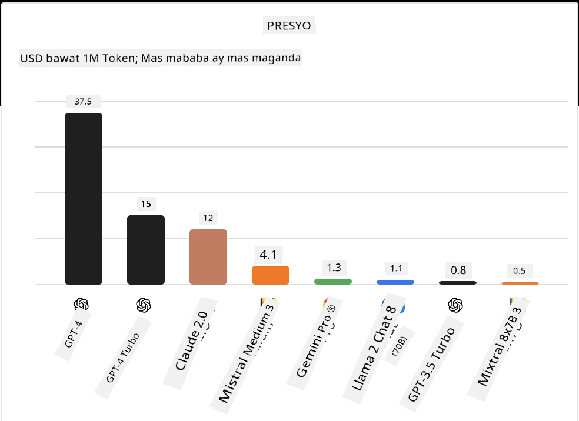
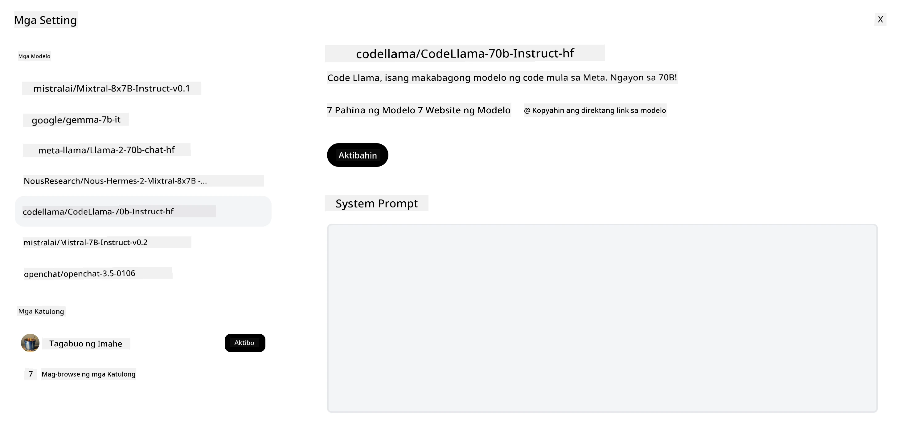
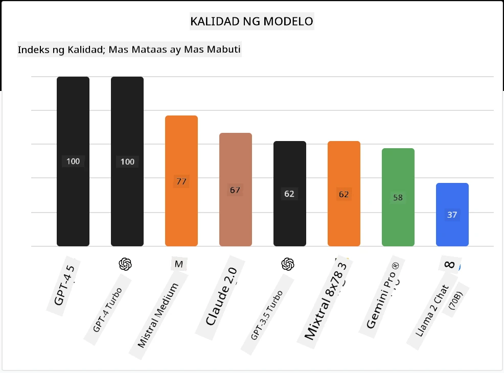

## Panimula

Ang mundo ng open-source LLMs ay kapana-panabik at patuloy na umuunlad. Layunin ng araling ito na magbigay ng malalim na pagtingin sa mga open source na modelo. Kung naghahanap ka ng impormasyon kung paano ikinukumpara ang mga proprietary na modelo sa mga open source na modelo, pumunta sa ["Exploring and Comparing Different LLMs" lesson](../02-exploring-and-comparing-different-llms/README.md?WT.mc_id=academic-105485-koreyst). Tatalakayin din sa araling ito ang paksa ng fine-tuning ngunit mas detalyadong paliwanag ay matatagpuan sa ["Fine-Tuning LLMs" lesson](../18-fine-tuning/README.md?WT.mc_id=academic-105485-koreyst).

## Mga Layunin sa Pagkatuto

- Makakuha ng pag-unawa sa mga open source na Modelo
- Maunawaan ang mga benepisyo ng pagtatrabaho gamit ang mga open source na Modelo
- Tuklasin ang mga open models na available sa Hugging Face at sa Azure AI Studio

## Ano ang mga Open Source Models?

Ang open source software ay may mahalagang papel sa paglago ng teknolohiya sa iba't ibang larangan. Ang Open Source Initiative (OSI) ay nagtakda ng [10 criteria para sa software](https://web.archive.org/web/20241126001143/https://opensource.org/osd?WT.mc_id=academic-105485-koreyst) upang maituring itong open source. Ang source code ay dapat na bukas na ibinahagi sa ilalim ng lisensyang aprubado ng OSI.

Bagaman ang pagbuo ng LLMs ay may mga katulad na elemento sa pagbuo ng software, hindi ito eksaktong pareho ang proseso. Ito ay nagdulot ng maraming diskusyon sa komunidad tungkol sa kahulugan ng open source sa konteksto ng LLMs. Para ang isang modelo ay tumugma sa tradisyunal na kahulugan ng open source, ang mga sumusunod na impormasyon ay dapat na pampubliko:

- Mga datasets na ginamit sa pagsasanay ng modelo.
- Buong timbang ng modelo bilang bahagi ng pagsasanay.
- Ang evaluation code.
- Ang fine-tuning code.
- Buong timbang ng modelo at mga training metrics.

Sa kasalukuyan, iilan lamang ang mga modelong tumutugma sa kriteriang ito. Ang [OLMo model na ginawa ng Allen Institute for Artificial Intelligence (AllenAI)](https://huggingface.co/allenai/OLMo-7B?WT.mc_id=academic-105485-koreyst) ay isa sa mga nabibilang sa kategoryang ito.

Para sa araling ito, tatawagin natin ang mga modelo bilang "open models" mula ngayon dahil maaaring hindi pa nila natutugunan ang mga kriteriang nabanggit sa oras ng pagsulat.

## Mga Benepisyo ng Open Models

**Lubhang Napapasadya** - Dahil ang mga open models ay inilalabas kasama ang detalyadong impormasyon sa pagsasanay, maaaring baguhin ng mga mananaliksik at developer ang mga panloob na bahagi ng modelo. Pinapahintulutan nito ang paglikha ng mga modelong lubhang espesyalisado na fine-tuned para sa isang partikular na gawain o larangan ng pag-aaral. Ilan sa mga halimbawa nito ay ang pagbuo ng code, mga operasyong matematika, at biyolohiya.

**Gastos** - Mas mababa ang gastos kada token sa paggamit at pag-deploy ng mga modelong ito kumpara sa mga proprietary na modelo. Kapag bumubuo ng mga Generative AI na aplikasyon, mahalagang tingnan ang performance kumpara sa presyo kapag nagtatrabaho gamit ang mga modelong ito para sa iyong use case.

Pinagmulan: Artificial Analysis

**Kakayahang Magbago-bago** - Ang pagtatrabaho gamit ang open models ay nagbibigay-daan sa iyo na maging flexible sa paggamit ng iba't ibang modelo o pagsasama-sama ng mga ito. Isang halimbawa nito ay ang [HuggingChat Assistants](https://huggingface.co/chat?WT.mc_id=academic-105485-koreyst) kung saan maaaring pumili ang user ng modelong gagamitin direkta sa user interface:

## Pagtuklas sa Iba't Ibang Open Models

### Llama 2

[LLama2](https://huggingface.co/meta-llama?WT.mc_id=academic-105485-koreyst), na binuo ng Meta, ay isang open model na na-optimize para sa mga chat-based na aplikasyon. Ito ay dahil sa paraan ng fine-tuning nito, na kinabibilangan ng malaking dami ng diyalogo at feedback mula sa tao. Sa pamamaraang ito, ang modelo ay naglalabas ng mga resulta na mas naaayon sa inaasahan ng tao na nagbibigay ng mas magandang karanasan sa user.

Ilan sa mga halimbawa ng fine-tuned na bersyon ng Llama ay ang [Japanese Llama](https://huggingface.co/elyza/ELYZA-japanese-Llama-2-7b?WT.mc_id=academic-105485-koreyst), na espesyalisado sa wikang Hapon, at ang [Llama Pro](https://huggingface.co/TencentARC/LLaMA-Pro-8B?WT.mc_id=academic-105485-koreyst), na isang pinahusay na bersyon ng base model.

### Mistral

[Mistral](https://huggingface.co/mistralai?WT.mc_id=academic-105485-koreyst) ay isang open model na may matibay na pokus sa mataas na performance at kahusayan. Ginagamit nito ang Mixture-of-Experts na pamamaraan na pinagsasama ang isang grupo ng mga espesyalisadong expert models sa isang sistema kung saan depende sa input, pinipili ang ilang mga modelo na gagamitin. Ginagawa nitong mas epektibo ang komputasyon dahil ang mga modelo ay tumutugon lamang sa mga input na kanilang espesyalisado.

Ilan sa mga halimbawa ng fine-tuned na bersyon ng Mistral ay ang [BioMistral](https://huggingface.co/BioMistral/BioMistral-7B?text=Mon+nom+est+Thomas+et+mon+principal?WT.mc_id=academic-105485-koreyst), na nakatuon sa medikal na larangan, at ang [OpenMath Mistral](https://huggingface.co/nvidia/OpenMath-Mistral-7B-v0.1-hf?WT.mc_id=academic-105485-koreyst), na gumaganap ng mga matematikal na kalkulasyon.

### Falcon

[Falcon](https://huggingface.co/tiiuae?WT.mc_id=academic-105485-koreyst) ay isang LLM na nilikha ng Technology Innovation Institute (**TII**). Ang Falcon-40B ay sinanay gamit ang 40 bilyong parameters na ipinakita na mas mahusay kaysa sa GPT-3 gamit ang mas mababang compute budget. Ito ay dahil sa paggamit nito ng FlashAttention algorithm at multiquery attention na nagpapababa ng pangangailangan sa memorya sa oras ng inference. Sa pinababang oras ng inference, ang Falcon-40B ay angkop para sa mga chat na aplikasyon.

Ilan sa mga halimbawa ng fine-tuned na bersyon ng Falcon ay ang [OpenAssistant](https://huggingface.co/OpenAssistant/falcon-40b-sft-top1-560?WT.mc_id=academic-105485-koreyst), isang assistant na binuo gamit ang open models, at ang [GPT4ALL](https://huggingface.co/nomic-ai/gpt4all-falcon?WT.mc_id=academic-105485-koreyst), na nagbibigay ng mas mataas na performance kaysa sa base model.

## Paano Pumili

Walang iisang sagot sa pagpili ng open model. Isang magandang lugar upang magsimula ay ang paggamit ng filter by task feature ng Azure AI Studio. Makakatulong ito upang maunawaan mo kung anong mga uri ng gawain ang sinanay sa modelo. Pinapanatili rin ng Hugging Face ang isang LLM Leaderboard na nagpapakita ng mga pinakamahusay na modelong may mataas na performance base sa ilang mga metrics.

Kapag naghahanap ng paghahambing ng LLMs sa iba't ibang uri, ang [Artificial Analysis](https://artificialanalysis.ai/?WT.mc_id=academic-105485-koreyst) ay isa pang mahusay na mapagkukunan:

Pinagmulan: Artificial Analysis

Kung nagtatrabaho sa isang partikular na use case, ang paghahanap ng mga fine-tuned na bersyon na nakatuon sa parehong larangan ay maaaring maging epektibo. Ang pagsubok sa maraming open models upang makita kung paano sila gumaganap ayon sa iyong at ng iyong mga user na inaasahan ay isa pang magandang gawain.

## Mga Susunod na Hakbang

Ang pinakamagandang bahagi tungkol sa open models ay maaari kang agad na makapagsimula sa pagtatrabaho gamit ang mga ito. Tingnan ang [Azure AI Foundry Model Catalog](https://ai.azure.com?WT.mc_id=academic-105485-koreyst), na nagtatampok ng isang partikular na koleksyon ng Hugging Face na may mga modelong tinalakay natin dito.

## Hindi Dito Nagtatapos ang Pagkatuto, Ipagpatuloy ang Paglalakbay

Pagkatapos makumpleto ang araling ito, tingnan ang aming [Generative AI Learning collection](https://aka.ms/genai-collection?WT.mc_id=academic-105485-koreyst) upang ipagpatuloy ang pagpapalawak ng iyong kaalaman sa Generative AI!

---

<!-- CO-OP TRANSLATOR DISCLAIMER START -->
**Paalala**:
Ang dokumentong ito ay isinalin gamit ang AI translation service na [Co-op Translator](https://github.com/Azure/co-op-translator). Bagamat nagsusumikap kami para sa katumpakan, pakatandaan na ang mga awtomatikong pagsasalin ay maaaring maglaman ng mga pagkakamali o di-tumpak na impormasyon. Ang orihinal na dokumento sa kanyang sariling wika ang dapat ituring na pangunahing sanggunian. Para sa mahahalagang impormasyon, inirerekomenda ang propesyonal na pagsasalin ng tao. Hindi kami mananagot sa anumang hindi pagkakaunawaan o maling interpretasyon na maaaring magmula sa paggamit ng pagsasaling ito.
<!-- CO-OP TRANSLATOR DISCLAIMER END -->