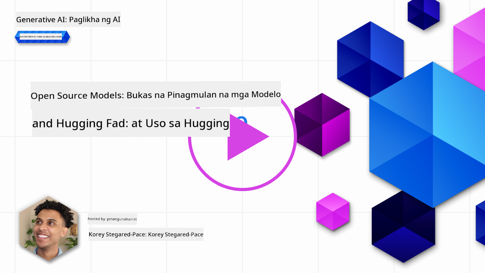
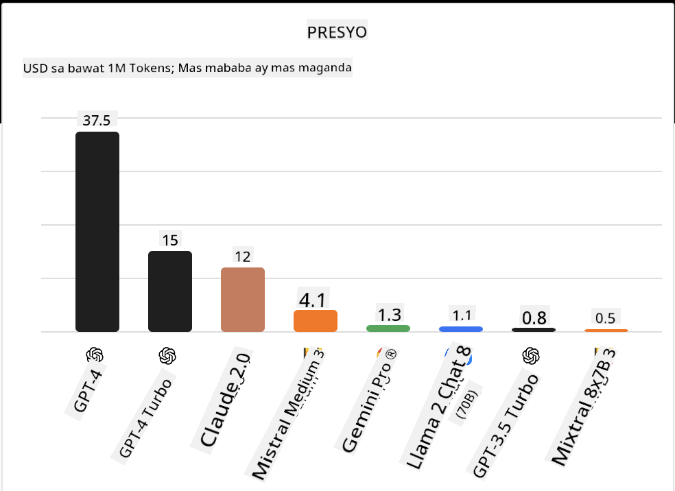
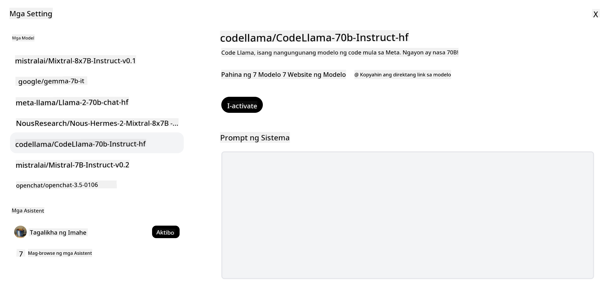

<!--
CO_OP_TRANSLATOR_METADATA:
{
  "original_hash": "a2a83aac52158c23161046cbd13faa2b",
  "translation_date": "2025-10-17T13:21:19+00:00",
  "source_file": "16-open-source-models/README.md",
  "language_code": "tl"
}
-->

## Panimula

Ang mundo ng open-source LLMs ay kapana-panabik at patuloy na umuunlad. Layunin ng araling ito na magbigay ng mas malalim na pag-unawa sa mga open-source na modelo. Kung naghahanap ka ng impormasyon kung paano ikumpara ang mga proprietary na modelo sa mga open-source na modelo, pumunta sa ["Paggalugad at Paghahambing ng Iba't Ibang LLMs" na aralin](../02-exploring-and-comparing-different-llms/README.md?WT.mc_id=academic-105485-koreyst). Tatalakayin din sa araling ito ang paksa ng fine-tuning, ngunit mas detalyadong paliwanag ay matatagpuan sa ["Fine-Tuning LLMs" na aralin](../18-fine-tuning/README.md?WT.mc_id=academic-105485-koreyst).

## Mga Layunin sa Pag-aaral

- Maunawaan ang mga open-source na modelo
- Maunawaan ang mga benepisyo ng paggamit ng open-source na modelo
- Galugarin ang mga open models na makikita sa Hugging Face at Azure AI Studio

## Ano ang Open Source Models?

Ang open-source software ay may mahalagang papel sa pag-unlad ng teknolohiya sa iba't ibang larangan. Ang Open Source Initiative (OSI) ay nagtakda ng [10 pamantayan para sa software](https://web.archive.org/web/20241126001143/https://opensource.org/osd?WT.mc_id=academic-105485-koreyst) upang maiklasipika bilang open source. Ang source code ay kailangang bukas na ibinabahagi sa ilalim ng lisensyang aprubado ng OSI.

Bagamat ang pagbuo ng LLMs ay may mga katulad na elemento sa pagbuo ng software, hindi ito eksaktong pareho. Nagdulot ito ng maraming talakayan sa komunidad tungkol sa kahulugan ng open source sa konteksto ng LLMs. Para maituring na naaayon sa tradisyunal na depinisyon ng open source, ang sumusunod na impormasyon ay dapat na pampubliko:

- Mga dataset na ginamit sa pag-train ng modelo.
- Buong model weights bilang bahagi ng training.
- Ang evaluation code.
- Ang fine-tuning code.
- Buong model weights at training metrics.

Sa kasalukuyan, iilan lamang ang mga modelo na tumutugma sa mga pamantayang ito. Ang [OLMo model na ginawa ng Allen Institute for Artificial Intelligence (AllenAI)](https://huggingface.co/allenai/OLMo-7B?WT.mc_id=academic-105485-koreyst) ay isa sa mga tumutugma sa kategoryang ito.

Para sa araling ito, tatawagin natin ang mga modelo bilang "open models" mula ngayon dahil maaaring hindi sila tumutugma sa mga pamantayan sa itaas sa oras ng pagsulat.

## Mga Benepisyo ng Open Models

**Lubos na Napapasadya** - Dahil ang open models ay inilalabas na may detalyadong impormasyon sa training, maaaring baguhin ng mga mananaliksik at developer ang mga internal ng modelo. Pinapahintulutan nito ang paglikha ng mga modelong lubos na angkop para sa partikular na gawain o larangan ng pag-aaral. Ilang halimbawa nito ay ang code generation, mathematical operations, at biology.

**Gastos** - Ang gastos kada token sa paggamit at pag-deploy ng mga modelong ito ay mas mababa kumpara sa mga proprietary na modelo. Kapag gumagawa ng mga Generative AI application, mahalagang suriin ang performance kumpara sa presyo para sa iyong use case.

  
Source: Artificial Analysis

**Flexibility** - Ang paggamit ng open models ay nagbibigay-daan sa flexibility sa paggamit ng iba't ibang modelo o pagsasama-sama ng mga ito. Isang halimbawa nito ay ang [HuggingChat Assistants](https://huggingface.co/chat?WT.mc_id=academic-105485-koreyst) kung saan maaaring pumili ang user ng modelong ginagamit direkta sa user interface:

## Paggalugad ng Iba't Ibang Open Models

### Llama 2

[LLama2](https://huggingface.co/meta-llama?WT.mc_id=academic-105485-koreyst), na binuo ng Meta, ay isang open model na na-optimize para sa mga chat-based na aplikasyon. Ito ay dahil sa fine-tuning method nito, na kinabibilangan ng malaking dami ng dialogue at human feedback. Sa pamamaraang ito, ang modelo ay nagbibigay ng mas maraming resulta na naaayon sa inaasahan ng tao, na nagbibigay ng mas mahusay na karanasan sa user.

Ilan sa mga halimbawa ng fine-tuned na bersyon ng Llama ay ang [Japanese Llama](https://huggingface.co/elyza/ELYZA-japanese-Llama-2-7b?WT.mc_id=academic-105485-koreyst), na nakatuon sa Japanese, at [Llama Pro](https://huggingface.co/TencentARC/LLaMA-Pro-8B?WT.mc_id=academic-105485-koreyst), na isang pinahusay na bersyon ng base model.

### Mistral

[Mistral](https://huggingface.co/mistralai?WT.mc_id=academic-105485-koreyst) ay isang open model na may malakas na pokus sa mataas na performance at efficiency. Ginagamit nito ang Mixture-of-Experts approach na pinagsasama ang grupo ng mga specialized expert models sa isang sistema kung saan, depende sa input, ang ilang modelo ay pinipili upang gamitin. Ginagawa nitong mas epektibo ang computation dahil ang mga modelo ay tumutugon lamang sa mga input na kanilang espesyalisasyon.

Ilan sa mga halimbawa ng fine-tuned na bersyon ng Mistral ay ang [BioMistral](https://huggingface.co/BioMistral/BioMistral-7B?text=Mon+nom+est+Thomas+et+mon+principal?WT.mc_id=academic-105485-koreyst), na nakatuon sa medical domain, at [OpenMath Mistral](https://huggingface.co/nvidia/OpenMath-Mistral-7B-v0.1-hf?WT.mc_id=academic-105485-koreyst), na gumagawa ng mathematical computation.

### Falcon

[Falcon](https://huggingface.co/tiiuae?WT.mc_id=academic-105485-koreyst) ay isang LLM na ginawa ng Technology Innovation Institute (**TII**). Ang Falcon-40B ay na-train sa 40 bilyong parameters na napatunayang mas mahusay kaysa GPT-3 na may mas mababang compute budget. Ito ay dahil sa paggamit nito ng FlashAttention algorithm at multiquery attention na nagpapababa sa memory requirements sa inference time. Sa mas mababang inference time, ang Falcon-40B ay angkop para sa mga chat applications.

Ilan sa mga halimbawa ng fine-tuned na bersyon ng Falcon ay ang [OpenAssistant](https://huggingface.co/OpenAssistant/falcon-40b-sft-top1-560?WT.mc_id=academic-105485-koreyst), isang assistant na binuo sa open models, at [GPT4ALL](https://huggingface.co/nomic-ai/gpt4all-falcon?WT.mc_id=academic-105485-koreyst), na nagbibigay ng mas mataas na performance kaysa sa base model.

## Paano Pumili

Walang iisang sagot sa pagpili ng open model. Isang magandang simula ay ang paggamit ng filter by task feature ng Azure AI Studio. Makakatulong ito upang maunawaan kung anong uri ng mga gawain ang na-train para sa modelo. Ang Hugging Face ay mayroon ding LLM Leaderboard na nagpapakita ng pinakamahusay na mga modelo batay sa ilang metrics.

Kapag naghahanap ng paghahambing ng LLMs sa iba't ibang uri, ang [Artificial Analysis](https://artificialanalysis.ai/?WT.mc_id=academic-105485-koreyst) ay isa pang mahusay na mapagkukunan:

  
Source: Artificial Analysis

Kung nagtatrabaho sa isang partikular na use case, ang paghahanap ng fine-tuned na bersyon na nakatuon sa parehong larangan ay maaaring maging epektibo. Ang pag-eksperimento sa maraming open models upang makita kung paano sila gumagana ayon sa iyong at sa inaasahan ng iyong mga user ay isa pang magandang kasanayan.

## Mga Susunod na Hakbang

Ang pinakamagandang bahagi ng open models ay maaari kang magsimula sa paggamit ng mga ito nang mabilis. Tingnan ang [Azure AI Foundry Model Catalog](https://ai.azure.com?WT.mc_id=academic-105485-koreyst), na nagtatampok ng isang partikular na Hugging Face collection na may mga modelong tinalakay natin dito.

## Hindi Natatapos ang Pag-aaral Dito, Ipagpatuloy ang Paglalakbay

Pagkatapos makumpleto ang araling ito, tingnan ang aming [Generative AI Learning collection](https://aka.ms/genai-collection?WT.mc_id=academic-105485-koreyst) upang patuloy na paunlarin ang iyong kaalaman sa Generative AI!

---

**Paunawa**:  
Ang dokumentong ito ay isinalin gamit ang AI translation service na [Co-op Translator](https://github.com/Azure/co-op-translator). Bagamat sinisikap naming maging tumpak, pakatandaan na ang mga awtomatikong pagsasalin ay maaaring maglaman ng mga pagkakamali o hindi pagkakatugma. Ang orihinal na dokumento sa kanyang katutubong wika ang dapat ituring na opisyal na sanggunian. Para sa mahalagang impormasyon, inirerekomenda ang propesyonal na pagsasalin ng tao. Hindi kami mananagot sa anumang hindi pagkakaunawaan o maling interpretasyon na dulot ng paggamit ng pagsasaling ito.