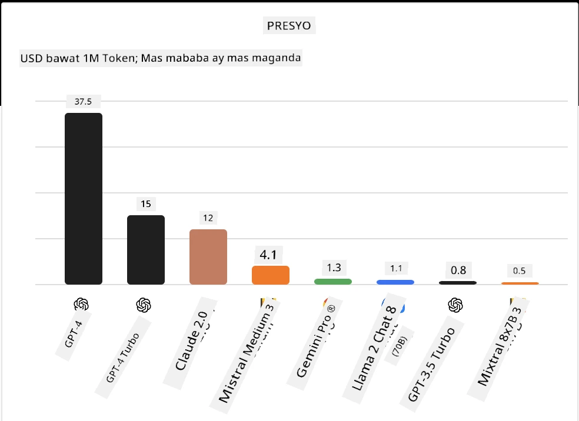
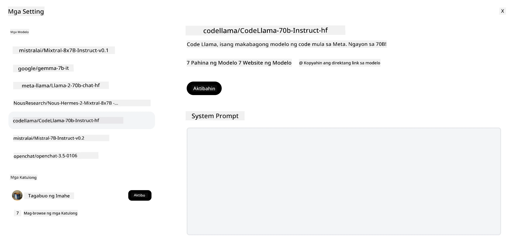
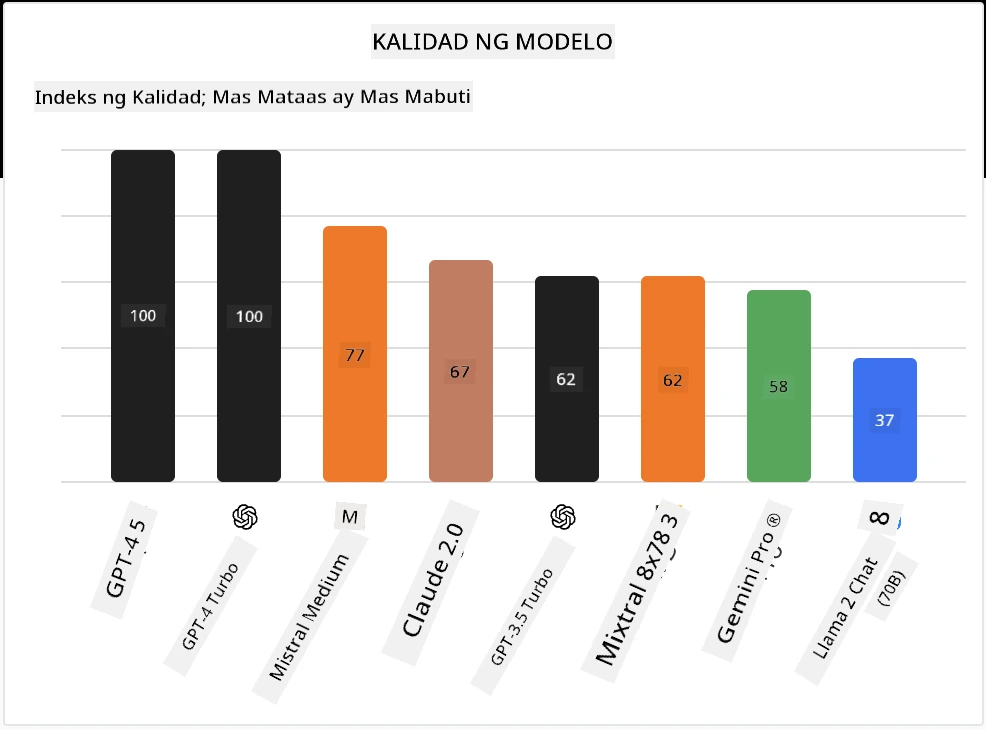

## Panimula

Ang mundo ng open-source LLMs ay kapana-panabik at patuloy na umuunlad. Nilalayon ng araling ito na magbigay ng malalim na pagtingin sa mga open source models. Kung naghahanap ka ng impormasyon kung paano ikinumpara ang proprietary models sa open source models, pumunta sa ["Exploring and Comparing Different LLMs" lesson](../02-exploring-and-comparing-different-llms/README.md?WT.mc_id=academic-105485-koreyst). Tatalakayin din sa araling ito ang paksa ng fine-tuning ngunit ang mas detalyadong paliwanag ay matatagpuan sa ["Fine-Tuning LLMs" lesson](../18-fine-tuning/README.md?WT.mc_id=academic-105485-koreyst).

## Mga Layunin sa Pagkatuto

- Magkaroon ng pag-unawa tungkol sa mga open source Models
- Pag-unawa sa mga benepisyo ng paggamit ng open source Models
- Pagsaliksik sa mga open models na available sa Hugging Face at sa Microsoft Foundry model catalog

## Ano ang Open Source Models?

Ang open source software ay may mahalagang papel sa paglago ng teknolohiya sa iba't ibang larangan. Ang Open Source Initiative (OSI) ay nagtakda ng [10 pamantayan para sa software](https://web.archive.org/web/20241126001143/https://opensource.org/osd?WT.mc_id=academic-105485-koreyst) upang maituring bilang open source. Ang source code ay dapat hayagang ibinabahagi sa ilalim ng lisensiyang inaprubahan ng OSI.

Habang ang pagbuo ng LLMs ay may mga katulad na elemento sa pagbuo ng software, ang proseso ay hindi eksaktong pareho. Ito ay nagdulot ng maraming diskusyon sa komunidad tungkol sa kahulugan ng open source sa konteksto ng LLMs. Para ang isang modelo ay makaayon sa tradisyunal na kahulugan ng open source, ang sumusunod na impormasyon ay dapat pampubliko:

- Mga dataset na ginamit para sanayin ang modelo.
- Buong model weights bilang bahagi ng pagsasanay.
- Ang evaluation code.
- Ang fine-tuning code.
- Buong model weights at mga training metrics.

Sa kasalukuyan, kakaunti lamang ang mga modelong tumutugma sa pamantayang ito. Ang [OLMo model na nilikha ng Allen Institute for Artificial Intelligence (AllenAI)](https://huggingface.co/allenai/OLMo-7B?WT.mc_id=academic-105485-koreyst) ay isa sa mga nabibilang sa kategoryang ito.

Para sa araling ito, tatawagin natin ang mga modelo bilang "open models" mula ngayon dahil maaaring hindi pa sila tumutugma sa pamantayan noong isinulat ito.

## Mga Benepisyo ng Open Models

**Lubos na Napapasadya** - Dahil ang mga open models ay inilalabas na may detalyadong impormasyon sa pagsasanay, maaaring baguhin ng mga mananaliksik at developer ang mga internal ng modelo. Pinapahintulutan nito ang paglikha ng mga modelong napakaespesyal na na fine-tuned para sa isang partikular na gawain o larangan ng pag-aaral. Ilan sa mga halimbawa nito ay ang generasyon ng code, mga operasyong matematika, at biyolohiya.

**Gastos** - Ang gastos kada token sa paggamit at pag-deploy ng mga modelong ito ay mas mababa kaysa sa mga proprietary models. Kapag bumubuo ng mga Generative AI application, mahalagang tingnan ang performance kumpara sa presyo kapag gumagamit ng mga modelong ito para sa iyong use case.

Pinagmulan: Artificial Analysis

**Kakayahang magbago** - Ang paggamit ng open models ay nagbibigay-daan sa iyo na maging flexible sa paggamit ng iba't ibang mga modelo o pagsasama-sama ng mga ito. Isang halimbawa nito ay ang [HuggingChat Assistants](https://huggingface.co/chat?WT.mc_id=academic-105485-koreyst) kung saan maaaring direktang piliin ng user ang modelong gagamitin sa user interface:

## Pagsaliksik sa Iba't Ibang Open Models

### Llama 2

Ang [LLama2](https://huggingface.co/meta-llama?WT.mc_id=academic-105485-koreyst), na dinevelop ng Meta ay isang open model na optimized para sa chat-based applications. Ito ay dahil sa paraan ng fine-tuning nito, na kinabibilangan ng malaking dami ng dialogo at feedback mula sa tao. Sa metodong ito, ang modelo ay nagbibigay ng mga resulta na mas naaayon sa inaasahan ng tao na nagbibigay ng mas maganda at mas kasiya-siyang karanasan ng user.

Ilan sa mga halimbawa ng fine-tuned na bersyon ng Llama ay ang [Japanese Llama](https://huggingface.co/elyza/ELYZA-japanese-Llama-2-7b?WT.mc_id=academic-105485-koreyst), na espesyalisado sa wikang Hapones at [Llama Pro](https://huggingface.co/TencentARC/LLaMA-Pro-8B?WT.mc_id=academic-105485-koreyst), na isang pinahusay na bersyon ng base na modelo.

### Mistral

Ang [Mistral](https://huggingface.co/mistralai?WT.mc_id=academic-105485-koreyst) ay open model na may matibay na pokus sa mataas na performance at kahusayan. Ginagamit nito ang Mixture-of-Experts na pamamaraan kung saan pinagsasama ang isang grupo ng mga espesyalistang modelo sa isang sistema na kung saan, depende sa input, pinipili ang ilang modelo na gagamitin. Ginagawa nitong mas epektibo ang pagkalkula dahil ang mga modelo ay tinutugunan lamang ang mga input na kanilang espesyalidad.

Ilan sa mga halimbawa ng fine-tuned na bersyon ng Mistral ay ang [BioMistral](https://huggingface.co/BioMistral/BioMistral-7B?text=Mon+nom+est+Thomas+et+mon+principal?WT.mc_id=academic-105485-koreyst), na nakatuon sa larangan ng medisina at [OpenMath Mistral](https://huggingface.co/nvidia/OpenMath-Mistral-7B-v0.1-hf?WT.mc_id=academic-105485-koreyst), na gumagawa ng mga operasyong matematika.

### Falcon

Ang [Falcon](https://huggingface.co/tiiuae?WT.mc_id=academic-105485-koreyst) ay isang LLM na ginawa ng Technology Innovation Institute (**TII**). Ang Falcon-40B ay sinanay gamit ang 40 bilyong parameters na ipinakita na mas mahusay kaysa sa GPT-3 na may mas mababang compute budget. Ito ay dahil sa paggamit ng FlashAttention algorithm at multiquery attention na nagpapababa ng pangangailangan sa memorya sa panahon ng inference. Dahil sa pinaliit na oras ng inference, ang Falcon-40B ay angkop para sa mga chat application.

Ilan sa mga halimbawa ng fine-tuned na bersyon ng Falcon ay ang [OpenAssistant](https://huggingface.co/OpenAssistant/falcon-40b-sft-top1-560?WT.mc_id=academic-105485-koreyst), isang assistant na binuo gamit ang mga open models at [GPT4ALL](https://huggingface.co/nomic-ai/gpt4all-falcon?WT.mc_id=academic-105485-koreyst), na nagbibigay ng mas mataas na performance kaysa sa base na modelo.

## Paano Pumili

Walang iisang sagot sa pagpili ng open model. Isang magandang panimulang punto ay ang paggamit ng filter by task feature ng Microsoft Foundry model catalog. Makakatulong ito upang maunawaan kung anong mga uri ng gawain ang sinanay para sa modelo. Pinananatili rin ng Hugging Face ang LLM Leaderboard na nagpapakita ng pinakamahusay na mga modelo batay sa ilang metrics.

Kapag nais ikumpara ang LLMs sa iba't ibang uri, ang [Artificial Analysis](https://artificialanalysis.ai/?WT.mc_id=academic-105485-koreyst) ay isa pang mahusay na mapagkukunan:

Pinagmulan: Artificial Analysis

Kung nagtatrabaho sa isang partikular na use case, ang paghahanap ng mga fine-tuned na bersyon na nakatuon sa parehong larangan ay maaaring maging epektibo. Ang pagsubok sa maraming open models upang makita kung paano sila magpapakita ayon sa iyong at ng iyong mga user na inaasahan ay isa pang magandang kasanayan.

## Mga Susunod na Hakbang

Ang pinakamagandang bahagi ng open models ay maaari kang agad makapagsimula sa paggamit nito. Suriin ang [Microsoft Foundry model catalog](https://ai.azure.com?WT.mc_id=academic-105485-koreyst), na nagtatampok ng isang partikular na Hugging Face collection na may mga modelong tinalakay natin dito.

## Hindi Dito Nagtatapos ang Pagkatuto, Ipagpatuloy ang Paglalakbay

Pagkatapos tapusin ang araling ito, tingnan ang aming [Generative AI Learning collection](https://aka.ms/genai-collection?WT.mc_id=academic-105485-koreyst) upang ipagpatuloy ang pagpapalawak ng iyong kaalaman sa Generative AI!

---

<!-- CO-OP TRANSLATOR DISCLAIMER START -->
**Pagtatanggi**:
Ang dokumentong ito ay isinalin gamit ang serbisyo ng AI translation na [Co-op Translator](https://github.com/Azure/co-op-translator). Bagama't nagsusumikap kami para sa katumpakan, pakatandaan na ang awtomatikong pagsasalin ay maaaring maglaman ng mga pagkakamali o hindi pagkakatugma. Ang orihinal na dokumento sa orihinal nitong wika ang dapat ituring na pangunahing sanggunian. Para sa mahahalagang impormasyon, inirerekomenda ang propesyonal na pagsasalin ng tao. Hindi kami mananagot sa anumang maling pagkakaintindi o maling interpretasyon na nagmula sa paggamit ng pagsasaling ito.
<!-- CO-OP TRANSLATOR DISCLAIMER END -->