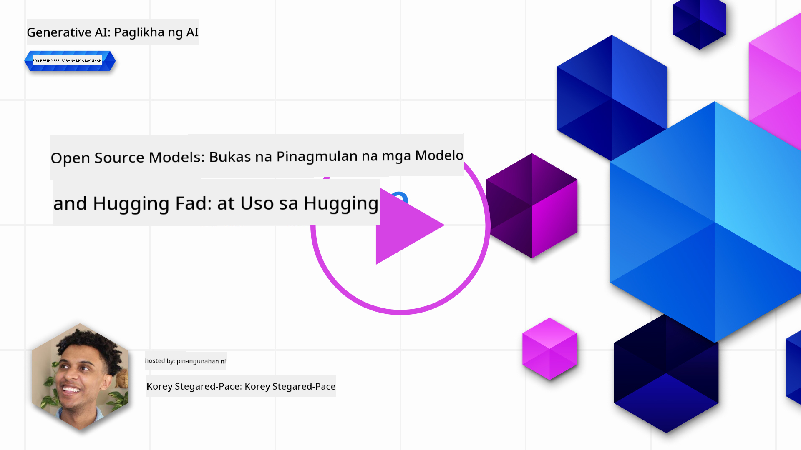
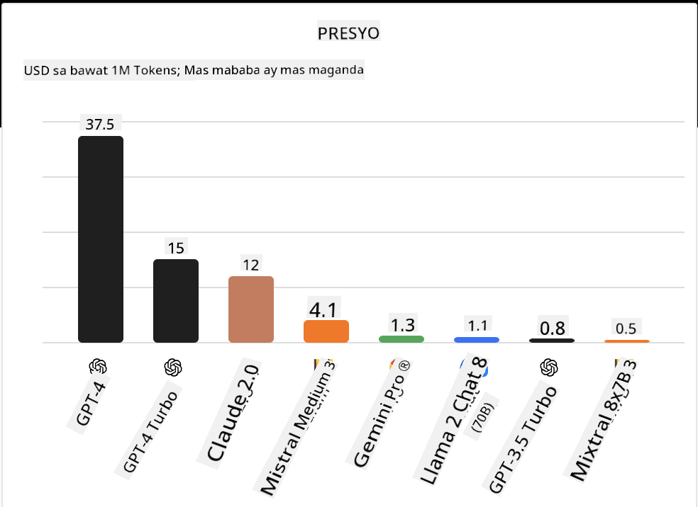
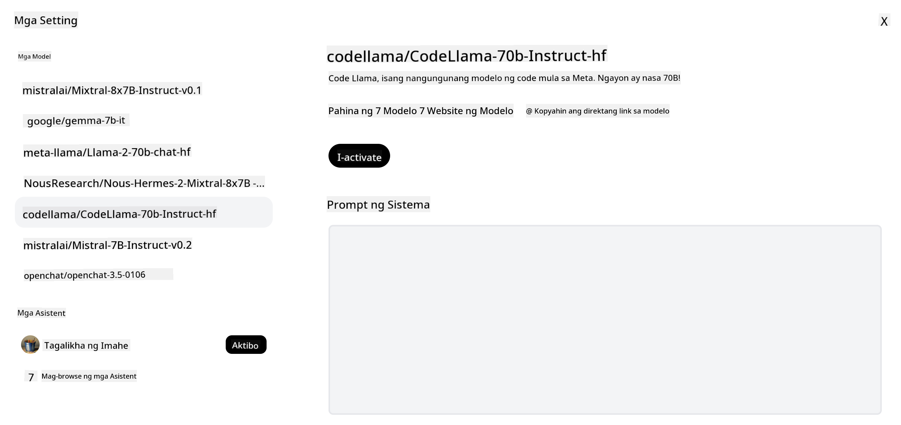

<!--
CO_OP_TRANSLATOR_METADATA:
{
  "original_hash": "0bba96e53ab841d99db731892a51fab8",
  "translation_date": "2025-06-26T00:01:29+00:00",
  "source_file": "16-open-source-models/README.md",
  "language_code": "tl"
}
-->

## Panimula

Ang mundo ng open-source LLMs ay kapanapanabik at patuloy na nagbabago. Ang araling ito ay naglalayong magbigay ng malalim na pagtingin sa mga open source models. Kung naghahanap ka ng impormasyon kung paano ikinukumpara ang mga proprietary models sa open source models, pumunta sa ["Exploring and Comparing Different LLMs" lesson](../02-exploring-and-comparing-different-llms/README.md?WT.mc_id=academic-105485-koreyst). Tatalakayin din ng araling ito ang paksa ng fine-tuning ngunit ang mas detalyadong paliwanag ay matatagpuan sa ["Fine-Tuning LLMs" lesson](../18-fine-tuning/README.md?WT.mc_id=academic-105485-koreyst).

## Mga Layunin sa Pag-aaral

- Maunawaan ang mga open source Models
- Maunawaan ang mga benepisyo ng pagtatrabaho sa open source Models
- Tuklasin ang mga open models na makukuha sa Hugging Face at Azure AI Studio

## Ano ang Open Source Models?

Ang open source software ay may mahalagang papel sa paglago ng teknolohiya sa iba't ibang larangan. Ang Open Source Initiative (OSI) ay nagtakda ng [10 pamantayan para sa software](https://web.archive.org/web/20241126001143/https://opensource.org/osd?WT.mc_id=academic-105485-koreyst) upang mauri bilang open source. Ang source code ay dapat na bukas na ibinahagi sa ilalim ng lisensya na inaprubahan ng OSI.

Habang ang pag-unlad ng LLMs ay may katulad na mga elemento sa pagbuo ng software, hindi eksaktong pareho ang proseso. Ito ay nagdulot ng maraming talakayan sa komunidad tungkol sa kahulugan ng open source sa konteksto ng LLMs. Para sa isang modelo na umayon sa tradisyonal na kahulugan ng open source, ang sumusunod na impormasyon ay dapat na pampublikong magagamit:

- Mga dataset na ginamit upang sanayin ang modelo.
- Buong model weights bilang bahagi ng pagsasanay.
- Ang evaluation code.
- Ang fine-tuning code.
- Buong model weights at training metrics.

Sa kasalukuyan, mayroon lamang ilang mga modelo na tumutugma sa pamantayang ito. Ang [OLMo model na ginawa ng Allen Institute for Artificial Intelligence (AllenAI)](https://huggingface.co/allenai/OLMo-7B?WT.mc_id=academic-105485-koreyst) ay isa sa mga nabibilang sa kategoryang ito.

Para sa araling ito, tatawagin natin ang mga modelo bilang "open models" sa hinaharap dahil maaaring hindi sila tumutugma sa pamantayan sa itaas sa oras ng pagsulat.

## Mga Benepisyo ng Open Models

**Lubos na Naiaangkop** - Dahil ang mga open models ay inilalabas na may detalyadong impormasyon sa pagsasanay, maaaring baguhin ng mga mananaliksik at developer ang mga panloob na bahagi ng modelo. Ito ay nagbibigay-daan sa paglikha ng mga lubos na espesyal na modelo na fine-tuned para sa tiyak na gawain o larangan ng pag-aaral. Ilang halimbawa nito ay ang code generation, mga operasyong matematika, at biology.

**Gastos** - Ang gastos bawat token sa paggamit at pag-deploy ng mga modelong ito ay mas mababa kaysa sa mga proprietary models. Kapag bumubuo ng mga Generative AI applications, dapat isaalang-alang ang pagganap kumpara sa presyo kapag nagtatrabaho sa mga modelong ito para sa iyong kaso ng paggamit.

Pinagmulan: Artificial Analysis

**Kakayahang Magbago** - Ang pagtatrabaho sa open models ay nagbibigay-daan sa iyo na maging flexible sa paggamit ng iba't ibang mga modelo o pagsasama-sama ng mga ito. Isang halimbawa nito ay ang [HuggingChat Assistants](https://huggingface.co/chat?WT.mc_id=academic-105485-koreyst) kung saan maaaring piliin ng user ang modelong ginagamit nang direkta sa user interface:

## Pagtuklas sa Iba't Ibang Open Models

### Llama 2

[LLama2](https://huggingface.co/meta-llama?WT.mc_id=academic-105485-koreyst), na binuo ng Meta ay isang open model na na-optimize para sa chat-based applications. Ito ay dahil sa kanyang fine-tuning method, na kinabibilangan ng malaking halaga ng dialogue at feedback ng tao. Sa pamamagitan ng pamamaraang ito, ang modelo ay gumagawa ng mas maraming resulta na naaayon sa inaasahan ng tao na nagbibigay ng mas magandang karanasan sa gumagamit.

Ilan sa mga halimbawa ng fine-tuned na bersyon ng Llama ay ang [Japanese Llama](https://huggingface.co/elyza/ELYZA-japanese-Llama-2-7b?WT.mc_id=academic-105485-koreyst), na nag-specialize sa Japanese at [Llama Pro](https://huggingface.co/TencentARC/LLaMA-Pro-8B?WT.mc_id=academic-105485-koreyst), na isang pinahusay na bersyon ng base model.

### Mistral

[Mistral](https://huggingface.co/mistralai?WT.mc_id=academic-105485-koreyst) ay isang open model na may matinding pokus sa mataas na pagganap at kahusayan. Ginagamit nito ang Mixture-of-Experts approach na pinagsasama-sama ang grupo ng mga espesyal na expert models sa isang sistema kung saan, depende sa input, ang ilang mga modelo ay pinipili na gamitin. Ito ay nagpapahusay sa computation dahil ang mga modelo ay tumutugon lamang sa mga input na kanilang naisasapian.

Ilan sa mga halimbawa ng fine-tuned na bersyon ng Mistral ay ang [BioMistral](https://huggingface.co/BioMistral/BioMistral-7B?text=Mon+nom+est+Thomas+et+mon+principal?WT.mc_id=academic-105485-koreyst), na nakatuon sa medical domain at [OpenMath Mistral](https://huggingface.co/nvidia/OpenMath-Mistral-7B-v0.1-hf?WT.mc_id=academic-105485-koreyst), na nagsasagawa ng mathematical computation.

### Falcon

[Falcon](https://huggingface.co/tiiuae?WT.mc_id=academic-105485-koreyst) ay isang LLM na ginawa ng Technology Innovation Institute (**TII**). Ang Falcon-40B ay sinanay sa 40 bilyong parameters na ipinakita na mas mahusay kaysa sa GPT-3 na may mas mababang compute budget. Ito ay dahil sa paggamit nito ng FlashAttention algorithm at multiquery attention na nagbibigay-daan sa pagputol ng memory requirements sa oras ng inference. Sa nabawasang oras ng inference, ang Falcon-40B ay angkop para sa chat applications.

Ilan sa mga halimbawa ng fine-tuned na bersyon ng Falcon ay ang [OpenAssistant](https://huggingface.co/OpenAssistant/falcon-40b-sft-top1-560?WT.mc_id=academic-105485-koreyst), isang assistant na binuo sa open models at [GPT4ALL](https://huggingface.co/nomic-ai/gpt4all-falcon?WT.mc_id=academic-105485-koreyst), na nagbibigay ng mas mataas na pagganap kaysa sa base model.

## Paano Pumili

Walang isang sagot para sa pagpili ng open model. Isang magandang lugar upang magsimula ay sa pamamagitan ng paggamit ng Azure AI Studio's filter by task feature. Ito ay makakatulong sa iyo na maunawaan kung anong mga uri ng gawain ang modelo ay sinanay para sa. Ang Hugging Face ay nagpapanatili rin ng LLM Leaderboard na nagpapakita sa iyo ng mga pinakamahusay na gumaganap na mga modelo batay sa tiyak na metrics.

Kapag naghahanap na ikumpara ang LLMs sa iba't ibang uri, [Artificial Analysis](https://artificialanalysis.ai/?WT.mc_id=academic-105485-koreyst) ay isa pang mahusay na mapagkukunan:

Pinagmulan: Artifical Analysis

Kung nagtatrabaho sa isang tiyak na kaso ng paggamit, ang paghahanap para sa fine-tuned na bersyon na nakatuon sa parehong larangan ay maaaring maging epektibo. Ang pag-eksperimento sa maramihang open models upang makita kung paano sila gumaganap ayon sa iyong at sa iyong mga gumagamit' na inaasahan ay isa pang magandang kasanayan.

## Mga Susunod na Hakbang

Ang pinakamagandang bahagi tungkol sa open models ay maaari kang magsimula sa pagtatrabaho sa kanila nang mabilis. Tingnan ang [Azure AI Studio Model Catalog](https://ai.azure.com?WT.mc_id=academic-105485-koreyst), na nagtatampok ng tiyak na Hugging Face collection kasama ang mga modelong ito na tinalakay natin dito.

## Ang Pag-aaral ay Hindi Humihinto Dito, Ipagpatuloy ang Paglalakbay

Pagkatapos makumpleto ang araling ito, tingnan ang aming [Generative AI Learning collection](https://aka.ms/genai-collection?WT.mc_id=academic-105485-koreyst) upang ipagpatuloy ang pagpapalawak ng iyong kaalaman sa Generative AI!

**Paunawa**:  
Ang dokumentong ito ay isinalin gamit ang serbisyo ng AI na pagsasalin [Co-op Translator](https://github.com/Azure/co-op-translator). Bagaman sinisikap naming maging tumpak, mangyaring tandaan na ang mga awtomatikong pagsasalin ay maaaring maglaman ng mga pagkakamali o hindi pagkakatugma. Ang orihinal na dokumento sa kanyang katutubong wika ay dapat ituring na mapagkakatiwalaang mapagkukunan. Para sa kritikal na impormasyon, inirerekomenda ang propesyonal na pagsasalin ng tao. Hindi kami mananagot sa anumang hindi pagkakaintindihan o maling interpretasyon na nagmumula sa paggamit ng pagsasaling ito.