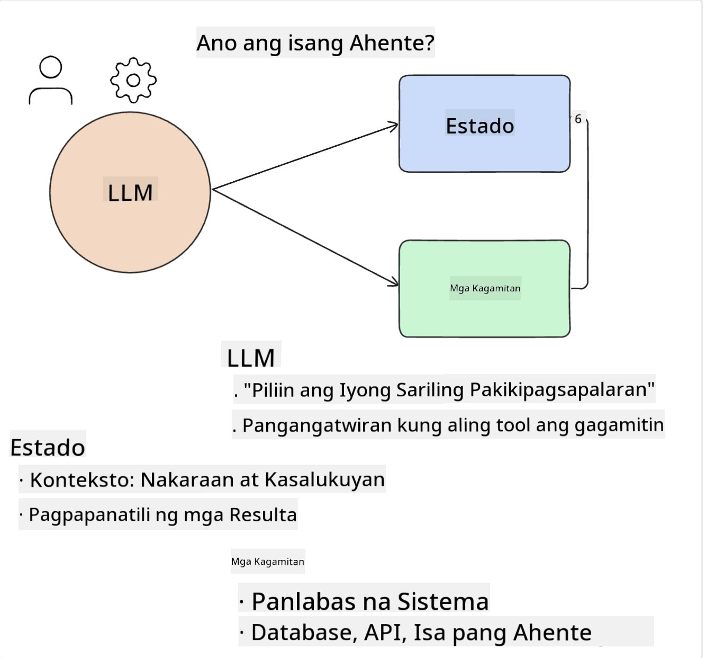
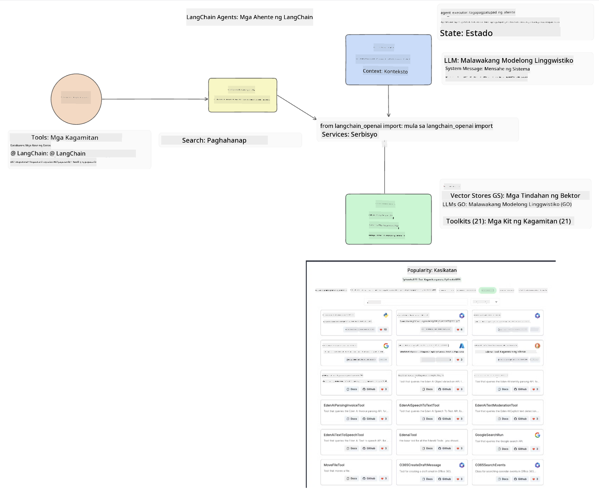
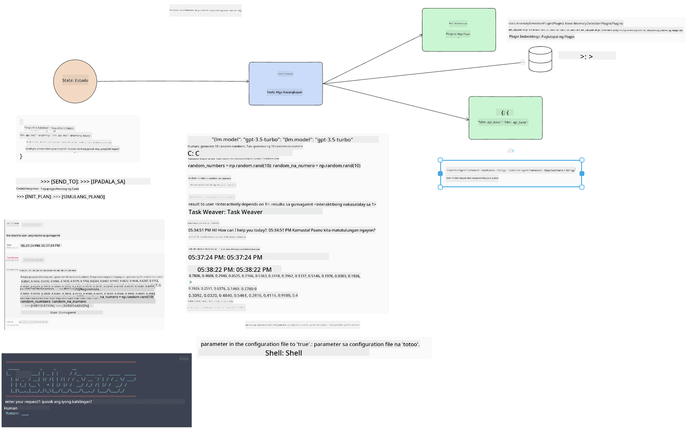
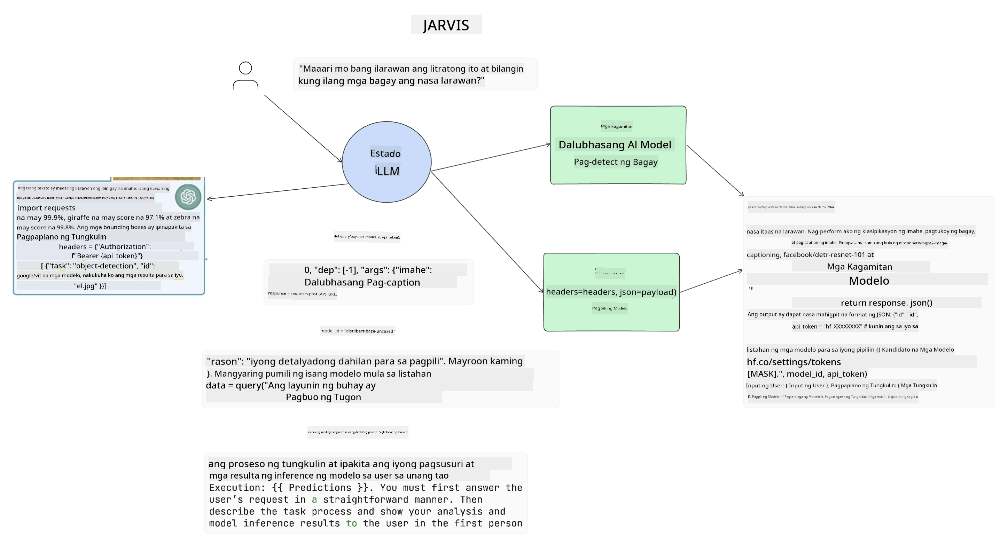

<!--
CO_OP_TRANSLATOR_METADATA:
{
  "original_hash": "11f03c81f190d9cbafd0f977dcbede6c",
  "translation_date": "2025-05-20T07:29:07+00:00",
  "source_file": "17-ai-agents/README.md",
  "language_code": "tl"
}
-->
[](https://aka.ms/gen-ai-lesson17-gh?WT.mc_id=academic-105485-koreyst)

## Panimula

Ang mga AI Agents ay kumakatawan sa isang kapanapanabik na pag-unlad sa Generative AI, na nagbibigay-daan sa mga Large Language Models (LLMs) na umunlad mula sa pagiging mga katulong patungo sa mga ahente na may kakayahang kumilos. Ang mga AI Agent frameworks ay nagbibigay-daan sa mga developer na lumikha ng mga aplikasyon na nagbibigay sa LLMs ng access sa mga tool at pamamahala ng estado. Pinapahusay din ng mga framework na ito ang visibility, na nagpapahintulot sa mga gumagamit at developer na subaybayan ang mga aksyon na pinaplano ng LLMs, kaya't pinapabuti ang pamamahala ng karanasan.

Tatalakayin ng leksyon ang mga sumusunod na lugar:

- Pag-unawa kung ano ang isang AI Agent - Ano nga ba ang AI Agent?
- Pagsusuri sa apat na iba't ibang AI Agent Frameworks - Ano ang nagpapabukod-tangi sa kanila?
- Paglalapat ng mga AI Agents sa iba't ibang kaso ng paggamit - Kailan natin dapat gamitin ang AI Agents?

## Mga Layunin sa Pag-aaral

Pagkatapos ng leksyon na ito, magagawa mong:

- Ipaliwanag kung ano ang AI Agents at paano sila magagamit.
- Magkaroon ng pag-unawa sa mga pagkakaiba sa pagitan ng ilan sa mga sikat na AI Agent Frameworks, at paano sila nagkakaiba.
- Maunawaan kung paano gumagana ang AI Agents upang makabuo ng mga aplikasyon gamit sila.

## Ano ang AI Agents?

Ang AI Agents ay isang napaka-kapanapanabik na larangan sa mundo ng Generative AI. Kasama ng kasiyahan na ito ay minsang may kalituhan sa mga termino at kanilang aplikasyon. Upang gawing simple at inclusive ang karamihan ng mga tool na tumutukoy sa AI Agents, gagamitin natin ang kahulugang ito:

Pinapayagan ng AI Agents ang Large Language Models (LLMs) na magsagawa ng mga gawain sa pamamagitan ng pagbibigay sa kanila ng access sa isang **estado** at **mga tool**.



I-defina natin ang mga terminong ito:

**Large Language Models** - Ito ang mga modelong tinutukoy sa buong kurso tulad ng GPT-3.5, GPT-4, Llama-2, atbp.

**Estado** - Ito ay tumutukoy sa konteksto na kung saan nagtatrabaho ang LLM. Ginagamit ng LLM ang konteksto ng kanyang mga nakaraang aksyon at ang kasalukuyang konteksto, na gumagabay sa kanyang desisyon para sa mga susunod na aksyon. Pinapayagan ng AI Agent Frameworks ang mga developer na mas madaling mapanatili ang konteksto na ito.

**Mga Tool** - Upang makumpleto ang gawain na hiniling ng gumagamit at na pinlano ng LLM, kailangan ng LLM ng access sa mga tool. Ilang halimbawa ng mga tool ay maaaring isang database, isang API, isang panlabas na aplikasyon o kahit isa pang LLM!

Ang mga kahulugang ito ay sana magbigay sa iyo ng magandang pundasyon sa pag-unlad habang tinitingnan natin kung paano sila ipinatutupad. Tuklasin natin ang ilang iba't ibang AI Agent frameworks:

## LangChain Agents

[LangChain Agents](https://python.langchain.com/docs/how_to/#agents?WT.mc_id=academic-105485-koreyst) ay isang implementasyon ng mga kahulugang ibinigay natin sa itaas.

Upang pamahalaan ang **estado**, gumagamit ito ng built-in na function na tinatawag na `AgentExecutor`. Tumatanggap ito ng tinukoy na `agent` at ang `tools` na available dito.

Ang `Agent Executor` ay nag-iimbak din ng kasaysayan ng chat upang magbigay ng konteksto ng chat.



Nag-aalok ang LangChain ng isang [catalog ng mga tool](https://integrations.langchain.com/tools?WT.mc_id=academic-105485-koreyst) na maaaring i-import sa iyong aplikasyon kung saan ang LLM ay maaaring makakuha ng access. Ang mga ito ay ginawa ng komunidad at ng LangChain team.

Maaari mong tukuyin ang mga tool na ito at ipasa ang mga ito sa `Agent Executor`.

Ang visibility ay isa pang mahalagang aspeto kapag pinag-uusapan ang AI Agents. Mahalaga para sa mga developer ng aplikasyon na maunawaan kung aling tool ang ginagamit ng LLM at bakit. Para dito, ang team sa LangChain ay bumuo ng LangSmith.

## AutoGen

Ang susunod na AI Agent framework na ating tatalakayin ay [AutoGen](https://microsoft.github.io/autogen/?WT.mc_id=academic-105485-koreyst). Ang pangunahing pokus ng AutoGen ay mga pag-uusap. Ang mga ahente ay parehong **conversable** at **customizable**.

**Conversable -** Maaaring simulan at ipagpatuloy ng LLMs ang pag-uusap sa isa pang LLM upang makumpleto ang isang gawain. Ginagawa ito sa pamamagitan ng paglikha ng `AssistantAgents` at pagbibigay sa kanila ng tiyak na mensahe ng sistema.

```python

autogen.AssistantAgent( name="Coder", llm_config=llm_config, ) pm = autogen.AssistantAgent( name="Product_manager", system_message="Creative in software product ideas.", llm_config=llm_config, )

```

**Customizable** - Maaaring tukuyin ang mga ahente hindi lamang bilang LLMs kundi bilang isang gumagamit o isang tool. Bilang isang developer, maaari kang mag-defina ng `UserProxyAgent` na responsable sa pakikipag-ugnayan sa gumagamit para sa feedback sa pagkumpleto ng isang gawain. Ang feedback na ito ay maaaring ipagpatuloy ang pagganap ng gawain o ihinto ito.

```python
user_proxy = UserProxyAgent(name="user_proxy")
```

### Estado at Mga Tool

Upang baguhin at pamahalaan ang estado, bumubuo ang assistant Agent ng Python code upang makumpleto ang gawain.

Narito ang isang halimbawa ng proseso:


#### LLM na Tinukoy ng Mensahe ng Sistema

```python
system_message="For weather related tasks, only use the functions you have been provided with. Reply TERMINATE when the task is done."
```

Itinuturo ng mga mensahe ng sistema ang partikular na LLM sa kung aling mga function ang nauugnay para sa kanyang gawain. Tandaan, sa AutoGen maaari kang magkaroon ng maramihang tinukoy na AssistantAgents na may iba't ibang mga mensahe ng sistema.

#### Chat ay Sinimulan ng Gumagamit

```python
user_proxy.initiate_chat( chatbot, message="I am planning a trip to NYC next week, can you help me pick out what to wear? ", )

```

Ang mensaheng ito mula sa user_proxy (Tao) ang magsisimula ng proseso ng Agent upang tuklasin ang mga posibleng function na dapat nitong isagawa.

#### Function ay Isinasagawa

```bash
chatbot (to user_proxy):

***** Suggested tool Call: get_weather ***** Arguments: {"location":"New York City, NY","time_periond:"7","temperature_unit":"Celsius"} ******************************************************** --------------------------------------------------------------------------------

>>>>>>>> EXECUTING FUNCTION get_weather... user_proxy (to chatbot): ***** Response from calling function "get_weather" ***** 112.22727272727272 EUR ****************************************************************

```

Kapag naproseso ang paunang chat, ipapadala ng Agent ang iminumungkahing tool na tawagan. Sa kasong ito, ito ay isang function na tinatawag na `get_weather`. Depending on your configuration, this function can be automatically executed and read by the Agent or can be executed based on user input.

You can find a list of [AutoGen code samples](https://microsoft.github.io/autogen/docs/Examples/?WT.mc_id=academic-105485-koreyst) to further explore how to get started building.

## Taskweaver

The next agent framework we will explore is [Taskweaver](https://microsoft.github.io/TaskWeaver/?WT.mc_id=academic-105485-koreyst). It is known as a "code-first" agent because instead of working strictly with `strings` , it can work with DataFrames in Python. This becomes extremely useful for data analysis and generation tasks. This can be things like creating graphs and charts or generating random numbers.

### State and Tools

To manage the state of the conversation, TaskWeaver uses the concept of a `Planner`. The `Planner` is a LLM that takes the request from the users and maps out the tasks that need to be completed to fulfill this request.

To complete the tasks the `Planner` is exposed to the collection of tools called `Plugins`. Maaari itong mga Python classes o isang pangkalahatang code interpreter. Ang mga plugins na ito ay naka-imbak bilang embeddings upang mas mahusay na mahanap ng LLM ang tamang plugin.



Narito ang isang halimbawa ng plugin upang hawakan ang anomaly detection:

```python
class AnomalyDetectionPlugin(Plugin): def __call__(self, df: pd.DataFrame, time_col_name: str, value_col_name: str):
```

Ang code ay sinusuri bago isagawa. Isa pang tampok upang pamahalaan ang konteksto sa Taskweaver ay `experience`. Experience allows for the context of a conversation to be stored over to the long term in a YAML file. This can be configured so that the LLM improves over time on certain tasks given that it is exposed to prior conversations.

## JARVIS

The last agent framework we will explore is [JARVIS](https://github.com/microsoft/JARVIS?tab=readme-ov-file?WT.mc_id=academic-105485-koreyst). What makes JARVIS unique is that it uses an LLM to manage the `state` ng pag-uusap at ang `tools` ay ibang mga AI models. Bawat isa sa mga AI models ay mga espesyal na modelo na nagsasagawa ng tiyak na mga gawain tulad ng object detection, transcription o image captioning.



Ang LLM, bilang isang pangkalahatang layunin na modelo, ay tumatanggap ng kahilingan mula sa gumagamit at kinikilala ang partikular na gawain at anumang mga argumento/data na kailangan upang makumpleto ang gawain.

```python
[{"task": "object-detection", "id": 0, "dep": [-1], "args": {"image": "e1.jpg" }}]
```

Pagkatapos ay inaayos ng LLM ang kahilingan sa paraang maaaring maunawaan ng espesyal na AI model, tulad ng JSON. Kapag ibinalik ng AI model ang kanyang prediksyon batay sa gawain, tinatanggap ng LLM ang tugon.

Kung kailangan ng maramihang mga modelo upang makumpleto ang gawain, ito rin ay i-interpret ang tugon mula sa mga modelong iyon bago pagsamahin ang mga ito upang makabuo ng tugon sa gumagamit.

Ang halimbawa sa ibaba ay nagpapakita kung paano ito gagana kapag ang isang gumagamit ay humihiling ng paglalarawan at bilang ng mga bagay sa isang larawan:

## Takdang-aralin

Upang ipagpatuloy ang iyong pag-aaral ng AI Agents maaari kang bumuo gamit ang AutoGen:

- Isang aplikasyon na nagsisimula ng isang business meeting sa iba't ibang departamento ng isang education startup.
- Lumikha ng mga mensahe ng sistema na gumagabay sa LLMs sa pag-unawa sa iba't ibang mga persona at priyoridad, at pinapayagan ang gumagamit na mag-present ng bagong ideya ng produkto.
- Ang LLM ay dapat bumuo ng mga follow-up na tanong mula sa bawat departamento upang pinuhin at pagbutihin ang presentasyon at ang ideya ng produkto.

## Ang Pag-aaral ay Hindi Nagtatapos Dito, Ipagpatuloy ang Paglalakbay

Pagkatapos makumpleto ang leksyon na ito, tingnan ang aming [Generative AI Learning collection](https://aka.ms/genai-collection?WT.mc_id=academic-105485-koreyst) upang ipagpatuloy ang pag-level up ng iyong kaalaman sa Generative AI!

**Paunawa**:  
Ang dokumentong ito ay isinalin gamit ang AI translation service na [Co-op Translator](https://github.com/Azure/co-op-translator). Habang sinisikap naming maging tama, mangyaring tandaan na ang mga awtomatikong pagsasalin ay maaaring maglaman ng mga pagkakamali o hindi pagkakatumpak. Ang orihinal na dokumento sa kanyang katutubong wika ay dapat ituring na mapagkakatiwalaang mapagkukunan. Para sa mahahalagang impormasyon, inirerekomenda ang propesyonal na pagsasalin ng tao. Hindi kami mananagot para sa anumang hindi pagkakaintindihan o maling interpretasyon na dulot ng paggamit ng pagsasaling ito.