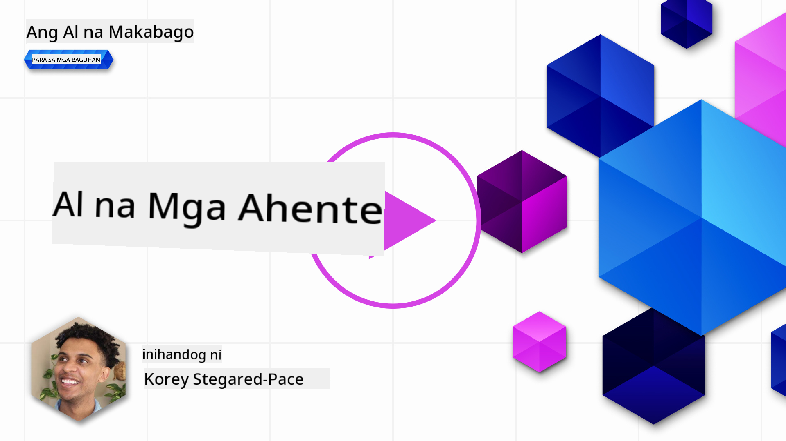
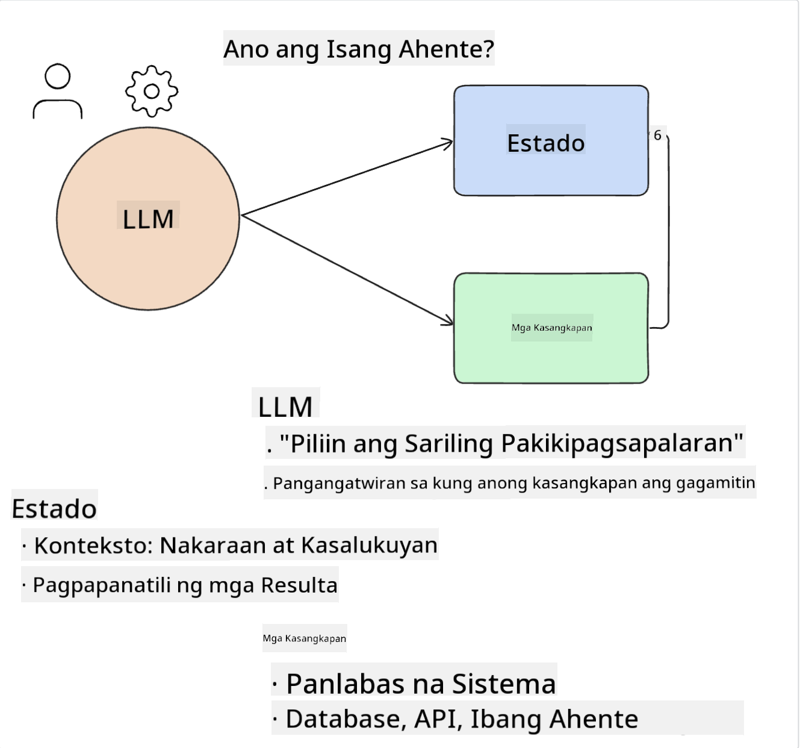
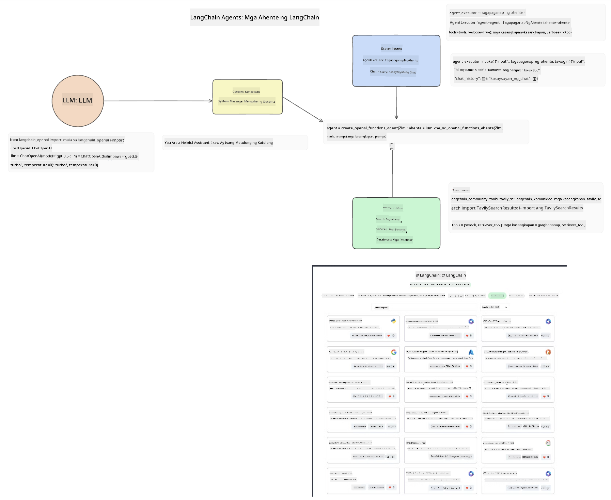
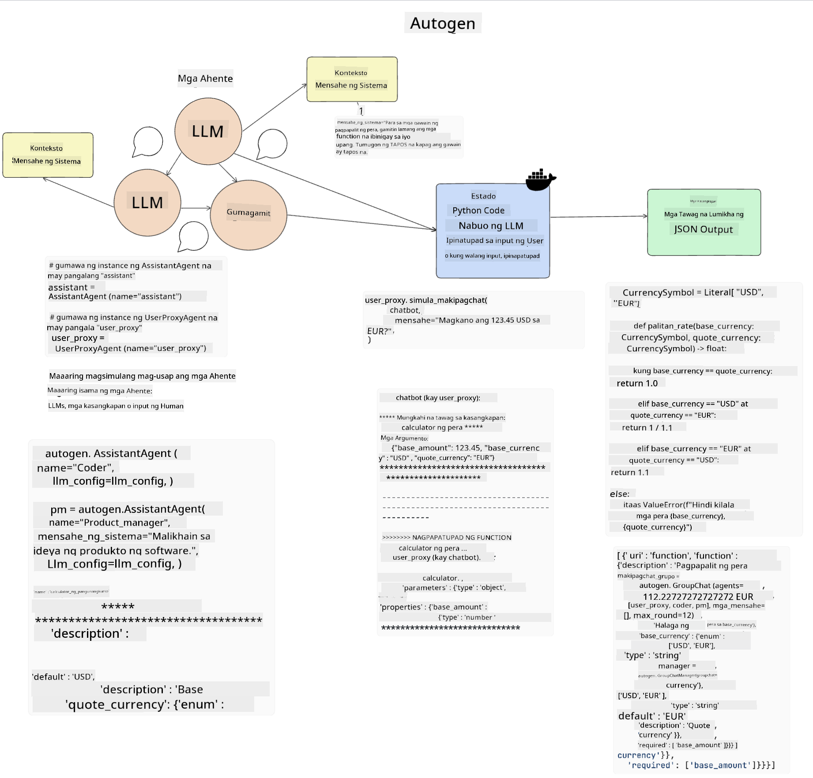
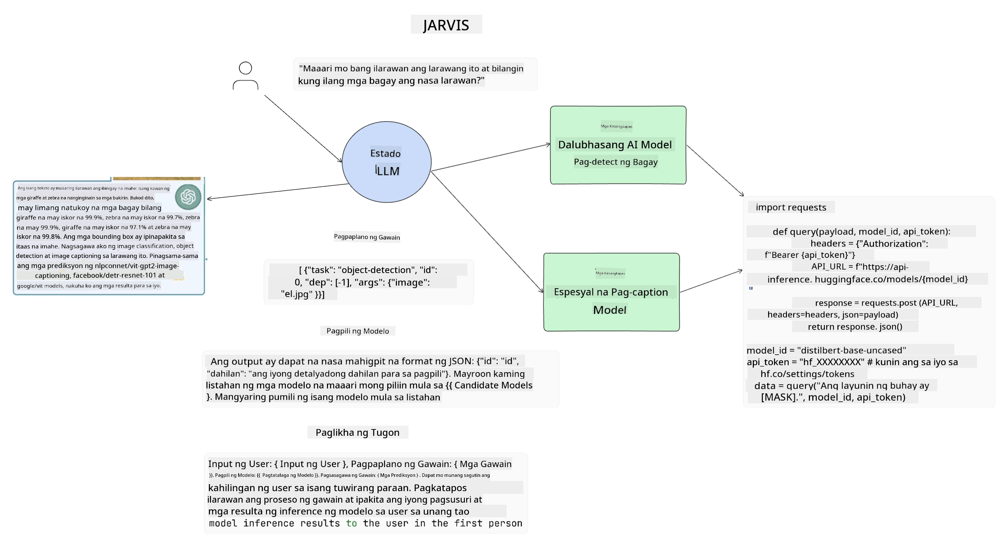

<!--
CO_OP_TRANSLATOR_METADATA:
{
  "original_hash": "11f03c81f190d9cbafd0f977dcbede6c",
  "translation_date": "2025-06-26T00:22:58+00:00",
  "source_file": "17-ai-agents/README.md",
  "language_code": "tl"
}
-->
[](https://aka.ms/gen-ai-lesson17-gh?WT.mc_id=academic-105485-koreyst)

## Panimula

Ang AI Agents ay kumakatawan sa isang kapanapanabik na pag-unlad sa Generative AI, na nagpapahintulot sa Large Language Models (LLMs) na mag-evolve mula sa pagiging mga katulong tungo sa mga ahente na may kakayahang kumilos. Ang mga AI Agent frameworks ay nagbibigay-daan sa mga developer na lumikha ng mga aplikasyon na nagbibigay sa LLMs ng access sa mga tools at pamamahala ng estado. Ang mga framework na ito ay nagpapahusay din ng visibility, na nagpapahintulot sa mga gumagamit at developer na subaybayan ang mga aksyon na binalak ng LLMs, kaya't pinapabuti ang pamamahala ng karanasan.

Saklaw ng aralin ang mga sumusunod na lugar:

- Pag-unawa kung ano ang AI Agent - Ano nga ba ang AI Agent?
- Paggalugad sa apat na iba't ibang AI Agent Frameworks - Ano ang nagpapabukod-tangi sa kanila?
- Paglalapat ng mga AI Agents na ito sa iba't ibang use cases - Kailan natin dapat gamitin ang AI Agents?

## Mga Layunin sa Pagkatuto

Pagkatapos ng aralin na ito, magagawa mo ang sumusunod:

- Ipaliwanag kung ano ang AI Agents at paano ito magagamit.
- Magkaroon ng pag-unawa sa mga pagkakaiba sa pagitan ng ilan sa mga sikat na AI Agent Frameworks, at paano sila nagkakaiba.
- Unawain kung paano gumagana ang AI Agents upang makabuo ng mga aplikasyon gamit ang mga ito.

## Ano ang AI Agents?

Ang AI Agents ay isang napaka-kapanapanabik na larangan sa mundo ng Generative AI. Kasama ng excitement na ito ay minsan ang kalituhan sa mga termino at kanilang aplikasyon. Upang mapanatili ang mga bagay na simple at inclusive ng karamihan sa mga tools na tumutukoy sa AI Agents, gagamitin natin ang kahulugang ito:

Ang AI Agents ay nagpapahintulot sa Large Language Models (LLMs) na magsagawa ng mga gawain sa pamamagitan ng pagbibigay sa kanila ng access sa isang **estado** at **mga tools**.



Tukuyin natin ang mga terminong ito:

**Large Language Models** - Ito ang mga modelong tinutukoy sa buong kurso na ito tulad ng GPT-3.5, GPT-4, Llama-2, atbp.

**Estado** - Ito ay tumutukoy sa konteksto na kung saan ang LLM ay nagtatrabaho. Ang LLM ay gumagamit ng konteksto ng mga nakaraang aksyon nito at ang kasalukuyang konteksto, na gumagabay sa paggawa nito ng desisyon para sa mga susunod na aksyon. Ang AI Agent Frameworks ay nagbibigay-daan sa mga developer na mapanatili ang kontekstong ito nang mas madali.

**Mga Tools** - Upang makumpleto ang gawain na hiniling ng user at binalak ng LLM, kailangan ng LLM ng access sa mga tools. Ilang halimbawa ng tools ay maaaring isang database, isang API, isang external na aplikasyon o kahit isa pang LLM!

Ang mga kahulugang ito ay sana magbigay sa iyo ng magandang pundasyon sa pag-unlad habang tinitingnan natin kung paano sila ipinatutupad. Tuklasin natin ang ilang iba't ibang AI Agent frameworks:

## LangChain Agents

[LangChain Agents](https://python.langchain.com/docs/how_to/#agents?WT.mc_id=academic-105485-koreyst) ay isang implementasyon ng mga kahulugang ibinigay natin sa itaas.

Upang pamahalaan ang **estado**, ito ay gumagamit ng isang built-in na function na tinatawag na `AgentExecutor`. Ito ay tumatanggap ng tinukoy na `agent` at ang `tools` na magagamit nito.

Ang `Agent Executor` ay nag-iimbak din ng kasaysayan ng chat upang magbigay ng konteksto ng chat.



Nag-aalok ang LangChain ng isang [catalog ng mga tools](https://integrations.langchain.com/tools?WT.mc_id=academic-105485-koreyst) na maaaring i-import sa iyong aplikasyon kung saan makakakuha ng access ang LLM. Ito ay ginawa ng komunidad at ng LangChain team.

Maaari mong tukuyin ang mga tools na ito at ipasa ang mga ito sa `Agent Executor`.

Ang visibility ay isa pang mahalagang aspeto kapag pinag-uusapan ang AI Agents. Mahalagang maunawaan ng mga developer ng aplikasyon kung aling tool ang ginagamit ng LLM at bakit. Para dito, ang team sa LangChain ay bumuo ng LangSmith.

## AutoGen

Ang susunod na AI Agent framework na ating tatalakayin ay [AutoGen](https://microsoft.github.io/autogen/?WT.mc_id=academic-105485-koreyst). Ang pangunahing pokus ng AutoGen ay mga pag-uusap. Ang mga ahente ay parehong **conversable** at **customizable**.

**Conversable -** Ang LLMs ay maaaring magsimula at magpatuloy ng pag-uusap sa ibang LLM upang makumpleto ang isang gawain. Ito ay ginagawa sa pamamagitan ng paglikha ng `AssistantAgents` at pagbibigay sa kanila ng isang tiyak na mensahe ng sistema.

```python

autogen.AssistantAgent( name="Coder", llm_config=llm_config, ) pm = autogen.AssistantAgent( name="Product_manager", system_message="Creative in software product ideas.", llm_config=llm_config, )

```

**Customizable** - Ang mga ahente ay maaaring tukuyin hindi lamang bilang LLMs kundi bilang isang user o isang tool. Bilang developer, maaari kang magtakda ng `UserProxyAgent` na responsable sa pakikipag-ugnayan sa user para sa feedback sa pagkumpleto ng isang gawain. Ang feedback na ito ay maaaring magpatuloy ng pagganap ng gawain o itigil ito.

```python
user_proxy = UserProxyAgent(name="user_proxy")
```

### Estado at Mga Tools

Upang baguhin at pamahalaan ang estado, isang assistant Agent ang bumubuo ng Python code upang makumpleto ang gawain.

Narito ang isang halimbawa ng proseso:



#### LLM na Tinukoy sa pamamagitan ng Mensahe ng Sistema

```python
system_message="For weather related tasks, only use the functions you have been provided with. Reply TERMINATE when the task is done."
```

Ang mensahe ng sistemang ito ay nagdidirekta sa partikular na LLM na ito kung aling mga function ang may kaugnayan para sa gawain nito. Tandaan, sa AutoGen maaari kang magkaroon ng maramihang tinukoy na AssistantAgents na may iba't ibang mensahe ng sistema.

#### Chat ay Sinimulan ng User

```python
user_proxy.initiate_chat( chatbot, message="I am planning a trip to NYC next week, can you help me pick out what to wear? ", )

```

Ang mensaheng ito mula sa user_proxy (Human) ay ang magsisimula ng proseso ng Agent upang tuklasin ang mga posibleng function na dapat nitong isagawa.

#### Function ay Isinasagawa

```bash
chatbot (to user_proxy):

***** Suggested tool Call: get_weather ***** Arguments: {"location":"New York City, NY","time_periond:"7","temperature_unit":"Celsius"} ******************************************************** --------------------------------------------------------------------------------

>>>>>>>> EXECUTING FUNCTION get_weather... user_proxy (to chatbot): ***** Response from calling function "get_weather" ***** 112.22727272727272 EUR ****************************************************************

```

Kapag ang paunang chat ay naproseso, ang Agent ay magpapadala ng imungkahing tool na tatawagin. Sa kasong ito, ito ay isang function na tinatawag na `get_weather`. Depending on your configuration, this function can be automatically executed and read by the Agent or can be executed based on user input.

You can find a list of [AutoGen code samples](https://microsoft.github.io/autogen/docs/Examples/?WT.mc_id=academic-105485-koreyst) to further explore how to get started building.

## Taskweaver

The next agent framework we will explore is [Taskweaver](https://microsoft.github.io/TaskWeaver/?WT.mc_id=academic-105485-koreyst). It is known as a "code-first" agent because instead of working strictly with `strings` , it can work with DataFrames in Python. This becomes extremely useful for data analysis and generation tasks. This can be things like creating graphs and charts or generating random numbers.

### State and Tools

To manage the state of the conversation, TaskWeaver uses the concept of a `Planner`. The `Planner` is a LLM that takes the request from the users and maps out the tasks that need to be completed to fulfill this request.

To complete the tasks the `Planner` is exposed to the collection of tools called `Plugins`. Ito ay maaaring mga klase ng Python o isang pangkalahatang interpreter ng code. Ang mga plugin na ito ay nakaimbak bilang embeddings upang mas mahusay na maghanap ang LLM para sa tamang plugin.


Narito ang isang halimbawa ng plugin upang hawakan ang anomaly detection:

```python
class AnomalyDetectionPlugin(Plugin): def __call__(self, df: pd.DataFrame, time_col_name: str, value_col_name: str):
```

Ang code ay sinusuri bago isagawa. Ang isa pang tampok upang pamahalaan ang konteksto sa Taskweaver ay `experience`. Experience allows for the context of a conversation to be stored over to the long term in a YAML file. This can be configured so that the LLM improves over time on certain tasks given that it is exposed to prior conversations.

## JARVIS

The last agent framework we will explore is [JARVIS](https://github.com/microsoft/JARVIS?tab=readme-ov-file?WT.mc_id=academic-105485-koreyst). What makes JARVIS unique is that it uses an LLM to manage the `state` ng pag-uusap at ang `tools` ay iba pang mga AI models. Bawat isa sa mga AI models ay mga espesyal na modelo na nagsasagawa ng tiyak na mga gawain tulad ng object detection, transcription o image captioning.



Ang LLM, bilang isang general purpose model, ay tumatanggap ng kahilingan mula sa user at kinikilala ang tiyak na gawain at anumang mga argumento/data na kailangan upang makumpleto ang gawain.

```python
[{"task": "object-detection", "id": 0, "dep": [-1], "args": {"image": "e1.jpg" }}]
```

Ang LLM pagkatapos ay nag-format ng kahilingan sa paraang maaaring ma-interpret ng espesyal na AI model, tulad ng JSON. Kapag ang AI model ay nagbalik ng hula batay sa gawain, ang LLM ay tumatanggap ng tugon.

Kung kinakailangan ng maramihang modelo upang makumpleto ang gawain, ito ay i-interpret din ang tugon mula sa mga modelong iyon bago pagsamahin ang mga ito upang makabuo ng tugon sa user.

Ang halimbawa sa ibaba ay nagpapakita kung paano ito gagana kapag ang isang user ay humihiling ng paglalarawan at bilang ng mga bagay sa isang larawan:

## Takdang-Aralin

Upang ipagpatuloy ang iyong pag-aaral ng AI Agents maaari kang bumuo gamit ang AutoGen:

- Isang aplikasyon na nagsisimula ng isang business meeting sa iba't ibang departamento ng isang education startup.
- Gumawa ng mga mensahe ng sistema na gumagabay sa LLMs sa pag-unawa sa iba't ibang mga persona at priyoridad, at paganahin ang user na i-pitch ang isang bagong ideya ng produkto.
- Ang LLM ay dapat pagkatapos bumuo ng mga follow-up na tanong mula sa bawat departamento upang pinuhin at pagbutihin ang pitch at ideya ng produkto.

## Hindi natatapos dito ang pag-aaral, ipagpatuloy ang Paglalakbay

Pagkatapos makumpleto ang aralin na ito, tingnan ang aming [Generative AI Learning collection](https://aka.ms/genai-collection?WT.mc_id=academic-105485-koreyst) upang ipagpatuloy ang pag-level up ng iyong kaalaman sa Generative AI!

**Paunawa**:  
Ang dokumentong ito ay isinalin gamit ang AI translation service na [Co-op Translator](https://github.com/Azure/co-op-translator). Habang nagsusumikap kami para sa katumpakan, mangyaring tandaan na ang mga awtomatikong pagsasalin ay maaaring maglaman ng mga pagkakamali o hindi pagkakatumpak. Ang orihinal na dokumento sa kanyang katutubong wika ay dapat ituring na mapagkakatiwalaang pinagmulan. Para sa kritikal na impormasyon, inirerekomenda ang propesyonal na pagsasaling-wika ng tao. Hindi kami mananagot para sa anumang hindi pagkakaunawaan o maling interpretasyon na nagmumula sa paggamit ng pagsasaling ito.