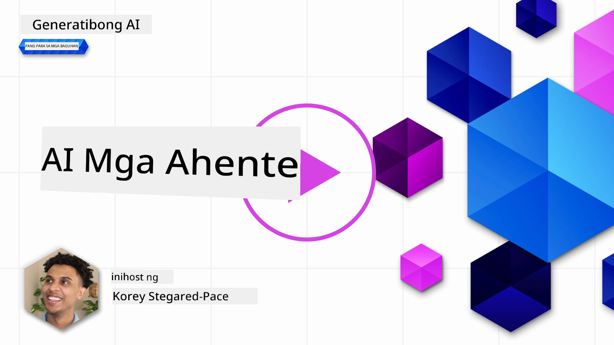
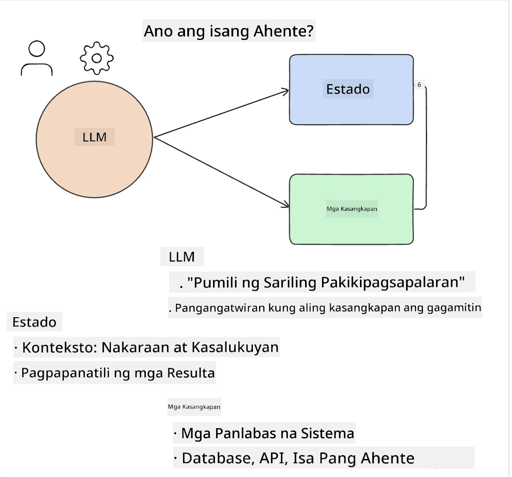
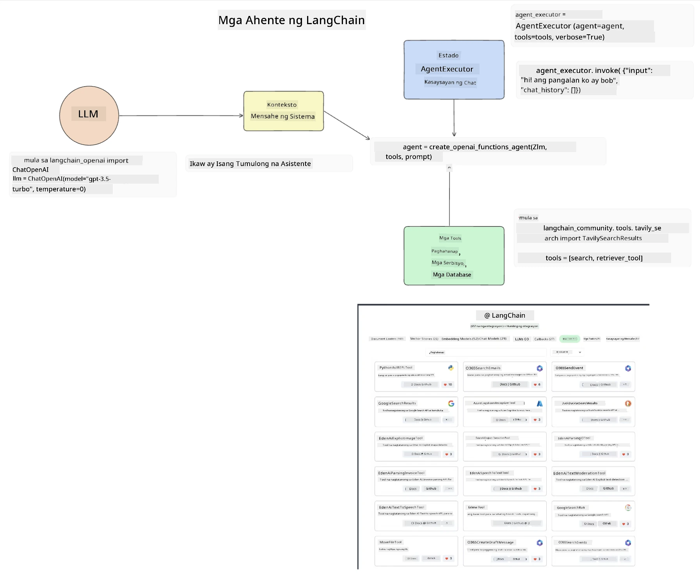
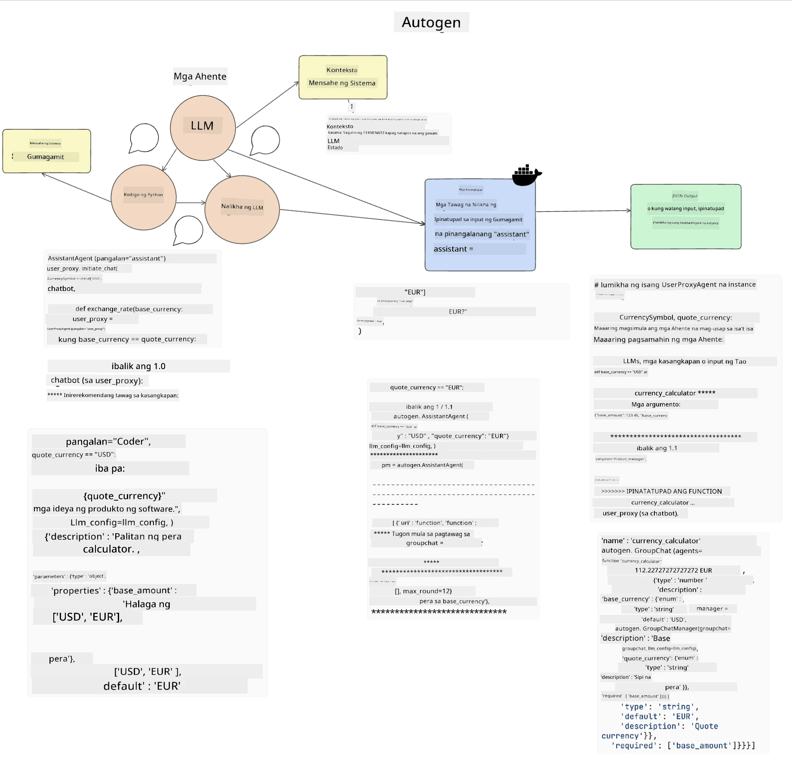
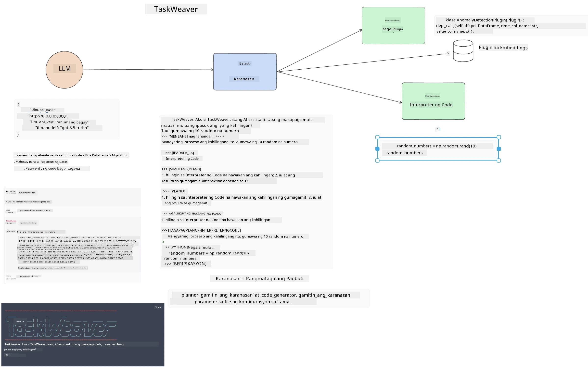
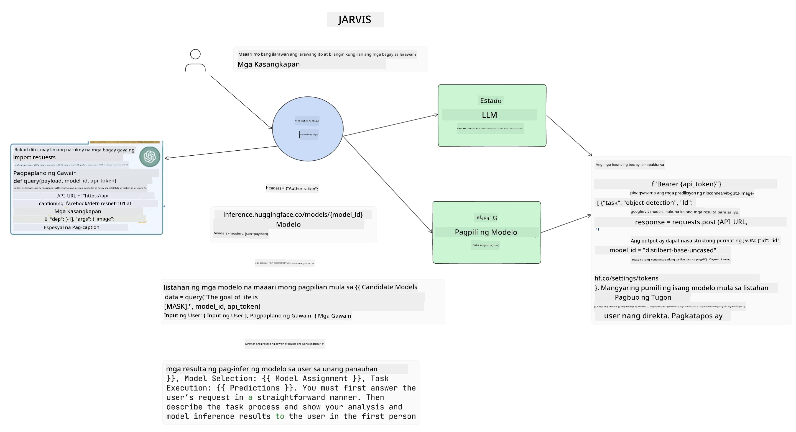

[](https://youtu.be/yAXVW-lUINc?si=bOtW9nL6jc3XJgOM)

## Panimula

Ang AI Agents ay kumakatawan sa isang kapanapanabik na pag-unlad sa Generative AI, na nagbibigay-daan sa Large Language Models (LLMs) na umunlad mula sa mga katulong tungo sa mga ahente na kayang magsagawa ng mga aksyon. Pinapayagan ng mga AI Agent frameworks ang mga developer na lumikha ng mga aplikasyon na nagbibigay ng access sa LLMs sa mga tool at pamamahala ng estado. Pinapalakas din ng mga framework na ito ang visibility, na nagpapahintulot sa mga gumagamit at developer na subaybayan ang mga planong aksyon ng LLMs, kaya't pinapabuti ang pamamahala ng karanasan.

Saklaw ng leksyon ang mga sumusunod na paksa:

- Pag-unawa kung ano ang AI Agent - Ano nga ba talaga ang AI Agent?
- Pagsusuri sa apat na magkakaibang AI Agent Frameworks - Ano ang mga kaibahan nila?
- Paggamit ng mga AI Agents sa iba't ibang mga kaso ng gamit - Kailan natin dapat gamitin ang AI Agents?

## Mga Layunin sa Pagkatuto

Pagkatapos kunin ang leksyong ito, magagawa mong:

- Ipaliwanag kung ano ang AI Agents at kung paano sila magagamit.
- Maunawaan ang mga pagkakaiba sa pagitan ng ilan sa mga kilalang AI Agent Frameworks, at kung paano sila nagkakaiba.
- Maunawaan kung paano gumagana ang AI Agents upang makabuo ng mga aplikasyon gamit ang mga ito.

## Ano ang AI Agents?

Ang AI Agents ay isang napakakapanabik na larangan sa mundo ng Generative AI. Kasabay ng kasiyahang ito ay minsang kalituhan tungkol sa mga termino at aplikasyon nito. Upang gawing simple at masaklaw ang karamihan ng mga tool na tumutukoy sa AI Agents, gagamit tayo ng ganitong kahulugan:

Ang AI Agents ay nagpapahintulot sa Large Language Models (LLMs) na magsagawa ng mga gawain sa pamamagitan ng pagbibigay ng access sa kanila sa isang **estado** at **mga tool**.



Tukuyin natin ang mga terminong ito:

**Large Language Models** - Ito ang mga modelong tinutukoy sa buong kurso tulad ng GPT-3.5, GPT-4, Llama-2, atbp.

**Estado** - Ito ang tumutukoy sa konteksto kung saan nagtatrabaho ang LLM. Ginagamit ng LLM ang konteksto ng mga nakaraang aksyon at kasalukuyang konteksto upang gabayan ang paggawa ng desisyon para sa mga susunod na aksyon. Pinapadali ng AI Agent Frameworks para sa mga developer ang pagpapanatili ng kontekstong ito.

**Mga Tool** - Upang matapos ang gawain na hinihiling ng gumagamit at pinlano ng LLM, kailangan ng LLM ng access sa mga tool. Ilan sa mga halimbawa ng mga tool ay maaaring isang database, isang API, isang panlabas na aplikasyon o maging isa pang LLM!

Ang mga depinisyong ito ay inaasahang makapagbibigay ng matibay na pundasyon habang tinitingnan natin kung paano ito ipinapatupad. Tuklasin natin ang ilang magkakaibang mga AI Agent frameworks:

## LangChain Agents

[LangChain Agents](https://python.langchain.com/docs/how_to/#agents?WT.mc_id=academic-105485-koreyst) ay isang implementasyon ng mga depinisyon na ibinigay natin sa itaas.

Para pamahalaan ang **estado**, gumagamit ito ng built-in na function na tinatawag na `AgentExecutor`. Tumatanggap ito ng tinukoy na `agent` at ang `tools` na available dito.

Sinusulat din ng `Agent Executor` ang history ng chat upang maibigay ang konteksto ng pag-uusap.



Nag-aalok ang LangChain ng [katalogo ng mga tool](https://integrations.langchain.com/tools?WT.mc_id=academic-105485-koreyst) na maaaring i-import sa iyong aplikasyon kung saan makakakuha ng access ang LLM. Ginawa ito ng komunidad at ng koponan ng LangChain.

Maaari mong tukuyin ang mga tool na ito at ipasa sa `Agent Executor`.

Mahalaga rin ang visibility kapag pinag-uusapan ang AI Agents. Mahalaga para sa mga developer ng aplikasyon na maunawaan kung aling tool ang ginagamit ng LLM at bakit. Kaya, nakabuo ang koponan sa LangChain ng LangSmith.

## AutoGen

Ang susunod na AI Agent framework na tatalakayin natin ay ang [AutoGen](https://microsoft.github.io/autogen/?WT.mc_id=academic-105485-koreyst). Pangunahing pokus ng AutoGen ay ang mga pag-uusap. Ang mga agent ay parehong **conversable** at **customizable**.

**Conversable -** Ang LLMs ay maaaring magsimula at magpatuloy ng pag-uusap sa isa pang LLM upang matapos ang isang gawain. Ginagawa ito sa pamamagitan ng paglikha ng `AssistantAgents` at pagbibigay sa kanila ng isang tiyak na system message.

```python

autogen.AssistantAgent( name="Coder", llm_config=llm_config, ) pm = autogen.AssistantAgent( name="Product_manager", system_message="Creative in software product ideas.", llm_config=llm_config, )

```

**Customizable** - Maaaring tukuyin ang mga agent hindi lamang bilang LLMs kundi bilang isang user o tool. Bilang developer, maaari kang magtukoy ng `UserProxyAgent` na responsable sa pakikipag-ugnayan sa user para sa feedback sa pagtapos ng gawain. Ang feedback na ito ay maaaring magpatuloy sa pagsasagawa ng gawain o itigil ito.

```python
user_proxy = UserProxyAgent(name="user_proxy")
```

### Estado at Mga Tool

Para baguhin at pamahalaan ang estado, ang assistant agent ay nag-gegenerate ng Python code upang tapusin ang gawain.

Narito ang isang halimbawa ng proseso:



#### LLM na Tinukoy gamit ang System Message

```python
system_message="For weather related tasks, only use the functions you have been provided with. Reply TERMINATE when the task is done."
```

Itong system message ang nagtuturo sa partikular na LLM na ito kung aling mga function ang mahalaga para sa kanyang gawain. Tandaan, sa AutoGen maaari kang magkaroon ng maraming AssistantAgents na may iba't ibang system messages.

#### Nagsimula ang Chat ng User

```python
user_proxy.initiate_chat( chatbot, message="I am planning a trip to NYC next week, can you help me pick out what to wear? ", )

```

Ang mensaheng ito mula sa user_proxy (Tao) ang magsisimula sa proseso ng Agent para tuklasin ang mga posibleng function na dapat nitong isagawa.

#### Isinagawa ang Function

```bash
chatbot (to user_proxy):

***** Suggested tool Call: get_weather ***** Arguments: {"location":"New York City, NY","time_periond:"7","temperature_unit":"Celsius"} ******************************************************** --------------------------------------------------------------------------------

>>>>>>>> EXECUTING FUNCTION get_weather... user_proxy (to chatbot): ***** Response from calling function "get_weather" ***** 112.22727272727272 EUR ****************************************************************

```

Kapag naiproseso na ang unang chat, ipapadala ng Agent ang inirekomendang tool na tatawagin. Sa kasong ito, isang function na tinatawag na `get_weather`. Depende sa iyong configuration, maaaring awtomatikong isagawa at basahin ng Agent ang function o ito ay maaring isagawa base sa input ng user.

Maaari kang makakita ng listahan ng [AutoGen code samples](https://microsoft.github.io/autogen/docs/Examples/?WT.mc_id=academic-105485-koreyst) upang higit pang tuklasin kung paano magsimula ng pagbuo.

## Taskweaver

Ang susunod na agent framework na titingnan natin ay ang [Taskweaver](https://microsoft.github.io/TaskWeaver/?WT.mc_id=academic-105485-koreyst). Kilala ito bilang isang "code-first" na agent dahil sa halip na direktang gumamit ng `strings`, maaari itong gumana gamit ang DataFrames sa Python. Ito ay napaka-kapaki-pakinabang sa mga gawain ng pagsusuri ng datos at pagbuo. Maaaring ito ay mga bagay tulad ng paggawa ng mga grap at tsart o pagbuo ng mga random na numero.

### Estado at Mga Tool

Para pamahalaan ang estado ng pag-uusap, gumagamit ang TaskWeaver ng konsepto ng isang `Planner`. Ang `Planner` ay isang LLM na tumatanggap ng kahilingan mula sa mga user at inilalatag ang mga gawain na kailangang tapusin upang matugunan ang kahilingang ito.

Upang matapos ang mga gawain, inilalantad ang `Planner` sa koleksyon ng mga tool na tinatawag na `Plugins`. Maaari itong mga Python classes o isang pangkalahatang code interpreter. Ang mga plugins na ito ay naka-imbak bilang embeddings upang mas mahusay na mahanap ng LLM ang tamang plugin.



Narito ang isang halimbawa ng plugin para sa paghawak ng anomaly detection:

```python
class AnomalyDetectionPlugin(Plugin): def __call__(self, df: pd.DataFrame, time_col_name: str, value_col_name: str):
```

Sinusuri muna ang code bago isagawa. Isa pang tampok para pamahalaan ang konteksto sa Taskweaver ay ang `experience`. Pinapayagan ng experience na maimbak ang konteksto ng pag-uusap sa pang-matagalang gamit ng isang YAML file. Maaari itong i-configure upang mapabuti ang LLM sa pagdaan ng panahon sa ilang mga gawain kung saan ito ay naipakita sa mga nakaraang pag-uusap.

## JARVIS

Ang huling agent framework na titingnan natin ay ang [JARVIS](https://github.com/microsoft/JARVIS?tab=readme-ov-file&WT.mc_id=academic-105485-koreyst). Ang kakaiba sa JARVIS ay ginagamit nito ang isang LLM upang pamahalaan ang `estado` ng pag-uusap at ang mga `tool` ay iba pang mga AI models. Ang bawat AI model ay isang espesyal na modelong gumagawa ng partikular na mga gawain tulad ng object detection, transcription o image captioning.



Ang LLM, bilang isang pangkalahatang modelo, ay tumatanggap ng kahilingan mula sa gumagamit at tinutukoy ang partikular na gawain at anumang argumento/data na kailangan upang matapos ang gawain.

```python
[{"task": "object-detection", "id": 0, "dep": [-1], "args": {"image": "e1.jpg" }}]
```

Inaayos ng LLM ang kahilingan sa isang paraan na mauunawaan ng espesyal na AI model, tulad ng JSON. Kapag naibalik na ng AI model ang prediksyon batay sa gawain, tinatanggap ng LLM ang tugon.

Kung maraming modelo ang kailangan para matapos ang gawain, bibigyang-kahulugan din nito ang tugon mula sa mga modelong iyon bago pagsamahin ang mga ito upang mabuo ang tugon sa gumagamit.

Ipinapakita ng halimbawa sa ibaba kung paano ito gumagana kapag ang isang gumagamit ay humihiling ng paglalarawan at bilang ng mga bagay sa isang larawan:

## Takdang-Aralin

Upang ipagpatuloy ang iyong pagkatuto tungkol sa AI Agents maaari kang bumuo gamit ang AutoGen ng:

- Isang aplikasyon na nag-sisimulate ng pagpupulong ng negosyo kasama ang iba't ibang departamento ng isang edukasyong startup.
- Gumawa ng mga system message na gagabay sa mga LLM sa pag-unawa sa iba't ibang persona at prayoridad, at payagan ang user na mag-pitch ng bagong ideya ng produkto.
- Dapat matapos ang LLM sa paggawa ng follow-up questions mula sa bawat departamento upang linangin at pagbutihin ang pitch at ang ideya ng produkto.

## Hindi Dito Nagtatapos ang Pagkatuto, Ipagpatuloy ang Paglalakbay

Pagkatapos tapusin ang leksyong ito, bisitahin ang aming [Generative AI Learning collection](https://aka.ms/genai-collection?WT.mc_id=academic-105485-koreyst) upang ipagpatuloy ang pagpapalawak ng iyong kaalaman sa Generative AI!

---

<!-- CO-OP TRANSLATOR DISCLAIMER START -->
**Paalala**:
Ang dokumentong ito ay isinalin gamit ang AI translation service na [Co-op Translator](https://github.com/Azure/co-op-translator). Bagamat nagsusumikap kami na maging tumpak, pakatandaan na maaaring may mga error o kamalian ang awtomatikong salin. Ang orihinal na dokumento sa orihinal nitong wika ang dapat ituring na pangunahing sanggunian. Para sa mahahalagang impormasyon, inirerekomenda ang propesyonal na pagsasalin ng tao. Hindi kami mananagot sa anumang hindi pagkakaintindihan o maling interpretasyon na maaaring magmula sa paggamit ng salin na ito.
<!-- CO-OP TRANSLATOR DISCLAIMER END -->