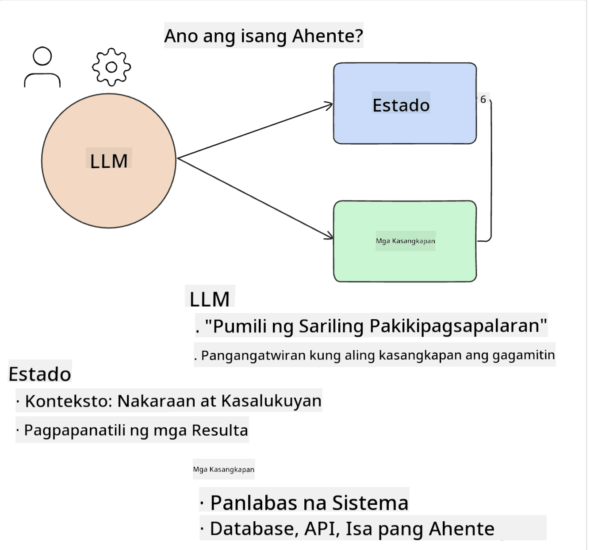

<!--
CO_OP_TRANSLATOR_METADATA:
{
  "original_hash": "8e8d1f6a63da606af7176a87ff8e92b6",
  "translation_date": "2025-10-17T13:21:36+00:00",
  "source_file": "17-ai-agents/README.md",
  "language_code": "tl"
}
-->
[](https://youtu.be/yAXVW-lUINc?si=bOtW9nL6jc3XJgOM)

## Panimula

Ang mga AI Agents ay kumakatawan sa isang kapana-panabik na pag-unlad sa Generative AI, na nagbibigay-daan sa Large Language Models (LLMs) na umunlad mula sa pagiging mga assistant patungo sa pagiging mga ahente na may kakayahang kumilos. Ang mga AI Agent frameworks ay nagbibigay-daan sa mga developer na lumikha ng mga aplikasyon na nagbibigay sa LLMs ng access sa mga tools at pamamahala ng estado. Pinapahusay din ng mga framework na ito ang visibility, na nagbibigay-daan sa mga user at developer na subaybayan ang mga aksyon na pinaplano ng LLMs, kaya't pinapabuti ang pamamahala ng karanasan.

Ang aralin ay tatalakayin ang mga sumusunod na paksa:

- Pag-unawa kung ano ang AI Agent - Ano nga ba ang AI Agent?
- Pagsusuri sa apat na iba't ibang AI Agent Frameworks - Ano ang kanilang mga natatanging katangian?
- Paglalapat ng mga AI Agents sa iba't ibang use cases - Kailan dapat gamitin ang AI Agents?

## Mga Layunin sa Pag-aaral

Pagkatapos ng araling ito, magagawa mo ang sumusunod:

- Ipaliwanag kung ano ang AI Agents at kung paano ito magagamit.
- Magkaroon ng kaalaman sa mga pagkakaiba ng ilan sa mga sikat na AI Agent Frameworks, at kung paano sila nagkakaiba.
- Maunawaan kung paano gumagana ang AI Agents upang makabuo ng mga aplikasyon gamit ang mga ito.

## Ano ang AI Agents?

Ang AI Agents ay isang napaka-kapana-panabik na larangan sa mundo ng Generative AI. Kasama ng excitement na ito ay ang minsang pagkalito sa mga termino at kanilang aplikasyon. Upang gawing simple at inclusive ang karamihan sa mga tools na tumutukoy sa AI Agents, gagamitin natin ang kahulugang ito:

Ang AI Agents ay nagbibigay-daan sa Large Language Models (LLMs) na magsagawa ng mga gawain sa pamamagitan ng pagbibigay sa kanila ng access sa **estado** at **mga tools**.



Tukuyin natin ang mga terminong ito:

**Large Language Models** - Ito ang mga modelong tinutukoy sa buong kurso tulad ng GPT-3.5, GPT-4, Llama-2, at iba pa.

**Estado** - Tumutukoy ito sa konteksto kung saan gumagana ang LLM. Ginagamit ng LLM ang konteksto ng mga nakaraang aksyon at ang kasalukuyang konteksto, na gumagabay sa paggawa ng desisyon para sa mga susunod na aksyon. Ang AI Agent Frameworks ay nagbibigay-daan sa mga developer na mas madaling mapanatili ang kontekstong ito.

**Mga Tools** - Upang makumpleto ang gawain na hiniling ng user at pinlano ng LLM, kailangan ng LLM ng access sa mga tools. Ilang halimbawa ng tools ay maaaring database, API, external application, o kahit isa pang LLM!

Ang mga kahulugang ito ay sana magbigay sa iyo ng magandang pundasyon habang tinitingnan natin kung paano ito ipinatutupad. Tuklasin natin ang ilang iba't ibang AI Agent frameworks:

## LangChain Agents

[LangChain Agents](https://python.langchain.com/docs/how_to/#agents?WT.mc_id=academic-105485-koreyst) ay isang implementasyon ng mga kahulugang ibinigay natin sa itaas.

Upang pamahalaan ang **estado**, gumagamit ito ng built-in na function na tinatawag na `AgentExecutor`. Tinatanggap nito ang tinukoy na `agent` at ang mga `tools` na available dito.

Ang `Agent Executor` ay nag-iimbak din ng chat history upang magbigay ng konteksto ng chat.


Nag-aalok ang LangChain ng [catalog ng tools](https://integrations.langchain.com/tools?WT.mc_id=academic-105485-koreyst) na maaaring i-import sa iyong aplikasyon kung saan makakakuha ng access ang LLM. Ang mga ito ay ginawa ng komunidad at ng LangChain team.

Maaari mong tukuyin ang mga tools na ito at ipasa ang mga ito sa `Agent Executor`.

Ang visibility ay isa pang mahalagang aspeto kapag pinag-uusapan ang AI Agents. Mahalagang maunawaan ng mga application developers kung aling tool ang ginagamit ng LLM at bakit. Para dito, binuo ng team sa LangChain ang LangSmith.

## AutoGen

Ang susunod na AI Agent framework na tatalakayin natin ay [AutoGen](https://microsoft.github.io/autogen/?WT.mc_id=academic-105485-koreyst). Ang pangunahing pokus ng AutoGen ay mga pag-uusap. Ang mga Agents ay parehong **conversable** at **customizable**.

**Conversable -** Ang mga LLM ay maaaring magsimula at magpatuloy ng pag-uusap sa isa pang LLM upang makumpleto ang isang gawain. Ginagawa ito sa pamamagitan ng paglikha ng `AssistantAgents` at pagbibigay sa kanila ng isang partikular na system message.

```python

autogen.AssistantAgent( name="Coder", llm_config=llm_config, ) pm = autogen.AssistantAgent( name="Product_manager", system_message="Creative in software product ideas.", llm_config=llm_config, )

```

**Customizable** - Ang mga Agents ay maaaring tukuyin hindi lamang bilang LLMs kundi bilang isang user o tool. Bilang developer, maaari kang magtukoy ng `UserProxyAgent` na responsable sa pakikipag-ugnayan sa user para sa feedback sa pagkumpleto ng isang gawain. Ang feedback na ito ay maaaring magpatuloy sa pagpapatupad ng gawain o ihinto ito.

```python
user_proxy = UserProxyAgent(name="user_proxy")
```

### Estado at Mga Tools

Upang baguhin at pamahalaan ang estado, ang isang assistant Agent ay bumubuo ng Python code upang makumpleto ang gawain.

Narito ang isang halimbawa ng proseso:


#### LLM na Tinukoy gamit ang System Message

```python
system_message="For weather related tasks, only use the functions you have been provided with. Reply TERMINATE when the task is done."
```

Ang system message na ito ay nagdidirekta sa partikular na LLM kung aling mga function ang nauugnay para sa gawain nito. Tandaan, sa AutoGen maaari kang magkaroon ng maraming tinukoy na AssistantAgents na may iba't ibang system messages.

#### Chat na Sinimulan ng User

```python
user_proxy.initiate_chat( chatbot, message="I am planning a trip to NYC next week, can you help me pick out what to wear? ", )

```

Ang mensaheng ito mula sa user_proxy (Human) ang magsisimula ng proseso ng Agent upang tuklasin ang mga posibleng function na dapat nitong isagawa.

#### Function na Isinasagawa

```bash
chatbot (to user_proxy):

***** Suggested tool Call: get_weather ***** Arguments: {"location":"New York City, NY","time_periond:"7","temperature_unit":"Celsius"} ******************************************************** --------------------------------------------------------------------------------

>>>>>>>> EXECUTING FUNCTION get_weather... user_proxy (to chatbot): ***** Response from calling function "get_weather" ***** 112.22727272727272 EUR ****************************************************************

```

Kapag naproseso na ang paunang chat, ipapadala ng Agent ang iminungkahing tool na tatawagin. Sa kasong ito, ito ay isang function na tinatawag na `get_weather`. Depende sa iyong configuration, ang function na ito ay maaaring awtomatikong isagawa at basahin ng Agent o maaaring isagawa batay sa input ng user.

Maaari kang makahanap ng listahan ng [AutoGen code samples](https://microsoft.github.io/autogen/docs/Examples/?WT.mc_id=academic-105485-koreyst) upang higit pang tuklasin kung paano magsimula sa pagbuo.

## Taskweaver

Ang susunod na agent framework na ating susuriin ay [Taskweaver](https://microsoft.github.io/TaskWeaver/?WT.mc_id=academic-105485-koreyst). Kilala ito bilang isang "code-first" agent dahil sa halip na gumana nang mahigpit sa `strings`, maaari itong gumana sa DataFrames sa Python. Nagiging lubos itong kapaki-pakinabang para sa mga gawain sa pagsusuri ng data at pagbuo. Maaaring kabilang dito ang paggawa ng mga graph at chart o pagbuo ng random na mga numero.

### Estado at Mga Tools

Upang pamahalaan ang estado ng pag-uusap, gumagamit ang TaskWeaver ng konsepto ng isang `Planner`. Ang `Planner` ay isang LLM na tumatanggap ng kahilingan mula sa mga user at nagmamapa ng mga gawain na kailangang makumpleto upang matugunan ang kahilingang ito.

Upang makumpleto ang mga gawain, ang `Planner` ay may access sa koleksyon ng mga tools na tinatawag na `Plugins`. Maaari itong mga Python classes o isang pangkalahatang code interpreter. Ang mga plugin na ito ay naka-imbak bilang embeddings upang mas mahusay na mahanap ng LLM ang tamang plugin.


Narito ang isang halimbawa ng plugin para sa anomaly detection:

```python
class AnomalyDetectionPlugin(Plugin): def __call__(self, df: pd.DataFrame, time_col_name: str, value_col_name: str):
```

Ang code ay nabe-verify bago isagawa. Isa pang tampok upang pamahalaan ang konteksto sa Taskweaver ay ang `experience`. Ang experience ay nagbibigay-daan sa konteksto ng isang pag-uusap na maimbak sa pangmatagalan sa isang YAML file. Maaari itong i-configure upang ang LLM ay patuloy na gumaling sa mga partikular na gawain dahil sa exposure nito sa mga nakaraang pag-uusap.

## JARVIS

Ang huling agent framework na ating susuriin ay [JARVIS](https://github.com/microsoft/JARVIS?tab=readme-ov-file?WT.mc_id=academic-105485-koreyst). Ang natatangi sa JARVIS ay gumagamit ito ng isang LLM upang pamahalaan ang `estado` ng pag-uusap at ang `tools` ay iba pang AI models. Ang bawat isa sa mga AI models ay mga specialized models na gumaganap ng partikular na mga gawain tulad ng object detection, transcription, o image captioning.


Ang LLM, bilang isang general purpose model, ay tumatanggap ng kahilingan mula sa user at tinutukoy ang partikular na gawain at anumang mga argumento/data na kinakailangan upang makumpleto ang gawain.

```python
[{"task": "object-detection", "id": 0, "dep": [-1], "args": {"image": "e1.jpg" }}]
```

Ang LLM ay pagkatapos ay nagfo-format ng kahilingan sa paraang maiintindihan ng specialized AI model, tulad ng JSON. Kapag ang AI model ay nagbalik ng prediksyon batay sa gawain, tinatanggap ng LLM ang tugon.

Kung kinakailangan ang maraming models upang makumpleto ang gawain, i-interpret din nito ang tugon mula sa mga models bago pagsamahin ang mga ito upang makabuo ng tugon sa user.

Ang halimbawa sa ibaba ay nagpapakita kung paano ito gagana kapag ang user ay humihiling ng deskripsyon at bilang ng mga bagay sa isang larawan:

## Gawain

Upang ipagpatuloy ang iyong pag-aaral ng AI Agents maaari kang bumuo gamit ang AutoGen:

- Isang aplikasyon na nagsisimula ng business meeting sa iba't ibang departamento ng isang education startup.
- Gumawa ng mga system messages na gagabay sa LLMs sa pag-unawa sa iba't ibang persona at prayoridad, at bigyang-daan ang user na mag-pitch ng bagong ideya ng produkto.
- Ang LLM ay dapat bumuo ng mga follow-up na tanong mula sa bawat departamento upang pinuhin at pagbutihin ang pitch at ang ideya ng produkto.

## Hindi natatapos dito ang pag-aaral, ipagpatuloy ang Paglalakbay

Pagkatapos makumpleto ang araling ito, tingnan ang aming [Generative AI Learning collection](https://aka.ms/genai-collection?WT.mc_id=academic-105485-koreyst) upang ipagpatuloy ang pag-level up ng iyong kaalaman sa Generative AI!

---

**Paunawa**:  
Ang dokumentong ito ay isinalin gamit ang AI translation service [Co-op Translator](https://github.com/Azure/co-op-translator). Bagamat sinisikap naming maging tumpak, mangyaring tandaan na ang mga awtomatikong pagsasalin ay maaaring maglaman ng mga pagkakamali o hindi pagkakatugma. Ang orihinal na dokumento sa kanyang katutubong wika ang dapat ituring na opisyal na sanggunian. Para sa mahalagang impormasyon, inirerekomenda ang propesyonal na pagsasalin ng tao. Hindi kami mananagot sa anumang hindi pagkakaunawaan o maling interpretasyon na dulot ng paggamit ng pagsasaling ito.