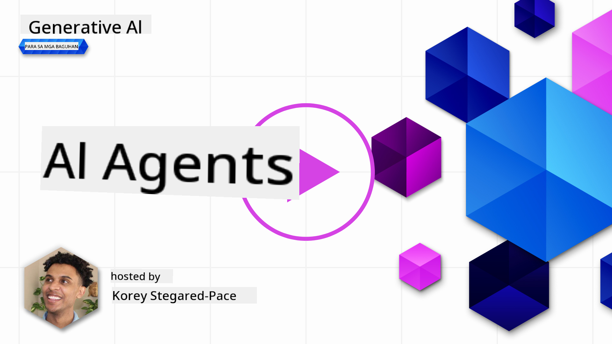
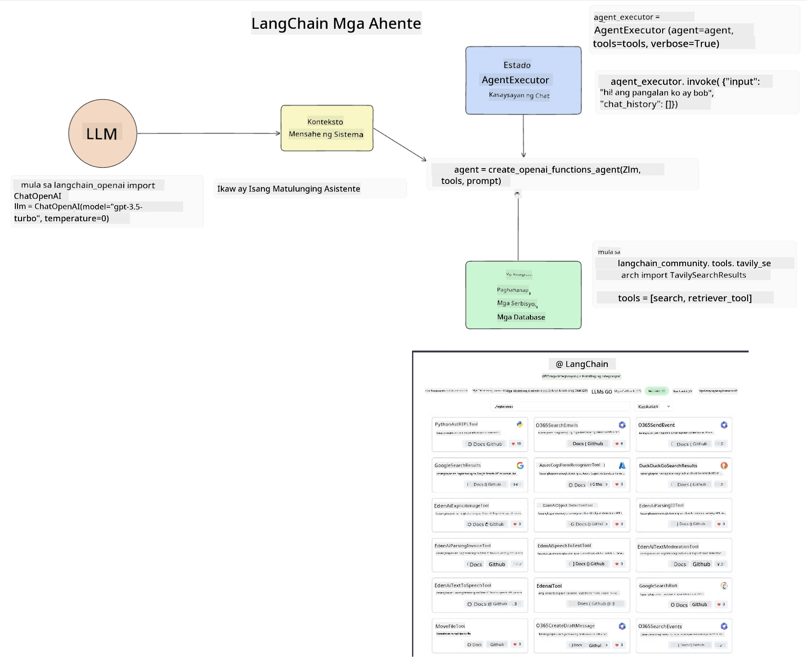
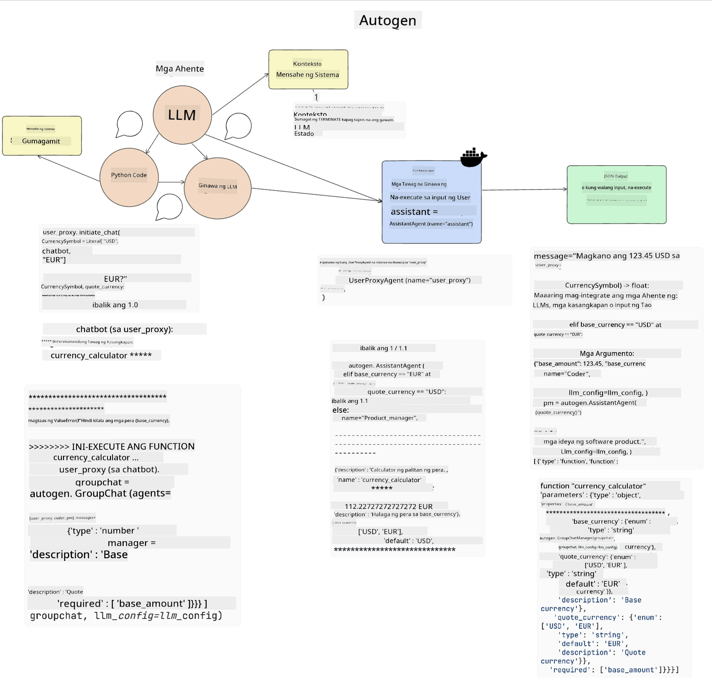
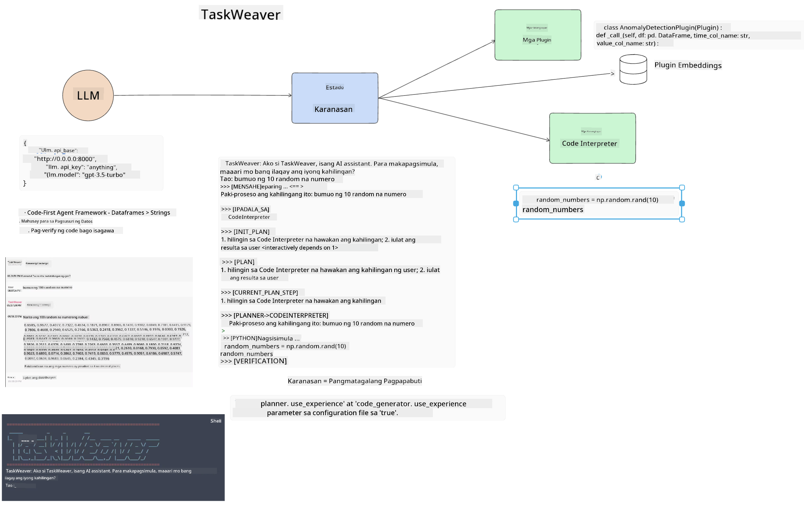
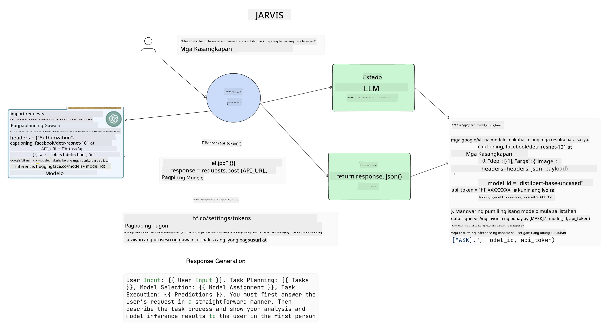

<!--
CO_OP_TRANSLATOR_METADATA:
{
  "original_hash": "11f03c81f190d9cbafd0f977dcbede6c",
  "translation_date": "2025-07-09T17:29:20+00:00",
  "source_file": "17-ai-agents/README.md",
  "language_code": "tl"
}
-->
[](https://aka.ms/gen-ai-lesson17-gh?WT.mc_id=academic-105485-koreyst)

## Panimula

Ang AI Agents ay isang kapanapanabik na pag-unlad sa Generative AI, na nagpapahintulot sa Large Language Models (LLMs) na umunlad mula sa pagiging mga katulong tungo sa mga ahenteng kayang magsagawa ng mga aksyon. Pinapahintulutan ng mga AI Agent framework ang mga developer na gumawa ng mga aplikasyon na nagbibigay sa LLMs ng access sa mga kasangkapan at pamamahala ng estado. Pinapalakas din ng mga framework na ito ang kakayahang makita ang mga aksyon na pinaplano ng LLMs, kaya't napapabuti ang pamamahala ng karanasan.

Saklaw ng aralin ang mga sumusunod na paksa:

- Pag-unawa kung ano ang AI Agent - Ano nga ba ang AI Agent?
- Pagsusuri sa apat na iba't ibang AI Agent Frameworks - Ano ang mga natatangi sa kanila?
- Paggamit ng mga AI Agents sa iba't ibang kaso - Kailan dapat gamitin ang AI Agents?

## Mga Layunin sa Pagkatuto

Pagkatapos ng araling ito, magagawa mong:

- Ipaliwanag kung ano ang AI Agents at kung paano ito magagamit.
- Maunawaan ang mga pagkakaiba ng ilan sa mga kilalang AI Agent Frameworks, at kung paano sila nagkakaiba.
- Maunawaan kung paano gumagana ang AI Agents upang makabuo ng mga aplikasyon gamit ang mga ito.

## Ano ang AI Agents?

Ang AI Agents ay isang napakakapanabik na larangan sa mundo ng Generative AI. Kasabay ng kasiyahan na ito ay ang kalituhan minsan sa mga termino at aplikasyon nito. Upang gawing simple at saklaw ang karamihan sa mga kasangkapang tumutukoy sa AI Agents, gagamit tayo ng ganitong depinisyon:

Pinapahintulutan ng AI Agents ang Large Language Models (LLMs) na magsagawa ng mga gawain sa pamamagitan ng pagbibigay sa kanila ng access sa isang **estado** at **mga kasangkapan**.


Tukuyin natin ang mga terminong ito:

**Large Language Models** - Ito ang mga modelong tinutukoy sa buong kurso tulad ng GPT-3.5, GPT-4, Llama-2, atbp.

**Estado** - Tumutukoy ito sa konteksto kung saan nagtatrabaho ang LLM. Ginagamit ng LLM ang konteksto ng mga nakaraang aksyon at kasalukuyang konteksto upang gabayan ang paggawa ng desisyon para sa mga susunod na aksyon. Pinapadali ng AI Agent Frameworks sa mga developer ang pagpapanatili ng kontekstong ito.

**Mga Kasangkapan** - Upang matapos ang gawain na hiniling ng user at pinlano ng LLM, kailangan ng LLM ng access sa mga kasangkapan. Ilan sa mga halimbawa nito ay database, API, panlabas na aplikasyon, o kahit isa pang LLM!

Inaasahan na ang mga depinisyon na ito ay magbibigay sa iyo ng matibay na pundasyon habang tinitingnan natin kung paano ito ipinatutupad. Tuklasin natin ang ilang iba't ibang AI Agent frameworks:

## LangChain Agents

Ang [LangChain Agents](https://python.langchain.com/docs/how_to/#agents?WT.mc_id=academic-105485-koreyst) ay isang implementasyon ng mga depinisyon na ibinigay natin sa itaas.

Para pamahalaan ang **estado**, gumagamit ito ng built-in na function na tinatawag na `AgentExecutor`. Tumatanggap ito ng tinukoy na `agent` at ang mga `tools` na available dito.

Iniimbak din ng `Agent Executor` ang kasaysayan ng chat upang maibigay ang konteksto ng pag-uusap.



Nag-aalok ang LangChain ng [katalogo ng mga kasangkapan](https://integrations.langchain.com/tools?WT.mc_id=academic-105485-koreyst) na maaaring i-import sa iyong aplikasyon kung saan maaaring magkaroon ng access ang LLM. Ginawa ito ng komunidad at ng koponan ng LangChain.

Maaari mong tukuyin ang mga kasangkapang ito at ipasa sa `Agent Executor`.

Mahalaga rin ang visibility kapag pinag-uusapan ang AI Agents. Mahalaga para sa mga developer ng aplikasyon na malaman kung aling kasangkapan ang ginagamit ng LLM at bakit. Para dito, binuo ng koponan ng LangChain ang LangSmith.

## AutoGen

Ang susunod na AI Agent framework na tatalakayin natin ay ang [AutoGen](https://microsoft.github.io/autogen/?WT.mc_id=academic-105485-koreyst). Ang pangunahing pokus ng AutoGen ay mga pag-uusap. Ang mga ahente ay parehong **nakikipag-usap** at **napapasadya**.

**Nakikipag-usap -** Kayang simulan at ipagpatuloy ng LLMs ang pag-uusap sa isa pang LLM upang matapos ang isang gawain. Ginagawa ito sa pamamagitan ng paglikha ng `AssistantAgents` at pagbibigay sa kanila ng partikular na system message.

```python

autogen.AssistantAgent( name="Coder", llm_config=llm_config, ) pm = autogen.AssistantAgent( name="Product_manager", system_message="Creative in software product ideas.", llm_config=llm_config, )

```

**Napapasadya** - Maaaring tukuyin ang mga ahente hindi lamang bilang LLMs kundi bilang user o kasangkapan. Bilang developer, maaari kang magtukoy ng `UserProxyAgent` na responsable sa pakikipag-ugnayan sa user para sa feedback sa pagtapos ng gawain. Ang feedback na ito ay maaaring magpatuloy o huminto sa pagsasagawa ng gawain.

```python
user_proxy = UserProxyAgent(name="user_proxy")
```

### Estado at Mga Kasangkapan

Para baguhin at pamahalaan ang estado, ang assistant Agent ay bumubuo ng Python code upang matapos ang gawain.

Narito ang isang halimbawa ng proseso:



#### LLM na Tinukoy gamit ang System Message

```python
system_message="For weather related tasks, only use the functions you have been provided with. Reply TERMINATE when the task is done."
```

Itinatalaga ng system message na ito ang partikular na LLM kung aling mga function ang mahalaga para sa gawain nito. Tandaan, sa AutoGen maaari kang magkaroon ng maraming AssistantAgents na may iba't ibang system messages.

#### Sinimulan ng User ang Chat

```python
user_proxy.initiate_chat( chatbot, message="I am planning a trip to NYC next week, can you help me pick out what to wear? ", )

```

Ang mensaheng ito mula sa user_proxy (Tao) ang magsisimula ng proseso ng Agent upang tuklasin ang mga posibleng function na dapat nitong isagawa.

#### Isinasagawa ang Function

```bash
chatbot (to user_proxy):

***** Suggested tool Call: get_weather ***** Arguments: {"location":"New York City, NY","time_periond:"7","temperature_unit":"Celsius"} ******************************************************** --------------------------------------------------------------------------------

>>>>>>>> EXECUTING FUNCTION get_weather... user_proxy (to chatbot): ***** Response from calling function "get_weather" ***** 112.22727272727272 EUR ****************************************************************

```

Kapag naiproseso na ang unang chat, ipapadala ng Agent ang mungkahing kasangkapan na tatawagin. Sa kasong ito, isang function na tinatawag na `get_weather`. Depende sa iyong configuration, maaaring awtomatikong isagawa at basahin ng Agent ang function na ito o isagawa ito base sa input ng user.

Maaari kang makakita ng listahan ng [AutoGen code samples](https://microsoft.github.io/autogen/docs/Examples/?WT.mc_id=academic-105485-koreyst) upang mas lalo pang tuklasin kung paano magsimula sa pagbuo.

## Taskweaver

Ang susunod na agent framework na susuriin natin ay ang [Taskweaver](https://microsoft.github.io/TaskWeaver/?WT.mc_id=academic-105485-koreyst). Kilala ito bilang "code-first" agent dahil sa halip na gumamit lamang ng `strings`, kaya nitong gumana gamit ang DataFrames sa Python. Napaka-kapaki-pakinabang nito para sa mga gawain sa pagsusuri ng datos at pagbuo. Maaaring ito ay paggawa ng mga graph at chart o pagbuo ng mga random na numero.

### Estado at Mga Kasangkapan

Para pamahalaan ang estado ng pag-uusap, ginagamit ng TaskWeaver ang konsepto ng `Planner`. Ang `Planner` ay isang LLM na tumatanggap ng kahilingan mula sa mga user at nagmamapa ng mga gawain na kailangang tapusin upang matugunan ang kahilingang ito.

Upang matapos ang mga gawain, ang `Planner` ay may access sa koleksyon ng mga kasangkapan na tinatawag na `Plugins`. Maaaring ito ay mga Python classes o isang pangkalahatang code interpreter. Ang mga plugin na ito ay iniimbak bilang embeddings upang mas madali itong mahanap ng LLM.



Narito ang isang halimbawa ng plugin para sa anomaly detection:

```python
class AnomalyDetectionPlugin(Plugin): def __call__(self, df: pd.DataFrame, time_col_name: str, value_col_name: str):
```

Sinusuri muna ang code bago ito isagawa. Isa pang tampok para pamahalaan ang konteksto sa Taskweaver ay ang `experience`. Pinapayagan ng experience na maimbak ang konteksto ng pag-uusap sa mahabang panahon sa isang YAML file. Maaaring i-configure ito upang mapabuti ng LLM ang sarili nito sa paglipas ng panahon sa ilang mga gawain dahil sa exposure sa mga nakaraang pag-uusap.

## JARVIS

Ang huling agent framework na tatalakayin natin ay ang [JARVIS](https://github.com/microsoft/JARVIS?tab=readme-ov-file?WT.mc_id=academic-105485-koreyst). Ang kakaiba sa JARVIS ay ginagamit nito ang isang LLM upang pamahalaan ang `estado` ng pag-uusap at ang mga `tools` ay iba pang mga AI models. Bawat AI model ay espesyal na modelo na gumagawa ng partikular na mga gawain tulad ng object detection, transcription, o image captioning.



Ang LLM, bilang isang general purpose model, ay tumatanggap ng kahilingan mula sa user at tinutukoy ang partikular na gawain at anumang mga argumento/data na kailangan upang matapos ang gawain.

```python
[{"task": "object-detection", "id": 0, "dep": [-1], "args": {"image": "e1.jpg" }}]
```

Inaayos ng LLM ang kahilingan sa paraang maiintindihan ng espesyal na AI model, tulad ng JSON. Kapag naibalik na ng AI model ang prediksyon nito base sa gawain, tinatanggap ito ng LLM.

Kung kailangan ang maraming modelo upang matapos ang gawain, i-iinterpret din nito ang mga tugon mula sa mga modelong iyon bago pagsamahin ang mga ito upang makabuo ng sagot para sa user.

Ipinapakita ng halimbawa sa ibaba kung paano ito gagana kapag humihiling ang user ng paglalarawan at bilang ng mga bagay sa isang larawan:

## Takdang-Aralin

Upang ipagpatuloy ang iyong pag-aaral tungkol sa AI Agents, maaari kang gumawa gamit ang AutoGen ng:

- Isang aplikasyon na nagsisimula ng isang business meeting kasama ang iba't ibang departamento ng isang education startup.
- Gumawa ng mga system message na gagabay sa LLMs sa pag-unawa sa iba't ibang persona at prayoridad, at pahintulutan ang user na mag-pitch ng bagong ideya ng produkto.
- Dapat gumawa ang LLM ng mga follow-up na tanong mula sa bawat departamento upang mapino at mapabuti ang pitch at ang ideya ng produkto.

## Hindi Dito Nagtatapos ang Pagkatuto, Ipagpatuloy ang Paglalakbay

Pagkatapos makumpleto ang araling ito, tingnan ang aming [Generative AI Learning collection](https://aka.ms/genai-collection?WT.mc_id=academic-105485-koreyst) upang ipagpatuloy ang pag-level up ng iyong kaalaman sa Generative AI!

**Paalala**:  
Ang dokumentong ito ay isinalin gamit ang AI translation service na [Co-op Translator](https://github.com/Azure/co-op-translator). Bagamat nagsusumikap kami para sa katumpakan, pakatandaan na ang mga awtomatikong pagsasalin ay maaaring maglaman ng mga pagkakamali o di-tumpak na impormasyon. Ang orihinal na dokumento sa kanyang sariling wika ang dapat ituring na pangunahing sanggunian. Para sa mahahalagang impormasyon, inirerekomenda ang propesyonal na pagsasalin ng tao. Hindi kami mananagot sa anumang hindi pagkakaunawaan o maling interpretasyon na maaaring magmula sa paggamit ng pagsasaling ito.