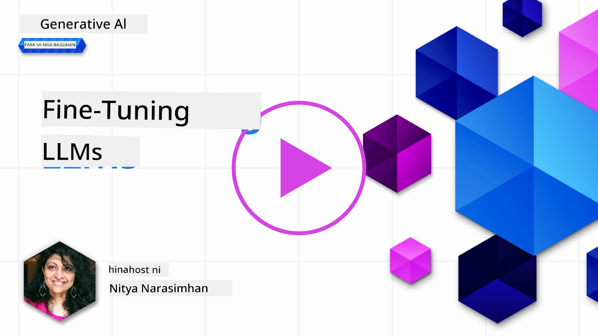
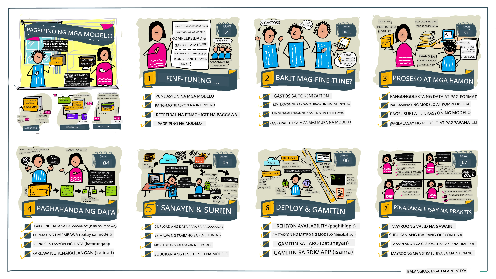

# Fine-Tuning Your LLM

Ang paggamit ng malalaking language models para bumuo ng mga generative AI applications ay may kasamang mga bagong hamon. Isang mahalagang isyu ay ang pagtitiyak ng kalidad ng tugon (katumpakan at kaugnayan) sa nilikhang nilalaman ng modelo para sa isang partikular na kahilingan ng gumagamit. Sa mga naunang aralin, tinalakay natin ang mga teknik tulad ng prompt engineering at retrieval-augmented generation na sumusubok lutasin ang problema sa pamamagitan ng _pagbabago ng input na prompt_ sa umiiral na modelo.

Sa aralin ngayon, tatalakayin natin ang pangatlong teknik, ang **fine-tuning**, na sumusubok tugunan ang hamon sa pamamagitan ng _muling pagsasanay sa modelo mismo_ gamit ang dagdag na datos. Tara, silipin natin ang mga detalye.

## Learning Objectives

Ipinapakilala ng araling ito ang konsepto ng fine-tuning para sa mga pre-trained language models, sinusuri ang mga benepisyo at hamon ng pamamaraang ito, at nagbibigay ng gabay kung kailan at paano gamitin ang fine tuning upang mapabuti ang performance ng iyong mga generative AI models.

Sa pagtatapos ng araling ito, dapat ay maipaliwanag mo ang mga sumusunod na tanong:

- Ano ang fine tuning para sa mga language models?
- Kailan, at bakit, kapaki-pakinabang ang fine tuning?
- Paano ako makakapag-fine-tune ng isang pre-trained model?
- Ano ang mga limitasyon ng fine-tuning?

Handa ka na ba? Magsimula tayo.

## Illustrated Guide

Gusto mo bang makita ang kabuuang larawan ng mga tatalakayin bago tayo lumalim? Tingnan ang ilustradong gabay na ito na naglalarawan ng paglalakbay sa pagkatuto para sa araling ito - mula sa pag-aaral ng mga pangunahing konsepto at motibasyon para sa fine-tuning, hanggang sa pag-unawa sa proseso at mga pinakamahusay na gawi para maisagawa ang fine-tuning na gawain. Isang kapana-panabik na paksa ito para tuklasin, kaya huwag kalimutang bisitahin ang [Resources](./RESOURCES.md?WT.mc_id=academic-105485-koreyst) na pahina para sa karagdagang mga link na susuporta sa iyong sariling paglalakbay sa pag-aaral!

## Ano ang fine-tuning para sa mga language models?

Ayon sa depinisyon, ang malalaking language models ay _pre-trained_ sa malaking dami ng teksto na nagmula sa iba't ibang pinagmulan kabilang ang internet. Tulad ng natutunan natin sa mga naunang aralin, kailangan nating mga teknik tulad ng _prompt engineering_ at _retrieval-augmented generation_ upang mapabuti ang kalidad ng mga tugon ng modelo sa mga tanong ng gumagamit ("prompts").

Isang kilalang teknik ng prompt-engineering ay ang pagbibigay ng mas malinaw na gabay sa modelo kung ano ang inaasahan sa tugon sa pamamagitan ng pagbibigay ng _mga instruksiyon_ (hayagang gabay) o _pagbibigay ng ilang mga halimbawa_ (di-hayagang gabay). Ito ay tinatawag na _few-shot learning_ ngunit may dalawang limitasyon:

- Ang mga token limits ng modelo ay maaaring pumigil sa dami ng mga halimbawa na maaari mong ibigay, at limitahan ang bisa nito.
- Ang mga token costs ng modelo ay maaaring gawing mahal ang pagdagdag ng mga halimbawa sa bawat prompt, at pataasin ang gastos.

Ang fine-tuning ay isang karaniwang praktis sa mga sistema ng machine learning kung saan kinukuha ang pre-trained na modelo at muling sinasanay gamit ang bagong datos upang mapabuti ang performance nito sa isang partikular na gawain. Sa konteksto ng mga language models, maaari nating fine-tune ang pre-trained na modelo _gamit ang isang maingat na pagpiling mga halimbawa para sa isang tiyak na gawain o domain ng aplikasyon_ upang makalikha ng **custom model** na maaaring mas tumpak at kaugnay para sa partikular na gawain o domain. Isang karagdagang benepisyo ng fine-tuning ay maaari rin nitong paliitin ang bilang ng mga halimbawang kailangan para sa few-shot learning - kaya nababawasan ang paggamit ng token at mga kaugnay na gastos.

## Kailan at bakit tayo dapat mag-fine-tune ng mga modelo?

Sa _itong_ konteksto, kapag pinag-uusapan natin ang fine-tuning, tumutukoy tayo sa **supervised** fine-tuning kung saan ang muling pagsasanay ay ginagawa sa pamamagitan ng **pagdaragdag ng bagong datos** na hindi kabilang sa orihinal na training dataset. Naiiba ito sa unsupervised fine-tuning kung saan ang modelo ay muling sinasanay gamit ang orihinal na data, ngunit may ibang hyperparameters.

Ang mahalagang tandaan ay ang fine-tuning ay isang advanced na teknik na nangangailangan ng tiyak na antas ng kasanayan upang makamit ang ninanais na resulta. Kung magkamali, maaaring hindi nito maibigay ang inaasahang pagbuti, at maaari pang makapagbaba ng performance ng modelo para sa iyong target na domain.

Kaya, bago mo matutunan kung "paano" mag-fine-tune ng mga language models, kailangan mong malaman kung "bakit" mo ito dapat gawin, at "kailan" sisimulan ang proseso ng fine-tuning. Magsimula sa pagtatanong sa iyong sarili ng mga sumusunod:

- **Use Case**: Ano ang iyong _use case_ para sa fine-tuning? Anong aspeto ng kasalukuyang pre-trained model ang nais mong pagbutihin?
- **Alternatibo**: Nasubukan mo na ba ang _ibang teknik_ upang makamit ang ninanais na resulta? Gamitin ang mga ito upang makagawa ng baseline para sa paghahambing.
  - Prompt engineering: Subukan ang mga teknik tulad ng few-shot prompting gamit ang mga halimbawa ng mga kaugnay na tugon sa prompt. Suriin ang kalidad ng mga tugon.
  - Retrieval Augmented Generation: Subukan ang pagdagdag ng mga query result sa mga prompt na nakuha mula sa paghahanap sa iyong datos. Suriin ang kalidad ng tugon.
- **Gastos**: Natukoy mo na ba ang mga gastos para sa fine-tuning?
  - Tunability - available ba ang pre-trained na modelo para sa fine-tuning?
  - Pagsisikap - para sa paghahanda ng training data, pagsusuri at pagpapahusay ng modelo.
  - Compute - para sa pagpapatakbo ng mga fine-tuning jobs, at pag-deploy ng fine-tuned model
  - Data - access sa sapat at kalidad na mga halimbawa para sa epekto ng fine-tuning
- **Benepisyo**: Nakumpirma mo na ba ang mga benepisyo ng fine-tuning?
  - Kalidad - nalampasan ba ng fine-tuned model ang baseline?
  - Gastos - nabawasan ba nito ang paggamit ng token sa pamamagitan ng pagpapasimple ng mga prompt?
  - Extensibility - maaari mo bang gamitin muli ang base model para sa mga bagong domain?

Sa pagsagot sa mga tanong na ito, dapat ay makapagpasya ka kung ang fine-tuning ay ang tamang pamamaraan para sa iyong use case. Ideyal kung balanse ang approach kung mas malaki ang benepisyo kaysa gastos. Kapag nagpasya kang magpatuloy, panahon na para isipin kung _paano_ mo ma-fine-tune ang pre-trained na modelo.

Gusto mo pa ba ng higit pang kaalaman sa proseso ng paggawa ng desisyon? Panoorin ang [To fine-tune or not to fine-tune](https://www.youtube.com/watch?v=0Jo-z-MFxJs)

## Paano tayo makakapag-fine-tune ng pre-trained na modelo?

Para mag-fine-tune ng pre-trained na modelo, kailangan mo ng:

- isang pre-trained na modelo na pwedeng i-fine-tune
- isang dataset na gagamitin para sa fine-tuning
- isang training environment para patakbuhin ang fine-tuning job
- isang hosting environment para i-deploy ang fine-tuned na modelo

## Fine-Tuning Sa Aksyon

Ang mga sumusunod na resources ay nagbibigay ng step-by-step tutorials para gabayan ka sa isang totoong halimbawa gamit ang isang piling modelo at isang curated dataset. Para magamit ang mga tutorial na ito, kailangan mong magkaroon ng account sa partikular na provider, pati na rin access sa kaukulang modelo at datasets.

| Provider     | Tutorial                                                                                                                                                                       | Description                                                                                                                                                                                                                                                                                                                                                                                                                        |
| ------------ | ------------------------------------------------------------------------------------------------------------------------------------------------------------------------------ | ---------------------------------------------------------------------------------------------------------------------------------------------------------------------------------------------------------------------------------------------------------------------------------------------------------------------------------------------------------------------------------------------------------------------------------- |
| OpenAI       | [How to fine-tune chat models](https://github.com/openai/openai-cookbook/blob/main/examples/How_to_finetune_chat_models.ipynb?WT.mc_id=academic-105485-koreyst)                | Matutunan kung paano i-fine-tune ang `gpt-35-turbo` para sa isang partikular na domain ("recipe assistant") sa pamamagitan ng paghahanda ng training data, pagpapatakbo ng fine-tuning job, at paggamit ng fine-tuned model para sa inference.                                                                                                                                                                                      |
| Azure OpenAI | [GPT 3.5 Turbo fine-tuning tutorial](https://learn.microsoft.com/azure/ai-services/openai/tutorials/fine-tune?tabs=python-new%2Ccommand-line&WT.mc_id=academic-105485-koreyst) | Matutunan kung paano i-fine-tune ang modelong `gpt-35-turbo-0613` **sa Azure** sa pamamagitan ng paggawa at pag-upload ng training data, pagpapatakbo ng fine-tuning job. I-deploy at gamitin ang bagong modelo.                                                                                                                                                                                                                          |
| Hugging Face | [Fine-tuning LLMs with Hugging Face](https://www.philschmid.de/fine-tune-llms-in-2024-with-trl?WT.mc_id=academic-105485-koreyst)                                               | Ang blog post na ito ay naglalakad sa fine-tuning ng isang _open LLM_ (hal: `CodeLlama 7B`) gamit ang [transformers](https://huggingface.co/docs/transformers/index?WT.mc_id=academic-105485-koreyst) library at [Transformer Reinforcement Learning (TRL)](https://huggingface.co/docs/trl/index?WT.mc_id=academic-105485-koreyst) gamit ang bukas na [datasets](https://huggingface.co/docs/datasets/index?WT.mc_id=academic-105485-koreyst) mula sa Hugging Face. |
|              |                                                                                                                                                                                |                                                                                                                                                                                                                                                                                                                                                                                                                                    |
| 🤗 AutoTrain | [Fine-tuning LLMs with AutoTrain](https://github.com/huggingface/autotrain-advanced/?WT.mc_id=academic-105485-koreyst)                                                         | Ang AutoTrain (o AutoTrain Advanced) ay isang python library na binuo ng Hugging Face na nagpapahintulot ng fine-tuning para sa iba't ibang gawain kabilang ang LLM fine-tuning. Ang AutoTrain ay isang no-code na solusyon at ang fine-tuning ay maaaring gawin sa iyong sariling cloud, Hugging Face Spaces, o lokal. Sinusuportahan nito ang web-based GUI, CLI, at training gamit ang yaml config files.                                                        |
|              |                                                                                                                                                                                |                                                                                                                                                                                                                                                                                                                                                                                                                                    |
| 🦥 Unsloth | [Fine-tuning LLMs with Unsloth](https://github.com/unslothai/unsloth)                                                         | Ang Unsloth ay isang open-source framework na sumusuporta sa LLM fine-tuning at reinforcement learning (RL). Pinapadali ng Unsloth ang lokal na pagsasanay, pagsusuri, at deployment gamit ang mga handang-gamitin na [notebooks](https://github.com/unslothai/notebooks). Sinusuportahan din nito ang text-to-speech (TTS), BERT, at multimodal na mga modelo. Para makapagsimula, basahin ang kanilang step-by-step [Fine-tuning LLMs Guide](https://docs.unsloth.ai/get-started/fine-tuning-llms-guide).    |
|              |                                                                                                                                                                                |                                                                                                                                                                                                                                                                                                                                                                                                                                    |
## Assignment

Pumili ng isa sa mga tutorial sa itaas at sundan ito. _Maaring gayahin namin ang bersyon ng mga tutorial na ito sa Jupyter Notebooks sa repo na ito bilang reperensya lamang. Mangyaring gamitin ang orihinal na mga pinagkukunan nang direkta upang makuha ang pinakabagong mga bersyon_.

## Mahusay na Trabaho! Ituloy ang Iyong Pagkatuto.

Pagkatapos makumpleto ang araling ito, bisitahin ang aming [Generative AI Learning collection](https://aka.ms/genai-collection?WT.mc_id=academic-105485-koreyst) upang ipagpatuloy ang pag-level up ng iyong kaalaman sa Generative AI!

Binabati kita!! Nakumpleto mo ang huling aralin mula sa v2 series para sa kursong ito! Huwag huminto sa pag-aaral at pagbuo. \*\*Tingnan ang [RESOURCES](RESOURCES.md?WT.mc_id=academic-105485-koreyst) na pahina para sa listahan ng karagdagang mungkahi para sa paksang ito lamang.

Ang aming v1 series ng mga aralin ay na-update din na may mga dagdag na assignment at mga konsepto. Kaya maglaan ng sandali upang sariwain ang iyong kaalaman - at mangyaring [ibahagi ang iyong mga tanong at puna](https://github.com/microsoft/generative-ai-for-beginners/issues?WT.mc_id=academic-105485-koreyst) upang matulungan kaming pagbutihin ang mga araling ito para sa komunidad.

---

<!-- CO-OP TRANSLATOR DISCLAIMER START -->
**Pahayag ng Paunawa**:  
Ang dokumentong ito ay isinalin gamit ang AI translation service na [Co-op Translator](https://github.com/Azure/co-op-translator). Bagama't nagsusumikap kami para sa katumpakan, pakatandaan na ang mga awtomatikong pagsasalin ay maaaring maglaman ng mga pagkakamali o di-tumpak na impormasyon. Ang orihinal na dokumento sa kanyang sariling wika ang dapat ituring na pangunahing sanggunian. Para sa mga mahahalagang impormasyon, inirerekomenda ang propesyonal na pagsasalin ng tao. Hindi kami mananagot sa anumang maling pagkaunawa o maling interpretasyon na magmumula sa paggamit ng pagsasaling ito.
<!-- CO-OP TRANSLATOR DISCLAIMER END -->