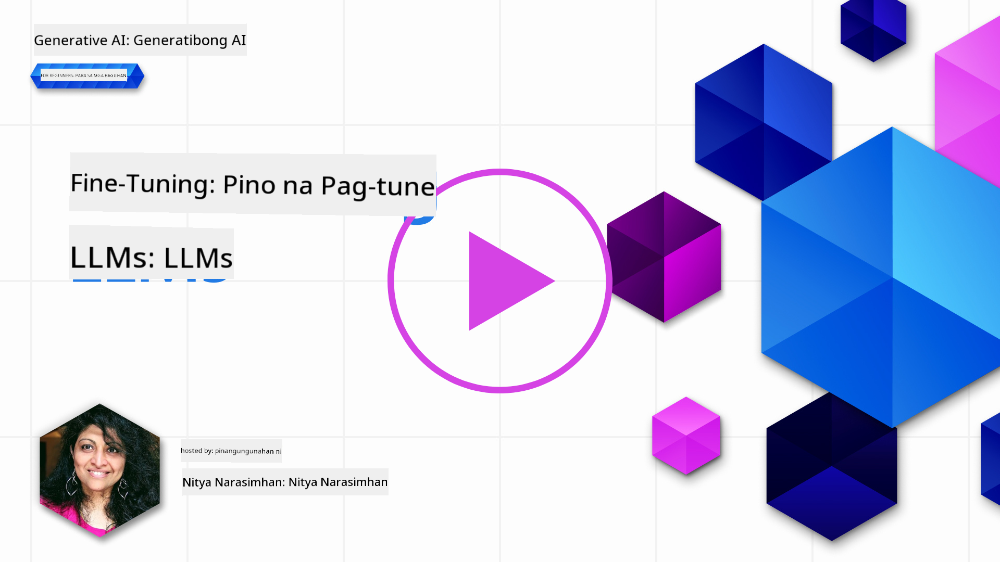
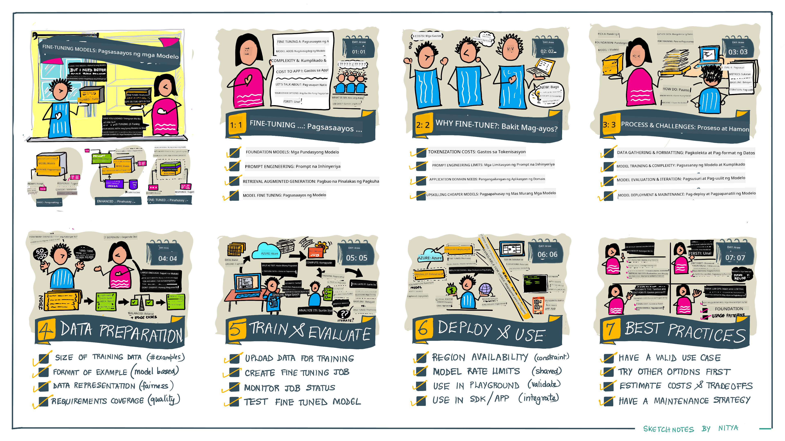

<!--
CO_OP_TRANSLATOR_METADATA:
{
  "original_hash": "68664f7e754a892ae1d8d5e2b7bd2081",
  "translation_date": "2025-06-26T00:48:34+00:00",
  "source_file": "18-fine-tuning/README.md",
  "language_code": "tl"
}
-->

# Fine-Tuning Your LLM

Ang paggamit ng malalaking modelo ng wika upang bumuo ng mga generative na aplikasyon ng AI ay may mga bagong hamon. Isang mahalagang isyu ay ang pagtiyak ng kalidad ng tugon (katumpakan at kaugnayan) sa nilalaman na binuo ng modelo para sa isang partikular na kahilingan ng gumagamit. Sa mga nakaraang aralin, tinalakay natin ang mga teknik tulad ng prompt engineering at retrieval-augmented generation na sinusubukang lutasin ang problema sa pamamagitan ng _pagbabago ng input ng prompt_ sa umiiral na modelo.

Sa aralin ngayon, tatalakayin natin ang ikatlong teknik, **fine-tuning**, na sinusubukang lutasin ang hamon sa pamamagitan ng _muling pagsasanay sa modelo mismo_ gamit ang karagdagang data. Tingnan natin ang mga detalye.

## Mga Layunin sa Pag-aaral

Ang araling ito ay nagpapakilala sa konsepto ng fine-tuning para sa mga pre-trained na modelo ng wika, sinisiyasat ang mga benepisyo at hamon ng pamamaraang ito, at nagbibigay ng gabay kung kailan at paano gamitin ang fine-tuning upang mapabuti ang pagganap ng iyong mga generative na modelo ng AI.

Sa pagtatapos ng araling ito, dapat mong masagot ang mga sumusunod na tanong:

- Ano ang fine tuning para sa mga modelo ng wika?
- Kailan, at bakit, kapaki-pakinabang ang fine tuning?
- Paano ko ma-fine-tune ang isang pre-trained na modelo?
- Ano ang mga limitasyon ng fine-tuning?

Handa na? Simulan na natin.

## Illustrated Guide

Gusto mo bang makita ang kabuuang larawan ng mga sakop natin bago tayo sumisid? Tingnan ang illustrated guide na naglalarawan ng paglalakbay sa pag-aaral para sa araling ito - mula sa pag-aaral ng mga pangunahing konsepto at motibasyon para sa fine-tuning, hanggang sa pag-unawa sa proseso at mga pinakamahusay na kasanayan para sa pagsasagawa ng fine-tuning na gawain. Ito ay isang kawili-wiling paksa para sa paggalugad, kaya huwag kalimutang tingnan ang [Resources](./RESOURCES.md?WT.mc_id=academic-105485-koreyst) na pahina para sa karagdagang mga link upang suportahan ang iyong sariling paglalakbay sa pag-aaral!

## Ano ang fine-tuning para sa mga modelo ng wika?

Sa kahulugan, ang malalaking modelo ng wika ay _pre-trained_ sa malalaking dami ng teksto na nakuha mula sa iba't ibang pinagmulan kabilang ang internet. Tulad ng natutunan natin sa mga nakaraang aralin, kailangan natin ng mga teknik tulad ng _prompt engineering_ at _retrieval-augmented generation_ upang mapabuti ang kalidad ng mga tugon ng modelo sa mga tanong ng gumagamit ("prompts").

Isang popular na teknik sa prompt-engineering ay ang pagbibigay sa modelo ng higit pang gabay sa kung ano ang inaasahan sa tugon alinman sa pamamagitan ng pagbibigay ng _mga tagubilin_ (maliwanag na gabay) o _pagbibigay ng ilang mga halimbawa_ (hindi maliwanag na gabay). Ito ay tinutukoy bilang _few-shot learning_ ngunit ito ay may dalawang limitasyon:

- Ang mga limitasyon ng token ng modelo ay maaaring magpigil sa dami ng mga halimbawa na maibibigay mo, at limitahan ang pagiging epektibo.
- Ang mga gastos sa token ng modelo ay maaaring gawing mahal ang pagdaragdag ng mga halimbawa sa bawat prompt, at limitahan ang kakayahang umangkop.

Ang fine-tuning ay isang karaniwang kasanayan sa mga sistema ng machine learning kung saan kinukuha natin ang isang pre-trained na modelo at muling sinasanay ito gamit ang bagong data upang mapabuti ang pagganap nito sa isang partikular na gawain. Sa konteksto ng mga modelo ng wika, maaari nating i-fine-tune ang pre-trained na modelo _gamit ang isang piniling hanay ng mga halimbawa para sa isang partikular na gawain o domain ng aplikasyon_ upang lumikha ng isang **custom na modelo** na maaaring mas tumpak at nauugnay para sa partikular na gawain o domain. Isang karagdagang benepisyo ng fine-tuning ay maaari rin nitong bawasan ang bilang ng mga halimbawa na kailangan para sa few-shot learning - binabawasan ang paggamit ng token at mga kaugnay na gastos.

## Kailan at bakit dapat nating i-fine-tune ang mga modelo?

Sa _kontekstong ito_, kapag pinag-uusapan natin ang fine-tuning, tumutukoy tayo sa **supervised** fine-tuning kung saan ang muling pagsasanay ay ginagawa sa pamamagitan ng **pagdaragdag ng bagong data** na hindi bahagi ng orihinal na dataset ng pagsasanay. Ito ay naiiba sa isang unsupervised na fine-tuning na pamamaraan kung saan ang modelo ay muling sinasanay sa orihinal na data, ngunit may iba't ibang hyperparameters.

Ang pangunahing bagay na dapat tandaan ay ang fine-tuning ay isang advanced na teknik na nangangailangan ng tiyak na antas ng kadalubhasaan upang makuha ang inaasahang resulta. Kung hindi ito ginawa ng tama, maaaring hindi ito magbigay ng inaasahang pagpapabuti, at maaari pang magpababa ng pagganap ng modelo para sa iyong target na domain.

Kaya, bago mo matutunan ang "paano" i-fine-tune ang mga modelo ng wika, kailangan mong malaman ang "bakit" dapat mong tahakin ang rutang ito, at "kailan" magsisimula ng proseso ng fine-tuning. Simulan sa pamamagitan ng pagtatanong sa iyong sarili ng mga tanong na ito:

- **Use Case**: Ano ang iyong _use case_ para sa fine-tuning? Anong aspeto ng kasalukuyang pre-trained na modelo ang nais mong mapabuti?
- **Alternatives**: Nasubukan mo na ba ang _ibang teknik_ upang makamit ang nais na resulta? Gamitin ang mga ito upang lumikha ng baseline para sa paghahambing.
  - Prompt engineering: Subukan ang mga teknik tulad ng few-shot prompting na may mga halimbawa ng mga nauugnay na tugon sa prompt. Suriin ang kalidad ng mga tugon.
  - Retrieval Augmented Generation: Subukan ang pagdaragdag ng mga prompt gamit ang mga resulta ng query na nakuha sa pamamagitan ng paghahanap sa iyong data. Suriin ang kalidad ng mga tugon.
- **Costs**: Natukoy mo na ba ang mga gastos para sa fine-tuning?
  - Tunability - available ba ang pre-trained na modelo para sa fine-tuning?
  - Effort - para sa paghahanda ng data ng pagsasanay, pagsusuri at pagpipino ng modelo.
  - Compute - para sa pagpapatakbo ng mga trabaho sa fine-tuning, at pag-deploy ng fine-tuned na modelo
  - Data - access sa sapat na kalidad ng mga halimbawa para sa epekto ng fine-tuning
- **Benefits**: Nakumpirma mo na ba ang mga benepisyo para sa fine-tuning?
  - Quality - mas mahusay ba ang fine-tuned na modelo kumpara sa baseline?
  - Cost - nababawasan ba nito ang paggamit ng token sa pamamagitan ng pagpapasimple ng mga prompt?
  - Extensibility - maaari mo bang gamitin muli ang base model para sa mga bagong domain?

Sa pagsagot sa mga tanong na ito, dapat mong maipasiya kung ang fine-tuning ay ang tamang pamamaraan para sa iyong use case. Sa ideal na sitwasyon, valid lamang ang pamamaraan kung ang mga benepisyo ay mas malaki kaysa sa mga gastos. Kapag napagpasyahan mong magpatuloy, oras na para pag-isipan kung _paano_ mo ma-fine-tune ang pre-trained na modelo.

Gusto mo bang makakuha ng higit pang mga pananaw sa proseso ng paggawa ng desisyon? Panoorin [To fine-tune or not to fine-tune](https://www.youtube.com/watch?v=0Jo-z-MFxJs)

## Paano natin ma-fine-tune ang isang pre-trained na modelo?

Para ma-fine-tune ang isang pre-trained na modelo, kailangan mo ng:

- isang pre-trained na modelo para i-fine-tune
- isang dataset na gagamitin para sa fine-tuning
- isang training environment para patakbuhin ang fine-tuning job
- isang hosting environment para i-deploy ang fine-tuned na modelo

## Fine-Tuning In Action

Ang mga sumusunod na mapagkukunan ay nagbibigay ng step-by-step na mga tutorial upang lakarin ka sa isang tunay na halimbawa gamit ang isang napiling modelo na may piniling dataset. Upang magtrabaho sa mga tutorial na ito, kailangan mo ng account sa partikular na provider, kasama ang access sa nauugnay na modelo at mga dataset.

| Provider     | Tutorial                                                                                                                                                                       | Description                                                                                                                                                                                                                                                                                                                                                                                                                        |
| ------------ | ------------------------------------------------------------------------------------------------------------------------------------------------------------------------------ | ---------------------------------------------------------------------------------------------------------------------------------------------------------------------------------------------------------------------------------------------------------------------------------------------------------------------------------------------------------------------------------------------------------------------------------- |
| OpenAI       | [How to fine-tune chat models](https://github.com/openai/openai-cookbook/blob/main/examples/How_to_finetune_chat_models.ipynb?WT.mc_id=academic-105485-koreyst)                | Matutong i-fine-tune ang isang `gpt-35-turbo` para sa isang partikular na domain ("recipe assistant") sa pamamagitan ng paghahanda ng data ng pagsasanay, pagpapatakbo ng fine-tuning job, at paggamit ng fine-tuned na modelo para sa inference.                                                                                                                                                                                                                                              |
| Azure OpenAI | [GPT 3.5 Turbo fine-tuning tutorial](https://learn.microsoft.com/azure/ai-services/openai/tutorials/fine-tune?tabs=python-new%2Ccommand-line?WT.mc_id=academic-105485-koreyst) | Matutong i-fine-tune ang isang `gpt-35-turbo-0613` na modelo **sa Azure** sa pamamagitan ng pagkuha ng mga hakbang upang lumikha at mag-upload ng data ng pagsasanay, patakbuhin ang fine-tuning job. I-deploy at gamitin ang bagong modelo.                                                                                                                                                                                                                                                                 |
| Hugging Face | [Fine-tuning LLMs with Hugging Face](https://www.philschmid.de/fine-tune-llms-in-2024-with-trl?WT.mc_id=academic-105485-koreyst)                                               | Ang post sa blog na ito ay maglalakad sa iyo ng fine-tuning ng isang _open LLM_ (hal: `CodeLlama 7B`) gamit ang [transformers](https://huggingface.co/docs/transformers/index?WT.mc_id=academic-105485-koreyst) na library & [Transformer Reinforcement Learning (TRL)](https://huggingface.co/docs/trl/index?WT.mc_id=academic-105485-koreyst]) na may open [datasets](https://huggingface.co/docs/datasets/index?WT.mc_id=academic-105485-koreyst) sa Hugging Face. |
|              |                                                                                                                                                                                |                                                                                                                                                                                                                                                                                                                                                                                                                                    |
| 🤗 AutoTrain | [Fine-tuning LLMs with AutoTrain](https://github.com/huggingface/autotrain-advanced/?WT.mc_id=academic-105485-koreyst)                                                         | Ang AutoTrain (o AutoTrain Advanced) ay isang python library na binuo ng Hugging Face na nagbibigay-daan sa fine-tuning para sa maraming iba't ibang gawain kabilang ang LLM fine-tuning. Ang AutoTrain ay isang no-code solution at ang fine-tuning ay maaaring gawin sa iyong sariling cloud, sa Hugging Face Spaces o lokal. Sinusuportahan nito ang parehong web-based GUI, CLI at pagsasanay sa pamamagitan ng yaml config files.                                                                               |
|              |                                                                                                                                                                                |                                                                                                                                                                                                                                                                                                                                                                                                                                    |

## Assignment

Piliin ang isa sa mga tutorial sa itaas at lakarin ito. _Maaari naming kopyahin ang bersyon ng mga tutorial na ito sa Jupyter Notebooks sa repo na ito para sa reference lamang. Mangyaring gamitin ang orihinal na mga mapagkukunan nang direkta upang makuha ang pinakabagong mga bersyon_.

## Mahusay na Trabaho! Ipagpatuloy ang Iyong Pag-aaral.

Pagkatapos makumpleto ang araling ito, tingnan ang aming [Generative AI Learning collection](https://aka.ms/genai-collection?WT.mc_id=academic-105485-koreyst) upang ipagpatuloy ang pag-level up ng iyong kaalaman sa Generative AI!

Congratulations!! Natapos mo na ang huling aralin mula sa v2 series para sa kursong ito! Huwag tumigil sa pag-aaral at pagbuo. **Tingnan ang [RESOURCES](RESOURCES.md?WT.mc_id=academic-105485-koreyst) na pahina para sa listahan ng karagdagang mga mungkahi para sa paksang ito.

Ang aming v1 series ng mga aralin ay na-update din ng mas maraming mga assignment at konsepto. Kaya't maglaan ng ilang sandali upang i-refresh ang iyong kaalaman - at mangyaring [ibahagi ang iyong mga tanong at feedback](https://github.com/microsoft/generative-ai-for-beginners/issues?WT.mc_id=academic-105485-koreyst) upang matulungan kaming mapabuti ang mga araling ito para sa komunidad.

**Paunawa**:  
Ang dokumentong ito ay isinalin gamit ang AI translation service [Co-op Translator](https://github.com/Azure/co-op-translator). Habang sinisikap naming maging tumpak, mangyaring tandaan na ang mga awtomatikong pagsasalin ay maaaring maglaman ng mga error o kamalian. Ang orihinal na dokumento sa kanyang katutubong wika ay dapat ituring na mapagkakatiwalaang pinagmulan. Para sa mahahalagang impormasyon, inirerekomenda ang propesyonal na pagsasalin ng tao. Hindi kami mananagot para sa anumang hindi pagkakaintindihan o maling interpretasyon na dulot ng paggamit ng pagsasaling ito.