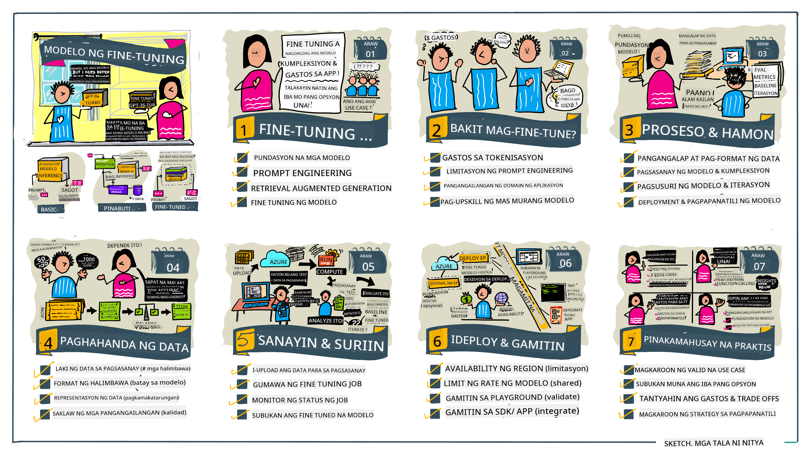

<!--
CO_OP_TRANSLATOR_METADATA:
{
  "original_hash": "807f0d9fc1747e796433534e1be6a98a",
  "translation_date": "2025-10-17T13:26:00+00:00",
  "source_file": "18-fine-tuning/README.md",
  "language_code": "tl"
}
-->

# Pag-Fine-Tune ng Iyong LLM

Ang paggamit ng malalaking language models para bumuo ng generative AI applications ay may mga bagong hamon. Isang mahalagang isyu ay ang pagtiyak sa kalidad ng tugon (katumpakan at kaugnayan) sa nilalaman na nabuo ng modelo para sa isang partikular na kahilingan ng user. Sa mga nakaraang aralin, tinalakay natin ang mga teknik tulad ng prompt engineering at retrieval-augmented generation na sinusubukang lutasin ang problema sa pamamagitan ng _pagbabago ng input na prompt_ sa umiiral na modelo.

Sa aralin ngayon, tatalakayin natin ang ikatlong teknik, **fine-tuning**, na sinusubukang tugunan ang hamon sa pamamagitan ng _muling pagsasanay sa mismong modelo_ gamit ang karagdagang data. Tuklasin natin ang mga detalye.

## Mga Layunin sa Pag-aaral

Ang araling ito ay nagpapakilala sa konsepto ng fine-tuning para sa mga pre-trained language models, sinisiyasat ang mga benepisyo at hamon ng pamamaraang ito, at nagbibigay ng gabay kung kailan at paano gamitin ang fine-tuning upang mapabuti ang performance ng iyong generative AI models.

Sa pagtatapos ng araling ito, dapat mong masagot ang mga sumusunod na tanong:

- Ano ang fine-tuning para sa mga language models?
- Kailan, at bakit, kapaki-pakinabang ang fine-tuning?
- Paano ko ma-fine-tune ang isang pre-trained model?
- Ano ang mga limitasyon ng fine-tuning?

Handa ka na ba? Simulan na natin.

## Gabay na May Ilustrasyon

Gusto mo bang makita ang kabuuang larawan ng mga tatalakayin bago tayo magsimula? Tingnan ang gabay na may ilustrasyon na naglalarawan ng learning journey para sa araling ito - mula sa pag-aaral ng mga pangunahing konsepto at motibasyon para sa fine-tuning, hanggang sa pag-unawa sa proseso at pinakamahusay na mga kasanayan para sa pagsasagawa ng fine-tuning task. Isang kawili-wiling paksa ito para sa paggalugad, kaya huwag kalimutang tingnan ang [Resources](./RESOURCES.md?WT.mc_id=academic-105485-koreyst) page para sa karagdagang mga link na susuporta sa iyong self-guided learning journey!

## Ano ang fine-tuning para sa mga language models?

Sa kahulugan, ang malalaking language models ay _pre-trained_ sa malalaking dami ng teksto na nagmula sa iba't ibang mapagkukunan kabilang ang internet. Tulad ng natutunan natin sa mga nakaraang aralin, kailangan natin ng mga teknik tulad ng _prompt engineering_ at _retrieval-augmented generation_ upang mapabuti ang kalidad ng mga tugon ng modelo sa mga tanong ng user ("prompts").

Isang popular na teknik sa prompt-engineering ang pagbibigay sa modelo ng mas malinaw na gabay kung ano ang inaasahan sa tugon, alinman sa pamamagitan ng pagbibigay ng _mga instruksyon_ (malinaw na gabay) o _pagbibigay ng ilang halimbawa_ (hindi direktang gabay). Ito ay tinatawag na _few-shot learning_ ngunit may dalawang limitasyon:

- Ang mga limitasyon sa token ng modelo ay maaaring magpigil sa dami ng mga halimbawa na maibibigay, at magpababa sa bisa nito.
- Ang mga gastos sa token ng modelo ay maaaring gawing mahal ang pagdaragdag ng mga halimbawa sa bawat prompt, at magpababa sa kakayahang umangkop.

Ang fine-tuning ay isang karaniwang kasanayan sa mga machine learning systems kung saan kinukuha natin ang isang pre-trained model at muling sinasanay ito gamit ang bagong data upang mapabuti ang performance nito sa isang partikular na gawain. Sa konteksto ng mga language models, maaari nating i-fine-tune ang pre-trained model _gamit ang isang maingat na piniling set ng mga halimbawa para sa isang partikular na gawain o application domain_ upang makalikha ng **custom model** na maaaring mas tumpak at kaugnay para sa partikular na gawain o domain. Isang karagdagang benepisyo ng fine-tuning ay maaari nitong bawasan ang dami ng mga halimbawa na kailangan para sa few-shot learning - binabawasan ang paggamit ng token at kaugnay na mga gastos.

## Kailan at bakit natin dapat i-fine-tune ang mga modelo?

Sa _konteksto_ na ito, kapag pinag-uusapan natin ang fine-tuning, tinutukoy natin ang **supervised** fine-tuning kung saan ang muling pagsasanay ay ginagawa sa pamamagitan ng **pagdaragdag ng bagong data** na hindi bahagi ng orihinal na training dataset. Ito ay naiiba sa unsupervised fine-tuning approach kung saan ang modelo ay muling sinasanay sa orihinal na data, ngunit may iba't ibang hyperparameters.

Ang mahalagang bagay na dapat tandaan ay ang fine-tuning ay isang advanced na teknik na nangangailangan ng tiyak na antas ng kadalubhasaan upang makamit ang nais na resulta. Kung hindi ito nagawa nang tama, maaaring hindi nito maibigay ang inaasahang mga pagpapabuti, at maaaring magpababa pa sa performance ng modelo para sa iyong target na domain.

Kaya, bago mo matutunan "paano" mag-fine-tune ng mga language models, kailangan mong malaman "bakit" mo dapat piliin ang landas na ito, at "kailan" magsisimula ng proseso ng fine-tuning. Simulan sa pamamagitan ng pagtatanong sa iyong sarili ng mga tanong na ito:

- **Use Case**: Ano ang iyong _use case_ para sa fine-tuning? Anong aspeto ng kasalukuyang pre-trained model ang nais mong mapabuti?
- **Alternatives**: Nasubukan mo na ba ang _ibang mga teknik_ upang makamit ang nais na resulta? Gamitin ang mga ito upang lumikha ng baseline para sa paghahambing.
  - Prompt engineering: Subukan ang mga teknik tulad ng few-shot prompting gamit ang mga halimbawa ng kaugnay na mga tugon sa prompt. Suriin ang kalidad ng mga tugon.
  - Retrieval Augmented Generation: Subukan ang pagdaragdag ng mga prompt gamit ang mga resulta ng query na nakuha sa pamamagitan ng paghahanap sa iyong data. Suriin ang kalidad ng mga tugon.
- **Costs**: Natukoy mo na ba ang mga gastos para sa fine-tuning?
  - Tunability - available ba ang pre-trained model para sa fine-tuning?
  - Effort - para sa paghahanda ng training data, pagsusuri at pagpapabuti ng modelo.
  - Compute - para sa pagpapatakbo ng fine-tuning jobs, at pag-deploy ng fine-tuned model.
  - Data - access sa sapat na kalidad ng mga halimbawa para sa epekto ng fine-tuning.
- **Benefits**: Nakumpirma mo na ba ang mga benepisyo ng fine-tuning?
  - Quality - mas mahusay ba ang fine-tuned model kumpara sa baseline?
  - Cost - nababawasan ba nito ang paggamit ng token sa pamamagitan ng pagpapasimple ng mga prompt?
  - Extensibility - magagamit ba muli ang base model para sa mga bagong domain?

Sa pagsagot sa mga tanong na ito, dapat mong matukoy kung ang fine-tuning ay ang tamang approach para sa iyong use case. Sa ideal na sitwasyon, ang approach ay valid lamang kung ang mga benepisyo ay mas malaki kaysa sa mga gastos. Kapag napagpasyahan mong magpatuloy, oras na para isipin _paano_ mo ma-fine-tune ang pre-trained model.

Gusto mo bang makakuha ng higit pang insights sa proseso ng paggawa ng desisyon? Panoorin ang [To fine-tune or not to fine-tune](https://www.youtube.com/watch?v=0Jo-z-MFxJs)

## Paano natin ma-fine-tune ang isang pre-trained model?

Para ma-fine-tune ang isang pre-trained model, kailangan mo ng:

- isang pre-trained model na i-fine-tune
- isang dataset na gagamitin para sa fine-tuning
- isang training environment para patakbuhin ang fine-tuning job
- isang hosting environment para i-deploy ang fine-tuned model

## Fine-Tuning Sa Aksyon

Ang mga sumusunod na resources ay nagbibigay ng step-by-step tutorials upang gabayan ka sa isang tunay na halimbawa gamit ang napiling modelo na may maingat na piniling dataset. Para magawa ang mga tutorials na ito, kailangan mo ng account sa partikular na provider, kasama ang access sa kaugnay na modelo at datasets.

| Provider     | Tutorial                                                                                                                                                                       | Description                                                                                                                                                                                                                                                                                                                                                                                                                        |
| ------------ | ------------------------------------------------------------------------------------------------------------------------------------------------------------------------------ | ---------------------------------------------------------------------------------------------------------------------------------------------------------------------------------------------------------------------------------------------------------------------------------------------------------------------------------------------------------------------------------------------------------------------------------- |
| OpenAI       | [How to fine-tune chat models](https://github.com/openai/openai-cookbook/blob/main/examples/How_to_finetune_chat_models.ipynb?WT.mc_id=academic-105485-koreyst)                | Matutunan kung paano i-fine-tune ang `gpt-35-turbo` para sa isang partikular na domain ("recipe assistant") sa pamamagitan ng paghahanda ng training data, pagpapatakbo ng fine-tuning job, at paggamit ng fine-tuned model para sa inference.                                                                                                                                                                                                                                              |
| Azure OpenAI | [GPT 3.5 Turbo fine-tuning tutorial](https://learn.microsoft.com/azure/ai-services/openai/tutorials/fine-tune?tabs=python-new%2Ccommand-line?WT.mc_id=academic-105485-koreyst) | Matutunan kung paano i-fine-tune ang `gpt-35-turbo-0613` model **sa Azure** sa pamamagitan ng mga hakbang sa paglikha at pag-upload ng training data, pagpapatakbo ng fine-tuning job. I-deploy at gamitin ang bagong modelo.                                                                                                                                                                                                                                                                 |
| Hugging Face | [Fine-tuning LLMs with Hugging Face](https://www.philschmid.de/fine-tune-llms-in-2024-with-trl?WT.mc_id=academic-105485-koreyst)                                               | Ang blog post na ito ay naglalakad sa iyo sa fine-tuning ng isang _open LLM_ (halimbawa: `CodeLlama 7B`) gamit ang [transformers](https://huggingface.co/docs/transformers/index?WT.mc_id=academic-105485-koreyst) library & [Transformer Reinforcement Learning (TRL)](https://huggingface.co/docs/trl/index?WT.mc_id=academic-105485-koreyst]) gamit ang open [datasets](https://huggingface.co/docs/datasets/index?WT.mc_id=academic-105485-koreyst) sa Hugging Face. |
|              |                                                                                                                                                                                |                                                                                                                                                                                                                                                                                                                                                                                                                                    |
| 🤗 AutoTrain | [Fine-tuning LLMs with AutoTrain](https://github.com/huggingface/autotrain-advanced/?WT.mc_id=academic-105485-koreyst)                                                         | Ang AutoTrain (o AutoTrain Advanced) ay isang python library na binuo ng Hugging Face na nagbibigay-daan sa fine-tuning para sa iba't ibang mga gawain kabilang ang LLM fine-tuning. Ang AutoTrain ay isang no-code solution at ang fine-tuning ay maaaring gawin sa iyong sariling cloud, sa Hugging Face Spaces o lokal. Sinusuportahan nito ang parehong web-based GUI, CLI, at training sa pamamagitan ng yaml config files.                                                                               |
|              |                                                                                                                                                                                |                                                                                                                                                                                                                                                                                                                                                                                                                                    |

## Assignment

Piliin ang isa sa mga tutorials sa itaas at sundan ito. _Maaaring kopyahin namin ang bersyon ng mga tutorials na ito sa Jupyter Notebooks sa repo na ito para sa reference lamang. Mangyaring gamitin ang orihinal na mga source nang direkta upang makuha ang pinakabagong mga bersyon_.

## Magaling! Ipagpatuloy ang Iyong Pag-aaral.

Pagkatapos makumpleto ang araling ito, tingnan ang aming [Generative AI Learning collection](https://aka.ms/genai-collection?WT.mc_id=academic-105485-koreyst) upang patuloy na paunlarin ang iyong kaalaman sa Generative AI!

Binabati kita!! Natapos mo na ang huling aralin mula sa v2 series para sa kursong ito! Huwag tumigil sa pag-aaral at paggawa. \*\*Tingnan ang [RESOURCES](RESOURCES.md?WT.mc_id=academic-105485-koreyst) page para sa listahan ng karagdagang mga mungkahi para sa partikular na paksa.

Ang aming v1 series ng mga aralin ay na-update din na may mas maraming assignments at konsepto. Kaya maglaan ng oras upang i-refresh ang iyong kaalaman - at mangyaring [ibahagi ang iyong mga tanong at feedback](https://github.com/microsoft/generative-ai-for-beginners/issues?WT.mc_id=academic-105485-koreyst) upang matulungan kaming mapabuti ang mga araling ito para sa komunidad.

---

**Paunawa**:  
Ang dokumentong ito ay isinalin gamit ang AI translation service na [Co-op Translator](https://github.com/Azure/co-op-translator). Bagamat sinisikap naming maging tumpak, mangyaring tandaan na ang mga awtomatikong pagsasalin ay maaaring maglaman ng mga pagkakamali o hindi pagkakatugma. Ang orihinal na dokumento sa kanyang katutubong wika ang dapat ituring na opisyal na sanggunian. Para sa mahalagang impormasyon, inirerekomenda ang propesyonal na pagsasalin ng tao. Hindi kami mananagot sa anumang hindi pagkakaunawaan o maling interpretasyon na dulot ng paggamit ng pagsasaling ito.