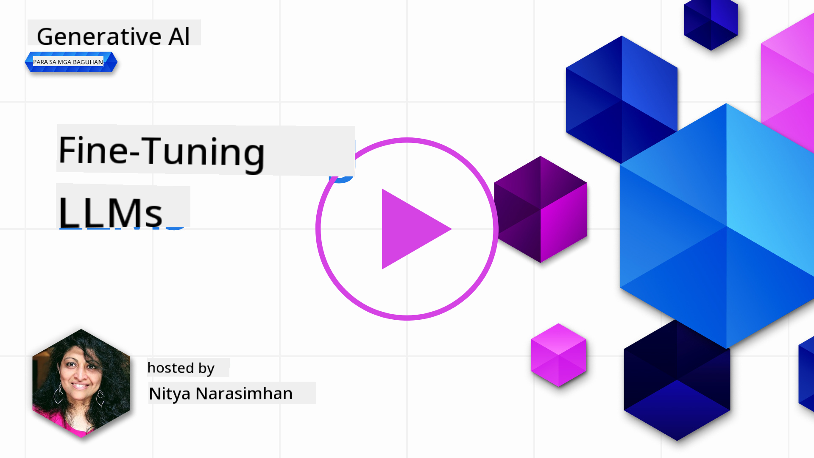

<!--
CO_OP_TRANSLATOR_METADATA:
{
  "original_hash": "68664f7e754a892ae1d8d5e2b7bd2081",
  "translation_date": "2025-07-09T17:47:28+00:00",
  "source_file": "18-fine-tuning/README.md",
  "language_code": "tl"
}
-->

# Fine-Tuning ng Iyong LLM

Ang paggamit ng malalaking language models para gumawa ng generative AI applications ay may kasamang mga bagong hamon. Isang mahalagang isyu ay ang pagtiyak ng kalidad ng sagot (katumpakan at kaugnayan) sa nilikhang nilalaman ng modelo para sa isang partikular na kahilingan ng gumagamit. Sa mga naunang aralin, tinalakay natin ang mga teknik tulad ng prompt engineering at retrieval-augmented generation na sinusubukang lutasin ang problema sa pamamagitan ng _pagbabago ng prompt input_ sa umiiral na modelo.

Sa aralin ngayon, tatalakayin natin ang ikatlong teknik, ang **fine-tuning**, na sinusubukang tugunan ang hamon sa pamamagitan ng _muling pagsasanay sa mismong modelo_ gamit ang karagdagang datos. Tara, silipin natin ang mga detalye.

## Mga Layunin sa Pagkatuto

Ipinapakilala ng araling ito ang konsepto ng fine-tuning para sa mga pre-trained na language models, sinusuri ang mga benepisyo at hamon ng pamamaraang ito, at nagbibigay ng gabay kung kailan at paano gamitin ang fine-tuning upang mapabuti ang performance ng iyong generative AI models.

Sa pagtatapos ng araling ito, dapat mong masagot ang mga sumusunod na tanong:

- Ano ang fine-tuning para sa mga language models?
- Kailan, at bakit, kapaki-pakinabang ang fine-tuning?
- Paano ako makakapag-fine-tune ng pre-trained na modelo?
- Ano ang mga limitasyon ng fine-tuning?

Handa ka na ba? Magsimula na tayo.

## Gabay na May Larawan

Gusto mo bang makita ang kabuuang larawan ng mga tatalakayin bago tayo magsimula? Tingnan ang gabay na may larawan na naglalarawan ng paglalakbay sa pagkatuto para sa araling ito — mula sa pag-unawa sa mga pangunahing konsepto at motibasyon para sa fine-tuning, hanggang sa proseso at mga pinakamahusay na kasanayan sa pagsasagawa ng fine-tuning. Isang kawili-wiling paksa ito kaya huwag kalimutang bisitahin ang [Resources](./RESOURCES.md?WT.mc_id=academic-105485-koreyst) na pahina para sa karagdagang mga link na susuporta sa iyong sariling pag-aaral!

## Ano ang fine-tuning para sa mga language models?

Sa kahulugan, ang malalaking language models ay _pre-trained_ gamit ang malaking dami ng teksto mula sa iba't ibang pinagmulan kabilang ang internet. Tulad ng natutunan natin sa mga naunang aralin, kailangan natin ng mga teknik tulad ng _prompt engineering_ at _retrieval-augmented generation_ upang mapabuti ang kalidad ng mga sagot ng modelo sa mga tanong ng gumagamit ("prompts").

Isang kilalang teknik sa prompt engineering ay ang pagbibigay ng mas malinaw na gabay sa modelo kung ano ang inaasahan sa sagot, alinman sa pamamagitan ng pagbibigay ng _mga tagubilin_ (malinaw na gabay) o _pagbibigay ng ilang halimbawa_ (di-tuwirang gabay). Tinatawag ito na _few-shot learning_ ngunit may dalawang limitasyon:

- Ang token limit ng modelo ay maaaring pumigil sa dami ng mga halimbawang maibibigay, at mabawasan ang bisa nito.
- Ang gastos sa token ng modelo ay maaaring maging mahal kung magdadagdag ng mga halimbawa sa bawat prompt, at mabawasan ang kakayahang mag-adjust.

Ang fine-tuning ay isang karaniwang gawain sa mga machine learning system kung saan kinukuha natin ang pre-trained na modelo at muling sinasanay gamit ang bagong datos upang mapabuti ang performance nito sa isang partikular na gawain. Sa konteksto ng mga language models, maaari nating i-fine-tune ang pre-trained na modelo _gamit ang isang maingat na piniling set ng mga halimbawa para sa isang partikular na gawain o domain ng aplikasyon_ upang makagawa ng isang **custom na modelo** na maaaring mas tumpak at mas angkop para sa partikular na gawain o domain. Isang karagdagang benepisyo ng fine-tuning ay maaari rin nitong bawasan ang dami ng mga halimbawang kailangan para sa few-shot learning — kaya nababawasan ang paggamit ng token at mga kaugnay na gastos.

## Kailan at bakit tayo dapat mag-fine-tune ng mga modelo?

Sa _kontekstong ito_, kapag pinag-uusapan natin ang fine-tuning, tinutukoy natin ang **supervised** fine-tuning kung saan ang muling pagsasanay ay ginagawa sa pamamagitan ng **pagdaragdag ng bagong datos** na hindi bahagi ng orihinal na training dataset. Iba ito sa unsupervised fine-tuning kung saan muling sinasanay ang modelo gamit ang orihinal na datos, ngunit may ibang hyperparameters.

Ang mahalagang tandaan ay ang fine-tuning ay isang advanced na teknik na nangangailangan ng sapat na kaalaman upang makamit ang inaasahang resulta. Kung mali ang pagkakagawa, maaaring hindi ito magbigay ng inaasahang pagbuti, at maaari pang magpababa ng performance ng modelo para sa iyong target na domain.

Kaya bago mo matutunan kung "paano" mag-fine-tune ng mga language models, kailangan mong malaman kung "bakit" mo ito gagawin, at "kailan" sisimulan ang proseso ng fine-tuning. Magsimula sa pagtatanong sa sarili ng mga sumusunod:

- **Use Case**: Ano ang iyong _use case_ para sa fine-tuning? Anong aspeto ng kasalukuyang pre-trained na modelo ang nais mong pagbutihin?
- **Alternatibo**: Nasubukan mo na ba ang _ibang teknik_ upang makamit ang nais na resulta? Gamitin ang mga ito bilang baseline para sa paghahambing.
  - Prompt engineering: Subukan ang mga teknik tulad ng few-shot prompting gamit ang mga halimbawa ng kaugnay na sagot sa prompt. Suriin ang kalidad ng mga sagot.
  - Retrieval Augmented Generation: Subukan ang pagdagdag ng mga resulta ng query sa mga prompt mula sa paghahanap sa iyong datos. Suriin ang kalidad ng mga sagot.
- **Gastos**: Natukoy mo na ba ang mga gastos para sa fine-tuning?
  - Tunability - available ba ang pre-trained na modelo para sa fine-tuning?
  - Pagsisikap - para sa paghahanda ng training data, pagsusuri at pag-aayos ng modelo.
  - Compute - para sa pagpapatakbo ng fine-tuning jobs, at pag-deploy ng fine-tuned na modelo.
  - Data - access sa sapat na kalidad ng mga halimbawa para sa epekto ng fine-tuning.
- **Benepisyo**: Nakumpirma mo na ba ang mga benepisyo ng fine-tuning?
  - Kalidad - nalampasan ba ng fine-tuned na modelo ang baseline?
  - Gastos - nabawasan ba nito ang paggamit ng token sa pamamagitan ng pagpapasimple ng mga prompt?
  - Kakayahang palawakin - maaari mo bang gamitin muli ang base model para sa mga bagong domain?

Sa pagsagot sa mga tanong na ito, dapat mong malaman kung ang fine-tuning ba ang tamang paraan para sa iyong use case. Ideal na ang pamamaraang ito ay valid lamang kung ang mga benepisyo ay mas malaki kaysa sa mga gastos. Kapag napagpasyahan mo nang ituloy, panahon na para pag-isipan kung _paano_ mo i-fine-tune ang pre-trained na modelo.

Gusto mo pa ng karagdagang kaalaman sa proseso ng pagdedesisyon? Panoorin ang [To fine-tune or not to fine-tune](https://www.youtube.com/watch?v=0Jo-z-MFxJs)

## Paano tayo makakapag-fine-tune ng pre-trained na modelo?

Para mag-fine-tune ng pre-trained na modelo, kailangan mo ng:

- isang pre-trained na modelo na i-fine-tune
- isang dataset na gagamitin para sa fine-tuning
- isang training environment para patakbuhin ang fine-tuning job
- isang hosting environment para i-deploy ang fine-tuned na modelo

## Fine-Tuning sa Aksyon

Ang mga sumusunod na resources ay nagbibigay ng step-by-step na mga tutorial upang gabayan ka sa isang totoong halimbawa gamit ang isang napiling modelo at maingat na dataset. Para magamit ang mga tutorial na ito, kailangan mo ng account sa partikular na provider, pati na rin access sa kaugnay na modelo at mga dataset.

| Provider     | Tutorial                                                                                                                                                                       | Paglalarawan                                                                                                                                                                                                                                                                                                                                                                                                                        |
| ------------ | ------------------------------------------------------------------------------------------------------------------------------------------------------------------------------ | ---------------------------------------------------------------------------------------------------------------------------------------------------------------------------------------------------------------------------------------------------------------------------------------------------------------------------------------------------------------------------------------------------------------------------------- |
| OpenAI       | [How to fine-tune chat models](https://github.com/openai/openai-cookbook/blob/main/examples/How_to_finetune_chat_models.ipynb?WT.mc_id=academic-105485-koreyst)                | Matutunan kung paano i-fine-tune ang `gpt-35-turbo` para sa isang partikular na domain ("recipe assistant") sa pamamagitan ng paghahanda ng training data, pagpapatakbo ng fine-tuning job, at paggamit ng fine-tuned na modelo para sa inference.                                                                                                                                                                                    |
| Azure OpenAI | [GPT 3.5 Turbo fine-tuning tutorial](https://learn.microsoft.com/azure/ai-services/openai/tutorials/fine-tune?tabs=python-new%2Ccommand-line?WT.mc_id=academic-105485-koreyst) | Matutunan kung paano i-fine-tune ang `gpt-35-turbo-0613` na modelo **sa Azure** sa pamamagitan ng mga hakbang para gumawa at mag-upload ng training data, patakbuhin ang fine-tuning job, i-deploy at gamitin ang bagong modelo.                                                                                                                                                                                                       |
| Hugging Face | [Fine-tuning LLMs with Hugging Face](https://www.philschmid.de/fine-tune-llms-in-2024-with-trl?WT.mc_id=academic-105485-koreyst)                                               | Ang blog post na ito ay naglalakad sa proseso ng fine-tuning ng isang _open LLM_ (halimbawa: `CodeLlama 7B`) gamit ang [transformers](https://huggingface.co/docs/transformers/index?WT.mc_id=academic-105485-koreyst) library at [Transformer Reinforcement Learning (TRL)](https://huggingface.co/docs/trl/index?WT.mc_id=academic-105485-koreyst) kasama ang mga open [datasets](https://huggingface.co/docs/datasets/index?WT.mc_id=academic-105485-koreyst) sa Hugging Face. |
|              |                                                                                                                                                                                |                                                                                                                                                                                                                                                                                                                                                                                                                                    |
| 🤗 AutoTrain | [Fine-tuning LLMs with AutoTrain](https://github.com/huggingface/autotrain-advanced/?WT.mc_id=academic-105485-koreyst)                                                         | Ang AutoTrain (o AutoTrain Advanced) ay isang python library na ginawa ng Hugging Face na nagpapahintulot ng fine-tuning para sa maraming iba't ibang gawain kabilang ang LLM fine-tuning. Ang AutoTrain ay isang no-code na solusyon at maaaring gawin ang fine-tuning sa iyong sariling cloud, sa Hugging Face Spaces, o lokal. Sinusuportahan nito ang web-based GUI, CLI, at training gamit ang yaml config files.                                               |
|              |                                                                                                                                                                                |                                                                                                                                                                                                                                                                                                                                                                                                                                    |

## Takdang-Aralin

Pumili ng isa sa mga tutorial sa itaas at sundan ito. _Maaaring gumawa kami ng bersyon ng mga tutorial na ito sa Jupyter Notebooks sa repo na ito bilang sanggunian lamang. Mangyaring gamitin ang orihinal na mga pinagmulan upang makuha ang pinakabagong bersyon_.

## Magaling! Ipagpatuloy ang Iyong Pag-aaral.

Pagkatapos makumpleto ang araling ito, bisitahin ang aming [Generative AI Learning collection](https://aka.ms/genai-collection?WT.mc_id=academic-105485-koreyst) upang ipagpatuloy ang pagpapalawak ng iyong kaalaman sa Generative AI!

Binabati kita!! Natapos mo na ang huling aralin mula sa v2 series para sa kursong ito! Huwag tumigil sa pag-aaral at paggawa. \*\*Tingnan ang [RESOURCES](RESOURCES.md?WT.mc_id=academic-105485-koreyst) na pahina para sa listahan ng karagdagang mga mungkahi para sa paksang ito.

Ang aming v1 series ng mga aralin ay na-update din na may mas maraming takdang-aralin at konsepto. Kaya maglaan ng sandali upang sariwain ang iyong kaalaman — at mangyaring [ibahagi ang iyong mga tanong at puna](https://github.com/microsoft/generative-ai-for-beginners/issues?WT.mc_id=academic-105485-koreyst) upang matulungan kaming pagbutihin ang mga araling ito para sa komunidad.

**Paalala**:  
Ang dokumentong ito ay isinalin gamit ang AI translation service na [Co-op Translator](https://github.com/Azure/co-op-translator). Bagamat nagsusumikap kami para sa katumpakan, pakatandaan na ang mga awtomatikong pagsasalin ay maaaring maglaman ng mga pagkakamali o di-tumpak na impormasyon. Ang orihinal na dokumento sa orihinal nitong wika ang dapat ituring na pangunahing sanggunian. Para sa mahahalagang impormasyon, inirerekomenda ang propesyonal na pagsasalin ng tao. Hindi kami mananagot sa anumang hindi pagkakaunawaan o maling interpretasyon na maaaring magmula sa paggamit ng pagsasaling ito.