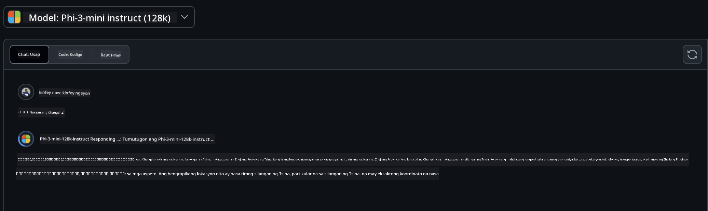
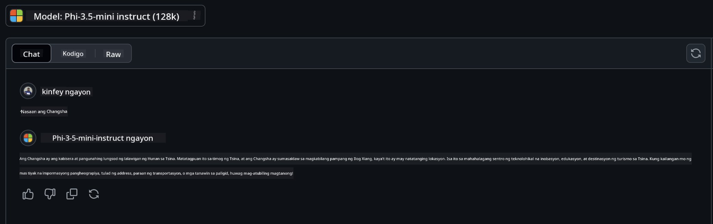

<!--
CO_OP_TRANSLATOR_METADATA:
{
  "original_hash": "124ad36cfe96f74038811b6e2bb93e9d",
  "translation_date": "2025-05-20T10:20:32+00:00",
  "source_file": "19-slm/README.md",
  "language_code": "tl"
}
-->
# Panimula sa Maliliit na Modelong Pangwika para sa Generative AI para sa mga Baguhan Ang Generative AI ay isang kahanga-hangang larangan ng artificial intelligence na nakatuon sa paglikha ng mga sistemang may kakayahang bumuo ng bagong nilalaman. Ang nilalamang ito ay maaaring mula sa teksto at mga imahe hanggang sa musika at maging sa buong virtual na kapaligiran. Isa sa mga pinaka-kapanapanabik na aplikasyon ng generative AI ay sa larangan ng mga modelong pangwika. ## Ano ang Maliliit na Modelong Pangwika? Ang isang Maliit na Modelong Pangwika (SLM) ay kumakatawan sa isang pinaliit na bersyon ng isang malaking modelong pangwika (LLM), na ginagamit ang marami sa mga prinsipyo ng arkitektura at mga pamamaraan ng LLMs, habang nagpapakita ng makabuluhang nabawasang computational footprint. Ang mga SLM ay isang subset ng mga modelong pangwika na dinisenyo upang bumuo ng tekstong kahawig ng sa tao. Di tulad ng kanilang mas malalaking katapat, gaya ng GPT-4, ang mga SLM ay mas compact at mahusay, na ginagawa silang perpekto para sa mga aplikasyon kung saan limitado ang mga computational resources. Sa kabila ng kanilang mas maliit na sukat, maaari pa rin silang magsagawa ng iba't ibang gawain. Karaniwan, ang mga SLM ay binubuo sa pamamagitan ng pag-compress o pag-distill ng LLMs, na naglalayong mapanatili ang isang malaking bahagi ng orihinal na kakayahan at kakayahan sa lingguwistika ng modelo. Ang pagbawas na ito sa sukat ng modelo ay nagpapababa sa kabuuang pagiging kumplikado, na ginagawa ang mga SLM na mas mahusay sa mga tuntunin ng parehong paggamit ng memorya at mga kinakailangan sa computational. Sa kabila ng mga pag-optimize na ito, ang mga SLM ay maaari pa ring magsagawa ng malawak na hanay ng mga gawain sa natural na pagproseso ng wika (NLP): - Paggawa ng Teksto: Paglikha ng mga magkakaugnay at kontekstwal na nauugnay na mga pangungusap o talata. - Pagkumpleto ng Teksto: Paghula at pagkumpleto ng mga pangungusap batay sa isang ibinigay na prompt. - Pagsasalin: Pag-convert ng teksto mula sa isang wika patungo sa isa pa. - Pagbubuod: Pagpapaliit ng mahahabang piraso ng teksto sa mas maiikli, mas madaling matunaw na mga buod. Bagaman may ilang trade-offs sa pagganap o lalim ng pag-unawa kumpara sa kanilang mas malalaking katapat. ## Paano Gumagana ang Maliliit na Modelong Pangwika? Ang mga SLM ay sinasanay sa napakalaking dami ng data ng teksto. Sa panahon ng pagsasanay, natutunan nila ang mga pattern at istruktura ng wika, na nagbibigay-daan sa kanila na bumuo ng teksto na parehong grammatically correct at kontekstwal na naaangkop. Ang proseso ng pagsasanay ay kinabibilangan ng: - Pagkolekta ng Data: Pagtipon ng malalaking dataset ng teksto mula sa iba't ibang mapagkukunan. - Preprocessing: Paglilinis at pag-aayos ng data upang gawing angkop ito para sa pagsasanay. - Pagsasanay: Paggamit ng mga algorithm ng machine learning upang turuan ang modelo kung paano maunawaan at bumuo ng teksto. - Fine-Tuning: Pagsasaayos ng modelo upang mapabuti ang pagganap nito sa mga tiyak na gawain. Ang pagbuo ng mga SLM ay umaayon sa tumataas na pangangailangan para sa mga modelo na maaring i-deploy sa mga environment na may limitadong resources, gaya ng mga mobile device o edge computing platform, kung saan maaaring hindi praktikal ang full-scale LLMs dahil sa kanilang mabigat na resource demands. Sa pamamagitan ng pagtutok sa kahusayan, ang mga SLM ay nagbabalanse ng pagganap sa accessibility, na nagbibigay-daan sa mas malawak na aplikasyon sa iba't ibang domain. ## Mga Layunin sa Pagkatuto Sa araling ito, inaasahan naming ipakilala ang kaalaman ng SLM at pagsamahin ito sa Microsoft Phi-3 upang matutunan ang iba't ibang senaryo sa nilalaman ng teksto, paningin, at MoE. Sa pagtatapos ng araling ito, dapat mong masagot ang mga sumusunod na katanungan: - Ano ang SLM - Ano ang pagkakaiba ng SLM at LLM - Ano ang Microsoft Phi-3/3.5 Family - Paano mag-inference sa Microsoft Phi-3/3.5 Family Handa ka na ba? Magsimula na tayo. ## Ang mga Pagkakaiba sa Pagitan ng Malalaking Modelong Pangwika (LLMs) at Maliliit na Modelong Pangwika (SLMs) Ang parehong LLMs at SLMs ay binuo sa mga pundasyong prinsipyo ng probabilistic machine learning, na sumusunod sa magkatulad na mga pamamaraan sa kanilang disenyo ng arkitektura, mga pamamaraan ng pagsasanay, mga proseso ng pagbuo ng data, at mga pamamaraan ng pagsusuri ng modelo. Gayunpaman, ilang mga pangunahing salik ang nagkakaiba sa dalawang uri ng mga modelo. ## Mga Aplikasyon ng Maliliit na Modelong Pangwika Ang mga SLM ay may malawak na hanay ng mga aplikasyon, kabilang ang: - Mga Chatbot: Pagbibigay ng suporta sa customer at pakikipag-ugnayan sa mga gumagamit sa isang conversational na paraan. - Paglikha ng Nilalaman: Pagtulong sa mga manunulat sa pamamagitan ng pagbuo ng mga ideya o kahit na pag-draft ng buong artikulo. - Edukasyon: Pagtulong sa mga estudyante sa mga gawain sa pagsusulat o pag-aaral ng mga bagong wika. - Accessibility: Paglikha ng mga tool para sa mga indibidwal na may mga kapansanan, tulad ng mga sistema ng text-to-speech. **Laki** Isang pangunahing pagkakaiba sa pagitan ng LLMs at SLMs ay ang saklaw ng mga modelo. Ang LLMs, tulad ng ChatGPT (GPT-4), ay maaaring binubuo ng tinatayang 1.76 trilyon na mga parameter, habang ang mga open-source na SLMs tulad ng Mistral 7B ay dinisenyo na may makabuluhang mas kaunting mga parameter—humigit-kumulang 7 bilyon. Ang pagkakaibang ito ay pangunahing dulot ng mga pagkakaiba sa arkitektura ng modelo at mga proseso ng pagsasanay. Halimbawa, ang ChatGPT ay gumagamit ng isang self-attention mechanism sa loob ng isang encoder-decoder framework, samantalang ang Mistral 7B ay gumagamit ng sliding window attention, na nagpapahintulot sa mas mahusay na pagsasanay sa loob ng isang decoder-only na modelo. Ang pagkakaibang ito sa arkitektura ay may malalim na implikasyon para sa pagiging kumplikado at pagganap ng mga modelong ito. **Pag-unawa** Ang mga SLM ay karaniwang na-optimize para sa pagganap sa loob ng mga tiyak na domain, na ginagawa silang lubos na dalubhasa ngunit potensyal na limitado sa kanilang kakayahang magbigay ng malawak na pag-unawa sa konteksto sa iba't ibang larangan ng kaalaman. Sa kabaligtaran, ang LLMs ay naglalayong tularan ang intelihensyang kahawig ng tao sa mas komprehensibong antas. Sinanay sa malawak, magkakaibang mga dataset, ang LLMs ay dinisenyo upang mahusay na gumanap sa iba't ibang mga domain, na nag-aalok ng mas malaking versatility at adaptability. Dahil dito, ang LLMs ay mas angkop para sa mas malawak na hanay ng mga downstream na gawain, tulad ng natural na pagproseso ng wika at programming. **Pag-compute** Ang pagsasanay at pag-deploy ng LLMs ay mga proseso na nangangailangan ng maraming resources, kadalasang nangangailangan ng makabuluhang imprastruktura ng computational, kabilang ang malakihang GPU clusters. Halimbawa, ang pagsasanay sa isang modelo tulad ng ChatGPT mula sa simula ay maaaring mangailangan ng libu-libong mga GPU sa loob ng pinalawig na mga panahon. Sa kabaligtaran, ang mga SLM, na may mas maliit na bilang ng mga parameter, ay mas madaling ma-access sa mga tuntunin ng mga computational resources. Ang mga modelo tulad ng Mistral 7B ay maaaring sanayin at patakbuhin sa mga lokal na makina na may katamtamang kakayahan sa GPU, bagaman ang pagsasanay ay nangangailangan pa rin ng ilang oras sa maraming GPU. **Bias** Ang bias ay isang kilalang isyu sa LLMs, pangunahing dulot ng kalikasan ng data ng pagsasanay. Ang mga modelong ito ay kadalasang umaasa sa raw, bukas na magagamit na data mula sa internet, na maaaring hindi tama o mali ang pagkatawan sa ilang grupo, magpakilala ng maling label, o sumasalamin sa mga bias sa lingguwistika na naiimpluwensyahan ng diyalekto, mga pagkakaiba sa heograpiya, at mga patakaran sa gramatika. Bukod dito, ang pagiging kumplikado ng mga arkitektura ng LLM ay maaaring hindi sinasadyang magpalala ng bias, na maaaring hindi mapansin nang walang maingat na fine-tuning. Sa kabilang banda, ang mga SLM, na sinanay sa mas pinipiling, domain-specific na mga dataset, ay likas na mas hindi madaling kapitan sa mga ganitong bias, bagaman hindi sila immune dito. **Inference** Ang nabawasang sukat ng SLMs ay nagbibigay sa kanila ng makabuluhang kalamangan sa mga tuntunin ng bilis ng inference, na nagpapahintulot sa kanila na bumuo ng mga output nang mahusay sa lokal na hardware nang hindi nangangailangan ng malawak na parallel processing. Sa kabaligtaran, ang LLMs, dahil sa kanilang laki at pagiging kumplikado, ay kadalasang nangangailangan ng malaking parallel computational resources upang makamit ang katanggap-tanggap na mga oras ng inference. Ang presensya ng maraming sabay-sabay na mga gumagamit ay higit pang nagpapabagal sa mga oras ng pagtugon ng LLMs, lalo na kapag na-deploy sa malakihan. Sa kabuuan, habang ang parehong LLMs at SLMs ay nagbabahagi ng pundasyong batayan sa machine learning, sila ay makabuluhang nagkakaiba sa mga tuntunin ng laki ng modelo, mga kinakailangan sa resource, pag-unawa sa konteksto, pagiging madaling kapitan sa bias, at bilis ng inference. Ang mga pagkakaibang ito ay sumasalamin sa kanilang kaukulang pagiging angkop para sa iba't ibang mga kaso ng paggamit, na ang LLMs ay mas versatile ngunit mabigat sa resources, at ang SLMs ay nag-aalok ng mas domain-specific na kahusayan na may nabawasang mga pangangailangan sa computational. ***Tandaan: Sa kabanatang ito, ipakikilala namin ang SLM gamit ang Microsoft Phi-3 / 3.5 bilang isang halimbawa.*** ## Ipakilala ang Phi-3 / Phi-3.5 Family Ang Phi-3 / 3.5 Family ay pangunahing nakatuon sa mga senaryo ng aplikasyon ng teksto, paningin, at Agent (MoE): ### Phi-3 / 3.5 Instruct Pangunahing para sa paggawa ng teksto, pagkumpleto ng chat, at pagkuha ng impormasyon ng nilalaman, atbp. **Phi-3-mini** Ang 3.8B na modelong pangwika ay magagamit sa Microsoft Azure AI Studio, Hugging Face, at Ollama. Ang mga modelo ng Phi-3 ay makabuluhang mas mahusay kaysa sa mga modelong pangwika ng pantay at mas malalaking sukat sa mga pangunahing benchmark (tingnan ang mga numero ng benchmark sa ibaba, mas mataas na numero ay mas mahusay). Ang Phi-3-mini ay mas mahusay kaysa sa mga modelong doble ang laki nito, habang ang Phi-3-small at Phi-3-medium ay mas mahusay kaysa sa mas malalaking modelo, kabilang ang GPT-3.5 **Phi-3-small & medium** Sa kabila ng pagkakaroon lamang ng 7B na mga parameter, ang Phi-3-small ay tinalo ang GPT-3.5T sa iba't ibang mga benchmark ng wika, pangangatwiran, pag-coding, at matematika. Ang Phi-3-medium na may 14B na mga parameter ay nagpapatuloy sa trend na ito at mas mahusay kaysa sa Gemini 1.0 Pro. **Phi-3.5-mini** Maaari nating isipin ito bilang isang pag-upgrade ng Phi-3-mini. Habang nananatiling hindi nagbabago ang mga parameter, pinapabuti nito ang kakayahan sa pagsuporta sa maraming wika (Suporta sa 20+ na mga wika: Arabic, Chinese, Czech, Danish, Dutch, English, Finnish, French, German, Hebrew, Hungarian, Italian, Japanese, Korean, Norwegian, Polish, Portuguese, Russian, Spanish, Swedish, Thai, Turkish, Ukrainian) at nagdadagdag ng mas malakas na suporta para sa mahabang konteksto. Ang Phi-3.5-mini na may 3.8B na mga parameter ay mas mahusay kaysa sa mga modelong pangwika ng parehong sukat at kapantay ng mga modelong doble ang laki nito. ### Phi-3 / 3.5 Vision Maaari nating isipin ang Instruct model ng Phi-3/3.5 bilang kakayahan ni Phi na maunawaan, at ang Vision ang nagbibigay kay Phi ng mga mata upang maunawaan ang mundo. **Phi-3-Vision** Ang Phi-3-vision, na may 4.2B lamang na mga parameter, ay nagpapatuloy sa trend na ito at mas mahusay kaysa sa mas malalaking modelo tulad ng Claude-3 Haiku at Gemini 1.0 Pro V sa mga pangkalahatang gawain ng visual na pangangatwiran, OCR, at mga gawain sa pag-unawa ng talahanayan at diagram. **Phi-3.5-Vision** Ang Phi-3.5-Vision ay isa ring pag-upgrade ng Phi-3-Vision, na nagdadagdag ng suporta para sa maraming mga imahe. Maaari mong isipin ito bilang isang pagpapabuti sa paningin, hindi lamang makakakita ng mga larawan, kundi pati na rin mga video. Ang Phi-3.5-vision ay mas mahusay kaysa sa mas malalaking modelo tulad ng Claude-3.5 Sonnet at Gemini 1.5 Flash sa OCR, pag-unawa sa talahanayan at tsart na mga gawain at kapantay sa mga pangkalahatang gawain ng pangangatwiran sa visual na kaalaman. Suporta sa multi-frame input, i.e., magsagawa ng pangangatwiran sa maraming input na mga imahe ### Phi-3.5-MoE ***Mixture of Experts (MoE)*** ay nagbibigay-daan sa mga modelo na ma-pretrain na may mas kaunting compute, na nangangahulugan na maaari mong lubos na palakihin ang sukat ng modelo o dataset na may parehong compute budget bilang isang dense model. Partikular, ang isang MoE na modelo ay dapat makamit ang parehong kalidad gaya ng dense counterpart nito nang mas mabilis sa panahon ng pretraining. Ang Phi-3.5-MoE ay binubuo ng 16x3.8B na mga expert modules. Ang Phi-3.5-MoE na may 6.6B lamang na aktibong mga parameter ay nakakamit ng katulad na antas ng pangangatwiran, pag-unawa sa wika, at matematika gaya ng mas malalaking modelo Maaari nating gamitin ang modelo ng Phi-3/3.5 Family batay sa iba't ibang senaryo. Di tulad ng LLM, maaari mong i-deploy ang Phi-3/3.5-mini o Phi-3/3.5-Vision sa mga edge device. ## Paano gamitin ang mga modelo ng Phi-3/3.5 Family Inaasahan naming gamitin ang Phi-3/3.5 sa iba't ibang senaryo. Susunod, gagamitin namin ang Phi-3/3.5 batay sa iba't ibang senaryo. ### Pagkakaiba sa Inference Cloud's API **GitHub Models** GitHub
Ang mga modelo ay ang pinaka-direktang paraan. Maaari mong mabilis na ma-access ang Phi-3/3.5-Instruct na modelo sa pamamagitan ng GitHub Models. Pinagsama sa Azure AI Inference SDK / OpenAI SDK, maaari mong ma-access ang API sa pamamagitan ng code upang makumpleto ang tawag sa Phi-3/3.5-Instruct. Maaari mo ring subukan ang iba't ibang epekto sa pamamagitan ng Playground. - Demo: Paghahambing ng mga epekto ng Phi-3-mini at Phi-3.5-mini sa mga senaryo sa Tsino   **Azure AI Studio** O kung nais nating gamitin ang mga modelo ng vision at MoE, maaari mong gamitin ang Azure AI Studio upang makumpleto ang tawag. Kung ikaw ay interesado, maaari mong basahin ang Phi-3 Cookbook upang malaman kung paano tawagin ang Phi-3/3.5 Instruct, Vision, MoE sa pamamagitan ng Azure AI Studio [I-click ang link na ito](https://github.com/microsoft/Phi-3CookBook/blob/main/md/02.QuickStart/AzureAIStudio_QuickStart.md?WT.mc_id=academic-105485-koreyst) **NVIDIA NIM** Bukod sa mga solusyon sa cloud-based Model Catalog na ibinibigay ng Azure at GitHub, maaari mo ring gamitin ang [Nivida NIM](https://developer.nvidia.com/nim?WT.mc_id=academic-105485-koreyst) upang makumpleto ang mga kaugnay na tawag. Maaari mong bisitahin ang NIVIDA NIM upang makumpleto ang mga tawag sa API ng Phi-3/3.5 Family. Ang NVIDIA NIM (NVIDIA Inference Microservices) ay isang hanay ng mga pinabilis na inference microservices na dinisenyo upang tulungan ang mga developer na mag-deploy ng mga modelo ng AI nang mahusay sa iba't ibang kapaligiran, kabilang ang mga ulap, data centers, at workstations. Narito ang ilang mga pangunahing tampok ng NVIDIA NIM: - **Dali ng Pag-deploy:** Pinapayagan ng NIM ang pag-deploy ng mga modelo ng AI gamit ang isang utos lamang, na ginagawang madali itong isama sa umiiral na mga workflow. - **Pinahusay na Pagganap:** Ginagamit nito ang mga pre-optimized na inference engines ng NVIDIA, tulad ng TensorRT at TensorRT-LLM, upang matiyak ang mababang latency at mataas na throughput. - **Scalability:** Sinusuportahan ng NIM ang autoscaling sa Kubernetes, na nagbibigay-daan dito na epektibong hawakan ang mga nagbabagong workload. - **Seguridad at Kontrol:** Ang mga organisasyon ay maaaring mapanatili ang kontrol sa kanilang data at mga aplikasyon sa pamamagitan ng self-hosting ng NIM microservices sa kanilang sariling pinamamahalaang imprastraktura. - **Standard APIs:** Nagbibigay ang NIM ng mga industry-standard na API, na ginagawang madali ang pagbuo at pagsasama ng mga AI application tulad ng chatbots, AI assistants, at iba pa. Ang NIM ay bahagi ng NVIDIA AI Enterprise, na naglalayong gawing simple ang pag-deploy at operationalization ng mga modelo ng AI, na tinitiyak na ang mga ito ay tumatakbo nang mahusay sa NVIDIA GPUs. - Demo: Paggamit ng Nividia NIM upang tawagan ang Phi-3.5-Vision-API [[I-click ang link na ito](../../../19-slm/python/Phi-3-Vision-Nividia-NIM.ipynb)] ### Inference Phi-3/3.5 sa lokal na kapaligiran Ang inference na may kaugnayan sa Phi-3, o anumang modelo ng wika tulad ng GPT-3, ay tumutukoy sa proseso ng pagbuo ng mga tugon o hula batay sa input na natatanggap nito. Kapag nagbigay ka ng prompt o tanong sa Phi-3, ginagamit nito ang sinanay na neural network nito upang ma-infer ang pinaka-malamang at may-katuturang tugon sa pamamagitan ng pagsusuri ng mga pattern at ugnayan sa data kung saan ito sinanay. **Hugging Face Transformer** Ang Hugging Face Transformers ay isang makapangyarihang library na idinisenyo para sa natural language processing (NLP) at iba pang mga gawain sa machine learning. Narito ang ilang mga pangunahing punto tungkol dito: 1. **Pretrained Models**: Nagbibigay ito ng libu-libong pretrained na mga modelo na maaaring gamitin para sa iba't ibang gawain tulad ng text classification, named entity recognition, question answering, summarization, translation, at text generation. 2. **Framework Interoperability**: Sinusuportahan ng library ang maraming deep learning frameworks, kabilang ang PyTorch, TensorFlow, at JAX. Ito ay nagpapahintulot sa iyo na sanayin ang isang modelo sa isang framework at gamitin ito sa iba pa. 3. **Multimodal Capabilities**: Bukod sa NLP, sinusuportahan din ng Hugging Face Transformers ang mga gawain sa computer vision (hal., image classification, object detection) at audio processing (hal., speech recognition, audio classification). 4. **Dali ng Paggamit**: Nag-aalok ang library ng mga API at tool upang madaling ma-download at ma-fine-tune ang mga modelo, na ginagawang accessible ito para sa parehong mga baguhan at eksperto. 5. **Komunidad at Mga Mapagkukunan**: Ang Hugging Face ay may masiglang komunidad at malawak na dokumentasyon, mga tutorial, at mga gabay upang tulungan ang mga gumagamit na makapagsimula at masulit ang library. [opisyal na dokumentasyon](https://huggingface.co/docs/transformers/index?WT.mc_id=academic-105485-koreyst) o ang kanilang [GitHub repository](https://github.com/huggingface/transformers?WT.mc_id=academic-105485-koreyst). Ito ang pinaka-karaniwang ginagamit na pamamaraan, ngunit nangangailangan din ito ng GPU acceleration. Pagkatapos ng lahat, ang mga eksena tulad ng Vision at MoE ay nangangailangan ng maraming kalkulasyon, na magiging napaka-limitado sa CPU kung hindi sila ma-quantize. - Demo: Paggamit ng Transformer upang tawagan ang Phi-3.5-Instruct [I-click ang link na ito](../../../19-slm/python/phi35-instruct-demo.ipynb) - Demo: Paggamit ng Transformer upang tawagan ang Phi-3.5-Vision[I-click ang link na ito](../../../19-slm/python/phi35-vision-demo.ipynb) - Demo: Paggamit ng Transformer upang tawagan ang Phi-3.5-MoE[I-click ang link na ito](../../../19-slm/python/phi35_moe_demo.ipynb) **Ollama** [Ollama](https://ollama.com/?WT.mc_id=academic-105485-koreyst) ay isang platform na idinisenyo upang gawing mas madali ang pagpapatakbo ng malalaking modelo ng wika (LLMs) sa lokal na makina. Sinusuportahan nito ang iba't ibang mga modelo tulad ng Llama 3.1, Phi 3, Mistral, at Gemma 2, bukod sa iba pa. Pinapasimple ng platform ang proseso sa pamamagitan ng pagbubuklod ng mga timbang ng modelo, pagsasaayos, at data sa isang solong pakete, na ginagawang mas accessible para sa mga gumagamit na i-customize at lumikha ng kanilang sariling mga modelo. Ang Ollama ay magagamit para sa macOS, Linux, at Windows. Ito ay isang mahusay na tool kung nais mong mag-eksperimento o mag-deploy ng LLMs nang hindi umaasa sa mga cloud services. Ang Ollama ang pinaka-direktang paraan, kailangan mo lang isagawa ang sumusunod na pahayag. ```bash

ollama run phi3.5

``` **ONNX Runtime para sa GenAI** [ONNX Runtime](https://github.com/microsoft/onnxruntime-genai?WT.mc_id=academic-105485-koreyst) ay isang cross-platform inference at training machine-learning accelerator. Ang ONNX Runtime para sa Generative AI (GENAI) ay isang makapangyarihang tool na tumutulong sa iyo na patakbuhin ang mga generative AI models nang mahusay sa iba't ibang platform. ## Ano ang ONNX Runtime? Ang ONNX Runtime ay isang open-source na proyekto na nagbibigay-daan sa high-performance inference ng mga machine learning models. Sinusuportahan nito ang mga modelo sa Open Neural Network Exchange (ONNX) na format, na isang pamantayan para sa pag-representa ng mga machine learning models. Ang ONNX Runtime inference ay maaaring magbigay-daan sa mas mabilis na karanasan ng mga customer at mas mababang gastos, sinusuportahan ang mga modelo mula sa deep learning frameworks tulad ng PyTorch at TensorFlow/Keras pati na rin ang mga klasikal na machine learning libraries tulad ng scikit-learn, LightGBM, XGBoost, atbp. Ang ONNX Runtime ay katugma sa iba't ibang hardware, drivers, at operating systems, at nagbibigay ng optimal na pagganap sa pamamagitan ng pag-leverage ng hardware accelerators kung saan naaangkop kasabay ng graph optimizations at transforms ## Ano ang Generative AI? Ang Generative AI ay tumutukoy sa mga sistema ng AI na maaaring bumuo ng bagong nilalaman, tulad ng teksto, mga imahe, o musika, batay sa data kung saan sila sinanay. Ang mga halimbawa ay kinabibilangan ng mga modelo ng wika tulad ng GPT-3 at mga modelo ng pagbuo ng imahe tulad ng Stable Diffusion. Ang ONNX Runtime para sa GenAI library ay nagbibigay ng generative AI loop para sa mga ONNX models, kabilang ang inference gamit ang ONNX Runtime, logits processing, search and sampling, at KV cache management. ## ONNX Runtime para sa GENAI Ang ONNX Runtime para sa GENAI ay nagpapalawak ng mga kakayahan ng ONNX Runtime upang suportahan ang mga generative AI models. Narito ang ilang mga pangunahing tampok: - **Malawak na Suporta ng Platform:** Gumagana ito sa iba't ibang mga platform, kabilang ang Windows, Linux, macOS, Android, at iOS. - **Suporta ng Modelo:** Sinusuportahan nito ang maraming popular na generative AI models, tulad ng LLaMA, GPT-Neo, BLOOM, at higit pa. - **Pag-optimize ng Pagganap:** Kabilang dito ang mga pag-optimize para sa iba't ibang hardware accelerators tulad ng NVIDIA GPUs, AMD GPUs, at higit pa. - **Dali ng Paggamit:** Nagbibigay ito ng mga API para sa madaling pagsasama sa mga aplikasyon, na nagbibigay-daan sa iyo na bumuo ng teksto, mga imahe, at iba pang nilalaman na may kaunting code. - Maaaring tawagin ng mga gumagamit ang isang high level generate() na pamamaraan, o patakbuhin ang bawat iteration ng modelo sa isang loop, bumubuo ng isang token sa bawat oras, at opsyonal na i-update ang mga parameter ng pagbuo sa loob ng loop. - Ang ONNX runtime ay mayroon ding suporta para sa greedy/beam search at TopP, TopK sampling upang bumuo ng mga sequence ng token at built-in na logits processing tulad ng repetition penalties. Maaari mo ring madaling idagdag ang custom scoring. ## Pagsisimula Upang makapagsimula sa ONNX Runtime para sa GENAI, maaari mong sundin ang mga hakbang na ito: ### I-install ang ONNX Runtime: ```Python
pip install onnxruntime
``` ### I-install ang mga Generative AI Extensions: ```Python
pip install onnxruntime-genai
``` ### Patakbuhin ang isang Modelo: Narito ang isang simpleng halimbawa sa Python: ```Python
import onnxruntime_genai as og

model = og.Model('path_to_your_model.onnx')

tokenizer = og.Tokenizer(model)

input_text = "Hello, how are you?"

input_tokens = tokenizer.encode(input_text)

output_tokens = model.generate(input_tokens)

output_text = tokenizer.decode(output_tokens)

print(output_text) 
``` ### Demo: Paggamit ng ONNX Runtime GenAI upang tawagan ang Phi-3.5-Vision ```python

import onnxruntime_genai as og

model_path = './Your Phi-3.5-vision-instruct ONNX Path'

img_path = './Your Image Path'

model = og.Model(model_path)

processor = model.create_multimodal_processor()

tokenizer_stream = processor.create_stream()

text = "Your Prompt"

prompt = "<|user|>\n"

prompt += "<|image_1|>\n"

prompt += f"{text}<|end|>\n"

prompt += "<|assistant|>\n"

image = og.Images.open(img_path)

inputs = processor(prompt, images=image)

params = og.GeneratorParams(model)

params.set_inputs(inputs)

params.set_search_options(max_length=3072)

generator = og.Generator(model, params)

while not generator.is_done():

    generator.compute_logits()
    
    generator.generate_next_token()

    new_token = generator.get_next_tokens()[0]
    
    code += tokenizer_stream.decode(new_token)
    
    print(tokenizer_stream.decode(new_token), end='', flush=True)

``` **Iba pa** Bukod sa ONNX Runtime at Ollama na mga pamamaraan ng sanggunian, maaari rin nating kumpletuhin ang sanggunian ng mga dami ng mga modelo batay sa mga pamamaraan ng sanggunian ng modelo na ibinibigay ng iba't ibang mga tagagawa. Tulad ng Apple MLX framework na may Apple Metal, Qualcomm QNN na may NPU, Intel OpenVINO na may CPU/GPU, atbp. Maaari ka ring makakuha ng higit pang nilalaman mula sa [Phi-3 Cookbook](https://github.com/microsoft/phi-3cookbook?WT.mc_id=academic-105485-koreyst) ## Higit pa Natutunan na natin ang mga batayan ng Phi-3/3.5 Family, ngunit upang matuto nang higit pa tungkol sa SLM kailangan natin ng mas maraming kaalaman. Maaari mong mahanap ang mga sagot sa Phi-3 Cookbook. Kung nais mong matuto nang higit pa, mangyaring bisitahin ang [Phi-3 Cookbook](https://github.com/microsoft/phi-3cookbook?WT.mc_id=academic-105485-koreyst).

**Paunawa**:  
Ang dokumentong ito ay isinalin gamit ang AI translation service [Co-op Translator](https://github.com/Azure/co-op-translator). Bagamat sinisikap naming maging tumpak, mangyaring tandaan na ang mga awtomatikong pagsasalin ay maaaring maglaman ng mga pagkakamali o hindi pagkakatugma. Ang orihinal na dokumento sa kanyang katutubong wika ang dapat ituring na mapagkakatiwalaang sanggunian. Para sa mahahalagang impormasyon, inirerekomenda ang propesyonal na pagsasalin ng tao. Hindi kami mananagot sa anumang hindi pagkakaintindihan o maling interpretasyon na dulot ng paggamit ng pagsasaling ito.