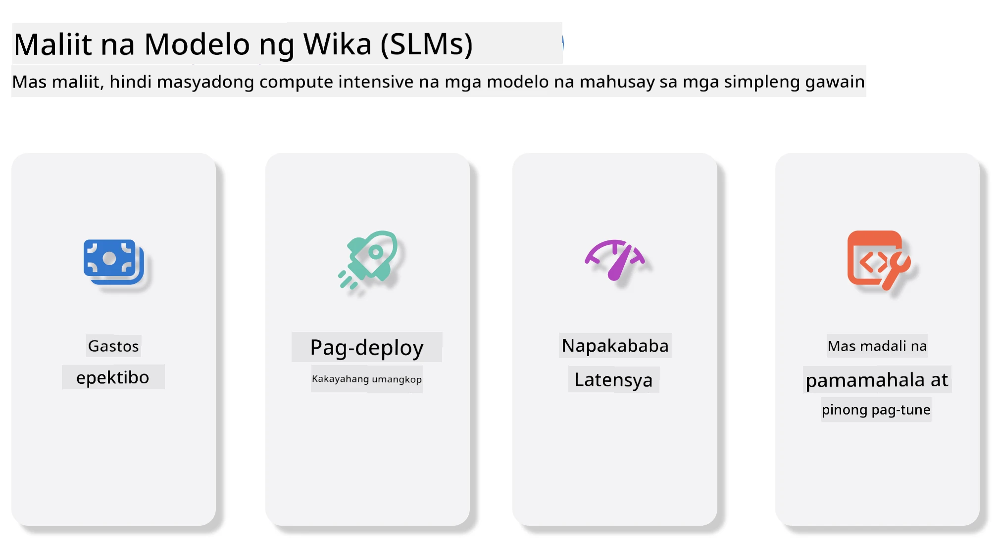
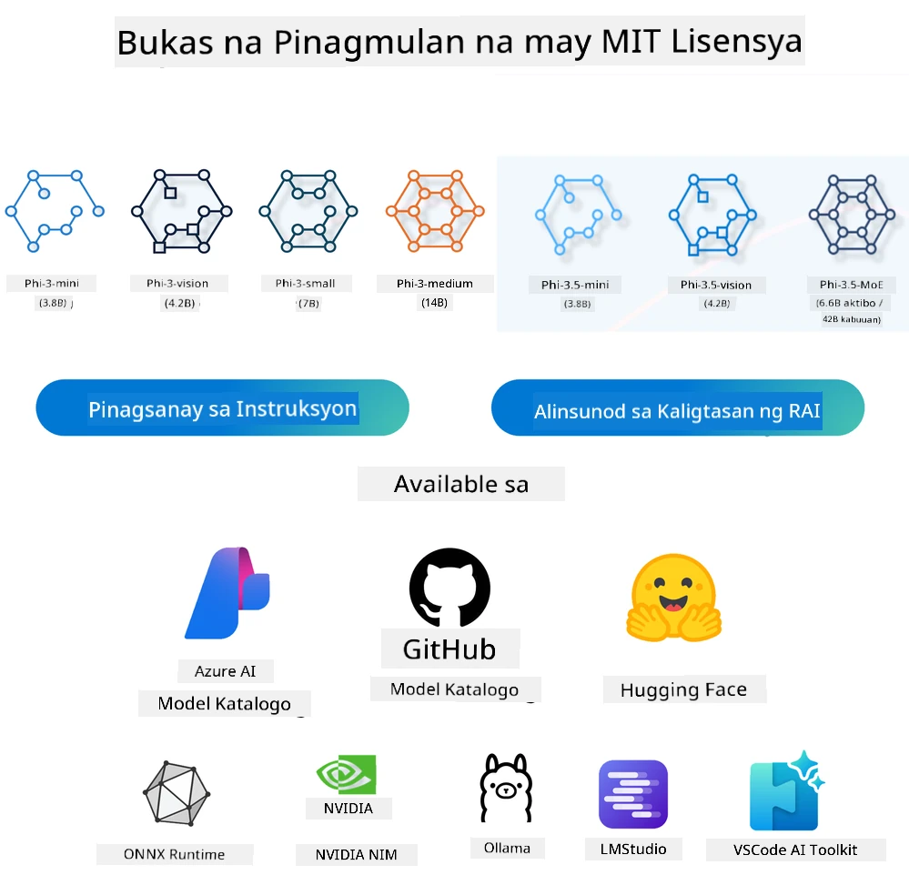
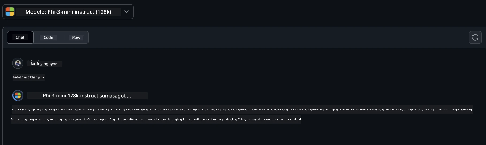
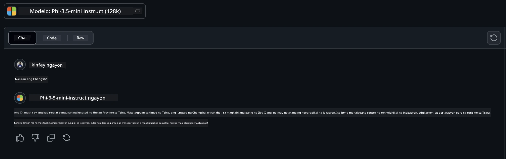

# Panimula sa Maliit na mga Modelo ng Wika para sa Generative AI para sa mga Baguhan  
Ang Generative AI ay isang kawili-wiling larangan ng artipisyal na intelihensiya na nakatuon sa paglikha ng mga sistema na may kakayahang bumuo ng bagong nilalaman. Ang nilalamang ito ay maaaring mula sa teksto at mga larawan hanggang sa musika at maging sa buong virtual na mga kapaligiran. Isa sa mga pinaka-kapana-panabik na aplikasyon ng generative AI ay sa larangan ng mga modelo ng wika.

## Ano ang Maliit na mga Modelo ng Wika?

Ang Maliit na Modelo ng Wika (SLM) ay kumakatawan sa isang pinaikling bersyon ng isang malaking modelo ng wika (LLM), na ginagamit ang maraming prinsipyo at teknikal na pamamaraan ng LLMs, habang nagpapakita ng makabuluhang mas maliit na gamit sa kompyutasyon.

Ang mga SLM ay subset ng mga modelo ng wika na dinisenyo upang makabuo ng tekstong kahawig ng tao. Hindi tulad ng kanilang mas malalaking katumbas, tulad ng GPT-4, ang mga SLM ay mas compact at episyente, na ginagawa silang angkop para sa mga aplikasyon kung saan limitado ang mga computational resources. Sa kabila ng kanilang mas maliit na sukat, maaari pa rin silang magsagawa ng iba't ibang mga gawain. Karaniwan, ang mga SLM ay binubuo sa pamamagitan ng pag-compress o pag-distill ng mga LLM, na naglalayong mapanatili ang malaking bahagi ng orihinal na kakayahan ng modelo at mga kasanayan sa lingguwistika. Ang pagbawas sa laki ng modelo ay nagpapababa ng kabuuang komplikasyon, na ginagawang mas episyente ang mga SLM sa paggamit ng memorya at kinakailangang kapangyarihan sa kompyutasyon. Sa kabila ng mga optimisasyong ito, ang mga SLM ay maaari pa ring magsagawa ng malawak na hanay ng mga gawain sa natural na pagproseso ng wika (NLP):

- Paggawa ng Teksto: Paglikha ng magkakaugnay at kontekstwal na angkop na mga pangungusap o talata.  
- Pagkumpleto ng Teksto: Paghula at pagkompleto ng mga pangungusap base sa ibinigay na prompt.  
- Pagsasalin: Paglilipat ng teksto mula sa isang wika patungo sa iba.  
- Pagbubuod: Pagpapaikli ng mahahabang teksto sa mas maikli at mas madaling intindihin na mga buod.

Bagamat may ilang kompromiso sa pagganap o lalim ng pag-unawa kumpara sa malalaking mga katumbas.

## Paano Gumagana ang Maliit na mga Modelo ng Wika?  
Ang mga SLM ay sinasanay gamit ang napakaraming datos ng teksto. Sa panahon ng pagsasanay, natututuhan nila ang mga pattern at istruktura ng wika, na nagpapahintulot sa kanila na bumuo ng tekstong gramatikal na tama at kontekstwal na angkop. Kasama sa proseso ng pagsasanay ang:

- Koleksyon ng Datos: Pangangalap ng malalaking dataset ng teksto mula sa iba't ibang pinagmulan.  
- Preprocessing: Paglilinis at pag-oorganisa ng datos upang maging angkop para sa pagsasanay.  
- Pagsasanay: Paggamit ng mga algorithm sa machine learning para turuan ang modelo kung paano unawain at bumuo ng teksto.  
- Fine-tuning: Pagsasaayos ng modelo upang mapabuti ang pagganap nito sa mga partikular na gawain.

Ang pagbuo ng mga SLM ay nakaayon sa lumalaking pangangailangan para sa mga modelong maaring i-deploy sa mga kapaligirang may limitadong resources, gaya ng mga mobile devices o mga edge computing platform, kung saan ang buong-sukat na LLMs ay maaaring hindi praktikal dahil sa matitinding pangangailangan sa resources. Sa pagtuon sa episyensya, pinipili ng mga SLM ang balanse sa pagitan ng pagganap at access, na nagpapahintulot ng mas malawak na aplikasyon sa iba't ibang larangan.



## Mga Layunin sa Pagkatuto

Sa leksyon na ito, inaasahan naming ipakilala ang kaalaman tungkol sa SLM at pagsamahin ito sa Microsoft Phi-3 upang matutunan ang iba't ibang senaryo sa nilalaman ng teksto, paningin, at MoE.

Sa pagtatapos ng leksyon, dapat mong masagot ang mga sumusunod na tanong:

- Ano ang SLM?  
- Ano ang pagkakaiba ng SLM at LLM?  
- Ano ang Microsoft Phi-3/3.5 Family?  
- Paano magpatakbo ng inference gamit ang Microsoft Phi-3/3.5 Family?

Handa ka na ba? Magsimula na tayo.

## Ang Pagkakaiba ng Malalaking Modelo ng Wika (LLMs) at Maliit na Modelo ng Wika (SLMs)

Ang parehong LLMs at SLMs ay itinayo sa mga pundamental na prinsipyo ng probabilistic machine learning, sumusunod sa magkatulad na mga pamamaraan sa arkitekturang disenyo, metodolohiya ng pagsasanay, proseso ng pagbuo ng datos, at mga teknik sa pag-evaluate ng modelo. Subalit, may ilang mahahalagang pagkakaiba na naghihiwalay sa dalawang uri ng modelong ito.

## Mga Aplikasyon ng Maliit na mga Modelo ng Wika

Malawak ang aplikasyon ng mga SLM, kabilang ang:

- Chatbots: Pagbibigay ng suporta sa kostumer at pakikipag-ugnayan sa mga gumagamit sa paraan ng pag-uusap.  
- Paglikha ng Nilalaman: Tulong sa mga manunulat sa pagbuo ng mga ideya o kahit buong mga artikulo.  
- Edukasyon: Pagtulong sa mga estudyante sa mga takdang pagsusulat o pag-aaral ng bagong mga wika.  
- Accessibility: Paglikha ng mga kagamitan para sa mga indibidwal na may kapansanan, tulad ng mga sistema ng text-to-speech.

**Laki**

Isang pangunahing pagkakaiba ng LLMs at SLMs ay nasa sukat ng mga modelo. Ang LLMs, tulad ng ChatGPT (GPT-4), ay maaaring magkaroon ng tinatayang 1.76 trilyong parameters, habang ang open-source na mga SLM tulad ng Mistral 7B ay dinisenyo na may mas kakaunting parameters—humigit-kumulang 7 bilyon. Ang pagkakaibang ito ay pangunahing dahilan ng kaibahan sa arkitektura at proseso ng pagsasanay ng modelo. Halimbawa, gumagamit ang ChatGPT ng self-attention mechanism sa loob ng encoder-decoder na framework, samantalang ang Mistral 7B ay gumagamit ng sliding window attention, na nagpapahintulot sa mas episyenteng pagsasanay sa loob ng decoder-only na modelo. Ang kaibahan sa arkitekturang ito ay may malalim na epekto sa komplikasyon at pagganap ng mga modelong ito.

**Pag-unawa**

Ang mga SLM ay karaniwang na-optimize para sa pagganap sa partikular na mga domain, na ginagawa silang mas espesyalisado ngunit potensyal na limitado sa kakayahang magbigay ng malawak na kontekstong pag-unawa sa iba’t ibang larangan ng kaalaman. Sa kabilang banda, ang mga LLM ay naglalayong gayahin ang katalinuhan ng tao sa mas malawak na antas. Sinaanay sa malalaki at magkakaibang dataset, ang mga LLM ay disenyo upang magbigay ng mataas na pagganap sa iba't ibang domain, na nag-aalok ng mas malaking versatility at adaptability. Dahil dito, ang mga LLM ay mas angkop para sa mas malawak na hanay ng mga downstream na gawain, tulad ng natural na pagproseso ng wika at programming.

**Kompyutasyon**

Ang pagsasanay at pag-deploy ng mga LLM ay nangangailangan ng malalaking resources, madalas nangangailangan ng malawakang kompiyuter o GPU clusters. Halimbawa, ang pagsasanay ng modelong tulad ng ChatGPT mula sa simula ay maaaring mangailangan ng libu-libong GPU sa mahabang panahon. Sa kabilang dako, ang mga SLM, dahil sa mas maliit na bilang ng mga parameter, ay mas madaling ma-access sa pananaw ng computational resources. Ang mga modelong tulad ng Mistral 7B ay maaari nang sanayin at patakbuhin sa mga lokal na makina na may katamtamang GPU kakayahan, bagaman ang pagsasanay ay nangangailangan pa rin ng ilang oras sa maraming GPU.

**Pagkiling (Bias)**

Ang bias ay kilalang isyu sa mga LLM, pangunahing dahil sa likas ng data ng pagsasanay. Kadalasang umaasa ang mga modelong ito sa raw, bukas na datos mula sa internet, na maaaring kulang o maling nagrerepresenta ng ilang mga grupo, naglalaman ng maling label, o nagpapakita ng lingguwistikong bias na dulot ng dialekto, heograpikal na pagkakaiba, at mga patakaran sa gramatika. Bukod pa rito, ang komplikado ng arkitektura ng LLM ay maaaring hindi sinasadyang magpalala ng bias, na maaaring hindi mapansin nang walang maingat na fine-tuning. Sa kabilang banda, ang mga SLM na sinasanay sa mas kontrolado at domain-specific na mga dataset ay likas na mas hindi gaanong apektado ng ganitong mga bias, bagaman hindi sila ganap na immune dito.

**Inference**

Ang mas maliit na sukat ng mga SLM ay nagbibigay sa kanila ng malaking bentaha sa bilis ng inference, na nagpapahintulot sa mabilis na pagbuo ng output sa lokal na hardware nang hindi nangangailangan ng malawakang parallel processing. Samantalang ang LLM, dahil sa kanilang laki at komplikasyon, ay madalas na nangangailangan ng malalaking parallel computational resources upang makamit ang katanggap-tanggap na mga oras ng inference. Ang presensya ng maraming sabay-sabay na gumagamit ay lalo pang nagpapabagal sa reaksyon ng LLM, lalo na kapag ginagamit sa malawakang scale.

Sa kabuuan, habang ang parehong LLM at SLM ay may pundamental na base sa machine learning, malaki ang kanilang pagkakaiba sa laki ng modelo, pangangailangan sa resources, kontekstwal na pag-unawa, pagiging sensitibo sa bias, at bilis ng inference. Ang mga pagkakaibang ito ay nagrereplekta ng kanilang angkop na paggamit sa iba’t ibang kaso, kung saan ang LLM ay mas versatile ngunit mabigat sa resources, at ang SLM ay nag-aalok ng mas espesipikong episyensya sa domain na may mas mababang pangangailangan sa kompyutasyon.

***Tandaan: Sa leksyon na ito, ipakikilala namin ang SLM gamit ang Microsoft Phi-3 / 3.5 bilang halimbawa.***

## Ipakilala ang Phi-3 / Phi-3.5 Family

Ang Phi-3 / 3.5 Family ay pangunahing nakatuon sa mga aplikasyon sa teksto, paningin, at Agent (MoE):

### Phi-3 / 3.5 Instruct

Pangunahing para sa paggawa ng teksto, kumpletong chat, at pagkuha ng impormasyon mula sa nilalaman, atbp.

**Phi-3-mini**

Ang 3.8B na modelo ng wika ay available sa Microsoft Azure AI Studio, Hugging Face, at Ollama. Ang mga Phi-3 model ay malaki ang nalalampasan na performance laban sa mga modelo ng pantay o mas malaki ang sukat sa mga pangunahing benchmark (tingnan ang benchmark na numero sa ibaba, mas mataas ang mas maganda). Ang Phi-3-mini ay lumalampas sa mga modelong doble ang laki nito, samantalang ang Phi-3-small at Phi-3-medium ay lumalampas sa mas malalaking modelo, kabilang ang GPT-3.5.

**Phi-3-small at medium**

Sa 7B parameters lang, pinapalampas ng Phi-3-small ang GPT-3.5T sa iba't ibang benchmark sa wika, pangangatwiran, coding, at matematika.  

Ang Phi-3-medium na may 14B parameters ay nagpapatuloy sa trend na ito at lumalampas sa Gemini 1.0 Pro.

**Phi-3.5-mini**

Maari natin itong iisipin bilang upgrade ng Phi-3-mini. Bagaman nananatili ang bilang ng parameters, pinapalakas nito ang kakayahan upang suportahan ang maraming wika (sumusuporta sa higit sa 20 wika: Arabic, Chinese, Czech, Danish, Dutch, English, Finnish, French, German, Hebrew, Hungarian, Italian, Japanese, Korean, Norwegian, Polish, Portuguese, Russian, Spanish, Swedish, Thai, Turkish, Ukrainian) at nagpapalakas ng suporta para sa mahabang konteksto.

Ang Phi-3.5-mini na may 3.8B parameters ay lumalampas sa mga modelo ng parehong laki at kapantay ng mga modelo na doble ang laki.

### Phi-3 / 3.5 Vision

Maari nating isipin ang Instruct model ng Phi-3/3.5 bilang kakayahan ng Phi sa pag-unawa, at ang Vision naman ang nagbibigay kay Phi ng mga mata para maunawaan ang mundo.

**Phi-3-Vision**

Ang Phi-3-vision, na may 4.2B parameters lang, ay nagpapatuloy sa trend na ito at lumalampas sa mas malalaking modelo gaya ng Claude-3 Haiku at Gemini 1.0 Pro V sa mga pangkalahatang gawain sa visual reasoning, OCR, at pag-unawa sa mga table at diagram.

**Phi-3.5-Vision**

Ang Phi-3.5-Vision ay upgrade ng Phi-3-Vision, na nagdadagdag ng suporta para sa maraming larawan. Maaari mo itong isipin bilang pagpapabuti sa vision, hindi lang nakikita ang mga larawan kundi pati mga video rin.

Ang Phi-3.5-vision ay lumalampas sa mas malalaking modelo gaya ng Claude-3.5 Sonnet at Gemini 1.5 Flash sa OCR, pag-unawa sa mga table at chart, at kapantay nila sa pangkalahatang visual knowledge reasoning. Sinusuportahan ang multi-frame input, ibig sabihin, gumagawa ng pangangatwiran sa maraming input na larawan.

### Phi-3.5-MoE

***Mixture of Experts (MoE)*** ay nagpapahintulot sa mga modelo na ma-pretrain gamit ang mas kaunting compute, na nangangahulugan na maaari mong malaki ang scale ng modelo o laki ng dataset gamit ang parehong compute budget bilang isang dense na modelo. Sa partikular, ang isang MoE model ay dapat makamit ang parehong kalidad tulad ng dense counterpart nito nang mas mabilis sa panahon ng pretraining.

Ang Phi-3.5-MoE ay binubuo ng 16x3.8B expert modules. Ang Phi-3.5-MoE na may 6.6B active parameters lang ay nakakamit ng katulad na antas ng pangangatwiran, pag-unawa sa wika, at matematika tulad ng mas malalaking mga modelo.

Maaari nating gamitin ang Phi-3/3.5 Family na modelo base sa iba't ibang mga senaryo. Hindi tulad ng LLM, maaari mong i-deploy ang Phi-3/3.5-mini o Phi-3/3.5-Vision sa mga edge device.

## Paano Gamitin ang mga Modelo ng Phi-3/3.5 Family

Nais naming gamitin ang Phi-3/3.5 sa iba't ibang mga senaryo. Susunod, gagamitin natin ang Phi-3/3.5 base sa iba't ibang mga senaryo.



### Inference sa pamamagitan ng Cloud APIs

**GitHub Models**

Ang GitHub Models ang pinaka-direktang paraan. Maaari mong mabilis na ma-access ang Phi-3/3.5-Instruct model sa pamamagitan ng GitHub Models. Kasama ang Azure AI Inference SDK / OpenAI SDK, maari mong ma-access ang API gamit ang code upang makumpleto ang tawag sa Phi-3/3.5-Instruct. Maaari ka ring magsubok ng iba't ibang mga epekto gamit ang Playground.

- Demo: Paghahambing ng mga epekto ng Phi-3-mini at Phi-3.5-mini sa mga senaryo sa Chinese





**Azure AI Studio**

O kung nais mong gamitin ang vision at MoE na mga modelo, maaari mong gamitin ang Azure AI Studio upang makumpleto ang tawag. Kung interesado ka, maaari mong basahin ang Phi-3 Cookbook upang matutunan kung paano tawagin ang Phi-3/3.5 Instruct, Vision, MoE gamit ang Azure AI Studio [I-click ang link na ito](https://github.com/microsoft/Phi-3CookBook/blob/main/md/02.QuickStart/AzureAIStudio_QuickStart.md?WT.mc_id=academic-105485-koreyst)

**NVIDIA NIM**

Bukod sa cloud-based Model Catalog solutions na iniaalok ng Azure at GitHub, maaari mo ring gamitin ang [NVIDIA NIM](https://developer.nvidia.com/nim?WT.mc_id=academic-105485-koreyst) upang makumpleto ang mga kaugnay na tawag. Maaari mong bisitahin ang NVIDIA NIM upang gawin ang API calls para sa Phi-3/3.5 Family. Ang NVIDIA NIM (NVIDIA Inference Microservices) ay isang set ng mga pinabilis na inference microservices na idinisenyo upang tulungan ang mga developer na mabilis na i-deploy ang AI models sa iba't ibang mga kapaligiran, kabilang ang mga cloud, data centers, at workstations.

Narito ang ilang mga pangunahing tampok ng NVIDIA NIM:
- **Daliang I-deploy:** Pinapayagan ng NIM ang deployment ng mga AI model gamit ang isang command lamang, ginagawa itong madali upang isama sa mga umiiral na workflows.
- **Optimizadong Performance:** Ginagamit nito ang pre-optimized inference engines ng NVIDIA, tulad ng TensorRT at TensorRT-LLM, upang matiyak ang mababang latency at mataas na throughput.
- **Scalability:** Sinusuportahan ng NIM ang autoscaling sa Kubernetes, na nagpapahintulot na epektibong mahawakan ang iba't ibang workload.
- **Seguridad at Kontrol:** Maaaring mapanatili ng mga organisasyon ang kontrol sa kanilang data at aplikasyon sa pamamagitan ng self-hosting ng NIM microservices sa kanilang sariling managed infrastructure.
- **Standard na APIs:** Nagbibigay ang NIM ng industry-standard APIs, na nagpapadali sa paggawa at pag-integrate ng mga AI application tulad ng chatbots, AI assistants, at marami pang iba.

Ang NIM ay bahagi ng NVIDIA AI Enterprise, na nilalayon na gawing simple ang deployment at operationalization ng mga AI model, na tinitiyak na magpapatakbo ang mga ito nang mahusay sa NVIDIA GPUs.

- Demo: Paggamit ng NVIDIA NIM upang tawagan ang Phi-3.5-Vision-API  [[I-click ang link na ito](./python/Phi-3-Vision-Nividia-NIM.ipynb?WT.mc_id=academic-105485-koreyst)]


### Pagpapatakbo ng Phi-3/3.5 Nang Lokal
Ang inference kaugnay ng Phi-3, o anumang language model tulad ng GPT-3, ay tumutukoy sa proseso ng paglikha ng mga tugon o prediksyon batay sa input na natatanggap nito. Kapag nagbigay ka ng prompt o tanong sa Phi-3, ginagamit nito ang kanyang sinanay na neural network upang hulaan ang pinaka-malamang at kaugnay na tugon sa pamamagitan ng pag-aanalisa ng mga pattern at relasyon sa data kung saan ito sinanay.

**Hugging Face Transformer**  
Ang Hugging Face Transformers ay isang makapangyarihang library na dinisenyo para sa natural language processing (NLP) at iba pang machine learning na gawain. Narito ang ilang mahahalagang punto tungkol dito:

1. **Mga Pretrained na Modelo**: Nagbibigay ito ng libu-libong pretrained models na maaaring gamitin para sa iba't ibang gawain tulad ng text classification, named entity recognition, question answering, summarization, translation, at text generation.

2. **Interoperability ng Frameworks**: Sinusuportahan ng library ang maraming deep learning frameworks, kabilang ang PyTorch, TensorFlow, at JAX. Pinapayagan ka nitong mag-train ng modelo sa isang framework at gamitin ito sa iba.

3. **Multimodal na Kakayahan**: Bukod sa NLP, sinusuportahan rin ng Hugging Face Transformers ang mga gawain sa computer vision (hal., image classification, object detection) at audio processing (hal., speech recognition, audio classification).

4. **Kadalian ng Paggamit**: Nagbibigay ang library ng APIs at mga tool upang madaling ma-download at ma-fine tune ang mga modelo, kaya madaling ma-access ng mga baguhan at eksperto.

5. **Komunidad at Mga Resources**: May masiglang komunidad ang Hugging Face at malawak na dokumentasyon, mga tutorial, at mga gabay upang tulungan ang mga gumagamit na magsimula at magamit nang husto ang library.  
[opisyal na dokumentasyon](https://huggingface.co/docs/transformers/index?WT.mc_id=academic-105485-koreyst) o ang kanilang [GitHub repository](https://github.com/huggingface/transformers?WT.mc_id=academic-105485-koreyst).

Ito ang pinaka-karaniwang ginagamit na paraan, ngunit nangangailangan din ito ng GPU acceleration. Sa katunayan, ang mga scenario tulad ng Vision at MoE ay nangangailangan ng maraming kalkulasyon, na magiging mabagal sa CPU kung hindi ito na-quantize.

- Demo: Paggamit ng Transformer upang tawagan ang Phi-3.5-Instruct [I-click ang link na ito](./python/phi35-instruct-demo.ipynb?WT.mc_id=academic-105485-koreyst)

- Demo: Paggamit ng Transformer upang tawagan ang Phi-3.5-Vision [I-click ang link na ito](./python/phi35-vision-demo.ipynb?WT.mc_id=academic-105485-koreyst)

- Demo: Paggamit ng Transformer upang tawagan ang Phi-3.5-MoE [I-click ang link na ito](./python/phi35_moe_demo.ipynb?WT.mc_id=academic-105485-koreyst)

**Ollama**  
[Ollama](https://ollama.com/?WT.mc_id=academic-105485-koreyst) ay isang platform na idinisenyo upang gawing mas madali ang pagpapatakbo ng malalaking language models (LLMs) nang lokal sa iyong makina. Sinusuportahan nito ang iba't ibang modelo tulad ng Llama 3.1, Phi 3, Mistral, at Gemma 2, at iba pa. Pinapasimple ng platform ang proseso sa pamamagitan ng pagsasama-sama ng mga timbang ng modelo, configuration, at data sa isang package, na nagpapadali sa mga gumagamit na i-customize at lumikha ng kanilang sariling mga modelo. Magagamit ang Ollama para sa macOS, Linux, at Windows. Isang maganda itong kasangkapan kung nais mong mag-eksperimento o mag-deploy ng LLM nang hindi umaasa sa cloud services. Ang Ollama ang pinaka-direktang paraan, kailangan mo lang patakbuhin ang sumusunod na command.

```bash

ollama run phi3.5

```


**ONNX Runtime para sa GenAI**

[ONNX Runtime](https://github.com/microsoft/onnxruntime-genai?WT.mc_id=academic-105485-koreyst) ay isang cross-platform inference at training machine-learning accelerator. Ang ONNX Runtime para sa Generative AI (GENAI) ay isang makapangyarihang kasangkapan na tumutulong sa iyo na magpatakbo ng mga generative AI model nang mahusay sa iba't ibang platform. 

## Ano ang ONNX Runtime?  
Ang ONNX Runtime ay isang open-source na proyekto na nagpapagana ng high-performance inference ng machine learning models. Sinusuportahan nito ang mga modelo sa Open Neural Network Exchange (ONNX) format, na isang pamantayan para sa representasyon ng machine learning models. Ang ONNX Runtime inference ay makapagbibigay ng mas mabilis na karanasan para sa customer at mas mababang gastos, sinusuportahan ang mga modelo mula sa mga deep learning frameworks tulad ng PyTorch at TensorFlow/Keras pati na rin ang mga klasikong machine learning libraries tulad ng scikit-learn, LightGBM, XGBoost, at iba pa. Compatible ang ONNX Runtime sa iba't ibang hardware, drivers, at operating systems, at nagbibigay ng optimal performance sa pamamagitan ng paggamit ng hardware accelerators kapag naaangkop kasabay ng graph optimizations at transforms.

## Ano ang Generative AI?  
Ang Generative AI ay tumutukoy sa mga AI system na kayang gumawa ng bagong nilalaman, gaya ng teksto, mga imahe, o musika, batay sa data na kanilang sinanay. Mga halimbawa nito ay mga language models tulad ng GPT-3 at mga image generation models tulad ng Stable Diffusion. Nagbibigay ang ONNX Runtime para sa GenAI library ng generative AI loop para sa ONNX models, kabilang ang inference gamit ang ONNX Runtime, logits processing, search at sampling, at KV cache management.

## ONNX Runtime para sa GENAI  
Pinalalawak ng ONNX Runtime para sa GENAI ang kakayahan ng ONNX Runtime para suportahan ang mga generative AI models. Narito ang ilang mga pangunahing katangian:

- **Malawak na Suporta sa Platform:** Gumagana ito sa iba't ibang platform, kabilang ang Windows, Linux, macOS, Android, at iOS.
- **Suporta sa Modelo:** Sinusuportahan nito ang maraming sikat na generative AI models, gaya ng LLaMA, GPT-Neo, BLOOM, at iba pa.
- **Optimizasyon sa Performance:** May mga optimizations ito para sa iba't ibang hardware accelerators tulad ng NVIDIA GPUs, AMD GPUs, at iba pa.
- **Kadalian ng Paggamit:** Nagbibigay ito ng mga API para sa madaling integrasyon sa mga aplikasyon, na nagpapahintulot sa iyo na gumawa ng teksto, mga imahe, at iba pang nilalaman gamit ang kakaunting code.
- Maaaring tawagan ng mga user ang mataas na antas na generate() method, o paganahin ang bawat pag-ikot ng modelo sa isang loop, na gumagawa ng isang token sa isang pagkakataon, at opsyonal na ina-update ang mga parameter ng generation sa loob ng loop.
- Sinusuportahan din ng ONNX runtime ang greedy/beam search at TopP, TopK sampling upang gumawa ng mga token sequence at built-in na logits processing tulad ng repetition penalties. Madali ka ring makakapagdagdag ng custom na scoring.

## Paano Magsimula  
Upang makapagsimula sa ONNX Runtime para sa GENAI, maaari mong sundan ang mga hakbang na ito:

### Mag-install ng ONNX Runtime:  
```Python
pip install onnxruntime
```
  
### Mag-install ng Generative AI Extensions:  
```Python
pip install onnxruntime-genai
```
  
### Patakbuhin ang Modelo: Narito ang simpleng halimbawa sa Python:  
```Python
import onnxruntime_genai as og

model = og.Model('path_to_your_model.onnx')

tokenizer = og.Tokenizer(model)

input_text = "Hello, how are you?"

input_tokens = tokenizer.encode(input_text)

output_tokens = model.generate(input_tokens)

output_text = tokenizer.decode(output_tokens)

print(output_text) 
```
  
### Demo:Paggamit ng ONNX Runtime GenAI upang tawagan ang Phi-3.5-Vision  


```python

import onnxruntime_genai as og

model_path = './Your Phi-3.5-vision-instruct ONNX Path'

img_path = './Your Image Path'

model = og.Model(model_path)

processor = model.create_multimodal_processor()

tokenizer_stream = processor.create_stream()

text = "Your Prompt"

prompt = "<|user|>\n"

prompt += "<|image_1|>\n"

prompt += f"{text}<|end|>\n"

prompt += "<|assistant|>\n"

image = og.Images.open(img_path)

inputs = processor(prompt, images=image)

params = og.GeneratorParams(model)

params.set_inputs(inputs)

params.set_search_options(max_length=3072)

generator = og.Generator(model, params)

while not generator.is_done():

    generator.compute_logits()
    
    generator.generate_next_token()

    new_token = generator.get_next_tokens()[0]
    
    output = tokenizer_stream.decode(new_token)
    
    print(tokenizer_stream.decode(new_token), end='', flush=True)

```


**Iba Pa**  

Bukod sa mga reference method ng ONNX Runtime at Ollama, maaari rin nating kumpletuhin ang mga reference ng quantitative models batay sa mga reference method ng modelo na ibinibigay ng iba't ibang manufacturer. Gaya ng Apple MLX framework na may Apple Metal, Qualcomm QNN na may NPU, Intel OpenVINO na may CPU/GPU, atbp. Maaari ka ring makakuha ng higit pang nilalaman mula sa [Phi-3 Cookbook](https://github.com/microsoft/phi-3cookbook?WT.mc_id=academic-105485-koreyst)


## Higit Pa  

Natutunan na natin ang mga batayan ng Phi-3/3.5 Family, ngunit upang matuto pa tungkol sa SLM kailangan natin ng mas malalim na kaalaman. Makakahanap ka ng mga sagot sa Phi-3 Cookbook. Kung nais mong matuto pa, bisitahin ang [Phi-3 Cookbook](https://github.com/microsoft/phi-3cookbook?WT.mc_id=academic-105485-koreyst).

---

<!-- CO-OP TRANSLATOR DISCLAIMER START -->
**Paunawa**:
Ang dokumentong ito ay isinalin gamit ang AI na serbisyo sa pagsasalin na [Co-op Translator](https://github.com/Azure/co-op-translator). Bagamat nagsusumikap kami para sa katumpakan, pakatandaan na ang awtomatikong pagsasalin ay maaaring maglaman ng mga pagkakamali o hindi pagkakatugma. Ang orihinal na dokumento sa kanyang sariling wika ang dapat ituring na opisyal na sanggunian. Para sa mahahalagang impormasyon, inirerekomenda ang pagsasalin ng isang propesyonal na tagasalin na tao. Hindi kami mananagot sa anumang maling pagkaunawa o maling interpretasyon na nagmumula sa paggamit ng pagsasaling ito.
<!-- CO-OP TRANSLATOR DISCLAIMER END -->