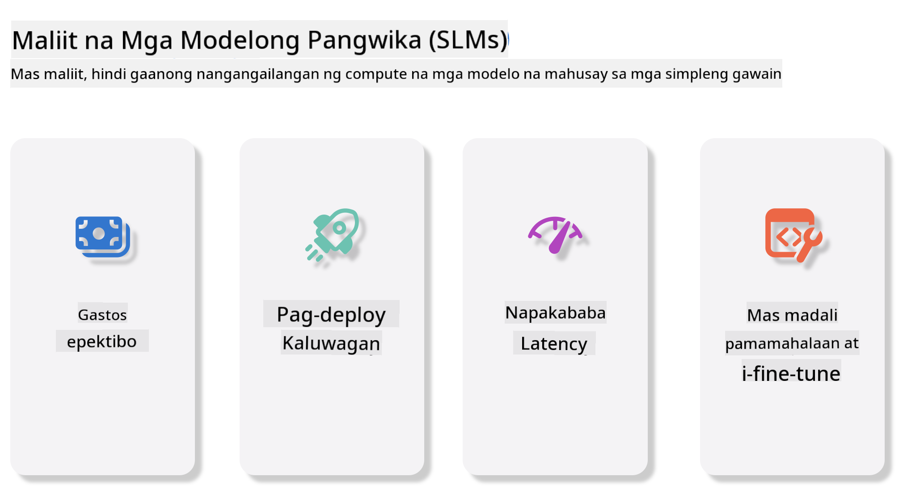
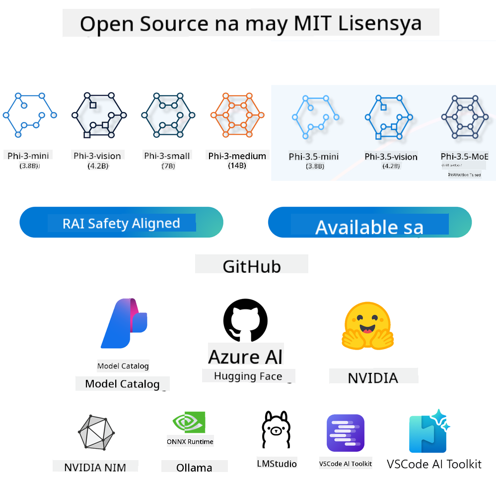

<!--
CO_OP_TRANSLATOR_METADATA:
{
  "original_hash": "124ad36cfe96f74038811b6e2bb93e9d",
  "translation_date": "2025-07-09T18:43:00+00:00",
  "source_file": "19-slm/README.md",
  "language_code": "tl"
}
-->
# Panimula sa Maliit na Language Models para sa Generative AI para sa mga Baguhan
Ang Generative AI ay isang kahanga-hangang larangan ng artificial intelligence na nakatuon sa paglikha ng mga sistema na kayang bumuo ng bagong nilalaman. Ang nilalamang ito ay maaaring mula sa teksto at mga larawan hanggang sa musika at maging buong virtual na kapaligiran. Isa sa mga pinaka-kapana-panabik na aplikasyon ng generative AI ay sa larangan ng mga language model.

## Ano ang Maliit na Language Models?

Ang Maliit na Language Model (SLM) ay isang pinaikling bersyon ng malaking language model (LLM), na gumagamit ng maraming prinsipyo at teknik ng LLM, ngunit may mas maliit na pangangailangan sa computing.

Ang SLM ay isang uri ng language model na idinisenyo upang makabuo ng teksto na parang tao ang nagsulat. Hindi tulad ng mas malalaking modelo tulad ng GPT-4, ang SLM ay mas compact at mas episyente, kaya't mainam ito para sa mga aplikasyon kung saan limitado ang mga computational resources. Sa kabila ng mas maliit na sukat, kaya pa rin nitong magsagawa ng iba't ibang gawain. Karaniwan, ang SLM ay ginagawa sa pamamagitan ng pag-compress o pag-distill ng LLM, na layuning mapanatili ang malaking bahagi ng orihinal na kakayahan at kasanayan sa wika ng modelo. Ang pagbawas sa laki ng modelo ay nagpapababa ng kabuuang komplikasyon, kaya mas episyente ang SLM sa paggamit ng memorya at computational na pangangailangan. Sa kabila ng mga optimisasyong ito, kaya pa rin ng SLM na magsagawa ng malawak na hanay ng mga gawain sa natural language processing (NLP):

- Pagbuo ng Teksto: Paglikha ng mga pangungusap o talata na magkakaugnay at angkop sa konteksto.
- Pagkumpleto ng Teksto: Pagtataya at pagkompleto ng mga pangungusap base sa ibinigay na prompt.
- Pagsasalin: Paglilipat ng teksto mula sa isang wika patungo sa iba.
- Pagbubuod: Pagpapaikli ng mahahabang teksto upang maging mas madaling maintindihan.

Bagaman may ilang kompromiso sa performance o lalim ng pag-unawa kumpara sa mas malalaking modelo.

## Paano Gumagana ang Maliit na Language Models?
Ang SLM ay sinasanay gamit ang malalaking dami ng tekstong datos. Sa panahon ng pagsasanay, natututuhan nito ang mga pattern at estruktura ng wika, kaya nakakabuo ito ng teksto na tama ang gramatika at angkop sa konteksto. Ang proseso ng pagsasanay ay kinabibilangan ng:

- Pangangalap ng Datos: Pagkuha ng malalaking dataset ng teksto mula sa iba't ibang pinagmulan.
- Preprocessing: Paglilinis at pag-aayos ng datos upang maging angkop sa pagsasanay.
- Pagsasanay: Paggamit ng mga algorithm ng machine learning upang turuan ang modelo kung paano intindihin at bumuo ng teksto.
- Fine-Tuning: Pag-aayos ng modelo upang mapabuti ang performance nito sa mga partikular na gawain.

Ang pagbuo ng SLM ay tugma sa lumalaking pangangailangan para sa mga modelong maaaring gamitin sa mga kapaligirang may limitadong resources, tulad ng mga mobile device o edge computing platforms, kung saan ang full-scale na LLM ay maaaring hindi praktikal dahil sa mataas na pangangailangan sa resources. Sa pagtutok sa episyensya, pinagsasama ng SLM ang performance at accessibility, na nagpapahintulot ng mas malawak na aplikasyon sa iba't ibang larangan.



## Mga Layunin sa Pagkatuto

Sa araling ito, layunin naming ipakilala ang kaalaman tungkol sa SLM at pagsamahin ito sa Microsoft Phi-3 upang matutunan ang iba't ibang senaryo sa teksto, bisyon, at MoE.

Sa pagtatapos ng araling ito, dapat mong masagot ang mga sumusunod na tanong:

- Ano ang SLM
- Ano ang pagkakaiba ng SLM at LLM
- Ano ang Microsoft Phi-3/3.5 Family
- Paano mag-inference gamit ang Microsoft Phi-3/3.5 Family

Handa ka na ba? Magsimula na tayo.

## Mga Pagkakaiba ng Malalaking Language Models (LLMs) at Maliit na Language Models (SLMs)

Parehong nakabatay ang LLM at SLM sa mga pangunahing prinsipyo ng probabilistic machine learning, sumusunod sa magkatulad na diskarte sa disenyo ng arkitektura, metodolohiya ng pagsasanay, proseso ng pagbuo ng datos, at mga teknik sa pagsusuri ng modelo. Gayunpaman, may ilang mahahalagang pagkakaiba sa pagitan ng dalawang uri ng modelo.

## Mga Aplikasyon ng Maliit na Language Models

Malawak ang gamit ng SLM, kabilang ang:

- Chatbots: Nagbibigay ng suporta sa customer at nakikipag-usap sa mga gumagamit sa isang conversational na paraan.
- Paglikha ng Nilalaman: Tinutulungan ang mga manunulat sa pagbuo ng mga ideya o kahit sa pag-draft ng buong artikulo.
- Edukasyon: Tinutulungan ang mga estudyante sa pagsusulat ng mga takdang-aralin o pag-aaral ng bagong wika.
- Accessibility: Gumagawa ng mga kasangkapan para sa mga taong may kapansanan, tulad ng mga text-to-speech system.

**Laki**

Isang pangunahing pagkakaiba ng LLM at SLM ay ang laki ng mga modelo. Ang LLM tulad ng ChatGPT (GPT-4) ay maaaring magkaroon ng tinatayang 1.76 trilyong parameters, samantalang ang mga open-source na SLM tulad ng Mistral 7B ay may mas kaunting parameters—mga 7 bilyon lamang. Ang pagkakaibang ito ay dahil sa mga pagkakaiba sa arkitektura at proseso ng pagsasanay. Halimbawa, gumagamit ang ChatGPT ng self-attention mechanism sa loob ng encoder-decoder framework, samantalang ang Mistral 7B ay gumagamit ng sliding window attention na nagpapahintulot ng mas episyenteng pagsasanay sa isang decoder-only na modelo. Ang pagkakaibang ito sa arkitektura ay may malaking epekto sa komplikasyon at performance ng mga modelong ito.

**Pag-unawa**

Karaniwang ini-optimize ang SLM para sa performance sa mga partikular na domain, kaya't ito ay mas espesyalisado ngunit maaaring limitado ang kakayahan sa malawakang pag-unawa sa iba't ibang larangan ng kaalaman. Sa kabilang banda, ang LLM ay nilikha upang gayahin ang katalinuhan ng tao sa mas malawak na antas. Sinusubukan nitong mag-perform nang mahusay sa iba't ibang domain dahil sa malawak at magkakaibang dataset na pinag-aralan nito, kaya mas versatile at adaptable ito. Dahil dito, mas angkop ang LLM para sa mas malawak na hanay ng mga gawain tulad ng natural language processing at programming.

**Pag-compute**

Ang pagsasanay at pag-deploy ng LLM ay nangangailangan ng malaking resources, madalas na nangangailangan ng malalaking GPU clusters. Halimbawa, ang pagsasanay ng isang modelo tulad ng ChatGPT mula sa simula ay maaaring mangailangan ng libu-libong GPUs sa mahabang panahon. Sa kabilang banda, ang SLM, dahil sa mas maliit na bilang ng parameters, ay mas madaling ma-access sa computational resources. Ang mga modelong tulad ng Mistral 7B ay maaaring sanayin at patakbuhin sa mga lokal na makina na may katamtamang GPU capabilities, bagaman nangangailangan pa rin ng ilang oras ng pagsasanay gamit ang maraming GPUs.

**Bias**

Ang bias ay isang kilalang isyu sa LLM, pangunahing dahil sa uri ng datos na ginagamit sa pagsasanay. Madalas na umaasa ang mga modelong ito sa raw, bukas na datos mula sa internet, na maaaring hindi sapat ang representasyon o maling representasyon ng ilang grupo, naglalaman ng maling label, o nagpapakita ng lingguwistikong bias na dulot ng diyalekto, heograpikal na pagkakaiba, at mga patakaran sa gramatika. Bukod dito, ang komplikadong arkitektura ng LLM ay maaaring hindi sinasadyang magpalala ng bias na maaaring hindi mapansin nang walang maingat na fine-tuning. Sa kabilang banda, ang SLM, na sinasanay sa mas limitadong, domain-specific na dataset, ay likas na mas kaunti ang posibilidad na maapektuhan ng ganitong mga bias, ngunit hindi ito ganap na ligtas.

**Inference**

Ang mas maliit na sukat ng SLM ay nagbibigay sa kanila ng malaking kalamangan sa bilis ng inference, na nagpapahintulot na makabuo ng output nang episyente sa lokal na hardware nang hindi nangangailangan ng malawakang parallel processing. Sa kabilang banda, ang LLM, dahil sa laki at komplikasyon nito, ay madalas na nangangailangan ng malaking parallel computational resources upang makamit ang katanggap-tanggap na oras ng inference. Ang pagkakaroon ng maraming sabay-sabay na gumagamit ay lalo pang nagpapabagal sa response time ng LLM, lalo na kapag naka-deploy sa malawakang sukat.

Sa kabuuan, habang parehong nakabatay ang LLM at SLM sa machine learning, malaki ang pagkakaiba nila sa laki ng modelo, pangangailangan sa resources, pag-unawa sa konteksto, pagiging sensitibo sa bias, at bilis ng inference. Ang mga pagkakaibang ito ay nagpapakita ng kanilang angkop na gamit sa iba't ibang kaso, kung saan ang LLM ay mas versatile ngunit mabigat sa resources, at ang SLM ay nagbibigay ng episyenteng solusyon na mas nakatuon sa partikular na domain na may mas mababang computational na pangangailangan.

***Note：Sa kabanatang ito, ipakikilala namin ang SLM gamit ang Microsoft Phi-3 / 3.5 bilang halimbawa.***

## Pagpapakilala sa Phi-3 / Phi-3.5 Family

Ang Phi-3 / 3.5 Family ay pangunahing nakatuon sa mga senaryo ng aplikasyon sa teksto, bisyon, at Agent (MoE):

### Phi-3 / 3.5 Instruct

Pangunahing para sa pagbuo ng teksto, pagkompleto ng chat, at pagkuha ng impormasyon mula sa nilalaman, atbp.

**Phi-3-mini**

Ang 3.8B language model ay available sa Microsoft Azure AI Studio, Hugging Face, at Ollama. Malaki ang kalamangan ng Phi-3 models kumpara sa mga language model na kapareho o mas malaki ang laki sa mga pangunahing benchmark (tingnan ang mga benchmark na numero sa ibaba, mas mataas ang mas maganda). Ang Phi-3-mini ay mas mahusay kaysa sa mga modelong doble ang laki nito, habang ang Phi-3-small at Phi-3-medium ay mas mahusay pa sa mas malalaking modelo, kabilang ang GPT-3.5.

**Phi-3-small at medium**

Sa 7B parameters lamang, tinalo ng Phi-3-small ang GPT-3.5T sa iba't ibang benchmark sa wika, pangangatwiran, coding, at matematika.

Ang Phi-3-medium na may 14B parameters ay nagpapatuloy sa trend na ito at tinalo ang Gemini 1.0 Pro.

**Phi-3.5-mini**

Maaaring isipin ito bilang upgrade ng Phi-3-mini. Bagaman hindi nagbago ang bilang ng parameters, pinabuti nito ang kakayahang suportahan ang maraming wika (sumusuporta sa 20+ na wika: Arabic, Chinese, Czech, Danish, Dutch, English, Finnish, French, German, Hebrew, Hungarian, Italian, Japanese, Korean, Norwegian, Polish, Portuguese, Russian, Spanish, Swedish, Thai, Turkish, Ukrainian) at nagdagdag ng mas malakas na suporta para sa mahahabang konteksto.

Ang Phi-3.5-mini na may 3.8B parameters ay mas mahusay kaysa sa mga language model na kapareho ang laki at katumbas ng mga modelong doble ang laki nito.

### Phi-3 / 3.5 Vision

Maaaring isipin ang Instruct model ng Phi-3/3.5 bilang kakayahan ng Phi na umunawa, at ang Vision naman ang nagbibigay kay Phi ng "mga mata" upang maintindihan ang mundo.

**Phi-3-Vision**

Ang Phi-3-vision, na may 4.2B parameters lamang, ay nagpapatuloy sa trend na ito at tinalo ang mas malalaking modelo tulad ng Claude-3 Haiku at Gemini 1.0 Pro V sa mga pangkalahatang gawain sa visual reasoning, OCR, at pag-unawa sa mga table at diagram.

**Phi-3.5-Vision**

Ang Phi-3.5-Vision ay upgrade din ng Phi-3-Vision, na nagdagdag ng suporta para sa maraming larawan. Maaari itong isipin bilang pagpapabuti sa vision, hindi lang ito nakakakita ng mga larawan kundi pati na rin ng mga video.

Ang Phi-3.5-vision ay tinalo ang mas malalaking modelo tulad ng Claude-3.5 Sonnet at Gemini 1.5 Flash sa OCR, pag-unawa sa mga table at chart, at kapantay sa mga pangkalahatang gawain sa visual knowledge reasoning. Sinusuportahan nito ang multi-frame input, ibig sabihin ay kaya nitong magsagawa ng reasoning sa maraming input na larawan.

### Phi-3.5-MoE

***Mixture of Experts (MoE)*** ay nagpapahintulot sa mga modelo na ma-pretrain gamit ang mas kaunting compute, na nangangahulugang maaari mong palakihin nang malaki ang laki ng modelo o dataset gamit ang parehong compute budget tulad ng isang dense model. Partikular, ang isang MoE model ay dapat makamit ang parehong kalidad tulad ng dense counterpart nito nang mas mabilis sa panahon ng pretraining.

Ang Phi-3.5-MoE ay binubuo ng 16x3.8B expert modules. Ang Phi-3.5-MoE na may 6.6B active parameters lamang ay nakakamit ng katulad na antas ng reasoning, pag-unawa sa wika, at matematika tulad ng mas malalaking modelo.

Maaari nating gamitin ang Phi-3/3.5 Family model base sa iba't ibang senaryo. Hindi tulad ng LLM, maaari mong i-deploy ang Phi-3/3.5-mini o Phi-3/3.5-Vision sa mga edge device.

## Paano Gamitin ang Phi-3/3.5 Family Models

Nais naming gamitin ang Phi-3/3.5 sa iba't ibang senaryo. Susunod, gagamitin natin ang Phi-3/3.5 base sa iba't ibang senaryo.



### Pagkakaiba sa Inference gamit ang Cloud's API

**GitHub Models**

Ang GitHub Models ang pinaka-direktang paraan. Maaari kang mabilis na makakuha ng access sa Phi-3/3.5-Instruct model sa pamamagitan ng GitHub Models. Kasama ang Azure AI Inference SDK / OpenAI SDK, maaari mong ma-access ang API gamit ang code upang makumpleto ang Phi-3/3.5-Instruct call. Maaari mo ring subukan ang iba't ibang epekto sa pamamagitan ng Playground.

- Demo: Paghahambing ng epekto ng Phi-3-mini at Phi-3.5-mini sa mga senaryo sa wikang Tsino


**Azure AI Studio**

O kung nais nating gamitin ang vision at MoE models, maaari mong gamitin ang Azure AI Studio upang makumpleto ang mga tawag. Kung interesado ka, maaari mong basahin ang Phi-3 Cookbook upang matutunan kung paano tawagan ang Phi-3/3.5 Instruct, Vision, MoE gamit ang Azure AI Studio [I-click ang link na ito](https://github.com/microsoft/Phi-3CookBook/blob/main/md/02.QuickStart/AzureAIStudio_QuickStart.md?WT.mc_id=academic-105485-koreyst)

**NVIDIA NIM**

Bukod sa mga cloud-based Model Catalog solutions na ibinibigay ng Azure at GitHub, maaari mo ring gamitin ang [NVIDIA NIM](https://developer.nvidia.com/nim?WT.mc_id=academic-105485-koreyst) upang makumpleto ang mga kaugnay na tawag. Maaari mong bisitahin ang NVIDIA NIM upang makumpleto ang API calls ng Phi-3/3.5 Family. Ang NVIDIA NIM (NVIDIA Inference Microservices) ay isang set ng mga pinabilis na inference microservices na idinisenyo upang tulungan ang mga developer na mag-deploy ng AI models nang episyente sa iba't ibang kapaligiran, kabilang ang mga cloud, data center, at workstation.

Narito ang ilang mahahalagang tampok ng NVIDIA NIM:

- **Madaling Deployment:** Pinapayagan ng NIM ang pag-deploy ng AI models gamit ang isang command lang, kaya madali itong isama sa mga umiiral na workflow.
- **Optimized Performance:** Ginagamit nito ang mga pre-optimized inference engines ng NVIDIA, tulad ng TensorRT at TensorRT-LLM, upang matiyak ang mababang latency at mataas na throughput.
- **Scalability:** Sinusuportahan ng NIM ang autoscaling sa Kubernetes, na nagpapahintulot nitong epektibong hawakan ang iba't ibang workload.
- **Seguridad at Kontrol:** Maaaring mapanatili ng mga organisasyon ang kontrol sa kanilang data at mga aplikasyon sa pamamagitan ng self-hosting ng NIM microservices sa kanilang sariling pinamamahalaang imprastruktura.
- **Standard na mga API:** Nagbibigay ang NIM ng mga industry-standard na API, na nagpapadali sa paggawa at pagsasama ng mga AI application tulad ng mga chatbot, AI assistant, at iba pa.

Ang NIM ay bahagi ng NVIDIA AI Enterprise, na naglalayong gawing mas simple ang deployment at operationalization ng mga AI model, upang matiyak na tumatakbo ito nang mahusay sa NVIDIA GPUs.

- Demo: Paggamit ng Nvidia NIM para tawagan ang Phi-3.5-Vision-API [[I-click ang link na ito](python/Phi-3-Vision-Nividia-NIM.ipynb)]


### Inference ng Phi-3/3.5 sa lokal na kapaligiran
Ang inference kaugnay ng Phi-3, o anumang language model tulad ng GPT-3, ay tumutukoy sa proseso ng pagbuo ng mga sagot o prediksyon base sa input na natatanggap nito. Kapag nagbigay ka ng prompt o tanong sa Phi-3, ginagamit nito ang na-train na neural network upang hulaan ang pinaka-malamang at kaugnay na sagot sa pamamagitan ng pagsusuri ng mga pattern at relasyon sa data na pinag-aralan nito.

**Hugging Face Transformer**  
Ang Hugging Face Transformers ay isang makapangyarihang library na dinisenyo para sa natural language processing (NLP) at iba pang mga gawain sa machine learning. Narito ang ilang mahahalagang punto tungkol dito:

1. **Pretrained Models:** Nagbibigay ito ng libu-libong pretrained na mga modelo na maaaring gamitin para sa iba't ibang gawain tulad ng text classification, named entity recognition, question answering, summarization, translation, at text generation.

2. **Framework Interoperability:** Sinusuportahan ng library ang maraming deep learning frameworks, kabilang ang PyTorch, TensorFlow, at JAX. Pinapayagan ka nitong mag-train ng modelo sa isang framework at gamitin ito sa iba.

3. **Multimodal Capabilities:** Bukod sa NLP, sinusuportahan din ng Hugging Face Transformers ang mga gawain sa computer vision (hal., image classification, object detection) at audio processing (hal., speech recognition, audio classification).

4. **Kadalian ng Paggamit:** Nagbibigay ang library ng mga API at tools para madaling ma-download at ma-fine-tune ang mga modelo, kaya accessible ito para sa mga baguhan at eksperto.

5. **Komunidad at Mga Resources:** May masiglang komunidad ang Hugging Face at malawak na dokumentasyon, mga tutorial, at gabay upang matulungan ang mga gumagamit na makapagsimula at magamit nang husto ang library.  
[opisyal na dokumentasyon](https://huggingface.co/docs/transformers/index?WT.mc_id=academic-105485-koreyst) o ang kanilang [GitHub repository](https://github.com/huggingface/transformers?WT.mc_id=academic-105485-koreyst).

Ito ang pinakakaraniwang ginagamit na paraan, ngunit nangangailangan din ito ng GPU acceleration. Sa katunayan, ang mga senaryo tulad ng Vision at MoE ay nangangailangan ng maraming kalkulasyon, na magiging napakabagal sa CPU kung hindi ito na-quantize.

- Demo: Paggamit ng Transformer para tawagan ang Phi-3.5-Instruct [I-click ang link na ito](python/phi35-instruct-demo.ipynb)

- Demo: Paggamit ng Transformer para tawagan ang Phi-3.5-Vision [I-click ang link na ito](python/phi35-vision-demo.ipynb)

- Demo: Paggamit ng Transformer para tawagan ang Phi-3.5-MoE [I-click ang link na ito](python/phi35_moe_demo.ipynb)

**Ollama**  
[Ollama](https://ollama.com/?WT.mc_id=academic-105485-koreyst) ay isang platform na dinisenyo upang gawing mas madali ang pagpapatakbo ng malalaking language model (LLMs) nang lokal sa iyong makina. Sinusuportahan nito ang iba't ibang modelo tulad ng Llama 3.1, Phi 3, Mistral, at Gemma 2, at iba pa. Pinapasimple ng platform ang proseso sa pamamagitan ng pagsasama-sama ng model weights, configuration, at data sa isang package, kaya mas madali para sa mga gumagamit na i-customize at gumawa ng sarili nilang mga modelo. Available ang Ollama para sa macOS, Linux, at Windows. Magandang tool ito kung nais mong mag-eksperimento o mag-deploy ng LLMs nang hindi umaasa sa cloud services. Ang Ollama ang pinaka-direktang paraan, kailangan mo lang patakbuhin ang sumusunod na utos.

```bash

ollama run phi3.5

```


**ONNX Runtime para sa GenAI**

[ONNX Runtime](https://github.com/microsoft/onnxruntime-genai?WT.mc_id=academic-105485-koreyst) ay isang cross-platform na inference at training machine-learning accelerator. Ang ONNX Runtime para sa Generative AI (GENAI) ay isang makapangyarihang tool na tumutulong sa iyo na patakbuhin nang mahusay ang mga generative AI model sa iba't ibang platform.

## Ano ang ONNX Runtime?  
Ang ONNX Runtime ay isang open-source na proyekto na nagpapahintulot ng high-performance na inference ng mga machine learning model. Sinusuportahan nito ang mga modelong nasa Open Neural Network Exchange (ONNX) format, na isang standard para sa representasyon ng mga machine learning model. Ang ONNX Runtime inference ay maaaring magbigay ng mas mabilis na karanasan sa customer at mas mababang gastos, sinusuportahan ang mga modelong mula sa deep learning frameworks tulad ng PyTorch at TensorFlow/Keras pati na rin ang mga klasikong machine learning libraries tulad ng scikit-learn, LightGBM, XGBoost, atbp. Compatible ang ONNX Runtime sa iba't ibang hardware, driver, at operating system, at nagbibigay ng optimal na performance sa pamamagitan ng paggamit ng hardware accelerators kung saan maaari, kasabay ng graph optimizations at transforms.

## Ano ang Generative AI?  
Ang Generative AI ay tumutukoy sa mga AI system na kayang gumawa ng bagong nilalaman, tulad ng teksto, larawan, o musika, base sa data na pinag-aralan nila. Halimbawa nito ay mga language model tulad ng GPT-3 at mga image generation model tulad ng Stable Diffusion. Nagbibigay ang ONNX Runtime para sa GenAI ng generative AI loop para sa ONNX models, kabilang ang inference gamit ang ONNX Runtime, logits processing, search at sampling, at KV cache management.

## ONNX Runtime para sa GENAI  
Pinalalawak ng ONNX Runtime para sa GENAI ang kakayahan ng ONNX Runtime upang suportahan ang mga generative AI model. Narito ang ilang mahahalagang tampok:

- **Malawak na Suporta sa Platform:** Gumagana ito sa iba't ibang platform, kabilang ang Windows, Linux, macOS, Android, at iOS.
- **Suporta sa Modelo:** Sinusuportahan nito ang maraming sikat na generative AI model, tulad ng LLaMA, GPT-Neo, BLOOM, at iba pa.
- **Pag-optimize ng Performance:** May mga optimizations ito para sa iba't ibang hardware accelerators tulad ng NVIDIA GPUs, AMD GPUs, at iba pa.
- **Kadalian ng Paggamit:** Nagbibigay ito ng mga API para sa madaling integrasyon sa mga aplikasyon, na nagpapahintulot sa iyo na gumawa ng teksto, larawan, at iba pang nilalaman gamit ang kaunting code lamang.
- Maaaring tawagan ng mga user ang mataas na antas na generate() method, o patakbuhin ang bawat iteration ng modelo sa isang loop, na bumubuo ng isang token sa bawat pagkakataon, at opsyonal na ina-update ang mga generation parameters sa loob ng loop.
- Sinusuportahan din ng ONNX runtime ang greedy/beam search at TopP, TopK sampling para bumuo ng mga token sequence at may built-in na logits processing tulad ng repetition penalties. Madali ka ring makakapagdagdag ng custom scoring.

## Paano Magsimula  
Para makapagsimula sa ONNX Runtime para sa GENAI, sundin ang mga hakbang na ito:

### I-install ang ONNX Runtime:  
```Python
pip install onnxruntime
```  
### I-install ang Generative AI Extensions:  
```Python
pip install onnxruntime-genai
```

### Patakbuhin ang isang Modelo: Narito ang isang simpleng halimbawa sa Python:  
```Python
import onnxruntime_genai as og

model = og.Model('path_to_your_model.onnx')

tokenizer = og.Tokenizer(model)

input_text = "Hello, how are you?"

input_tokens = tokenizer.encode(input_text)

output_tokens = model.generate(input_tokens)

output_text = tokenizer.decode(output_tokens)

print(output_text) 
```  
### Demo: Paggamit ng ONNX Runtime GenAI para tawagan ang Phi-3.5-Vision

```python

import onnxruntime_genai as og

model_path = './Your Phi-3.5-vision-instruct ONNX Path'

img_path = './Your Image Path'

model = og.Model(model_path)

processor = model.create_multimodal_processor()

tokenizer_stream = processor.create_stream()

text = "Your Prompt"

prompt = "<|user|>\n"

prompt += "<|image_1|>\n"

prompt += f"{text}<|end|>\n"

prompt += "<|assistant|>\n"

image = og.Images.open(img_path)

inputs = processor(prompt, images=image)

params = og.GeneratorParams(model)

params.set_inputs(inputs)

params.set_search_options(max_length=3072)

generator = og.Generator(model, params)

while not generator.is_done():

    generator.compute_logits()
    
    generator.generate_next_token()

    new_token = generator.get_next_tokens()[0]
    
    code += tokenizer_stream.decode(new_token)
    
    print(tokenizer_stream.decode(new_token), end='', flush=True)

```


**Iba pa**

Bilang karagdagan sa ONNX Runtime at Ollama na mga reference method, maaari rin nating kumpletuhin ang reference ng quantitative models base sa mga model reference method na ibinibigay ng iba't ibang manufacturer. Tulad ng Apple MLX framework gamit ang Apple Metal, Qualcomm QNN gamit ang NPU, Intel OpenVINO gamit ang CPU/GPU, atbp. Maaari ka ring makakuha ng mas maraming nilalaman mula sa [Phi-3 Cookbook](https://github.com/microsoft/phi-3cookbook?WT.mc_id=academic-105485-koreyst)


## Higit pa

Natutunan na natin ang mga batayan ng Phi-3/3.5 Family, ngunit para matuto pa tungkol sa SLM kailangan natin ng mas malalim na kaalaman. Makikita mo ang mga sagot sa Phi-3 Cookbook. Kung nais mong matuto pa, bisitahin ang [Phi-3 Cookbook](https://github.com/microsoft/phi-3cookbook?WT.mc_id=academic-105485-koreyst).

**Paalala**:  
Ang dokumentong ito ay isinalin gamit ang AI translation service na [Co-op Translator](https://github.com/Azure/co-op-translator). Bagamat nagsusumikap kami para sa katumpakan, pakatandaan na ang mga awtomatikong pagsasalin ay maaaring maglaman ng mga pagkakamali o di-tumpak na impormasyon. Ang orihinal na dokumento sa orihinal nitong wika ang dapat ituring na pangunahing sanggunian. Para sa mahahalagang impormasyon, inirerekomenda ang propesyonal na pagsasalin ng tao. Hindi kami mananagot sa anumang hindi pagkakaunawaan o maling interpretasyon na maaaring magmula sa paggamit ng pagsasaling ito.