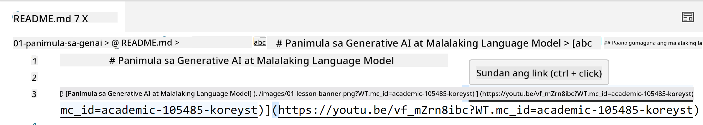
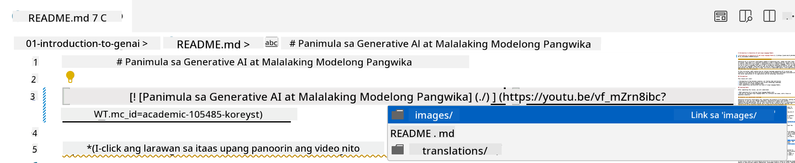
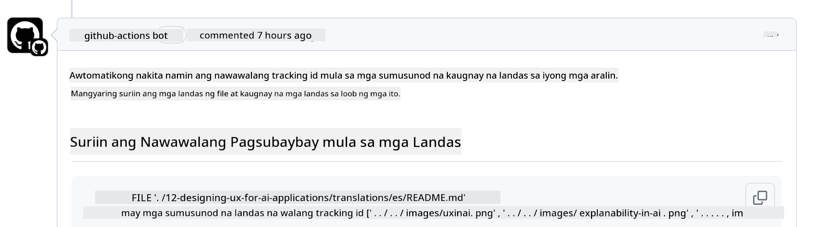
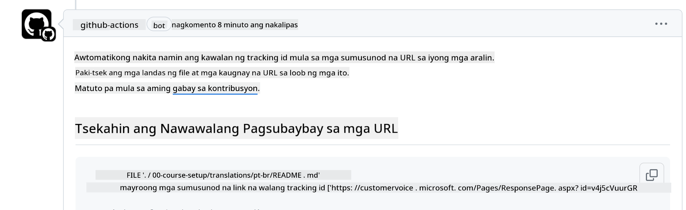
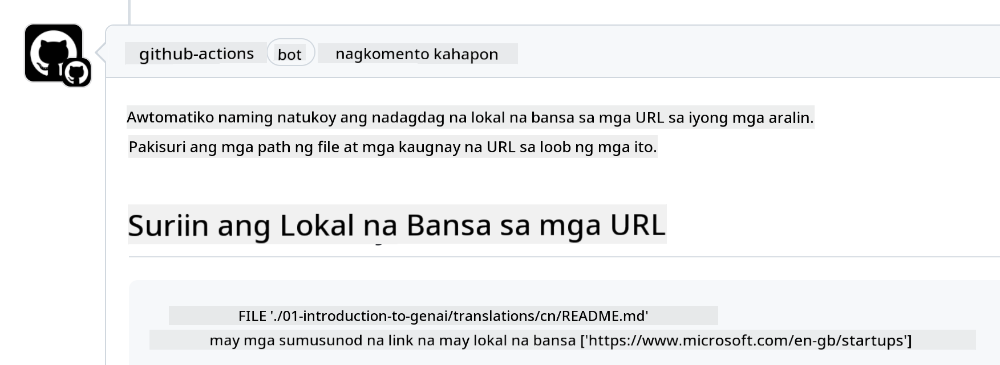

<!--
CO_OP_TRANSLATOR_METADATA:
{
  "original_hash": "57c41f2af71001a2cff9d8eb797cb843",
  "translation_date": "2025-07-09T06:10:37+00:00",
  "source_file": "CONTRIBUTING.md",
  "language_code": "tl"
}
-->
# Contributing

Malugod na tinatanggap ng proyektong ito ang mga kontribusyon at suhestiyon. Karamihan sa mga kontribusyon ay nangangailangan na sumang-ayon ka sa isang Contributor License Agreement (CLA) na nagsasaad na may karapatan ka, at talagang binibigyan mo kami ng karapatan na gamitin ang iyong kontribusyon. Para sa mga detalye, bisitahin ang <https://cla.microsoft.com>.

> Important: kapag nagsasalin ng teksto sa repo na ito, siguraduhing hindi ka gagamit ng machine translation. Susuriin namin ang mga salin sa pamamagitan ng komunidad, kaya mangyaring mag-volunteer lamang para sa mga pagsasalin sa mga wikang bihasa ka.

Kapag nagsumite ka ng pull request, awtomatikong malalaman ng CLA-bot kung kailangan mong magbigay ng CLA at lalagyan ng angkop na dekorasyon ang PR (hal., label, komento). Sundin lamang ang mga tagubiling ibibigay ng bot. Isang beses mo lang ito kailangang gawin sa lahat ng repository na gumagamit ng aming CLA.

## Code of Conduct

Inampon ng proyektong ito ang [Microsoft Open Source Code of Conduct](https://opensource.microsoft.com/codeofconduct/?WT.mc_id=academic-105485-koreyst).
Para sa karagdagang impormasyon, basahin ang [Code of Conduct FAQ](https://opensource.microsoft.com/codeofconduct/faq/?WT.mc_id=academic-105485-koreyst) o makipag-ugnayan sa [opencode@microsoft.com](mailto:opencode@microsoft.com) para sa anumang karagdagang tanong o komento.

## Tanong o Problema?

Mangyaring huwag magbukas ng GitHub issues para sa mga pangkalahatang tanong sa suporta dahil ang listahan sa GitHub ay dapat gamitin para sa mga kahilingan sa tampok at ulat ng bug. Sa ganitong paraan, mas madali naming matutunton ang mga aktwal na isyu o bug mula sa code at mapanatiling hiwalay ang pangkalahatang talakayan mula sa aktwal na code.

## Mga Typo, Isyu, Bug at kontribusyon

Kapag nagsusumite ka ng anumang pagbabago sa Generative AI for Beginners repository, sundin ang mga rekomendasyong ito.

* Palaging i-fork ang repository sa iyong sariling account bago gawin ang mga pagbabago
* Huwag pagsamahin ang maraming pagbabago sa isang pull request. Halimbawa, isumite ang anumang pag-aayos ng bug at mga update sa dokumentasyon gamit ang magkahiwalay na PR
* Kung nagpapakita ang iyong pull request ng merge conflicts, siguraduhing i-update ang iyong lokal na main upang maging kopya ng nasa main repository bago gawin ang mga pagbabago
* Kung nagsusumite ka ng pagsasalin, gumawa ng isang PR para sa lahat ng mga isinaling file dahil hindi kami tumatanggap ng bahagyang pagsasalin ng nilalaman
* Kung nagsusumite ka ng typo o pag-aayos sa dokumentasyon, maaari mong pagsamahin ang mga pagbabago sa isang PR kung naaangkop

## Pangkalahatang Patnubay sa pagsusulat

- Siguraduhing lahat ng iyong URL ay nakapaloob sa mga square brackets na sinusundan ng panaklong nang walang dagdag na espasyo sa paligid o loob nito ``.
- Siguraduhing anumang relative link (ibig sabihin, mga link sa ibang mga file at folder sa repository) ay nagsisimula sa `./` na tumutukoy sa isang file o folder na nasa kasalukuyang working directory o `../` na tumutukoy sa isang file o folder na nasa parent working directory.
- Siguraduhing anumang relative link (ibig sabihin, mga link sa ibang mga file at folder sa repository) ay may tracking ID (ibig sabihin, `?` o `&` tapos `wt.mc_id=` o `WT.mc_id=`) sa dulo nito.
- Siguraduhing anumang URL mula sa mga sumusunod na domain _github.com, microsoft.com, visualstudio.com, aka.ms, at azure.com_ ay may tracking ID (ibig sabihin, `?` o `&` tapos `wt.mc_id=` o `WT.mc_id=`) sa dulo nito.
- Siguraduhing ang iyong mga link ay walang country specific locale sa loob (hal., `/en-us/` o `/en/`).
- Siguraduhing lahat ng mga larawan ay nakaimbak sa `./images` na folder.
- Siguraduhing ang mga larawan ay may mga deskriptibong pangalan gamit ang mga English na karakter, numero, at gitling sa pangalan ng iyong larawan.

## GitHub Workflows

Kapag nagsumite ka ng pull request, apat na magkakaibang workflows ang tatakbo upang suriin ang mga naunang patakaran.
Sundin lamang ang mga tagubiling nakalista dito upang makapasa sa mga workflow checks.

- [Check Broken Relative Paths](../..)
- [Check Paths Have Tracking](../..)
- [Check URLs Have Tracking](../..)
- [Check URLs Don't Have Locale](../..)

### Check Broken Relative Paths

Tinitiyak ng workflow na ito na anumang relative path sa iyong mga file ay gumagana.
Ang repository na ito ay naka-deploy sa GitHub pages kaya kailangan mong maging maingat kapag nagta-type ng mga link na nag-uugnay sa lahat upang hindi madala ang sinuman sa maling lugar.

Para matiyak na gumagana nang maayos ang iyong mga link, gamitin lamang ang VS code para suriin iyon.

Halimbawa, kapag in-hover mo ang anumang link sa iyong mga file, ipapakita sa iyo ang opsyon na sundan ang link sa pamamagitan ng pagpindot ng **ctrl + click**

Kung i-click mo ang isang link at hindi ito gumagana sa lokal, tiyak na magti-trigger ito ng workflow at hindi gagana sa GitHub.

Para ayusin ang isyung ito, subukang i-type ang link gamit ang tulong ng VS code.

Kapag nag-type ka ng `./` o `../` magpapakita ang VS code ng mga opsyon na maaari mong piliin base sa iyong tinype.

Sundin ang path sa pamamagitan ng pag-click sa nais na file o folder at makakasiguro kang hindi sira ang iyong path.

Kapag naidagdag mo na ang tamang relative path, i-save at i-push ang iyong mga pagbabago, muling tatakbo ang workflow upang suriin ang mga ito.
Kung makapasa ka sa check, handa ka nang magpatuloy.

### Check Paths Have Tracking

Tinitiyak ng workflow na ito na anumang relative path ay may tracking.
Ang repository na ito ay naka-deploy sa GitHub pages kaya kailangan nating subaybayan ang galaw sa pagitan ng iba't ibang mga file at folder.

Para matiyak na may tracking ang iyong mga relative path, tingnan lamang kung may text na `?wt.mc_id=` sa dulo ng path.
Kung nakadugtong ito sa iyong mga relative path, makakapasa ka sa check na ito.

Kung wala, maaaring lumabas ang sumusunod na error.

Para ayusin ito, buksan ang file path na tinukoy ng workflow at idagdag ang tracking ID sa dulo ng mga relative path.

Kapag naidagdag mo na ang tracking ID, i-save at i-push ang iyong mga pagbabago, muling tatakbo ang workflow upang suriin ang mga ito.
Kung makapasa ka sa check, handa ka nang magpatuloy.

### Check URLs Have Tracking

Tinitiyak ng workflow na ito na anumang web URL ay may tracking.
Ang repository na ito ay bukas sa lahat kaya kailangan mong tiyakin na masusubaybayan ang access upang malaman kung saan nanggagaling ang traffic.

Para matiyak na may tracking ang iyong mga URL, tingnan lamang kung may text na `?wt.mc_id=` sa dulo ng URL.
Kung nakadugtong ito sa iyong mga URL, makakapasa ka sa check na ito.

Kung wala, maaaring lumabas ang sumusunod na error.

Para ayusin ito, buksan ang file path na tinukoy ng workflow at idagdag ang tracking ID sa dulo ng mga URL.

Kapag naidagdag mo na ang tracking ID, i-save at i-push ang iyong mga pagbabago, muling tatakbo ang workflow upang suriin ang mga ito.
Kung makapasa ka sa check, handa ka nang magpatuloy.

### Check URLs Don't Have Locale

Tinitiyak ng workflow na ito na walang country specific locale ang anumang web URL.
Ang repository na ito ay bukas sa lahat sa buong mundo kaya kailangan mong tiyakin na hindi isasama ang locale ng iyong bansa sa mga URL.

Para matiyak na walang country locale ang iyong mga URL, tingnan lamang kung may text na `/en-us/` o `/en/` o anumang iba pang language locale kahit saan sa URL.
Kung wala ito sa iyong mga URL, makakapasa ka sa check na ito.

Kung mayroon, maaaring lumabas ang sumusunod na error.

Para ayusin ito, buksan ang file path na tinukoy ng workflow at alisin ang country locale mula sa mga URL.

Kapag naalis mo na ang country locale, i-save at i-push ang iyong mga pagbabago, muling tatakbo ang workflow upang suriin ang mga ito.
Kung makapasa ka sa check, handa ka nang magpatuloy.

Binabati kita! Makikipag-ugnayan kami sa iyo sa lalong madaling panahon tungkol sa feedback sa iyong kontribusyon.

**Paalala**:  
Ang dokumentong ito ay isinalin gamit ang AI translation service na [Co-op Translator](https://github.com/Azure/co-op-translator). Bagamat nagsusumikap kami para sa katumpakan, pakatandaan na ang mga awtomatikong pagsasalin ay maaaring maglaman ng mga pagkakamali o di-tumpak na impormasyon. Ang orihinal na dokumento sa kanyang sariling wika ang dapat ituring na pangunahing sanggunian. Para sa mahahalagang impormasyon, inirerekomenda ang propesyonal na pagsasalin ng tao. Hindi kami mananagot sa anumang hindi pagkakaunawaan o maling interpretasyon na maaaring magmula sa paggamit ng pagsasaling ito.