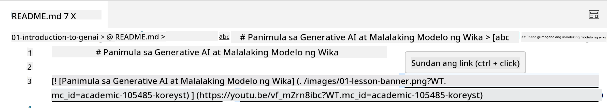
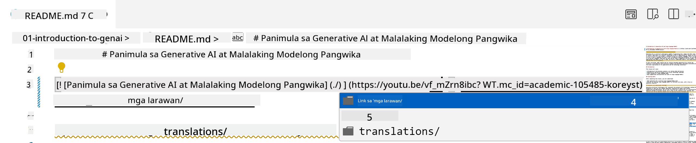
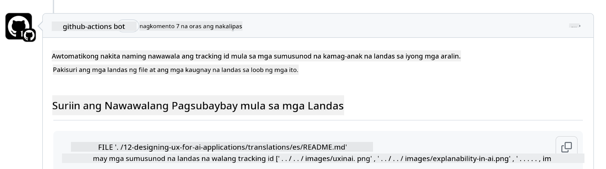
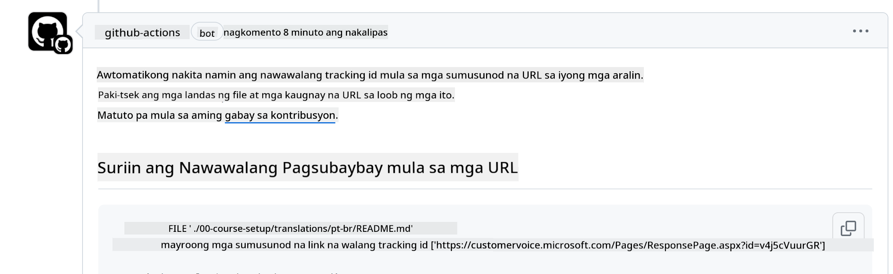
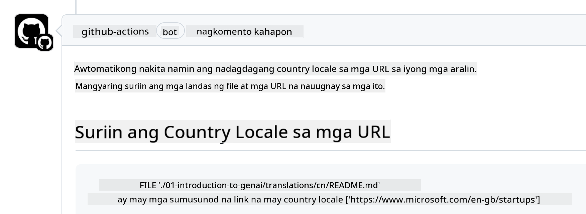

<!--
CO_OP_TRANSLATOR_METADATA:
{
  "original_hash": "57c41f2af71001a2cff9d8eb797cb843",
  "translation_date": "2025-05-19T11:22:01+00:00",
  "source_file": "CONTRIBUTING.md",
  "language_code": "tl"
}
-->
# Pag-aambag

Malugod na tinatanggap ng proyektong ito ang mga kontribusyon at mungkahi. Karamihan sa mga kontribusyon ay nangangailangan na ikaw ay sumang-ayon sa isang Contributor License Agreement (CLA) na nagsasaad na ikaw ay may karapatang magbigay sa amin ng mga karapatan na gamitin ang iyong kontribusyon. Para sa detalye, bisitahin ang <https://cla.microsoft.com>.

> Mahalaga: kapag nagta-translate ng teksto sa repo na ito, siguraduhing hindi ka gumagamit ng machine translation. Susuriin namin ang mga pagsasalin sa pamamagitan ng komunidad, kaya mangyaring mag-volunteer lamang para sa mga pagsasalin sa mga wikang bihasa ka.

Kapag nagsumite ka ng pull request, awtomatikong tutukuyin ng CLA-bot kung kailangan mong magbigay ng CLA at i-dekorasyon ang PR nang naaangkop (hal., label, komento). Sundin lamang ang mga tagubilin na ibinigay ng bot. Kakailanganin mo lang gawin ito isang beses sa lahat ng repositoryo na gumagamit ng aming CLA.

## Kodigo ng Pag-uugali

Ang proyektong ito ay nagpatibay ng [Microsoft Open Source Code of Conduct](https://opensource.microsoft.com/codeofconduct/?WT.mc_id=academic-105485-koreyst). Para sa karagdagang impormasyon basahin ang [Code of Conduct FAQ](https://opensource.microsoft.com/codeofconduct/faq/?WT.mc_id=academic-105485-koreyst) o makipag-ugnayan sa [opencode@microsoft.com](mailto:opencode@microsoft.com) para sa anumang karagdagang tanong o komento.

## Tanong o Problema?

Mangyaring huwag magbukas ng mga isyu sa GitHub para sa mga pangkalahatang tanong sa suporta dahil ang listahan ng GitHub ay dapat gamitin para sa mga hiling ng tampok at ulat ng bug. Sa ganitong paraan mas madali naming masusubaybayan ang aktwal na mga isyu o bug mula sa code at mapanatili ang pangkalahatang talakayan na hiwalay sa aktwal na code.

## Mga Typo, Isyu, Bug at kontribusyon

Sa tuwing nagsusumite ka ng anumang pagbabago sa Generative AI for Beginners repository, mangyaring sundin ang mga rekomendasyong ito.

* Palaging i-fork ang repository sa iyong sariling account bago gumawa ng iyong mga pagbabago
* Huwag pagsamahin ang maraming pagbabago sa isang pull request. Halimbawa, magsumite ng anumang pag-aayos ng bug at mga update sa dokumentasyon gamit ang magkakahiwalay na PR
* Kung ang iyong pull request ay nagpapakita ng mga salungatan sa pagsasama, siguraduhing i-update ang iyong lokal na main upang maging salamin ng kung ano ang nasa pangunahing repository bago gumawa ng iyong mga pagbabago
* Kung nagsusumite ka ng isang pagsasalin, mangyaring gumawa ng isang PR para sa lahat ng mga naisaling file dahil hindi kami tumatanggap ng bahagyang pagsasalin para sa nilalaman
* Kung nagsusumite ka ng isang typo o pag-aayos ng dokumentasyon, maaari mong pagsamahin ang mga pagbabago sa isang solong PR kung saan naaangkop

## Pangkalahatang Patnubay sa Pagsusulat

- Siguraduhing lahat ng iyong mga URL ay nakapaloob sa mga parisukat na bracket na sinusundan ng isang parenthesis na walang dagdag na espasyo sa paligid o sa loob nito ``.
- Siguraduhing ang anumang relatibong link (hal. mga link sa ibang mga file at folder sa repository) ay nagsisimula sa isang `./` na tumutukoy sa isang file o isang folder na matatagpuan sa kasalukuyang working directory o isang `../` na tumutukoy sa isang file o isang folder na matatagpuan sa parent working directory.
- Siguraduhing ang anumang relatibong link (hal. mga link sa ibang mga file at folder sa repository) ay may tracking ID (hal. `?` o `&` pagkatapos `wt.mc_id=` o `WT.mc_id=`) sa dulo nito.
- Siguraduhing ang anumang URL mula sa mga sumusunod na domain _github.com, microsoft.com, visualstudio.com, aka.ms, at azure.com_ ay may tracking ID (hal. `?` o `&` pagkatapos `wt.mc_id=` o `WT.mc_id=`) sa dulo nito.
- Siguraduhing ang iyong mga link ay walang country specific locale sa kanila (hal. `/en-us/` o `/en/`).
- Siguraduhing lahat ng mga imahe ay naka-imbak sa `./images` folder.
- Siguraduhing ang mga imahe ay may mga deskriptibong pangalan gamit ang mga English na karakter, numero, at mga gitling sa pangalan ng iyong imahe.

## Mga Workflow ng GitHub

Kapag nagsumite ka ng pull request, apat na iba't ibang workflow ang ma-trigger upang i-validate ang mga naunang panuntunan. Sundin lamang ang mga tagubilin na nakalista dito upang maipasa ang mga pagsusuri ng workflow.

- [Suriin ang mga Sirang Relatibong Path](../..)
- [Suriin ang mga Path na may Tracking](../..)
- [Suriin ang mga URL na may Tracking](../..)
- [Suriin ang mga URL na Walang Locale](../..)

### Suriin ang mga Sirang Relatibong Path

Ang workflow na ito ay tinitiyak na ang anumang relatibong path sa iyong mga file ay gumagana. Ang repository na ito ay dineploy sa GitHub pages kaya kailangan mong maging maingat kapag nagta-type ng mga link na nag-uugnay sa lahat upang hindi madirekta ang sinuman sa maling lugar.

Upang masiguro na ang iyong mga link ay gumagana nang maayos, gamitin lamang ang VS code upang suriin iyon.

Halimbawa, kapag nag-hover ka sa anumang link sa iyong mga file ay mapipilitang sundan ang link sa pamamagitan ng pagpindot sa **ctrl + click**

Kung nag-click ka sa isang link at hindi ito gumagana nang lokal, tiyak na ma-trigger nito ang workflow at hindi ito gagana sa GitHub.

Upang ayusin ang isyung ito, subukang i-type ang link sa tulong ng VS code.

Kapag nag-type ka ng `./` o `../`, ang VS code ay mag-prompt sa iyo na pumili mula sa mga magagamit na opsyon ayon sa iyong tinype.

Sundin ang path sa pamamagitan ng pag-click sa ninanais na file o folder at makasisiguro kang hindi sirang ang iyong path.

Kapag naidagdag mo na ang tamang relatibong path, i-save, at i-push ang iyong mga pagbabago, muling ma-trigger ang workflow upang i-verify ang iyong mga pagbabago. Kung naipasa mo ang pagsusuri, maari ka nang magpatuloy.

### Suriin ang mga Path na may Tracking

Ang workflow na ito ay tinitiyak na ang anumang relatibong path ay may tracking dito. Ang repository na ito ay dineploy sa GitHub pages kaya kailangan naming subaybayan ang paggalaw sa pagitan ng iba't ibang mga file at folder.

Upang masiguro na ang iyong mga relatibong path ay may tracking sa kanila, suriin lamang ang sumusunod na teksto `?wt.mc_id=` sa dulo ng path. Kung ito ay idinagdag sa iyong mga relatibong path, maipapasa mo ang pagsusuri na ito.

Kung hindi, maaari kang makakuha ng sumusunod na error.

Upang ayusin ang isyung ito, subukang buksan ang file path na itinampok ng workflow at idagdag ang tracking ID sa dulo ng mga relatibong path.

Kapag naidagdag mo na ang tracking ID, i-save, at i-push ang iyong mga pagbabago, muling ma-trigger ang workflow upang i-verify ang iyong mga pagbabago. Kung naipasa mo ang pagsusuri, maari ka nang magpatuloy.

### Suriin ang mga URL na may Tracking

Ang workflow na ito ay tinitiyak na ang anumang web URL ay may tracking dito. Ang repository na ito ay magagamit sa lahat kaya kailangan mong tiyakin na masusubaybayan ang pag-access upang malaman kung saan nanggagaling ang trapiko.

Upang masiguro na ang iyong mga URL ay may tracking sa kanila, suriin lamang ang sumusunod na teksto `?wt.mc_id=` sa dulo ng URL. Kung ito ay idinagdag sa iyong mga URL, maipapasa mo ang pagsusuri na ito.

Kung hindi, maaari kang makakuha ng sumusunod na error.

Upang ayusin ang isyung ito, subukang buksan ang file path na itinampok ng workflow at idagdag ang tracking ID sa dulo ng mga URL.

Kapag naidagdag mo na ang tracking ID, i-save, at i-push ang iyong mga pagbabago, muling ma-trigger ang workflow upang i-verify ang iyong mga pagbabago. Kung naipasa mo ang pagsusuri, maari ka nang magpatuloy.

### Suriin ang mga URL na Walang Locale

Ang workflow na ito ay tinitiyak na ang anumang web URL ay walang country specific locale dito. Ang repository na ito ay magagamit sa lahat sa buong mundo kaya kailangan mong tiyakin na hindi isasama ang iyong country's locale sa mga URL.

Upang masiguro na ang iyong mga URL ay walang country locale sa kanila, suriin lamang ang sumusunod na teksto `/en-us/` o `/en/` o anumang ibang language locale saanman sa URL. Kung ito ay wala sa iyong mga URL, maipapasa mo ang pagsusuri na ito.

Kung hindi, maaari kang makakuha ng sumusunod na error.

Upang ayusin ang isyung ito, subukang buksan ang file path na itinampok ng workflow at alisin ang country locale mula sa mga URL.

Kapag naalis mo na ang country locale, i-save, at i-push ang iyong mga pagbabago, muling ma-trigger ang workflow upang i-verify ang iyong mga pagbabago. Kung naipasa mo ang pagsusuri, maari ka nang magpatuloy.

Binabati kita! Babalikan ka namin sa lalong madaling panahon na may feedback tungkol sa iyong kontribusyon.

**Paunawa**: 
Ang dokumentong ito ay isinalin gamit ang AI translation service [Co-op Translator](https://github.com/Azure/co-op-translator). Bagamat sinisikap namin ang pagiging tumpak, mangyaring tandaan na ang awtomatikong pagsasalin ay maaaring maglaman ng mga pagkakamali o hindi pagkakatumpak. Ang orihinal na dokumento sa kanyang katutubong wika ay dapat ituring na mapagkakatiwalaang pinagmulan. Para sa kritikal na impormasyon, inirerekomenda ang propesyonal na pagsasalin ng tao. Hindi kami mananagot sa anumang hindi pagkakaintindihan o maling interpretasyon na nagmumula sa paggamit ng pagsasaling ito.