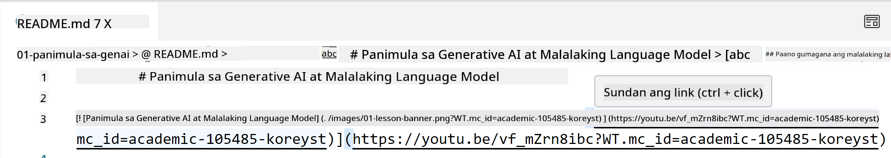
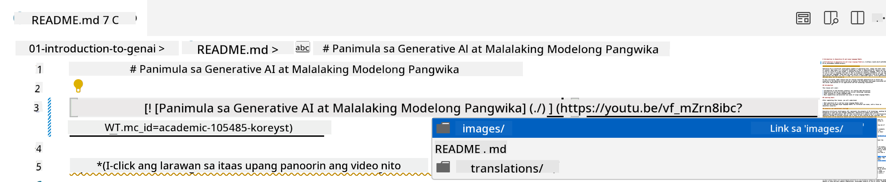
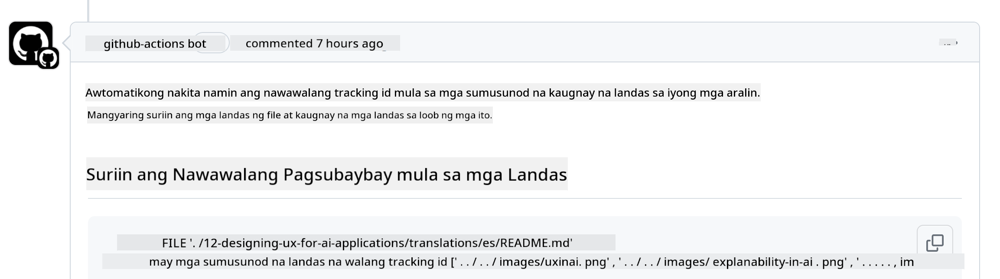
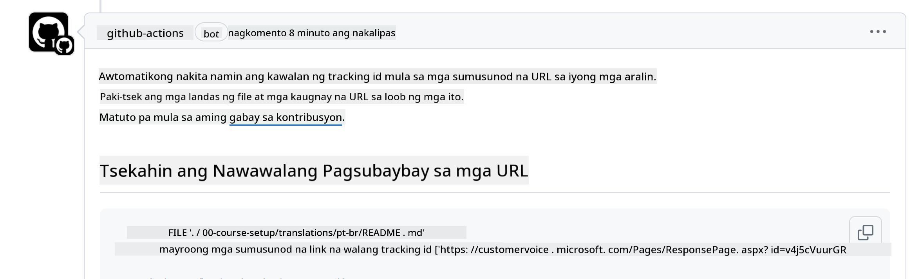
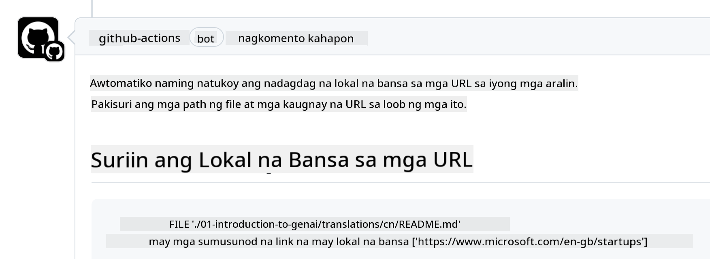

<!--
CO_OP_TRANSLATOR_METADATA:
{
  "original_hash": "57c41f2af71001a2cff9d8eb797cb843",
  "translation_date": "2025-06-25T07:16:32+00:00",
  "source_file": "CONTRIBUTING.md",
  "language_code": "tl"
}
-->
# Pag-aambag

Ang proyektong ito ay tumatanggap ng mga kontribusyon at mungkahi. Karamihan sa mga kontribusyon ay nangangailangan ng iyong pagsang-ayon sa isang Contributor License Agreement (CLA) na nagsasaad na ikaw ay may karapatang, at aktwal na ginagawa, ibigay sa amin ang mga karapatan na gamitin ang iyong kontribusyon. Para sa mga detalye, bisitahin ang <https://cla.microsoft.com>.

> Mahalagang Paalala: kapag nagsasalin ng teksto sa repo na ito, siguraduhing hindi ka gumagamit ng makina para sa pagsasalin. Susuriin namin ang mga salin sa pamamagitan ng komunidad, kaya mangyaring magboluntaryo lamang para sa mga salin sa mga wikang ikaw ay bihasa.

Kapag nag-submit ka ng pull request, ang isang CLA-bot ay awtomatikong tutukoy kung kailangan mong magbigay ng CLA at i-dekorahan ang PR nang naaangkop (hal., label, komento). Sundin lamang ang mga instruksyon na ibinigay ng bot. Kailangan mo lang gawin ito nang isang beses sa lahat ng mga repository na gumagamit ng aming CLA.

## Code of Conduct

Ang proyektong ito ay nagpatibay ng [Microsoft Open Source Code of Conduct](https://opensource.microsoft.com/codeofconduct/?WT.mc_id=academic-105485-koreyst). Para sa karagdagang impormasyon basahin ang [Code of Conduct FAQ](https://opensource.microsoft.com/codeofconduct/faq/?WT.mc_id=academic-105485-koreyst) o makipag-ugnayan sa [opencode@microsoft.com](mailto:opencode@microsoft.com) para sa anumang karagdagang tanong o komento.

## Tanong o Problema?

Mangyaring huwag magbukas ng GitHub issues para sa mga pangkalahatang tanong sa suporta dahil ang listahan ng GitHub ay dapat gamitin para sa mga kahilingan sa tampok at mga ulat ng bug. Sa ganitong paraan mas madali naming matutunton ang aktwal na mga isyu o bug mula sa code at mapanatili ang pangkalahatang talakayan na hiwalay sa aktwal na code.

## Mga Mali sa Pagbaybay, Isyu, Bug at mga kontribusyon

Tuwing ikaw ay nagsusumite ng anumang pagbabago sa Generative AI for Beginners repository, mangyaring sundin ang mga rekomendasyong ito.

* Palaging i-fork ang repository sa iyong sariling account bago gawin ang iyong mga pagbabago
* Huwag pagsamahin ang maraming pagbabago sa isang pull request. Halimbawa, magsumite ng anumang pag-aayos ng bug at mga update sa dokumentasyon gamit ang magkakahiwalay na PRs
* Kung ang iyong pull request ay nagpapakita ng merge conflicts, siguraduhing i-update ang iyong lokal na main upang maging salamin ng kung ano ang nasa pangunahing repository bago gawin ang iyong mga pagbabago
* Kung ikaw ay nagsusumite ng isang salin, mangyaring gumawa ng isang PR para sa lahat ng mga na-translate na file dahil hindi kami tumatanggap ng partial translations para sa content
* Kung ikaw ay nagsusumite ng typo o pag-aayos ng dokumentasyon, maaari mong pagsamahin ang mga pagbabago sa isang PR kung naaangkop

## Pangkalahatang Patnubay sa Pagsulat

- Tiyakin na ang lahat ng iyong mga URL ay nakabalot sa mga square brackets na sinusundan ng isang parenthesis na walang karagdagang puwang sa paligid nito o sa loob nito ``.
- Tiyakin na ang anumang relative link (hal. mga link sa ibang mga file at folder sa repository) ay nagsisimula sa isang `./` na tumutukoy sa isang file o folder na matatagpuan sa kasalukuyang working directory o isang `../` na tumutukoy sa isang file o folder na matatagpuan sa isang parent working directory.
- Tiyakin na ang anumang relative link (hal. mga link sa ibang mga file at folder sa repository) ay may tracking ID (hal. `?` o `&` pagkatapos ay `wt.mc_id=` o `WT.mc_id=`) sa dulo nito.
- Tiyakin na ang anumang URL mula sa mga sumusunod na domain _github.com, microsoft.com, visualstudio.com, aka.ms, at azure.com_ ay may tracking ID (hal. `?` o `&` pagkatapos ay `wt.mc_id=` o `WT.mc_id=`) sa dulo nito.
- Tiyakin na ang iyong mga link ay walang country specific locale sa kanila (hal. `/en-us/` o `/en/`).
- Tiyakin na ang lahat ng mga imahe ay nakaimbak sa folder ng `./images`.
- Tiyakin na ang mga imahe ay may mga mapanlikhang pangalan gamit ang mga karakter ng Ingles, mga numero, at mga gitling sa pangalan ng iyong imahe.

## GitHub Workflows

Kapag nag-submit ka ng pull request, apat na iba't ibang workflows ang maa-trigger upang i-validate ang mga naunang tuntunin. Sundin lamang ang mga instruksyon na nakalista dito upang pumasa sa mga workflow checks.

- [Suriin ang Nasirang Relative Paths](../..)
- [Suriin ang Mga Paths na May Tracking](../..)
- [Suriin ang Mga URLs na May Tracking](../..)
- [Suriin ang Mga URLs na Walang Locale](../..)

### Suriin ang Nasirang Relative Paths

Ang workflow na ito ay tinitiyak na ang anumang relative path sa iyong mga file ay gumagana. Ang repository na ito ay na-deploy sa GitHub pages kaya kailangan mong maging maingat kapag nagta-type ng mga link na nag-uugnay sa lahat ng bagay upang hindi madirekta ang sinuman sa maling lugar.

Upang matiyak na ang iyong mga link ay gumagana nang maayos, gamitin lamang ang VS code upang suriin iyon.

Halimbawa, kapag nag-hover ka sa anumang link sa iyong mga file, ikaw ay bibigyan ng prompt upang sundin ang link sa pamamagitan ng pagpindot sa **ctrl + click**

Kung ikaw ay mag-click sa isang link at ito ay hindi gumagana nang lokal, tiyak na ito ay magti-trigger ng workflow at hindi gagana sa GitHub.

Upang ayusin ang isyung ito, subukan na i-type ang link sa tulong ng VS code.

Kapag nag-type ka ng `./` o `../`, ang VS code ay mag-prompt sa iyo na pumili mula sa mga available na opsyon ayon sa kung ano ang iyong na-type.

Sundin ang path sa pamamagitan ng pag-click sa nais na file o folder at ikaw ay siguradong ang iyong path ay hindi nasira.

Kapag nailagay mo na ang tamang relative path, i-save, at i-push ang iyong mga pagbabago, ang workflow ay muling maa-trigger upang i-verify ang iyong mga pagbabago. Kung ikaw ay pumasa sa check, ikaw ay handa na.

### Suriin ang Mga Paths na May Tracking

Ang workflow na ito ay tinitiyak na ang anumang relative path ay may tracking dito. Ang repository na ito ay na-deploy sa GitHub pages kaya kailangan nating subaybayan ang paggalaw sa pagitan ng iba't ibang mga file at folder.

Upang matiyak na ang iyong mga relative paths ay may tracking dito, tingnan lamang ang sumusunod na teksto `?wt.mc_id=` sa dulo ng path. Kung ito ay idinagdag sa iyong mga relative paths, ikaw ay pumasa sa check na ito.

Kung hindi, maaari kang makakuha ng sumusunod na error.

Upang ayusin ang isyung ito, subukan na buksan ang file path na na-highlight ng workflow at idagdag ang tracking ID sa dulo ng mga relative paths.

Kapag nailagay mo na ang tracking ID, i-save, at i-push ang iyong mga pagbabago, ang workflow ay muling maa-trigger upang i-verify ang iyong mga pagbabago. Kung ikaw ay pumasa sa check, ikaw ay handa na.

### Suriin ang Mga URLs na May Tracking

Ang workflow na ito ay tinitiyak na ang anumang web URL ay may tracking dito. Ang repository na ito ay available sa lahat kaya kailangan mong tiyakin na subaybayan ang access upang malaman kung saan nagmumula ang traffic.

Upang matiyak na ang iyong mga URLs ay may tracking dito, tingnan lamang ang sumusunod na teksto `?wt.mc_id=` sa dulo ng URL. Kung ito ay idinagdag sa iyong mga URLs, ikaw ay pumasa sa check na ito.

Kung hindi, maaari kang makakuha ng sumusunod na error.

Upang ayusin ang isyung ito, subukan na buksan ang file path na na-highlight ng workflow at idagdag ang tracking ID sa dulo ng mga URLs.

Kapag nailagay mo na ang tracking ID, i-save, at i-push ang iyong mga pagbabago, ang workflow ay muling maa-trigger upang i-verify ang iyong mga pagbabago. Kung ikaw ay pumasa sa check, ikaw ay handa na.

### Suriin ang Mga URLs na Walang Locale

Ang workflow na ito ay tinitiyak na ang anumang web URL ay walang country specific locale dito. Ang repository na ito ay available sa lahat sa buong mundo kaya kailangan mong tiyakin na hindi isama ang iyong country's locale sa mga URLs.

Upang matiyak na ang iyong mga URLs ay walang country locale dito, tingnan lamang ang sumusunod na teksto `/en-us/` o `/en/` o anumang ibang language locale saanman sa URL. Kung ito ay hindi naroroon sa iyong mga URLs, ikaw ay pumasa sa check na ito.

Kung hindi, maaari kang makakuha ng sumusunod na error.

Upang ayusin ang isyung ito, subukan na buksan ang file path na na-highlight ng workflow at alisin ang country locale mula sa mga URLs.

Kapag inalis mo na ang country locale, i-save, at i-push ang iyong mga pagbabago, ang workflow ay muling maa-trigger upang i-verify ang iyong mga pagbabago. Kung ikaw ay pumasa sa check, ikaw ay handa na.

Congratulations! Kami ay babalik sa iyo sa lalong madaling panahon na may feedback tungkol sa iyong kontribusyon.

**Paunawa**:  
Ang dokumentong ito ay isinalin gamit ang AI translation service na [Co-op Translator](https://github.com/Azure/co-op-translator). Habang sinisikap naming maging tumpak, pakitandaan na ang mga awtomatikong pagsasalin ay maaaring maglaman ng mga pagkakamali o hindi pagkaka-ayon. Ang orihinal na dokumento sa kanyang katutubong wika ang dapat ituring na mapagkakatiwalaang sanggunian. Para sa kritikal na impormasyon, inirerekomenda ang propesyonal na pagsasalin ng tao. Kami ay hindi mananagot para sa anumang hindi pagkakaintindihan o maling interpretasyon na nagmumula sa paggamit ng pagsasaling ito.