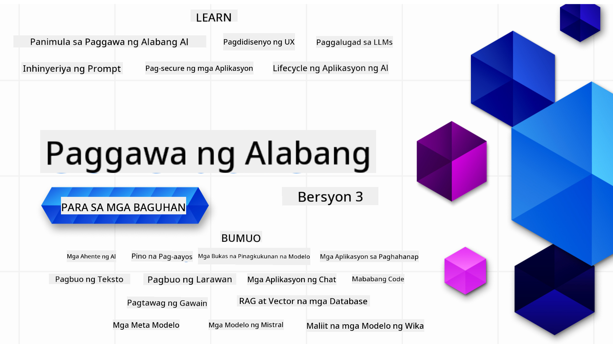

<!--
CO_OP_TRANSLATOR_METADATA:
{
  "original_hash": "ca2afa136ed9aca0634f39f51239746e",
  "translation_date": "2025-08-27T08:48:44+00:00",
  "source_file": "README.md",
  "language_code": "tl"
}
-->

### 21 Aralin na nagtuturo ng lahat ng kailangan mong malaman upang makapagsimula sa paggawa ng mga Generative AI na aplikasyon

  
  
  
  
  

  
  
  

### 🌐 Suporta sa Iba't Ibang Wika

#### Sinusuportahan sa pamamagitan ng GitHub Action (Awtomatiko at Laging Napapanahon)

[French](../fr/README.md) | [Spanish](../es/README.md) | [German](../de/README.md) | [Russian](../ru/README.md) | [Arabic](../ar/README.md) | [Persian (Farsi)](../fa/README.md) | [Urdu](../ur/README.md) | [Chinese (Simplified)](../zh/README.md) | [Chinese (Traditional, Macau)](../mo/README.md) | [Chinese (Traditional, Hong Kong)](../hk/README.md) | [Chinese (Traditional, Taiwan)](../tw/README.md) | [Japanese](../ja/README.md) | [Korean](../ko/README.md) | [Hindi](../hi/README.md) | [Bengali](../bn/README.md) | [Marathi](../mr/README.md) | [Nepali](../ne/README.md) | [Punjabi (Gurmukhi)](../pa/README.md) | [Portuguese (Portugal)](../pt/README.md) | [Portuguese (Brazil)](../br/README.md) | [Italian](../it/README.md) | [Lithuanian](../lt/README.md) | [Polish](../pl/README.md) | [Turkish](../tr/README.md) | [Greek](../el/README.md) | [Thai](../th/README.md) | [Swedish](../sv/README.md) | [Danish](../da/README.md) | [Norwegian](../no/README.md) | [Finnish](../fi/README.md) | [Dutch](../nl/README.md) | [Hebrew](../he/README.md) | [Vietnamese](../vi/README.md) | [Indonesian](../id/README.md) | [Malay](../ms/README.md) | [Tagalog (Filipino)](./README.md) | [Swahili](../sw/README.md) | [Hungarian](../hu/README.md) | [Czech](../cs/README.md) | [Slovak](../sk/README.md) | [Romanian](../ro/README.md) | [Bulgarian](../bg/README.md) | [Serbian (Cyrillic)](../sr/README.md) | [Croatian](../hr/README.md) | [Slovenian](../sl/README.md) | [Ukrainian](../uk/README.md) | [Burmese (Myanmar)](../my/README.md)

# Generative AI para sa Mga Baguhan (Bersyon 3) - Isang Kurso

Alamin ang mga pangunahing kaalaman sa paggawa ng mga Generative AI na aplikasyon gamit ang aming 21-araling komprehensibong kurso mula sa Microsoft Cloud Advocates.

## 🌱 Pagsisimula

Ang kursong ito ay may 21 aralin. Ang bawat aralin ay may sariling paksa kaya maaari kang magsimula kahit saan mo gusto!

Ang mga aralin ay may label na "Learn" na nagpapaliwanag ng isang konsepto ng Generative AI o "Build" na nagpapakita ng konsepto at mga halimbawa ng code sa parehong **Python** at **TypeScript** kung posible.

Para sa mga .NET Developers, tingnan ang [Generative AI para sa Mga Baguhan (.NET Edition)](https://github.com/microsoft/Generative-AI-for-beginners-dotnet?WT.mc_id=academic-105485-koreyst)!

Ang bawat aralin ay may kasamang seksyong "Keep Learning" na may mga karagdagang kasangkapan sa pag-aaral.

## Ano ang Kailangan Mo
### Upang patakbuhin ang code ng kursong ito, maaari mong gamitin ang alinman sa:
 - [Azure OpenAI Service](https://aka.ms/genai-beginners/azure-open-ai?WT.mc_id=academic-105485-koreyst) - **Mga Aralin:** "aoai-assignment"  
 - [GitHub Marketplace Model Catalog](https://aka.ms/genai-beginners/gh-models?WT.mc_id=academic-105485-koreyst) - **Mga Aralin:** "githubmodels"  
 - [OpenAI API](https://aka.ms/genai-beginners/open-ai?WT.mc_id=academic-105485-koreyst) - **Mga Aralin:** "oai-assignment"  

- Ang pangunahing kaalaman sa Python o TypeScript ay makakatulong - \*Para sa mga ganap na baguhan, tingnan ang mga kursong ito sa [Python](https://aka.ms/genai-beginners/python?WT.mc_id=academic-105485-koreyst) at [TypeScript](https://aka.ms/genai-beginners/typescript?WT.mc_id=academic-105485-koreyst)  
- Isang GitHub account upang [i-fork ang buong repo na ito](https://aka.ms/genai-beginners/github?WT.mc_id=academic-105485-koreyst) sa iyong sariling GitHub account  

Nilikha namin ang isang **[Course Setup](./00-course-setup/README.md?WT.mc_id=academic-105485-koreyst)** na aralin upang tulungan kang i-setup ang iyong development environment.

Huwag kalimutang [i-star (🌟) ang repo na ito](https://docs.github.com/en/get-started/exploring-projects-on-github/saving-repositories-with-stars?WT.mc_id=academic-105485-koreyst) upang mas madali mo itong mahanap sa hinaharap.

## 🧠 Handa nang I-deploy?

Kung naghahanap ka ng mas advanced na mga halimbawa ng code, tingnan ang aming [koleksyon ng Generative AI Code Samples](https://aka.ms/genai-beg-code?WT.mc_id=academic-105485-koreyst) sa parehong **Python** at **TypeScript**.

## 🗣️ Makipagkita sa Ibang Mga Nag-aaral, Humingi ng Suporta

Sumali sa aming [opisyal na Azure AI Foundry Discord server](https://aka.ms/genai-discord?WT.mc_id=academic-105485-koreyst) upang makipagkita at makipag-network sa ibang mga nag-aaral na kumukuha ng kursong ito at humingi ng suporta.

Magtanong o magbahagi ng feedback sa produkto sa aming [Azure AI Foundry Developer Forum](https://aka.ms/azureaifoundry/forum) sa Github.

## 🚀 Nagtatayo ng Startup?

Bisitahin ang [Microsoft for Startups](https://www.microsoft.com/startups) upang malaman kung paano magsimula sa paggawa gamit ang Azure credits ngayon.

## 🙏 Nais tumulong?

May mga mungkahi o nakakita ng mga pagkakamali sa spelling o code? [Mag-raise ng isyu](https://github.com/microsoft/generative-ai-for-beginners/issues?WT.mc_id=academic-105485-koreyst) o [Gumawa ng pull request](https://github.com/microsoft/generative-ai-for-beginners/pulls?WT.mc_id=academic-105485-koreyst).

## 📂 Ang bawat aralin ay naglalaman ng:

- Isang maikling video na nagpapakilala sa paksa  
- Isang nakasulat na aralin na matatagpuan sa README  
- Mga halimbawa ng code sa Python at TypeScript na sumusuporta sa Azure OpenAI at OpenAI API  
- Mga link sa karagdagang mapagkukunan upang ipagpatuloy ang iyong pag-aaral  

## 🗃️ Mga Aralin

| #   | **Link ng Aralin**                                                                                                                              | **Deskripsyon**                                                                                 | **Video**                                                                   | **Karagdagang Pag-aaral**                                                      |
| --- | -------------------------------------------------------------------------------------------------------------------------------------------- | ----------------------------------------------------------------------------------------------- | --------------------------------------------------------------------------- | ------------------------------------------------------------------------------ |
| 00  | [Course Setup](./00-course-setup/README.md?WT.mc_id=academic-105485-koreyst)                                                                 | **Matutunan:** Paano I-setup ang Iyong Development Environment                                  | Video Coming Soon                                                                 | [Matuto Pa](https://aka.ms/genai-collection?WT.mc_id=academic-105485-koreyst) |
| 01  | [Panimula sa Generative AI at LLMs](./01-introduction-to-genai/README.md?WT.mc_id=academic-105485-koreyst)                              | **Matutunan:** Pag-unawa kung ano ang Generative AI at paano gumagana ang Large Language Models (LLMs).       | [Video](https://aka.ms/gen-ai-lesson-1-gh?WT.mc_id=academic-105485-koreyst) | [Matuto Pa](https://aka.ms/genai-collection?WT.mc_id=academic-105485-koreyst) |
| 02  | [Paggalugad at Paghahambing ng Iba't Ibang LLMs](./02-exploring-and-comparing-different-llms/README.md?WT.mc_id=academic-105485-koreyst)             | **Matutunan:** Paano pumili ng tamang modelo para sa iyong paggamit                              | [Video](https://aka.ms/gen-ai-lesson2-gh?WT.mc_id=academic-105485-koreyst)  | [Matuto Pa](https://aka.ms/genai-collection?WT.mc_id=academic-105485-koreyst) |
| 03  | [Paggamit ng Generative AI nang Responsable](./03-using-generative-ai-responsibly/README.md?WT.mc_id=academic-105485-koreyst)                           | **Matutunan:** Paano gumawa ng mga Generative AI na Aplikasyon nang responsable                                  | [Video](https://aka.ms/gen-ai-lesson3-gh?WT.mc_id=academic-105485-koreyst)  | [Matuto Pa](https://aka.ms/genai-collection?WT.mc_id=academic-105485-koreyst) |
| 04  | [Pag-unawa sa Mga Pangunahing Kaalaman ng Prompt Engineering](./04-prompt-engineering-fundamentals/README.md?WT.mc_id=academic-105485-koreyst)             | **Matutunan:** Mga Praktikal na Gabay sa Prompt Engineering                                           | [Video](https://aka.ms/gen-ai-lesson4-gh?WT.mc_id=academic-105485-koreyst)  | [Matuto Pa](https://aka.ms/genai-collection?WT.mc_id=academic-105485-koreyst) |
| 05  | [Paglikha ng Mga Advanced na Prompt](./05-advanced-prompts/README.md?WT.mc_id=academic-105485-koreyst)                                                | **Matutunan:** Paano gamitin ang mga teknik sa prompt engineering upang mapabuti ang resulta ng iyong mga prompt. | [Video](https://aka.ms/gen-ai-lesson5-gh?WT.mc_id=academic-105485-koreyst)  | [Matuto Pa](https://aka.ms/genai-collection?WT.mc_id=academic-105485-koreyst) |
| 06  | [Pagbuo ng Mga Aplikasyon sa Text Generation](./06-text-generation-apps/README.md?WT.mc_id=academic-105485-koreyst)                                | **Gumawa:** Isang app para sa text generation gamit ang Azure OpenAI / OpenAI API                                | [Video](https://aka.ms/gen-ai-lesson6-gh?WT.mc_id=academic-105485-koreyst)  | [Alamin Pa](https://aka.ms/genai-collection?WT.mc_id=academic-105485-koreyst) |
| 07  | [Pagbuo ng Mga Chat Applications](./07-building-chat-applications/README.md?WT.mc_id=academic-105485-koreyst)                                     | **Gumawa:** Mga teknik para sa epektibong pagbuo at integrasyon ng mga chat application.               | [Video](https://aka.ms/gen-ai-lessons7-gh?WT.mc_id=academic-105485-koreyst) | [Alamin Pa](https://aka.ms/genai-collection?WT.mc_id=academic-105485-koreyst) |
| 08  | [Pagbuo ng Mga Search Apps gamit ang Vector Databases](./08-building-search-applications/README.md?WT.mc_id=academic-105485-koreyst)                        | **Gumawa:** Isang search application na gumagamit ng Embeddings para maghanap ng data.                        | [Video](https://aka.ms/gen-ai-lesson8-gh?WT.mc_id=academic-105485-koreyst)  | [Alamin Pa](https://aka.ms/genai-collection?WT.mc_id=academic-105485-koreyst) |
| 09  | [Pagbuo ng Mga Aplikasyon sa Image Generation](./09-building-image-applications/README.md?WT.mc_id=academic-105485-koreyst)                        | **Gumawa:** Isang application para sa image generation                                                       | [Video](https://aka.ms/gen-ai-lesson9-gh?WT.mc_id=academic-105485-koreyst)  | [Alamin Pa](https://aka.ms/genai-collection?WT.mc_id=academic-105485-koreyst) |
| 10  | [Pagbuo ng Mga Low Code AI Applications](./10-building-low-code-ai-applications/README.md?WT.mc_id=academic-105485-koreyst)                       | **Gumawa:** Isang Generative AI application gamit ang Low Code tools                                     | [Video](https://aka.ms/gen-ai-lesson10-gh?WT.mc_id=academic-105485-koreyst) | [Alamin Pa](https://aka.ms/genai-collection?WT.mc_id=academic-105485-koreyst) |
| 11  | [Pag-integrate ng Mga External Applications gamit ang Function Calling](./11-integrating-with-function-calling/README.md?WT.mc_id=academic-105485-koreyst) | **Gumawa:** Ano ang function calling at ang mga gamit nito para sa mga application                          | [Video](https://aka.ms/gen-ai-lesson11-gh?WT.mc_id=academic-105485-koreyst) | [Alamin Pa](https://aka.ms/genai-collection?WT.mc_id=academic-105485-koreyst) |
| 12  | [Pagdidisenyo ng UX para sa Mga AI Applications](./12-designing-ux-for-ai-applications/README.md?WT.mc_id=academic-105485-koreyst)                         | **Matuto:** Paano i-apply ang mga prinsipyo ng UX design sa pag-develop ng Generative AI Applications         | [Video](https://aka.ms/gen-ai-lesson12-gh?WT.mc_id=academic-105485-koreyst) | [Alamin Pa](https://aka.ms/genai-collection?WT.mc_id=academic-105485-koreyst) |
| 13  | [Pag-secure ng Iyong Mga Generative AI Applications](./13-securing-ai-applications/README.md?WT.mc_id=academic-105485-koreyst)                         | **Matuto:** Ang mga banta at panganib sa AI systems at mga paraan upang ma-secure ang mga ito.             | [Video](https://aka.ms/gen-ai-lesson13-gh?WT.mc_id=academic-105485-koreyst) | [Alamin Pa](https://aka.ms/genai-collection?WT.mc_id=academic-105485-koreyst) |
| 14  | [Ang Lifecycle ng Generative AI Application](./14-the-generative-ai-application-lifecycle/README.md?WT.mc_id=academic-105485-koreyst)           | **Matuto:** Ang mga tools at metrics para pamahalaan ang LLM Lifecycle at LLMOps                         | [Video](https://aka.ms/gen-ai-lesson14-gh?WT.mc_id=academic-105485-koreyst) | [Alamin Pa](https://aka.ms/genai-collection?WT.mc_id=academic-105485-koreyst) |
| 15  | [Retrieval Augmented Generation (RAG) at Vector Databases](./15-rag-and-vector-databases/README.md?WT.mc_id=academic-105485-koreyst)        | **Gumawa:** Isang application gamit ang RAG Framework para mag-retrieve ng embeddings mula sa Vector Databases  | [Video](https://aka.ms/gen-ai-lesson15-gh?WT.mc_id=academic-105485-koreyst) | [Alamin Pa](https://aka.ms/genai-collection?WT.mc_id=academic-105485-koreyst) |
| 16  | [Mga Open Source Models at Hugging Face](./16-open-source-models/README.md?WT.mc_id=academic-105485-koreyst)                                    | **Gumawa:** Isang application gamit ang mga open source models na available sa Hugging Face                    | [Video](https://aka.ms/gen-ai-lesson16-gh?WT.mc_id=academic-105485-koreyst) | [Alamin Pa](https://aka.ms/genai-collection?WT.mc_id=academic-105485-koreyst) |
| 17  | [AI Agents](./17-ai-agents/README.md?WT.mc_id=academic-105485-koreyst)                                                                       | **Gumawa:** Isang application gamit ang AI Agent Framework                                           | [Video](https://aka.ms/gen-ai-lesson17-gh?WT.mc_id=academic-105485-koreyst) | [Alamin Pa](https://aka.ms/genai-collection?WT.mc_id=academic-105485-koreyst) |
| 18  | [Fine-Tuning ng LLMs](./18-fine-tuning/README.md?WT.mc_id=academic-105485-koreyst)                                                              | **Matuto:** Ano, bakit, at paano ang fine-tuning ng LLMs                                            | [Video](https://aka.ms/gen-ai-lesson18-gh?WT.mc_id=academic-105485-koreyst) | [Alamin Pa](https://aka.ms/genai-collection?WT.mc_id=academic-105485-koreyst) |
| 19  | [Pagbuo gamit ang SLMs](./19-slm/README.md?WT.mc_id=academic-105485-koreyst)                                                              | **Matuto:** Ang mga benepisyo ng pagbuo gamit ang Small Language Models                                            | Video Paparating Pa | [Alamin Pa](https://aka.ms/genai-collection?WT.mc_id=academic-105485-koreyst) |
| 20  | [Pagbuo gamit ang Mistral Models](./20-mistral/README.md?WT.mc_id=academic-105485-koreyst)                                                              | **Matuto:** Ang mga tampok at pagkakaiba ng Mistral Family Models                                           | Video Paparating Pa | [Alamin Pa](https://aka.ms/genai-collection?WT.mc_id=academic-105485-koreyst) |
| 21  | [Pagbuo gamit ang Meta Models](./21-meta/README.md?WT.mc_id=academic-105485-koreyst)                                                              | **Matuto:** Ang mga tampok at pagkakaiba ng Meta Family Models                                           | Video Paparating Pa | [Alamin Pa](https://aka.ms/genai-collection?WT.mc_id=academic-105485-koreyst) |

### 🌟 Espesyal na Pasasalamat

Espesyal na pasasalamat kay [**John Aziz**](https://www.linkedin.com/in/john0isaac/) para sa paglikha ng lahat ng GitHub Actions at workflows.

[**Bernhard Merkle**](https://www.linkedin.com/in/bernhard-merkle-738b73/) para sa mga mahalagang kontribusyon sa bawat aralin upang mapabuti ang karanasan ng mga mag-aaral at sa code.

## 🎒 Iba Pang Kurso

Ang aming team ay gumagawa rin ng iba pang mga kurso! Tingnan ang:

- [**BAGO** Model Context Protocol para sa Mga Baguhan](https://github.com/microsoft/mcp-for-beginners)
- [AI Agents para sa Mga Baguhan](https://github.com/microsoft/ai-agents-for-beginners)
- [Generative AI para sa Mga Baguhan gamit ang .NET](https://github.com/microsoft/Generative-AI-for-beginners-dotnet)
- [Generative AI para sa Mga Baguhan gamit ang JavaScript](https://aka.ms/genai-js-course)
- [Generative AI para sa Mga Baguhan gamit ang Java](https://aka.ms/genaijava)
- [ML para sa Mga Baguhan](https://aka.ms/ml-beginners)
- [Data Science para sa Mga Baguhan](https://aka.ms/datascience-beginners)
- [AI para sa Mga Baguhan](https://aka.ms/ai-beginners)
- [Cybersecurity para sa Mga Baguhan](https://github.com/microsoft/Security-101)
- [Web Dev para sa Mga Baguhan](https://aka.ms/webdev-beginners)
- [IoT para sa Mga Baguhan](https://aka.ms/iot-beginners)
- [XR Development para sa Mga Baguhan](https://github.com/microsoft/xr-development-for-beginners)
- [Mastering GitHub Copilot para sa AI Paired Programming](https://aka.ms/GitHubCopilotAI)
- [Mastering GitHub Copilot para sa C#/.NET Developers](https://github.com/microsoft/mastering-github-copilot-for-dotnet-csharp-developers)
- [Pumili ng Iyong Sariling Copilot Adventure](https://github.com/microsoft/CopilotAdventures)

---

**Paunawa**:  
Ang dokumentong ito ay isinalin gamit ang AI translation service na [Co-op Translator](https://github.com/Azure/co-op-translator). Bagama't sinisikap naming maging tumpak, pakitandaan na ang mga awtomatikong pagsasalin ay maaaring maglaman ng mga pagkakamali o hindi pagkakatugma. Ang orihinal na dokumento sa orihinal nitong wika ang dapat ituring na opisyal na sanggunian. Para sa mahalagang impormasyon, inirerekomenda ang propesyonal na pagsasalin ng tao. Hindi kami mananagot sa anumang hindi pagkakaunawaan o maling interpretasyon na maaaring magmula sa paggamit ng pagsasaling ito.