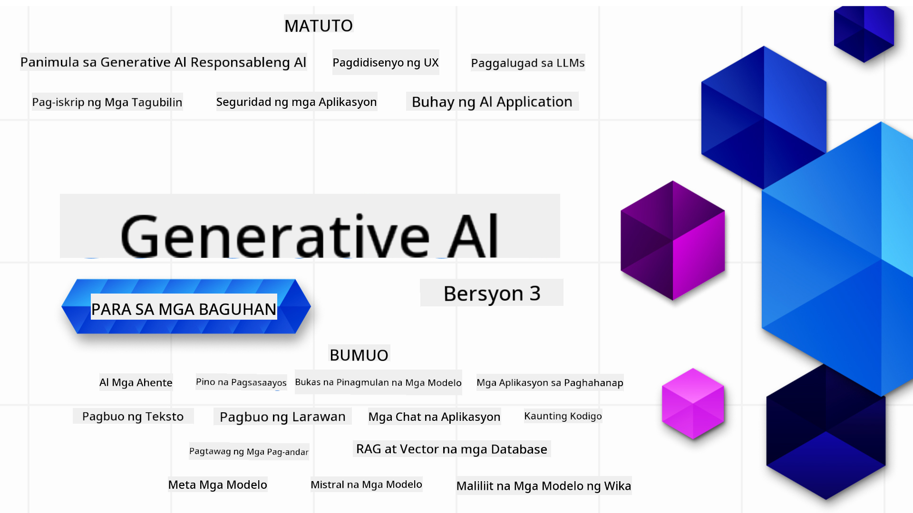

<!--
CO_OP_TRANSLATOR_METADATA:
{
  "original_hash": "c2ee25895ebbfa1a52868bb6eab686fc",
  "translation_date": "2025-05-19T11:56:03+00:00",
  "source_file": "README.md",
  "language_code": "tl"
}
-->

### 21 Aralin na nagtuturo ng lahat ng kailangan mong malaman upang magsimulang bumuo ng mga aplikasyon ng Generative AI

### 🌐 Suporta sa Maraming Wika

#### Sinusuportahan sa pamamagitan ng GitHub Action (Awtomatiko at Palaging Napapanahon)
[Pranses](../fr/README.md) | [Espanyol](../es/README.md) | [Aleman](../de/README.md) | [Ruso](../ru/README.md) | [Arabe](../ar/README.md) | [Persian (Farsi)](../fa/README.md) | [Urdu](../ur/README.md) | [Tsino (Pinapayak)](../zh/README.md) | [Tsino (Tradisyonal, Macau)](../mo/README.md) | [Tsino (Tradisyonal, Hong Kong)](../hk/README.md) | [Tsino (Tradisyonal, Taiwan)](../tw/README.md) | [Hapon](../ja/README.md) | [Koreano](../ko/README.md) | [Hindi](../hi/README.md) | [Bengali](../bn/README.md) | [Marathi](../mr/README.md) | [Nepali](../ne/README.md) | [Punjabi (Gurmukhi)](../pa/README.md) | [Portuges (Portugal)](../pt/README.md) | [Portuges (Brazil)](../br/README.md) | [Italyano](../it/README.md) | [Polish](../pl/README.md) | [Turko](../tr/README.md) | [Griyego](../el/README.md) | [Thai](../th/README.md) | [Swedish](../sv/README.md) | [Danish](../da/README.md) | [Norwegian](../no/README.md) | [Finnish](../fi/README.md) | [Dutch](../nl/README.md) | [Hebreo](../he/README.md) | [Vietnamese](../vi/README.md) | [Indonesian](../id/README.md) | [Malay](../ms/README.md) | [Tagalog (Filipino)](./README.md) | [Swahili](../sw/README.md) | [Hungarian](../hu/README.md) | [Czech](../cs/README.md) | [Slovak](../sk/README.md) | [Romanian](../ro/README.md) | [Bulgarian](../bg/README.md) | [Serbian (Cyrillic)](../sr/README.md) | [Croatian](../hr/README.md) | [Slovenian](../sl/README.md)
# Generative AI para sa mga Baguhan (Bersyon 3) - Isang Kurso

Matutunan ang mga batayan ng paggawa ng Generative AI applications gamit ang aming 21-leksyon na komprehensibong kurso ng Microsoft Cloud Advocates.

## 🌱 Pagsisimula

Ang kursong ito ay may 21 na leksyon. Bawat leksyon ay sumasaklaw sa sariling paksa kaya maaari kang magsimula kung saan mo gusto!

Ang mga leksyon ay tinatawag na "Learn" leksyon na nagpapaliwanag ng isang konsepto ng Generative AI o "Build" leksyon na nagpapaliwanag ng isang konsepto at mga halimbawa ng code sa parehong **Python** at **TypeScript** kung maaari.

Para sa mga .NET Developers, tingnan ang [Generative AI para sa mga Baguhan (.NET Edition)](https://github.com/microsoft/Generative-AI-for-beginners-dotnet?WT.mc_id=academic-105485-koreyst)!

Ang bawat leksyon ay may kasamang "Keep Learning" na seksyon na may karagdagang mga kagamitan sa pag-aaral.

## Ano ang Kailangan Mo
### Para patakbuhin ang code ng kursong ito, maaari mong gamitin ang alinman sa:
 - [Azure OpenAI Service](https://aka.ms/genai-beginners/azure-open-ai?WT.mc_id=academic-105485-koreyst) - **Mga Leksyon:** "aoai-assignment"
 - [GitHub Marketplace Model Catalog](https://aka.ms/genai-beginners/gh-models?WT.mc_id=academic-105485-koreyst) - **Mga Leksyon:** "githubmodels"
 - [OpenAI API](https://aka.ms/genai-beginners/open-ai?WT.mc_id=academic-105485-koreyst) - **Mga Leksyon:** "oai-assignment"

- Pangunahing kaalaman sa Python o TypeScript ay makakatulong - \*Para sa mga ganap na baguhan, tingnan ang mga kursong ito sa [Python](https://aka.ms/genai-beginners/python?WT.mc_id=academic-105485-koreyst) at [TypeScript](https://aka.ms/genai-beginners/typescript?WT.mc_id=academic-105485-koreyst)
- Isang GitHub account para [i-fork ang buong repo na ito](https://aka.ms/genai-beginners/github?WT.mc_id=academic-105485-koreyst) sa iyong sariling GitHub account

Lumikha kami ng isang **[Course Setup](./00-course-setup/README.md?WT.mc_id=academic-105485-koreyst)** leksyon para tulungan ka sa pag-setup ng iyong development environment.

Huwag kalimutan na [i-star (🌟) ang repo na ito](https://docs.github.com/en/get-started/exploring-projects-on-github/saving-repositories-with-stars?WT.mc_id=academic-105485-koreyst) para mas madali mo itong mahanap sa hinaharap.

## 🧠 Handa nang I-deploy?

Kung naghahanap ka ng mas advanced na mga halimbawa ng code, tingnan ang aming [koleksyon ng Generative AI Code Samples](https://aka.ms/genai-beg-code?WT.mc_id=academic-105485-koreyst) sa parehong **Python** at **TypeScript**.

## 🗣️ Makipagkita sa Ibang mga Nag-aaral, Makakuha ng Suporta

Sumali sa aming [opisyal na Azure AI Foundry Discord server](https://aka.ms/genai-discord?WT.mc_id=academic-105485-koreyst) para makipagkita at makipag-network sa iba pang mga nag-aaral na kumukuha ng kursong ito at makakuha ng suporta.

Magtanong o magbahagi ng feedback ng produkto sa aming [Azure AI Foundry Developer Forum](https://aka.ms/azureaifoundry/forum) sa Github.

## 🚀 Nagtatayo ng Startup?

Mag-sign up sa [Microsoft for Startups Founders Hub](https://aka.ms/genai-foundershub?WT.mc_id=academic-105485-koreyst) para makatanggap ng **libreng OpenAI credits** at hanggang **$150k para sa Azure credits upang ma-access ang OpenAI models sa pamamagitan ng Azure OpenAI Services**.

## 🙏 Nais tumulong?

Mayroon ka bang mga mungkahi o nakahanap ng mga maling ispeling o error sa code? [Magtaas ng isyu](https://github.com/microsoft/generative-ai-for-beginners/issues?WT.mc_id=academic-105485-koreyst) o [Lumikha ng pull request](https://github.com/microsoft/generative-ai-for-beginners/pulls?WT.mc_id=academic-105485-koreyst)

## 📂 Bawat leksyon ay naglalaman ng:

- Isang maikling video na pagpapakilala sa paksa
- Isang nakasulat na leksyon na matatagpuan sa README
- Mga halimbawa ng code sa Python at TypeScript na sumusuporta sa Azure OpenAI at OpenAI API
- Mga link sa karagdagang mapagkukunan para ipagpatuloy ang iyong pag-aaral

## 🗃️ Mga Leksyon

| #   | **Link ng Leksyon**                                                                                                                              | **Deskripsyon**                                                                                 | **Video**                                                                   | **Karagdagang Pag-aaral**                                                             |
| --- | -------------------------------------------------------------------------------------------------------------------------------------------- | ----------------------------------------------------------------------------------------------- | --------------------------------------------------------------------------- | ------------------------------------------------------------------------------ |
| 00  | [Course Setup](./00-course-setup/README.md?WT.mc_id=academic-105485-koreyst)                                                                 | **Learn:** Paano I-setup ang Iyong Development Environment                                            | Video Coming Soon                                                                 | [Learn More](https://aka.ms/genai-collection?WT.mc_id=academic-105485-koreyst) |
| 01  | [Introduction to Generative AI and LLMs](./01-introduction-to-genai/README.md?WT.mc_id=academic-105485-koreyst)                              | **Learn:** Pag-unawa sa kung ano ang Generative AI at paano gumagana ang Large Language Models (LLMs).       | [Video](https://aka.ms/gen-ai-lesson-1-gh?WT.mc_id=academic-105485-koreyst) | [Learn More](https://aka.ms/genai-collection?WT.mc_id=academic-105485-koreyst) |
| 02  | [Exploring and comparing different LLMs](./02-exploring-and-comparing-different-llms/README.md?WT.mc_id=academic-105485-koreyst)             | **Learn:** Paano pumili ng tamang modelo para sa iyong use case                                      | [Video](https://aka.ms/gen-ai-lesson2-gh?WT.mc_id=academic-105485-koreyst)  | [Learn More](https://aka.ms/genai-collection?WT.mc_id=academic-105485-koreyst) |
| 03  | [Using Generative AI Responsibly](./03-using-generative-ai-responsibly/README.md?WT.mc_id=academic-105485-koreyst)                           | **Learn:** Paano bumuo ng Generative AI Applications nang responsable                                  | [Video](https://aka.ms/gen-ai-lesson3-gh?WT.mc_id=academic-105485-koreyst)  | [Learn More](https://aka.ms/genai-collection?WT.mc_id=academic-105485-koreyst) |
| 04  | [Understanding Prompt Engineering Fundamentals](./04-prompt-engineering-fundamentals/README.md?WT.mc_id=academic-105485-koreyst)             | **Learn:** Hands-on Prompt Engineering Best Practices                                           | [Video](https://aka.ms/gen-ai-lesson4-gh?WT.mc_id=academic-105485-koreyst)  | [Learn More](https://aka.ms/genai-collection?WT.mc_id=academic-105485-koreyst) |
| 05  | [Paglikha ng Advanced na Prompts](./05-advanced-prompts/README.md?WT.mc_id=academic-105485-koreyst)                                                | **Matuto:** Paano mag-apply ng mga teknik sa prompt engineering na nagpapabuti sa resulta ng iyong prompts. | [Video](https://aka.ms/gen-ai-lesson5-gh?WT.mc_id=academic-105485-koreyst)  | [Matuto Pa](https://aka.ms/genai-collection?WT.mc_id=academic-105485-koreyst) |
| 06  | [Pagbuo ng Text Generation Applications](./06-text-generation-apps/README.md?WT.mc_id=academic-105485-koreyst)                                | **Gumawa:** Isang text generation app gamit ang Azure OpenAI / OpenAI API                                | [Video](https://aka.ms/gen-ai-lesson6-gh?WT.mc_id=academic-105485-koreyst)  | [Matuto Pa](https://aka.ms/genai-collection?WT.mc_id=academic-105485-koreyst) |
| 07  | [Pagbuo ng Chat Applications](./07-building-chat-applications/README.md?WT.mc_id=academic-105485-koreyst)                                     | **Gumawa:** Mga teknik para sa mabisang pagbuo at integrasyon ng chat applications.               | [Video](https://aka.ms/gen-ai-lessons7-gh?WT.mc_id=academic-105485-koreyst) | [Matuto Pa](https://aka.ms/genai-collection?WT.mc_id=academic-105485-koreyst) |
| 08  | [Pagbuo ng Search Apps gamit ang Vector Databases](./08-building-search-applications/README.md?WT.mc_id=academic-105485-koreyst)                        | **Gumawa:** Isang search application na gumagamit ng Embeddings para maghanap ng data.                        | [Video](https://aka.ms/gen-ai-lesson8-gh?WT.mc_id=academic-105485-koreyst)  | [Matuto Pa](https://aka.ms/genai-collection?WT.mc_id=academic-105485-koreyst) |
| 09  | [Pagbuo ng Image Generation Applications](./09-building-image-applications/README.md?WT.mc_id=academic-105485-koreyst)                        | **Gumawa:** Isang application para sa paglikha ng imahe                                                       | [Video](https://aka.ms/gen-ai-lesson9-gh?WT.mc_id=academic-105485-koreyst)  | [Matuto Pa](https://aka.ms/genai-collection?WT.mc_id=academic-105485-koreyst) |
| 10  | [Pagbuo ng Low Code AI Applications](./10-building-low-code-ai-applications/README.md?WT.mc_id=academic-105485-koreyst)                       | **Gumawa:** Isang Generative AI application gamit ang Low Code tools                                     | [Video](https://aka.ms/gen-ai-lesson10-gh?WT.mc_id=academic-105485-koreyst) | [Matuto Pa](https://aka.ms/genai-collection?WT.mc_id=academic-105485-koreyst) |
| 11  | [Pag-integrate ng External Applications gamit ang Function Calling](./11-integrating-with-function-calling/README.md?WT.mc_id=academic-105485-koreyst) | **Gumawa:** Ano ang function calling at ang mga gamit nito para sa applications                          | [Video](https://aka.ms/gen-ai-lesson11-gh?WT.mc_id=academic-105485-koreyst) | [Matuto Pa](https://aka.ms/genai-collection?WT.mc_id=academic-105485-koreyst) |
| 12  | [Pagdidisenyo ng UX para sa AI Applications](./12-designing-ux-for-ai-applications/README.md?WT.mc_id=academic-105485-koreyst)                         | **Matuto:** Paano mag-apply ng mga prinsipyo ng UX design kapag nagde-develop ng Generative AI Applications         | [Video](https://aka.ms/gen-ai-lesson12-gh?WT.mc_id=academic-105485-koreyst) | [Matuto Pa](https://aka.ms/genai-collection?WT.mc_id=academic-105485-koreyst) |
| 13  | [Pag-secure ng Iyong Generative AI Applications](./13-securing-ai-applications/README.md?WT.mc_id=academic-105485-koreyst)                         | **Matuto:** Ang mga banta at panganib sa AI systems at mga pamamaraan para i-secure ang mga sistemang ito.             | [Video](https://aka.ms/gen-ai-lesson13-gh?WT.mc_id=academic-105485-koreyst) | [Matuto Pa](https://aka.ms/genai-collection?WT.mc_id=academic-105485-koreyst) |
| 14  | [Ang Generative AI Application Lifecycle](./14-the-generative-ai-application-lifecycle/README.md?WT.mc_id=academic-105485-koreyst)           | **Matuto:** Ang mga tools at metrics para i-manage ang LLM Lifecycle at LLMOps                         | [Video](https://aka.ms/gen-ai-lesson14-gh?WT.mc_id=academic-105485-koreyst) | [Matuto Pa](https://aka.ms/genai-collection?WT.mc_id=academic-105485-koreyst) |
| 15  | [Retrieval Augmented Generation (RAG) at Vector Databases](./15-rag-and-vector-databases/README.md?WT.mc_id=academic-105485-koreyst)        | **Bumuo:** Isang aplikasyon gamit ang RAG Framework para kunin ang embeddings mula sa Vector Databases  | [Video](https://aka.ms/gen-ai-lesson15-gh?WT.mc_id=academic-105485-koreyst) | [Matuto Pa](https://aka.ms/genai-collection?WT.mc_id=academic-105485-koreyst) |
| 16  | [Open Source Models at Hugging Face](./16-open-source-models/README.md?WT.mc_id=academic-105485-koreyst)                                    | **Bumuo:** Isang aplikasyon gamit ang open source models na makukuha sa Hugging Face                    | [Video](https://aka.ms/gen-ai-lesson16-gh?WT.mc_id=academic-105485-koreyst) | [Matuto Pa](https://aka.ms/genai-collection?WT.mc_id=academic-105485-koreyst) |
| 17  | [AI Agents](./17-ai-agents/README.md?WT.mc_id=academic-105485-koreyst)                                                                       | **Bumuo:** Isang aplikasyon gamit ang AI Agent Framework                                           | [Video](https://aka.ms/gen-ai-lesson17-gh?WT.mc_id=academic-105485-koreyst) | [Matuto Pa](https://aka.ms/genai-collection?WT.mc_id=academic-105485-koreyst) |
| 18  | [Fine-Tuning LLMs](./18-fine-tuning/README.md?WT.mc_id=academic-105485-koreyst)                                                              | **Matuto:** Ano, bakit at paano i-fine-tune ang LLMs                                            | [Video](https://aka.ms/gen-ai-lesson18-gh?WT.mc_id=academic-105485-koreyst) | [Matuto Pa](https://aka.ms/genai-collection?WT.mc_id=academic-105485-koreyst) |
| 19  | [Pagbuo gamit ang SLMs](./19-slm/README.md?WT.mc_id=academic-105485-koreyst)                                                              | **Matuto:** Ang mga benepisyo ng pagbuo gamit ang Small Language Models                                            | Video Coming Soon | [Matuto Pa](https://aka.ms/genai-collection?WT.mc_id=academic-105485-koreyst) |
| 20  | [Pagbuo gamit ang Mistral Models](./20-mistral/README.md?WT.mc_id=academic-105485-koreyst)                                                              | **Matuto:** Ang mga tampok at pagkakaiba ng Mistral Family Models                                           | Video Coming Soon | [Matuto Pa](https://aka.ms/genai-collection?WT.mc_id=academic-105485-koreyst) |
| 21  | [Pagbuo gamit ang Meta Models](./21-meta/README.md?WT.mc_id=academic-105485-koreyst)                                                              | **Matuto:** Ang mga tampok at pagkakaiba ng Meta Family Models                                           | Video Coming Soon | [Matuto Pa](https://aka.ms/genai-collection?WT.mc_id=academic-105485-koreyst) |

### 🌟 Espesyal na pasasalamat

Espesyal na pasasalamat kay [**John Aziz**](https://www.linkedin.com/in/john0isaac/) para sa paglikha ng lahat ng GitHub Actions at workflows

[**Bernhard Merkle**](https://www.linkedin.com/in/bernhard-merkle-738b73/) para sa pagbibigay ng mahahalagang kontribusyon sa bawat aralin upang mapabuti ang karanasan ng mga nag-aaral at ng code.

## 🎒 Iba pang mga Kurso

Ang aming koponan ay gumagawa ng iba pang mga kurso! Tingnan ang:

- [**BAGO** AI Agents para sa mga Nagsisimula](https://github.com/microsoft/ai-agents-for-beginners?WT.mc_id=academic-105485-koreyst)
- [**BAGO** Generative AI para sa mga Nagsisimula gamit ang .NET](https://github.com/microsoft/Generative-AI-for-beginners-dotnet?WT.mc_id=academic-105485-koreyst)
- [**BAGO** Generative AI para sa mga Nagsisimula gamit ang JavaScript](https://aka.ms/genai-js-course?WT.mc_id=academic-105485-koreyst)
- [ML para sa mga Nagsisimula](https://aka.ms/ml-beginners?WT.mc_id=academic-105485-koreyst)
- [Data Science para sa mga Nagsisimula](https://aka.ms/datascience-beginners?WT.mc_id=academic-105485-koreyst)
- [AI para sa mga Nagsisimula](https://aka.ms/ai-beginners?WT.mc_id=academic-105485-koreyst)
- [Cybersecurity para sa mga Nagsisimula](https://github.com/microsoft/Security-101??WT.mc_id=academic-96948-sayoung)
- [Web Dev para sa mga Nagsisimula](https://aka.ms/webdev-beginners?WT.mc_id=academic-105485-koreyst)
- [IoT para sa mga Nagsisimula](https://aka.ms/iot-beginners?WT.mc_id=academic-105485-koreyst)
- [XR Development para sa mga Nagsisimula](https://github.com/microsoft/xr-development-for-beginners?WT.mc_id=academic-105485-koreyst)
- [Pagpapahusay sa GitHub Copilot para sa AI Paired Programming](https://aka.ms/GitHubCopilotAI?WT.mc_id=academic-105485-koreyst)
- [Pagpapahusay sa GitHub Copilot para sa mga Developer ng C#/.NET](https://github.com/microsoft/mastering-github-copilot-for-dotnet-csharp-developers?WT.mc_id=academic-105485-koreyst)
- [Piliin ang Iyong Sariling Copilot na Pakikipagsapalaran](https://github.com/microsoft/CopilotAdventures?WT.mc_id=academic-105485-koreyst)

**Paunawa**:  
Ang dokumentong ito ay isinalin gamit ang AI translation service [Co-op Translator](https://github.com/Azure/co-op-translator). Bagama't pinagsisikapan naming maging tama, mangyaring tandaan na ang mga awtomatikong pagsasalin ay maaaring maglaman ng mga pagkakamali o hindi pagkakatugma. Ang orihinal na dokumento sa kanyang katutubong wika ay dapat ituring na mapagkakatiwalaang mapagkukunan. Para sa kritikal na impormasyon, inirerekomenda ang propesyonal na pagsasalin ng tao. Hindi kami mananagot para sa anumang hindi pagkakaunawaan o maling interpretasyon na nagmumula sa paggamit ng pagsasaling ito.