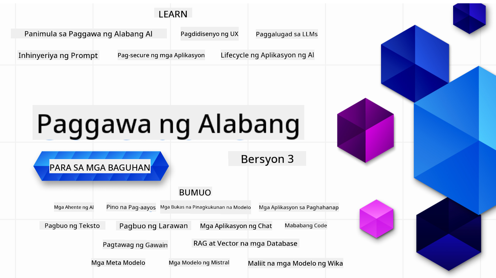

<!--
CO_OP_TRANSLATOR_METADATA:
{
  "original_hash": "6e3f4c8a4f323b8eab1cf11ded304b0f",
  "translation_date": "2025-06-25T08:09:27+00:00",
  "source_file": "README.md",
  "language_code": "tl"
}
-->

### 21 Aralin na nagtuturo ng lahat ng kailangan mong malaman upang magsimula sa pagbuo ng mga aplikasyon ng Generative AI

### 🌐 Suporta sa Multi-Wika

#### Sinusuportahan sa pamamagitan ng GitHub Action (Awtomatik at Palaging Napapanahon)

# Generative AI para sa mga Baguhan (Bersyon 3) - Isang Kurso

Matutunan ang mga pangunahing kaalaman sa pagbuo ng mga aplikasyon ng Generative AI sa pamamagitan ng aming 21-aralin na komprehensibong kurso mula sa Microsoft Cloud Advocates.

## 🌱 Pagsisimula

Ang kursong ito ay may 21 aralin. Bawat aralin ay tumatalakay sa sariling paksa kaya maaari kang magsimula saan mo man gusto!

Ang mga aralin ay nakalabel bilang "Learn" na aralin na nagpapaliwanag ng konsepto ng Generative AI o "Build" na aralin na nagpapaliwanag ng konsepto at mga halimbawa ng code sa parehong **Python** at **TypeScript** kung maaari.

Para sa mga .NET Developers, tingnan ang [Generative AI para sa mga Baguhan (.NET Edition)](https://github.com/microsoft/Generative-AI-for-beginners-dotnet?WT.mc_id=academic-105485-koreyst)!

Ang bawat aralin ay mayroon ding seksyon na "Keep Learning" na may karagdagang mga kasangkapan sa pag-aaral.

## Ano ang Kailangan Mo
### Upang patakbuhin ang code ng kursong ito, maaari mong gamitin alinman sa:
 - [Azure OpenAI Service](https://aka.ms/genai-beginners/azure-open-ai?WT.mc_id=academic-105485-koreyst) - **Mga Aralin:** "aoai-assignment"
 - [GitHub Marketplace Model Catalog](https://aka.ms/genai-beginners/gh-models?WT.mc_id=academic-105485-koreyst) - **Mga Aralin:** "githubmodels"
 - [OpenAI API](https://aka.ms/genai-beginners/open-ai?WT.mc_id=academic-105485-koreyst) - **Mga Aralin:** "oai-assignment" 

- Ang pangunahing kaalaman sa Python o TypeScript ay makakatulong - \*Para sa mga ganap na baguhan, tingnan ang mga kursong ito sa [Python](https://aka.ms/genai-beginners/python?WT.mc_id=academic-105485-koreyst) at [TypeScript](https://aka.ms/genai-beginners/typescript?WT.mc_id=academic-105485-koreyst)
- Isang GitHub account upang [i-fork ang buong repo na ito](https://aka.ms/genai-beginners/github?WT.mc_id=academic-105485-koreyst) sa iyong sariling GitHub account

Nilikha namin ang isang **[Course Setup](./00-course-setup/README.md?WT.mc_id=academic-105485-koreyst)** na aralin upang matulungan ka sa pag-set up ng iyong development environment.

Huwag kalimutang [i-star (🌟) ang repo na ito](https://docs.github.com/en/get-started/exploring-projects-on-github/saving-repositories-with-stars?WT.mc_id=academic-105485-koreyst) upang mas madali mo itong makita sa hinaharap.

## 🧠 Handa nang I-deploy?

Kung naghahanap ka ng mas advanced na mga halimbawa ng code, tingnan ang aming [koleksyon ng mga Generative AI Code Samples](https://aka.ms/genai-beg-code?WT.mc_id=academic-105485-koreyst) sa parehong **Python** at **TypeScript**.

## 🗣️ Makipagkita sa Ibang mga Nag-aaral, Humingi ng Suporta

Sumali sa aming [opisyal na Azure AI Foundry Discord server](https://aka.ms/genai-discord?WT.mc_id=academic-105485-koreyst) upang makilala at makipag-network sa iba pang mga nag-aaral na kumukuha ng kursong ito at humingi ng suporta.

Magtanong ng mga katanungan o magbahagi ng feedback sa produkto sa aming [Azure AI Foundry Developer Forum](https://aka.ms/azureaifoundry/forum) sa Github.

## 🚀 Nagbubuo ng Startup?

Mag-sign up para sa [Microsoft for Startups Founders Hub](https://aka.ms/genai-foundershub?WT.mc_id=academic-105485-koreyst) upang makatanggap ng **libreng OpenAI credits** at hanggang sa **$150k patungo sa Azure credits upang ma-access ang mga OpenAI model sa pamamagitan ng Azure OpenAI Services**.

## 🙏 Nais tumulong?

Mayroon ka bang mga mungkahi o nakakita ng mga pagkakamali sa spelling o code? [Mag-raise ng isyu](https://github.com/microsoft/generative-ai-for-beginners/issues?WT.mc_id=academic-105485-koreyst) o [Lumikha ng pull request](https://github.com/microsoft/generative-ai-for-beginners/pulls?WT.mc_id=academic-105485-koreyst)

## 📂 Ang bawat aralin ay may kasamang:

- Isang maikling video na pagpapakilala sa paksa
- Isang nakasulat na aralin na matatagpuan sa README
- Mga halimbawa ng code sa Python at TypeScript na sumusuporta sa Azure OpenAI at OpenAI API
- Mga link sa karagdagang mapagkukunan upang ipagpatuloy ang iyong pag-aaral

## 🗃️ Mga Aralin

| #   | **Link ng Aralin**                                                                                                                              | **Paglalarawan**                                                                                 | **Video**                                                                   | **Karagdagang Pag-aaral**                                                             |
| --- | -------------------------------------------------------------------------------------------------------------------------------------------- | ----------------------------------------------------------------------------------------------- | --------------------------------------------------------------------------- | ------------------------------------------------------------------------------ |
| 00  | [Course Setup](./00-course-setup/README.md?WT.mc_id=academic-105485-koreyst)                                                                 | **Matutunan:** Paano I-set up ang Iyong Development Environment                                            | Video Darating Sa Malapit na Panahon                                                                 | [Matuto Pa](https://aka.ms/genai-collection?WT.mc_id=academic-105485-koreyst) |
| 01  | [Panimula sa Generative AI at LLMs](./01-introduction-to-genai/README.md?WT.mc_id=academic-105485-koreyst)                              | **Matutunan:** Pag-unawa sa kung ano ang Generative AI at paano gumagana ang Malalaking Language Models (LLMs).       | [Video](https://aka.ms/gen-ai-lesson-1-gh?WT.mc_id=academic-105485-koreyst) | [Matuto Pa](https://aka.ms/genai-collection?WT.mc_id=academic-105485-koreyst) |
| 02  | [Pag-explore at paghahambing ng iba't ibang LLMs](./02-exploring-and-comparing-different-llms/README.md?WT.mc_id=academic-105485-koreyst)             | **Matutunan:** Paano pumili ng tamang model para sa iyong kaso                                      | [Video](https://aka.ms/gen-ai-lesson2-gh?WT.mc_id=academic-105485-koreyst)  | [Matuto Pa](https://aka.ms/genai-collection?WT.mc_id=academic-105485-koreyst) |
| 03  | [Paggamit ng Generative AI nang Responsable](./03-using-generative-ai-responsibly/README.md?WT.mc_id=academic-105485-koreyst)                           | **Matutunan:** Paano bumuo ng mga Aplikasyon ng Generative AI nang responsable                                  | [Video](https://aka.ms/gen-ai-lesson3-gh?WT.mc_id=academic-105485-koreyst)  | [Matuto Pa](https://aka.ms/genai-collection?WT.mc_id=academic-105485-koreyst) |
| 04  | [Pag-unawa sa mga Batayang Prinsipyo ng Prompt Engineering](./04-prompt-engineering-fundamentals/README.md?WT.mc_id=academic-105485-koreyst)             | **Matutunan:** Mga Praktikal na Pinakamahusay na Kasanayan sa Prompt Engineering                                           | [Video](https://aka.ms/gen-ai-lesson4-gh?WT.mc_id=academic-105485-koreyst)  | [Matuto Pa](https://aka.ms/genai-collection?WT.mc_id=academic-105485-koreyst) |
| 05  | [Paglikha ng Advanced na Prompts](./05-advanced-prompts/README.md?WT.mc_id=academic-105485-koreyst)                                                | **Matutunan:** Paano gamitin ang mga teknik sa prompt engineering na nagpapabuti sa resulta ng iyong mga prompts. | [Video](https://aka.ms/gen-ai-lesson5-gh?WT.mc_id=academic-105485-koreyst)  | [Matuto Pa](https://aka.ms/genai-collection?WT.mc_id=academic-105485-koreyst) |
| 06  | [Pagbuo ng Mga Aplikasyon sa Paggawa ng Teksto](./06-text-generation-apps/README.md?WT.mc_id=academic-105485-koreyst)                                | **Gumawa:** Isang app para sa paggawa ng teksto gamit ang Azure OpenAI / OpenAI API                                | [Video](https://aka.ms/gen-ai-lesson6-gh?WT.mc_id=academic-105485-koreyst)  | [Matuto Pa](https://aka.ms/genai-collection?WT.mc_id=academic-105485-koreyst) |
| 07  | [Pagbuo ng Mga Aplikasyon sa Chat](./07-building-chat-applications/README.md?WT.mc_id=academic-105485-koreyst)                                     | **Gumawa:** Mga teknik para sa mahusay na pagbuo at pagsasama ng mga chat application.               | [Video](https://aka.ms/gen-ai-lessons7-gh?WT.mc_id=academic-105485-koreyst) | [Matuto Pa](https://aka.ms/genai-collection?WT.mc_id=academic-105485-koreyst) |
| 08  | [Pagbuo ng Mga Aplikasyon sa Paghahanap gamit ang Vector Databases](./08-building-search-applications/README.md?WT.mc_id=academic-105485-koreyst)                        | **Gumawa:** Isang application sa paghahanap na gumagamit ng Embeddings para maghanap ng data.                        | [Video](https://aka.ms/gen-ai-lesson8-gh?WT.mc_id=academic-105485-koreyst)  | [Matuto Pa](https://aka.ms/genai-collection?WT.mc_id=academic-105485-koreyst) |
| 09  | [Pagbuo ng Mga Aplikasyon sa Paggawa ng Imahe](./09-building-image-applications/README.md?WT.mc_id=academic-105485-koreyst)                        | **Gumawa:** Isang application para sa paggawa ng imahe                                                       | [Video](https://aka.ms/gen-ai-lesson9-gh?WT.mc_id=academic-105485-koreyst)  | [Matuto Pa](https://aka.ms/genai-collection?WT.mc_id=academic-105485-koreyst) |
| 10  | [Pagbuo ng Low Code AI Applications](./10-building-low-code-ai-applications/README.md?WT.mc_id=academic-105485-koreyst)                       | **Gumawa:** Isang Generative AI application gamit ang Low Code tools                                     | [Video](https://aka.ms/gen-ai-lesson10-gh?WT.mc_id=academic-105485-koreyst) | [Matuto Pa](https://aka.ms/genai-collection?WT.mc_id=academic-105485-koreyst) |
| 11  | [Pagsasama ng Mga Panlabas na Aplikasyon gamit ang Function Calling](./11-integrating-with-function-calling/README.md?WT.mc_id=academic-105485-koreyst) | **Gumawa:** Ano ang function calling at ang mga kaso ng paggamit nito para sa mga application                          | [Video](https://aka.ms/gen-ai-lesson11-gh?WT.mc_id=academic-105485-koreyst) | [Matuto Pa](https://aka.ms/genai-collection?WT.mc_id=academic-105485-koreyst) |
| 12  | [Pagdidisenyo ng UX para sa AI Applications](./12-designing-ux-for-ai-applications/README.md?WT.mc_id=academic-105485-koreyst)                         | **Matutunan:** Paano ilapat ang mga prinsipyo ng disenyo ng UX kapag nagde-develop ng Generative AI Applications         | [Video](https://aka.ms/gen-ai-lesson12-gh?WT.mc_id=academic-105485-koreyst) | [Matuto Pa](https://aka.ms/genai-collection?WT.mc_id=academic-105485-koreyst) |
| 13  | [Pag-secure ng Iyong Generative AI Applications](./13-securing-ai-applications/README.md?WT.mc_id=academic-105485-koreyst)                         | **Matutunan:** Ang mga banta at panganib sa AI systems at mga pamamaraan para ma-secure ang mga sistemang ito.             | [Video](https://aka.ms/gen-ai-lesson13-gh?WT.mc_id=academic-105485-koreyst) | [Matuto Pa](https://aka.ms/genai-collection?WT.mc_id=academic-105485-koreyst) |
| 14  | [Ang Lifecycle ng Generative AI Application](./14-the-generative-ai-application-lifecycle/README.md?WT.mc_id=academic-105485-koreyst)           | **Matutunan:** Ang mga tool at sukatan para pamahalaan ang LLM Lifecycle at LLMOps                         | [Video](https://aka.ms/gen-ai-lesson14-gh?WT.mc_id=academic-105485-koreyst) | [Matuto Pa](https://aka.ms/genai-collection?WT.mc_id=academic-105485-koreyst) |
| 15  | [Retrieval Augmented Generation (RAG) at Vector Databases](./15-rag-and-vector-databases/README.md?WT.mc_id=academic-105485-koreyst)        | **Gumawa:** Isang aplikasyon gamit ang RAG Framework para makuha ang embeddings mula sa Vector Databases  | [Video](https://aka.ms/gen-ai-lesson15-gh?WT.mc_id=academic-105485-koreyst) | [Alamin Pa](https://aka.ms/genai-collection?WT.mc_id=academic-105485-koreyst) |
| 16  | [Open Source Models at Hugging Face](./16-open-source-models/README.md?WT.mc_id=academic-105485-koreyst)                                    | **Gumawa:** Isang aplikasyon gamit ang open source models na makukuha sa Hugging Face                    | [Video](https://aka.ms/gen-ai-lesson16-gh?WT.mc_id=academic-105485-koreyst) | [Alamin Pa](https://aka.ms/genai-collection?WT.mc_id=academic-105485-koreyst) |
| 17  | [AI Agents](./17-ai-agents/README.md?WT.mc_id=academic-105485-koreyst)                                                                       | **Gumawa:** Isang aplikasyon gamit ang AI Agent Framework                                           | [Video](https://aka.ms/gen-ai-lesson17-gh?WT.mc_id=academic-105485-koreyst) | [Alamin Pa](https://aka.ms/genai-collection?WT.mc_id=academic-105485-koreyst) |
| 18  | [Fine-Tuning LLMs](./18-fine-tuning/README.md?WT.mc_id=academic-105485-koreyst)                                                              | **Matuto:** Ang ano, bakit at paano ng fine-tuning LLMs                                            | [Video](https://aka.ms/gen-ai-lesson18-gh?WT.mc_id=academic-105485-koreyst) | [Alamin Pa](https://aka.ms/genai-collection?WT.mc_id=academic-105485-koreyst) |
| 19  | [Pagbuo gamit ang SLMs](./19-slm/README.md?WT.mc_id=academic-105485-koreyst)                                                              | **Matuto:** Ang mga benepisyo ng pagbuo gamit ang Small Language Models                                            | Video Paparating | [Alamin Pa](https://aka.ms/genai-collection?WT.mc_id=academic-105485-koreyst) |
| 20  | [Pagbuo gamit ang Mistral Models](./20-mistral/README.md?WT.mc_id=academic-105485-koreyst)                                                              | **Matuto:** Ang mga tampok at pagkakaiba ng Mistral Family Models                                           | Video Paparating | [Alamin Pa](https://aka.ms/genai-collection?WT.mc_id=academic-105485-koreyst) |
| 21  | [Pagbuo gamit ang Meta Models](./21-meta/README.md?WT.mc_id=academic-105485-koreyst)                                                              | **Matuto:** Ang mga tampok at pagkakaiba ng Meta Family Models                                           | Video Paparating | [Alamin Pa](https://aka.ms/genai-collection?WT.mc_id=academic-105485-koreyst) |

### 🌟 Espesyal na pasasalamat

Espesyal na pasasalamat kay [**John Aziz**](https://www.linkedin.com/in/john0isaac/) para sa paggawa ng lahat ng GitHub Actions at workflows

[**Bernhard Merkle**](https://www.linkedin.com/in/bernhard-merkle-738b73/) para sa paggawa ng mahahalagang kontribusyon sa bawat aralin upang mapabuti ang karanasan ng mga mag-aaral at code. 

## 🎒 Iba pang mga Kurso

Ang aming koponan ay gumagawa ng iba pang mga kurso! Tingnan ang:

- [**BAGO** Model Context Protocol para sa Mga Nagsisimula](https://github.com/microsoft/mcp-for-beginners?WT.mc_id=academic-105485-koreyst)
- [AI Agents para sa Mga Nagsisimula](https://github.com/microsoft/ai-agents-for-beginners?WT.mc_id=academic-105485-koreyst)
- [Generative AI para sa Mga Nagsisimula gamit ang .NET](https://github.com/microsoft/Generative-AI-for-beginners-dotnet?WT.mc_id=academic-105485-koreyst)
- [Generative AI para sa Mga Nagsisimula gamit ang JavaScript](https://aka.ms/genai-js-course?WT.mc_id=academic-105485-koreyst)
- [ML para sa Mga Nagsisimula](https://aka.ms/ml-beginners?WT.mc_id=academic-105485-koreyst)
- [Data Science para sa Mga Nagsisimula](https://aka.ms/datascience-beginners?WT.mc_id=academic-105485-koreyst)
- [AI para sa Mga Nagsisimula](https://aka.ms/ai-beginners?WT.mc_id=academic-105485-koreyst)
- [Cybersecurity para sa Mga Nagsisimula](https://github.com/microsoft/Security-101??WT.mc_id=academic-96948-sayoung)
- [Web Dev para sa Mga Nagsisimula](https://aka.ms/webdev-beginners?WT.mc_id=academic-105485-koreyst)
- [IoT para sa Mga Nagsisimula](https://aka.ms/iot-beginners?WT.mc_id=academic-105485-koreyst)
- [Pag-unlad ng XR para sa mga Baguhan](https://github.com/microsoft/xr-development-for-beginners?WT.mc_id=academic-105485-koreyst)
- [Pag-master sa GitHub Copilot para sa AI Paired Programming](https://aka.ms/GitHubCopilotAI?WT.mc_id=academic-105485-koreyst)
- [Pag-master sa GitHub Copilot para sa mga Developer ng C#/.NET](https://github.com/microsoft/mastering-github-copilot-for-dotnet-csharp-developers?WT.mc_id=academic-105485-koreyst)
- [Piliin ang Iyong Sariling Pakikipagsapalaran sa Copilot](https://github.com/microsoft/CopilotAdventures?WT.mc_id=academic-105485-koreyst)

**Paunawa**:  
Ang dokumentong ito ay isinalin gamit ang AI translation service na [Co-op Translator](https://github.com/Azure/co-op-translator). Bagamat sinisikap namin ang pagiging tumpak, mangyaring tandaan na ang mga awtomatikong pagsasalin ay maaaring maglaman ng mga pagkakamali o hindi pagkakatumpak. Ang orihinal na dokumento sa kanyang katutubong wika ang dapat ituring na mapagkakatiwalaang sanggunian. Para sa mahalagang impormasyon, inirerekomenda ang propesyonal na pagsasalin ng tao. Hindi kami mananagot para sa anumang hindi pagkakaintindihan o maling interpretasyon na dulot ng paggamit ng pagsasaling ito.