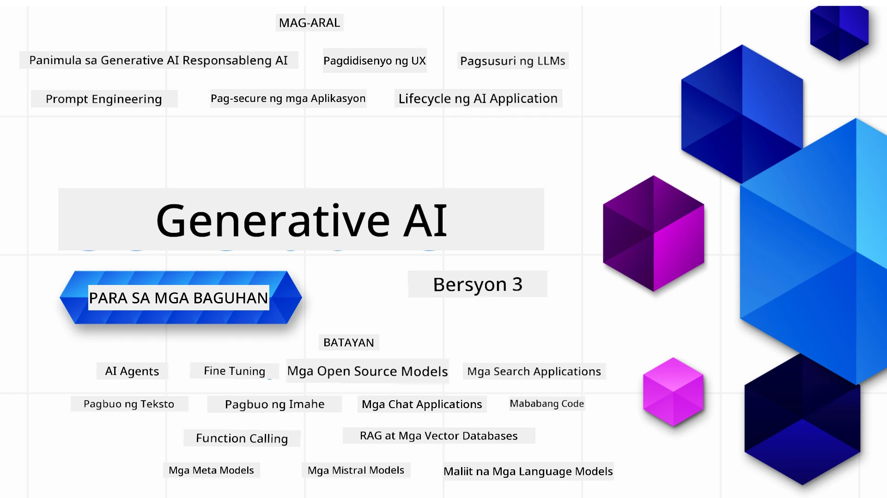

### 21 Mga Aralin na nagtuturo ng lahat ng kailangan mong malaman para makapagsimula sa paggawa ng mga Generative AI na aplikasyon

[](https://github.com/microsoft/Generative-AI-For-Beginners/blob/master/LICENSE?WT.mc_id=academic-105485-koreyst)
[](https://GitHub.com/microsoft/Generative-AI-For-Beginners/graphs/contributors/?WT.mc_id=academic-105485-koreyst)
[](https://GitHub.com/microsoft/Generative-AI-For-Beginners/issues/?WT.mc_id=academic-105485-koreyst)
[](https://GitHub.com/microsoft/Generative-AI-For-Beginners/pulls/?WT.mc_id=academic-105485-koreyst)
[](http://makeapullrequest.com?WT.mc_id=academic-105485-koreyst)

[](https://GitHub.com/microsoft/Generative-AI-For-Beginners/watchers/?WT.mc_id=academic-105485-koreyst)
[](https://GitHub.com/microsoft/Generative-AI-For-Beginners/network/?WT.mc_id=academic-105485-koreyst)
[](https://GitHub.com/microsoft/Generative-AI-For-Beginners/stargazers/?WT.mc_id=academic-105485-koreyst)

[](https://discord.gg/nTYy5BXMWG)

### 🌐 Suporta sa Maramihang Wika

#### Sinusuportahan sa pamamagitan ng GitHub Action (Awtomatiko at Palaging Updated)

<!-- CO-OP TRANSLATOR LANGUAGES TABLE START -->
[Arabic](../ar/README.md) | [Bengali](../bn/README.md) | [Bulgarian](../bg/README.md) | [Burmese (Myanmar)](../my/README.md) | [Chinese (Simplified)](../zh-CN/README.md) | [Chinese (Traditional, Hong Kong)](../zh-HK/README.md) | [Chinese (Traditional, Macau)](../zh-MO/README.md) | [Chinese (Traditional, Taiwan)](../zh-TW/README.md) | [Croatian](../hr/README.md) | [Czech](../cs/README.md) | [Danish](../da/README.md) | [Dutch](../nl/README.md) | [Estonian](../et/README.md) | [Finnish](../fi/README.md) | [French](../fr/README.md) | [German](../de/README.md) | [Greek](../el/README.md) | [Hebrew](../he/README.md) | [Hindi](../hi/README.md) | [Hungarian](../hu/README.md) | [Indonesian](../id/README.md) | [Italian](../it/README.md) | [Japanese](../ja/README.md) | [Kannada](../kn/README.md) | [Khmer](../km/README.md) | [Korean](../ko/README.md) | [Lithuanian](../lt/README.md) | [Malay](../ms/README.md) | [Malayalam](../ml/README.md) | [Marathi](../mr/README.md) | [Nepali](../ne/README.md) | [Nigerian Pidgin](../pcm/README.md) | [Norwegian](../no/README.md) | [Persian (Farsi)](../fa/README.md) | [Polish](../pl/README.md) | [Portuguese (Brazil)](../pt-BR/README.md) | [Portuguese (Portugal)](../pt-PT/README.md) | [Punjabi (Gurmukhi)](../pa/README.md) | [Romanian](../ro/README.md) | [Russian](../ru/README.md) | [Serbian (Cyrillic)](../sr/README.md) | [Slovak](../sk/README.md) | [Slovenian](../sl/README.md) | [Spanish](../es/README.md) | [Swahili](../sw/README.md) | [Swedish](../sv/README.md) | [Tagalog (Filipino)](./README.md) | [Tamil](../ta/README.md) | [Telugu](../te/README.md) | [Thai](../th/README.md) | [Turkish](../tr/README.md) | [Ukrainian](../uk/README.md) | [Urdu](../ur/README.md) | [Vietnamese](../vi/README.md)

> **Mas gusto mo bang i-Clone Lokal?**
>
> Kasama sa repositoryong ito ang higit sa 50 na mga pagsasalin ng wika na nagpapalaki nang malaki sa laki ng pag-download. Para ma-clone nang walang mga pagsasalin, gamitin ang sparse checkout:
>
> **Bash / macOS / Linux:**
> ```bash
> git clone --filter=blob:none --sparse https://github.com/microsoft/generative-ai-for-beginners.git
> cd generative-ai-for-beginners
> git sparse-checkout set --no-cone '/*' '!translations' '!translated_images'
> ```
>
> **CMD (Windows):**
> ```cmd
> git clone --filter=blob:none --sparse https://github.com/microsoft/generative-ai-for-beginners.git
> cd generative-ai-for-beginners
> git sparse-checkout set --no-cone "/*" "!translations" "!translated_images"
> ```
>
> Bibigyan ka nito ng lahat ng kailangan mo para matapos ang kurso na may mas mabilis na pag-download.
<!-- CO-OP TRANSLATOR LANGUAGES TABLE END -->

# Generative AI para sa Mga Nagsisimula (Bersyon 3) - Isang Kurso

Alamin ang mga pundasyon ng paggawa ng mga Generative AI na aplikasyon gamit ang aming 21-araling komprehensibong kurso mula sa Microsoft Cloud Advocates.

## 🌱 Pagsisimula

May 21 aralin ang kursong ito. Bawat aralin ay sumasaklaw ng sariling paksa kaya mag-umpisa kahit saan mo gusto!

Ang mga aralin ay may label na "Learn" para sa mga aralin na nagpapaliwanag ng konsepto ng Generative AI o "Build" para sa mga aralin na nagpapaliwanag ng konsepto at may mga halimbawa ng code sa parehong **Python** at **TypeScript** kung maaari.

Para sa mga .NET Developer, tingnan ang [Generative AI para sa Mga Nagsisimula (.NET Edition)](https://github.com/microsoft/Generative-AI-for-beginners-dotnet?WT.mc_id=academic-105485-koreyst)!

Bawat aralin ay may kasamang seksyon na "Keep Learning" na may karagdagang mga gamit para sa pag-aaral.

## Ano ang Kailangan Mo
### Para patakbuhin ang code ng kursong ito, maaari mong gamitin alinman sa: 
 - [Azure OpenAI Service](https://aka.ms/genai-beginners/azure-open-ai?WT.mc_id=academic-105485-koreyst) - **Mga Aralin:** "aoai-assignment"
 - [Microsoft Foundry Models](https://ai.azure.com/catalog/models?WT.mc_id=academic-105485-koreyst) - **Mga Aralin:** "githubmodels" (Ang GitHub Models ay magtatapos sa katapusan ng Hulyo 2026 - gamitin ang Microsoft Foundry Models sa halip)
 - [OpenAI API](https://aka.ms/genai-beginners/open-ai?WT.mc_id=academic-105485-koreyst) - **Mga Aralin:** "oai-assignment" 
 - [Foundry Local](https://foundrylocal.ai?WT.mc_id=academic-105485-koreyst) - Patakbuhin ang mga modelo nang ganap na offline sa iyong sariling device, walang kinakailangang cloud subscription
   
- Ang batayang kaalaman sa Python o TypeScript ay kapaki-pakinabang - \*Para sa mga baguhang ganap, tingnan ang mga kursong ito na [Python](https://aka.ms/genai-beginners/python?WT.mc_id=academic-105485-koreyst) at [TypeScript](https://aka.ms/genai-beginners/typescript?WT.mc_id=academic-105485-koreyst)
- Isang GitHub account upang [ifork ang buong repo na ito](https://aka.ms/genai-beginners/github?WT.mc_id=academic-105485-koreyst) sa iyong sariling GitHub account

Nilikha namin ang isang **[Course Setup](./00-course-setup/README.md?WT.mc_id=academic-105485-koreyst)** na aralin upang tulungan ka sa pagsasaayos ng iyong development environment.

Huwag kalimutang [i-star (🌟) ang repo na ito](https://docs.github.com/en/get-started/exploring-projects-on-github/saving-repositories-with-stars?WT.mc_id=academic-105485-koreyst) para mas madali mong makita ito sa susunod.

## 🧠 Handa Ka Na Bang Mag-deploy?

Kung naghahanap ka ng mas advanced na mga halimbawa ng code, tingnan ang aming [koleksyon ng Generative AI Code Samples](https://aka.ms/genai-beg-code?WT.mc_id=academic-105485-koreyst) sa parehong **Python** at **TypeScript**.

## 🗣️ Makipagkita sa Iba Pang mga Nag-aaral, Kumuha ng Suporta

Sumali sa aming [opisyal na Microsoft Foundry Discord server](https://aka.ms/genai-discord?WT.mc_id=academic-105485-koreyst) para makipagkilala at makipag-network sa ibang nag-aaral na kumuha ng kursong ito at kumuha ng suporta.

Magtanong o magbahagi ng feedback sa produkto sa aming [Microsoft Foundry Developer Forum](https://aka.ms/azureaifoundry/forum) sa Github.

## 🚀 Nagtatayo ng Startup?

Bisitahin ang [Microsoft for Startups](https://www.microsoft.com/startups) para malaman kung paano makapagsimula ng paggawa gamit ang Azure credits ngayon.

## 🙏 Gusto mo bang tumulong?

May mga mungkahi ka ba o nakakita ng mali sa baybay o code? [Mag-raise ng issue](https://github.com/microsoft/generative-ai-for-beginners/issues?WT.mc_id=academic-105485-koreyst) o [Gumawa ng pull request](https://github.com/microsoft/generative-ai-for-beginners/pulls?WT.mc_id=academic-105485-koreyst)

## 📂 Ang bawat aralin ay may kasamang:

- Isang maikling video na pagpapakilala sa paksa
- Isang nakasulat na aralin na matatagpuan sa README
- Mga halimbawa ng Python at TypeScript code na sumusuporta sa Azure OpenAI at OpenAI API
- Mga link sa karagdagang mga mapagkukunan upang ipagpatuloy ang iyong pag-aaral

## 🗃️ Mga Aralin

| #   | **Link ng Aralin**                                                                                                                              | **Paglalarawan**                                                                               | **Video**                                                                   | **Karagdagang Pag-aaral**                                                       |
| --- | -------------------------------------------------------------------------------------------------------------------------------------------- | ----------------------------------------------------------------------------------------------- | --------------------------------------------------------------------------- | ------------------------------------------------------------------------------ |
| 00  | [Pag-setup ng Kurso](./00-course-setup/README.md?WT.mc_id=academic-105485-koreyst)                                                             | **Learn:** Paano Isaayos ang Iyong Development Environment                                      | Paparating na Video                                                              | [Matuto Pa](https://aka.ms/genai-collection?WT.mc_id=academic-105485-koreyst)    |
| 01  | [Panimula sa Generative AI at LLMs](./01-introduction-to-genai/README.md?WT.mc_id=academic-105485-koreyst)                                       | **Learn:** Pag-unawa kung ano ang Generative AI at paano gumagana ang Malalaking Modelo ng Wika (LLMs). | [Video](https://aka.ms/gen-ai-lesson-1-gh?WT.mc_id=academic-105485-koreyst) | [Matuto Pa](https://aka.ms/genai-collection?WT.mc_id=academic-105485-koreyst)    |
| 02  | [Pagsisiyasat at paghahambing ng iba't ibang LLMs](./02-exploring-and-comparing-different-llms/README.md?WT.mc_id=academic-105485-koreyst)          | **Learn:** Paano pumili ng tamang modelo para sa iyong paggamit                                    | [Video](https://aka.ms/gen-ai-lesson2-gh?WT.mc_id=academic-105485-koreyst)  | [Matuto Pa](https://aka.ms/genai-collection?WT.mc_id=academic-105485-koreyst)    |
| 03  | [Paggamit ng Generative AI nang Responsable](./03-using-generative-ai-responsibly/README.md?WT.mc_id=academic-105485-koreyst)                      | **Learn:** Paano gumawa ng mga Generative AI na aplikasyon nang responsable                        | [Video](https://aka.ms/gen-ai-lesson3-gh?WT.mc_id=academic-105485-koreyst)  | [Matuto Pa](https://aka.ms/genai-collection?WT.mc_id=academic-105485-koreyst)    |

| 04  | [Pag-unawa sa Mga Pangunahing Kaalaman sa Prompt Engineering](./04-prompt-engineering-fundamentals/README.md?WT.mc_id=academic-105485-koreyst)             | **Matuto:** Praktikal na Pinakamahusay na Gawi sa Prompt Engineering                                           | [Video](https://aka.ms/gen-ai-lesson4-gh?WT.mc_id=academic-105485-koreyst)  | [Matuto Pa](https://aka.ms/genai-collection?WT.mc_id=academic-105485-koreyst) |
| 05  | [Paglikha ng Mga Advanced na Prompt](./05-advanced-prompts/README.md?WT.mc_id=academic-105485-koreyst)                                                | **Matuto:** Paano gamitin ang mga teknik sa prompt engineering na nagpapabuti sa resulta ng iyong mga prompt. | [Video](https://aka.ms/gen-ai-lesson5-gh?WT.mc_id=academic-105485-koreyst)  | [Matuto Pa](https://aka.ms/genai-collection?WT.mc_id=academic-105485-koreyst) |
| 06  | [Paggawa ng Mga Aplikasyon sa Text Generation](./06-text-generation-apps/README.md?WT.mc_id=academic-105485-koreyst)                                | **Bumuo:** Isang text generation app gamit ang Azure OpenAI / OpenAI API                                | [Video](https://aka.ms/gen-ai-lesson6-gh?WT.mc_id=academic-105485-koreyst)  | [Matuto Pa](https://aka.ms/genai-collection?WT.mc_id=academic-105485-koreyst) |
| 07  | [Paggawa ng Mga Chat Aplikasyon](./07-building-chat-applications/README.md?WT.mc_id=academic-105485-koreyst)                                     | **Bumuo:** Mga teknik para sa mahusay na paggawa at pagsasama ng mga chat application.               | [Video](https://aka.ms/gen-ai-lessons7-gh?WT.mc_id=academic-105485-koreyst) | [Matuto Pa](https://aka.ms/genai-collection?WT.mc_id=academic-105485-koreyst) |
| 08  | [Paggawa ng Mga Search Apps gamit ang Vector Databases](./08-building-search-applications/README.md?WT.mc_id=academic-105485-koreyst)                        | **Bumuo:** Isang search application na gumagamit ng Embeddings para maghanap ng data.                        | [Video](https://aka.ms/gen-ai-lesson8-gh?WT.mc_id=academic-105485-koreyst)  | [Matuto Pa](https://aka.ms/genai-collection?WT.mc_id=academic-105485-koreyst) |
| 09  | [Paggawa ng Mga Image Generation Applications](./09-building-image-applications/README.md?WT.mc_id=academic-105485-koreyst)                        | **Bumuo:** Isang image generation application                                                       | [Video](https://aka.ms/gen-ai-lesson9-gh?WT.mc_id=academic-105485-koreyst)  | [Matuto Pa](https://aka.ms/genai-collection?WT.mc_id=academic-105485-koreyst) |
| 10  | [Paggawa ng Low Code AI Applications](./10-building-low-code-ai-applications/README.md?WT.mc_id=academic-105485-koreyst)                       | **Bumuo:** Isang Generative AI application gamit ang Low Code tools                                     | [Video](https://aka.ms/gen-ai-lesson10-gh?WT.mc_id=academic-105485-koreyst) | [Matuto Pa](https://aka.ms/genai-collection?WT.mc_id=academic-105485-koreyst) |
| 11  | [Pagsasama ng Mga External Application gamit ang Function Calling](./11-integrating-with-function-calling/README.md?WT.mc_id=academic-105485-koreyst) | **Bumuo:** Ano ang function calling at ang mga gamit nito para sa mga aplikasyon                          | [Video](https://aka.ms/gen-ai-lesson11-gh?WT.mc_id=academic-105485-koreyst) | [Matuto Pa](https://aka.ms/genai-collection?WT.mc_id=academic-105485-koreyst) |
| 12  | [Pagdidisenyo ng UX para sa Mga AI Application](./12-designing-ux-for-ai-applications/README.md?WT.mc_id=academic-105485-koreyst)                         | **Matuto:** Paano mag-aplay ng mga prinsipyo ng pagdidisenyo ng UX kapag gumagawa ng Generative AI Applications         | [Video](https://aka.ms/gen-ai-lesson12-gh?WT.mc_id=academic-105485-koreyst) | [Matuto Pa](https://aka.ms/genai-collection?WT.mc_id=academic-105485-koreyst) |
| 13  | [Pagse-secure ng Iyong Mga Generative AI Application](./13-securing-ai-applications/README.md?WT.mc_id=academic-105485-koreyst)                         | **Matuto:** Ang mga banta at panganib sa mga AI system at mga paraan upang maprotektahan ang mga ito.             | [Video](https://aka.ms/gen-ai-lesson13-gh?WT.mc_id=academic-105485-koreyst) | [Matuto Pa](https://aka.ms/genai-collection?WT.mc_id=academic-105485-koreyst) |
| 14  | [Ang Lifecycle ng Generative AI Application](./14-the-generative-ai-application-lifecycle/README.md?WT.mc_id=academic-105485-koreyst)           | **Matuto:** Ang mga kagamitan at sukatan sa pamamahala ng LLM Lifecycle at LLMOps                         | [Video](https://aka.ms/gen-ai-lesson14-gh?WT.mc_id=academic-105485-koreyst) | [Matuto Pa](https://aka.ms/genai-collection?WT.mc_id=academic-105485-koreyst) |
| 15  | [Retrieval Augmented Generation (RAG) at Vector Databases](./15-rag-and-vector-databases/README.md?WT.mc_id=academic-105485-koreyst)        | **Bumuo:** Isang aplikasyon gamit ang RAG Framework para kumuha ng embeddings mula sa Vector Databases  | [Video](https://aka.ms/gen-ai-lesson15-gh?WT.mc_id=academic-105485-koreyst) | [Matuto Pa](https://aka.ms/genai-collection?WT.mc_id=academic-105485-koreyst) |
| 16  | [Mga Open Source na Modelo at Hugging Face](./16-open-source-models/README.md?WT.mc_id=academic-105485-koreyst)                                    | **Bumuo:** Isang aplikasyon gamit ang open source na mga modelo na makikita sa Hugging Face                    | [Video](https://aka.ms/gen-ai-lesson16-gh?WT.mc_id=academic-105485-koreyst) | [Matuto Pa](https://aka.ms/genai-collection?WT.mc_id=academic-105485-koreyst) |
| 17  | [Mga AI Agent](./17-ai-agents/README.md?WT.mc_id=academic-105485-koreyst)                                                                       | **Bumuo:** Isang aplikasyon gamit ang AI Agent Framework                                           | [Video](https://aka.ms/gen-ai-lesson17-gh?WT.mc_id=academic-105485-koreyst) | [Matuto Pa](https://aka.ms/genai-collection?WT.mc_id=academic-105485-koreyst) |
| 18  | [Fine-Tuning ng LLMs](./18-fine-tuning/README.md?WT.mc_id=academic-105485-koreyst)                                                              | **Matuto:** Ano, bakit, at paano ang fine-tuning ng LLMs                                            | [Video](https://aka.ms/gen-ai-lesson18-gh?WT.mc_id=academic-105485-koreyst) | [Matuto Pa](https://aka.ms/genai-collection?WT.mc_id=academic-105485-koreyst) |
| 19  | [Paggawa gamit ang SLMs](./19-slm/README.md?WT.mc_id=academic-105485-koreyst)                                                              | **Matuto:** Mga benepisyo ng paggawa gamit ang Small Language Models                                            | Darating na ang Video | [Matuto Pa](https://aka.ms/genai-collection?WT.mc_id=academic-105485-koreyst) |
| 20  | [Paggawa gamit ang Mistral Models](./20-mistral/README.md?WT.mc_id=academic-105485-koreyst)                                                              | **Matuto:** Mga tampok at pagkakaiba ng Mistral Family Models                                           | Darating na ang Video | [Matuto Pa](https://aka.ms/genai-collection?WT.mc_id=academic-105485-koreyst) |
| 21  | [Paggawa gamit ang Meta Models](./21-meta/README.md?WT.mc_id=academic-105485-koreyst)                                                              | **Matuto:** Mga tampok at pagkakaiba ng Meta Family Models                                           | Darating na ang Video | [Matuto Pa](https://aka.ms/genai-collection?WT.mc_id=academic-105485-koreyst) |

### 🌟 Espesyal na pasasalamat

Espesyal na pasasalamat kay [**John Aziz**](https://www.linkedin.com/in/john0isaac/) para sa paglikha ng lahat ng GitHub Actions at workflows

[**Bernhard Merkle**](https://www.linkedin.com/in/bernhard-merkle-738b73/) para sa paggawa ng mahahalagang kontribusyon sa bawat aralin upang mapabuti ang karanasan ng nag-aaral at ng code. 

## 🎒 Iba pang Mga Kurso

Gumagawa ang aming koponan ng iba pang mga kurso! Tingnan:

<!-- CO-OP TRANSLATOR OTHER COURSES START -->
### LangChain
[](https://aka.ms/langchain4j-for-beginners)
[](https://aka.ms/langchainjs-for-beginners?WT.mc_id=m365-94501-dwahlin)
[](https://github.com/microsoft/langchain-for-beginners?WT.mc_id=m365-94501-dwahlin)
---

### Azure / Edge / MCP / Agents
[](https://github.com/microsoft/AZD-for-beginners?WT.mc_id=academic-105485-koreyst)
[](https://github.com/microsoft/edgeai-for-beginners?WT.mc_id=academic-105485-koreyst)
[](https://github.com/microsoft/mcp-for-beginners?WT.mc_id=academic-105485-koreyst)
[](https://github.com/microsoft/ai-agents-for-beginners?WT.mc_id=academic-105485-koreyst)

---
 
### Generative AI Series
[](https://github.com/microsoft/generative-ai-for-beginners?WT.mc_id=academic-105485-koreyst)
[-9333EA?style=for-the-badge&labelColor=E5E7EB&color=9333EA)](https://github.com/microsoft/Generative-AI-for-beginners-dotnet?WT.mc_id=academic-105485-koreyst)
[-C084FC?style=for-the-badge&labelColor=E5E7EB&color=C084FC)](https://github.com/microsoft/generative-ai-for-beginners-java?WT.mc_id=academic-105485-koreyst)

[-E879F9?style=for-the-badge&labelColor=E5E7EB&color=E879F9)](https://github.com/microsoft/generative-ai-with-javascript?WT.mc_id=academic-105485-koreyst)

---
 
### Pangunahing Pag-aaral
[](https://aka.ms/ml-beginners?WT.mc_id=academic-105485-koreyst)
[](https://aka.ms/datascience-beginners?WT.mc_id=academic-105485-koreyst)
[](https://aka.ms/ai-beginners?WT.mc_id=academic-105485-koreyst)
[](https://github.com/microsoft/Security-101?WT.mc_id=academic-96948-sayoung)
[](https://aka.ms/webdev-beginners?WT.mc_id=academic-105485-koreyst)
[](https://aka.ms/iot-beginners?WT.mc_id=academic-105485-koreyst)
[](https://github.com/microsoft/xr-development-for-beginners?WT.mc_id=academic-105485-koreyst)

---
 
### Copilot Series
[](https://aka.ms/GitHubCopilotAI?WT.mc_id=academic-105485-koreyst)
[](https://github.com/microsoft/mastering-github-copilot-for-dotnet-csharp-developers?WT.mc_id=academic-105485-koreyst)
[](https://github.com/microsoft/CopilotAdventures?WT.mc_id=academic-105485-koreyst)
<!-- CO-OP TRANSLATOR OTHER COURSES END -->

## Pagkuha ng Tulong

Kung ikaw ay natigil o may mga katanungan tungkol sa paggawa ng AI apps. Sumali sa mga katulad na nag-aaral at mga may karanasang developer sa mga talakayan tungkol sa MCP. Ito ay isang suportadong komunidad kung saan malugod ang mga tanong at malayang ibinahagi ang kaalaman.

[](https://discord.gg/nTYy5BXMWG)

Kung mayroon kang feedback sa produkto o mga error habang ginagawa, bisitahin:

[](https://aka.ms/foundry/forum)

---

<!-- CO-OP TRANSLATOR DISCLAIMER START -->
**Pagtatanggi**:
Ang dokumentong ito ay isinalin gamit ang serbisyo ng AI translation na [Co-op Translator](https://github.com/Azure/co-op-translator). Bagama't nagsusumikap kami para sa katumpakan, pakatandaan na ang awtomatikong pagsasalin ay maaaring maglaman ng mga pagkakamali o hindi pagkakatugma. Ang orihinal na dokumento sa orihinal nitong wika ang dapat ituring na pangunahing sanggunian. Para sa mahahalagang impormasyon, inirerekomenda ang propesyonal na pagsasalin ng tao. Hindi kami mananagot sa anumang maling pagkakaintindi o maling interpretasyon na nagmula sa paggamit ng pagsasaling ito.
<!-- CO-OP TRANSLATOR DISCLAIMER END -->