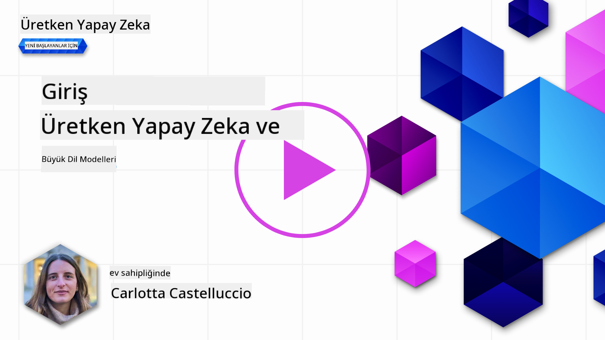
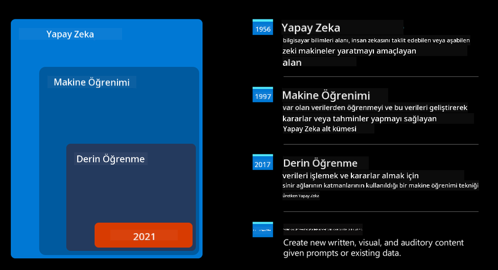
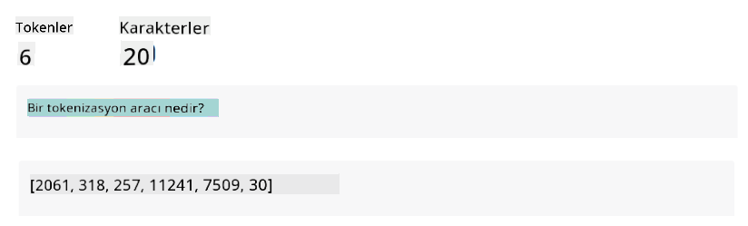
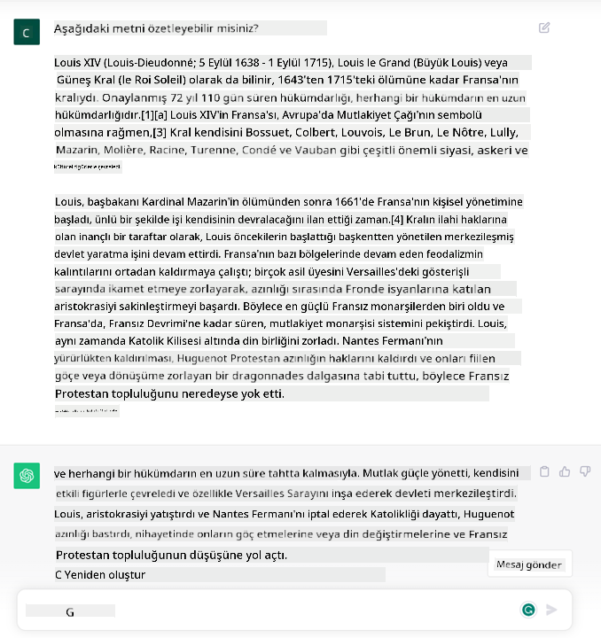
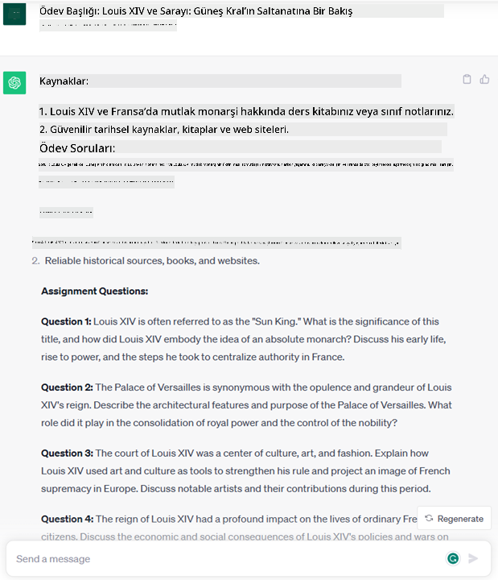
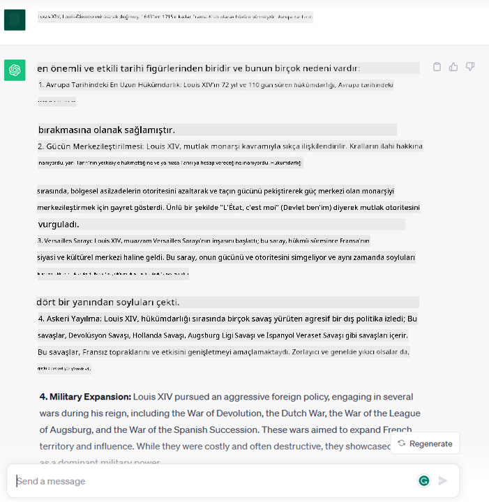
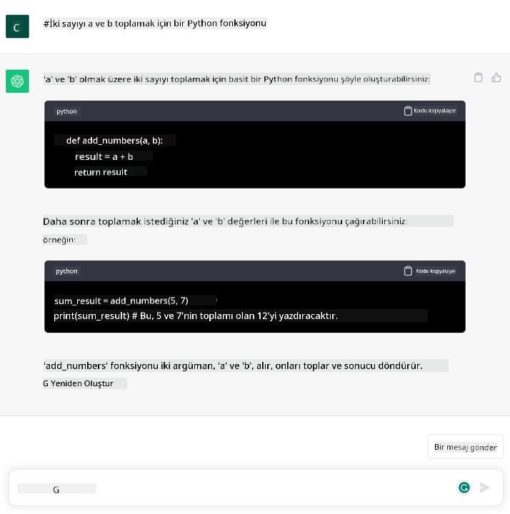

<!--
CO_OP_TRANSLATOR_METADATA:
{
  "original_hash": "f53ba0fa49164f9323043f1c6b11f2b1",
  "translation_date": "2025-07-09T07:52:30+00:00",
  "source_file": "01-introduction-to-genai/README.md",
  "language_code": "tr"
}
-->
# Üretken Yapay Zeka ve Büyük Dil Modellerine Giriş

_(Bu dersin videosunu izlemek için yukarıdaki görsele tıklayın)_

Üretken Yapay Zeka, metin, görsel ve diğer içerik türlerini üretebilen yapay zekadır. Bu teknolojiyi harika kılan şey, yapay zekayı demokratikleştirmesidir; herkes, doğal bir dilde yazılmış kısa bir metin komutuyla kullanabilir. Java veya SQL gibi bir programlama dili öğrenmenize gerek yoktur; sadece kendi dilinizi kullanarak ne istediğinizi belirtmeniz yeterlidir ve yapay zeka modeli size bir öneri sunar. Uygulamaları ve etkisi çok büyüktür; rapor yazabilir veya anlayabilir, uygulamalar oluşturabilir ve çok daha fazlasını saniyeler içinde yapabilirsiniz.

Bu müfredatta, startup’ımızın eğitim dünyasında yeni senaryoları açmak için üretken yapay zekayı nasıl kullandığını ve uygulamanın sosyal etkileri ile teknoloji sınırlamalarına bağlı kaçınılmaz zorlukları nasıl ele aldığımızı keşfedeceğiz.

## Giriş

Bu ders şunları kapsayacak:

- İş senaryosuna giriş: startup fikrimiz ve misyonumuz.
- Üretken yapay zeka ve mevcut teknoloji ortamına nasıl ulaştığımız.
- Büyük dil modelinin iç işleyişi.
- Büyük Dil Modellerinin temel yetenekleri ve pratik kullanım örnekleri.

## Öğrenme Hedefleri

Bu dersi tamamladıktan sonra şunları anlayacaksınız:

- Üretken yapay zekanın ne olduğu ve Büyük Dil Modellerinin nasıl çalıştığı.
- Büyük dil modellerini farklı kullanım senaryolarında, özellikle eğitim alanında nasıl kullanabileceğiniz.

## Senaryo: eğitim odaklı startup’ımız

Üretken Yapay Zeka, yapay zeka teknolojisinin zirvesini temsil eder ve bir zamanlar imkansız olarak görülen sınırları zorlar. Üretken yapay zeka modellerinin birçok yeteneği ve uygulaması vardır, ancak bu müfredatta eğitim alanında devrim yaratan kurgusal bir startup üzerinden inceleyeceğiz. Bu startup’a _startup’ımız_ diyeceğiz. Startup’ımız eğitim alanında faaliyet gösterir ve iddialı misyonu şudur:

> _öğrenimde erişilebilirliği küresel ölçekte artırmak, eğitime adil erişim sağlamak ve her öğrenenin ihtiyaçlarına göre kişiselleştirilmiş öğrenme deneyimleri sunmak_.

Startup ekibimiz, bu hedefe ulaşmak için modern zamanların en güçlü araçlarından biri olan Büyük Dil Modellerinden (LLM) yararlanmadan başarılı olamayacağımızın farkında.

Üretken yapay zekanın, öğrencilerin 7/24 erişebileceği sanal öğretmenlerle bilgi ve örnekler sunması ve öğretmenlerin öğrencilerini değerlendirmek ve geri bildirim vermek için yenilikçi araçlar kullanabilmesiyle, öğrenme ve öğretme biçimimizi kökten değiştirmesi bekleniyor.

Başlamak için, müfredat boyunca kullanacağımız bazı temel kavramları ve terimleri tanımlayalım.

## Üretken Yapay Zekaya Nasıl Ulaştık?

Son zamanlarda üretken yapay zeka modellerinin duyurulmasıyla oluşan olağanüstü _heyecan_ rağmen, bu teknoloji onlarca yıllık bir gelişimin ürünüdür; ilk araştırmalar 60’lı yıllara kadar uzanır. Şu anda, örneğin [OpenAI ChatGPT](https://openai.com/chatgpt) veya [Bing Chat](https://www.microsoft.com/edge/features/bing-chat?WT.mc_id=academic-105485-koreyst) gibi insan bilişsel yeteneklerine sahip yapay zekalarla karşı karşıyayız. Bing Chat, web araması için GPT modelini kullanır.

Biraz geriye gidersek, yapay zekanın ilk prototipleri, uzmanlardan derlenen bilgi tabanına dayanan ve bilgisayara aktarılan yazılı chatbotlardı. Bilgi tabanındaki cevaplar, giriş metninde geçen anahtar kelimelerle tetikleniyordu. Ancak, bu tür yazılı chatbotların ölçeklenebilir olmadığı kısa sürede anlaşıldı.

### Yapay Zekaya İstatistiksel Yaklaşım: Makine Öğrenimi

90’larda, metin analizinde istatistiksel bir yaklaşımın uygulanması bir dönüm noktası oldu. Bu, makine öğrenimi olarak bilinen, verilerden örüntüleri öğrenebilen ve açıkça programlanmadan çalışan yeni algoritmaların geliştirilmesini sağladı. Bu yaklaşım, makinelerin insan dilini anlamasını simüle etmeye olanak tanır: bir istatistiksel model, metin-etiket çiftleri üzerinde eğitilir ve bilinmeyen giriş metnini, mesajın niyetini temsil eden önceden tanımlanmış bir etiketle sınıflandırabilir.

### Sinir Ağları ve Modern Sanal Asistanlar

Son yıllarda, daha büyük veri ve karmaşık hesaplamaları işleyebilen donanım teknolojisinin gelişimi, yapay zeka araştırmalarını teşvik etti ve sinir ağları ya da derin öğrenme algoritmaları olarak bilinen gelişmiş makine öğrenimi algoritmalarının geliştirilmesine yol açtı.

Sinir ağları (özellikle Tekrarlayan Sinir Ağları – RNN’ler), doğal dil işleme alanında büyük ilerlemeler sağladı; metnin anlamını daha anlamlı şekilde temsil etmeye, bir kelimenin cümledeki bağlamını dikkate almaya olanak tanıdı.

Bu teknoloji, yeni yüzyılın ilk on yılında doğan sanal asistanları güçlendirdi; insan dilini yorumlamakta, bir ihtiyacı belirlemekte ve bunu karşılamak için önceden tanımlanmış bir senaryoyla yanıt vermekte ya da üçüncü taraf bir hizmeti kullanmakta oldukça yetenekliydiler.

### Günümüz, Üretken Yapay Zeka

İşte böylece, derin öğrenmenin bir alt kümesi olarak görülebilecek Üretken Yapay Zekaya ulaştık.

Yapay zeka alanında onlarca yıl süren araştırmaların ardından, _Transformer_ adı verilen yeni bir model mimarisi, RNN’lerin sınırlarını aşarak çok daha uzun metin dizilerini girdi olarak alabilmeyi mümkün kıldı. Transformerlar, dikkat mekanizmasına dayanır; modelin aldığı girdilere farklı ağırlıklar vermesini sağlar, böylece metin dizisindeki sıralarına bakmaksızın en önemli bilginin yoğunlaştığı yerlere ‘daha fazla dikkat’ eder.

Son zamanlarda geliştirilen üretken yapay zeka modellerinin çoğu – Büyük Dil Modelleri (LLM) olarak da bilinir, çünkü metin girdileri ve çıktılarıyla çalışırlar – aslında bu mimariye dayanır. Bu modellerin ilginç yanı, kitaplar, makaleler ve web siteleri gibi çeşitli kaynaklardan büyük miktarda etiketsiz veri üzerinde eğitilmiş olmalarıdır. Bu sayede çok çeşitli görevlere uyarlanabilir ve yaratıcı bir izlenimle dilbilgisi açısından doğru metinler üretebilirler. Yani, sadece bir metni ‘anlama’ kapasitelerini inanılmaz derecede artırmakla kalmadılar, aynı zamanda insan dilinde özgün yanıtlar oluşturabilme yeteneği kazandırdılar.

## Büyük Dil Modelleri Nasıl Çalışır?

Bir sonraki bölümde farklı Üretken Yapay Zeka modellerini inceleyeceğiz, ancak şimdilik OpenAI GPT (Generative Pre-trained Transformer) modellerine odaklanarak büyük dil modellerinin nasıl çalıştığına bakalım.

- **Tokenizer, metni sayılara dönüştürme**: Büyük Dil Modelleri metni girdi olarak alır ve metin üretir. Ancak, istatistiksel modeller oldukları için, metin dizilerinden çok sayılarla daha iyi çalışırlar. Bu yüzden modele verilen her girdi, çekirdek model tarafından kullanılmadan önce bir tokenizer tarafından işlenir. Token, değişken sayıda karakterden oluşan bir metin parçasıdır; tokenizer’ın temel görevi girdiyi token dizisine bölmektir. Sonra her token, orijinal metin parçasının tam sayı kodlaması olan bir token indeksiyle eşleştirilir.

- **Çıktı tokenlarını tahmin etme**: n token girdi olarak verildiğinde (maksimum n modelden modele değişir), model bir token çıktı olarak tahmin eder. Bu token, sonraki iterasyonun girdisine dahil edilir; bu genişleyen pencere deseni, kullanıcıya bir veya birden fazla cümlelik yanıt alma deneyimini iyileştirir. Bu yüzden, ChatGPT ile oynadıysanız, bazen cümlenin ortasında duruyormuş gibi görünebileceğini fark etmiş olabilirsiniz.

- **Seçim süreci, olasılık dağılımı**: Çıktı tokenı, modelin mevcut metin dizisinden sonra ortaya çıkma olasılığına göre seçilir. Model, eğitimine dayanarak tüm olası ‘sonraki tokenlar’ için bir olasılık dağılımı tahmin eder. Ancak, her zaman en yüksek olasılığa sahip token seçilmez. Bu seçimde bir derece rastgelelik eklenir; model deterministik olmayan bir şekilde davranır – aynı girdiye her zaman aynı çıktıyı vermez. Bu rastgelelik, yaratıcı düşünme sürecini simüle etmek için eklenir ve temperature (sıcaklık) adlı model parametresiyle ayarlanabilir.

## Startup’ımız Büyük Dil Modellerinden Nasıl Yararlanabilir?

Büyük dil modelinin iç işleyişini daha iyi anladığımıza göre, iş senaryomuza odaklanarak en yaygın görevlerden bazılarını ve bunları nasıl iyi yapabildiklerini görelim. Büyük Dil Modelinin temel yeteneği, _doğal dilde yazılmış bir metin girdisinden sıfırdan metin üretmektir_.

Peki, ne tür metin girdisi ve çıktısı?

Büyük dil modelinin girdisine prompt (komut), çıktısına ise completion (tamamlama) denir; completion, modelin mevcut girdiyi tamamlamak için bir sonraki tokenı üretme mekanizmasını ifade eder. Prompt’un ne olduğu ve modelden en iyi verimi almak için nasıl tasarlanacağına derinlemesine gireceğiz. Şimdilik, bir prompt şunları içerebilir:

- Modelden beklediğimiz çıktı türünü belirten bir **talimat**. Bu talimat bazen örnekler veya ek veriler içerebilir.

  1. Bir makale, kitap, ürün yorumları vb. özetleme ve yapılandırılmamış verilerden çıkarımlar yapma.
    
    
  
  2. Bir makale, deneme, ödev veya daha fazlasının yaratıcı fikir üretimi ve tasarımı.
      
     

- Bir **soru**, bir ajanla yapılan sohbet şeklinde sorulabilir.
  
  

- Yazım yardımı olarak dolaylı bir talep içeren tamamlanacak bir **metin parçası**.
  
  

- Açıklama ve dokümantasyon istenen veya belirli bir görevi yerine getiren kod parçası oluşturulması talebi içeren bir **kod parçası**.
  
  

Yukarıdaki örnekler oldukça basittir ve Büyük Dil Modellerinin yeteneklerinin kapsamlı bir gösterimi değildir. Üretken yapay zekanın, özellikle eğitim bağlamlarında ama sınırlı kalmayarak, potansiyelini göstermek amaçlıdır.

Ayrıca, üretken yapay zeka modellerinin çıktısı mükemmel değildir ve bazen modelin yaratıcılığı aleyhine çalışabilir; ortaya çıkan çıktı, insan kullanıcı tarafından gerçekliğin çarpıtılması olarak yorumlanabilir veya rahatsız edici olabilir. Üretken yapay zeka zeki değildir – en kapsamlı anlamıyla zeka, eleştirel ve yaratıcı akıl yürütme ya da duygusal zekayı içerir; deterministik değildir ve güvenilir değildir, çünkü yanlış referanslar, içerikler ve ifadeler doğru bilgilerle karışabilir ve ikna edici, kendinden emin bir şekilde sunulabilir. Sonraki derslerde, bu sınırlamalarla nasıl başa çıkacağımızı ve bunları hafifletmek için neler yapabileceğimizi göreceğiz.

## Ödev

Ödeviniz, [üretken yapay zeka](https://en.wikipedia.org/wiki/Generative_artificial_intelligence?WT.mc_id=academic-105485-koreyst) hakkında daha fazla araştırma yapmak ve bugün üretken yapay zekanın henüz kullanılmadığı bir alan belirlemeye çalışmaktır. Etki, “eski yöntemle” yapmaktan nasıl farklı olurdu? Daha önce yapamadığınız bir şeyi yapabilir misiniz ya da daha mı hızlısınız? Hayalinizdeki yapay zeka startup’ının nasıl görüneceğine dair 300 kelimelik bir özet yazın ve “Problem”, “Yapay zekayı nasıl kullanırım”, “Etkisi” gibi başlıklar ekleyin; isterseniz bir iş planı da dahil edebilirsiniz.

Bu görevi yaptıysanız, Microsoft’un inkübatörü [Microsoft for Startups Founders Hub](https://www.microsoft.com/startups?WT.mc_id=academic-105485-koreyst) için başvurmaya hazır olabilirsiniz. Azure, OpenAI, mentorluk ve daha fazlası için kredi sunuyoruz, göz atın!

## Bilgi Kontrolü

Büyük dil modelleri hakkında hangisi doğrudur?

1. Her seferinde tam olarak aynı yanıtı alırsınız.  
1. Her şeyi mükemmel yapar, sayıları toplamakta, çalışan kod üretmekte çok iyidir.  
1. Aynı prompt kullanılsa bile yanıt değişebilir. Metin veya kod olsun, size bir taslak sunmakta iyidir. Ancak sonuçları geliştirmeniz gerekir.

Cevap: 3, bir LLM deterministik değildir, yanıt değişir; ancak varyansını temperature ayarıyla kontrol edebilirsiniz. Ayrıca her şeyi mükemmel yapmasını beklememelisiniz, burada amaç sizin için ağır işleri yapmak ve genellikle üzerinde geliştirme yapmanız gereken iyi bir ilk taslak sunmaktır.

## Harika İş! Yolculuğa Devam Et

Bu dersi tamamladıktan sonra, Üretken Yapay Zeka bilginizi geliştirmeye devam etmek için [Generative AI Learning koleksiyonumuza](https://aka.ms/genai-collection?WT.mc_id=academic-105485-koreyst) göz atın!
Ders 2'ye gidin, burada [farklı LLM türlerini keşfetme ve karşılaştırma](../02-exploring-and-comparing-different-llms/README.md?WT.mc_id=academic-105485-koreyst) konusuna bakacağız!

**Feragatname**:  
Bu belge, AI çeviri servisi [Co-op Translator](https://github.com/Azure/co-op-translator) kullanılarak çevrilmiştir. Doğruluk için çaba göstersek de, otomatik çevirilerin hatalar veya yanlışlıklar içerebileceğini lütfen unutmayın. Orijinal belge, kendi dilinde yetkili kaynak olarak kabul edilmelidir. Kritik bilgiler için profesyonel insan çevirisi önerilir. Bu çevirinin kullanımı sonucu ortaya çıkabilecek yanlış anlamalar veya yorum hatalarından sorumlu değiliz.