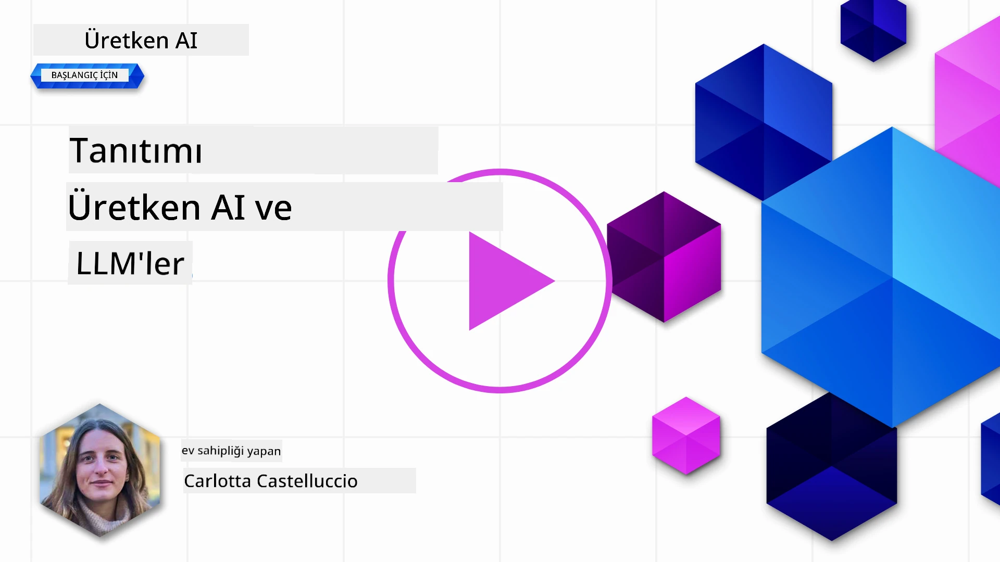
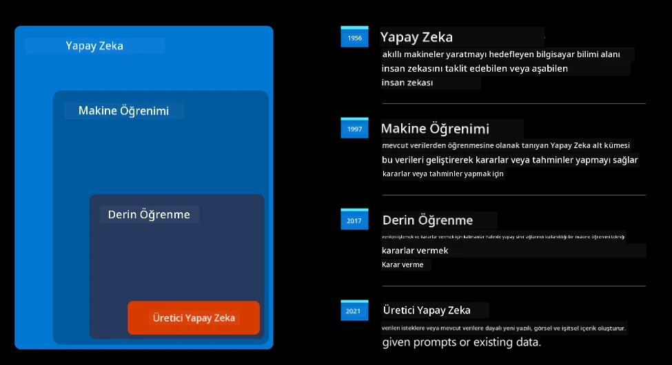
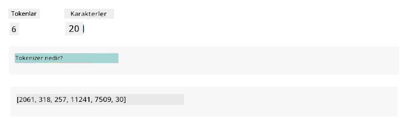
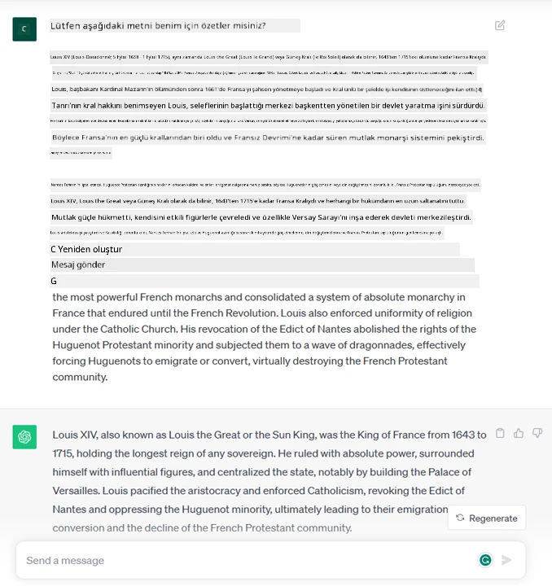
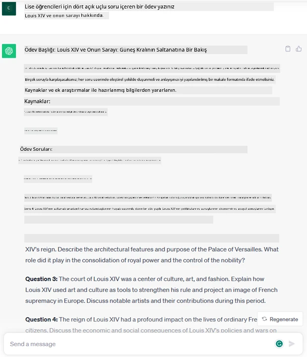
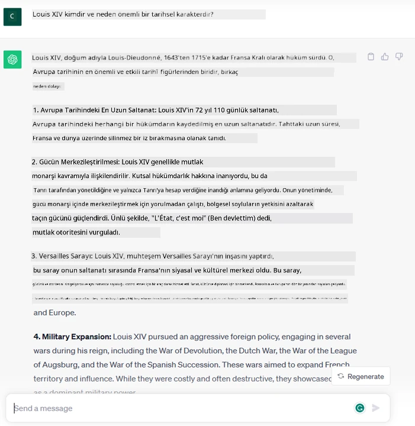
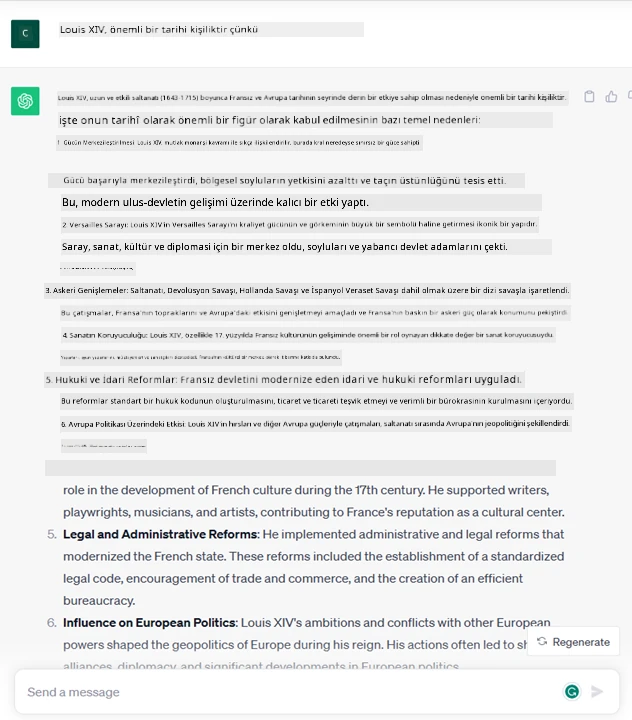
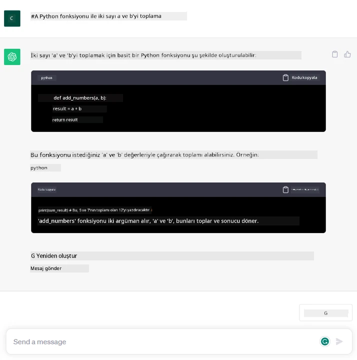

# Üretken Yapay Zekâ ve Büyük Dil Modellerine Giriş

_(Bu dersin videosunu izlemek için yukarıdaki görsele tıklayın)_

Üretken Yapay Zekâ, metin, resim ve diğer içerik türlerini üretebilen yapay zekadır. Onu harika bir teknoloji yapan şey, yapay zekâyı demokratikleştirmesidir; herkes, doğal bir dilde yazılmış kısa bir metin istemi ile kullanabilir. Java veya SQL gibi bir dili öğrenmeye gerek yoktur, yapmanız gereken tek şey kendi dilinizi kullanmak, ne istediğinizi belirtmek ve bir yapay zeka modelinden öneri almaktır. Bunun uygulama alanları ve etkisi büyüktür; raporlar yazabilir veya anlayabilir, uygulamalar yazabilir ve çok daha fazlasını saniyeler içinde yapabilirsiniz.

Bu müfredatta, startup’ımızın eğitim dünyasında yeni senaryoları açmak için üretken yapay zekâyı nasıl kullandığını ve uygulama sosyal etkileri ile teknoloji sınırlamaları ile ilgili kaçınılmaz zorlukları nasıl ele aldığımızı keşfedeceğiz.

## Giriş

Bu ders şunları kapsayacak:

- İş senaryosuna giriş: startup fikrimiz ve misyonumuz.
- Üretken Yapay Zekâ ve mevcut teknoloji ortamına nasıl geldiğimiz.
- Büyük bir dil modelinin iç işleyişi.
- Büyük Dil Modellerinin başlıca yetenekleri ve pratik kullanım durumları.

## Öğrenme Hedefleri

Bu dersi tamamladıktan sonra şunları anlayacaksınız:

- Üretken yapay zekânın ne olduğu ve Büyük Dil Modellerinin nasıl çalıştığı.
- Büyük dil modellerini farklı kullanım durumları için nasıl kullanabileceğiniz, özellikle eğitim senaryolarına odaklanarak.

## Senaryo: eğitim alanındaki startup’ımız

Üretken Yapay Zekâ (AI), AI teknolojisinin zirvesini temsil eder ve bir zamanlar imkansız sayılan sınırları zorlar. Üretken AI modellerinin birçok yeteneği ve uygulaması vardır, ancak bu müfredatta eğitimde devrim yaratan hayali bir startup üzerinden inceleyeceğiz. Bu startup’a _startup’ımız_ diyeceğiz. Startup’ımız, eğitim alanında çalışmakta ve iddialı bir misyon beyanına sahiptir:

> _öğrenmede erişilebilirliği küresel ölçekte artırmak, eğitime eşit erişim sağlamak ve her öğrenenin ihtiyaçlarına göre kişiselleştirilmiş öğrenme deneyimleri sunmak_.

Startup ekibimiz, bu hedefe, modern zamanların en güçlü araçlarından biri olan Büyük Dil Modelleri (LLM'ler) olmadan ulaşamayacağımızın farkında.

Üretken Yapay Zekânın, bugün öğrenme ve öğretme biçimini devrim niteliğinde değiştirmesi bekleniyor; öğrenciler 7/24 erişebilecekleri sanal öğretmenlere sahip olacak, bu öğretmenler çok büyük miktarda bilgi ve örnek sunacak, öğretmenler ise öğrenci değerlendirmesi ve geri bildirimde bulunmada yenilikçi araçlar kullanabilecek.

Başlamak için, bu müfredat boyunca kullanacağımız bazı temel kavramları ve terminolojiyi tanımlayalım.

## Üretken Yapay Zekâ’ya nasıl ulaştık?

Yakın zamanda üretken yapay zeka modellerinin duyurulmasıyla oluşan olağanüstü _heyecan_ olsa da, bu teknoloji onlarca yıllık bir gelişimin ürünüdür ve ilk araştırma çabaları 60’lı yıllara kadar uzanır. Şu anda, yapay zeka, insanın bilişsel yeteneklerine sahip noktaya gelmiştir; örneğin [OpenAI ChatGPT](https://openai.com/chatgpt) veya GPT modelini kullanan [Microsoft Copilot](https://copilot.microsoft.com/?WT.mc_id=academic-105485-koreyst) gibi, sohbet edebilen web arama deneyimleri sunmaktadır.

Biraz geriye gidersek, yapay zekânın ilk prototipleri, uzman gruplarından çıkarılan bilgi tabanına dayanan ve bilgisayarda temsil edilen daktilo yazılı sohbet botlarından oluşuyordu. Bilgi tabanındaki cevaplar, girdideki anahtar kelimeler tarafından tetikleniyordu.
Ancak, bu yaklaşımın, daktilo yazılı sohbet botları kullanmanın, iyi ölçeklenmediği kısa sürede anlaşılmıştır.

### Yapay Zekâ için İstatistiksel Yaklaşım: Makine Öğrenimi

90’larda bir dönüm noktası yaşandı; metin analizine istatistiksel bir yaklaşım uygulandı. Bu, açıkça programlanmadan verilerden desenleri öğrenebilen yeni algoritmalar – makine öğrenimi olarak bilinen – geliştirilmesine yol açtı. Bu yaklaşım, makinelerin insan dil anlayışını taklit etmesini sağlar: istatistiksel bir model, metin-etiket eşleştirmeleri üzerinde eğitilir ve bilinmeyen girdileri, mesajın niyetini temsil eden önceden tanımlanmış bir etiketle sınıflandırabilir.

### Sinir ağları ve modern sanal asistanlar

Son yıllarda, daha büyük veri ve daha karmaşık hesaplamaları işleyebilen donanımın teknoloji evrimi, yapay zeka araştırmalarını teşvik etti ve sinir ağları veya derin öğrenme algoritmaları olarak bilinen gelişmiş makine öğrenimi algoritmalarının geliştirilmesini sağladı.

Sinir ağları (özellikle Yinelemeli Sinir Ağları – RNN’ler), doğal dil işlemede önemli gelişmeler sağladı; kelimenin bir cümledeki bağlamını dikkate alarak metnin anlamını daha anlamlı biçimde temsil etmeye olanak tanıdı.

Bu teknoloji, yeni yüzyılın ilk on yılında doğan sanal asistanları güçlendirdi; insan dilini yorumlamakta, ihtiyaçları tespit etmekte ve onu karşılamak için eylemde bulunmakta çok başarılıydılar—örneğin, önceden tanımlanmış senaryolarla yanıt vermek veya 3. taraf hizmetleri kullanmak gibi.

### Günümüz: Üretken Yapay Zekâ

İşte bugün Üretken Yapay Zekâ'ya nasıl geldik; bu teknoloji derin öğrenmenin bir alt kümesi olarak görülebilir.

Yapay zeka alanındaki onlarca yıllık araştırmanın ardından, _Transformer_ adı verilen yeni bir model mimarisi, RNN'lerin sınırlarını aşarak çok daha uzun metin dizilerini girdi olarak alabilme yeteneğine kavuştu. Transformerlar, modele aldığı girdilere farklı ağırlıklar verme olanağı sağlayan dikkat mekanizmasına dayanır; en ilgili bilgilerin yoğunlaştığı yere ‘daha fazla dikkat’ gösterir, metin dizisindeki sıralama önemli olmaksızın.

Son üretken yapay zeka modellerinin çoğu—metinsel giriş ve çıkışlarla çalışan Büyük Dil Modelleri (LLM'ler) olarak da bilinir—gerçekten de bu mimariye dayanmaktadır. Bu modellerin ilginç yanı, kitaplar, makaleler ve web siteleri gibi çeşitli kaynaklardan büyük miktarda etiketlenmemiş veri üzerinde eğitilmiş olmalarıdır. Böylece çok çeşitli görevlere uyarlanabilirler ve dil bilgisi açısından doğru, bir ölçüde yaratıcılık hissi veren metinler üretebilirler. Bu modeller yalnızca bir makinenin bir girdiyi ‘anlama’ kapasitesini inanılmaz derecede artırmakla kalmaz, aynı zamanda insan diliyle özgün bir yanıt oluşturabilme yeteneği kazandırır.

## Büyük dil modelleri nasıl çalışır?

Sonraki bölümde farklı Üretken Yapay Zekâ modellerini araştıracağız, ancak şimdilik OpenAI GPT (Önceden Eğitilmiş Üretken Transformer) modellerine odaklanarak büyük dil modellerinin nasıl çalıştığına bakalım.

- **Tokenizer, metinden sayılara**: Büyük Dil Modelleri bir metni girdi olarak alır ve metin olarak çıktı üretir. Ancak istatistiksel modeller olduklarından, metin dizileri yerine sayılarla çok daha iyi çalışırlar. Bu nedenle her giriş, temel model tarafından kullanılmadan önce bir tokenizer (dizeleyici) tarafından işlenir. Bir token, değişken sayıda karakterden oluşan bir metin parçasıdır; tokenizer’ın temel görevi, girişi bir token dizisine bölmektir. Ardından, her token, orijinal metin parçasının tam sayı kodlaması olan bir token indeksiyle eşlenir.

- **Çıktı tokenlarını tahmin etme**: n adet token girdi olarak verildiğinde (max n modelden modele değişir), model bir token çıktı olarak tahmin eder. Bu token, bir sonraki iterasyonun girdisine, genişleyen bir pencere şeklinde dahil edilir, böylece bir (veya birden çok) cümlenin yanıt olarak alınması sağlanır. Bu nedenle, ChatGPT ile oynadıysanız, bazen cümlenin ortasında durduğunu fark etmiş olabilirsiniz.

- **Seçim süreci, olasılık dağılımı**: Çıktı tokenı, model tarafından mevcut metin dizisinden sonra oluşma olasılığına göre seçilir. Model, eğitim verilerine dayanarak tüm ‘sonraki tokenlar’ için bir olasılık dağılımı tahmin eder. Ancak her zaman dağılımdan en yüksek olasılığa sahip token seçilmez. Bu seçim sürecine rastgelelik derecesi eklenir; model, doğrusal olmayan davranır—aynı girdi için her zaman aynı çıktıyı vermez. Bu rastgelelik, yaratıcı düşünce sürecini simüle etmek için eklenir ve sıcaklık (temperature) adlı model parametresi ile ayarlanabilir.

## Startup’ımız Büyük Dil Modellerinden nasıl faydalanabilir?

Büyük bir dil modelinin işleyişine dair daha iyi bir anlayışa sahip olduğumuza göre, iş senaryomuza odaklanarak en yaygın görevlerden bazılarını nasıl iyi gerçekleştirebileceklerine dair pratik örneklere bakalım.
Büyük Dil Modelinin temel yeteneğinin _başlangıçta doğal dilde yazılmış bir metinsel girdi alarak baştan metin üretebilmek_ olduğunu söylemiştik.

Peki hangi tür metin girdi ve çıktı olabilir?
Büyük dil modelinin girdisine prompt (komut) denir; çıktısına ise completion (tamamlama) denir; bu terim, modelin mevcut girdiyi tamamlamak üzere bir sonraki tokenı üretme mekanizmasını ifade eder. Prompt'un ne olduğunu ve modelden en iyi sonucu almak için nasıl tasarlanacağını derinlemesine inceleyeceğiz. Şimdilik, bir prompt şu öğeleri içerebilir:

- Modelden beklediğimiz çıktı türünü belirten bir **talimat**. Bu talimat bazen örnekler veya ek veriler içerebilir.

  1. Bir makale, kitap, ürün incelemeleri vb. özetleme ve yapılandırılmamış verilerden çıkarımlar elde etme.
    
    
  
  2. Bir makale, deneme, ödev veya daha fazlasının yaratıcı tasarımı ve fikir üretimi.
      
     

- Bir **soru**, bir ajanla konuşma formunda sorulmuş.
  
  

- Yazım desteği için üstü açık bir talepte bulunan, tamamlanacak bir **metin parçası**.
  
  

- Bir görevi yerine getiren bir kod parçası üretme, açıklama ve dokümantasyon isteme veya kod üretme talebinde bulunan bir yorum içeren **kod parçası**.
  
  

Yukarıdaki örnekler oldukça basittir ve Büyük Dil Modellerinin yeteneklerinin kapsamlı bir gösterimi değildir. Üretken yapay zekâ kullanım potansiyelini göstermek için verilmiştir, özellikle eğitim bağlamlarında, ancak bununla sınırlı değildir.

Ayrıca, üretken yapay zekâ modellerinin çıktısı kusursuz değildir ve bazen modelin yaratıcılığı aleyhinde çalışabilir; ortaya çıkan çıktı, insan kullanıcı tarafından gerçekliğin gizemli bir ifadesi olarak yorumlanabilir veya saldırgan olabilir. Üretken yapay zekâ, daha kapsamlı tanımıyla; kritik ve yaratıcı akıl yürütme ya da duygusal zekâ içeren zeki değildir; belirlenimci değildir ve güvenilir değildir; çünkü yanlış referanslar, içerikler ve ifadeler doğru bilgilerle birleştirilip ikna edici ve kendinden emin şekilde sunulabilir. Takip eden derslerde bu sınırlamalarla ilgileneceğiz ve bunları hafifletmek için neler yapabileceğimizi göreceğiz.

## Ödev

Ödeviniz, [üretken yapay zekâ](https://en.wikipedia.org/wiki/Generative_artificial_intelligence?WT.mc_id=academic-105485-koreyst) hakkında daha fazla araştırma yapmak ve üretken yapay zekânın henüz olmadığı bir alan belirleyip orada nasıl kullanılabileceğini düşünmektir. Etki eski yöntemle yapılana göre nasıl farklı olurdu, önce yapamadığınız bir şeyi yapabilir misiniz ya da daha mı hızlısınız? Hayalinizdeki yapay zeka startup’ının nasıl görüneceğine dair 300 kelimelik bir özet yazın ve “Problem”, “Yapay Zekâyı Nasıl Kullanırım”, “Etkisi” gibi başlıklar ile isteğe bağlı bir iş planı ekleyin.

Bu görevi yaptıysanız, Microsoft’un inkübatörüne, [Microsoft for Startups Founders Hub](https://www.microsoft.com/startups?WT.mc_id=academic-105485-koreyst) başvurmaya bile hazırsınız demektir; burada Azure, OpenAI, mentorluk ve çok daha fazlası için krediler sunuyoruz, kontrol edin!

## Bilgi kontrolü

Büyük dil modelleri ile ilgili hangisi doğrudur?

1. Her zaman tam olarak aynı yanıtı alırsınız.
1. Mükemmel işler yapar, sayıları toplamakta, çalışan kod üretmekte harikadır.
1. Aynı prompt kullanılsa da yanıt değişebilir. Bir metin veya kodın ilk taslağını vermede de iyidir, ancak sonuçları geliştirmeniz gerekir.

Cevap: 3, LLM’ler deterministik değildir, yanıtlar değişir, ancak varyasyonu sıcaklık ayarı ile kontrol edebilirsiniz. Ayrıca mükemmel işler yapmasını beklememelisiniz, zira burada ağır işleri üstlenir ve genellikle üzerinde ilerleyebileceğiniz iyi bir ilk taslak sunar.

## Harika İş! Yolculuğa Devam Et

Bu dersi tamamladıktan sonra, Üretken Yapay Zekâ bilginizi artırmak için [Üretken Yapay Zekâ Öğrenme koleksiyonumuza](https://aka.ms/genai-collection?WT.mc_id=academic-105485-koreyst) göz atın!

Farklı LLM türlerini [keşfetme ve karşılaştırma](../02-exploring-and-comparing-different-llms/README.md?WT.mc_id=academic-105485-koreyst) konusuna bakacağımız Ders 2'ye gidin!

---

<!-- CO-OP TRANSLATOR DISCLAIMER START -->
**Feragatname**:
Bu belge, AI çeviri hizmeti [Co-op Translator](https://github.com/Azure/co-op-translator) kullanılarak çevrilmiştir. Doğruluk için çaba sarf etsek de, otomatik çevirilerin hata veya yanlışlık içerebileceğini lütfen unutmayınız. Orijinal belge, kendi dilinde yetkili kaynak olarak kabul edilmelidir. Kritik bilgiler için profesyonel insan çevirisi önerilir. Bu çevirinin kullanımı sonucu ortaya çıkabilecek yanlış anlamalardan veya yanlış yorumlamalardan sorumlu değiliz.
<!-- CO-OP TRANSLATOR DISCLAIMER END -->