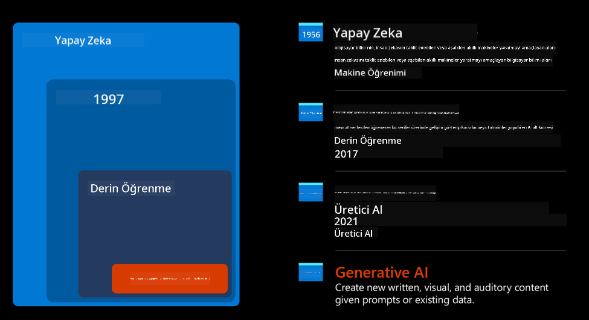
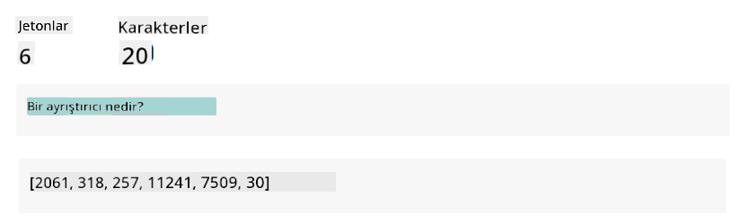
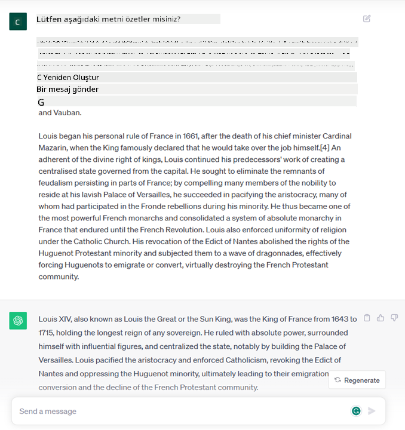
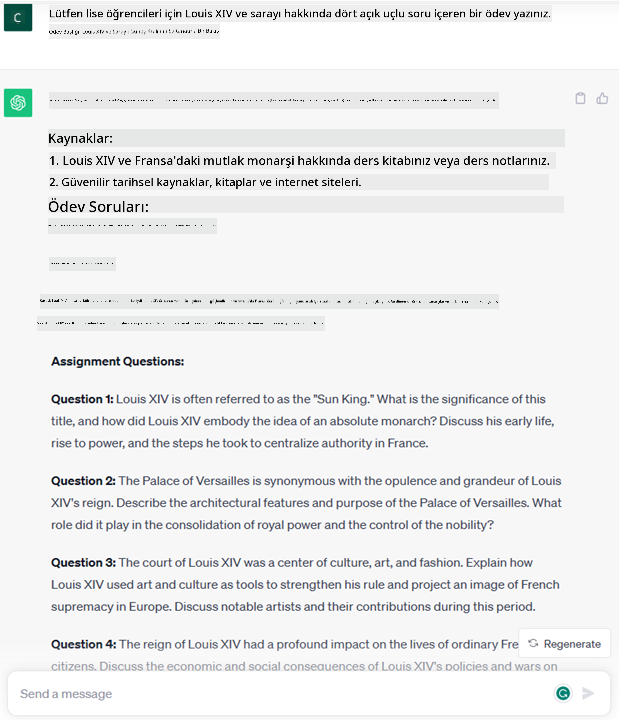
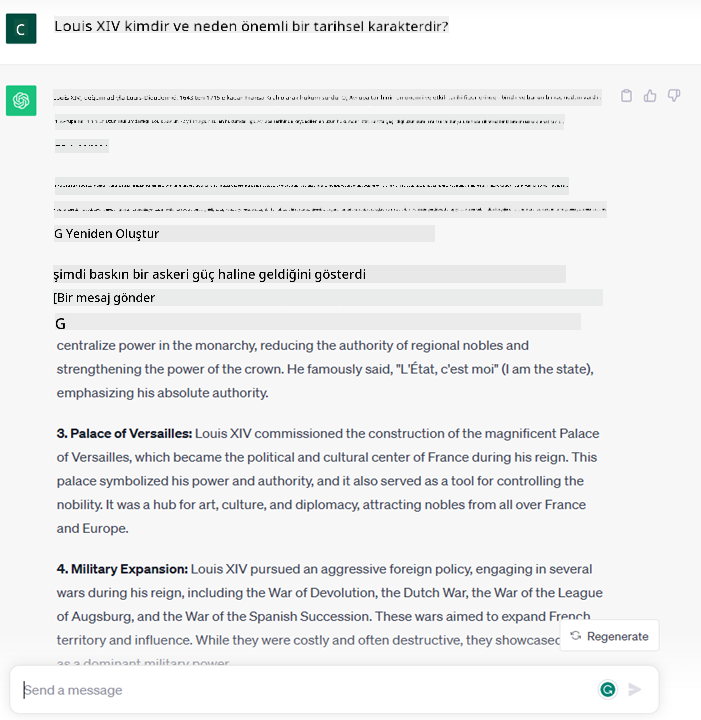
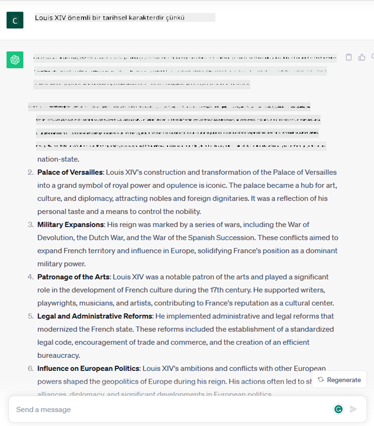
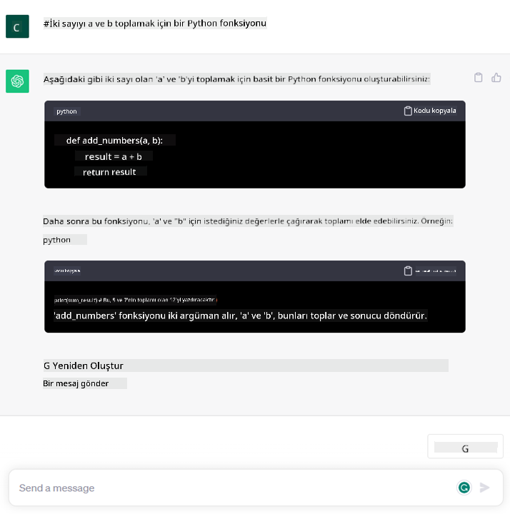

<!--
CO_OP_TRANSLATOR_METADATA:
{
  "original_hash": "bfb7901bdbece1ba3e9f35c400ca33e8",
  "translation_date": "2025-10-17T16:22:49+00:00",
  "source_file": "01-introduction-to-genai/README.md",
  "language_code": "tr"
}
-->
# Üretken Yapay Zeka ve Büyük Dil Modellerine Giriş

_(Bu dersin videosunu izlemek için yukarıdaki görsele tıklayın)_

Üretken Yapay Zeka, metin, görüntü ve diğer içerik türlerini oluşturabilen bir yapay zeka türüdür. Bu teknolojiyi harika kılan şey, yapay zekayı demokratikleştirmesidir; herkes yalnızca doğal bir dilde yazılmış bir cümle gibi basit bir metin istemiyle kullanabilir. Java veya SQL gibi bir dil öğrenmenize gerek yok; sadece kendi dilinizi kullanarak ne istediğinizi belirtin ve yapay zeka modelinden bir öneri alın. Bunun uygulamaları ve etkileri oldukça büyük; raporlar yazabilir veya anlayabilir, uygulamalar oluşturabilir ve daha fazlasını saniyeler içinde yapabilirsiniz.

Bu müfredatta, eğitim dünyasında yeni senaryoların kilidini açmak için girişimimizin üretken yapay zekayı nasıl kullandığını ve bunun sosyal etkileri ve teknolojik sınırlamalarıyla ilgili kaçınılmaz zorlukları nasıl ele aldığımızı keşfedeceğiz.

## Giriş

Bu derste şunlar ele alınacak:

- İş senaryosuna giriş: girişim fikrimiz ve misyonumuz.
- Üretken yapay zeka ve mevcut teknoloji manzarasına nasıl ulaştığımız.
- Büyük dil modelinin iç işleyişi.
- Büyük Dil Modellerinin ana yetenekleri ve pratik kullanım alanları.

## Öğrenme Hedefleri

Bu dersi tamamladıktan sonra şunları anlayacaksınız:

- Üretken yapay zekanın ne olduğunu ve Büyük Dil Modellerinin nasıl çalıştığını.
- Büyük dil modellerini farklı kullanım alanlarında, özellikle eğitim senaryolarında nasıl kullanabileceğinizi.

## Senaryo: eğitim girişimimiz

Üretken Yapay Zeka (AI), bir zamanlar imkansız olduğu düşünülen sınırları zorlayan AI teknolojisinin zirvesini temsil eder. Üretken yapay zeka modellerinin birçok yeteneği ve uygulaması vardır, ancak bu müfredatta, kurgusal bir girişim aracılığıyla eğitimi nasıl devrimleştirdiğini keşfedeceğiz. Bu girişime _girişimimiz_ olarak atıfta bulunacağız. Girişimimiz, eğitim alanında çalışıyor ve iddialı bir misyon bildirisine sahip:

> _öğrenmede erişilebilirliği küresel ölçekte artırmak, eğitime eşit erişim sağlamak ve her öğrenicinin ihtiyaçlarına göre kişiselleştirilmiş öğrenme deneyimleri sunmak._

Girişim ekibimiz, bu hedefe modern zamanların en güçlü araçlarından biri olan Büyük Dil Modelleri (LLM'ler) olmadan ulaşamayacağımızın farkında.

Üretken yapay zekanın, öğrencilerin 24 saat boyunca sanal öğretmenlere erişebildiği, büyük miktarda bilgi ve örnekler sunan ve öğretmenlerin öğrencilerini değerlendirmek ve geri bildirimde bulunmak için yenilikçi araçlardan yararlanabildiği günümüzde öğrenme ve öğretme biçimimizi devrimleştirmesi bekleniyor.

Başlamak için, müfredat boyunca kullanacağımız bazı temel kavramları ve terminolojiyi tanımlayalım.

## Üretken Yapay Zeka nasıl ortaya çıktı?

Son zamanlarda üretken yapay zeka modellerinin duyurulmasıyla yaratılan olağanüstü _hype_'a rağmen, bu teknoloji on yıllardır geliştiriliyor ve ilk araştırma çabaları 60'lara kadar uzanıyor. Şimdi, insan bilişsel yeteneklerine sahip bir yapay zeka noktasındayız; örneğin, [OpenAI ChatGPT](https://openai.com/chatgpt) veya [Bing Chat](https://www.microsoft.com/edge/features/bing-chat?WT.mc_id=academic-105485-koreyst) gibi, Bing arama motoru sohbetlerinde GPT modelini kullanan sohbetler gibi.

Biraz geriye gidersek, yapay zekanın ilk prototipleri, bir grup uzmandan çıkarılan ve bir bilgisayara temsil edilen bir bilgi tabanına dayanan yazılı sohbet botlarından oluşuyordu. Bilgi tabanındaki cevaplar, giriş metninde görünen anahtar kelimelerle tetikleniyordu. Ancak, yazılı sohbet botları kullanarak böyle bir yaklaşımın iyi ölçeklenmediği kısa sürede anlaşıldı.

### Yapay Zekaya İstatistiksel Yaklaşım: Makine Öğrenimi

90'larda metin analizine istatistiksel bir yaklaşımın uygulanmasıyla bir dönüm noktası geldi. Bu, açıkça programlanmadan verilerden desenler öğrenebilen yeni algoritmaların – makine öğrenimi olarak bilinen – geliştirilmesine yol açtı. Bu yaklaşım, makinelerin insan dilini anlama simülasyonunu mümkün kıldı: bir istatistiksel model, metin-etiket eşleştirmeleri üzerinde eğitilir ve modelin bir mesajın niyetini temsil eden önceden tanımlanmış bir etiketle bilinmeyen giriş metnini sınıflandırmasını sağlar.

### Sinir Ağları ve Modern Sanal Asistanlar

Son yıllarda, daha büyük miktarda veri ve daha karmaşık hesaplamaları işleyebilen donanımın teknolojik evrimi, yapay zeka araştırmalarını teşvik etti ve sinir ağları veya derin öğrenme algoritmaları olarak bilinen gelişmiş makine öğrenimi algoritmalarının geliştirilmesine yol açtı.

Sinir ağları (özellikle Tekrarlayan Sinir Ağları – RNN'ler), doğal dil işleme alanında önemli ölçüde ilerleme sağladı ve bir cümledeki bir kelimenin bağlamını değerlendirerek metnin anlamını daha anlamlı bir şekilde temsil etmeyi mümkün kıldı.

Bu teknoloji, insan dilini yorumlama, bir ihtiyacı belirleme ve bunu karşılamak için bir eylem gerçekleştirme konusunda çok yetenekli olan, yüzyılın ilk on yılında doğan sanal asistanları güçlendirdi – örneğin, önceden tanımlanmış bir senaryo ile yanıt verme veya üçüncü taraf bir hizmeti kullanma gibi.

### Günümüz, Üretken Yapay Zeka

Böylece bugün Üretken Yapay Zeka'ya geldik, bu da derin öğrenmenin bir alt kümesi olarak görülebilir.

Yapay zeka alanında on yıllarca süren araştırmalardan sonra, _Transformer_ adı verilen yeni bir model mimarisi, RNN'lerin sınırlarını aşarak çok daha uzun metin dizilerini giriş olarak almayı mümkün kıldı. Transformer'lar, aldığı girdilere farklı ağırlıklar veren dikkat mekanizmasına dayanır, metin dizisindeki sıralarına bakılmaksızın en alakalı bilginin yoğunlaştığı yerlere 'daha fazla dikkat eder'.

Çoğu yeni üretken yapay zeka modeli – metinsel giriş ve çıkışlarla çalıştıkları için Büyük Dil Modelleri (LLM'ler) olarak da bilinir – aslında bu mimariye dayanmaktadır. Kitaplar, makaleler ve web siteleri gibi çeşitli kaynaklardan büyük miktarda etiketlenmemiş veri üzerinde eğitilen bu modellerin ilginç yanı, çok çeşitli görevlere uyarlanabilmeleri ve yaratıcı bir görünümle dilbilgisel olarak doğru metinler üretebilmeleridir. Yani, bir makinenin bir giriş metni 'anlama' kapasitesini inanılmaz bir şekilde artırmakla kalmadılar, aynı zamanda insan dilinde orijinal bir yanıt oluşturma kapasitesini de mümkün kıldılar.

## Büyük dil modelleri nasıl çalışır?

Bir sonraki bölümde farklı türde Üretken Yapay Zeka modellerini keşfedeceğiz, ancak şimdilik büyük dil modellerinin nasıl çalıştığına, özellikle OpenAI GPT (Generative Pre-trained Transformer) modellerine odaklanarak bir göz atalım.

- **Tokenizasyon, metni sayılara dönüştürme**: Büyük Dil Modelleri bir metni giriş olarak alır ve bir metni çıkış olarak üretir. Ancak, istatistiksel modeller oldukları için metin dizileri yerine sayılarla çok daha iyi çalışırlar. Bu nedenle, modelin çekirdeği tarafından kullanılmadan önce her giriş bir tokenizer tarafından işlenir. Bir token, değişken sayıda karakterden oluşan bir metin parçasıdır, bu nedenle tokenizer'ın ana görevi girişi bir token dizisine ayırmaktır. Daha sonra, her token bir token indeksine, yani orijinal metin parçasının tam sayı kodlamasına eşlenir.

- **Çıkış tokenlarını tahmin etme**: n token giriş olarak verildiğinde (maksimum n modelden modele değişir), model bir token çıkış olarak tahmin edebilir. Bu token, bir yanıt olarak bir (veya birden fazla) cümle almayı sağlayan genişleyen bir pencere modeliyle bir sonraki yinelemenin girişine dahil edilir. Bu, eğer ChatGPT ile oynadıysanız, bazen bir cümlenin ortasında duruyormuş gibi göründüğünü fark etmiş olabilirsiniz.

- **Seçim süreci, olasılık dağılımı**: Çıkış tokenı, model tarafından mevcut metin dizisinden sonra ortaya çıkma olasılığına göre seçilir. Bunun nedeni, modelin eğitimi temel alarak tüm olası 'sonraki tokenlar' üzerinde bir olasılık dağılımı tahmin etmesidir. Ancak, her zaman en yüksek olasılığa sahip token, sonuçta oluşan dağılımdan seçilmez. Bu seçime bir dereceye kadar rastgelelik eklenir, böylece model deterministik olmayan bir şekilde hareket eder - aynı giriş için tam olarak aynı çıktıyı almayız. Bu rastgelelik derecesi, yaratıcı düşünme sürecini simüle etmek için eklenir ve sıcaklık adı verilen bir model parametresi kullanılarak ayarlanabilir.

## Girişimimiz Büyük Dil Modellerinden nasıl yararlanabilir?

Artık büyük dil modelinin iç işleyişini daha iyi anladığımıza göre, iş senaryomuza odaklanarak en yaygın görevlerden bazılarını pratik örneklerle inceleyelim. Büyük Dil Modelinin ana yeteneğinin _doğal dilde yazılmış bir metinsel girişten başlayarak sıfırdan metin oluşturmak_ olduğunu söyledik.

Peki, ne tür bir metinsel giriş ve çıkış?
Büyük dil modelinin girişi bir istem olarak bilinirken, çıkışı bir tamamlama olarak bilinir; bu terim, modelin mevcut girişi tamamlamak için bir sonraki tokenı oluşturma mekanizmasına atıfta bulunur. Bir istemin ne olduğunu ve modelimizden en iyi şekilde yararlanmak için nasıl tasarlanacağını derinlemesine inceleyeceğiz. Ancak şimdilik, bir istemin şunları içerebileceğini söyleyelim:

- Modelden beklediğimiz çıktı türünü belirten bir **talimat**. Bu talimat bazen bazı örnekler veya ek veriler içerebilir.

  1. Bir makale, kitap, ürün incelemeleri ve daha fazlasının özetlenmesi, yapılandırılmamış verilerden içgörülerin çıkarılması.
    
    
  
  2. Bir makale, deneme, ödev veya daha fazlasının yaratıcı fikir üretimi ve tasarımı.
      
     

- Bir **soru**, bir ajanla yapılan bir sohbet şeklinde sorulmuş.
  
  

- Tamamlanması gereken bir **metin parçası**, bu da dolaylı olarak yazma yardımı talebidir.
  
  

- Belirli bir görevi yerine getiren bir kod parçası oluşturma veya açıklama ve belgeleme talebiyle birlikte bir **kod parçası**.
  
  

Yukarıdaki örnekler oldukça basittir ve Büyük Dil Modellerinin yeteneklerinin kapsamlı bir gösterimi olarak tasarlanmamıştır. Bunlar, üretken yapay zekanın, özellikle ancak eğitim bağlamlarıyla sınırlı olmamak üzere, kullanım potansiyelini göstermek için tasarlanmıştır.

Ayrıca, üretken yapay zeka modelinin çıktısı mükemmel değildir ve bazen modelin yaratıcılığı ona karşı çalışabilir, insan kullanıcının gerçekliğin bir mistifikasyonu olarak yorumlayabileceği kelimelerin bir kombinasyonu ile sonuçlanabilir veya saldırgan olabilir. Üretken yapay zeka zeki değildir - en kapsamlı zeka tanımını, eleştirel ve yaratıcı akıl yürütme veya duygusal zekayı içeren tanımı en azından karşılamaz; deterministik değildir ve güvenilir değildir, çünkü yanlış referanslar, içerikler ve ifadeler doğru bilgilerle birleştirilip ikna edici ve kendinden emin bir şekilde sunulabilir. Sonraki derslerde, tüm bu sınırlamalarla başa çıkacağız ve bunları hafifletmek için neler yapabileceğimizi göreceğiz.

## Ödev

Ödeviniz, [üretken yapay zeka](https://en.wikipedia.org/wiki/Generative_artificial_intelligence?WT.mc_id=academic-105485-koreyst) hakkında daha fazla bilgi edinmek ve bugün üretken yapay zekayı eklemek istediğiniz bir alan belirlemektir. Eski yöntemle yapmaktan farklı olarak etkisi nasıl olurdu, daha önce yapamadığınız bir şeyi yapabilir misiniz, yoksa daha mı hızlı olur? Hayalinizdeki yapay zeka girişiminin nasıl görüneceğini 300 kelimelik bir özetle yazın ve "Sorun", "Yapay Zekayı Nasıl Kullanırım", "Etkisi" ve isteğe bağlı olarak bir iş planı gibi başlıklar ekleyin.

Bu görevi yerine getirdiyseniz, Microsoft'un kuluçka programına, [Microsoft for Startups Founders Hub](https://www.microsoft.com/startups?WT.mc_id=academic-105485-koreyst) başvuruda bulunmaya bile hazır olabilirsiniz. Azure, OpenAI, mentorluk ve çok daha fazlası için kredi sunuyoruz, bir göz atın!

## Bilgi Kontrolü

Büyük dil modelleri hakkında doğru olan nedir?

1. Her seferinde tam olarak aynı yanıtı alırsınız.
1. Her şeyi mükemmel yapar, sayı ekleme, çalışan kod üretme vb. konularda harikadır.
1. Yanıt, aynı istemi kullanmanıza rağmen değişebilir. Ayrıca, ister metin ister kod olsun, bir şeyin ilk taslağını size vermekte harikadır. Ancak sonuçları geliştirmeniz gerekir.

C: 3, bir LLM deterministik değildir, yanıt değişir, ancak sıcaklık ayarı kullanılarak bu varyasyonu kontrol edebilirsiniz. Ayrıca, her şeyi mükemmel yapmasını beklememelisiniz, sizin için ağır işleri yapması için buradadır, bu da genellikle bir şeyin iyi bir ilk denemesini alacağınız anlamına gelir ve bunu kademeli olarak geliştirmeniz gerekir.

## Harika İş! Yolculuğa Devam Edin

Bu dersi tamamladıktan sonra, Üretken Yapay Zeka bilginizi geliştirmeye devam etmek için [Üretken Yapay Zeka Öğrenme koleksiyonumuza](https://aka.ms/genai-collection?WT.mc_id=academic-105485-koreyst) göz atın!
Ders 2'ye geçin, burada [farklı LLM türlerini keşfetmeyi ve karşılaştırmayı](../02-exploring-and-comparing-different-llms/README.md?WT.mc_id=academic-105485-koreyst) inceleyeceğiz!

---

**Feragatname**:  
Bu belge, AI çeviri hizmeti [Co-op Translator](https://github.com/Azure/co-op-translator) kullanılarak çevrilmiştir. Doğruluk için çaba göstersek de, otomatik çevirilerin hata veya yanlışlıklar içerebileceğini lütfen unutmayın. Belgenin orijinal dili, yetkili kaynak olarak kabul edilmelidir. Kritik bilgiler için profesyonel insan çevirisi önerilir. Bu çevirinin kullanımından kaynaklanan yanlış anlamalar veya yanlış yorumlamalardan sorumlu değiliz.