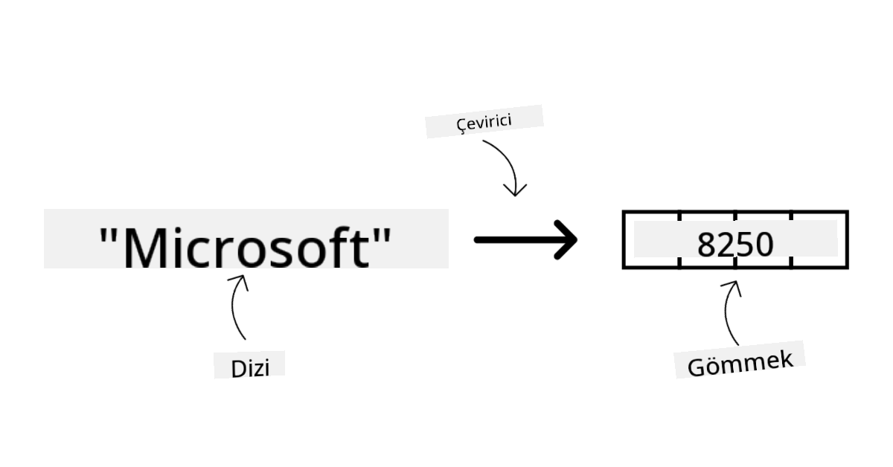
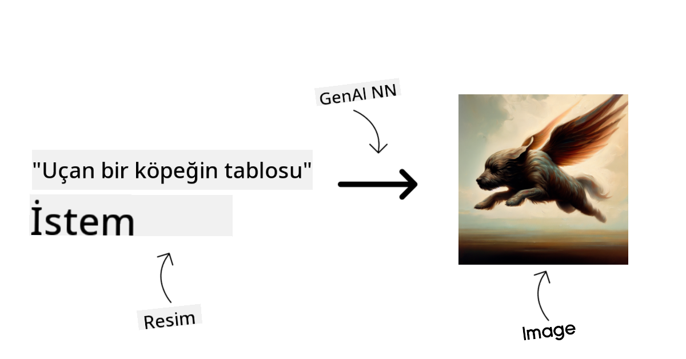
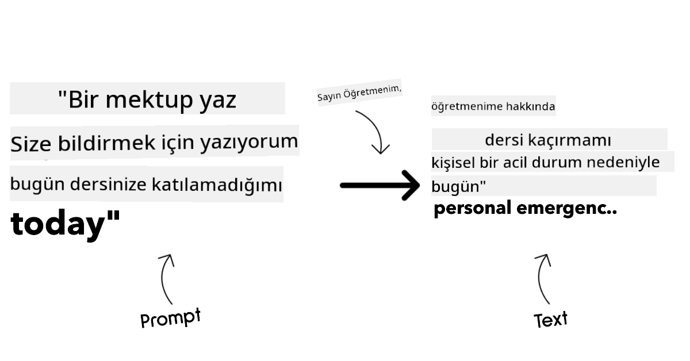
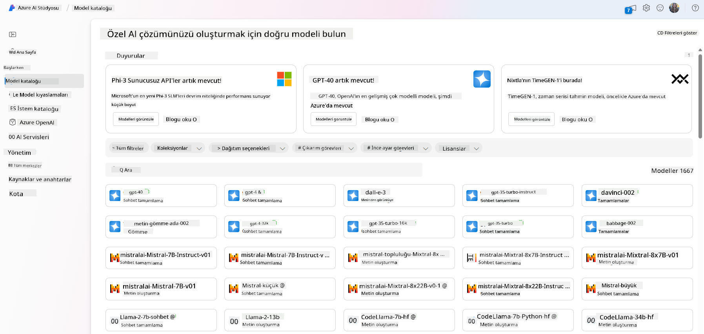
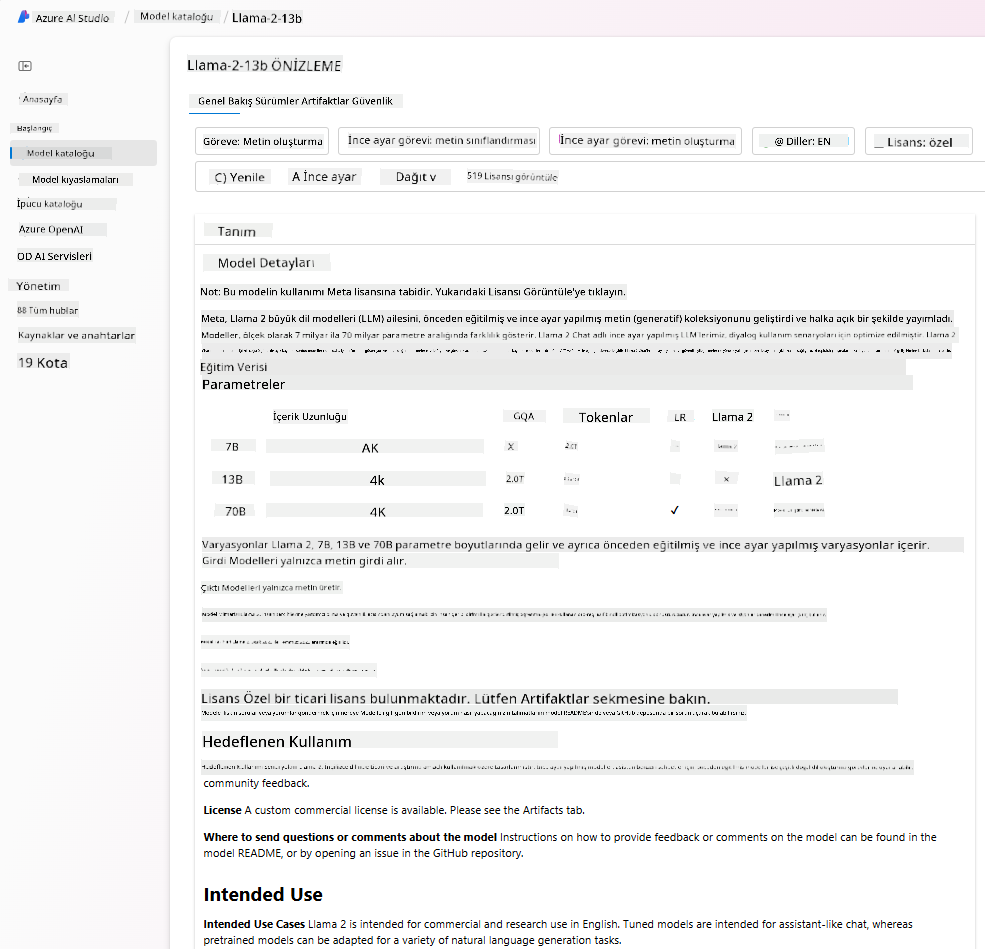
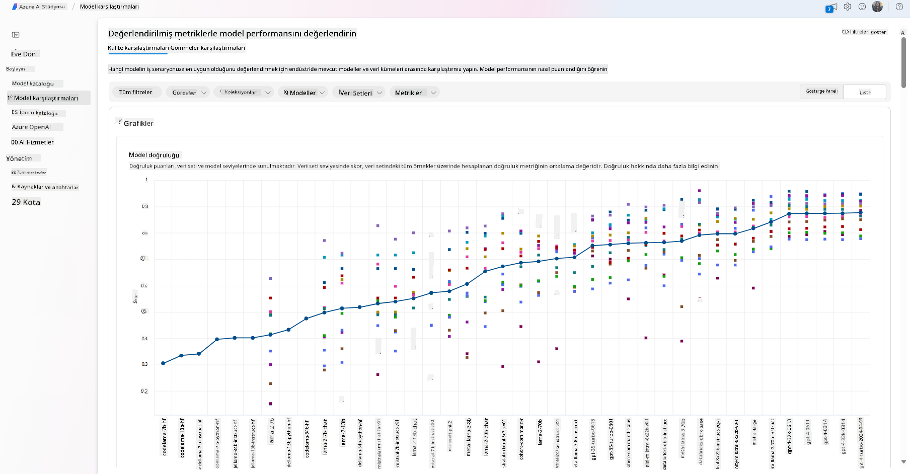
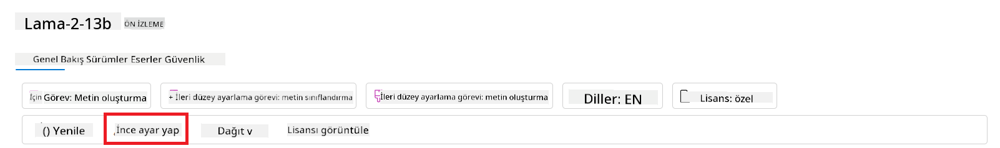
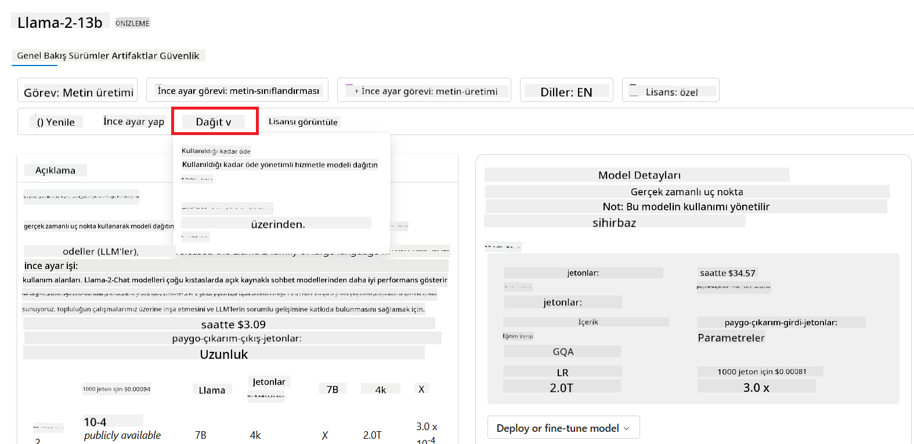
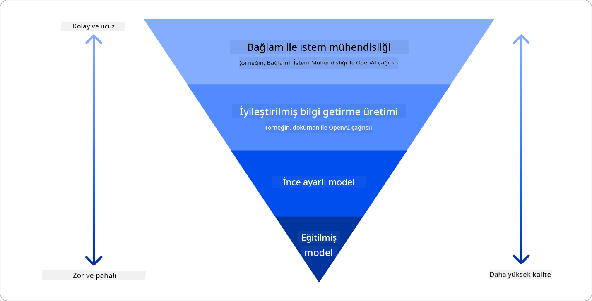

<!--
CO_OP_TRANSLATOR_METADATA:
{
  "original_hash": "e2f686f2eb794941761252ac5e8e090b",
  "translation_date": "2025-05-19T13:58:55+00:00",
  "source_file": "02-exploring-and-comparing-different-llms/README.md",
  "language_code": "tr"
}
-->
# Farklı LLM'leri Keşfetmek ve Karşılaştırmak

> _Bu dersin videosunu izlemek için yukarıdaki resme tıklayın_

Önceki derste, Üretici AI'nin teknoloji dünyasını nasıl değiştirdiğini, Büyük Dil Modelleri'nin (LLM'ler) nasıl çalıştığını ve bir işletmenin - bizim girişimimiz gibi - onları kendi kullanım senaryolarına nasıl uygulayabileceğini ve büyüyebileceğini gördük! Bu bölümde, farklı büyük dil modellerini (LLM'ler) karşılaştırarak avantajlarını ve dezavantajlarını anlamaya çalışacağız.

Girişimimizin yolculuğundaki bir sonraki adım, mevcut LLM'ler dünyasını keşfetmek ve hangilerinin bizim kullanım senaryomuz için uygun olduğunu anlamaktır.

## Giriş

Bu derste ele alınacak konular:

- Mevcut LLM türleri.
- Azure'da kullanım senaryonuz için farklı modelleri test etme, yineleme ve karşılaştırma.
- Bir LLM nasıl dağıtılır.

## Öğrenme Hedefleri

Bu dersi tamamladıktan sonra:

- Kullanım senaryonuz için doğru modeli seçebileceksiniz.
- Modelinizin performansını test etme, yineleme ve geliştirme yöntemlerini anlayacaksınız.
- İşletmelerin modelleri nasıl dağıttığını öğreneceksiniz.

## Farklı LLM Türlerini Anlama

LLM'ler mimarileri, eğitim verileri ve kullanım senaryolarına göre çeşitli kategorilere ayrılabilir. Bu farklılıkları anlamak, girişimimizin senaryo için doğru modeli seçmesine ve performansı test etme, yineleme ve geliştirme yollarını anlamasına yardımcı olacaktır.

Birçok farklı LLM modeli bulunmaktadır; model seçiminiz onları ne amaçla kullanmayı hedeflediğinize, verilerinize, ne kadar ödemeye hazır olduğunuza ve daha fazlasına bağlıdır.

Modelleri metin, ses, video, görüntü üretimi gibi amaçlarla kullanmayı hedefliyorsanız, farklı bir model türü seçebilirsiniz.

- **Ses ve konuşma tanıma**. Bu amaç için, Whisper türü modeller genel amaçlı olduklarından ve konuşma tanımaya yönelik olduklarından harika bir seçimdir. Çeşitli seslerde eğitilmiştir ve çok dilli konuşma tanıma yapabilir. [Whisper türü modeller hakkında daha fazla bilgi edinin](https://platform.openai.com/docs/models/whisper?WT.mc_id=academic-105485-koreyst).

- **Görüntü üretimi**. Görüntü üretimi için DALL-E ve Midjourney iki çok iyi bilinen seçenektir. DALL-E, Azure OpenAI tarafından sunulmaktadır. [DALL-E hakkında daha fazla bilgi edinin](https://platform.openai.com/docs/models/dall-e?WT.mc_id=academic-105485-koreyst) ve ayrıca bu müfredatın 9. bölümünde.

- **Metin üretimi**. Çoğu model metin üretimi için eğitilmiştir ve GPT-3.5'ten GPT-4'e kadar geniş bir seçenek yelpazesine sahipsiniz. Farklı maliyetlerle gelirler ve GPT-4 en pahalı olanıdır. [Azure OpenAI oyun alanı](https://oai.azure.com/portal/playground?WT.mc_id=academic-105485-koreyst) içinde hangi modellerin ihtiyaçlarınıza uygun olduğunu değerlendirmek için bakmaya değer.

- **Çoklu modallık**. Girdi ve çıktı olarak birden fazla veri türünü işlemek istiyorsanız, doğal dil işleme ile görsel anlayışı birleştirebilen, çoklu modal arabirimler aracılığıyla etkileşimleri mümkün kılan [gpt-4 turbo with vision veya gpt-4o](https://learn.microsoft.com/azure/ai-services/openai/concepts/models#gpt-4-and-gpt-4-turbo-models?WT.mc_id=academic-105485-koreyst) gibi modellere bakmak isteyebilirsiniz - OpenAI modellerinin en son sürümleri.

Bir model seçmek, bazı temel yetenekleri elde ettiğiniz anlamına gelir, ancak bu yeterli olmayabilir. Çoğu zaman şirket spesifik verileri LLM'e bir şekilde anlatmanız gerekir. Bu konuya yaklaşmanın birkaç farklı seçeneği vardır, bu konuda daha fazla bilgi ilerleyen bölümlerde.

### Temel Modeller ve LLM'ler

Temel Model terimi [Stanford araştırmacıları tarafından](https://arxiv.org/abs/2108.07258?WT.mc_id=academic-105485-koreyst) ortaya atıldı ve belirli kriterleri takip eden bir AI modeli olarak tanımlandı, örneğin:

- **Gözetimsiz öğrenme veya kendi kendine öğrenme kullanılarak eğitilirler**, yani etiketlenmemiş çoklu modal veriler üzerinde eğitilirler ve eğitim süreçleri için insan anotasyonu veya veri etiketlemesi gerektirmezler.
- **Çok büyük modellerdir**, milyarlarca parametre üzerinde eğitilmiş çok derin sinir ağlarına dayanırlar.
- **Normalde diğer modeller için 'temel' olarak hizmet etmeyi amaçlarlar**, yani diğer modellerin üzerine inşa edilmesi için bir başlangıç noktası olarak kullanılabilirler, bu da ince ayar yapılarak gerçekleştirilebilir.

Görsel kaynağı: [Temel Modeller ve Büyük Dil Modelleri için Temel Rehber | Babar M Bhatti | Medium
](https://thebabar.medium.com/essential-guide-to-foundation-models-and-large-language-models-27dab58f7404)

Bu ayrımı daha fazla netleştirmek için, ChatGPT'yi örnek olarak ele alalım. ChatGPT'nin ilk sürümünü oluşturmak için, GPT-3.5 adlı bir model temel model olarak kullanıldı. Bu, OpenAI'nin sohbet senaryolarında iyi performans göstermek için özelleşmiş bir GPT-3.5 sürümü oluşturmak için bazı sohbet spesifik verileri kullandığı anlamına gelir.

Görsel kaynağı: [2108.07258.pdf (arxiv.org)](https://arxiv.org/pdf/2108.07258.pdf?WT.mc_id=academic-105485-koreyst)

### Açık Kaynak ve Özel Modeller

LLM'leri kategorize etmenin bir başka yolu, açık kaynak veya özel olup olmadıklarıdır.

Açık kaynak modelleri, kamuya açık hale getirilen ve herkes tarafından kullanılabilen modellerdir. Genellikle onları oluşturan şirket veya araştırma topluluğu tarafından kamuya sunulurlar. Bu modeller, LLM'lerdeki çeşitli kullanım senaryoları için incelenebilir, değiştirilebilir ve özelleştirilebilir. Ancak, her zaman üretim için optimize edilmiş olmayabilirler ve özel modeller kadar performanslı olmayabilirler. Ayrıca, açık kaynak modelleri için finansman sınırlı olabilir ve uzun vadede bakımlı olmayabilir veya en son araştırmalarla güncellenmeyebilir. Popüler açık kaynak modellerine örnekler arasında [Alpaca](https://crfm.stanford.edu/2023/03/13/alpaca.html?WT.mc_id=academic-105485-koreyst), [Bloom](https://huggingface.co/bigscience/bloom) ve [LLaMA](https://llama.meta.com) bulunmaktadır.

Özel modeller, bir şirkete ait olan ve kamuya açık hale getirilmeyen modellerdir. Bu modeller genellikle üretim için optimize edilmiştir. Ancak, farklı kullanım senaryoları için incelenmelerine, değiştirilmesine veya özelleştirilmesine izin verilmez. Ayrıca, her zaman ücretsiz olarak kullanılamazlar ve kullanmak için abonelik veya ödeme gerektirebilirler. Kullanıcılar, modeli eğitmek için kullanılan veriler üzerinde kontrol sahibi değildir, bu da veri gizliliği ve AI'nin sorumlu kullanımı konusunda model sahibine güvenmeleri gerektiği anlamına gelir. Popüler özel modellere örnekler arasında [OpenAI modelleri](https://platform.openai.com/docs/models/overview?WT.mc_id=academic-105485-koreyst), [Google Bard](https://sapling.ai/llm/bard?WT.mc_id=academic-105485-koreyst) veya [Claude 2](https://www.anthropic.com/index/claude-2?WT.mc_id=academic-105485-koreyst) bulunmaktadır.

### Gömme, Görüntü Üretimi ve Metin ve Kod Üretimi

LLM'ler ayrıca ürettikleri çıktıya göre kategorize edilebilir.

Gömme modelleri, metni sayısal bir forma, gömme adı verilen bir sayısal temsil haline dönüştürebilen bir model setidir. Gömme, makinelerin kelimeler veya cümleler arasındaki ilişkileri anlamasını kolaylaştırır ve sınıflandırma modelleri veya sayısal verilerde daha iyi performans gösteren kümeleme modelleri gibi diğer modeller tarafından girdiler olarak tüketilebilir. Gömme modelleri genellikle transfer öğrenimi için kullanılır, burada bol miktarda veri bulunan bir vekil görev için bir model oluşturulur ve ardından model ağırlıkları (gömme) diğer aşağı akış görevleri için yeniden kullanılır. Bu kategoriye bir örnek [OpenAI gömme modelleri](https://platform.openai.com/docs/models/embeddings?WT.mc_id=academic-105485-koreyst).

Görüntü üretimi modelleri, görüntüler üreten modellerdir. Bu modeller genellikle görüntü düzenleme, görüntü sentezi ve görüntü çevirisi için kullanılır. Görüntü üretimi modelleri genellikle [LAION-5B](https://laion.ai/blog/laion-5b/?WT.mc_id=academic-105485-koreyst) gibi büyük görüntü veri setleri üzerinde eğitilir ve yeni görüntüler üretmek veya mevcut görüntüleri iç boyama, süper çözünürlük ve renklendirme teknikleri ile düzenlemek için kullanılabilir. Örnekler arasında [DALL-E-3](https://openai.com/dall-e-3?WT.mc_id=academic-105485-koreyst) ve [Stable Diffusion modelleri](https://github.com/Stability-AI/StableDiffusion?WT.mc_id=academic-105485-koreyst) bulunmaktadır.

Metin ve kod üretimi modelleri, metin veya kod üreten modellerdir. Bu modeller genellikle metin özetleme, çeviri ve soru yanıtlama için kullanılır. Metin üretimi modelleri genellikle [BookCorpus](https://www.cv-foundation.org/openaccess/content_iccv_2015/html/Zhu_Aligning_Books_and_ICCV_2015_paper.html?WT.mc_id=academic-105485-koreyst) gibi büyük metin veri setleri üzerinde eğitilir ve yeni metin üretmek veya soruları yanıtlamak için kullanılabilir. Kod üretimi modelleri, [CodeParrot](https://huggingface.co/codeparrot?WT.mc_id=academic-105485-koreyst) gibi, genellikle GitHub gibi büyük kod veri setleri üzerinde eğitilir ve yeni kod üretmek veya mevcut kodda hataları düzeltmek için kullanılabilir.

### Kodlayıcı-Çözücü ve Sadece Çözücü

LLM'lerin farklı mimari türlerinden bahsetmek için bir benzetme kullanarak açıklayalım.

Yöneticinizin öğrencilere yönelik bir sınav yazma görevi verdiğini hayal edin. İki meslektaşınız var; biri içeriği oluşturmakla, diğeri ise gözden geçirmekle ilgileniyor.

İçerik oluşturucu, yalnızca Çözücü model gibidir, konuyu görebilir ve zaten yazdığınız şeyi inceleyebilir ve buna dayanarak bir kurs yazabilir. İlgi çekici ve bilgilendirici içerik yazmada çok iyidirler, ancak konuyu ve öğrenme hedeflerini anlamada çok iyi değildirler. Çözücü modellere örnekler arasında GPT ailesi modelleri, örneğin GPT-3 bulunmaktadır.

Gözden geçiren kişi, yalnızca Kodlayıcı model gibidir, yazılan kursu ve cevapları inceleyerek aralarındaki ilişkiyi fark eder ve bağlamı anlar, ancak içerik üretmede iyi değildir. Kodlayıcı model örneği BERT olacaktır.

Sınavı oluşturup gözden geçirebilecek birinin de olduğunu hayal edin, bu bir Kodlayıcı-Çözücü modelidir. Örnekler arasında BART ve T5 bulunmaktadır.

### Hizmet ve Model

Şimdi, hizmet ve model arasındaki farkı konuşalım. Hizmet, bir Bulut Hizmet Sağlayıcısı tarafından sunulan bir üründür ve genellikle modeller, veriler ve diğer bileşenlerin kombinasyonudur. Model, bir hizmetin temel bileşenidir ve genellikle bir temel modeldir, örneğin bir LLM.

Hizmetler genellikle üretim için optimize edilmiştir ve genellikle modellerden daha kolay kullanılır, grafik kullanıcı arayüzü aracılığıyla. Ancak, hizmetler her zaman ücretsiz olarak sunulmaz ve kullanmak için abonelik veya ödeme gerektirebilir, hizmet sahibinin ekipman ve kaynaklarından yararlanma, masrafları optimize etme ve kolayca ölçeklendirme karşılığında. Bir hizmet örneği [Azure OpenAI Hizmeti](https://learn.microsoft.com/azure/ai-services/openai/overview?WT.mc_id=academic-105485-koreyst), kullanıcıların hizmeti ne kadar kullandıklarına orantılı olarak ücretlendirildiği bir kullanım başına ödeme planı sunar. Ayrıca, Azure OpenAI Hizmeti, modellerin yetenekleri üzerine kurulu bir kurumsal düzeyde güvenlik ve sorumlu AI çerçevesi sunar.

Modeller sadece Sinir Ağıdır, parametreler, ağırlıklar ve diğerleri ile birlikte. Şirketlerin yerel olarak çalıştırmasına izin verir, ancak ekipman satın alması, ölçeklendirmek için bir yapı oluşturması ve bir lisans satın alması veya açık kaynaklı bir model kullanması gerekir. LLaMA gibi bir model kullanılabilir ve modeli çalıştırmak için hesaplama gücü gerektirir.

## Azure'da Performansı Anlamak için Farklı Modellerle Test Etme ve Yineleme Nasıl Yapılır

Ekibimiz mevcut LLM dünyasını keşfettikten ve senaryoları için bazı iyi adaylar belirledikten sonra, bir sonraki adım onları kendi verileri ve iş yükleri üzerinde test etmektir. Bu, deneyler ve ölçümlerle yapılan yinelemeli bir süreçtir.
Önceki paragraflarda bahsettiğimiz çoğu model (OpenAI modelleri, Llama2 gibi açık kaynak modelleri ve Hugging Face dönüştürücüler) [Azure AI Studio](https://ai.azure.com/?WT.mc_id=academic-105485-koreyst) içindeki [Model Kataloğunda](https://learn.microsoft.com/azure/ai-studio/how-to/model-catalog-overview?WT.mc_id=academic-105485-koreyst) mevcuttur.

[Azure AI Studio](https://learn.microsoft.com/azure/ai-studio/what-is-ai-studio?WT.mc_id=academic-105485-koreyst), geliştiricilerin üretici AI uygulamaları oluşturması ve tüm geliştirme yaşam döngüsünü - deneyden değerlendirmeye kadar - yönetmesi için tasarlanmış bir Bulut Platformudur - tüm Azure AI hizmetlerini tek bir merkezde kullanışlı bir GUI ile birleştirir. Azure AI Studio'daki Model Kataloğu kullanıcıya şu imkanları sağlar:

- İlgi çekilen Temel Modeli katalogda bulun - görev, lisans veya isme göre filtreleyerek. Arama kolaylığını artırmak için modeller Azure OpenAI koleksiyonu, Hugging Face koleksiyonu ve daha fazlası gibi koleksiyonlar halinde organize edilmiştir.

- Model kartını inceleyin, amaçlanan kullanım ve eğitim verileri hakkında detaylı açıklama, kod örnekleri ve iç değerlendirme kütüphanesindeki değerlendirme sonuçları dahil.

- [Model Benchmarks](https://learn.microsoft.com/azure/ai-studio/how-to/model-benchmarks?WT.mc_id=academic-105485-koreyst) panelinden, hangi modelin iş senaryosuna uygun olduğunu değerlendirmek için endüstrideki modeller ve veri kümeleri arasındaki karşılaştırmaları yapın.

- Azure AI Studio'nun deney ve izleme yeteneklerinden yararlanarak, belirli bir iş yükünde model performansını artırmak için modeli özel eğitim verileri üzerinde ince ayar yapın.

- Uygulamaların modeli tüketebilmesi için orijinal önceden eğitilmiş modeli veya ince ayar yapılmış versiyonunu uzaktan gerçek zamanlı çıkarım - yönetilen hesaplama - veya sunucusuz API uç noktasına - [kullandıkça öde](https://learn.microsoft.com/azure/ai-studio/how-to/model-catalog-overview#model-deployment-managed-compute-and-serverless-api-pay-as-you-go?WT.mc_id=academic-105485-koreyst) - olarak dağıtın.

> [!NOTE]
> Katalogdaki tüm modeller şu anda ince ayar ve/veya kullandıkça öde dağıtımı için uygun değildir. Model kartını modelin yetenekleri ve sınırlamaları hakkında bilgi almak için kontrol edin.

## LLM sonuçlarını iyileştirme

Startup ekibimizle birlikte farklı LLM türlerini ve farklı modelleri karşılaştırmamıza, test verileri üzerinde değerlendirmemize, performansı artırmamıza ve çıkarım uç noktalarında dağıtmamıza olanak tanıyan bir Bulut Platformu (Azure Machine Learning) ile araştırmalar yaptık.

Ancak, bir modeli ince ayar yaparak kullanmak yerine ne zaman önceden eğitilmiş bir modeli kullanmayı düşünmelidirler? Belirli iş yüklerinde model performansını artırmak için başka yaklaşımlar var mı?

Bir işletmenin bir LLM'den ihtiyaç duyduğu sonuçları elde etmek için kullanabileceği birkaç yaklaşım vardır. Farklı karmaşıklık, maliyet ve kalite seviyeleri ile üretimde bir LLM dağıtırken farklı eğitim derecelerine sahip model türleri seçebilirsiniz. İşte bazı farklı yaklaşımlar:

- **Bağlam ile istem mühendisliği**. Buradaki fikir, istediğiniz yanıtları almanızı sağlamak için istem yaparken yeterli bağlam sağlamaktır.

- **Alım Destekli Üretim, RAG**. Verileriniz bir veritabanında veya web uç noktasında mevcut olabilir, örneğin bu verilerin veya bir alt kümesinin istem sırasında dahil edilmesini sağlamak için ilgili verileri alabilir ve bunu kullanıcının isteminin bir parçası haline getirebilirsiniz.

- **İnce ayar yapılmış model**. Burada, modeli kendi verilerinizle daha fazla eğittiniz, bu da modelin ihtiyaçlarınıza daha doğru ve duyarlı olmasına neden oldu ancak maliyetli olabilir.

Img kaynağı: [Dört Şekilde Kuruluşlar LLM'leri Dağıtıyor | Fiddler AI Blog](https://www.fiddler.ai/blog/four-ways-that-enterprises-deploy-llms?WT.mc_id=academic-105485-koreyst)

### Bağlam ile İstem Mühendisliği

Önceden eğitilmiş LLM'ler, bir cümle tamamlamak veya bir soru sormak gibi kısa bir istemle çağrıldıklarında bile, genelleştirilmiş doğal dil görevlerinde çok iyi çalışır – bu, "sıfır atış" öğrenme olarak adlandırılır.

Ancak, kullanıcı sorgusunu ne kadar çok çerçeveleyebilirse, ayrıntılı bir istek ve örneklerle – Bağlam – yanıt o kadar doğru ve kullanıcının beklentilerine yakın olacaktır. İstem yalnızca bir örnek içeriyorsa "bir atış" öğrenme ve birden fazla örnek içeriyorsa "birkaç atış öğrenme" olarak adlandırılır.
Bağlam ile istem mühendisliği, başlamak için en uygun maliyetli yaklaşımdır.

### Alım Destekli Üretim (RAG)

LLM'lerin yalnızca eğitim sırasında kullanılan verileri kullanarak yanıt üretebilme sınırlamaları vardır. Bu, eğitim süreçlerinden sonra meydana gelen olaylar hakkında hiçbir şey bilmedikleri ve gizli bilgilere (şirket verileri gibi) erişemedikleri anlamına gelir.
Bu, belgelerin parçaları şeklinde dış verilerle istemi artıran bir teknik olan RAG ile aşılabilir, istem uzunluğu sınırlarını dikkate alarak. Bu, çeşitli önceden tanımlanmış veri kaynaklarından yararlı parçaları alan ve bunları istem Bağlamına ekleyen Vektör veritabanı araçları (örneğin [Azure Vector Search](https://learn.microsoft.com/azure/search/vector-search-overview?WT.mc_id=academic-105485-koreyst)) tarafından desteklenir.

Bu teknik, bir işletmenin yeterli veriye, yeterli zamana veya bir LLM'yi ince ayar yapmak için kaynaklara sahip olmadığı, ancak yine de belirli bir iş yükünde performansı artırmak ve gerçekliğin mistifikasyonu veya zararlı içerik gibi fabrika risklerini azaltmak istediği durumlarda çok yardımcıdır.

### İnce ayar yapılmış model

İnce ayar, transfer öğrenmeyi kullanarak modeli bir alt görev için 'uyarlamak' veya belirli bir sorunu çözmek için bir süreçtir. Birkaç atış öğrenme ve RAG'den farklı olarak, güncellenmiş ağırlıklar ve önyargılar ile yeni bir modelin üretilmesiyle sonuçlanır. Bir istem (tamamlanma) ile ilişkili bir çıktı (tamamlanma) içeren bir dizi eğitim örneği gerektirir.
Bu tercih edilen yaklaşım olacaktır, eğer:

- **İnce ayar yapılmış modeller kullanmak**. Bir işletme, yüksek performanslı modeller yerine daha az yetenekli ince ayar yapılmış modelleri (gömme modelleri gibi) kullanmak isteyebilir, bu da daha uygun maliyetli ve hızlı bir çözümle sonuçlanır.

- **Gecikmeyi dikkate almak**. Gecikme, belirli bir kullanım durumu için önemlidir, bu nedenle çok uzun istemler kullanmak veya modelin öğrenmesi gereken örnek sayısı istem uzunluğu sınırına uymuyorsa mümkün değildir.

- **Güncel kalmak**. Bir işletmenin çok miktarda yüksek kaliteli veri ve doğru etiketleri vardır ve bu verilerin zaman içinde güncel tutulması için gereken kaynaklara sahiptir.

### Eğitilmiş model

Bir LLM'yi sıfırdan eğitmek, benimsemek için en zor ve en karmaşık yaklaşımdır, büyük miktarda veri, yetenekli kaynaklar ve uygun hesaplama gücü gerektirir. Bu seçenek, yalnızca bir işletmenin alan özel bir kullanım durumu ve büyük miktarda alan merkezli veriye sahip olduğu bir senaryoda düşünülmelidir.

## Bilgi kontrolü

LLM tamamlanma sonuçlarını iyileştirmek için iyi bir yaklaşım ne olabilir?

1. Bağlam ile istem mühendisliği
1. RAG
1. İnce ayar yapılmış model

A:3, zaman ve kaynaklara ve yüksek kaliteli veriye sahipseniz, güncel kalmak için ince ayar yapmak daha iyi bir seçenektir. Ancak, iyileştirmeler yapmayı düşünüyorsanız ve zamanınız kısıtlıysa, önce RAG'yi dikkate almakta fayda var.

## 🚀 Zorluk

İşletmeniz için [RAG kullanımı](https://learn.microsoft.com/azure/search/retrieval-augmented-generation-overview?WT.mc_id=academic-105485-koreyst) hakkında daha fazla bilgi edinin.

## Harika İş, Öğrenmeye Devam Edin

Bu dersi tamamladıktan sonra, [Generative AI Learning koleksiyonumuza](https://aka.ms/genai-collection?WT.mc_id=academic-105485-koreyst) göz atarak Generative AI bilginizi artırmaya devam edin!

Sorumlu bir şekilde Generative AI ile nasıl [inşa edeceğimizi](../03-using-generative-ai-responsibly/README.md?WT.mc_id=academic-105485-koreyst) inceleyeceğimiz 3. Derse geçin!

**Feragatname**: 
Bu belge, AI çeviri hizmeti [Co-op Translator](https://github.com/Azure/co-op-translator) kullanılarak çevrilmiştir. Doğruluk için çaba göstersek de, otomatik çevirilerin hata veya yanlışlık içerebileceğini unutmayın. Belgenin orijinal dili, yetkili kaynak olarak kabul edilmelidir. Kritik bilgiler için profesyonel insan çevirisi önerilir. Bu çevirinin kullanımından kaynaklanan yanlış anlamalar veya yanlış yorumlamalardan sorumlu değiliz.