<!--
CO_OP_TRANSLATOR_METADATA:
{
  "original_hash": "e2f686f2eb794941761252ac5e8e090b",
  "translation_date": "2025-07-09T08:25:43+00:00",
  "source_file": "02-exploring-and-comparing-different-llms/README.md",
  "language_code": "tr"
}
-->
# Farklı LLM’leri Keşfetmek ve Karşılaştırmak

[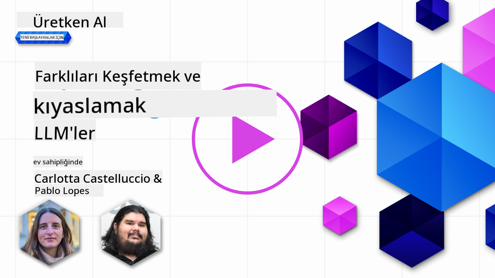](https://aka.ms/gen-ai-lesson2-gh?WT.mc_id=academic-105485-koreyst)

> _Bu dersin videosunu izlemek için yukarıdaki görsele tıklayın_

Önceki derste, Üretken Yapay Zekâ’nın teknoloji dünyasını nasıl değiştirdiğini, Büyük Dil Modelleri’nin (LLM’ler) nasıl çalıştığını ve bir işletmenin – bizim startup’ımız gibi – bunları nasıl kendi kullanım senaryolarına uygulayıp büyüyebileceğini gördük! Bu bölümde ise farklı türde büyük dil modellerini karşılaştırarak avantaj ve dezavantajlarını anlamaya çalışacağız.

Startup’ımızın yolculuğundaki bir sonraki adım, mevcut LLM manzarasını keşfetmek ve hangi modellerin bizim kullanım senaryomuza uygun olduğunu anlamak.

## Giriş

Bu derste şunlar ele alınacak:

- Mevcut ortamda farklı LLM türleri.
- Azure’da kullanım senaryonuza uygun modelleri test etme, yineleme ve karşılaştırma.
- Bir LLM’nin nasıl dağıtılacağı.

## Öğrenme Hedefleri

Bu dersi tamamladıktan sonra:

- Kullanım senaryonuza en uygun modeli seçebileceksiniz.
- Modelinizi nasıl test edeceğinizi, yineleyeceğinizi ve performansını nasıl artıracağınızı anlayacaksınız.
- İşletmelerin modelleri nasıl dağıttığını bileceksiniz.

## Farklı LLM Türlerini Anlamak

LLM’ler, mimarileri, eğitim verileri ve kullanım amaçlarına göre farklı kategorilere ayrılabilir. Bu farkları anlamak, startup’ımızın senaryoya uygun doğru modeli seçmesine ve modeli test edip performansını artırmasına yardımcı olur.

Çok sayıda farklı LLM modeli var; hangi modeli seçeceğiniz, onları ne amaçla kullanacağınıza, verinize, ne kadar harcama yapmaya hazır olduğunuza ve daha fazlasına bağlıdır.

Modelleri metin, ses, video, görsel üretimi gibi farklı amaçlarla kullanmayı planlıyorsanız, farklı model türlerine yönelebilirsiniz.

- **Ses ve konuşma tanıma**. Bu amaç için Whisper tipi modeller harika bir seçimdir çünkü genel amaçlıdır ve konuşma tanımaya yöneliktir. Çeşitli ses verileriyle eğitilmiştir ve çok dilli konuşma tanıma yapabilir. [Whisper tipi modeller hakkında daha fazla bilgi edinin](https://platform.openai.com/docs/models/whisper?WT.mc_id=academic-105485-koreyst).

- **Görsel üretimi**. Görsel üretimi için DALL-E ve Midjourney çok bilinen iki seçenektir. DALL-E, Azure OpenAI tarafından sunulmaktadır. [DALL-E hakkında daha fazla bilgi edinin](https://platform.openai.com/docs/models/dall-e?WT.mc_id=academic-105485-koreyst) ve ayrıca bu müfredatın 9. bölümünde.

- **Metin üretimi**. Çoğu model metin üretimi için eğitilmiştir ve GPT-3.5’ten GPT-4’e kadar geniş bir seçenek yelpazesi vardır. Farklı maliyetlerle gelir; GPT-4 en pahalı olanıdır. [Azure OpenAI playground](https://oai.azure.com/portal/playground?WT.mc_id=academic-105485-koreyst) üzerinden yetenek ve maliyet açısından ihtiyaçlarınıza en uygun modelleri değerlendirmek faydalı olacaktır.

- **Çoklu modalite**. Girdi ve çıktıda birden fazla veri türüyle çalışmak istiyorsanız, doğal dil işleme ile görsel anlayışı birleştiren ve çok modlu arayüzlerle etkileşim imkanı sunan [gpt-4 turbo with vision veya gpt-4o](https://learn.microsoft.com/azure/ai-services/openai/concepts/models#gpt-4-and-gpt-4-turbo-models?WT.mc_id=academic-105485-koreyst) gibi modelleri inceleyebilirsiniz – bunlar OpenAI’nin en yeni sürümleridir.

Bir model seçmek, size temel yetenekler sağlar ancak çoğu zaman bu yeterli olmaz. Genellikle şirketinize özgü verileri LLM’ye bir şekilde aktarmanız gerekir. Bu konuda farklı yaklaşımlar vardır, bunlara sonraki bölümlerde değineceğiz.

### Foundation Modeller ile LLM’ler Arasındaki Fark

Foundation Model terimi, [Stanford araştırmacıları tarafından ortaya atılmıştır](https://arxiv.org/abs/2108.07258?WT.mc_id=academic-105485-koreyst) ve şu kriterlere sahip AI modelleri olarak tanımlanır:

- **Gözetimsiz öğrenme veya kendi kendine gözetimli öğrenme ile eğitilirler**, yani etiketlenmemiş çok modlu veriler üzerinde eğitilirler ve eğitim sürecinde insan tarafından veri etiketlemesi gerekmez.
- **Çok büyük modellerdir**, milyarlarca parametre üzerinde eğitilmiş çok derin sinir ağlarına dayanırlar.
- **Genellikle diğer modeller için ‘temel’ olarak hizmet vermek üzere tasarlanırlar**, yani üzerine başka modeller inşa edilebilir ve ince ayar yapılabilir.

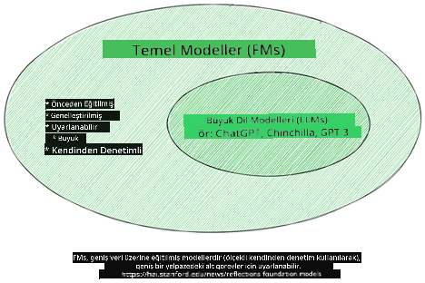

Görsel kaynağı: [Essential Guide to Foundation Models and Large Language Models | by Babar M Bhatti | Medium](https://thebabar.medium.com/essential-guide-to-foundation-models-and-large-language-models-27dab58f7404)

Bu farkı daha iyi anlamak için ChatGPT örneğine bakalım. ChatGPT’nin ilk versiyonunu oluşturmak için GPT-3.5 adlı bir model temel model olarak kullanıldı. Bu, OpenAI’nin sohbet odaklı verilerle GPT-3.5’i ince ayar yaparak sohbet senaryolarında iyi performans gösteren özel bir versiyon oluşturduğu anlamına gelir.

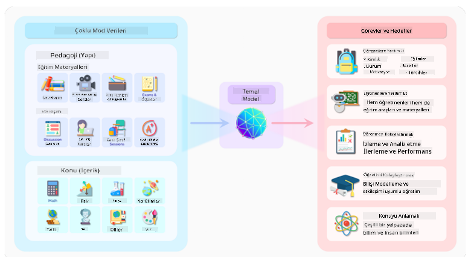

Görsel kaynağı: [2108.07258.pdf (arxiv.org)](https://arxiv.org/pdf/2108.07258.pdf?WT.mc_id=academic-105485-koreyst)

### Açık Kaynak Modeller ile Tescilli Modeller

LLM’leri sınıflandırmanın bir diğer yolu, açık kaynak mı yoksa tescilli (proprietary) modeller mi olduklarıdır.

Açık kaynak modeller, halka açık olarak sunulan ve herkesin kullanabileceği modellerdir. Genellikle onları geliştiren şirket veya araştırma topluluğu tarafından erişime açılırlar. Bu modeller incelenebilir, değiştirilebilir ve farklı kullanım senaryolarına göre özelleştirilebilir. Ancak, üretim kullanımı için her zaman optimize edilmemiş olabilirler ve tescilli modellere göre performansları daha düşük olabilir. Ayrıca, açık kaynak modellerin finansmanı sınırlı olabilir, uzun vadede bakım ve güncellemeleri olmayabilir. Popüler açık kaynak modeller arasında [Alpaca](https://crfm.stanford.edu/2023/03/13/alpaca.html?WT.mc_id=academic-105485-koreyst), [Bloom](https://huggingface.co/bigscience/bloom) ve [LLaMA](https://llama.meta.com) bulunur.

Tescilli modeller ise bir şirkete ait olup halka açık olmayan modellerdir. Genellikle üretim kullanımı için optimize edilmişlerdir. Ancak, incelenmeleri, değiştirilmesi veya farklı senaryolara göre özelleştirilmesi mümkün değildir. Ayrıca, genellikle ücretsiz değildirler ve kullanmak için abonelik veya ödeme gerektirebilirler. Kullanıcılar, modelin eğitildiği veriler üzerinde kontrol sahibi değildir; bu nedenle veri gizliliği ve yapay zekânın sorumlu kullanımı konusunda model sahibine güvenmelidirler. Popüler tescilli modellere örnek olarak [OpenAI modelleri](https://platform.openai.com/docs/models/overview?WT.mc_id=academic-105485-koreyst), [Google Bard](https://sapling.ai/llm/bard?WT.mc_id=academic-105485-koreyst) ve [Claude 2](https://www.anthropic.com/index/claude-2?WT.mc_id=academic-105485-koreyst) verilebilir.

### Embedding, Görsel Üretimi ve Metin & Kod Üretimi

LLM’ler, ürettikleri çıktıya göre de sınıflandırılabilir.

Embedding modelleri, metni sayısal bir forma, yani embedding’e dönüştüren modellerdir. Embedding, giriş metninin sayısal temsili olup, makinelerin kelimeler veya cümleler arasındaki ilişkileri anlamasını kolaylaştırır. Bu sayısal temsiller, sınıflandırma veya kümeleme gibi diğer modeller tarafından girdi olarak kullanılabilir ve sayısal veriler üzerinde daha iyi performans gösterir. Embedding modelleri genellikle transfer öğrenme için kullanılır; bol veri bulunan bir görev için model eğitilir ve ardından model ağırlıkları (embedding’ler) diğer görevlerde yeniden kullanılır. Bu kategoriye örnek olarak [OpenAI embeddings](https://platform.openai.com/docs/models/embeddings?WT.mc_id=academic-105485-koreyst) verilebilir.

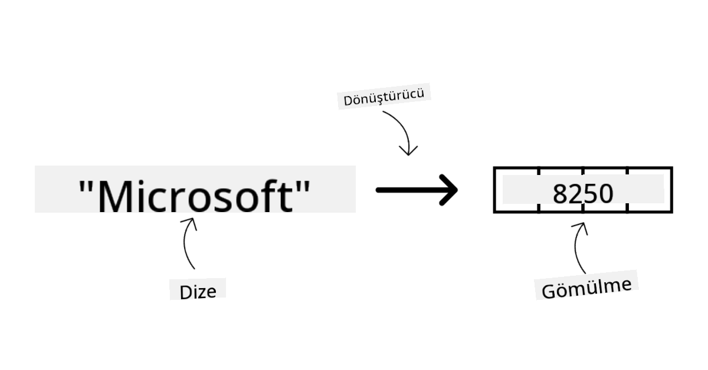

Görsel üretim modelleri, görsel oluşturan modellerdir. Genellikle görsel düzenleme, sentezleme ve çeviri için kullanılırlar. Bu modeller, [LAION-5B](https://laion.ai/blog/laion-5b/?WT.mc_id=academic-105485-koreyst) gibi büyük görsel veri setleri üzerinde eğitilir ve yeni görseller oluşturabilir veya mevcut görselleri inpainting, süper çözünürlük ve renklendirme teknikleriyle düzenleyebilirler. Örnekler arasında [DALL-E-3](https://openai.com/dall-e-3?WT.mc_id=academic-105485-koreyst) ve [Stable Diffusion modelleri](https://github.com/Stability-AI/StableDiffusion?WT.mc_id=academic-105485-koreyst) bulunur.

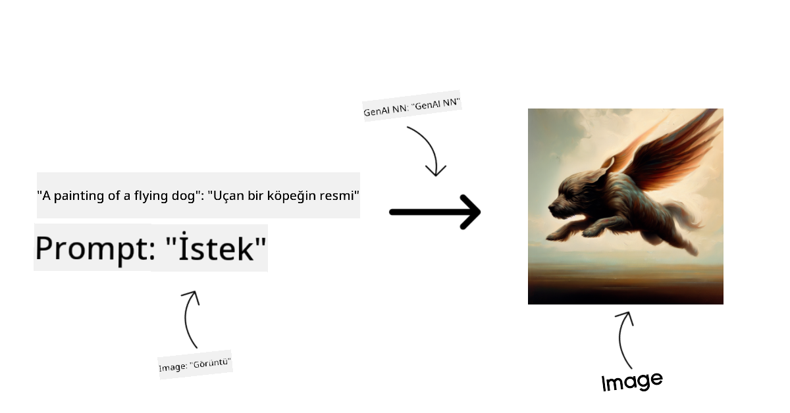

Metin ve kod üretim modelleri, metin veya kod üreten modellerdir. Genellikle metin özetleme, çeviri ve soru yanıtlama için kullanılırlar. Metin üretim modelleri, [BookCorpus](https://www.cv-foundation.org/openaccess/content_iccv_2015/html/Zhu_Aligning_Books_and_ICCV_2015_paper.html?WT.mc_id=academic-105485-koreyst) gibi büyük metin veri setleri üzerinde eğitilir ve yeni metinler oluşturabilir veya soruları yanıtlayabilirler. Kod üretim modelleri, örneğin [CodeParrot](https://huggingface.co/codeparrot?WT.mc_id=academic-105485-koreyst), GitHub gibi büyük kod veri setleri üzerinde eğitilir ve yeni kod yazabilir veya mevcut kodlardaki hataları düzeltebilir.

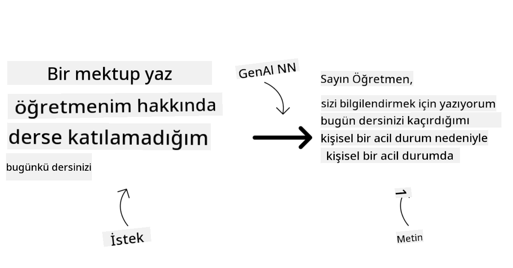

### Encoder-Decoder ile Sadece Decoder Modelleri

LLM’lerin farklı mimarilerini anlatmak için bir benzetme yapalım.

Yöneticiniz size öğrenciler için bir quiz hazırlama görevi verdi. İki iş arkadaşınız var; biri içeriği oluşturuyor, diğeri ise gözden geçiriyor.

İçerik oluşturucu, sadece Decoder modeline benzer; konuyu görür, sizin yazdıklarınızı inceler ve buna dayanarak bir ders yazabilir. İlgi çekici ve bilgilendirici içerik yazmada çok iyidirler ama konuyu ve öğrenme hedeflerini anlamada o kadar iyi değiller. Decoder modellerine örnek olarak GPT ailesi, özellikle GPT-3 verilebilir.

Gözden geçiren ise sadece Encoder modeline benzer; yazılan dersi ve cevapları inceler, aralarındaki ilişkiyi fark eder ve bağlamı anlar ama içerik üretmede iyi değildir. Encoder modellerine örnek olarak BERT verilebilir.

Hem içerik oluşturup hem de gözden geçiren biri olsaydı, bu Encoder-Decoder modeli olurdu. Örnekler arasında BART ve T5 bulunur.

### Servis ile Model Arasındaki Fark

Şimdi, servis ile model arasındaki farkı konuşalım. Servis, Bulut Hizmet Sağlayıcısı tarafından sunulan bir üründür ve genellikle modeller, veriler ve diğer bileşenlerin birleşimidir. Model ise servisin temel bileşenidir ve genellikle bir foundation model, örneğin bir LLM’dir.

Servisler genellikle üretim kullanımı için optimize edilmiştir ve modellerden daha kolay kullanılır; genellikle grafiksel kullanıcı arayüzü sunarlar. Ancak servisler her zaman ücretsiz değildir ve kullanmak için abonelik veya ödeme gerekebilir. Bu, servis sahibinin donanım ve kaynaklarını kullanmak, maliyetleri optimize etmek ve ölçeklendirmeyi kolaylaştırmak içindir. Örnek olarak [Azure OpenAI Service](https://learn.microsoft.com/azure/ai-services/openai/overview?WT.mc_id=academic-105485-koreyst) verilebilir; bu servis kullandıkça öde fiyatlandırma sunar ve kurumsal düzeyde güvenlik ile modellerin yetenekleri üzerine sorumlu yapay zekâ çerçevesi sağlar.

Modeller ise sadece sinir ağıdır; parametreler, ağırlıklar ve diğer bileşenlerden oluşur. Şirketlerin yerel olarak çalıştırması mümkündür ancak bunun için donanım satın almaları, ölçeklendirme yapıları kurmaları ve lisans almaları veya açık kaynak model kullanmaları gerekir. Örneğin LLaMA modeli kullanılabilir ancak çalıştırmak için hesaplama gücü gerektirir.

## Azure’da Farklı Modelleri Test Etme ve Performansı Anlamak İçin Yineleme Yapma

Ekibimiz mevcut LLM ortamını keşfedip senaryolarına uygun bazı adayları belirledikten sonra, bir sonraki adım bu modelleri kendi verileri ve iş yükleri üzerinde test etmektir. Bu, deneyler ve ölçümlerle yapılan yinelemeli bir süreçtir.
Önceki paragraflarda bahsettiğimiz modellerin çoğu (OpenAI modelleri, Llama2 gibi açık kaynak modeller ve Hugging Face transformerları) [Azure AI Studio](https://ai.azure.com/?WT.mc_id=academic-105485-koreyst) içindeki [Model Kataloğu](https://learn.microsoft.com/azure/ai-studio/how-to/model-catalog-overview?WT.mc_id=academic-105485-koreyst) bölümünde mevcuttur.

[Azure AI Studio](https://learn.microsoft.com/azure/ai-studio/what-is-ai-studio?WT.mc_id=academic-105485-koreyst), geliştiricilerin üretken yapay zeka uygulamaları oluşturmasını ve deneyden değerlendirmeye kadar tüm geliştirme sürecini yönetmesini sağlayan, tüm Azure AI hizmetlerini kullanışlı bir GUI ile tek bir merkezde birleştiren bir Bulut Platformudur. Azure AI Studio’daki Model Kataloğu kullanıcıya şu imkânları sunar:

- İlginizi çeken Temel Modeli katalogda bulun - ister özel ister açık kaynak olsun, görev, lisans veya isim bazında filtreleyin. Aramayı kolaylaştırmak için modeller Azure OpenAI koleksiyonu, Hugging Face koleksiyonu gibi koleksiyonlar halinde düzenlenmiştir.

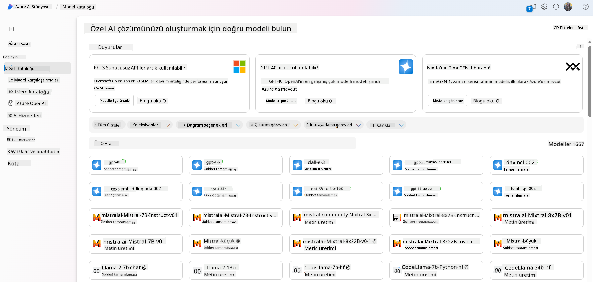

- Model kartını inceleyin; kullanım amacı ve eğitim verisi hakkında detaylı açıklamalar, kod örnekleri ve dahili değerlendirme kütüphanesindeki sonuçlar dahil.

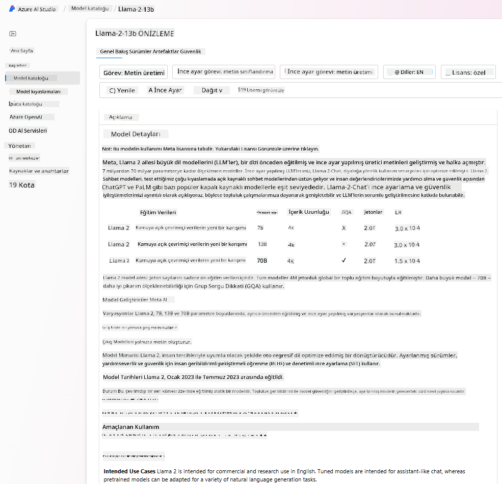

- [Model Benchmarks](https://learn.microsoft.com/azure/ai-studio/how-to/model-benchmarks?WT.mc_id=academic-105485-koreyst) paneli üzerinden sektördeki modeller ve veri setleri arasındaki karşılaştırmaları yaparak iş senaryonuza en uygun olanı değerlendirin.

- Azure AI Studio’nun deney yapma ve takip özelliklerini kullanarak, özel eğitim verisiyle modeli ince ayar yaparak belirli iş yüklerinde performansını artırın.

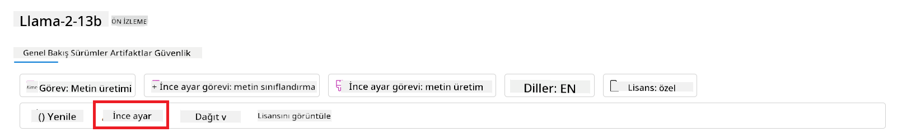

- Orijinal önceden eğitilmiş modeli veya ince ayar yapılmış versiyonunu, uygulamaların kullanabilmesi için uzaktan gerçek zamanlı çıkarım - yönetilen hesaplama - veya sunucusuz API uç noktalarına - [kullandıkça öde](https://learn.microsoft.com/azure/ai-studio/how-to/model-catalog-overview#model-deployment-managed-compute-and-serverless-api-pay-as-you-go?WT.mc_id=academic-105485-koreyst) - dağıtın.

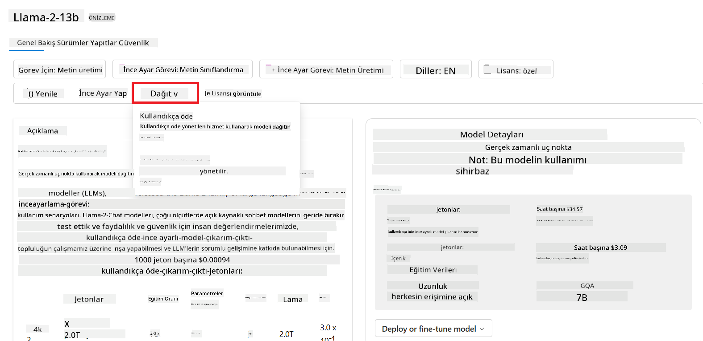

> [!NOTE]
> Katalogdaki tüm modeller şu anda ince ayar yapma ve/veya kullandıkça öde dağıtımı için uygun olmayabilir. Modelin yetenekleri ve sınırlamaları hakkında detaylar için model kartını kontrol edin.

## LLM sonuçlarını iyileştirme

Startup ekibimizle farklı türde LLM’leri ve farklı modelleri karşılaştırmamıza, test verileri üzerinde değerlendirmemize, performanslarını artırmamıza ve çıkarım uç noktalarına dağıtmamıza olanak sağlayan bir Bulut Platformu (Azure Machine Learning) üzerinde çalıştık.

Peki, önceden eğitilmiş bir modeli kullanmak yerine ne zaman ince ayar yapılmış bir modeli tercih etmeliler? Belirli iş yüklerinde model performansını artırmak için başka yaklaşımlar var mı?

Bir işletmenin LLM’den ihtiyaç duyduğu sonuçları almak için kullanabileceği birkaç yöntem vardır. Üretimde LLM dağıtırken farklı eğitim seviyelerine sahip farklı model türleri seçebilirsiniz; bunlar farklı karmaşıklık, maliyet ve kalite seviyelerine sahiptir. İşte bazı farklı yaklaşımlar:

- **Bağlam ile prompt mühendisliği**. İhtiyacınız olan yanıtları almak için prompt verirken yeterli bağlam sağlamaktır.

- **Retrieval Augmented Generation, RAG**. Verileriniz örneğin bir veritabanında veya web uç noktasında olabilir; bu verilerin veya bir alt kümesinin prompt sırasında dahil edilmesini sağlamak için ilgili veriyi çekip kullanıcının promptunun bir parçası yapabilirsiniz.

- **İnce ayar yapılmış model**. Burada, modeli kendi verilerinizle daha fazla eğitirsiniz; bu da modelin ihtiyaçlarınıza daha kesin ve duyarlı olmasını sağlar ancak maliyetli olabilir.

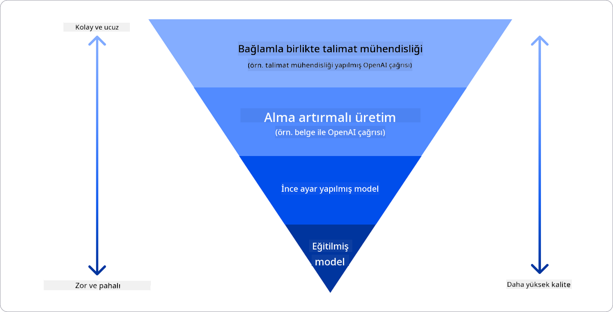

Resim kaynağı: [Four Ways that Enterprises Deploy LLMs | Fiddler AI Blog](https://www.fiddler.ai/blog/four-ways-that-enterprises-deploy-llms?WT.mc_id=academic-105485-koreyst)

### Bağlam ile Prompt Mühendisliği

Önceden eğitilmiş LLM’ler, kısa bir prompt ile bile (tamamlanacak bir cümle veya soru gibi) genel doğal dil görevlerinde çok iyi çalışır; buna “sıfır atış” öğrenme denir.

Ancak kullanıcı sorgusunu detaylı bir istek ve örneklerle - yani Bağlam ile - ne kadar iyi çerçevelerse, cevap o kadar doğru ve beklentiye yakın olur. Prompt sadece bir örnek içeriyorsa buna “bir atış” öğrenme, birden fazla örnek varsa “birkaç atış” öğrenme denir. Bağlam ile prompt mühendisliği, başlamak için en maliyet etkin yaklaşımdır.

### Retrieval Augmented Generation (RAG)

LLM’lerin sınırlaması, yanıt üretmek için yalnızca eğitim sırasında kullandıkları verileri kullanabilmeleridir. Bu, eğitim sonrası gerçekleşen olaylar hakkında bilgi sahibi olmadıkları ve özel bilgilere (örneğin şirket verileri) erişemedikleri anlamına gelir.  
Bu, prompt’a dış veri parçaları ekleyen RAG tekniğiyle aşılabilir; prompt uzunluğu sınırları göz önünde bulundurularak belgelerden alınan parçalar eklenir. Bu, [Azure Vector Search](https://learn.microsoft.com/azure/search/vector-search-overview?WT.mc_id=academic-105485-koreyst) gibi Vektör veritabanı araçları tarafından desteklenir; bu araçlar çeşitli önceden tanımlanmış veri kaynaklarından faydalı parçaları bulup prompt bağlamına ekler.

Bu teknik, bir işletmenin yeterli veri, zaman veya kaynağı olmadan LLM’yi ince ayar yapamaması durumunda, belirli iş yüklerinde performansı artırmak ve gerçek dışı veya zararlı içerik riskini azaltmak için çok faydalıdır.

### İnce ayar yapılmış model

İnce ayar, transfer öğrenmeyi kullanarak modeli belirli bir göreve uyarlama veya özel bir problemi çözme sürecidir. Birkaç atış öğrenme ve RAG’den farklı olarak, güncellenmiş ağırlıklar ve biaslarla yeni bir model oluşturulur. Eğitim örnekleri, tek bir girdi (prompt) ve ona karşılık gelen çıktı (tamamlama) çiftlerinden oluşur.  
Bu yaklaşım tercih edilir:

- **İnce ayar yapılmış modelleri kullanmak**. İşletme, yüksek performanslı modeller yerine ince ayar yapılmış daha az yetenekli modelleri (örneğin embedding modelleri) kullanmak isteyebilir; bu daha uygun maliyetli ve hızlı bir çözümdür.

- **Gecikme süresini dikkate almak**. Belirli bir kullanım durumu için gecikme önemliyse, çok uzun promptlar kullanmak mümkün olmayabilir veya modelin öğrenmesi gereken örnek sayısı prompt uzunluğu sınırına uymaz.

- **Güncel kalmak**. İşletmenin çok sayıda yüksek kaliteli veri ve doğru etiketleri varsa ve bu verileri zaman içinde güncel tutmak için kaynakları bulunuyorsa.

### Eğitilmiş model

Sıfırdan bir LLM eğitmek kesinlikle en zor ve en karmaşık yaklaşımdır; büyük miktarda veri, uzman kaynaklar ve uygun hesaplama gücü gerektirir. Bu seçenek, işletmenin alanına özgü bir kullanım durumu ve büyük miktarda alan odaklı verisi olduğu durumlarda düşünülmelidir.

## Bilgi kontrolü

LLM tamamlama sonuçlarını iyileştirmek için iyi bir yaklaşım ne olabilir?

1. Bağlam ile prompt mühendisliği  
1. RAG  
1. İnce ayar yapılmış model

Cevap: 3, zamanınız, kaynaklarınız ve yüksek kaliteli veriniz varsa, güncel kalmak için ince ayar yapmak daha iyidir. Ancak iyileştirme yapmak istiyor ve zamanınız kısıtlıysa önce RAG’i değerlendirmek faydalı olabilir.

## 🚀 Meydan Okuma

İşletmeniz için [RAG’i nasıl kullanabileceğinizi](https://learn.microsoft.com/azure/search/retrieval-augmented-generation-overview?WT.mc_id=academic-105485-koreyst) daha detaylı inceleyin.

## Harika İş, Öğrenmeye Devam Et

Bu dersi tamamladıktan sonra, üretken yapay zeka bilginizi geliştirmeye devam etmek için [Generative AI Learning koleksiyonumuza](https://aka.ms/genai-collection?WT.mc_id=academic-105485-koreyst) göz atın!

Bir sonraki ders olan Ders 3’e geçin; burada [Üretken Yapay Zekayı Sorumlu Bir Şekilde Nasıl Kullanacağımızı](../03-using-generative-ai-responsibly/README.md?WT.mc_id=academic-105485-koreyst) inceleyeceğiz!

**Feragatname**:  
Bu belge, AI çeviri servisi [Co-op Translator](https://github.com/Azure/co-op-translator) kullanılarak çevrilmiştir. Doğruluk için çaba gösterilse de, otomatik çevirilerin hatalar veya yanlışlıklar içerebileceğini lütfen unutmayınız. Orijinal belge, kendi dilinde yetkili kaynak olarak kabul edilmelidir. Kritik bilgiler için profesyonel insan çevirisi önerilir. Bu çevirinin kullanımı sonucu oluşabilecek yanlış anlamalar veya yorum hatalarından sorumlu değiliz.