# Farklı LLM'leri Keşfetmek ve Karşılaştırmak

[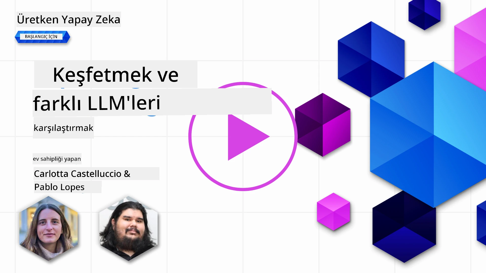](https://youtu.be/KIRUeDKscfI?si=8BHX1zvwzQBn-PlK)

> _Bu dersin videosunu izlemek için yukarıdaki resme tıklayın_

Önceki derste, Yaratıcı AI'nın teknoloji ortamını nasıl değiştirdiğini, Büyük Dil Modellerinin (LLM'ler) nasıl çalıştığını ve bir işletme - örneğin start-up'ımızın - bunları kullanım durumlarına nasıl uygulayabileceğini ve büyüyebileceğini gördük! Bu bölümde, farklı türde büyük dil modellerini karşılaştırıp kıyaslayarak avantajlarını ve dezavantajlarını anlamaya çalışacağız.

Start-up'ımızın yolculuğundaki sonraki adım, mevcut LLM ortamını keşfetmek ve hangilerinin kullanım durumumuz için uygun olduğunu anlamaktır.

## Giriş

Bu ders şunları kapsayacaktır:

- Mevcut ortamda farklı LLM türleri.
- Azure'da kullanım durumunuz için farklı modelleri test etmek, yinelemek ve karşılaştırmak.
- Bir LLM'in nasıl dağıtılacağı.

## Öğrenme Hedefleri

Bu dersi tamamladıktan sonra şunları yapabileceksiniz:

- Kullanım durumunuz için doğru modeli seçmek.
- Modelinizi nasıl test edeceğinizi, yineleyeceğinizi ve performansını nasıl artıracağınızı anlamak.
- İşletmelerin modelleri nasıl dağıttığını bilmek.

## Farklı LLM türlerini anlamak

LLM'ler, mimarileri, eğitim verileri ve kullanım durumlarına göre çoklu kategorilere ayrılabilir. Bu farklılıkları anlamak, start-up'ımızın senaryo için doğru modeli seçmesine ve performansı test edip, yineleyip geliştirmesine yardımcı olacaktır.

Çok sayıda farklı LLM modeli vardır; model seçiminiz, onları ne için kullanmayı amaçladığınıza, verilerinize, ödemeye ne kadar hazır olduğunuza ve diğer unsurlara bağlıdır.

Modelleri metin, ses, video, resim üretimi vb. amaçlar için kullanmayı planlıyorsanız, farklı tür modelleri tercih edebilirsiniz.

- **Ses ve konuşma tanıma**. Whisper tarzı modeller hala genel amaçlı konuşma tanıma modelleri olarak faydalıdır; ancak üretim seçenekleri artık `gpt-4o-transcribe`, `gpt-4o-mini-transcribe` ve diarizasyon varyantları gibi daha yeni ses-ten metin modellerini de içerir. Senaryonuz için dil kapsamını, diarizasyonu, gerçek zamanlı desteği, gecikmeyi ve maliyeti değerlendirin. Daha fazla bilgi için [OpenAI ses-ten metin dokümantasyonu](https://platform.openai.com/docs/guides/speech-to-text?WT.mc_id=academic-105485-koreyst) sayfasını inceleyin.

- **Görüntü üretimi**. DALL-E ve Midjourney iyi bilinen görüntü üretim seçenekleridir, ancak mevcut OpenAI görüntü API'leri `gpt-image-2` gibi GPT Görüntü modellerine odaklanırken, Stable Diffusion, Imagen, Flux ve diğer model aileleri de yaygın olarak tercih edilir. İsteklere uygunluk, düzenleme desteği, stil kontrolü, güvenlik gereksinimleri ve lisanslama karşılaştırması yapın. Daha fazla bilgi için [OpenAI görüntü üretim kılavuzu](https://platform.openai.com/docs/guides/images?WT.mc_id=academic-105485-koreyst) ve bu müfredatın 9. Bölümüne bakınız.

- **Metin üretimi**. Metin modelleri artık sınır modelleri, mantık modelleri, daha küçük düşük gecikmeli modeller ve açık ağırlıklı modelleri kapsar. Güncel örnekler arasında OpenAI GPT-5.x modelleri, Anthropic Claude 4.x modelleri, Google Gemini 3.x modelleri, Meta Llama 4 modelleri ve Mistral modelleri bulunur. Sadece çıkış tarihi veya fiyat ile seçim yapmayın; görev kalitesi, gecikme, bağlam penceresi, araç kullanımı, güvenlik davranışı, bölgesel erişim ve toplam maliyet açısından karşılaştırın. Azure'daki modelleri karşılaştırmak için [Microsoft Foundry model kataloğu](https://ai.azure.com/catalog?WT.mc_id=academic-105485-koreyst) iyi bir kaynaktır.

- **Çoklu modalite**. Mevcut birçok model metin dışındaki girdileri işleyebilir. Bazıları resim, ses veya video girişi kabul eder; bazıları araç çağırabilir; ve özel modeller resim, ses veya video üretebilir. Örneğin, mevcut OpenAI modelleri metin ve resim girişini destekler, Gemini modelleri varyanta bağlı olarak metin, kod, resim, ses ve video girişini destekler; Llama 4 Scout ve Maverick ise kendi başına çok modlu açık ağırlıklı modellerdir. Bir iş akışı oluşturmadan önce her model kartındaki desteklenen giriş ve çıkış modalitelerini mutlaka kontrol edin.

Bir model seçmek size bazı temel yetenekler sağlar, ancak bu her zaman yeterli olmayabilir. Çoğunlukla şirketinize özgü veriler vardır ve bu verileri LLM'e bir şekilde anlatmanız gerekir. Bu konuda farklı yaklaşımlar vardır; bununla ilgili detaylar sonraki bölümlerde.

### Temel Modeller (Foundation Models) ve LLM'ler Arasındaki Fark

Temel Model terimi, [Stanford araştırmacıları tarafından ortaya atılmıştır](https://arxiv.org/abs/2108.07258?WT.mc_id=academic-105485-koreyst) ve bazı kriterleri karşılayan bir AI modeli olarak tanımlanır:

- **Gözetimsiz öğrenme veya kendi kendine gözetimli öğrenme kullanılarak eğitilirler**, yani etiketlenmemiş çok modlu verilerle eğitim alırlar ve eğitimleri için insan tarafından notlandırma veya etiketleme gerekmez.
- **Çok büyük modellerdir**, çok derin sinir ağlarına dayanırlar ve milyarlarca parametre üzerinde eğitilirler.
- **Normalde diğer modeller için ‘temel’ olarak hizmet etmesi amaçlanmıştır**, yani üzerine inşa edilecek diğer modellerin başlangıç noktası olarak kullanılabilirler, ince ayar (fine-tuning) ile yapılabilir.

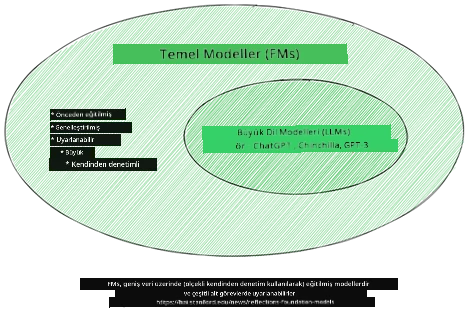

Görsel kaynak: [Essential Guide to Foundation Models and Large Language Models | by Babar M Bhatti | Medium
](https://thebabar.medium.com/essential-guide-to-foundation-models-and-large-language-models-27dab58f7404)

Bu farkı daha iyi açıklamak için tarihsel bir örnek olarak ChatGPT'yi ele alalım. ChatGPT'nin erken sürümleri, temel model olarak GPT-3.5'i kullandı. OpenAI, sohbete özel veriler ve hizalama teknikleri kullanarak sohbet robotları gibi senaryolarda daha iyi performans gösteren ayarlanmış bir sürüm oluşturdu. Günümüzün AI hizmetleri sıklıkla birkaç model varyantı arasında yönlendirme yapar, dolayısıyla servis adı ile altyapıdaki model adı her zaman aynı olmayabilir.

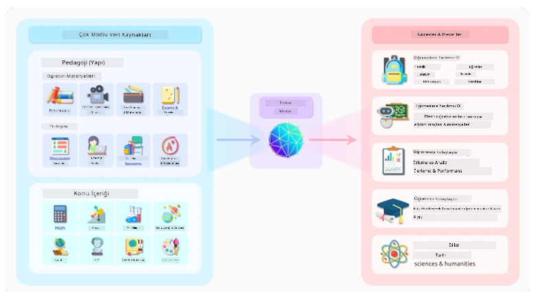

Görsel kaynak: [2108.07258.pdf (arxiv.org)](https://arxiv.org/pdf/2108.07258.pdf?WT.mc_id=academic-105485-koreyst)

### Açık-Ağırlıklı / Açık Kaynak versus Tescilli Modeller

LLM'leri sınıflandırmanın bir diğer yolu, açık ağırlıklı, açık kaynaklı veya tescilli olup olmadıklarıdır.

Açık kaynak ve açık ağırlıklı modeller, model varlıklarını inceleme, indirme veya özelleştirme için erişime açar, ancak lisansları farklıdır. Bazıları tamamen açık kaynaklıdır; bazıları ise kullanım kısıtlamaları olan açık ağırlıklı modellerdir. Bir işletmenin dağıtım, veri yerelliği, maliyet veya özelleştirme üzerinde daha fazla kontrol sahibi olması gerektiğinde yararlı olabilirler. Yine de ekipler, üretimde kullanmadan önce lisans koşullarını, sunucu maliyetlerini, bakım, güvenlik güncellemelerini ve değerlendirme kalitesini gözden geçirmelidir. Örnekler arasında [Meta Llama 4](https://ai.meta.com/blog/llama-4-multimodal-intelligence/?WT.mc_id=academic-105485-koreyst), bazı [Mistral modelleri](https://docs.mistral.ai/models/overview?WT.mc_id=academic-105485-koreyst), ve [Hugging Face](https://huggingface.co/models?WT.mc_id=academic-105485-koreyst) üzerinde barındırılan birçok model yer almaktadır.

Tescilli modeller bir sağlayıcıya ait ve onun tarafından barındırılır. Bu modeller genellikle yönetilen üretim kullanımı için optimize edilir ve güçlü destek, güvenlik sistemleri, araç entegrasyonu ve ölçek sunabilir. Ancak müşteriler genellikle model ağırlıklarını inceleyemez veya değiştiremez ve gizlilik, saklama, uyumluluk ve kabul edilebilir kullanım için sağlayıcı şartlarını kontrol etmeleri gerekir. Örnekler arasında [OpenAI modelleri](https://platform.openai.com/docs/models?WT.mc_id=academic-105485-koreyst), [Google Gemini](https://deepmind.google/models/gemini/pro/?WT.mc_id=academic-105485-koreyst) ve [Anthropic Claude](https://platform.claude.com/docs/en/about-claude/models/overview?WT.mc_id=academic-105485-koreyst) bulunmaktadır.

### Embedding, Görüntü Üretimi ve Metin ile Kod Üretimi

LLM'ler ayrıca ürettikleri çıktıya göre de sınıflandırılabilir.

Embedding (gömme) modelleri, metni sayısal bir biçime dönüştürebilen modellerdir; bu, giriş metninin sayısal temsilidir. Embedding'ler, makinelerin kelimeler veya cümleler arasındaki ilişkileri anlamasını kolaylaştırır ve sınıflandırma modelleri veya sayısal verilerde daha yüksek performans sağlayan kümeleme modelleri gibi diğer modellerin girdisi olarak kullanılabilir. Embedding modelleri genellikle transfer öğrenme için kullanılır; bol veri bulunan bir vekil görev için model oluşturulur, ardından model ağırlıkları (embedding'ler) diğer alt görevlerde yeniden kullanılır. Bu kategoriye örnek olarak [OpenAI embedding'leri](https://platform.openai.com/docs/models/embeddings?WT.mc_id=academic-105485-koreyst) verilebilir.

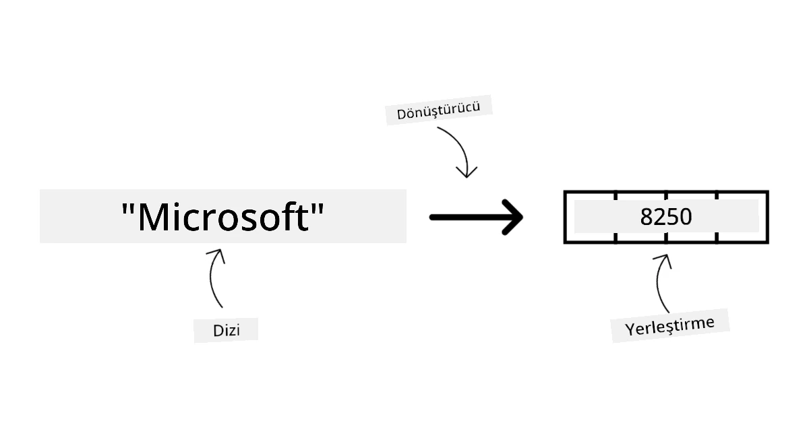

Görüntü üretim modelleri, resim üreten modellerdir. Bu modeller sıklıkla resim düzenleme, sentezleme ve dönüştürme için kullanılır. Görüntü üretim modelleri genellikle [LAION-5B](https://laion.ai/blog/laion-5b/?WT.mc_id=academic-105485-koreyst) gibi büyük resim veri kümeleri üzerinde eğitilir ve yeni resimler oluşturmak veya var olanları inpainting, süper çözünürlük ve renklendirme teknikleriyle düzenlemek için kullanılabilir. Örnekler arasında [GPT Görüntü modelleri](https://platform.openai.com/docs/guides/images?WT.mc_id=academic-105485-koreyst), [Stable Diffusion modelleri](https://github.com/Stability-AI/StableDiffusion?WT.mc_id=academic-105485-koreyst) ve Imagen modelleri vardır.

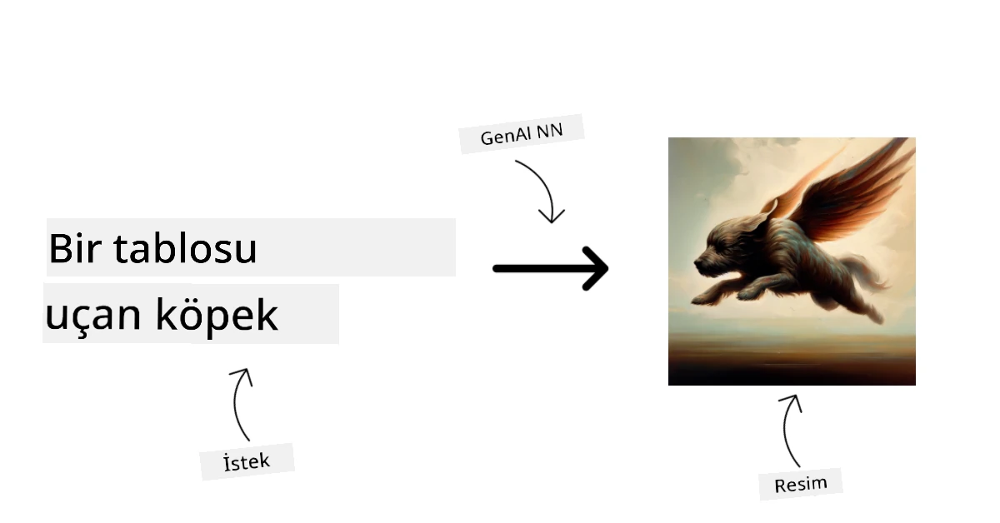

Metin ve kod üretim modelleri, metin veya kod üreten modellerdir. Bu modeller sıklıkla metin özetleme, çeviri ve soru yanıtlama için kullanılır. Metin üretim modelleri genellikle [BookCorpus](https://www.cv-foundation.org/openaccess/content_iccv_2015/html/Zhu_Aligning_Books_and_ICCV_2015_paper.html?WT.mc_id=academic-105485-koreyst) gibi büyük metin veri kümeleri üzerinde eğitilir ve yeni metin oluşturmak veya soruları yanıtlamak için kullanılabilir. Kod üretim modelleri, örneğin [CodeParrot](https://huggingface.co/codeparrot?WT.mc_id=academic-105485-koreyst), genellikle GitHub gibi büyük kod veri kümeleri üzerinde eğitilir ve yeni kod üretmek veya mevcut koddaki hataları düzeltmek için kullanılır.

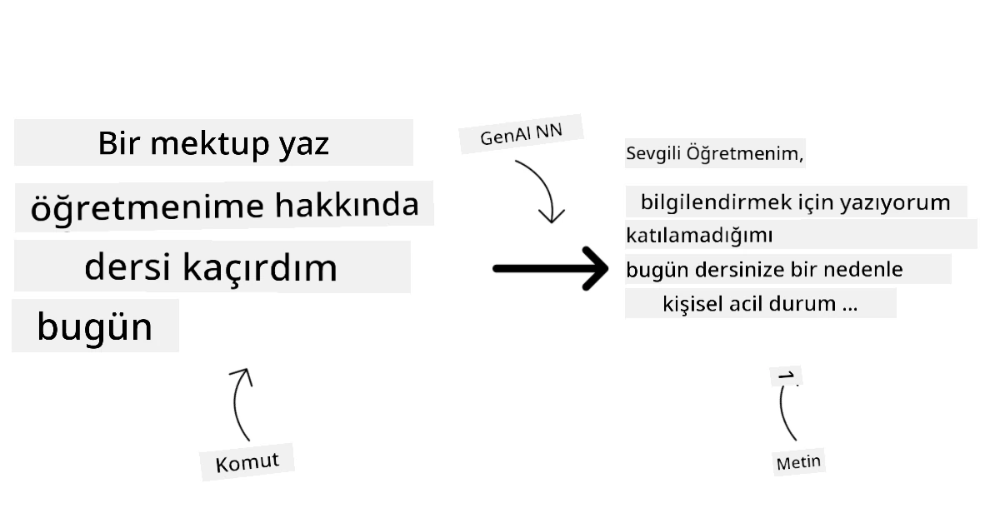

### Encoder-Decoder ve Sadece Decoder Modeller

LLM mimarilerinin farklı türlerinden bahsetmek için bir benzetme kullanalım.

Yöneticiniz size öğrenciler için bir quiz hazırlama görevi verdiğini hayal edin. İki iş arkadaşınız var; biri içeriğin oluşturulmasından, diğeri ise incelemesinden sorumlu.

İçerik oluşturucu, sadece decoder modeli gibidir: konuyu görür, zaten yazdıklarınıza bakar ve ardından bu bağlamı kullanarak içeriği üretmeye devam eder. İlgi çekici ve bilgilendirici içerik yazmakta çok iyidirler, ancak sadece sınıflandırma, alma veya bilgi kodlama gibi görevler için her zaman en iyi seçim olmayabilirler. Decoder-only model ailelerine örnek olarak GPT ve Llama modelleri verilebilir.

İnceleyen kişi ise yalnızca encoder modeli gibidir; yazılan dersi ve cevapları inceler, aralarındaki ilişkileri fark eder ve bağlamı anlar, ancak içerik üretmekte iyi değildir. Encoder-only model örneği olarak BERT verilebilir.

Quiz'i hem oluşturup hem inceleyebilen birisi olduğunu hayal edin, bu Encoder-Decoder modeline benzer. Örnekler arasında BART ve T5 bulunur.

### Servis ve Model Arasındaki Fark

Şimdi, servis ile model arasındaki farkı konuşalım. Servis, bir Bulut Servis Sağlayıcısı tarafından sunulan bir üründür ve genellikle modeller, veriler ve diğer bileşenlerin birleşimidir. Model ise bir servisin temel bileşenidir ve genellikle bir temel model, örneğin bir LLM'dir.

Servisler genellikle üretim kullanımı için optimize edilmiştir ve modellerden daha kolay kullanılır, genellikle grafiksel kullanıcı arayüzü sunarlar. Ancak servisler her zaman ücretsiz olmayabilir, kullanmak için abonelik veya ödeme gerekebilir; bunun karşılığında servis sahibi ekipman ve kaynakları sağlar, giderleri optimize eder ve ölçeklemeyi kolaylaştırır. Örnek olarak, kullanıcının kullandığı kadar ücret ödediği pay-as-you-go fiyatlandırma planı sunan [Azure OpenAI Servisi](https://learn.microsoft.com/azure/ai-foundry/openai/overview?WT.mc_id=academic-105485-koreyst) verilebilir. Azure OpenAI Servisi ayrıca, kurumsal düzeyde güvenlik ve modellerin yeteneklerinin üzerine sorumlu AI çerçevesi sunar.

Modeller, sinir ağı varlıklarıdır: parametreler, ağırlıklar, mimari, tokenizer ve destekleyici yapılandırma. Bir modeli yerel veya özel bir ortamda çalıştırmak uygun donanım, sunucu altyapısı, izleme ve uyumlu açık kaynak/açık ağırlık lisansı veya ticari lisans gerektirir. Llama 4 veya Mistral gibi açık ağırlıklı modeller kendi kendine barındırılabilir, ancak yine de hesaplama gücü ve operasyonel uzmanlık gerekir.

## Performansı anlamak için Azure'da farklı modellerle nasıl test edilir ve yineleme yapılır

Ekibimiz mevcut LLM manzarasını keşfedip senaryoları için bazı iyi adayları belirledikten sonra, bir sonraki adım onları kendi verileri ve iş yükleri üzerinde test etmektir. Bu, deneyler ve ölçümler yoluyla yapılan yinelemeli bir süreçtir.
Önceki paragraflarda bahsettiğimiz modellerin çoğu (OpenAI modelleri, Llama 4 ve Mistral gibi açık ağırlıklı modeller ve Hugging Face modelleri) [Microsoft Foundry Modelleri](https://learn.microsoft.com/azure/foundry/concepts/foundry-models-overview?WT.mc_id=academic-105485-koreyst) içinde mevcuttur.

[Microsoft Foundry](https://learn.microsoft.com/azure/foundry/what-is-foundry?WT.mc_id=academic-105485-koreyst), eski adıyla Azure AI Studio/Azure AI Foundry, yapay zeka uygulamaları ve ajanları oluşturmak için birleşik bir Azure platformudur. Geliştiricilerin deneyden değerlendirmeye, dağıtıma, izlemeye ve yönetime kadar yaşam döngüsünü yönetmelerine yardımcı olur. Microsoft Foundry'deki model kataloğu kullanıcıya:

- Azure tarafından satılan modellerin yanı sıra ortaklar ve topluluk sağlayıcılarından gelen modeller dahil, katalogda ilgilenilen temel modeli bulma imkanı sağlar. Kullanıcılar göreve, sağlayıcıya, lisansa, dağıtım seçeneğine veya adı göre filtreleyebilir.

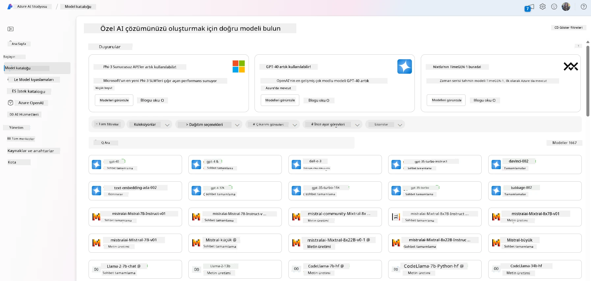

- Model kartını inceleyebilir; amaçlanan kullanım ve eğitim verileri hakkında detaylı açıklama, kod örnekleri ve dahili değerlendirme kütüphanesindeki sonuçlar dahil.

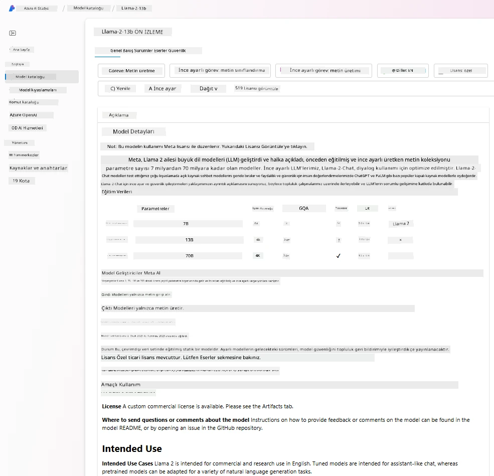

- [Model Benchmarks](https://learn.microsoft.com/azure/ai-foundry/concepts/model-benchmarks?WT.mc_id=academic-105485-koreyst) paneli aracılığıyla sektörde mevcut modeller ve veri setleri arasında karşılaştırma yaparak iş senaryosuna hangisinin en uygun olduğuna karar verebilir.

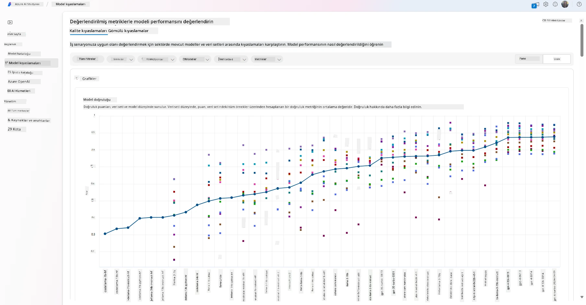

- Microsoft Foundry'nin deney ve takip yeteneklerini kullanarak belirli bir iş yükünde model performansını artırmak için desteklenen modelleri özel eğitim verileri ile ince ayar yapabilir.

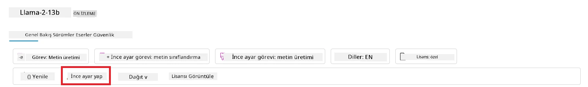

- Orijinal önceden eğitilmiş modeli veya ince ayarlı sürümü, yönetilen hesaplama veya sunucusuz dağıtım seçeneklerini kullanarak uygulamaların tüketebilmesi için uzak gerçek zamanlı çıkarım uç noktasına dağıtabilir.

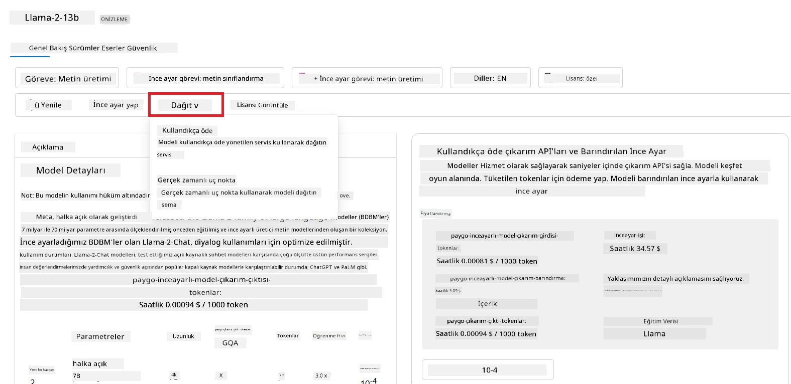

> [!NOTE]
> Katalogdaki tüm modeller şu anda ince ayar ve/veya kullandıkça öde dağıtım için mevcut değildir. Model yetenekleri ve sınırlamaları hakkında ayrıntılar için model kartını kontrol edin.

## LLM sonuçlarını iyileştirme

Startup ekibimizle farklı LLM türlerini ve farklı modelleri karşılaştırmamıza, test verileri üzerinde değerlendirme yapmamıza, performansı artırmamıza ve çıkarım uç noktalarına dağıtmamıza olanak tanıyan bulut platformu Microsoft Foundry'i keşfettik.

Ancak bir modeli önceden eğitilmiş bir modeli kullanmak yerine ne zaman ince ayar yapmayı düşünmeliler? Belirli iş yüklerinde model performansını artırmak için başka yaklaşımlar var mı?

Bir işletmenin LLM'den ihtiyaç duyduğu sonuçları almak için kullanabileceği birkaç yaklaşım vardır. LLM'yi üretimde dağıtırken farklı eğitim seviyelerine sahip farklı tür modelleri seçebilirsiniz, bunlar farklı karmaşıklık, maliyet ve kalite düzeylerine sahiptir. İşte bazı farklı yaklaşımlar:

- **Bağlam ile istem mühendisliği**. Amaç, yanıtları alabilmek için istem sırasında yeterli bağlam sağlamaktır.

- **Retrieval Augmented Generation, RAG**. Verileriniz örneğin bir veritabanında veya web uç noktasında olabilir; istem sırasında ilgili verilerin veya bir alt kümesinin dahil edilmesini sağlamak için ilgili verileri alıp kullanıcının istemine ekleyebilirsiniz.

- **İnce ayarlı model**. Burada modeli kendi verilerinizle daha fazla eğitirsiniz, bu da modelin ihtiyaçlarınıza daha kesin ve yanıt verebilir olmasını sağlar ancak maliyetli olabilir.

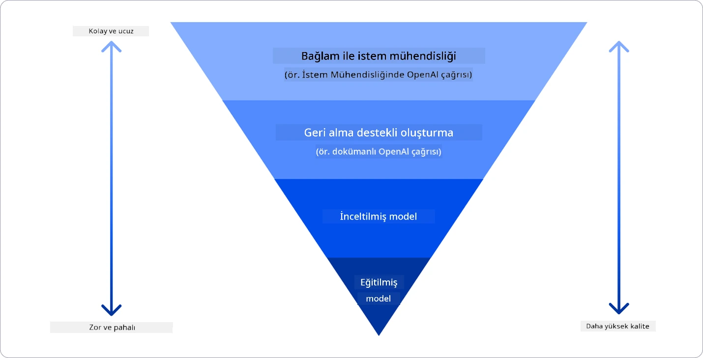

Görsel kaynağı: [Four Ways that Enterprises Deploy LLMs | Fiddler AI Blog](https://www.fiddler.ai/blog/four-ways-that-enterprises-deploy-llms?WT.mc_id=academic-105485-koreyst)

### Bağlam ile İstem Mühendisliği

Önceden eğitilmiş LLM'ler, kısa bir istem ile bile (tamamlanacak bir cümle veya soru gibi) genelleştirilmiş doğal dil görevlerinde çok iyi çalışır - buna "sıfır atış" öğrenme denir.

Ancak kullanıcı sorgusunu detaylı bir istek ve örneklerle - Bağlam ile - çerçevelendikçe, cevap daha doğru ve kullanıcının beklentilerine daha yakın olur. İstemde sadece bir örnek varsa buna "tek atış" öğrenme, birden fazla örnek varsa "birkaç atış öğrenme" denir.
Bağlam ile istem mühendisliği, başlamanın en uygun ve maliyet etkin yaklaşımıdır.

### Retrieval Augmented Generation (RAG)

LLM'lerin sınırlaması, yanıt üretmek için sadece eğitim sırasında kullanılan verileri kullanabilmeleridir. Bu, eğitim süreçlerinden sonra gerçekleşen olaylar hakkında bilgi sahibi olmadıkları ve özel olmayan bilgileri (örneğin şirket verileri) erişemedikleri anlamına gelir.
Bu durum, doküman parçaları olarak dış verilerle istemi destekleyen ve istem uzunluğu sınırlarını dikkate alan RAG ile aşılabilir. Bu, çeşitli önceden tanımlanmış veri kaynaklarından faydalı parçaları alıp istem bağlamına ekleyen Vektör veritabanı araçları (örneğin [Azure Vector Search](https://learn.microsoft.com/azure/search/vector-search-overview?WT.mc_id=academic-105485-koreyst)) ile desteklenir.

Bu teknik, bir işletmenin yeterli verisi, zamanı veya kaynağı yoksa ancak belirli bir iş yükünde performansı artırmak ve halüsinasyonlu, güncel olmayan veya desteklenmeyen cevap risklerini azaltmak istediğinde çok faydalıdır.

### İnce ayarlı model

İnce ayar, transfer öğrenimini kullanarak modeli bir altında görev için 'uyarlamak' veya belirli bir problemi çözmek için kullanılan bir süreçtir. Birkaç atış öğrenme ve RAG'den farklı olarak, güncellenmiş ağırlıklar ve sapmalarla yeni bir model ortaya çıkarır. Bu, istem ve ona karşılık gelen çıktıdan oluşan eğitim örnekleri gerektirir.
Bu tercih edilen yaklaşım olur:

- **Daha küçük görev-özel modeller kullanmak:** İşletme, büyük bir sınır modeli yerine dar bir görev için daha küçük bir modeli ince ayarlamak isteyebilir; bu, daha maliyet etkin ve hızlı bir çözümdür.

- **Gecikme süresini dikkate almak:** Gecikme süresi belirli bir kullanım durumu için önemlidir, dolayısıyla çok uzun istemler kullanılamaz veya öğrenilmesi gereken örnek sayısı istem uzunluğu sınırı ile uyumlu değildir.

- **Kararlı davranışa uyum sağlamak:** İşletmenin çok sayıda yüksek kaliteli örneği vardır ve modelin tutarlı şekilde bir görev kalıbını, çıktı formatını, tonu veya alan-özel stilini takip etmesini ister. Eğer ana sorun taze gerçekler veya sık değişen özel bilgiler ise, sadece ince ayarlamaya güvenmek yerine RAG kullanın.

### Eğitimli model

Baştan bir LLM eğitmek şüphesiz en zor ve en karmaşık yaklaşımdır; çok büyük veri, yetenekli kaynaklar ve uygun hesaplama gücü gerektirir. Bu seçenek ancak bir işletmenin alan-özel bir kullanım durumu ve çok miktarda alan-odaklı verisi varsa düşünülmelidir.

## Bilgi kontrolü

LLM tamamlanma sonuçlarını iyileştirmek için iyi bir yaklaşım ne olabilir?

1. Bağlam ile istem mühendisliği
1. RAG
1. İnce ayarlı model

Cevap: Üçü de yardımcı olabilir. Hızlı iyileştirmeler için bağlam ile istem mühendisliğiyle başlayın, modelin güncel gerçeklere veya özel iş verilerine ihtiyacı olduğunda RAG kullanın. Yeterli yüksek kaliteli örneğiniz varsa ve modelin tutarlı şekilde görev, format, ton veya alan kalıbını takip etmesi gerekiyorsa ince ayarı tercih edin.

## 🚀 Meydan Okuma

İşiniz için [RAG›ı nasıl kullanabileceğiniz](https://learn.microsoft.com/azure/search/retrieval-augmented-generation-overview?WT.mc_id=academic-105485-koreyst) hakkında daha fazla bilgi edinin.

## Harika iş çıkardınız, Öğrenmeye Devam Edin

Bu dersi tamamladıktan sonra, Generative AI bilgi seviyenizi yükseltmeye devam etmek için [Yaratıcı AI Öğrenme koleksiyonumuza](https://aka.ms/genai-collection?WT.mc_id=academic-105485-koreyst) göz atın!

Sorumlu bir şekilde [Yaratıcı AI ile nasıl inşa edileceğine](../03-using-generative-ai-responsibly/README.md?WT.mc_id=academic-105485-koreyst) bakacağımız 3. Derse geçin!

---

<!-- CO-OP TRANSLATOR DISCLAIMER START -->
**Feragatname**:
Bu belge, AI çeviri hizmeti [Co-op Translator](https://github.com/Azure/co-op-translator) kullanılarak çevrilmiştir. Doğruluk için çaba sarf etsek de, otomatik çevirilerin hata veya yanlışlık içerebileceğini lütfen unutmayınız. Orijinal belge, kendi dilinde yetkili kaynak olarak kabul edilmelidir. Kritik bilgiler için profesyonel insan çevirisi önerilir. Bu çevirinin kullanımı sonucu ortaya çıkabilecek yanlış anlamalardan veya yanlış yorumlamalardan sorumlu değiliz.
<!-- CO-OP TRANSLATOR DISCLAIMER END -->