<!--
CO_OP_TRANSLATOR_METADATA:
{
  "original_hash": "e2f686f2eb794941761252ac5e8e090b",
  "translation_date": "2025-06-25T10:39:14+00:00",
  "source_file": "02-exploring-and-comparing-different-llms/README.md",
  "language_code": "tr"
}
-->
# Farklı LLM'leri Keşfetmek ve Karşılaştırmak

[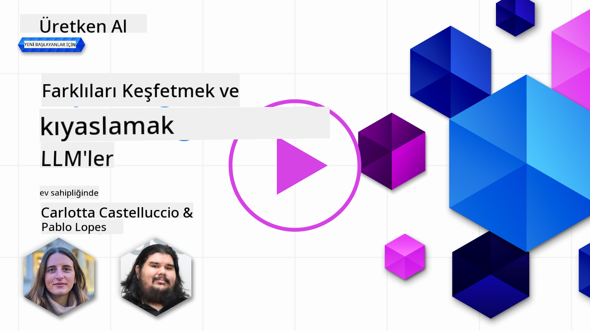](https://aka.ms/gen-ai-lesson2-gh?WT.mc_id=academic-105485-koreyst)

> _Bu dersin videosunu izlemek için yukarıdaki resme tıklayın_

Önceki derste, Üretici AI'nın teknoloji dünyasını nasıl değiştirdiğini, Büyük Dil Modellerinin (LLM'ler) nasıl çalıştığını ve bir işletmenin - bizim girişimimiz gibi - onları kullanım senaryolarına nasıl uygulayabileceğini ve büyüyebileceğini gördük! Bu bölümde, farklı büyük dil modellerini (LLM'ler) karşılaştırarak avantajlarını ve dezavantajlarını anlamaya çalışıyoruz.

Girişimimizin yolculuğundaki bir sonraki adım, LLM'lerin mevcut durumunu keşfetmek ve hangilerinin kullanım senaryomuza uygun olduğunu anlamaktır.

## Giriş

Bu ders şunları kapsayacak:

- Mevcut durumda farklı LLM türleri.
- Azure'da kullanım senaryonuz için farklı modelleri test etme, yineleme ve karşılaştırma.
- Bir LLM nasıl dağıtılır.

## Öğrenme Hedefleri

Bu dersi tamamladıktan sonra:

- Kullanım senaryonuz için doğru modeli seçebileceksiniz.
- Modelinizin performansını nasıl test edeceğinizi, yineleyeceğinizi ve geliştireceğinizi anlayacaksınız.
- İşletmelerin modelleri nasıl dağıttığını bileceksiniz.

## Farklı LLM Türlerini Anlamak

LLM'ler, mimarileri, eğitim verileri ve kullanım senaryolarına göre birden fazla kategorize edilebilir. Bu farklılıkları anlamak, girişimimizin doğru modeli senaryo için seçmesine ve performansı test etmesine, yinelemesine ve geliştirmesine yardımcı olacaktır.

Çeşitli LLM model türleri vardır, model seçiminiz onları ne amaçla kullanmayı hedeflediğinize, verilerinize, ne kadar ödemeye hazır olduğunuza ve daha fazlasına bağlıdır.

Modelleri metin, ses, video, görüntü üretimi gibi amaçlar için kullanmayı hedefliyorsanız, farklı bir model türü seçebilirsiniz.

- **Ses ve konuşma tanıma**. Bu amaç için, Whisper tipi modeller, genel amaçlı oldukları ve konuşma tanımayı hedefledikleri için harika bir seçimdir. Çeşitli seslerde eğitilmiş ve çok dilli konuşma tanıma gerçekleştirebilir. [Whisper tipi modeller hakkında daha fazla bilgi edinin](https://platform.openai.com/docs/models/whisper?WT.mc_id=academic-105485-koreyst).

- **Görüntü üretimi**. Görüntü üretimi için DALL-E ve Midjourney, çok iyi bilinen iki seçenektir. DALL-E, Azure OpenAI tarafından sunulmaktadır. [DALL-E hakkında daha fazla bilgi edinin](https://platform.openai.com/docs/models/dall-e?WT.mc_id=academic-105485-koreyst) ve ayrıca bu müfredatın 9. Bölümünde.

- **Metin üretimi**. Çoğu model metin üretimi üzerine eğitilmiştir ve GPT-3.5'ten GPT-4'e kadar geniş bir seçenek yelpazesi vardır. Farklı maliyetlerde gelirler, en pahalı olan GPT-4'tür. [Azure OpenAI playground](https://oai.azure.com/portal/playground?WT.mc_id=academic-105485-koreyst) incelemeye değer, hangi modellerin kapasite ve maliyet açısından ihtiyaçlarınıza en uygun olduğunu değerlendirmek için.

- **Çoklu-modalite**. Girdi ve çıktı olarak birden fazla veri türünü ele almak istiyorsanız, doğal dil işleme ile görsel anlayışı birleştirebilen, çoklu-modal arabirimlerle etkileşimleri sağlayan en son OpenAI model sürümleri olan [gpt-4 turbo with vision veya gpt-4o](https://learn.microsoft.com/azure/ai-services/openai/concepts/models#gpt-4-and-gpt-4-turbo-models?WT.mc_id=academic-105485-koreyst) gibi modellere göz atmak isteyebilirsiniz.

Bir model seçmek, bazı temel yetenekler elde etmek anlamına gelir, ancak bu yeterli olmayabilir. Çoğu zaman şirketin spesifik verileri vardır ve bu verileri bir şekilde LLM'e anlatmanız gerekir. Bunu nasıl ele alacağınız konusunda birkaç farklı seçenek vardır, daha fazla bilgi ilerleyen bölümlerde.

### Temel Modeller ve LLM'ler

Temel Model terimi, [Stanford araştırmacıları tarafından ortaya atıldı](https://arxiv.org/abs/2108.07258?WT.mc_id=academic-105485-koreyst) ve bazı kriterleri izleyen bir AI modeli olarak tanımlandı, örneğin:

- **Denetimsiz öğrenme veya kendi kendine denetimli öğrenme kullanılarak eğitilirler**, yani etiketlenmemiş çoklu-modal veriler üzerinde eğitilirler ve eğitim süreçleri için insan anotasyonu veya veri etiketleme gerektirmezler.
- **Çok büyük modellerdir**, milyarlarca parametre üzerinde eğitilmiş çok derin sinir ağlarına dayanır.
- **Normalde diğer modeller için bir 'temel' olarak hizmet etmeyi amaçlarlar**, yani üzerine inşa edilecek diğer modeller için bir başlangıç noktası olarak kullanılabilirler, bu ince ayarlama ile yapılabilir.

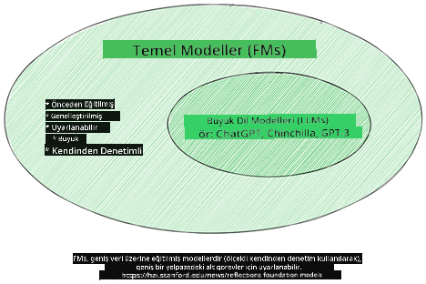

Görsel kaynağı: [Temel Modeller ve Büyük Dil Modelleri için Temel Kılavuz | Babar M Bhatti tarafından | Medium
](https://thebabar.medium.com/essential-guide-to-foundation-models-and-large-language-models-27dab58f7404)

Bu ayrımı daha da netleştirmek için, ChatGPT'yi bir örnek olarak ele alalım. ChatGPT'nin ilk sürümünü oluşturmak için GPT-3.5 adlı bir model temel model olarak hizmet etti. Bu, OpenAI'nin sohbet senaryolarında iyi performans göstermek üzere özel olarak ayarlanmış bir GPT-3.5 sürümü oluşturmak için bazı sohbet verilerini kullandığı anlamına gelir.

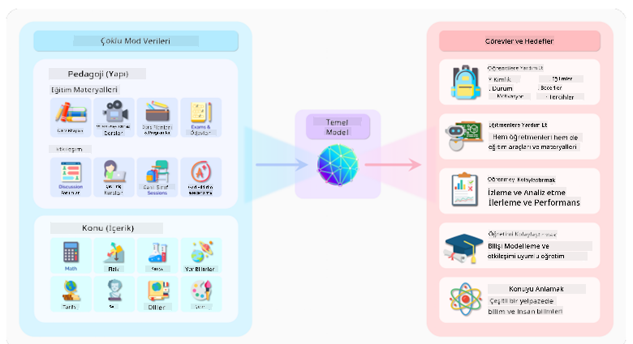

Görsel kaynağı: [2108.07258.pdf (arxiv.org)](https://arxiv.org/pdf/2108.07258.pdf?WT.mc_id=academic-105485-koreyst)

### Açık Kaynak ve Özel Modeller

LLM'leri kategorize etmenin bir başka yolu, açık kaynak veya özel olup olmadıklarıdır.

Açık kaynak modeller, halka açık olarak sunulan ve herkes tarafından kullanılabilen modellerdir. Genellikle onları oluşturan şirket veya araştırma topluluğu tarafından sunulurlar. Bu modeller, LLM'lerdeki çeşitli kullanım senaryoları için incelenebilir, değiştirilebilir ve özelleştirilebilir. Ancak, üretim kullanımı için her zaman optimize edilmemişlerdir ve özel modeller kadar performans göstermeyebilirler. Ayrıca, açık kaynak modeller için finansman sınırlı olabilir ve uzun vadeli bakım yapılmayabilir veya en son araştırmalarla güncellenmeyebilir. Popüler açık kaynak model örnekleri arasında [Alpaca](https://crfm.stanford.edu/2023/03/13/alpaca.html?WT.mc_id=academic-105485-koreyst), [Bloom](https://huggingface.co/bigscience/bloom) ve [LLaMA](https://llama.meta.com) bulunmaktadır.

Özel modeller, bir şirkete ait olan ve halka açık olarak sunulmayan modellerdir. Bu modeller genellikle üretim kullanımı için optimize edilmiştir. Ancak, farklı kullanım senaryoları için incelenmelerine, değiştirilmelerine veya özelleştirilmelerine izin verilmez. Ayrıca, her zaman ücretsiz olarak sunulmazlar ve kullanmak için abonelik veya ödeme gerektirebilirler. Ayrıca, modelin eğitildiği veriler üzerinde kontrol sahibi olunmaz, bu da model sahibinin veri gizliliği ve AI'nın sorumlu kullanımı konusunda taahhüt sağlamasını gerektirir. Popüler özel model örnekleri arasında [OpenAI modelleri](https://platform.openai.com/docs/models/overview?WT.mc_id=academic-105485-koreyst), [Google Bard](https://sapling.ai/llm/bard?WT.mc_id=academic-105485-koreyst) veya [Claude 2](https://www.anthropic.com/index/claude-2?WT.mc_id=academic-105485-koreyst) bulunmaktadır.

### Yerleştirme, Görüntü Üretimi, Metin ve Kod Üretimi

LLM'ler, ürettikleri çıktıya göre de kategorize edilebilir.

Yerleştirmeler, metni sayısal bir forma, yerleştirme olarak adlandırılan, girdinin sayısal bir temsilini dönüştürebilen bir model setidir. Yerleştirmeler, makinelerin kelimeler veya cümleler arasındaki ilişkileri anlamasını kolaylaştırır ve diğer modeller tarafından, sınıflandırma modelleri veya sayısal verilerde daha iyi performans gösteren kümeleme modelleri gibi, girdiler olarak tüketilebilir. Yerleştirme modelleri genellikle transfer öğrenimi için kullanılır, burada bir model, bol miktarda veri bulunan bir vekil görev için oluşturulur ve ardından model ağırlıkları (yerleştirmeler) diğer alt görevler için yeniden kullanılır. Bu kategoriye bir örnek [OpenAI yerleştirmeler](https://platform.openai.com/docs/models/embeddings?WT.mc_id=academic-105485-koreyst) olacaktır.

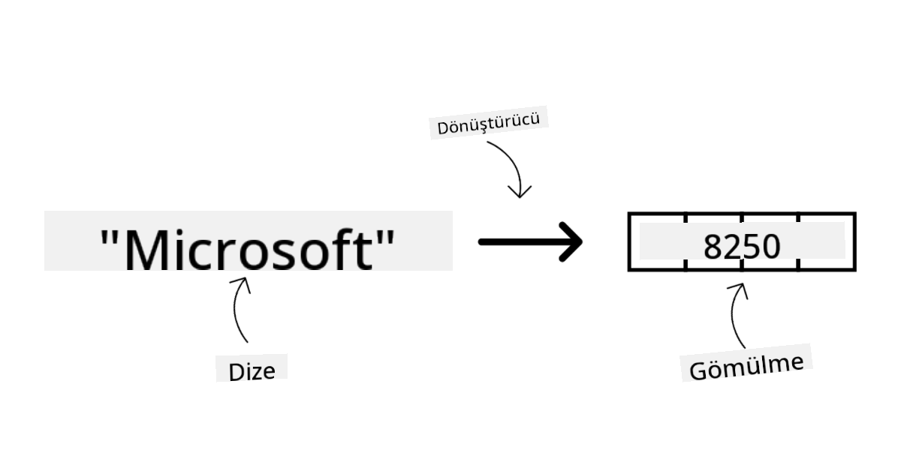

Görüntü üretimi modelleri, görüntü üreten modellerdir. Bu modeller genellikle görüntü düzenleme, görüntü sentezi ve görüntü çevirisi için kullanılır. Görüntü üretimi modelleri, [LAION-5B](https://laion.ai/blog/laion-5b/?WT.mc_id=academic-105485-koreyst) gibi büyük görüntü veri setleri üzerinde eğitilir ve yeni görüntüler üretmek veya mevcut görüntüleri yeniden boyama, süper çözünürlük ve renklendirme teknikleriyle düzenlemek için kullanılabilir. Örnekler arasında [DALL-E-3](https://openai.com/dall-e-3?WT.mc_id=academic-105485-koreyst) ve [Stable Diffusion modelleri](https://github.com/Stability-AI/StableDiffusion?WT.mc_id=academic-105485-koreyst) bulunmaktadır.

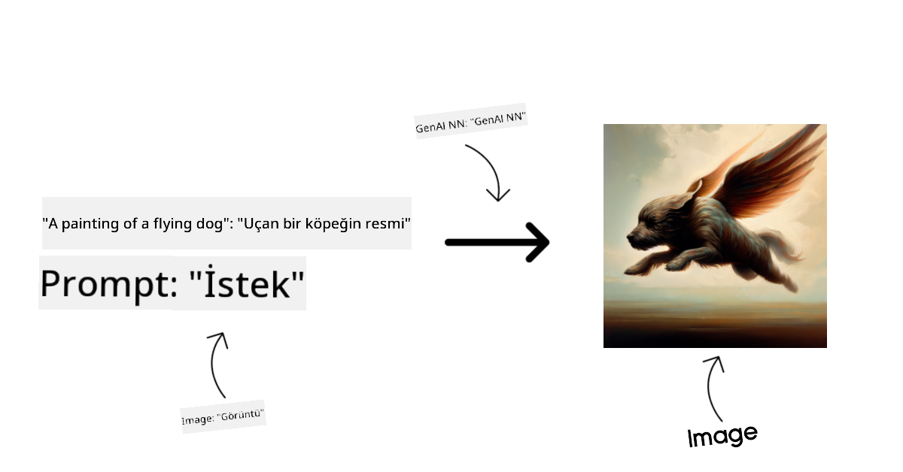

Metin ve kod üretimi modelleri, metin veya kod üreten modellerdir. Bu modeller genellikle metin özetleme, çeviri ve soru yanıtlama için kullanılır. Metin üretimi modelleri, [BookCorpus](https://www.cv-foundation.org/openaccess/content_iccv_2015/html/Zhu_Aligning_Books_and_ICCV_2015_paper.html?WT.mc_id=academic-105485-koreyst) gibi büyük metin veri setleri üzerinde eğitilir ve yeni metin üretmek veya soruları yanıtlamak için kullanılabilir. Kod üretimi modelleri, [CodeParrot](https://huggingface.co/codeparrot?WT.mc_id=academic-105485-koreyst) gibi, genellikle GitHub gibi büyük kod veri setleri üzerinde eğitilir ve yeni kod üretmek veya mevcut koddaki hataları düzeltmek için kullanılabilir.

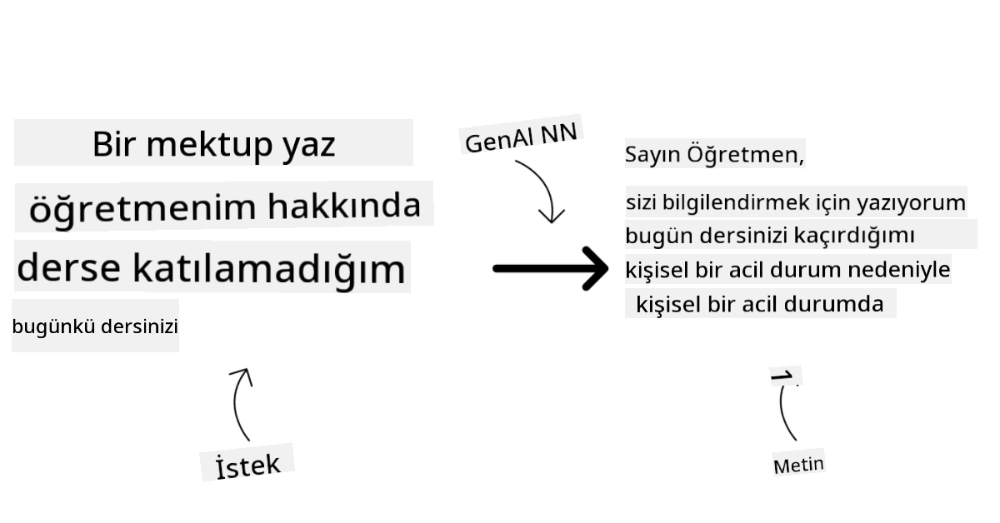

### Kodlayıcı-Çözücü ve Sadece Çözücü

LLM'lerin farklı mimari türlerini konuşmak için bir benzetme kullanalım.

Yöneticiniz size öğrenciler için bir sınav hazırlama görevi verdiğini hayal edin. İki iş arkadaşınız var; biri içeriği oluşturmakla, diğeri ise onları incelemekle sorumlu.

İçerik oluşturucu, sadece Çözücü model gibidir, konuyu görebilir ve zaten yazdıklarınızı görebilir ve buna dayanarak bir kurs yazabilir. İlgi çekici ve bilgilendirici içerik yazmada çok iyidirler, ancak konuyu ve öğrenme hedeflerini anlamada pek iyi değillerdir. Çözücü model örnekleri arasında GPT ailesi modelleri, GPT-3 gibi, bulunmaktadır.

İnceleyici, sadece Kodlayıcı model gibidir, yazılan kursu ve cevapları görür, aralarındaki ilişkiyi fark eder ve bağlamı anlar, ancak içerik üretmede iyi değildir. Sadece Kodlayıcı model örneği BERT olacaktır.

Birinin hem sınavı oluşturup hem de inceleyebileceğini hayal edin, bu bir Kodlayıcı-Çözücü modeldir. BART ve T5 gibi örnekler bulunmaktadır.

### Hizmet ve Model

Şimdi, bir hizmet ve model arasındaki farkı konuşalım. Hizmet, bir Bulut Hizmet Sağlayıcısı tarafından sunulan bir üründür ve genellikle modeller, veri ve diğer bileşenlerin birleşimidir. Model, bir hizmetin çekirdek bileşenidir ve genellikle bir temel modeldir, örneğin bir LLM.

Hizmetler genellikle üretim kullanımı için optimize edilmiştir ve modellerden daha kolay kullanılırlar, grafiksel bir kullanıcı arayüzü aracılığıyla. Ancak, hizmetler her zaman ücretsiz olarak sunulmazlar ve kullanmak için abonelik veya ödeme gerektirebilirler, hizmet sahibinin ekipman ve kaynaklarını kullanmanın karşılığında, masrafları optimize etmek ve kolayca ölçeklendirmek için. Bir hizmet örneği [Azure OpenAI Hizmeti](https://learn.microsoft.com/azure/ai-services/openai/overview?WT.mc_id=academic-105485-koreyst) olup, kullanıcıların hizmeti ne kadar kullandıklarına orantılı olarak ücretlendirildiği bir ödeme planı sunar. Ayrıca, Azure OpenAI Hizmeti, modellerin yeteneklerinin üzerine kurulu bir kurumsal güvenlik ve sorumlu AI çerçevesi sunar.

Modeller sadece Sinir Ağıdır, parametreler, ağırlıklar ve diğerleri ile. Şirketlerin yerel olarak çalışmasına izin verir, ancak ekipman satın almaları, ölçeklendirmek için bir yapı oluşturmaları ve bir lisans satın almaları veya açık kaynaklı bir modeli kullanmaları gerekecektir. LLaMA gibi bir model, kullanılmak üzere sunulmuştur, modeli çalıştırmak için hesaplama gücü gerektirir.

## Azure'da Performansı Anlamak İçin Farklı Modellerle Test Etme ve Yineleme

Ekibimiz mevcut LLM'ler manzarasını keşfettikten ve senaryoları için iyi adaylar belirledikten sonra, bir sonraki adım, onları verileri ve iş yükleri üzerinde test etmektir. Bu, deneyler ve ölçümlerle yapılan yinelemeli bir süreçtir.
Önceki paragraflarda bahsettiğimiz modellerin çoğu (OpenAI modelleri, Llama2 gibi açık kaynak modelleri ve Hugging Face dönüştürücüler) [Model Kataloğu](https://learn.microsoft.com/azure/ai-studio/how-to/model-catalog-overview?WT.mc_id=academic-105485-koreyst) içinde [Azure AI Studio](https://ai.azure.com/?WT.mc_id=academic-105485-koreyst) içinde mevcuttur.

[Azure AI Studio](https://learn.microsoft.com/azure/ai-studio/what-is-ai-studio?WT.mc_id=academic-105485-koreyst), geliştiricilerin üretken AI uygulamaları oluşturmak ve tüm geliştirme yaşam döngüsünü yönetmek için tasarlanmış bir Bulut Platformudur - deneyden değerlendirmeye kadar - tüm Azure AI hizmetlerini tek bir merkezde birleştirerek kullanışlı bir GUI ile. Azure AI Studio'daki Model Kataloğu, kullanıcının:

- Katalogda ilgi duyulan Temel Modeli bulmasını sağlar - görev, lisans veya ada göre filtreleme yaparak, ya özel ya da açık kaynak. Aranabilirliği artırmak için modeller koleksiyonlar halinde organize edilmiştir, Azure OpenAI koleksiyonu, Hugging Face koleksiyonu ve daha fazlası gibi.

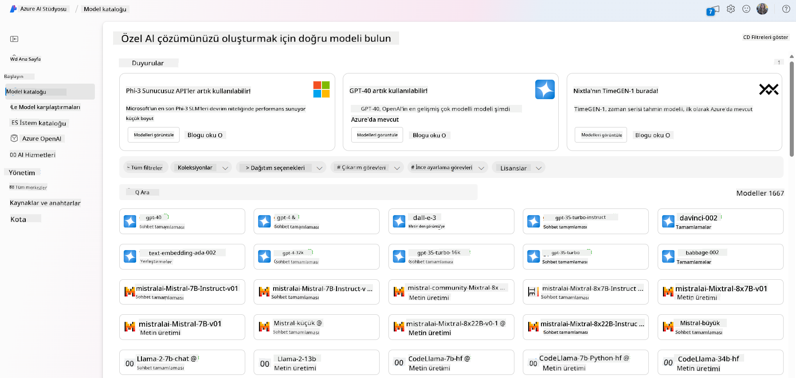

- Model kartını gözden geçirin, amaçlanan kullanım ve eğitim verileri hakkında ayrıntılı açıklama, kod örnekleri ve iç değerlendirme kitaplığındaki değerlendirme sonuçları dahil.

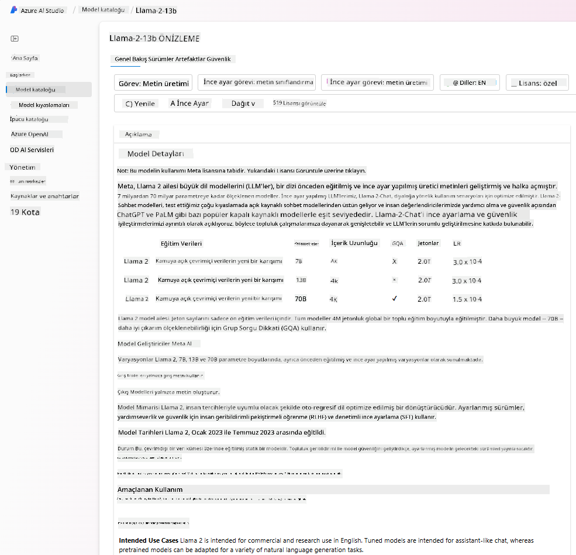
- İş senaryosunu karşılayan modeli değerlendirmek için sektördeki modeller ve veri kümeleri arasındaki karşılaştırmaları [Model Benchmarks](https://learn.microsoft.com/azure/ai-studio/how-to/model-benchmarks?WT.mc_id=academic-105485-koreyst) paneli aracılığıyla yapın.

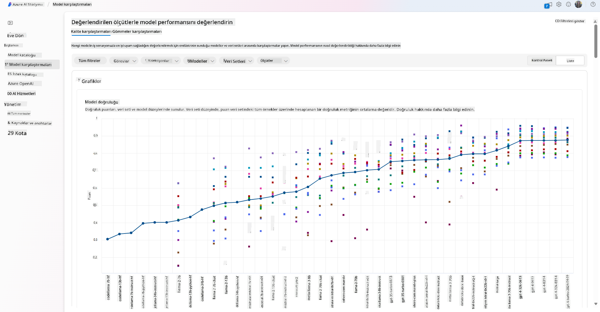

- Belirli bir iş yükünde model performansını artırmak için modeli özel eğitim verileri üzerinde ince ayar yaparak Azure AI Studio'nun deney ve izleme yeteneklerinden yararlanın.

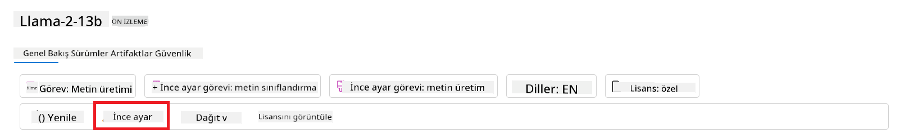

- Uygulamaların tüketebilmesi için orijinal önceden eğitilmiş modeli veya ince ayar yapılmış versiyonu uzaktan gerçek zamanlı çıkarım - yönetilen hesaplama - veya sunucusuz api uç noktasına - [kullandıkça öde](https://learn.microsoft.com/azure/ai-studio/how-to/model-catalog-overview#model-deployment-managed-compute-and-serverless-api-pay-as-you-go?WT.mc_id=academic-105485-koreyst) - dağıtın.

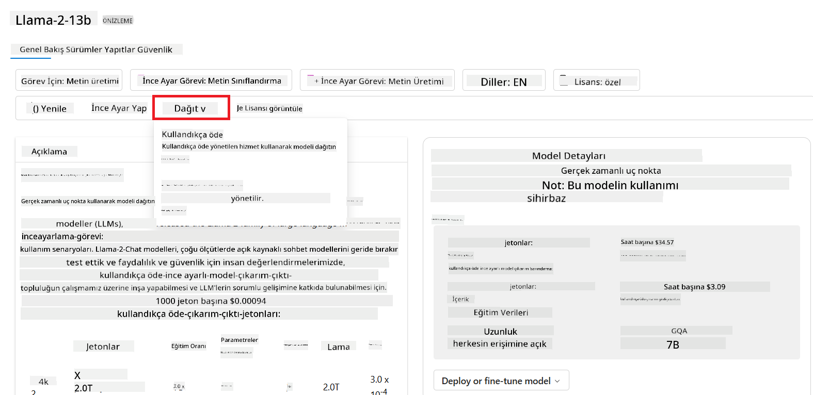

> [!NOTE]
> Katalogdaki tüm modeller şu anda ince ayar ve/veya kullandıkça öde dağıtımı için uygun değildir. Modelin yetenekleri ve sınırlamaları hakkında ayrıntılar için model kartını kontrol edin.

## LLM sonuçlarını iyileştirme

Startup ekibimizle farklı türde LLM'ler ve farklı modelleri karşılaştırmamıza, test verileri üzerinde değerlendirmemize, performansı artırmamıza ve çıkarım uç noktalarında dağıtmamıza olanak tanıyan bir Bulut Platformu (Azure Machine Learning) keşfettik.

Ancak bir modeli önceden eğitilmiş bir model yerine ne zaman ince ayar yaparak kullanmalılar? Belirli iş yüklerinde model performansını artırmak için başka yaklaşımlar var mı?

Bir işletmenin bir LLM'den ihtiyaç duyduğu sonuçları elde etmek için kullanabileceği birkaç yaklaşım vardır. Üretimde bir LLM dağıtırken, farklı eğitim derecelerine sahip farklı türde modeller seçebilirsiniz; farklı karmaşıklık, maliyet ve kalite seviyeleri ile. İşte bazı farklı yaklaşımlar:

- **Bağlamla istem mühendisliği**. Buradaki fikir, gerekli yanıtları almak için istemde yeterli bağlam sağlamaktır.

- **Geri Getirme Destekli Üretim, RAG**. Verileriniz bir veritabanında veya web uç noktasında bulunabilir, örneğin, bu verilerin veya bir alt kümesinin istem sırasında dahil edilmesini sağlamak için ilgili verileri alabilir ve bunu kullanıcının istemine dahil edebilirsiniz.

- **İnce ayarlı model**. Burada, modeli kendi verileriniz üzerinde daha fazla eğittiniz, bu da modelin ihtiyaçlarınıza daha duyarlı ve daha doğru hale gelmesine yol açtı ancak maliyetli olabilir.

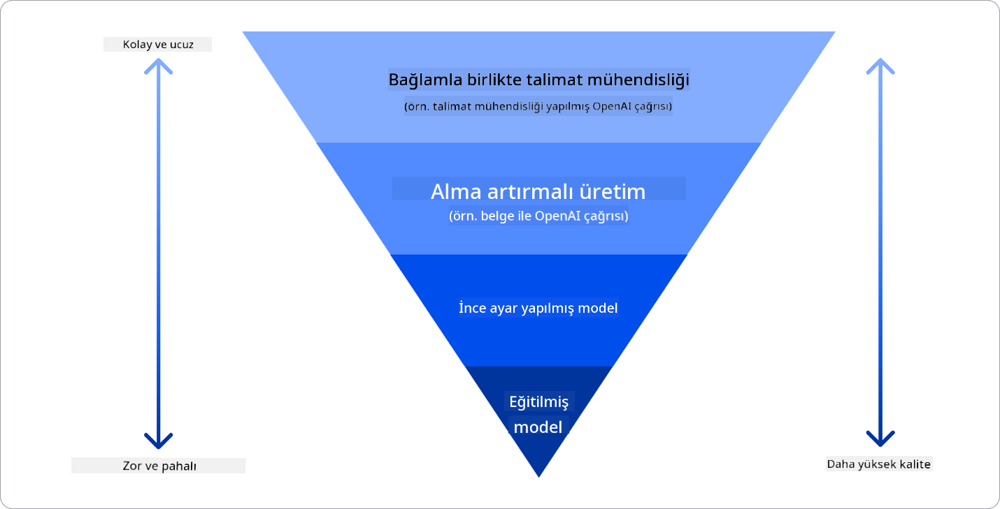

Görsel kaynağı: [Kuruluşların LLM Dağıtmasının Dört Yolu | Fiddler AI Blog](https://www.fiddler.ai/blog/four-ways-that-enterprises-deploy-llms?WT.mc_id=academic-105485-koreyst)

### Bağlamla İstem Mühendisliği

Önceden eğitilmiş LLM'ler, tamamlanacak bir cümle veya bir soru gibi kısa bir istemle çağrıldığında bile genelleştirilmiş doğal dil görevlerinde çok iyi çalışır – sözde "sıfır atış" öğrenme.

Ancak, kullanıcı sorgusunu ne kadar iyi çerçevelerse, detaylı bir istek ve örneklerle – Bağlam – yanıt o kadar doğru ve kullanıcının beklentilerine yakın olacaktır. Bu durumda, istem yalnızca bir örnek içeriyorsa "tek atış" öğrenme, birden fazla örnek içeriyorsa "birkaç atış öğrenme" den bahsediyoruz. Bağlamla istem mühendisliği, başlamak için en uygun maliyetli yaklaşımdır.

### Geri Getirme Destekli Üretim (RAG)

LLM'lerin, yanıt üretmek için yalnızca eğitim sırasında kullanılan verileri kullanabilme sınırlaması vardır. Bu, eğitim süreçlerinden sonra meydana gelen olaylar hakkında hiçbir şey bilmedikleri ve kamuya açık olmayan bilgilere (şirket verileri gibi) erişemeyecekleri anlamına gelir. Bu, belgelerin parçaları şeklinde dış verilerle istemi artıran bir teknik olan RAG ile aşılabilir, istem uzunluğu sınırları dikkate alınarak. Bu, çeşitli önceden tanımlanmış veri kaynaklarından yararlı parçaları alıp bunları istem Bağlamına ekleyen Vektör veritabanı araçları (örneğin [Azure Vektör Arama](https://learn.microsoft.com/azure/search/vector-search-overview?WT.mc_id=academic-105485-koreyst)) tarafından desteklenir.

Bu teknik, bir işletmenin yeterli veriye, yeterli zamana veya bir LLM'nin ince ayarını yapmak için kaynaklara sahip olmadığı, ancak yine de belirli bir iş yükünde performansı artırmak ve gerçeği çarpıtma veya zararlı içerik gibi sahtecilik risklerini azaltmak istediği durumlarda çok faydalıdır.

### İnce Ayarlı Model

İnce ayar, transfer öğrenimini kullanarak modeli bir alt görev için 'uyarlamak' veya belirli bir sorunu çözmek için bir süreçtir. Birkaç atış öğrenme ve RAG'dan farklı olarak, güncellenmiş ağırlıklar ve önyargılar ile yeni bir model üretilmesine neden olur. Tek bir girdi (istem) ve buna bağlı çıktıdan (tamamlama) oluşan bir dizi eğitim örneği gerektirir. Bu, şu durumlarda tercih edilen yaklaşım olacaktır:

- **İnce ayarlı modellerin kullanılması**. Bir işletme, yüksek performanslı modeller yerine daha az yetenekli ince ayarlı modelleri (gömme modeller gibi) kullanmak isteyebilir, bu da daha uygun maliyetli ve hızlı bir çözümle sonuçlanır.

- **Gecikmeyi dikkate alma**. Gecikme, belirli bir kullanım durumu için önemlidir, bu nedenle çok uzun istemler kullanmak veya modelin öğrenmesi gereken örnek sayısı istem uzunluğu sınırına uymadığı için mümkün değildir.

- **Güncel kalma**. Bir işletmenin çok miktarda yüksek kaliteli verisi ve gerçek etiketleri vardır ve bu verileri zamanla güncel tutmak için gereken kaynaklara sahiptir.

### Eğitilmiş Model

Bir LLM'yi sıfırdan eğitmek, şüphesiz benimsenmesi en zor ve en karmaşık yaklaşımdır; büyük miktarda veri, yetenekli kaynaklar ve uygun hesaplama gücü gerektirir. Bu seçenek, yalnızca bir işletmenin alan odaklı bir kullanım durumu ve büyük miktarda alan odaklı veriye sahip olduğu bir senaryoda düşünülmelidir.

## Bilgi kontrolü

LLM tamamlama sonuçlarını iyileştirmek için iyi bir yaklaşım ne olabilir?

1. Bağlamla istem mühendisliği
1. RAG
1. İnce ayarlı model

A:3, zaman ve kaynaklarınız varsa ve yüksek kaliteli verilere sahipseniz, ince ayar yapmak güncel kalmak için daha iyi bir seçenektir. Ancak, iyileştirmeye yönelik bir şeyler arıyorsanız ve zamanınız kısıtlıysa, öncelikle RAG'ı düşünmek değerlidir.

## 🚀 Meydan Okuma

İşletmeniz için [RAG kullanımı](https://learn.microsoft.com/azure/search/retrieval-augmented-generation-overview?WT.mc_id=academic-105485-koreyst) hakkında daha fazla bilgi edinin.

## Harika İş, Öğrenmeye Devam Edin

Bu dersi tamamladıktan sonra, Generative AI bilginizi geliştirmeye devam etmek için [Generative AI Öğrenme koleksiyonumuza](https://aka.ms/genai-collection?WT.mc_id=academic-105485-koreyst) göz atın!

Generative AI ile Sorumlu bir şekilde nasıl [inşa edileceğini](../03-using-generative-ai-responsibly/README.md?WT.mc_id=academic-105485-koreyst) inceleyeceğimiz 3. Derse gidin!

**Feragatname**: 
Bu belge, AI çeviri hizmeti [Co-op Translator](https://github.com/Azure/co-op-translator) kullanılarak çevrilmiştir. Doğruluğu sağlamak için çaba göstersek de, otomatik çevirilerin hata veya yanlışlık içerebileceğini lütfen unutmayın. Orijinal belgenin kendi dilindeki hali yetkili kaynak olarak kabul edilmelidir. Kritik bilgiler için profesyonel insan çevirisi önerilir. Bu çevirinin kullanımından kaynaklanan herhangi bir yanlış anlama veya yanlış yorumlamadan sorumlu değiliz.