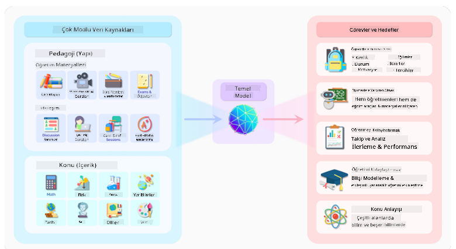
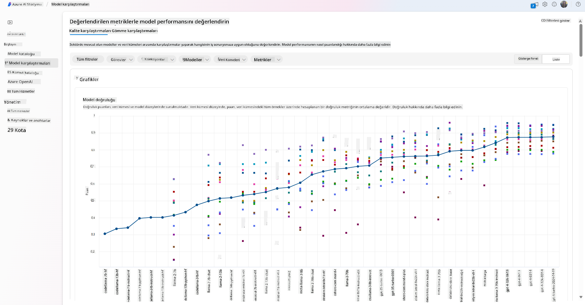

<!--
CO_OP_TRANSLATOR_METADATA:
{
  "original_hash": "6b7629b8ee4d7d874a27213e903d86a7",
  "translation_date": "2025-10-17T16:19:14+00:00",
  "source_file": "02-exploring-and-comparing-different-llms/README.md",
  "language_code": "tr"
}
-->
# Farklı Büyük Dil Modellerini (LLM) Keşfetmek ve Karşılaştırmak

> _Bu dersin videosunu izlemek için yukarıdaki görsele tıklayın_

Önceki derste, Üretken Yapay Zekanın teknoloji dünyasını nasıl değiştirdiğini, Büyük Dil Modellerinin (LLM) nasıl çalıştığını ve bir işletmenin - örneğin bizim girişimimiz gibi - bunları kendi kullanım senaryolarına nasıl uygulayarak büyüyebileceğini gördük! Bu bölümde, farklı büyük dil modellerini (LLM) karşılaştırarak avantajlarını ve dezavantajlarını anlamaya çalışacağız.

Girişimimizin bir sonraki adımı, mevcut LLM'ler dünyasını keşfetmek ve kullanım senaryomuza uygun olanları anlamaktır.

## Giriş

Bu derste şunlar ele alınacaktır:

- Mevcut LLM türleri.
- Azure'da kullanım senaryonuz için farklı modelleri test etme, yineleme ve karşılaştırma.
- Bir LLM'nin nasıl dağıtılacağı.

## Öğrenme Hedefleri

Bu dersi tamamladıktan sonra:

- Kullanım senaryonuz için doğru modeli seçebileceksiniz.
- Modelinizin performansını test etme, yineleme ve geliştirme yöntemlerini anlayabileceksiniz.
- İşletmelerin modelleri nasıl dağıttığını öğreneceksiniz.

## Farklı LLM Türlerini Anlamak

LLM'ler mimarileri, eğitim verileri ve kullanım senaryolarına göre farklı kategorilere ayrılabilir. Bu farklılıkları anlamak, girişimimizin doğru modeli seçmesine, test etmesine, yinelemesine ve performansı geliştirmesine yardımcı olacaktır.

Birçok farklı LLM modeli bulunmaktadır ve model seçiminiz, onları ne amaçla kullanmak istediğinize, verilerinize, bütçenize ve diğer faktörlere bağlıdır.

Modelleri metin, ses, video, görüntü üretimi gibi farklı amaçlar için kullanmayı planlıyorsanız, farklı bir model türü tercih edebilirsiniz.

- **Ses ve konuşma tanıma**. Bu amaç için Whisper türü modeller harika bir seçimdir çünkü genel amaçlıdır ve konuşma tanımaya yöneliktir. Çeşitli ses verileriyle eğitilmiştir ve çok dilli konuşma tanıma yapabilir. [Whisper türü modeller hakkında daha fazla bilgi edinin](https://platform.openai.com/docs/models/whisper?WT.mc_id=academic-105485-koreyst).

- **Görüntü üretimi**. Görüntü üretimi için DALL-E ve Midjourney oldukça bilinen seçeneklerdir. DALL-E, Azure OpenAI tarafından sunulmaktadır. [DALL-E hakkında daha fazla bilgi edinin](https://platform.openai.com/docs/models/dall-e?WT.mc_id=academic-105485-koreyst) ve bu müfredatın 9. bölümünde daha fazla bilgi bulabilirsiniz.

- **Metin üretimi**. Çoğu model metin üretimi için eğitilmiştir ve GPT-3.5'ten GPT-4'e kadar geniş bir seçenek yelpazesi bulunmaktadır. GPT-4 en pahalı olanıdır. [Azure OpenAI playground](https://oai.azure.com/portal/playground?WT.mc_id=academic-105485-koreyst) üzerinde hangi modellerin yetenek ve maliyet açısından ihtiyaçlarınıza en uygun olduğunu değerlendirmek faydalı olacaktır.

- **Çoklu modallık**. Girdi ve çıktı olarak birden fazla veri türünü işlemek istiyorsanız, [gpt-4 turbo with vision veya gpt-4o](https://learn.microsoft.com/azure/ai-services/openai/concepts/models#gpt-4-and-gpt-4-turbo-models?WT.mc_id=academic-105485-koreyst) gibi modelleri incelemek isteyebilirsiniz. Bu modeller, doğal dil işleme ile görsel anlayışı birleştirerek çoklu modal arayüzler üzerinden etkileşim sağlar.

Bir model seçmek, bazı temel yetenekler elde etmenizi sağlar, ancak bu her zaman yeterli olmayabilir. Çoğu zaman şirketinize özgü veriler vardır ve bunları bir şekilde LLM'ye aktarmanız gerekir. Bunun için farklı yaklaşımlar bulunmaktadır, bu konuyu ilerleyen bölümlerde ele alacağız.

### Temel Modeller ve LLM'ler

Temel Model terimi [Stanford araştırmacıları tarafından](https://arxiv.org/abs/2108.07258?WT.mc_id=academic-105485-koreyst) ortaya atılmıştır ve şu kriterlere uyan bir yapay zeka modeli olarak tanımlanmıştır:

- **Denetimsiz öğrenme veya kendi kendine öğrenme ile eğitilirler**, yani etiketlenmemiş çoklu modal veriler üzerinde eğitilirler ve eğitim süreci için insan tarafından veri etiketleme veya açıklama gerektirmezler.
- **Çok büyük modellerdir**, milyarlarca parametre üzerinde eğitilmiş çok derin sinir ağlarına dayanır.
- **Genellikle diğer modeller için bir 'temel' olarak hizmet etmek üzere tasarlanmışlardır**, yani diğer modellerin üzerine inşa edilmesi için bir başlangıç noktası olarak kullanılabilirler ve bu, ince ayar yapılarak gerçekleştirilebilir.

Görsel kaynağı: [Temel Modeller ve Büyük Dil Modelleri için Temel Kılavuz | Babar M Bhatti | Medium](https://thebabar.medium.com/essential-guide-to-foundation-models-and-large-language-models-27dab58f7404)

Bu ayrımı daha net bir şekilde açıklamak için ChatGPT'yi örnek olarak ele alalım. ChatGPT'nin ilk versiyonunu oluşturmak için GPT-3.5 adlı bir model temel model olarak kullanılmıştır. Bu, OpenAI'nin GPT-3.5'i sohbet senaryolarında, örneğin sohbet robotlarında, iyi performans gösterecek şekilde özelleştirilmiş bir versiyon oluşturmak için bazı sohbet odaklı veriler kullandığı anlamına gelir.

Görsel kaynağı: [2108.07258.pdf (arxiv.org)](https://arxiv.org/pdf/2108.07258.pdf?WT.mc_id=academic-105485-koreyst)

### Açık Kaynak ve Özel Modeller

LLM'leri kategorize etmenin bir başka yolu, açık kaynaklı mı yoksa özel mi olduklarına bakmaktır.

Açık kaynaklı modeller, halka açık olarak sunulan ve herkes tarafından kullanılabilen modellerdir. Genellikle bu modelleri oluşturan şirketler veya araştırma topluluğu tarafından sunulurlar. Bu modeller incelenebilir, değiştirilebilir ve LLM'lerdeki çeşitli kullanım senaryoları için özelleştirilebilir. Ancak, her zaman üretim kullanımı için optimize edilmemiş olabilirler ve özel modellere kıyasla performansları daha düşük olabilir. Ayrıca, açık kaynaklı modeller için finansman sınırlı olabilir, uzun vadede sürdürülemeyebilir veya en son araştırmalarla güncellenmeyebilir. Popüler açık kaynaklı modellere örnek olarak [Alpaca](https://crfm.stanford.edu/2023/03/13/alpaca.html?WT.mc_id=academic-105485-koreyst), [Bloom](https://huggingface.co/bigscience/bloom) ve [LLaMA](https://llama.meta.com) verilebilir.

Özel modeller, bir şirket tarafından sahip olunan ve halka açık olmayan modellerdir. Bu modeller genellikle üretim kullanımı için optimize edilmiştir. Ancak, farklı kullanım senaryoları için incelenemez, değiştirilemez veya özelleştirilemezler. Ayrıca, her zaman ücretsiz olarak sunulmazlar ve kullanmak için abonelik veya ödeme gerektirebilirler. Kullanıcılar, modelin eğitimi için kullanılan veriler üzerinde kontrol sahibi değildir, bu da veri gizliliği ve yapay zekanın sorumlu kullanımı konusunda model sahibine güvenmeyi gerektirir. Popüler özel modellere örnek olarak [OpenAI modelleri](https://platform.openai.com/docs/models/overview?WT.mc_id=academic-105485-koreyst), [Google Bard](https://sapling.ai/llm/bard?WT.mc_id=academic-105485-koreyst) veya [Claude 2](https://www.anthropic.com/index/claude-2?WT.mc_id=academic-105485-koreyst) verilebilir.

### Gömme, Görüntü Üretimi, Metin ve Kod Üretimi

LLM'ler ayrıca ürettikleri çıktıya göre kategorize edilebilir.

Gömme modelleri, metni sayısal bir forma dönüştürebilen bir model setidir. Bu sayısal form, gömme olarak adlandırılır ve giriş metninin sayısal bir temsilidir. Gömme modelleri, makinelerin kelimeler veya cümleler arasındaki ilişkileri anlamasını kolaylaştırır ve sınıflandırma modelleri veya sayısal verilerde daha iyi performans gösteren kümeleme modelleri gibi diğer modeller tarafından giriş olarak kullanılabilir. Gömme modelleri genellikle transfer öğrenimi için kullanılır; burada bir model, bol miktarda veri bulunan bir vekil görev için oluşturulur ve ardından model ağırlıkları (gömme) diğer alt görevler için yeniden kullanılır. Bu kategoriye bir örnek [OpenAI gömme modelleri](https://platform.openai.com/docs/models/embeddings?WT.mc_id=academic-105485-koreyst) olabilir.

Görüntü üretimi modelleri, görüntü üreten modellerdir. Bu modeller genellikle görüntü düzenleme, görüntü sentezi ve görüntü çevirisi için kullanılır. Görüntü üretimi modelleri genellikle [LAION-5B](https://laion.ai/blog/laion-5b/?WT.mc_id=academic-105485-koreyst) gibi büyük görüntü veri setleri üzerinde eğitilir ve yeni görüntüler üretmek veya mevcut görüntüleri düzenlemek için kullanılabilir. Örnekler arasında [DALL-E-3](https://openai.com/dall-e-3?WT.mc_id=academic-105485-koreyst) ve [Stable Diffusion modelleri](https://github.com/Stability-AI/StableDiffusion?WT.mc_id=academic-105485-koreyst) bulunmaktadır.

Metin ve kod üretimi modelleri, metin veya kod üreten modellerdir. Bu modeller genellikle metin özetleme, çeviri ve soru yanıtlama için kullanılır. Metin üretimi modelleri genellikle [BookCorpus](https://www.cv-foundation.org/openaccess/content_iccv_2015/html/Zhu_Aligning_Books_and_ICCV_2015_paper.html?WT.mc_id=academic-105485-koreyst) gibi büyük metin veri setleri üzerinde eğitilir ve yeni metinler üretmek veya soruları yanıtlamak için kullanılabilir. Kod üretimi modelleri, [CodeParrot](https://huggingface.co/codeparrot?WT.mc_id=academic-105485-koreyst) gibi, genellikle GitHub gibi büyük kod veri setleri üzerinde eğitilir ve yeni kod üretmek veya mevcut koddaki hataları düzeltmek için kullanılabilir.

### Kodlayıcı-Çözücü ve Sadece Çözücü

LLM'lerin farklı mimari türlerini konuşmak için bir benzetme kullanalım.

Diyelim ki yöneticiniz size öğrenciler için bir sınav hazırlama görevi verdi. İki meslektaşınız var; biri içerik oluşturma, diğeri ise inceleme yapma görevini üstleniyor.

İçerik oluşturucu, yalnızca Çözücü modeline benzer. Konuya bakabilir, sizin yazdıklarınızı görebilir ve buna dayanarak bir kurs yazabilir. İlgi çekici ve bilgilendirici içerik yazmada çok iyidir, ancak konuyu ve öğrenme hedeflerini anlamada pek iyi değildir. Çözücü modellerin örnekleri arasında GPT ailesi modelleri, örneğin GPT-3, bulunur.

İnceleyici, yalnızca Kodlayıcı modeline benzer. Yazılmış kursa ve cevaplara bakar, aralarındaki ilişkiyi fark eder ve bağlamı anlar, ancak içerik üretmede iyi değildir. Kodlayıcı modellerin bir örneği BERT olabilir.

Hem sınavı oluşturup hem de inceleyebilen birini hayal edin, bu bir Kodlayıcı-Çözücü modeldir. Örnekler arasında BART ve T5 bulunur.

### Hizmet ve Model

Şimdi bir hizmet ile bir model arasındaki farkı konuşalım. Hizmet, bir Bulut Hizmet Sağlayıcısı tarafından sunulan bir üründür ve genellikle modeller, veriler ve diğer bileşenlerin bir kombinasyonudur. Model ise bir hizmetin temel bileşenidir ve genellikle bir temel modeldir, örneğin bir LLM.

Hizmetler genellikle üretim kullanımı için optimize edilmiştir ve grafiksel kullanıcı arayüzü aracılığıyla kullanımı daha kolaydır. Ancak, hizmetler her zaman ücretsiz olarak sunulmaz ve hizmet sahibinin ekipman ve kaynaklarından yararlanmak, masrafları optimize etmek ve kolayca ölçeklendirmek karşılığında bir abonelik veya ödeme gerektirebilir. Bir hizmet örneği, [Azure OpenAI Service](https://learn.microsoft.com/azure/ai-services/openai/overview?WT.mc_id=academic-105485-koreyst) olabilir. Bu hizmet, ne kadar kullanıldığına bağlı olarak orantılı bir ücretlendirme planı sunar. Ayrıca, Azure OpenAI Service, modellerin yeteneklerinin üzerine kurulu kurumsal düzeyde güvenlik ve sorumlu bir yapay zeka çerçevesi sunar.

Modeller ise yalnızca Sinir Ağı, parametreler, ağırlıklar ve diğer bileşenlerden oluşur. Şirketlerin yerel olarak çalıştırmasına olanak tanır, ancak ekipman satın almayı, ölçeklendirme yapısını oluşturmayı ve bir lisans satın almayı veya açık kaynaklı bir model kullanmayı gerektirir. LLaMA gibi bir model kullanılabilir, ancak modeli çalıştırmak için hesaplama gücü gereklidir.

## Azure'da Farklı Modelleri Test Etmek ve Performansı Anlamak İçin Yineleme

Ekibimiz mevcut LLM'ler dünyasını keşfedip senaryoları için uygun adayları belirledikten sonra, bir sonraki adım bu modelleri kendi verileri ve iş yükleri üzerinde test etmektir. Bu, deneyler ve ölçümlerle yapılan yinelemeli bir süreçtir.
Önceki paragraflarda bahsettiğimiz modellerin çoğu (OpenAI modelleri, Llama2 gibi açık kaynak modeller ve Hugging Face transformers) [Azure AI Studio](https://ai.azure.com/?WT.mc_id=academic-105485-koreyst) içindeki [Model Kataloğu](https://learn.microsoft.com/azure/ai-studio/how-to/model-catalog-overview?WT.mc_id=academic-105485-koreyst) üzerinden erişilebilir.

[Azure AI Studio](https://learn.microsoft.com/azure/ai-studio/what-is-ai-studio?WT.mc_id=academic-105485-koreyst), geliştiricilerin üretken yapay zeka uygulamaları oluşturması ve tüm geliştirme yaşam döngüsünü - denemeden değerlendirmeye kadar - yönetmesi için tasarlanmış bir Bulut Platformudur. Tüm Azure AI hizmetlerini tek bir merkezde birleştirerek kullanımı kolay bir grafik arayüz sunar. Azure AI Studio'daki Model Kataloğu, kullanıcıya şu imkanları sağlar:

- İlgi duyulan Temel Modeli kataloğda bulma - ister özel ister açık kaynak olsun - görev, lisans veya ada göre filtreleme yaparak. Arama kolaylığı sağlamak için modeller, Azure OpenAI koleksiyonu, Hugging Face koleksiyonu gibi koleksiyonlar halinde düzenlenmiştir.

- Model kartını inceleme, kullanım amacı ve eğitim verileri, kod örnekleri ve iç değerlendirme kütüphanesindeki değerlendirme sonuçları gibi ayrıntılı bir açıklama dahil.

- İş senaryosuna en uygun olanı değerlendirmek için endüstride mevcut modeller ve veri setleri arasında karşılaştırma yapma, [Model Karşılaştırmaları](https://learn.microsoft.com/azure/ai-studio/how-to/model-benchmarks?WT.mc_id=academic-105485-koreyst) paneli aracılığıyla.

- Model performansını belirli bir iş yükünde artırmak için özel eğitim verileriyle modeli ince ayar yapma, Azure AI Studio'nun deneme ve izleme yeteneklerinden yararlanarak.

- Orijinal önceden eğitilmiş modeli veya ince ayar yapılmış versiyonunu uzak gerçek zamanlı çıkarım - yönetilen hesaplama - veya sunucusuz API uç noktası - [kullandıkça öde](https://learn.microsoft.com/azure/ai-studio/how-to/model-catalog-overview#model-deployment-managed-compute-and-serverless-api-pay-as-you-go?WT.mc_id=academic-105485-koreyst) - olarak dağıtarak uygulamaların bunu tüketmesini sağlama.

> [!NOTE]
> Katalogdaki tüm modeller şu anda ince ayar ve/veya kullandıkça öde dağıtımı için uygun değildir. Modelin yetenekleri ve sınırlamaları hakkında ayrıntılar için model kartını kontrol edin.

## LLM sonuçlarını iyileştirme

Startup ekibimizle farklı türde LLM'leri ve test verileri üzerinde farklı modelleri karşılaştırmamıza, performansı iyileştirmemize ve çıkarım uç noktalarına dağıtmamıza olanak tanıyan bir Bulut Platformu (Azure Machine Learning) keşfettik.

Peki, ne zaman bir modeli ince ayar yapmayı düşünmeliler ve ne zaman önceden eğitilmiş bir model kullanmalılar? Belirli iş yüklerinde model performansını artırmak için başka yaklaşımlar var mı?

Bir işletmenin bir LLM'den istediği sonuçları alması için kullanabileceği birkaç yaklaşım vardır. Üretimde bir LLM dağıtırken farklı eğitim derecelerine sahip farklı türde modeller seçebilirsiniz; bu da farklı karmaşıklık, maliyet ve kalite seviyelerine yol açar. İşte bazı farklı yaklaşımlar:

- **Bağlamla birlikte istem mühendisliği**. İstediğiniz yanıtları almanızı sağlamak için istem sırasında yeterli bağlam sağlama fikridir.

- **Geri Alımlı Üretim, RAG**. Verileriniz bir veritabanında veya web uç noktasında bulunabilir; bu verilerin veya bir alt kümesinin istem sırasında dahil edilmesini sağlamak için ilgili verileri alabilir ve bunu kullanıcının istemine ekleyebilirsiniz.

- **İnce ayar yapılmış model**. Burada, modeli kendi verilerinizle daha fazla eğiterek ihtiyaçlarınıza daha doğru ve duyarlı hale getirirsiniz, ancak bu maliyetli olabilir.

Görsel kaynağı: [Four Ways that Enterprises Deploy LLMs | Fiddler AI Blog](https://www.fiddler.ai/blog/four-ways-that-enterprises-deploy-llms?WT.mc_id=academic-105485-koreyst)

### Bağlamla İstem Mühendisliği

Önceden eğitilmiş LLM'ler, kısa bir istemle çağrıldıklarında bile genel doğal dil görevlerinde çok iyi çalışır; örneğin tamamlanacak bir cümle veya bir soru - "sıfır atış" öğrenme olarak adlandırılır.

Ancak, kullanıcı sorgusunu ayrıntılı bir istek ve örneklerle - Bağlam - çerçeveleyebildiğinde, yanıt daha doğru ve kullanıcının beklentilerine daha yakın olacaktır. Bu durumda, istem yalnızca bir örnek içeriyorsa "tek atış" öğrenmeden ve birden fazla örnek içeriyorsa "az atış" öğrenmeden bahsedilir. Bağlamla istem mühendisliği, başlamak için en uygun maliyetli yaklaşımdır.

### Geri Alımlı Üretim (RAG)

LLM'lerin yalnızca eğitim sırasında kullanılan verileri yanıt oluşturmak için kullanabilme sınırlaması vardır. Bu, eğitim sürecinden sonra gerçekleşen olaylar hakkında hiçbir şey bilmedikleri ve özel bilgilere (örneğin şirket verileri) erişemedikleri anlamına gelir.
Bu, belgelerin parçaları şeklinde dış verilerle istemi artıran bir teknik olan RAG ile aşılabilir; istem uzunluğu sınırlarını göz önünde bulundurur. Bu, önceden tanımlanmış veri kaynaklarından yararlı parçaları alıp istem Bağlamına ekleyen [Azure Vector Search](https://learn.microsoft.com/azure/search/vector-search-overview?WT.mc_id=academic-105485-koreyst) gibi Vektör veritabanı araçları tarafından desteklenir.

Bu teknik, bir işletmenin yeterli veri, yeterli zaman veya bir LLM'yi ince ayar yapmak için kaynaklara sahip olmadığı, ancak belirli bir iş yükünde performansı artırmak ve gerçekliği çarpıtma veya zararlı içerik risklerini azaltmak istediği durumlarda çok faydalıdır.

### İnce Ayar Yapılmış Model

İnce ayar, transfer öğrenmeyi kullanarak modeli bir alt görev için "uyarlayan" veya belirli bir sorunu çözmek için kullanılan bir süreçtir. Az atış öğrenme ve RAG'den farklı olarak, güncellenmiş ağırlıklar ve önyargılarla yeni bir model oluşturulmasına yol açar. Bu, bir istem (girdi) ve buna karşılık gelen bir çıktı (tamamlama) örneklerinden oluşan bir eğitim örnekleri seti gerektirir.
Bu tercih edilen bir yaklaşım olabilir:

- **İnce ayar yapılmış modelleri kullanma**. Bir işletme, daha az yetenekli ince ayar yapılmış modelleri (örneğin gömme modelleri) yüksek performanslı modeller yerine kullanmak isteyebilir; bu da daha uygun maliyetli ve hızlı bir çözüm sağlar.

- **Gecikmeyi dikkate alma**. Belirli bir kullanım durumu için gecikme önemlidir, bu nedenle çok uzun istemler kullanmak mümkün değildir veya modelin öğrenmesi gereken örnek sayısı istem uzunluğu sınırına uymuyordur.

- **Güncel kalma**. Bir işletme, çok fazla yüksek kaliteli veri ve doğru etiketlere sahiptir ve bu verileri zaman içinde güncel tutmak için gereken kaynaklara sahiptir.

### Eğitilmiş Model

Bir LLM'yi sıfırdan eğitmek, şüphesiz en zor ve en karmaşık yaklaşımdır; büyük miktarda veri, yetenekli kaynaklar ve uygun hesaplama gücü gerektirir. Bu seçenek, yalnızca bir işletmenin alanına özgü bir kullanım durumu ve büyük miktarda alan merkezli veriye sahip olduğu bir senaryoda düşünülmelidir.

## Bilgi Kontrolü

LLM tamamlama sonuçlarını iyileştirmek için iyi bir yaklaşım ne olabilir?

1. Bağlamla istem mühendisliği
1. RAG
1. İnce ayar yapılmış model

A:3, eğer zamanınız, kaynaklarınız ve yüksek kaliteli verileriniz varsa, güncel kalmak için ince ayar yapmak daha iyi bir seçenektir. Ancak, bir şeyleri iyileştirmeyi düşünüyorsanız ve zamanınız yoksa önce RAG'yi düşünmek faydalı olabilir.

## 🚀 Meydan Okuma

İşletmeniz için [RAG kullanımı](https://learn.microsoft.com/azure/search/retrieval-augmented-generation-overview?WT.mc_id=academic-105485-koreyst) hakkında daha fazla bilgi edinin.

## Harika İş, Öğrenmeye Devam Edin

Bu dersi tamamladıktan sonra, [Üretken Yapay Zeka Öğrenme koleksiyonumuzu](https://aka.ms/genai-collection?WT.mc_id=academic-105485-koreyst) inceleyerek Üretken Yapay Zeka bilginizi geliştirmeye devam edin!

3. Derse geçin ve [Üretken Yapay Zeka ile Sorumlu Şekilde Nasıl Çalışılır](../03-using-generative-ai-responsibly/README.md?WT.mc_id=academic-105485-koreyst) konusunu inceleyin!

---

**Feragatname**:  
Bu belge, AI çeviri hizmeti [Co-op Translator](https://github.com/Azure/co-op-translator) kullanılarak çevrilmiştir. Doğruluk için çaba göstersek de, otomatik çevirilerin hata veya yanlışlıklar içerebileceğini lütfen unutmayın. Belgenin orijinal dili, yetkili kaynak olarak kabul edilmelidir. Kritik bilgiler için profesyonel insan çevirisi önerilir. Bu çevirinin kullanımından kaynaklanan yanlış anlamalar veya yanlış yorumlamalar için sorumluluk kabul etmiyoruz.