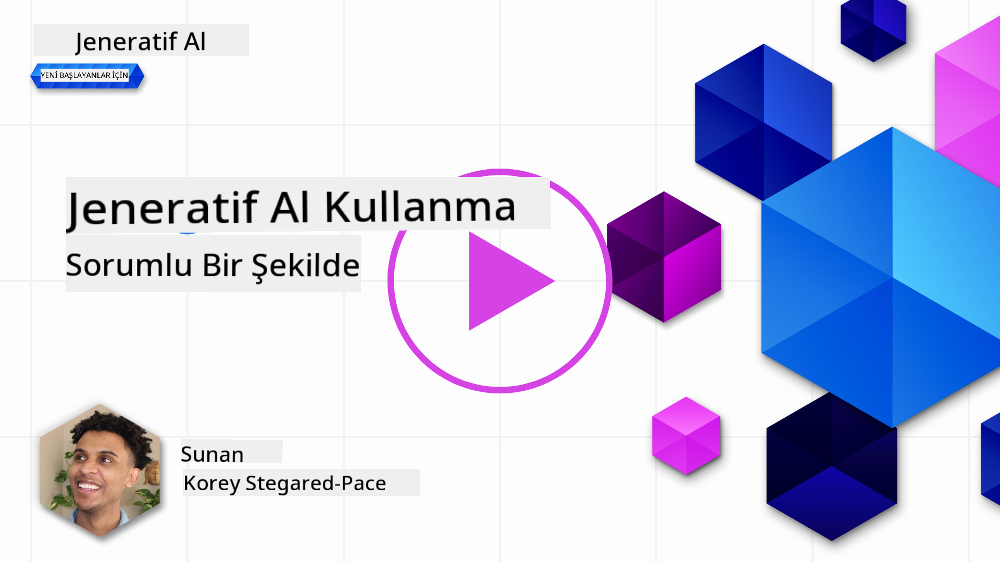
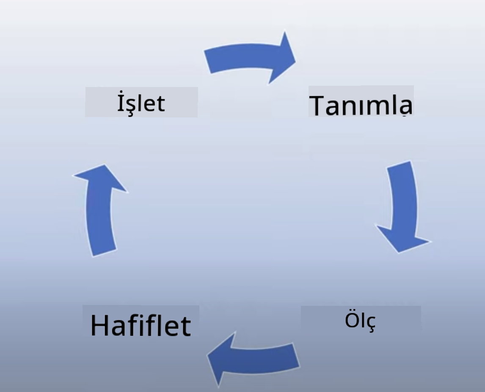
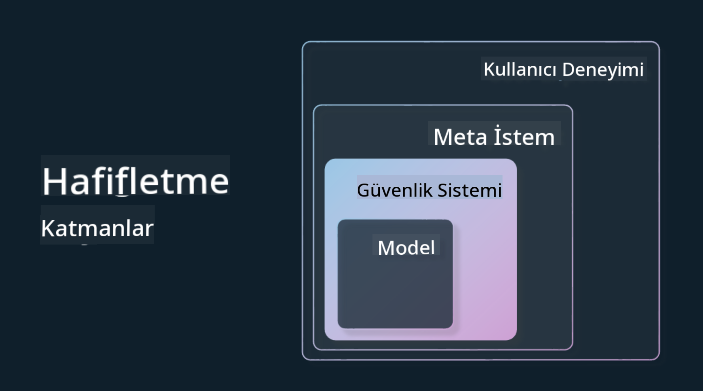

<!--
CO_OP_TRANSLATOR_METADATA:
{
  "original_hash": "7f8f4c11f8c1cb6e1794442dead414ea",
  "translation_date": "2025-07-09T08:55:41+00:00",
  "source_file": "03-using-generative-ai-responsibly/README.md",
  "language_code": "tr"
}
-->
# Generatif Yapay Zekayı Sorumlu Bir Şekilde Kullanmak

> _Bu dersin videosunu izlemek için yukarıdaki görsele tıklayın_

Yapay zekaya, özellikle de generatif yapay zekaya hayran kalmak kolaydır, ancak onu nasıl sorumlu bir şekilde kullanacağınızı düşünmeniz gerekir. Çıktının adil, zararsız ve daha fazlası olmasını nasıl sağlayacağınızı göz önünde bulundurmalısınız. Bu bölüm, bahsedilen bağlamı, nelere dikkat etmeniz gerektiğini ve yapay zeka kullanımınızı geliştirmek için nasıl aktif adımlar atabileceğinizi sunmayı amaçlamaktadır.

## Giriş

Bu derste şunlar ele alınacak:

- Generatif Yapay Zeka uygulamaları geliştirirken neden Sorumlu Yapay Zekayı önceliklendirmelisiniz.
- Sorumlu Yapay Zekanın temel prensipleri ve bunların Generatif Yapay Zeka ile ilişkisi.
- Bu Sorumlu Yapay Zeka prensiplerini strateji ve araçlar aracılığıyla nasıl uygulayabileceğiniz.

## Öğrenme Hedefleri

Bu dersi tamamladıktan sonra şunları bileceksiniz:

- Generatif Yapay Zeka uygulamaları geliştirirken Sorumlu Yapay Zekanın önemi.
- Generatif Yapay Zeka uygulamaları geliştirirken Sorumlu Yapay Zekanın temel prensiplerini ne zaman düşünüp uygulamanız gerektiği.
- Sorumlu Yapay Zeka kavramını pratiğe dökmek için hangi araçlar ve stratejilerin mevcut olduğu.

## Sorumlu Yapay Zeka Prensipleri

Generatif Yapay Zekanın heyecanı hiç bu kadar yüksek olmamıştı. Bu heyecan, bu alana birçok yeni geliştirici, ilgi ve finansman getirdi. Bu, Generatif Yapay Zeka kullanarak ürünler ve şirketler kurmak isteyen herkes için çok olumlu olsa da, sorumlu bir şekilde ilerlememiz de önemlidir.

Bu kurs boyunca, startup’ımızı ve yapay zeka eğitim ürünümüzü geliştirmeye odaklanıyoruz. Sorumlu Yapay Zeka prensiplerini kullanacağız: Adillik, Kapsayıcılık, Güvenilirlik/Güvenlik, Güvenlik & Gizlilik, Şeffaflık ve Hesap Verebilirlik. Bu prensiplerle, ürünlerimizde Generatif Yapay Zekayı nasıl kullandığımızı keşfedeceğiz.

## Neden Sorumlu Yapay Zekayı Önceliklendirmelisiniz

Bir ürün geliştirirken, kullanıcılarınızın çıkarlarını ön planda tutan insan merkezli bir yaklaşım en iyi sonuçları getirir.

Generatif Yapay Zekanın benzersizliği, kullanıcılara faydalı cevaplar, bilgi, rehberlik ve içerik yaratma gücüdür. Bu, birçok manuel adıma gerek kalmadan yapılabilir ve çok etkileyici sonuçlar ortaya çıkarabilir. Ancak doğru planlama ve stratejiler olmadan, maalesef kullanıcılarınız, ürününüz ve toplum için zararlı sonuçlara yol açabilir.

Şimdi bu potansiyel zararlı sonuçlardan bazılarına (ama hepsine değil) bakalım:

### Halüsinasyonlar

Halüsinasyonlar, bir LLM’nin tamamen anlamsız içerik üretmesi veya diğer bilgi kaynaklarına göre gerçeğe aykırı olan içerik üretmesi durumunu tanımlamak için kullanılan bir terimdir.

Örneğin, startup’ımız için öğrencilere tarihsel sorular sorma imkanı veren bir özellik geliştirdiğimizi düşünelim. Bir öğrenci “Titanik’in tek kurtulanı kimdi?” sorusunu soruyor.

Model aşağıdaki gibi bir yanıt üretiyor:

> _(Kaynak: [Flying bisons](https://flyingbisons.com?WT.mc_id=academic-105485-koreyst))_

Bu çok kendinden emin ve detaylı bir cevap. Ne yazık ki, yanlış. Az bir araştırmayla bile Titanik felaketinde birden fazla kurtulan olduğu ortaya çıkar. Bu konuyu yeni araştırmaya başlayan bir öğrenci için bu cevap sorgulanmadan doğru kabul edilebilir. Bunun sonucu, yapay zeka sisteminin güvenilmez hale gelmesi ve startup’ımızın itibarının zarar görmesi olabilir.

Her yeni LLM sürümünde halüsinasyonları minimize etme konusunda performans iyileştirmeleri gördük. Bu iyileştirmelere rağmen, biz uygulama geliştiricileri ve kullanıcılar olarak bu sınırlamaların farkında olmaya devam etmeliyiz.

### Zararlı İçerik

Önceki bölümde, bir LLM’nin yanlış veya anlamsız yanıtlar üretmesinden bahsettik. Dikkat etmemiz gereken bir diğer risk ise modelin zararlı içerik üretmesidir.

Zararlı içerik şu şekilde tanımlanabilir:

- Kişiye veya belirli gruplara zarar verme ya da kendine zarar verme talimatları verme veya teşvik etme.
- Nefret dolu veya aşağılayıcı içerik.
- Herhangi bir saldırı veya şiddet eyleminin planlanmasına rehberlik etme.
- Yasadışı içerik bulma veya yasadışı eylemler gerçekleştirme talimatları verme.
- Cinsel açıdan açık içerik gösterme.

Startup’ımız için öğrencilerin bu tür içeriklerle karşılaşmaması adına doğru araçlar ve stratejiler geliştirmek istiyoruz.

### Adaletsizlik

Adillik, “bir yapay zeka sisteminin önyargı ve ayrımcılıktan arınmış olması ve herkese adil ve eşit davranması” olarak tanımlanır. Generatif Yapay Zeka dünyasında, marjinalize edilmiş grupların dışlayıcı dünya görüşlerinin model çıktılarıyla pekiştirilmemesini sağlamalıyız.

Bu tür çıktılar, kullanıcılarımıza olumlu ürün deneyimleri sunmayı engellemekle kalmaz, aynı zamanda toplumsal zarara da yol açar. Uygulama geliştiricileri olarak, Generatif Yapay Zeka ile çözümler geliştirirken geniş ve çeşitli bir kullanıcı kitlesini her zaman göz önünde bulundurmalıyız.

## Generatif Yapay Zekayı Sorumlu Bir Şekilde Nasıl Kullanabilirsiniz

Sorumlu Generatif Yapay Zekanın önemini belirledikten sonra, yapay zeka çözümlerimizi sorumlu bir şekilde geliştirmek için atabileceğimiz 4 adıma bakalım:

### Potansiyel Zararları Ölçün

Yazılım testinde, bir kullanıcının uygulama üzerindeki beklenen davranışlarını test ederiz. Benzer şekilde, kullanıcıların en çok kullanması muhtemel çeşitli istemleri test etmek potansiyel zararı ölçmek için iyi bir yoldur.

Startup’ımız eğitim ürünü geliştirdiği için, eğitimle ilgili istemlerin bir listesini hazırlamak faydalı olur. Bu, belirli bir konuyu, tarihsel gerçekleri ve öğrenci yaşamıyla ilgili istemleri kapsayabilir.

### Potansiyel Zararları Azaltın

Artık modelin ve yanıtlarının neden olabileceği potansiyel zararı önlemek veya sınırlamak için yollar bulma zamanı. Bunu 4 farklı katmanda ele alabiliriz:

- **Model**. Doğru kullanım durumu için doğru modeli seçmek. GPT-4 gibi daha büyük ve karmaşık modeller, daha küçük ve spesifik kullanım durumlarında zararlı içerik riski yaratabilir. Eğitim verilerinizi kullanarak ince ayar yapmak da zararlı içerik riskini azaltır.

- **Güvenlik Sistemi**. Güvenlik sistemi, modeli sunan platformda zararı azaltmaya yardımcı olan araçlar ve yapılandırmalar setidir. Örneğin, Azure OpenAI servisindeki içerik filtreleme sistemi. Sistemler ayrıca jailbreak saldırılarını ve botlardan gelen istenmeyen aktiviteleri tespit etmelidir.

- **Metaistek**. Metaistekler ve temel oluşturma, modeli belirli davranışlar ve bilgiler doğrultusunda yönlendirmek veya sınırlamak için kullanılır. Bu, modelin belirli sınırlarını tanımlamak için sistem girdileri kullanmak olabilir. Ayrıca, sistemin kapsamına veya alanına daha uygun çıktılar sağlamak da buna dahildir.

Ayrıca, Retrieval Augmented Generation (RAG) gibi tekniklerle modelin yalnızca güvenilir kaynaklardan bilgi çekmesini sağlayabiliriz. Bu kursun ilerleyen bölümlerinde [arama uygulamaları geliştirme](../08-building-search-applications/README.md?WT.mc_id=academic-105485-koreyst) dersi bulunmaktadır.

- **Kullanıcı Deneyimi**. Son katman, kullanıcının uygulama arayüzümüz aracılığıyla modelle doğrudan etkileşimde bulunduğu yerdir. Bu şekilde, kullanıcıların modele gönderebileceği girdi türlerini ve kullanıcıya gösterilen metin veya görselleri sınırlamak için UI/UX tasarlanabilir. AI uygulamasını dağıtırken, Generatif Yapay Zeka uygulamamızın neler yapıp yapamayacağı konusunda şeffaf olmalıyız.

[AI Uygulamaları için UX Tasarımı](../12-designing-ux-for-ai-applications/README.md?WT.mc_id=academic-105485-koreyst) adlı dersimiz bu konuya tamamen ayrılmıştır.

- **Modeli Değerlendirin**. LLM’lerle çalışmak zordur çünkü modelin eğitildiği veriler üzerinde her zaman kontrolümüz olmaz. Yine de, modelin performansını ve çıktıları her zaman değerlendirmeliyiz. Modelin doğruluğunu, benzerliğini, temelliliğini ve çıktıların alaka düzeyini ölçmek önemlidir. Bu, paydaşlara ve kullanıcılara şeffaflık ve güven sağlar.

### Sorumlu Bir Generatif Yapay Zeka Çözümü İşletin

Yapay zeka uygulamalarınız etrafında operasyonel bir uygulama oluşturmak son aşamadır. Bu, startup’ımızın Hukuk ve Güvenlik gibi diğer bölümleriyle iş birliği yaparak tüm düzenleyici politikalara uyduğumuzdan emin olmayı içerir. Lansmandan önce, teslimat, olay yönetimi ve geri alma planları yaparak kullanıcılarımıza zarar gelmesini önlemek isteriz.

## Araçlar

Sorumlu Yapay Zeka çözümleri geliştirmek zor görünebilir, ancak bu çabaya kesinlikle değer. Generatif Yapay Zeka alanı büyüdükçe, geliştiricilerin sorumluluğu iş akışlarına verimli şekilde entegre etmelerine yardımcı olacak daha fazla araç gelişecektir. Örneğin, [Azure AI Content Safety](https://learn.microsoft.com/azure/ai-services/content-safety/overview?WT.mc_id=academic-105485-koreyst) API isteği yoluyla zararlı içerik ve görselleri tespit etmeye yardımcı olabilir.

## Bilgi Kontrolü

Sorumlu yapay zeka kullanımı için nelere dikkat etmelisiniz?

1. Cevabın doğru olması.
1. Zararlı kullanım, yapay zekanın suç amaçlı kullanılmaması.
1. Yapay zekanın önyargı ve ayrımcılıktan arınmış olması.

Cevap: 2 ve 3 doğru. Sorumlu Yapay Zeka, zararlı etkileri ve önyargıları nasıl azaltacağınızı düşünmenize yardımcı olur.

## 🚀 Meydan Okuma

[Azure AI Content Safety](https://learn.microsoft.com/azure/ai-services/content-safety/overview?WT.mc_id=academic-105485-koreyst) hakkında bilgi edinin ve kullanımınız için neleri benimseyebileceğinize bakın.

## Harika İş Çıkardınız, Öğrenmeye Devam Edin

Bu dersi tamamladıktan sonra, Generatif Yapay Zeka bilginizi geliştirmeye devam etmek için [Generative AI Learning koleksiyonumuza](https://aka.ms/genai-collection?WT.mc_id=academic-105485-koreyst) göz atın!

Bir sonraki derse, [Prompt Engineering Fundamentals](../04-prompt-engineering-fundamentals/README.md?WT.mc_id=academic-105485-koreyst) bakmak için geçebilirsiniz!

**Feragatname**:  
Bu belge, AI çeviri servisi [Co-op Translator](https://github.com/Azure/co-op-translator) kullanılarak çevrilmiştir. Doğruluk için çaba göstersek de, otomatik çevirilerin hatalar veya yanlışlıklar içerebileceğini lütfen unutmayınız. Orijinal belge, kendi dilinde yetkili kaynak olarak kabul edilmelidir. Kritik bilgiler için profesyonel insan çevirisi önerilir. Bu çevirinin kullanımı sonucu oluşabilecek yanlış anlamalar veya yorum hatalarından sorumlu değiliz.