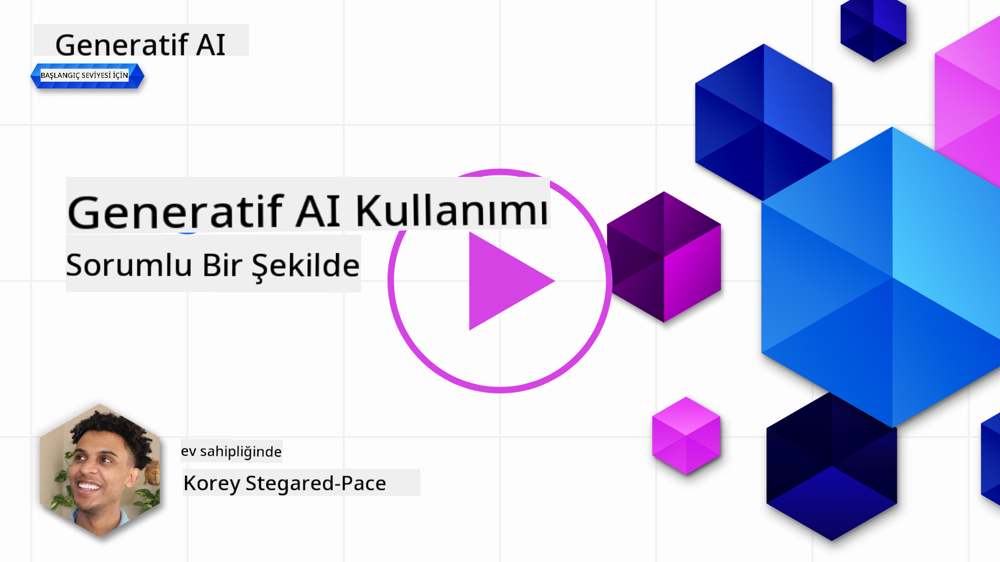
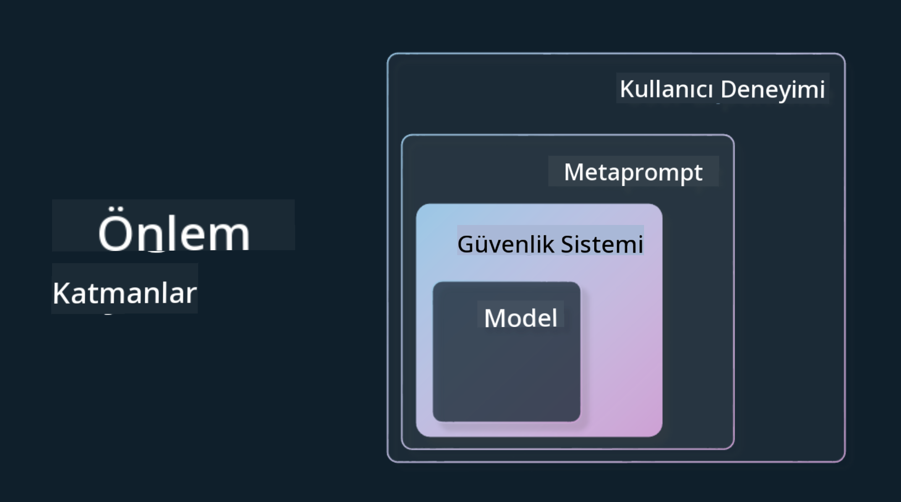

<!--
CO_OP_TRANSLATOR_METADATA:
{
  "original_hash": "13084c6321a2092841b9a081b29497ba",
  "translation_date": "2025-05-19T14:39:02+00:00",
  "source_file": "03-using-generative-ai-responsibly/README.md",
  "language_code": "tr"
}
-->
# Üretken Yapay Zekayı Sorumlu Kullanma

> _Bu dersin videosunu izlemek için yukarıdaki görsele tıklayın_

Yapay zeka ve özellikle üretken yapay zeka ile büyülenmek kolaydır, ancak bunu sorumlu bir şekilde nasıl kullanacağınızı düşünmelisiniz. Çıktının adil, zararsız olmasını sağlamak gibi konuları göz önünde bulundurmanız gerekir. Bu bölüm, bahsedilen bağlamı, dikkate alınması gerekenleri ve yapay zeka kullanımınızı iyileştirmek için atabileceğiniz aktif adımları sağlamayı amaçlamaktadır.

## Giriş

Bu derste ele alınacak konular:

- Üretken yapay zeka uygulamaları geliştirirken neden Sorumlu Yapay Zekayı önceliklendirmeniz gerektiği.
- Sorumlu Yapay Zeka'nın temel ilkeleri ve bunların Üretken Yapay Zeka ile nasıl ilişkili olduğu.
- Bu Sorumlu Yapay Zeka ilkelerini strateji ve araçlar yoluyla nasıl uygulamaya koyabileceğiniz.

## Öğrenme Hedefleri

Bu dersi tamamladıktan sonra şunları bileceksiniz:

- Üretken yapay zeka uygulamaları geliştirirken Sorumlu Yapay Zekanın önemi.
- Üretken yapay zeka uygulamaları geliştirirken Sorumlu Yapay Zekanın temel ilkelerini ne zaman düşünmeniz ve uygulamanız gerektiği.
- Sorumlu Yapay Zeka kavramını uygulamaya koymak için hangi araç ve stratejilerin mevcut olduğu.

## Sorumlu Yapay Zeka İlkeleri

Üretken Yapay Zeka'nın heyecanı hiç bu kadar yüksek olmamıştı. Bu heyecan, bu alana birçok yeni geliştirici, dikkat ve finansman getirdi. Bu, Üretken Yapay Zekayı kullanarak ürünler ve şirketler oluşturmak isteyen herkes için çok olumlu olsa da, sorumlu bir şekilde ilerlemek de önemlidir.

Bu kurs boyunca, startup'ımızı ve yapay zeka eğitim ürünümüzü geliştirmeye odaklanıyoruz. Sorumlu Yapay Zeka ilkelerini kullanacağız: Adalet, Kapsayıcılık, Güvenilirlik/Güvenlik, Güvenlik ve Gizlilik, Şeffaflık ve Hesap Verebilirlik. Bu ilkelerle, ürünlerimizde Üretken Yapay Zekayı kullanmamızla nasıl ilişkili olduklarını keşfedeceğiz.

## Neden Sorumlu Yapay Zekayı Önceliklendirmelisiniz?

Bir ürün geliştirirken, kullanıcılarınızın en iyi çıkarlarını göz önünde bulundurarak insan merkezli bir yaklaşım benimsemek en iyi sonuçlara yol açar.

Üretken Yapay Zekanın benzersizliği, kullanıcılara faydalı cevaplar, bilgi, rehberlik ve içerik yaratma gücüdür. Bu, birçok manuel adım olmadan yapılabilir ve çok etkileyici sonuçlara yol açabilir. Ancak, uygun planlama ve stratejiler olmadan, kullanıcılarınız, ürününüz ve toplumun tamamı için bazı zararlı sonuçlara da yol açabilir.

Bu potansiyel zararlı sonuçlardan bazılarına (ancak hepsine değil) bakalım:

### Halüsinasyonlar

Halüsinasyonlar, bir LLM'nin ya tamamen anlamsız ya da diğer bilgi kaynaklarına göre kesinlikle yanlış olduğunu bildiğimiz içerik ürettiğinde kullanılan bir terimdir.

Örneğin, öğrencilerin bir modele tarihsel sorular sormasına izin veren bir özellik geliştirdiğimizi düşünelim. Bir öğrenci `Who was the sole survivor of Titanic?` sorusunu sorar.

Model aşağıdaki gibi bir yanıt üretir:

> _(Kaynak: [Flying bisons](https://flyingbisons.com?WT.mc_id=academic-105485-koreyst))_

Bu çok kendinden emin ve kapsamlı bir cevap. Ne yazık ki, yanlıştır. Çok az bir araştırma ile Titanic felaketinden birden fazla kurtulan olduğunu keşfedebilirsiniz. Bu konuya yeni başlayan bir öğrenci için bu cevap sorgulanmayacak ve gerçek olarak kabul edilebilecek kadar ikna edici olabilir. Bunun sonuçları, yapay zeka sisteminin güvenilmez olmasına ve startup'ımızın itibarını olumsuz etkilemesine yol açabilir.

Herhangi bir LLM'nin her yinelemesinde, halüsinasyonları en aza indirme konusunda performans iyileştirmeleri gördük. Bu iyileştirmeye rağmen, uygulama geliştiricileri ve kullanıcılar olarak bu sınırlamaların farkında olmamız gerekiyor.

### Zararlı İçerik

Önceki bölümde, bir LLM'nin yanlış veya anlamsız yanıtlar ürettiği durumları ele aldık. Dikkat etmemiz gereken bir diğer risk, bir modelin zararlı içerik ile yanıt vermesidir.

Zararlı içerik şu şekilde tanımlanabilir:

- Kendine zarar verme veya belirli gruplara zarar verme talimatları verme veya teşvik etme.
- Nefret dolu veya aşağılayıcı içerik.
- Herhangi bir saldırı veya şiddet eylemi planlamayı yönlendirme.
- Yasadışı içeriği bulma veya yasadışı eylemler gerçekleştirme talimatları verme.
- Cinsel içerikli içerik gösterme.

Startup'ımız için, öğrenciler tarafından görülmesini önlemek için bu tür içeriklerin doğru araç ve stratejilerle önlenmesini sağlamak istiyoruz.

### Adalet Eksikliği

Adalet, “bir yapay zeka sisteminin önyargı ve ayrımcılıktan arındırılmış olmasını ve herkesle adil ve eşit şekilde muamele etmesini sağlamak” olarak tanımlanır. Üretken Yapay Zeka dünyasında, marjinal grupların dışlayıcı dünya görüşlerinin modelin çıktısı tarafından pekiştirilmediğinden emin olmak istiyoruz.

Bu tür çıktılar, kullanıcılarımız için olumlu ürün deneyimleri oluşturmanın yanı sıra toplumsal zarara da neden olur. Uygulama geliştiricileri olarak, Üretken Yapay Zeka ile çözümler geliştirirken her zaman geniş ve çeşitli bir kullanıcı tabanını göz önünde bulundurmalıyız.

## Üretken Yapay Zekayı Sorumlu Kullanma

Artık Sorumlu Üretken Yapay Zekanın önemini belirlediğimize göre, yapay zeka çözümlerimizi sorumlu bir şekilde geliştirmek için atabileceğimiz 4 adıma bakalım:

### Potansiyel Zararları Ölçme

Yazılım testinde, bir kullanıcının bir uygulama üzerindeki beklenen eylemlerini test ederiz. Benzer şekilde, kullanıcıların en olası şekilde kullanacakları çeşitli yönlendirmeleri test etmek, potansiyel zararı ölçmenin iyi bir yoludur.

Startup'ımız bir eğitim ürünü geliştirdiği için, eğitimle ilgili yönlendirmelerin bir listesini hazırlamak iyi olurdu. Bu, belirli bir konuyu kapsamak, tarihsel gerçekleri ele almak ve öğrenci hayatı hakkında yönlendirmeler olabilir.

### Potansiyel Zararları Azaltma

Artık modelin ve yanıtlarının neden olabileceği potansiyel zararı önlemek veya sınırlamak için yollar bulma zamanı. Bunu 4 farklı katmanda ele alabiliriz:

- **Model**. Doğru kullanım durumu için doğru modeli seçmek. GPT-4 gibi daha büyük ve daha karmaşık modeller, daha küçük ve daha spesifik kullanım durumlarına uygulandığında zararlı içerik riski oluşturabilir. Eğitim verilerinizi kullanarak ince ayar yapmak da zararlı içerik riskini azaltır.

- **Güvenlik Sistemi**. Bir güvenlik sistemi, zararı azaltmaya yardımcı olan platformda modele hizmet eden bir dizi araç ve yapılandırmadır. Azure OpenAI hizmetindeki içerik filtreleme sistemi buna bir örnektir. Sistemler ayrıca jailbreak saldırılarını ve botlardan gelen istekler gibi istenmeyen etkinlikleri tespit etmelidir.

- **Metaprompt**. Metapromptlar ve temel ayarlamalar, belirli davranışlar ve bilgilere dayalı olarak modeli yönlendirme veya sınırlama yollarıdır. Bu, modelin belirli sınırlarını tanımlamak için sistem girdilerini kullanmak olabilir. Ayrıca, sistemin kapsamına veya alanına daha uygun çıktılar sağlamak.

Ayrıca, modelin yalnızca güvenilir kaynaklardan bilgi çekmesini sağlamak için Retrieval Augmented Generation (RAG) gibi teknikler kullanılabilir. Bu kursun ilerleyen bölümlerinde [arama uygulamaları geliştirme](../08-building-search-applications/README.md?WT.mc_id=academic-105485-koreyst) üzerine bir ders var.

- **Kullanıcı Deneyimi**. Son katman, kullanıcının modelle uygulamamızın arayüzü aracılığıyla bir şekilde doğrudan etkileşime geçtiği yerdir. Bu şekilde, kullanıcıların modele gönderebileceği girdilerin türlerini sınırlamak için UI/UX tasarlayabiliriz ve kullanıcıya gösterilen metin veya görüntüler üzerinde sınırlamalar koyabiliriz. Yapay zeka uygulamasını dağıtırken, Üretken Yapay Zeka uygulamamızın ne yapıp yapamayacağı konusunda da şeffaf olmalıyız.

[AI Uygulamaları için UX Tasarımı](../12-designing-ux-for-ai-applications/README.md?WT.mc_id=academic-105485-koreyst) üzerine ayrılmış bir dersimiz var.

- **Modeli Değerlendirme**. LLM'lerle çalışmak zor olabilir çünkü modelin eğitildiği veriler üzerinde her zaman kontrolümüz olmayabilir. Buna rağmen, modelin performansını ve çıktısını her zaman değerlendirmeliyiz. Modelin doğruluğunu, benzerliğini, temellendirmesini ve çıktının alaka düzeyini ölçmek hala önemlidir. Bu, paydaşlara ve kullanıcılara şeffaflık ve güven sağlar.

### Sorumlu Üretken Yapay Zeka Çözümü İşletme

Yapay zeka uygulamalarınız etrafında operasyonel bir uygulama oluşturmak son aşamadır. Bu, tüm yasal düzenlemelere uygun olduğumuzdan emin olmak için startup'ımızın diğer bölümleriyle, örneğin Hukuk ve Güvenlik ile işbirliği yapmayı içerir. Başlatmadan önce, teslimat, olayları ele alma ve geri alma planları oluşturmak da kullanıcılarımıza zarar vermeyi önlemek için önemlidir.

## Araçlar

Sorumlu Yapay Zeka çözümleri geliştirme çalışması çok gibi görünse de, bu çabaya değer bir çalışmadır. Üretken Yapay Zeka alanı büyüdükçe, geliştiricilerin sorumluluğu iş akışlarına verimli bir şekilde entegre etmelerine yardımcı olacak daha fazla araç olgunlaşacaktır. Örneğin, [Azure AI İçerik Güvenliği](https://learn.microsoft.com/azure/ai-services/content-safety/overview?WT.mc_id=academic-105485-koreyst), zararlı içerik ve görüntüleri bir API isteği ile tespit etmenize yardımcı olabilir.

## Bilgi Kontrolü

Sorumlu yapay zeka kullanımını sağlamak için dikkat etmeniz gereken bazı şeyler nelerdir?

1. Cevabın doğru olması.
1. Zararlı kullanım, yapay zekanın suç amaçlı kullanılmaması.
1. Yapay zekanın önyargı ve ayrımcılıktan arındırılmış olmasını sağlamak.

C: 2 ve 3 doğrudur. Sorumlu Yapay Zeka, zararlı etkileri ve önyargıları nasıl azaltabileceğinizi düşünmenize yardımcı olur ve daha fazlasını sağlar.

## 🚀 Meydan Okuma

[Azure AI İçerik Güvenliği](https://learn.microsoft.com/azure/ai-services/content-safety/overview?WT.mc_id=academic-105485-koreyst) hakkında bilgi edinin ve kullanımınız için neler benimseyebileceğinizi görün.

## Harika İş, Öğrenmeye Devam Edin

Bu dersi tamamladıktan sonra, Üretken Yapay Zeka bilginizi artırmaya devam etmek için [Üretken Yapay Zeka Öğrenme koleksiyonumuza](https://aka.ms/genai-collection?WT.mc_id=academic-105485-koreyst) göz atın!

[Prompt Mühendisliği Temelleri](../04-prompt-engineering-fundamentals/README.md?WT.mc_id=academic-105485-koreyst) konusunu inceleyeceğimiz 4. Derse geçin!

**Sorumluluk Reddi**: 
Bu belge, AI çeviri hizmeti [Co-op Translator](https://github.com/Azure/co-op-translator) kullanılarak çevrilmiştir. Doğruluk için çaba göstersek de, otomatik çevirilerin hata veya yanlışlıklar içerebileceğini unutmayın. Belgenin orijinal dili, yetkili kaynak olarak kabul edilmelidir. Kritik bilgiler için profesyonel insan çevirisi önerilir. Bu çevirinin kullanımından kaynaklanan yanlış anlama veya yanlış yorumlamalardan sorumlu değiliz.