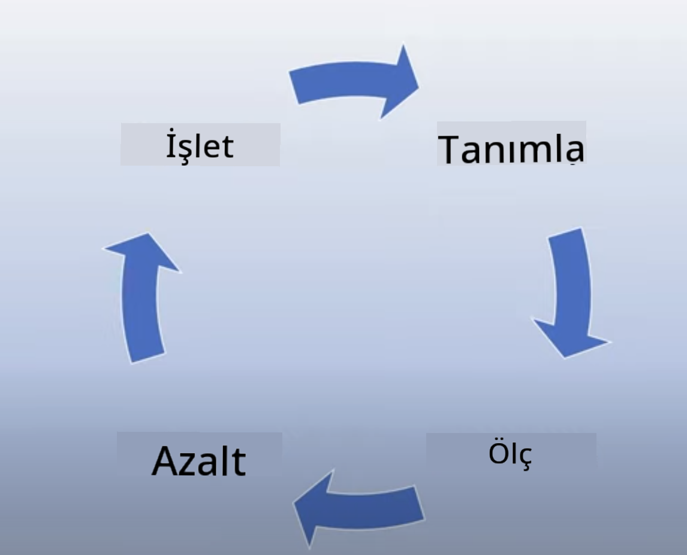

<!--
CO_OP_TRANSLATOR_METADATA:
{
  "original_hash": "4d57fad773cbeb69c5dd62e65c34200d",
  "translation_date": "2025-10-17T16:18:21+00:00",
  "source_file": "03-using-generative-ai-responsibly/README.md",
  "language_code": "tr"
}
-->
# Üretken Yapay Zekayı Sorumlu Şekilde Kullanma

> _Bu dersin videosunu izlemek için yukarıdaki görsele tıklayın_

Yapay zeka ve özellikle üretken yapay zeka ile büyülenmek kolaydır, ancak bunu sorumlu bir şekilde nasıl kullanacağınızı düşünmeniz gerekir. Çıktının adil, zararsız ve daha fazlası olmasını nasıl sağlayacağınızı düşünmelisiniz. Bu bölüm, size bahsedilen bağlamı, dikkate alınması gerekenleri ve yapay zeka kullanımınızı iyileştirmek için aktif adımlar atmayı nasıl başaracağınızı sunmayı amaçlamaktadır.

## Giriş

Bu derste ele alınacak konular:

- Üretken yapay zeka uygulamaları oluştururken neden Sorumlu Yapay Zekayı önceliklendirmelisiniz.
- Sorumlu Yapay Zeka'nın temel ilkeleri ve bunların Üretken Yapay Zeka ile nasıl ilişkili olduğu.
- Bu Sorumlu Yapay Zeka ilkelerini strateji ve araçlar aracılığıyla nasıl uygulayabilirsiniz.

## Öğrenme Hedefleri

Bu dersi tamamladıktan sonra şunları bileceksiniz:

- Üretken yapay zeka uygulamaları oluştururken Sorumlu Yapay Zeka'nın önemi.
- Üretken yapay zeka uygulamaları oluştururken Sorumlu Yapay Zeka'nın temel ilkelerini ne zaman düşünmeli ve uygulamalısınız.
- Sorumlu Yapay Zeka kavramını uygulamaya koymak için hangi araçlar ve stratejiler mevcut.

## Sorumlu Yapay Zeka İlkeleri

Üretken yapay zeka heyecanı hiç olmadığı kadar yüksek. Bu heyecan, bu alana birçok yeni geliştirici, dikkat ve finansman getirdi. Bu, Üretken Yapay Zeka kullanarak ürünler ve şirketler oluşturmak isteyen herkes için çok olumlu bir durum olsa da, aynı zamanda sorumlu bir şekilde ilerlememiz önemlidir.

Bu kurs boyunca, girişimimizi ve yapay zeka eğitim ürünümüzü oluşturmayı odak noktası olarak alıyoruz. Sorumlu Yapay Zeka ilkelerini kullanacağız: Adalet, Kapsayıcılık, Güvenilirlik/Güvenlik, Güvenlik ve Gizlilik, Şeffaflık ve Hesap Verebilirlik. Bu ilkelerle, ürünlerimizde Üretken Yapay Zeka kullanımımızla nasıl ilişkili olduklarını keşfedeceğiz.

## Neden Sorumlu Yapay Zekayı Önceliklendirmelisiniz?

Bir ürün oluştururken, kullanıcılarınızın en iyi çıkarlarını göz önünde bulundurarak insan merkezli bir yaklaşım benimsemek en iyi sonuçlara yol açar.

Üretken yapay zekanın benzersizliği, kullanıcılar için faydalı cevaplar, bilgiler, rehberlik ve içerik oluşturma gücüdür. Bu, çok fazla manuel adım olmadan yapılabilir ve çok etkileyici sonuçlara yol açabilir. Ancak, uygun planlama ve stratejiler olmadan, kullanıcılarınız, ürününüz ve toplum için bazı zararlı sonuçlara da yol açabilir.

Bu potansiyel zararlı sonuçlardan bazılarına (hepsi değil) bir göz atalım:

### Halüsinasyonlar

Halüsinasyonlar, bir LLM'nin tamamen anlamsız içerik veya diğer bilgi kaynaklarına göre yanlış olduğunu bildiğimiz bir şey üretmesi durumunu tanımlamak için kullanılan bir terimdir.

Örneğin, girişimimiz için öğrencilere tarihsel sorular sormasına olanak tanıyan bir özellik oluşturduğumuzu varsayalım. Bir öğrenci şu soruyu sorar: `Titanik'in tek kurtulanı kimdi?`

Model aşağıdaki gibi bir yanıt üretir:

> _(Kaynak: [Flying bisons](https://flyingbisons.com?WT.mc_id=academic-105485-koreyst))_

Bu çok kendinden emin ve ayrıntılı bir cevap. Ne yazık ki, yanlıştır. Çok az bir araştırmayla bile, Titanik felaketinden birden fazla kişinin kurtulduğunu keşfedebilirsiniz. Bu konu hakkında araştırmaya yeni başlayan bir öğrenci için bu cevap, sorgulanmayacak kadar ikna edici olabilir ve gerçek olarak kabul edilebilir. Bunun sonuçları, yapay zeka sisteminin güvenilmez olmasına ve girişimimizin itibarını olumsuz etkilemesine yol açabilir.

Herhangi bir LLM'nin her bir yinelemesiyle, halüsinasyonları en aza indirme konusunda performans iyileştirmeleri gördük. Bu iyileştirmeye rağmen, uygulama geliştiricileri ve kullanıcılar olarak bu sınırlamaların farkında olmaya devam etmeliyiz.

### Zararlı İçerik

Bir LLM'nin yanlış veya anlamsız yanıtlar ürettiği önceki bölümde ele aldık. Dikkat etmemiz gereken bir diğer risk, bir modelin zararlı içerik üretmesidir.

Zararlı içerik şu şekilde tanımlanabilir:

- Kendine zarar verme veya belirli gruplara zarar verme talimatları verme veya teşvik etme.
- Nefret dolu veya aşağılayıcı içerik.
- Herhangi bir tür saldırı veya şiddet eylemi planlamasına rehberlik etme.
- Yasadışı içerik bulma veya yasadışı eylemler gerçekleştirme talimatları verme.
- Cinsel açıdan açık içerik gösterme.

Girişimimiz için, öğrencilerin bu tür içerikleri görmesini önlemek için doğru araçlara ve stratejilere sahip olduğumuzdan emin olmak istiyoruz.

### Adalet Eksikliği

Adalet, “bir yapay zeka sisteminin önyargı ve ayrımcılıktan arındırılmış olmasını ve herkese adil ve eşit davranmasını sağlamak” olarak tanımlanır. Üretken yapay zeka dünyasında, modelin çıktısının marjinal grupların dışlayıcı dünya görüşlerini pekiştirmediğinden emin olmak istiyoruz.

Bu tür çıktılar, kullanıcılarımız için olumlu ürün deneyimleri oluşturmayı engellemekle kalmaz, aynı zamanda toplumsal zarara da neden olur. Uygulama geliştiricileri olarak, Üretken Yapay Zeka ile çözümler oluştururken her zaman geniş ve çeşitli bir kullanıcı kitlesini akılda tutmalıyız.

## Üretken Yapay Zekayı Sorumlu Şekilde Nasıl Kullanabilirsiniz?

Artık Sorumlu Üretken Yapay Zeka'nın önemini belirlediğimize göre, yapay zeka çözümlerimizi sorumlu bir şekilde oluşturmak için atabileceğimiz 4 adıma bakalım:

### Potansiyel Zararları Ölçün

Yazılım testinde, bir kullanıcının bir uygulamadaki beklenen eylemlerini test ederiz. Benzer şekilde, kullanıcıların en olası şekilde kullanacağı çeşitli istemleri test etmek, potansiyel zararı ölçmenin iyi bir yoludur.

Girişimimiz bir eğitim ürünü oluşturduğundan, eğitimle ilgili istemlerin bir listesini hazırlamak iyi bir fikir olacaktır. Bu, belirli bir konuyu, tarihsel gerçekleri ve öğrenci hayatıyla ilgili istemleri kapsayabilir.

### Potansiyel Zararları Azaltın

Artık modelin ve yanıtlarının neden olabileceği potansiyel zararı önlemek veya sınırlamak için yollar bulma zamanı. Bunu 4 farklı katmanda inceleyebiliriz:

- **Model**. Doğru kullanım durumu için doğru modeli seçmek. GPT-4 gibi daha büyük ve karmaşık modeller, daha küçük ve daha spesifik kullanım durumlarına uygulandığında zararlı içerik riski oluşturabilir. Eğitim verilerinizi kullanarak ince ayar yapmak, zararlı içerik riskini de azaltır.

- **Güvenlik Sistemi**. Güvenlik sistemi, zararı azaltmaya yardımcı olan modelin hizmet verdiği platformdaki araçlar ve yapılandırmalar setidir. Bunun bir örneği, Azure OpenAI hizmetindeki içerik filtreleme sistemidir. Sistemler ayrıca jailbreak saldırılarını ve botlardan gelen istekler gibi istenmeyen etkinlikleri algılamalıdır.

- **Metaprompt**. Metapromptlar ve dayanaklar, belirli davranışlar ve bilgiler temelinde modeli yönlendirme veya sınırlama yollarıdır. Bu, sistem girdilerini kullanarak modelin belirli sınırlarını tanımlamak olabilir. Ayrıca, sistemin kapsamına veya alanına daha uygun çıktılar sağlamak olabilir.

Modelin yalnızca güvenilir kaynaklardan seçilmiş bilgileri çekmesini sağlamak için Retrieval Augmented Generation (RAG) gibi teknikler kullanmak da mümkündür. Bu kursun ilerleyen bölümlerinde [arama uygulamaları oluşturma](../08-building-search-applications/README.md?WT.mc_id=academic-105485-koreyst) üzerine bir ders bulunmaktadır.

- **Kullanıcı Deneyimi**. Son katman, kullanıcının modelle doğrudan uygulamamızın arayüzü aracılığıyla etkileşimde bulunduğu yerdir. Bu şekilde, kullanıcıyı modele gönderebileceği giriş türleri ve kullanıcıya gösterilen metin veya görüntüler konusunda sınırlamak için UI/UX tasarlayabiliriz. Yapay zeka uygulamasını dağıtırken, Üretken Yapay Zeka uygulamamızın neler yapabileceği ve yapamayacağı konusunda da şeffaf olmalıyız.

[AI Uygulamaları için UX Tasarımı](../12-designing-ux-for-ai-applications/README.md?WT.mc_id=academic-105485-koreyst) üzerine ayrılmış bir dersimiz var.

- **Modeli Değerlendirin**. LLM'lerle çalışmak zor olabilir çünkü modelin eğitildiği veriler üzerinde her zaman kontrolümüz yoktur. Buna rağmen, modelin performansını ve çıktısını her zaman değerlendirmeliyiz. Modelin doğruluğunu, benzerliğini, dayanaklılığını ve çıktının alaka düzeyini ölçmek hala önemlidir. Bu, paydaşlara ve kullanıcılara şeffaflık ve güven sağlar.

### Sorumlu Üretken Yapay Zeka Çözümünü İşletin

Yapay zeka uygulamalarınız etrafında operasyonel bir uygulama oluşturmak son aşamadır. Bu, tüm düzenleyici politikalara uygun olduğumuzdan emin olmak için girişimimizin diğer bölümleriyle, örneğin Hukuk ve Güvenlik ile iş birliği yapmayı içerir. Lansmandan önce, kullanıcılarımıza zarar vermeyi önlemek için teslimat, olay yönetimi ve geri alma planları oluşturmak istiyoruz.

## Araçlar

Sorumlu Yapay Zeka çözümleri geliştirme çalışması çok gibi görünse de, bu çaba kesinlikle değerli bir çalışmadır. Üretken yapay zeka alanı büyüdükçe, geliştiricilerin sorumluluğu iş akışlarına verimli bir şekilde entegre etmelerine yardımcı olacak daha fazla araç olgunlaşacaktır. Örneğin, [Azure AI Content Safety](https://learn.microsoft.com/azure/ai-services/content-safety/overview?WT.mc_id=academic-105485-koreyst), bir API isteği aracılığıyla zararlı içerik ve görüntüleri algılamaya yardımcı olabilir.

## Bilgi Kontrolü

Sorumlu yapay zeka kullanımını sağlamak için dikkat etmeniz gereken bazı şeyler nelerdir?

1. Cevabın doğru olması.
1. Zararlı kullanım, yapay zekanın suç amaçlı kullanılmaması.
1. Yapay zekanın önyargı ve ayrımcılıktan arındırılmış olmasını sağlamak.

C: 2 ve 3 doğrudur. Sorumlu Yapay Zeka, zararlı etkileri ve önyargıları nasıl azaltacağınızı ve daha fazlasını düşünmenize yardımcı olur.

## 🚀 Meydan Okuma

[Azure AI Content Safety](https://learn.microsoft.com/azure/ai-services/content-safety/overview?WT.mc_id=academic-105485-koreyst) hakkında bilgi edinin ve kullanımınız için neler benimseyebileceğinizi görün.

## Harika İş, Öğrenmeye Devam Edin

Bu dersi tamamladıktan sonra, [Üretken Yapay Zeka Öğrenme koleksiyonumuza](https://aka.ms/genai-collection?WT.mc_id=academic-105485-koreyst) göz atarak Üretken Yapay Zeka bilginizi geliştirmeye devam edin!

[İstek Mühendisliği Temelleri](../04-prompt-engineering-fundamentals/README.md?WT.mc_id=academic-105485-koreyst) konusunu inceleyeceğimiz 4. Derse geçin!

---

**Feragatname**:  
Bu belge, AI çeviri hizmeti [Co-op Translator](https://github.com/Azure/co-op-translator) kullanılarak çevrilmiştir. Doğruluk için çaba göstersek de, otomatik çevirilerin hata veya yanlışlıklar içerebileceğini lütfen unutmayın. Belgenin orijinal dili, yetkili kaynak olarak kabul edilmelidir. Kritik bilgiler için profesyonel insan çevirisi önerilir. Bu çevirinin kullanımından kaynaklanan yanlış anlamalar veya yanlış yorumlamalar için sorumluluk kabul etmiyoruz.