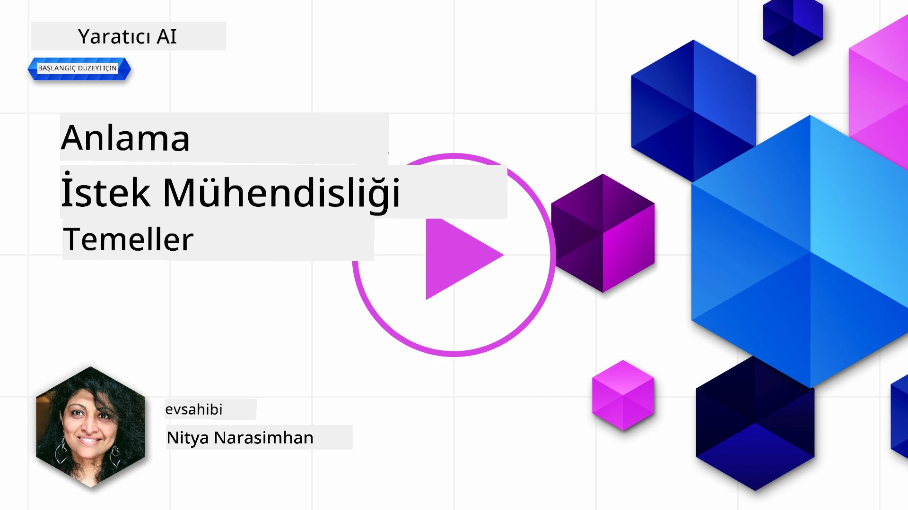
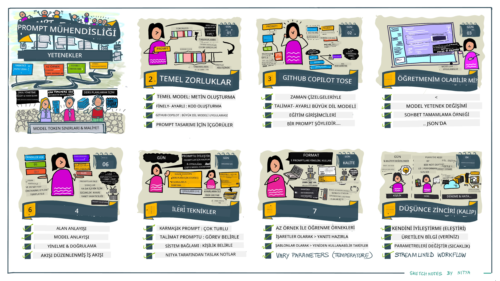
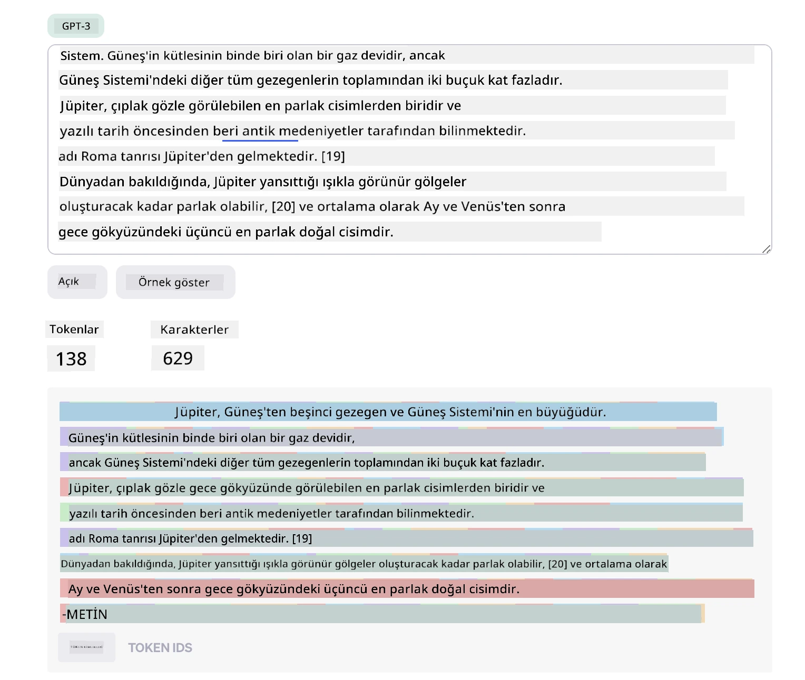
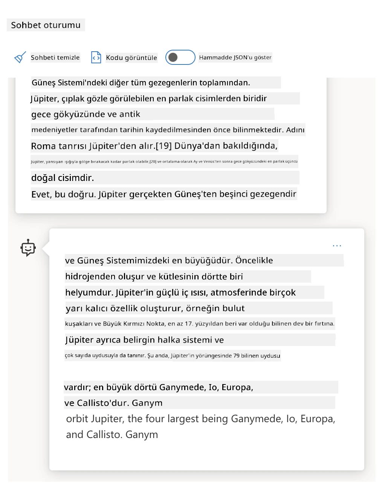
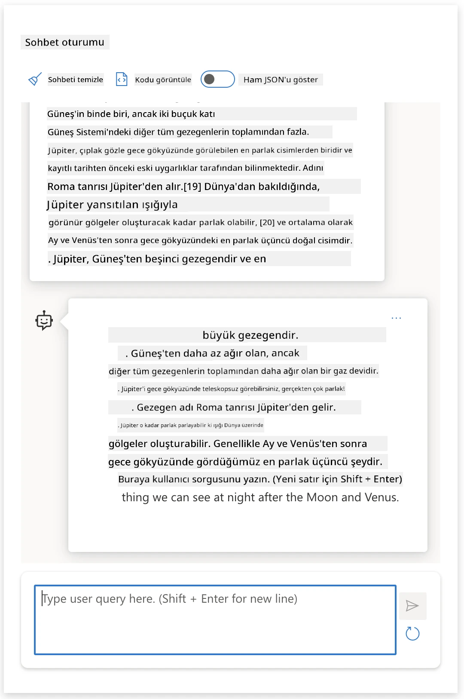
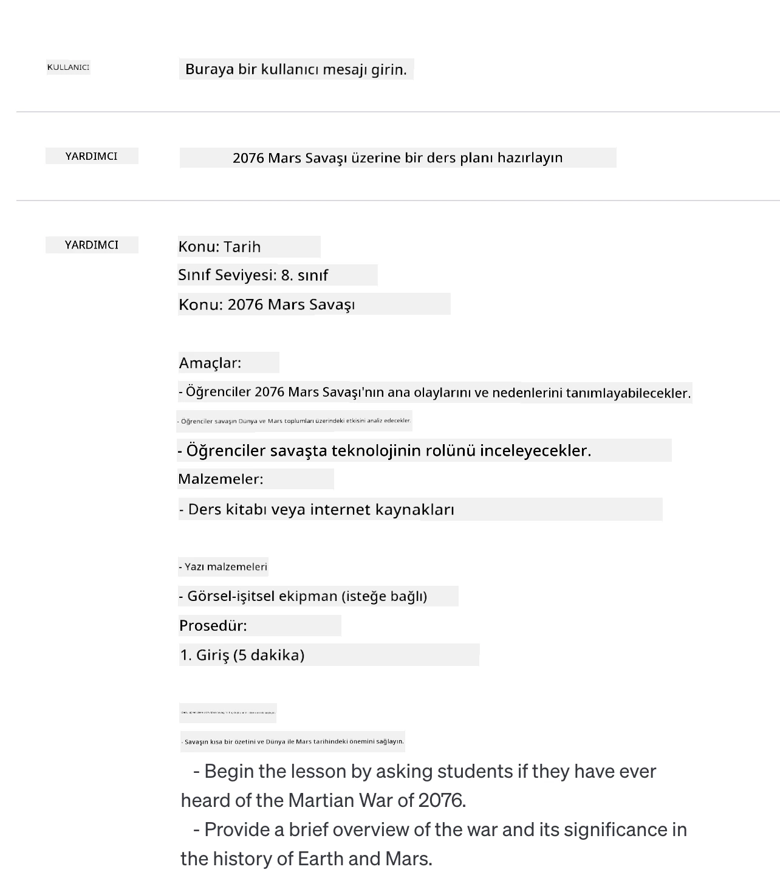
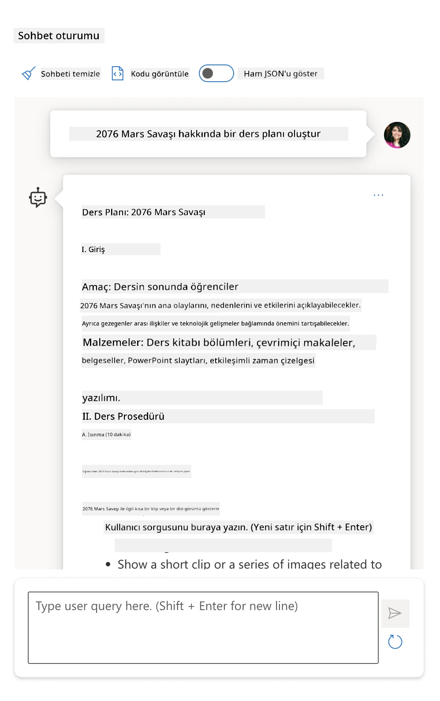
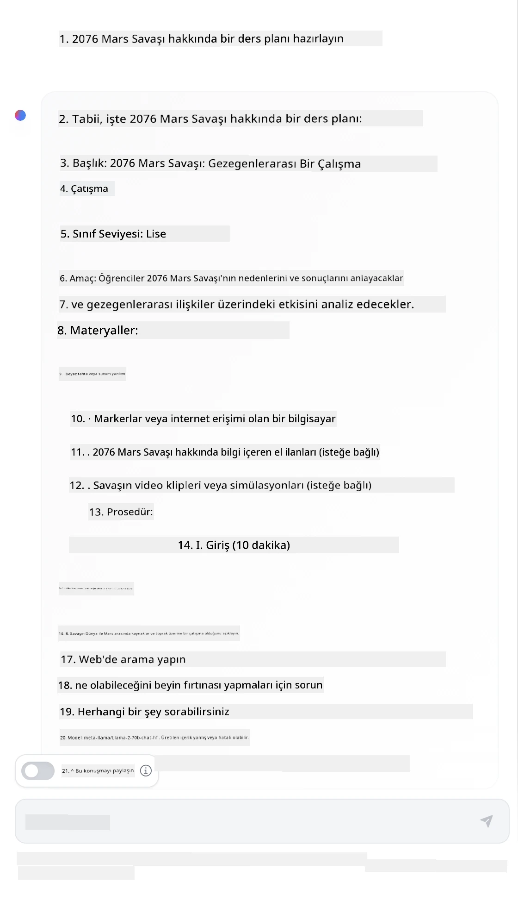

# Prompt Mühendisliğinin Temelleri

[](https://youtu.be/GElCu2kUlRs?si=qrXsBvXnCW12epb8)

## Giriş
Bu modül, üretken yapay zeka modellerinde etkili istemler oluşturmak için temel kavramları ve teknikleri kapsar. Bir LLM'ye (Büyük Dil Modeli) yazdığınız istem biçimi de önemlidir. Özenle hazırlanmış bir istem, daha kaliteli yanıtlar alabilir. Peki _istem_ ve _istem mühendisliği_ gibi terimler tam olarak ne anlama geliyor? Ve LLM'ye gönderdiğim istem _girdisini_ nasıl geliştirebilirim? Bu bölüm ve bir sonraki bölümde bu soruları yanıtlamaya çalışacağız.

_Uretken yapay zeka_, kullanıcı isteklerine yanıt olarak yeni içerikler (örneğin, metin, görsel, ses, kod vb.) oluşturabilir. Bunu, doğal dil ve kod kullanımı için eğitilmiş OpenAI’nin GPT (“Generative Pre-trained Transformer”) serisi gibi _Büyük Dil Modelleri_ (LLM’ler) kullanarak başarır.

Artık kullanıcılar herhangi bir teknik uzmanlık veya eğitim gerekmeden sohbet gibi tanıdık paradigmalarla bu modellerle etkileşime geçebilir. Modeller _istem tabanlıdır_ - kullanıcılar bir metin girişi (istem) gönderir, AI yanıtı (tamamlama) alır. Sonra yanıt beklentilerine uyana kadar istemlerini çok turda iteratif olarak "AI ile sohbet ederek" geliştirirler.

“İstemler” artık üretken AI uygulamaları için temel _programlama arayüzü_ haline gelmiştir; modellere ne yapacaklarını söyler ve dönen yanıtların kalitesini etkiler. "İstem Mühendisliği", ölçekli tutarlı ve kaliteli yanıtlar sunmak için istemlerin _tasarımı ve optimizasyonu_ üzerine odaklanan hızla büyüyen bir çalışma alanıdır.

## Öğrenme Hedefleri

Bu derste, İstem Mühendisliğinin ne olduğunu, neden önemli olduğunu ve belirli bir model ve uygulama amacı için daha etkili istemleri nasıl oluşturabileceğimizi öğreneceğiz. İstem mühendisliğinin temel kavramlarını ve en iyi uygulamalarını anlayacak - bu kavramların gerçek örneklere nasıl uygulandığını görebileceğimiz etkileşimli bir Jupyter Notebooks "kum havuzu" ortamını tanıyacağız.

Bu dersin sonunda:

1. İstem mühendisliğinin ne olduğunu ve neden önemli olduğunu açıklayabileceğiz.
2. Bir istemin bileşenlerini ve bunların nasıl kullanıldığını tanımlayabileceğiz.
3. İstem mühendisliği için en iyi uygulamaları ve teknikleri öğreneceğiz.
4. Öğrenilen teknikleri gerçek örneklere, OpenAI uç noktası kullanarak uygulayabileceğiz.

## Ana Terimler

İstem Mühendisliği: AI modellerinin istenen çıktılar üretmesini yönlendirmek için girdilerin tasarımı ve rafine edilmesi pratiği.  
Tokenizasyon: Metni, modelin anlayıp işlem yapabileceği daha küçük birimlere (token'lara) dönüştürme süreci.  
Talimatlarla İncelenmiş LLM’ler: Yanıt doğruluğu ve alaka düzeyini artırmak için belirli talimatlarla ince ayar yapılmış Büyük Dil Modelleri.

## Öğrenme Kum Havuzu

İstem mühendisliği şu anda daha çok sanat, bilimden çok sezgi gerektiren bir alandır. İçgörümüzü geliştirmek için en iyi yol, _daha fazla pratik yapmak_ ve uygulama alanı uzmanlığı ile önerilen teknikler ve modele özgü optimizasyonları birleştiren deneme-yanılma yaklaşımını benimsemektir.

Bu dersi tamamlayan Jupyter Notebook, öğrendiklerinizi uygulayabileceğiniz bir _kum havuzu_ ortamı sunar - ister ilerlerken ister ders sonundaki kod meydan okuması sırasında. Alıştırmaları çalıştırmak için:

1. **Bir Azure OpenAI API anahtarı** - dağıtılmış bir LLM için servis uç noktası.  
2. **Bir Python Çalışma Zamanı** - Notebook’un çalıştırılabileceği ortam.  
3. **Yerel Ortam Değişkenleri** - _hazırlık için şimdiden [KURULUM](./../00-course-setup/02-setup-local.md?WT.mc_id=academic-105485-koreyst) adımlarını tamamlayın_.

Notebook, _başlangıç_ alıştırmalarıyla gelir - ancak daha fazla örnek veya fikir denemek ve istem tasarımı için sezginizi geliştirmek adına kendi _Markdown_ (açıklama) ve _Kod_ (istem istekleri) bölümlerinizi eklemeniz teşvik edilir.

## Görselleştirilmiş Kılavuz

Bu dersin kapsadığı konuların genel görünümünü hızlıca kavramak ister misiniz? Bu görselleştirilmiş kılavuza göz atın; ana konuları ve her biri için düşünmeniz gereken önemli çıkarımları sunar. Ders yol haritası, temel kavramları ve zorlukları anlamaktan, bunları ilgili istem mühendisliği teknikleri ve en iyi uygulamalar ile ele almaya kadar götürür. Bu kılavuzdaki "İleri Teknikler" bölümü, bu müfredatın _sonraki_ bölümünde ele alınan içeriğe atıfta bulunur.



## Startup’ımız

Şimdi, _bu konu_nun eğitim alanında [yapay zeka yeniliğini getirmek](https://educationblog.microsoft.com/2023/06/collaborating-to-bring-ai-innovation-to-education?WT.mc_id=academic-105485-koreyst) misyonumuzla nasıl ilişkili olduğundan bahsedelim. _Kişiselleştirilmiş öğrenme_ odaklı AI destekli uygulamalar geliştirmek istiyoruz - öyleyse uygulamamızın farklı kullanıcılarının istemleri nasıl "tasarlayabileceğini" düşünelim:

- **Yöneticiler** AI’dan _müfredat verisini inceleyip kapsama alanındaki boşlukları tespit etmesini_ isteyebilir. AI sonuçları özetleyebilir veya kodla görselleştirebilir.  
- **Eğitimciler** AI’dan _hedef kitle ve konu için bir ders planı oluşturmasını_ talep edebilir. AI, belirtilen formatta kişiselleştirilmiş planı oluşturabilir.  
- **Öğrenciler** AI’dan _zor bir konuda rehberlik etmesini (özel ders vermesini)_ isteyebilir. AI artık öğrencileri seviyelerine uygun dersler, ipuçları ve örneklerle yönlendirebilir.

Bu sadece buzdağının görünen kısmı. Daha kapsamlı fikir edinmek için eğitim uzmanları tarafından düzenlenen açık kaynaklı bir istemler kütüphanesi olan [Prompts For Education](https://github.com/microsoft/prompts-for-edu/tree/main?WT.mc_id=academic-105485-koreyst) projesine göz atın! _İstemleri kum havuzunda veya OpenAI Playground’da çalıştırmayı deneyin, sonucu görün!_

<!--
DERS ŞABLONU:
Bu birimde temel kavram #1 işlenecek.
Kavram örneklerle ve referanslarla pekiştirilecek.

KAVRAM #1:
İstem Mühendisliği.
Tanımlayın ve neden gerekli olduğunu açıklayın.
-->

## İstem Mühendisliği Nedir?

Bu derse, bir uygulama amacı ve model için tutarlı ve kaliteli yanıtlar (tamalamalar) sağlamak üzere metin girişlerini (istemleri) _tasarlama ve optimize etme_ süreci olarak İstem Mühendisliği’ni tanımlayarak başladık. Bunu iki aşamalı bir süreç olarak düşünebiliriz:

- Verilen model ve amaç için başlangıç istemini _tasarlamak_  
- Yanıt kalitesini arttırmak için istemi yinelemeli olarak _iyileştirmek_

Bu, optimum sonucu elde etmek için kullanıcı sezgisini ve çabasını gerektiren zorunlu bir deneme-yanılma sürecidir. Peki neden önemlidir? Bu sorunun cevabı için önce üç kavramı anlamamız gerekir:

- _Tokenizasyon_ = modelin istemi "nasıl gördüğü"  
- _Temel LLM’ler_ = temel modelin bir istemi "nasıl işlediği"  
- _Talimatlarla İncelenmiş LLM’ler_ = modelin artık "görevleri nasıl görebileceği"

### Tokenizasyon

Bir LLM, istemleri farklı modellerin (veya model sürümlerinin) aynı istemi farklı şekillerde tokenleştirebildiği bir _token dizisi_ olarak görür. LLM’ler tokenler üzerinde eğitildiği için (ham metin değil), istemlerin nasıl tokenleştirildiği oluşturulan yanıtın kalitesini doğrudan etkiler.

Tokenizasyonun nasıl çalıştığına dair sezgi edinmek için aşağıdaki gibi araçları deneyin: [OpenAI Tokenizer](https://platform.openai.com/tokenizer?WT.mc_id=academic-105485-koreyst). İsteminizi kopyalayıp yapıştırın - boşluk karakterleri ve noktalama işaretlerinin nasıl işlendiğine dikkat edin. Bu örnek daha eski bir LLM’yi (GPT-3) gösteriyor; daha yeni modelle denerken farklı sonuçlar görebilirsiniz.



### Kavram: Temel Modeller

İstem tokenleştirildikten sonra, ["Temel LLM" (Base LLM)](https://blog.gopenai.com/an-introduction-to-base-and-instruction-tuned-large-language-models-8de102c785a6?WT.mc_id=academic-105485-koreyst) (veya temel model) işlevi, o dizideki bir sonraki tokenı tahmin etmektir. LLM’ler devasa metin veri kümeleri üzerinde eğitildiğinden, tokenlar arasındaki istatistiksel ilişkileri iyi bilir ve bu tahmini nispeten güvenle yapabilir. Ancak metindeki kelimelerin _anlamını_ anlamazlar; sadece "tamamlayabilecekleri" bir desen görürler. Kullanıcı müdahalesi veya önceden belirlenmiş bir koşul ile sonlandırılana kadar tahmin etmeye devam edebilirler.

İstem tabanlı tamamlama nasıl çalışır görmek ister misiniz? Yukarıdaki istemi Azure OpenAI Studio [_Chat Playground_](https://oai.azure.com/playground?WT.mc_id=academic-105485-koreyst) varsayılan ayarlarla girin. Sistem, istemleri bilgi talebi olarak ele alacak şekilde yapılandırmıştır; bu nedenle bu bağlama uygun bir tamamlama görmelisiniz.

Peki ya kullanıcı, belirli kriterlere veya görev hedefine uyan bir şey görmek isteseydi? İşte burada _talimatlarla ince ayar yapılmış_ LLM’ler devreye girer.



### Kavram: Talimatlarla İncelenmiş LLM’ler

Bir [Talimatlarla İncelenmiş LLM](https://blog.gopenai.com/an-introduction-to-base-and-instruction-tuned-large-language-models-8de102c785a6?WT.mc_id=academic-105485-koreyst), temel modelle başlar ve açık talimatlar içerebilen örnekler veya giriş/çıkış çiftleri (çok tur "mesajlar" gibi) ile ince ayar yapılır - AI da yanıtında bu talimatı izlemeye çalışır.

Bu, İnsan Geri Bildirimi ile Pekiştirmeli Öğrenme (RLHF) gibi teknikler kullanarak modeli _talimatları takip etmeye_ ve _geri bildirimden öğrenmeye_ yönlendirir, böylece daha pratik uygulamalara uygun ve kullanıcı amaçlarına daha alakalı yanıtlar üretir.

Deneyelim - yukarıdaki istemi gözden geçirin, ancak şimdi _sistem mesajını_ şu talimatla değiştirin:

> _Verilen içeriği ikinci sınıf öğrencisi için özetleyin. Sonucu 3-5 madde işaretli, tek bir paragraf olarak tutun._

Sonucun istenen hedef ve formata göre ayarlandığını göreceksiniz. Bir eğitimci bu yanıtı doğrudan o ders için slaytlarında kullanabilir.



## Neden İstem Mühendisliğine İhtiyacımız Var?

Artık istemlerin LLM’ler tarafından nasıl işlendiğini bildiğimize göre, neden istem mühendisliğine ihtiyacımız olduğunu konuşalım. Cevap, mevcut LLM’lerin, _güvenilir ve tutarlı tamamalara_ ulaşmayı, istem yapısı ve optimizasyonuna çaba harcamadan zorlaştıran birkaç zorluk barındırmasında yatar. Örneğin:

1. **Model yanıtları stokastiktir.** _Aynı istem_, farklı modeller veya sürümler ile farklı yanıtlar oluşturabilir. Hatta _aynı model_ ile farklı zamanlarda bile farklı sonuçlar üretebilir. _İstem mühendisliği teknikleri bu varyasyonları azaltmak için daha iyi kılavuzlar sağlar_.

1. **Modeller yanıt uydurabilir.** Modeller _büyük fakat sonlu_ veri kümeleriyle önceden eğitildiğinden, eğitim kapsamı dışındaki kavramlar hakkında bilgileri olmayabilir. Sonuç olarak, yanlış, hayali veya bilinen gerçeklerle doğrudan çelişen yanıtlar üretebilirler. _İstem mühendisliği teknikleri, örneğin AI’dan kaynak göstermek veya mantık yürütme istemek suretiyle bu uydurmaların tespiti ve azaltılmasına yardımcı olur_.

1. **Model yetenekleri değişkenlik gösterir.** Daha yeni modeller veya model kuşakları daha zengin yeteneklere sahip olur ancak maliyet ve karmaşıklık açısından kendine özgü özellikler ve dengeler getirir. _İstem mühendisliği, farklılıkları soyutlayarak ve model özel gereksinimlere ölçeklenebilir, sorunsuz biçimde uyum sağlayan en iyi uygulamalar geliştirmemizi sağlar_.

Bunu OpenAI veya Azure OpenAI Playground’da deneyelim:

- Farklı LLM dağıtımları (Ör. OpenAI, Azure OpenAI, Hugging Face) ile aynı istemi kullanın - varyasyonları gördünüz mü?  
- Aynı LLM dağıtımı (Ör. Azure OpenAI Playground) ile aynı istemi tekrarlı kullanın - bu varyasyonlar nasıl farklılaştı?

### Uydurmalar Örneği

Bu derste, LLM’lerin bazen eğitim sınırları veya diğer kısıtlamalar nedeniyle gerçek dışı bilgi üretmesi fenomeni için **"uydurma"** terimini kullanıyoruz. Popüler makalelerde veya araştırma makalelerinde buna _"halüsinasyonlar"_ denildiğine de şahit olmuş olabilirsiniz. Ancak davranışı insan-insanlaştırmamak için terim olarak _"uydurma"_ kullanmanızı şiddetle öneriyoruz. Bu, terim açısından [Sorumlu AI yönergelerini](https://www.microsoft.com/ai/responsible-ai?WT.mc_id=academic-105485-koreyst) destekler ve bazı bağlamlarda da saldırgan ya da dışlayıcı sayılabilecek terimleri çıkarır.

Uydurmaların nasıl çalıştığını kavramak ister misiniz? AI’ya eğitim veri kümesinde bulunmayan bir konu için içerik oluşturma talimatı verdiğinizi düşünün. Örneğin - şu istemi denedim:

> **İstem:** 2076 Mars Savaşı hakkında bir ders planı oluştur.
Bir web araması, Kızıl Gezegen savaşları hakkında kurgusal anlatımlar (örneğin, televizyon dizileri veya kitaplar) olduğunu gösterdi - ancak hiçbiri 2076 yılında değil. Sağduyu da bize 2076'nın _gelecekte_ olduğunu ve bu nedenle gerçek bir olayla ilişkilendirilemeyeceğini söylüyor.

Peki bu istemi farklı LLM sağlayıcıları ile çalıştırdığımızda ne olur?

> **Yanıt 1**: OpenAI Playground (GPT-35)



> **Yanıt 2**: Azure OpenAI Playground (GPT-35)



> **Yanıt 3**: : Hugging Face Chat Playground (LLama-2)



Beklendiği gibi, her model (veya model sürümü), stokastik davranış ve model kapasiteleri farklılıkları nedeniyle biraz farklı yanıtlar üretir. Örneğin, bir model 8. sınıf seviyesindeki bir kitleyi hedeflerken, diğeri lise öğrencisi varsaymaktadır. Ancak üç model de, bilgisiz bir kullanıcıyı olayın gerçek olduğuna inandırabilecek yanıtlar üretti.

_metaprompting_ ve _sıcaklık yapılandırması_ gibi istem mühendisliği teknikleri, model uydurmalarını bir dereceye kadar azaltabilir. Yeni istem mühendisliği _mimari_leri, bu etkileri hafifletmek veya azaltmak için yeni araçları ve teknikleri sorunsuzca istem akışına entegre etmektedir.

## Vaka Çalışması: GitHub Copilot

Bu bölümü, gerçek dünya çözümlerinde istem mühendisliğinin nasıl kullanıldığını anlamak için bir Vaka Çalışması ile tamamlayalım: [GitHub Copilot](https://github.com/features/copilot?WT.mc_id=academic-105485-koreyst).

GitHub Copilot, sizin "Yapay Zeka Eş Programcınız"dır - metin istemlerini kod tamlamalarına dönüştürür ve geliştirme ortamınıza (örneğin, Visual Studio Code) entegre edilerek kesintisiz bir kullanıcı deneyimi sunar. Aşağıdaki blog serisinde belgelenmiştir ki, en erken versiyon OpenAI Codex modeline dayanıyordu - mühendisler kısa sürede modeli ince ayar yapma ve kod kalitesini artırmak için daha iyi istem mühendisliği teknikleri geliştirme ihtiyacını fark ettiler. Temmuz ayında, [Codex'in ötesine geçen geliştirilmiş bir yapay zeka modeli](https://github.blog/2023-07-28-smarter-more-efficient-coding-github-copilot-goes-beyond-codex-with-improved-ai-model/?WT.mc_id=academic-105485-koreyst) duyurdular; böylece öneriler çok daha hızlı hale geldi.

Öğrenme yolculuklarını takip etmek için yazıları sırasıyla okuyun.

- **Mayıs 2023** | [GitHub Copilot Kodunuzu Anlama Konusunda Daha İyi Oluyor](https://github.blog/2023-05-17-how-github-copilot-is-getting-better-at-understanding-your-code/?WT.mc_id=academic-105485-koreyst)
- **Mayıs 2023** | [GitHub İçinde: GitHub Copilot Arkasındaki LLM'lerle Çalışmak](https://github.blog/2023-05-17-inside-github-working-with-the-llms-behind-github-copilot/?WT.mc_id=academic-105485-koreyst).
- **Haziran 2023** | [GitHub Copilot için Daha İyi İstemler Nasıl Yazılır](https://github.blog/2023-06-20-how-to-write-better-prompts-for-github-copilot/?WT.mc_id=academic-105485-koreyst).
- **Temmuz 2023** | [GitHub Copilot, Geliştirilmiş Yapay Zeka Modeli ile Codex'in Ötesine Geçiyor](https://github.blog/2023-07-28-smarter-more-efficient-coding-github-copilot-goes-beyond-codex-with-improved-ai-model/?WT.mc_id=academic-105485-koreyst)
- **Temmuz 2023** | [Geliştirici Rehberi: İstem Mühendisliği ve LLM'ler](https://github.blog/2023-07-17-prompt-engineering-guide-generative-ai-llms/?WT.mc_id=academic-105485-koreyst)
- **Eylül 2023** | [Kurumsal Bir LLM Uygulaması Nasıl İnşa Edilir: GitHub Copilot'tan Dersler](https://github.blog/2023-09-06-how-to-build-an-enterprise-llm-application-lessons-from-github-copilot/?WT.mc_id=academic-105485-koreyst)

Gerçek dünyadaki uygulamalar için bu modellerin ve tekniklerin nasıl _uygulandığını_ gösteren [mühendislik bloglarını](https://github.blog/category/engineering/?WT.mc_id=academic-105485-koreyst) da, [bu yazı gibi](https://github.blog/2023-09-27-how-i-used-github-copilot-chat-to-build-a-reactjs-gallery-prototype/?WT.mc_id=academic-105485-koreyst) okuyabilirsiniz.

---

<!--
DERS ŞABLONU:
Bu birim temel kavram #2'yi kapsamalıdır.
Kavram örnekler ve referanslarla pekiştirilir.

KAVRAM #2:
İstem Tasarımı.
Örneklerle açıklanmıştır.
-->

## İstem Oluşturma

İstem mühendisliğinin neden önemli olduğunu gördük - şimdi istemlerin nasıl _oluşturulduğunu_ anlayalım ki, daha etkili istem tasarımı için farklı teknikleri değerlendirebilelim.

### Temel İstem

Basit bir istem ile başlayalım: modele başka bir bağlam olmadan gönderilen bir metin girişi. Örneğin, US milli marşının ilk birkaç kelimesini OpenAI [Completion API](https://platform.openai.com/docs/api-reference/completions?WT.mc_id=academic-105485-koreyst) ‘ye gönderdiğimizde, model hemen yanıtı takip eden birkaç satırla _tamamlar_, temel tahmin davranışını gösterir.

| İstem (Giriş)     | Tamamlama (Çıkış)                                                                                                                        |
| :----------------- | :----------------------------------------------------------------------------------------------------------------------------------------- |
| Oh say can you see | ABD'nin milli marşı olan "The Star-Spangled Banner"ın sözlerini okumaya başladığınız anlaşılıyor. Tam metni şöyledir ... |

### Karmaşık İstem

Şimdi o temel isteme bağlam ve talimatlar ekleyelim. [Chat Completion API](https://learn.microsoft.com/azure/ai-services/openai/how-to/chatgpt?WT.mc_id=academic-105485-koreyst), karmaşık bir istemi şu şekildedir bir _mesajlar_ koleksiyonu olarak oluşturmamıza izin verir:

- _Kullanıcı_ girdisi ve _asistan_ yanıtını yansıtan giriş/çıkış çiftleri.
- Asistan davranışını veya kişiliğini belirleyen sistem mesajı.

İstek aşağıdaki biçimdedir; burada _tokenization_ bağlam ve sohbetten ilgili bilgileri etkili biçimde yakalar. Sistem bağlamını değiştirmek, verilen kullanıcı girdileri kadar tamamlama kalitesini etkileyebilir.

```python
response = openai.chat.completions.create(
    model="gpt-3.5-turbo",
    messages=[
        {"role": "system", "content": "You are a helpful assistant."},
        {"role": "user", "content": "Who won the world series in 2020?"},
        {"role": "assistant", "content": "The Los Angeles Dodgers won the World Series in 2020."},
        {"role": "user", "content": "Where was it played?"}
    ]
)
```

### Talimat İstemi

Yukarıdaki örneklerde, kullanıcı istemi bir bilgi talebi olarak yorumlanabilecek basit bir metin sorgusuydu. _Talimat_ istemi ile, metni yapay zekaya daha ayrıntılı bir görev belirtmek için kullanabilir ve daha iyi rehberlik sağlayabiliriz. İşte bir örnek:

| İstem (Giriş)                                                                                                                                                                                                                         | Tamamlama (Çıkış)                                                                                                        | Talimat Türü       |
| :------------------------------------------------------------------------------------------------------------------------------------------------------------------------------------------------------------------------------------- | :------------------------------------------------------------------------------------------------------------------------- | :------------------ |
| İç Savaş hakkında bir açıklama yaz                                                                                                                                                                                                   | _basit bir paragraf döndürdü_                                                                                             | Basit               |
| İç Savaş hakkında bir açıklama yaz. Önemli tarihleri ve olayları ver, bunların önemini açıkla                                                                                                                                          | _bir paragraf döndürdü ardından önemli olay tarihleri ve açıklamalarından oluşan bir liste_                                | Karmaşık             |
| İç Savaş hakkında 1 paragraf yaz. Başlıca tarihler ve önemleri ile 3 madde ver. Önemli tarihi kişiler ve katkıları için 3 madde daha ver. Çıktıyı JSON dosyası olarak ver | _daha kapsamlı detayları içeren bir metin kutusunda JSON biçiminde çıktı döndürür; dosyaya yapıştırıp doğrulayabilirsiniz_ | Karmaşık. Biçimlendirilmiş. |

## Birincil İçerik

Yukarıdaki örneklerde, istem oldukça açık uçluydu ve LLM önceden eğitilmiş veri kümesinin hangi kısmının ilgili olduğunu kendisi seçiyordu. _Birincil içerik_ tasarım deseni ile giriş metni iki parçaya ayrılır:

- bir talimat (eylem)
- eylemi etkileyen ilgili içerik

Örneğin, talimat "bunu 2 cümlede özetle" olabilir.

| İstem (Giriş)                                                                                                                                                                                                                                                                                                                                                                                                                                                                                                                                                                                                                                                                                      | Tamamlama (Çıkış)                                                                                                                                                                                                                                                                             |
| :-------------------------------------------------------------------------------------------------------------------------------------------------------------------------------------------------------------------------------------------------------------------------------------------------------------------------------------------------------------------------------------------------------------------------------------------------------------------------------------------------------------------------------------------------------------------------------------------------------------------------------------------------------------------------------------------------- | :---------------------------------------------------------------------------------------------------------------------------------------------------------------------------------------------------------------------------------------------------------------------------------------------- |
| Jüpiter Güneş'ten beşinci ve Güneş Sistemi'ndeki en büyük gezegendir. Bir gaz devidir, kütlesi Güneş'in binde biri kadar olmakla birlikte, Güneş Sistemi'ndeki diğer tüm gezegenlerin toplamının iki buçuk katıdır. Jüpiter, çıplak gözle gece gökyüzünde görülebilen en parlak cisimlerden biridir ve antik medeniyetler tarafından tarih öncesi kayıtlardan önce bilinmiştir. Roma tanrısı Jüpiter'in adını taşımaktadır.[19] Dünya'dan bakıldığında, Jüpiter yansıtılan ışığıyla görünür gölgeler oluşturacak kadar parlak olabilir,[20] ve ortalama olarak Ay ve Venüs'ten sonra gece gökyüzündeki üçüncü en parlak doğal cisimdir.<br/> **Bunu 2 kısa cümlede özetleyin** | Jüpiter, Güneş'ten beşinci gezegen olup Güneş Sistemi'nin en büyüğüdür ve gece gökyüzündeki en parlak nesnelerden biridir. Roma tanrısı Jüpiter'in adını taşıyan bu gaz devi, Güneş Sistemi'ndeki diğer tüm gezegenlerin toplam kütlesinin iki buçuk katıdır. |

Birincil içerik bölümü, daha etkili talimatlar vermek için çeşitli şekillerde kullanılabilir:

- **Örnekler** - modele kesin bir talimat vermek yerine, istenen çıktı örneklerini verip modellerden kalıbı çıkarmasını sağlamak.
- **İpuçları** - talimatı, modelin daha ilgili yanıtlar vermesi için tamamlayan “ipuçları” izler.
- **Şablonlar** - özel kullanım durumları için verilerle özelleştirilebilen yer tutucular (değişkenler) içeren tekrarlanabilir istem "tarifleri".

Bunları uygulamada inceleyelim.

### Örnek Kullanımı

Bu yöntemde, birincil içerik ile modele, bir talimat için istenen çıktının bazı örnekleri verilir ve modeli, istenen çıktının kalıbını çıkarmaya bırakırız. Verilen örnek sayısına bağlı olarak, sıfır-vuruş (zero-shot), tek-vuruş (one-shot), birkaç vuruş (few-shot) istemlendirme yapılabilir.

İstem artık üç bileşenden oluşur:

- Görev açıklaması
- İstenen çıktının birkaç örneği
- Yeni bir örneğin başlangıcı (örtük görev açıklaması olur)

| Öğrenme Türü | İstem (Giriş)                                                                                                                                        | Tamamlama (Çıkış)         |
| :------------ | :---------------------------------------------------------------------------------------------------------------------------------------------------- | :-------------------------- |
| Sıfır-vuruş  | "The Sun is Shining". İspanyolcaya çevir                                                                                                           | "El Sol está brillando".    |
| Tek-vuruş    | "The Sun is Shining" => "El Sol está brillando". <br> "It's a Cold and Windy Day" =>                                                                   | "Es un día frío y ventoso". |
| Several-shot | Oyuncu üsleri döndü => Beyzbol <br/> Oyuncu servis attı => Tenis <br/> Oyuncu servi aldı => Kriket <br/> Oyuncu smacı yaptı => | Basketbol                  |
|               |                                                                                                                                                       |                             |

Sıfır-vuruş istemlendirmede açık talimat vermek ("İspanyolcaya çevir") gerektiğine dikkat edin; tek-vuruş örnekte ise bu çıkarılır. Birkaç örnek verilmesi, modele ek talimat olmadan daha doğru çıkarım yapmasını sağlar.

### İstem İpuçları

Birincil içeriği kullanmanın bir diğer yolu, örnekler yerine _ipuçları_ vermektir. Bu durumda, modele istenen yanıt formatına uygun bir parçayla _başlayarak_ ufak bir işaret verilir. Model, bu işareti alıp o doğrultuda yanıtı devam ettirir.

| İpucu Sayısı | İstem (Giriş)                                                                                                                                                                                                                                                                                                                                                                                                                                               | Tamamlama (Çıkış)                                                                                                                                                                                                                                                                                       |
| :------------- | :----------------------------------------------------------------------------------------------------------------------------------------------------------------------------------------------------------------------------------------------------------------------------------------------------------------------------------------------------------------------------------------------------------------------------------------------------------- | :-------------------------------------------------------------------------------------------------------------------------------------------------------------------------------------------------------------------------------------------------------------------------------------------------------- |
| 0              | Jüpiter Güneş'ten beşinci gezegendir ve Güneş Sistemi'nin en büyüğüdür. Bir gaz devidir, kütlesi Güneş'in binde biri kadar olmakla birlikte, Güneş Sistemi'ndeki diğer tüm gezegenlerin toplamının iki buçuk katıdır. Jüpiter çıplak gözle gece gökyüzünde görülebilen en parlak nesnelerden biridir ve antik medeniyetlerce tarih öncesinden beri bilinir. <br/>**Bunu Özetle**                                       | Jüpiter, Güneş Sistemi'nin en büyük gezegenidir ve Güneş'ten beşincidir. Kütlesi Güneş'in binde biri olmasına rağmen, diğer tüm gezegenlerin toplamından daha ağırdır. Antik uygarlıklar tarafından uzun zamandır bilinmekte ve gece gökyüzünde kolayca görülebilmektedir. |
| 1              | Jüpiter, Güneş'ten beşinci gezegendir ve Güneş Sistemi'nin en büyüğüdür. Kütlesi Güneş'in binde biri olan bir gaz devidir, ancak diğer tüm gezegenlerin kütlesinin iki buçuk katıdır. Jüpiter, çıplak gözle gece gökyüzünde görülebilen en parlak nesnelerden biridir ve kayıtlı tarihi önceki antik medeniyetler tarafından bilinmektedir. <br/>**Bunu Özetle** <br/> Öğrendiklerimiz şudur ki Jüpiter | Güneş'ten beşinci gezegerdir ve Güneş Sistemi'nin en büyüğüdür. Kütlesi Güneş'in binde biri olan bir gaz devidir, ancak diğer tüm gezegenlerin birleşik kütlesinin iki buçuk katıdır. Kolayca çıplak gözle görülebilir ve antik çağlardan beri bilinmektedir.                        |
| 2              | Jüpiter, Güneş'ten beşinci gezegendir ve Güneş Sistemi'nin en büyüğüdür. Kütlesi Güneş'in binde biri olan bir gaz devidir, ancak diğer tüm gezegenlerin birleşik kütlesinin iki buçuk katıdır. Jüpiter, çıplak gözle gece gökyüzünde görülebilen en parlak nesnelerden biridir ve kayıtlı tarihi önceki antik medeniyetler tarafından bilinmektedir. <br/>**Bunu Özetle** <br/> Öğrendiğimiz En İyi 3 Gerçek:         | 1. Jüpiter, Güneş'ten beşinci gezegendir ve Güneş Sistemi'nin en büyüğüdür. <br/> 2. Kütlesi Güneş'in binde biri olan bir gaz devidir...<br/> 3. Jüpiter, antik çağlardan beri çıplak gözle görünmüştür ...                                                                       |
|                |                                                                                                                                                                                                                                                                                                                                                                                                                                                              |                                                                                                                                                                                                                                                                                                           |

### İstek Şablonları

Bir istek şablonu, _önceden tanımlanmış bir istek tarifi_ olup, gerektiğinde saklanıp yeniden kullanılabilir; böylece tutarlı kullanıcı deneyimlerini büyük ölçekte yönetir. En basit haliyle, kullanıcı ve sistem mesajlarını ve API tabanlı istek formatını içeren [OpenAI'nin şu örneği](https://platform.openai.com/examples?WT.mc_id=academic-105485-koreyst) gibi bir dizi örnekten oluşur.

Daha karmaşık bir formda, [LangChain'in şu örneği](https://python.langchain.com/docs/concepts/prompt_templates/?WT.mc_id=academic-105485-koreyst) gibi, çeşitli kaynaklardan (kullanıcı girişi, sistem bağlamı, harici veri kaynakları vb.) dinamik olarak istek oluşturmak için _yer tutucular_ içerir. Bu, tutarlı kullanıcı deneyimlerini **programatik olarak** ölçeklendirmek için yeniden kullanılabilir istekler kütüphanesi oluşturmamızı sağlar.

Son olarak, şablonların gerçek değeri, dikey uygulama alanları için _istek kütüphaneleri_ oluşturma ve yayımlama becerisinde yatar — bu şablonlar artık uygulamaya özgü bağlam ya da örneklerle _optimize edilmiştir_, böylece cevaplar hedef kullanıcı kitlesi için daha ilgili ve doğru olur. [Prompts For Edu](https://github.com/microsoft/prompts-for-edu?WT.mc_id=academic-105485-koreyst) deposu, eğitim alanı için ders planlama, müfredat tasarımı, öğrenci eğitimi gibi önemli hedeflere vurgu yaparak böyle bir yaklaşımın güzel bir örneğidir.

## Destekleyici İçerik

İstek oluşturmayı bir talimat (görev) ve hedef (birincil içerik) olarak düşünürsek, _ikincil içerik_ çıktı üzerinde **bir şekilde etki etmek** amacıyla sağlanan ek bağlam gibidir. Bu, ayarlama parametreleri, biçimlendirme talimatları, konu taksonomileri vb. olabilir; modelin yanıtını istenen kullanıcı hedeflerine uygun hale getirmesine yardımcı olur.

Örneğin: Müfredattaki tüm mevcut kurslar için kapsamlı meta veriler (isim, açıklama, seviye, etiketler, öğretmen vb.) içeren bir kurs kataloğu verildiğinde:

- "2023 Güz dönemi kurs kataloğunu özetle" şeklinde bir talimat belirleyebiliriz
- Birincil içerik olarak istenen çıktıdan birkaç örnek verebiliriz
- İkincil içerik olarak en çok ilgi gören 5 "etiketi" belirtebiliriz.

Model, birkaç örnekle gösterilen formatta bir özet sağlayabilir — ancak sonuçta birden fazla etiket varsa, ikincil içerikte belirtilen 5 etikete öncelik verebilir.

---

<!--
DERS ŞABLONU:
Bu ünitede temel kavram #1 ele alınmalıdır.
Kavram örnekler ve referanslarla pekiştirilmeli.

KAVRAM #3:
İstek Mühendisliği Teknikleri.
İstek mühendisliği için temel teknikler nelerdir?
Birkaç alıştırmayla örneklendir.
-->

## İstek Verme En İyi Uygulamaları

Artık isteklerin nasıl _oluşturulacağını_ bildiğimize göre, onları en iyi uygulamalarla _tasarlama_ konusunu düşünmeye başlayabiliriz. Bunu iki kısımda düşünebiliriz — doğru _bakış açısı_ ve doğru _tekniklerin_ uygulanması.

### İstek Mühendisliği Bakış Açısı

İstek Mühendisliği deneme-yanılma sürecidir, bu nedenle üç temel rehber faktörü aklınızda tutun:

1. **Alan Bilgisi Önemlidir.** Yanıtların doğruluğu ve ilgisi, o uygulamanın veya kullanıcının içinde bulunduğu _alana_ bağlıdır. İçgüdünüzü ve alan uzmanlığınızı kullanarak teknikleri **özelleştirin**. Örneğin, sistem isteklerinizde _alana özgü kişilikler_ tanımlayın, kullanıcı isteklerinde _alana özel şablonlar_ kullanın. Alan bağlamlarını yansıtan ikincil içerik sağlayın veya modeli aşina olduğu kalıplara yönlendirmek için _alana özgü ipuçları ve örnekler_ kullanın.

2. **Modeli Anlamak Önemlidir.** Modeller doğası gereği stokastiktir. Ama model uygulamaları kullandıkları eğitim veri setine (önceden eğitilmiş bilgi), sundukları yeteneklere (örneğin API veya SDK yoluyla) ve optimize edildikleri içerik türüne (örneğin kod, görsel veya metin) göre değişiklik gösterebilir. Kullandığınız modelin güçlü ve zayıf yönlerini anlayın ve bu bilgiyle _görev önceliklendirmesi_ yapın veya modelin yeteneklerine göre _özelleştirilmiş şablonlar_ oluşturun.

3. **Yineleme ve Doğrulama Önemlidir.** Modeller hızla gelişiyor ve istek mühendisliği teknikleri de öyle. Bir alan uzmanı olarak, genel topluluğa uymayabilecek başka bağlamlar veya kriterleriniz olabilir. İstek mühendisliği araçları ve tekniklerini kullanarak istek oluşturmayı "hızlandırın", sonra içgüdünüz ve uzmanlığınızla sonuçları yineleyin ve doğrulayın. İçgörülerinizi kaydedin ve başkalarının daha hızlı tekrarları için kullanabileceği bir **bilgi tabanı** (örneğin istek kütüphaneleri) oluşturun.

## En İyi Uygulamalar

Şimdi [OpenAI](https://help.openai.com/en/articles/6654000-best-practices-for-prompt-engineering-with-openai-api?WT.mc_id=academic-105485-koreyst) ve [Azure OpenAI](https://learn.microsoft.com/azure/ai-services/openai/concepts/prompt-engineering#best-practices?WT.mc_id=academic-105485-koreyst) uzmanlarının önerdiği yaygın en iyi uygulamalara göz atalım.

| Ne Yapmalı                        | Neden                                                                                                                                                                                                                                             |
| :-------------------------------- | :----------------------------------------------------------------------------------------------------------------------------------------------------------------------------------------------------------------------------------------------- |
| En yeni modelleri değerlendirin.  | Yeni model nesilleri muhtemelen geliştirilmiş özellikler ve kaliteye sahiptir — ancak maliyetleri de daha yüksek olabilir. Etkisini değerlendirin ve sonra geçiş kararları alın.                                                                    |
| Talimatları ve bağlamı ayırın.    | Model sağlayıcınızın talimatlar ile birincil ve ikincil içeriği daha net ayırmak için _sınırlandırıcılar_ tanımlayıp tanımlamadığını kontrol edin. Bu, modele tokenlara farklı ağırlıklar vermesinde yardımcı olur.                                  |
| Spesifik ve net olun.              | İstenilen bağlam, sonuç, uzunluk, format, stil vb. hakkında daha fazla detay verin. Bu yanıt kalitesini ve tutarlılığını artırır. Tarifleri yeniden kullanılabilir şablonlarda kaydedin.                                                          |
| Tanımlayıcı olun, örnekler kullanın | Modeller "göster ve anlat" yaklaşımına daha iyi yanıt verebilir. Önce `sıfır örnek` ile, yani sadece talimat verip örnek vermeden başlayın, sonra birkaç örnekle (few-shot) istediğiniz çıktıyı refinelayın. Benzetmeler kullanın.                |
| Tamamlama için ipuçları kullanın  | Modeli istenen sonuca doğru yönlendirmek için başlangıç kelime veya ifadeleri verin; bu onun yanıtına yön vermesinde kolaylık sağlar.                                                                                                             |
| Çift Katman Yapın                  | Bazen modeli tekrar etmeniz gerekebilir. Talimatları hem içerikten önce hem sonra verin, talimat ve ipucunu birlikte kullanın vb. Ne işe yaradığına dair yinelemeler yapın ve doğrulayın.                                                         |
| Sıra Önemlidir                    | Verilen bilgilerin modelde sunuluş sırası, çıkışı etkileyebilir; bu durum öğrenme örneklerinde bile geçerlidir (son bilgi önyargısı nedeniyle). Farklı seçenekleri deneyin.                                                                        |
| Modele "çıkış" yolu verin          | Modelin görevi tamamlayamadığı durumlar için bir _geri dönüş_ tamamlama yanıtı sağlayın. Bu, modelin yanlış veya uydurma yanıtlar verme olasılığını azaltabilir.                                                                                 |
|                                  |                                                                                                                                                                                                                                                   |

Her en iyi uygulamada olduğu gibi, _kendi deneyiminiz_ kullandığınız model, görev ve alana göre değişebilir. Bunları bir başlangıç noktası olarak alın ve size en uygun olanı bulana kadar yineleme yapın. Yeni model ve araçlar çıktıkça istek mühendisliği sürecinizi sürekli yeniden değerlendirin; ölçeklenebilir süreç ve yanıt kalitesine odaklanarak.

<!--
DERS ŞABLONU:
Bu ünitede bir kod alıştırması varsa sun.

ALGI:
Yalnızca kod yorumları içeren ve kod bölümleri boş olan bir Jupyter Notebook bağlantısı ver.

ÇÖZÜM:
İsteklerin doldurulup çalıştırıldığı o Notebook'un bir kopyasına bağlantı vererek örnek çıktı göster.
-->

## Ödev

Tebrikler! Dersin sonuna geldiniz! Şimdi bazı kavram ve teknikleri gerçek örneklerle test etme zamanı!

Ödevimiz için, etkileşimli tamamlayabileceğiniz alıştırmalar içeren bir Jupyter Notebook kullanacağız. Kendi Markdown ve Kod hücrelerinizi ekleyerek fikir ve teknikleri keşfedebilirsiniz.

### Başlamak için depoyu çatallayın, sonra

- (Önerilen) GitHub Codespaces'i başlatın
- (Alternatif) Depoyu yerel cihazınıza klonlayıp Docker Desktop ile kullanın
- (Alternatif) Tercih ettiğiniz Notebook çalışma ortamında açın.

### Sonra, ortam değişkenlerinizi yapılandırın

- Depo kökünde bulunan `.env.copy` dosyasını `.env` olarak kopyalayın ve `AZURE_OPENAI_API_KEY`, `AZURE_OPENAI_ENDPOINT` ve `AZURE_OPENAI_DEPLOYMENT` değerlerini doldurun. Daha fazla bilgi için [Öğrenme Sandbox bölümü](../../../04-prompt-engineering-fundamentals)'ne dönün.

### Sonra, Jupyter Notebook'u açın

- Çalışma zamanı kernelini seçin. 1. veya 2. seçenekleri kullanıyorsanız, geliştirici konteynerin sağladığı varsayılan Python 3.10.x kernelini seçmeniz yeterlidir.

Alıştırmaları çalıştırmaya hazırsınız. Burada _doğru ve yanlış_ cevaplar yoktur — sadece deneme-yanılma ile seçenekleri keşfedip, bir model ve uygulama alanında neyin işe yaradığını sezgisel olarak anlamaya çalışıyorsunuz.

_Bu nedenle derste Kod Çözüm segmentleri bulunmamakta. Bunun yerine, Notebook'ta "Çözümüm:" başlıklı Markdown hücreleri olacak ve referans için bir örnek çıktı gösterecek._

 <!--
DERS ŞABLONU:
Bölümü bir özet ve kendi kendine öğrenme kaynaklarıyla sar.

-->

## Bilgi kontrolü

Aşağıdakilerden hangisi makul en iyi uygulamalara uygun iyi bir istektir?

1. Bana kırmızı araba resmi göster
2. Bana kırmızı renkli, Volvo marka XC90 model, bir uçurum kenarında, güneş batarken park edilmiş bir araba resmi göster
3. Bana kırmızı renkli, Volvo marka XC90 model bir araba resmi göster

Cevap: 2, çünkü detaylar içeriyor ve "ne" sorusuna cevap veriyor, spesifik (sadece herhangi bir araba değil, belirli bir marka ve model) ve aynı zamanda genel ortamı tanımlıyor. 3. ise detay açısından ikinci en iyisidir.

## 🚀 Meydan Okuma

"Show me an image of red car of make Volvo and " cümlesini tamamlayarak ipucu (cue) tekniğini kullanabilir misiniz? Model nasıl yanıt veriyor ve bunu nasıl geliştirebilirsiniz?

## Harika İş! Öğrenmeye Devam Edin

Farklı İstek Mühendisliği kavramlarını daha fazla öğrenmek ister misiniz? Bu konuyla ilgili diğer harika kaynakları bulmak için [devam eden öğrenme sayfasına](https://aka.ms/genai-collection?WT.mc_id=academic-105485-koreyst) gidin.

İleri düzey istek tekniklerine bakacağımız 5. Derse gidin: [../05-advanced-prompts/README.md?WT.mc_id=academic-105485-koreyst]!

---

<!-- CO-OP TRANSLATOR DISCLAIMER START -->
**Feragatname**:
Bu belge, AI çeviri hizmeti [Co-op Translator](https://github.com/Azure/co-op-translator) kullanılarak çevrilmiştir. Doğruluk için çaba gösterilmekle birlikte, otomatik çevirilerin hatalar veya yanlışlıklar içerebileceğini lütfen unutmayınız. Orijinal belge, kendi dilinde yetkili kaynak olarak kabul edilmelidir. Kritik bilgiler için profesyonel insan çevirisi önerilir. Bu çevirinin kullanımı sonucu oluşabilecek yanlış anlamalar veya yanlış yorumlamalar için sorumluluk kabul edilmemektedir.
<!-- CO-OP TRANSLATOR DISCLAIMER END -->