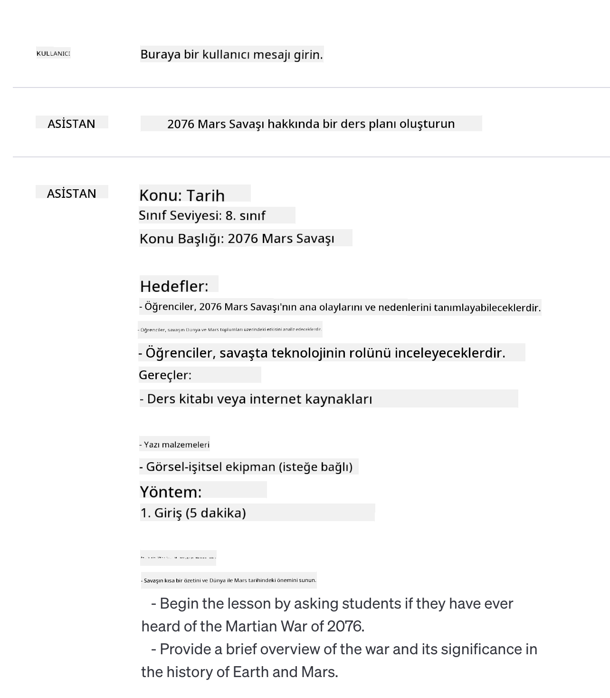

<!--
CO_OP_TRANSLATOR_METADATA:
{
  "original_hash": "dcbaaae026cb50fee071e690685b5843",
  "translation_date": "2025-08-26T16:51:31+00:00",
  "source_file": "04-prompt-engineering-fundamentals/README.md",
  "language_code": "tr"
}
-->
# Prompt Mühendisliğinin Temelleri

[](https://aka.ms/gen-ai-lesson4-gh?WT.mc_id=academic-105485-koreyst)

## GiriÅŸ
Bu modül, üretken yapay zeka modellerinde etkili istemler oluşturmak için temel kavramları ve teknikleri kapsar. Bir LLM'ye yazdığınız istemin şekli de önemlidir. Özenle hazırlanmış bir istem, daha kaliteli yanıtlar alınmasını sağlar. Peki, _prompt_ ve _prompt engineering_ gibi terimler tam olarak ne anlama geliyor? Ve LLM'ye gönderdiğim istem _girdisini_ nasıl geliştirebilirim? Bu bölümde ve bir sonrakinde bu sorulara yanıt arayacağız.

_Üretken Yapay Zeka_, kullanıcı isteklerine yanıt olarak yeni içerikler (ör. metin, görsel, ses, kod vb.) oluşturabilir. Bunu, doğal dil ve kod kullanımı için eğitilmiş OpenAI'nin GPT ("Generative Pre-trained Transformer") serisi gibi _Büyük Dil Modelleri_ ile başarır.

Kullanıcılar artık bu modellere sohbet gibi tanıdık yöntemlerle, herhangi bir teknik bilgiye veya eğitime ihtiyaç duymadan erişebiliyor. Modeller _istem tabanlı_ çalışır - kullanıcılar bir metin girişi (prompt) gönderir ve yapay zekadan bir yanıt (tamamlama) alır. Ardından, "yapay zekayla sohbet" ederek, çoklu adımlı konuşmalarla, istemlerini istedikleri yanıtı alana kadar geliştirebilirler.

"İstemler" artık üretken yapay zeka uygulamaları için birincil _programlama arayüzü_ haline geldi; modellere ne yapacaklarını söyler ve dönen yanıtların kalitesini etkiler. "Prompt Engineering" ise, ölçekli ve kaliteli yanıtlar almak için istemlerin _tasarımı ve optimizasyonuna_ odaklanan hızla büyüyen bir çalışma alanıdır.

## Öğrenme Hedefleri

Bu derste, Prompt Engineering'in ne olduğunu, neden önemli olduğunu ve belirli bir model ve uygulama amacı için daha etkili istemleri nasıl oluşturabileceğimizi öğreneceğiz. Prompt engineering için temel kavramları ve en iyi uygulamaları anlayacağız - ve bu kavramların gerçek örneklerde nasıl uygulandığını görebileceğimiz etkileşimli bir Jupyter Notebooks "oyun alanı" ortamını tanıyacağız.

Bu dersin sonunda şunları yapabileceğiz:

1. Prompt engineering'in ne olduğunu ve neden önemli olduğunu açıklayabilmek.
2. Bir istemin bileşenlerini ve nasıl kullanıldıklarını tanımlayabilmek.
3. Prompt engineering için en iyi uygulamaları ve teknikleri öğrenmek.
4. Öğrenilen teknikleri, bir OpenAI uç noktası kullanarak gerçek örneklerde uygulamak.

## Temel Terimler

Prompt Engineering: Yapay zeka modellerini istenen çıktılara yönlendirmek için girdileri tasarlama ve iyileştirme uygulamasıdır.
Tokenization: Metni, modelin anlayıp işleyebileceği daha küçük birimlere (tokenlara) dönüştürme sürecidir.
Instruction-Tuned LLMs: Belirli talimatlarla yanıt doğruluğu ve alaka düzeyi artırılmış şekilde ince ayar yapılmış Büyük Dil Modelleridir (LLM).

## Öğrenme Oyun Alanı

Prompt engineering şu anda bilimden çok bir sanattır. Bu konuda sezgimizi geliştirmek için en iyi yol, _daha fazla pratik yapmak_ ve uygulama alanı uzmanlığını önerilen teknikler ve modele özel optimizasyonlarla birleştiren deneme-yanılma yaklaşımını benimsemektir.

Bu derse eşlik eden Jupyter Notebook, öğrendiklerinizi _hemen uygulayabileceğiniz_ bir oyun alanı sunar - ister ilerledikçe ister bölüm sonundaki kod meydan okuması kapsamında. Alıştırmaları çalıştırmak için şunlara ihtiyacınız olacak:

1. **Bir Azure OpenAI API anahtarı** - dağıtılmış bir LLM için servis uç noktası.
2. **Bir Python Çalışma Zamanı** - Notebook'un çalıştırılabileceği bir ortam.
3. **Yerel Ortam Değişkenleri** - _hazırlık için şimdi [KURULUM](./../00-course-setup/02-setup-local.md?WT.mc_id=academic-105485-koreyst) adımlarını tamamlayın_.

Notebook, _başlangıç_ alıştırmalarıyla gelir - ancak daha fazla örnek veya fikir denemek ve istem tasarımı konusunda sezginizi geliştirmek için kendi _Markdown_ (açıklama) ve _Kod_ (prompt istekleri) bölümlerinizi eklemeniz teşvik edilir.

## İllüstrasyonlu Rehber

Derse başlamadan önce neleri kapsadığını genel hatlarıyla görmek ister misiniz? Bu illüstrasyonlu rehbere göz atın; ana başlıkları ve her birinde düşünmeniz gereken temel çıkarımları özetliyor. Dersin yol haritası, temel kavramları ve zorlukları anlamaktan başlayıp, bunları ilgili prompt engineering teknikleri ve en iyi uygulamalarla ele almaya kadar uzanıyor. Bu rehberdeki "İleri Teknikler" bölümü, bu müfredatın _bir sonraki_ bölümünde ele alınan içeriğe atıfta bulunur.


## GiriÅŸimimiz

Åimdi, _bu konunun_ [eÄŸitime yapay zeka inovasyonu getirme](https://educationblog.microsoft.com/2023/06/collaborating-to-bring-ai-innovation-to-education?WT.mc_id=academic-105485-koreyst) misyonumuzla nasıl iliÅŸkili olduÄŸundan bahsedelim. _KiÅŸiselleÅŸtirilmiÅŸ öğrenme_ için yapay zeka destekli uygulamalar geliÅŸtirmek istiyoruz - peki uygulamamızın farklı kullanıcıları istemleri nasıl "tasarlayabilir", düşünelim:

- **Yöneticiler**, yapay zekadan _müfredat verilerini analiz ederek kapsama alanındaki boşlukları tespit etmesini_ isteyebilir. Yapay zeka sonuçları özetleyebilir veya kodla görselleştirebilir.
- **Eğitmenler**, yapay zekadan _belirli bir hedef kitle ve konu için ders planı oluşturmasını_ isteyebilir. Yapay zeka, istenen formatta kişiselleştirilmiş bir plan hazırlayabilir.
- **Öğrenciler**, yapay zekadan _zorlandıkları bir konuda kendilerine özel ders vermesini_ isteyebilir. Yapay zeka, seviyelerine uygun dersler, ipuçları ve örneklerle öğrencilere rehberlik edebilir.

Bunlar sadece buzdağının görünen kısmı. [Prompts For Education](https://github.com/microsoft/prompts-for-edu/tree/main?WT.mc_id=academic-105485-koreyst) - eğitim uzmanları tarafından hazırlanmış açık kaynaklı bir istem kütüphanesine göz atın - olasılıkların ne kadar geniş olduğunu göreceksiniz! _Bu istemlerden bazılarını oyun alanında veya OpenAI Playground'da çalıştırarak neler olacağını deneyin!_

<!--
DERS ÅABLONU:
Bu birim temel kavram #1'i kapsamalı.
Kavramı örnekler ve referanslarla pekiştirin.

KAVRAM #1:
Prompt Engineering.
Tanımlayın ve neden gerekli olduğunu açıklayın.
-->

## Prompt Engineering Nedir?

Bu derse, **Prompt Engineering**'i belirli bir uygulama amacı ve model için tutarlı ve kaliteli yanıtlar (tamamlamalar) almak üzere metin girdilerini (promptları) _tasarlama ve optimize etme_ süreci olarak tanımlayarak başladık. Bunu iki adımlı bir süreç olarak düşünebiliriz:

- Belirli bir model ve amaç için ilk istemi _tasarlamak_
- Yanıtın kalitesini artırmak için istemi _tekrarlı olarak iyileştirmek_

Bu, en iyi sonuçları almak için kullanıcı sezgisi ve çabası gerektiren bir deneme-yanılma sürecidir. Peki neden önemlidir? Bu soruyu yanıtlamak için önce üç kavramı anlamamız gerekir:

- _Tokenization_ = modelin istemi nasıl "gördüğü"
- _Base LLMs_ = temel modelin bir istemi nasıl "işlediği"
- _Instruction-Tuned LLMs_ = modelin artık "görevleri" nasıl görebildiği

### Tokenization

Bir LLM, istemleri _token dizisi_ olarak görür ve farklı modeller (veya model sürümleri) aynı istemi farklı şekillerde tokenlara ayırabilir. LLM'ler tokenlar üzerinde eğitildiğinden (ham metin üzerinde değil), istemlerin nasıl tokenlara ayrıldığı, üretilen yanıtın kalitesini doğrudan etkiler.

Tokenization'ın nasıl çalıştığına dair sezgi kazanmak için aşağıda gösterilen [OpenAI Tokenizer](https://platform.openai.com/tokenizer?WT.mc_id=academic-105485-koreyst) gibi araçları deneyin. İsteminizi kopyalayın - ve bunun tokenlara nasıl dönüştüğüne bakın, boşluk karakterleri ve noktalama işaretlerinin nasıl ele alındığına dikkat edin. Bu örneğin eski bir LLM'yi (GPT-3) gösterdiğini unutmayın - daha yeni bir modelle denediğinizde farklı bir sonuç alabilirsiniz.


### Kavram: Temel Modeller

Bir istem tokenlara ayrıldıktan sonra, ["Base LLM"](https://blog.gopenai.com/an-introduction-to-base-and-instruction-tuned-large-language-models-8de102c785a6?WT.mc_id=academic-105485-koreyst) (veya Temel model) ana işlevi, o dizideki bir sonraki tokenı tahmin etmektir. LLM'ler devasa metin veri setleriyle eğitildiğinden, tokenlar arasındaki istatistiksel ilişkileri iyi bilir ve bu tahmini belirli bir güvenle yapabilir. Ancak, istemdeki veya tokenlardaki kelimelerin _anlamını_ bilmezler; sadece bir sonraki tahminleriyle "tamamlayabilecekleri" bir desen görürler. Kullanıcı müdahalesiyle veya önceden belirlenmiş bir koşulla durdurulana kadar diziyi tahmin etmeye devam edebilirler.

Prompt tabanlı tamamlamanın nasıl çalıştığını görmek ister misiniz? Yukarıdaki istemi Azure OpenAI Studio [_Chat Playground_](https://oai.azure.com/playground?WT.mc_id=academic-105485-koreyst)'a varsayılan ayarlarla girin. Sistem, istemleri bilgi talebi olarak ele alacak şekilde yapılandırılmıştır - bu nedenle bu bağlamı karşılayan bir tamamlama görmelisiniz.

Peki ya kullanıcı, belirli bir kriteri veya görev amacını karşılayan bir şey görmek isterse? İşte burada _instruction-tuned_ LLM'ler devreye giriyor.


### Kavram: Instruction Tuned LLMs

[Instruction Tuned LLM](https://blog.gopenai.com/an-introduction-to-base-and-instruction-tuned-large-language-models-8de102c785a6?WT.mc_id=academic-105485-koreyst), temel modelle başlar ve örnekler veya giriş/çıkış çiftleriyle (ör. çok adımlı "mesajlar") ince ayar yapılır; bu çiftler net talimatlar içerebilir - ve yapay zekadan gelen yanıt bu talimatı izlemeye çalışır.

Bu, modele _talimatları takip etmeyi_ ve _geri bildirimden öğrenmeyi_ öğretebilen İnsan Geri Bildirimiyle Pekiştirmeli Öğrenme (RLHF) gibi teknikler kullanır; böylece pratik uygulamalara daha uygun ve kullanıcı hedefleriyle daha alakalı yanıtlar üretir.

Hadi deneyelim - yukarıdaki istemi tekrar kullanın, ancak şimdi _sistem mesajını_ şu talimatı içerecek şekilde değiştirin:

> _Size verilen içeriği ikinci sınıf bir öğrenci için özetleyin. Sonucu bir paragraf ve 3-5 madde halinde tutun._

Sonucun artık istenen hedef ve formata göre ayarlandığını görebiliyor musunuz? Bir eğitmen bu yanıtı doğrudan o sınıf için slaytlarında kullanabilir.


## Neden Prompt Engineering'e İhtiyacımız Var?

Artık istemlerin LLM'ler tarafından nasıl işlendiğini bildiğimize göre, _neden_ prompt engineering'e ihtiyacımız olduğundan bahsedelim. Bunun nedeni, mevcut LLM'lerin, _güvenilir ve tutarlı tamamlamalar_ elde etmeyi, istemin oluşturulması ve optimize edilmesine çaba harcamadan daha zor hale getiren bir dizi zorluk barındırmasıdır. Örneğin:

1. **Model yanıtları rastlantısaldır.** _Aynı istem_, farklı modeller veya model sürümleriyle muhtemelen farklı yanıtlar üretecektir. Hatta _aynı modelle_ farklı zamanlarda bile farklı sonuçlar alınabilir. _Prompt engineering teknikleri, daha iyi sınırlar sağlayarak bu varyasyonları en aza indirmemize yardımcı olabilir_.

1. **Modeller yanıt uydurabilir.** Modeller, _büyük ama sonlu_ veri setleriyle önceden eğitildiğinden, bu eğitim kapsamı dışındaki kavramlar hakkında bilgiye sahip değildir. Sonuç olarak, yanlış, hayali veya bilinen gerçeklerle doğrudan çelişen tamamlamalar üretebilirler. _Prompt engineering teknikleri, kullanıcıların bu tür uydurmaları tespit edip azaltmasına yardımcı olur; örneğin, yapay zekadan kaynak veya gerekçe istemek gibi_.

1. **Modellerin yetenekleri değişkenlik gösterir.** Daha yeni modeller veya model nesilleri daha zengin yeteneklere sahip olur, ancak maliyet ve karmaşıklık açısından kendilerine özgü farklılıklar ve ödünler de getirir. _Prompt engineering, farklılıkları soyutlayan ve modele özel gereksinimlere ölçeklenebilir, sorunsuz şekilde uyum sağlayan en iyi uygulamalar ve iş akışları geliştirmemize yardımcı olabilir_.

Bunu OpenAI veya Azure OpenAI Playground'da uygulamalı olarak görelim:

- Aynı istemi farklı LLM dağıtımlarıyla kullanın (ör. OpenAI, Azure OpenAI, Hugging Face) - farklılıkları görebildiniz mi?
- Aynı istemi _aynı_ LLM dağıtımıyla tekrar tekrar kullanın (ör. Azure OpenAI playground) - bu varyasyonlar nasıl farklılaştı?

### Uydurma (Fabrication) Örneği

Bu derste, LLM'lerin eğitimlerindeki sınırlamalar veya diğer kısıtlamalar nedeniyle bazen gerçeğe aykırı bilgi üretmesi olgusuna **"uydurma"** diyoruz. Bunu popüler makalelerde veya araştırma makalelerinde _"halüsinasyon"_ olarak da duymuş olabilirsiniz. Ancak, makine kaynaklı bir sonuca insan benzeri bir özellik atfetmemek için _"uydurma"_ terimini kullanmanızı öneriyoruz. Bu, [Sorumlu Yapay Zeka yönergelerini](https://www.microsoft.com/ai/responsible-ai?WT.mc_id=academic-105485-koreyst) terminoloji açısından da destekler; bazı bağlamlarda saldırgan veya kapsayıcı olmayan terimler de böylece kaldırılmış olur.

Uydurmaların nasıl çalıştığını görmek ister misiniz? Yapay zekaya, eğitim veri setinde bulunmayan hayali bir konu için içerik üretmesini isteyen bir istem düşünün. Örneğin - ben şu istemi denedim:
> **İpucu:** 2076 Mars Savaşı hakkında bir ders planı oluşturun.

# 2076 Mars Savaşı Ders Planı

## Dersin Amacı
Öğrenciler, 2076 yılında Mars'ta gerçekleşen savaşı, nedenlerini, sonuçlarını ve insanlık üzerindeki etkilerini analiz edecekler.

## Hedefler
- Mars Savaşı'nın arka planını ve nedenlerini açıklayabilmek
- Savaşın önemli olaylarını sıralayabilmek
- Savaşın sonuçlarını ve Mars'taki yaşam üzerindeki etkilerini değerlendirebilmek
- Farklı bakış açılarını tartışabilmek

## Gerekli Materyaller
- 2076 Mars Savaşı kronolojisi
- Haritalar ve görseller
- Tartışma soruları
- Video ve makale kaynakları

## Dersin Akışı

### 1. GiriÅŸ (10 dakika)
- Öğretmen, Mars Savaşı'nın kısa bir özetini sunar.
- Öğrencilere Mars'ta neden bir savaş çıkmış olabileceği sorulur.

### 2. Arka Plan ve Nedenler (15 dakika)
- Mars'taki koloniler arasındaki gerilimler ve kaynak sıkıntısı tartışılır.
- Savaşın başlamasına yol açan olaylar anlatılır.

### 3. Savaşın Kronolojisi (20 dakika)
- Önemli savaşlar, stratejiler ve liderler üzerinde durulur.
- Haritalar ve görsellerle savaşın gelişimi gösterilir.

### 4. Sonuçlar ve Etkiler (15 dakika)
- Savaşın Mars'taki toplumsal ve politik yapıya etkileri incelenir.
- Dünya ile Mars arasındaki ilişkilerdeki değişiklikler tartışılır.

### 5. Tartışma ve Değerlendirme (20 dakika)
- Öğrenciler, savaşın kaçınılmaz olup olmadığını tartışır.
- Farklı gruplar, savaştan sonra Mars'ta barışın nasıl sağlanabileceği üzerine fikirler üretir.

## DeÄŸerlendirme
- Kısa bir yazılı sınav veya sunum ile öğrencilerin konuyu ne kadar anladıkları ölçülür.
- Grup tartışmalarına katılım değerlendirilir.

## Ek Kaynaklar
- 2076 Mars Savaşı ile ilgili makaleler ve belgeseller
- Mars kolonilerinin tarihçesi
- Savaş sonrası Mars'ta yaşam üzerine analizler

---

> **Yorum:** Bu ders planı, öğrencilerin 2076 Mars Savaşı'nı kapsamlı bir şekilde anlamalarını ve farklı bakış açıları geliştirmelerini amaçlamaktadır.
Bir web araması, Mars savaşlarıyla ilgili kurgusal anlatımların (örneğin, televizyon dizileri veya kitaplar) olduğunu gösterdi – fakat 2076 yılında geçen bir hikaye yok. Mantık da bize 2076'nın _gelecekte_ olduğunu ve dolayısıyla gerçek bir olayla ilişkilendirilemeyeceğini söylüyor.

Peki bu istemi farklı LLM sağlayıcılarıyla çalıştırdığımızda ne oluyor?

> **Yanıt 1**: OpenAI Playground (GPT-35)



> **Yanıt 2**: Azure OpenAI Playground (GPT-35)


> **Yanıt 3**: : Hugging Face Chat Playground (LLama-2)


Beklendiği gibi, her model (veya model sürümü) stokastik davranış ve model yeteneklerindeki farklılıklar sayesinde biraz farklı yanıtlar üretiyor. Örneğin, bir model 8. sınıf seviyesindeki bir kitleyi hedeflerken, diğeri lise öğrencisi varsayabiliyor. Ancak üç model de, bilgisi olmayan bir kullanıcıyı olayın gerçek olduğuna ikna edebilecek yanıtlar üretti.

_Metaprompting_ ve _sıcaklık ayarı_ gibi istem mühendisliği teknikleri, modelin uydurma yanıtlarını bir ölçüde azaltabilir. Yeni istem mühendisliği _mimari_ yaklaşımları ise, bu tür etkileri azaltmak veya önlemek için yeni araç ve teknikleri istem akışına sorunsuzca entegre ediyor.

## Vaka Çalışması: GitHub Copilot

Bu bölümü, istem mühendisliğinin gerçek dünyadaki çözümlerde nasıl kullanıldığını gösteren bir Vaka Çalışması ile tamamlayalım: [GitHub Copilot](https://github.com/features/copilot?WT.mc_id=academic-105485-koreyst).

GitHub Copilot, sizin "Yapay Zeka Eş Programcınız"dır – metin istemlerini kod tamamlama önerilerine dönüştürür ve geliştirme ortamınıza (örneğin, Visual Studio Code) entegre edilerek kesintisiz bir kullanıcı deneyimi sunar. Aşağıdaki blog serisinde belirtildiği gibi, en erken sürüm OpenAI Codex modeline dayanıyordu – mühendisler kısa sürede modeli ince ayar yapma ve daha iyi istem mühendisliği teknikleri geliştirme ihtiyacını fark etti, böylece kod kalitesini artırdılar. Temmuz ayında, [Codex'in ötesine geçen geliştirilmiş bir yapay zeka modeliyle](https://github.blog/2023-07-28-smarter-more-efficient-coding-github-copilot-goes-beyond-codex-with-improved-ai-model/?WT.mc_id=academic-105485-koreyst) daha hızlı öneriler sunmaya başladılar.

Öğrenme yolculuklarını takip etmek için gönderileri sırayla okuyun.

- **Mayıs 2023** | [GitHub Copilot Kodunuzu Daha İyi Anlamaya Başlıyor](https://github.blog/2023-05-17-how-github-copilot-is-getting-better-at-understanding-your-code/?WT.mc_id=academic-105485-koreyst)
- **Mayıs 2023** | [GitHub'ın İçinden: GitHub Copilot'ın Arkasındaki LLM'lerle Çalışmak](https://github.blog/2023-05-17-inside-github-working-with-the-llms-behind-github-copilot/?WT.mc_id=academic-105485-koreyst).
- **Haziran 2023** | [GitHub Copilot için Daha İyi İstemler Nasıl Yazılır](https://github.blog/2023-06-20-how-to-write-better-prompts-for-github-copilot/?WT.mc_id=academic-105485-koreyst).
- **Temmuz 2023** | [.. GitHub Copilot, geliştirilmiş yapay zeka modeliyle Codex'in ötesine geçiyor](https://github.blog/2023-07-28-smarter-more-efficient-coding-github-copilot-goes-beyond-codex-with-improved-ai-model/?WT.mc_id=academic-105485-koreyst)
- **Temmuz 2023** | [Geliştiriciler için İstem Mühendisliği ve LLM Rehberi](https://github.blog/2023-07-17-prompt-engineering-guide-generative-ai-llms/?WT.mc_id=academic-105485-koreyst)
- **Eylül 2023** | [Kurumsal LLM Uygulaması Nasıl Kurulur: GitHub Copilot'tan Dersler](https://github.blog/2023-09-06-how-to-build-an-enterprise-llm-application-lessons-from-github-copilot/?WT.mc_id=academic-105485-koreyst)

Ayrıca, bu modellerin ve tekniklerin gerçek dünya uygulamalarında nasıl _kullanıldığını_ gösteren [şu gönderi](https://github.blog/2023-09-27-how-i-used-github-copilot-chat-to-build-a-reactjs-gallery-prototype/?WT.mc_id=academic-105485-koreyst) gibi daha fazla yazı için [Mühendislik blogunu](https://github.blog/category/engineering/?WT.mc_id=academic-105485-koreyst) inceleyebilirsiniz.

---

## Ä°stem OluÅŸturma

İstem mühendisliğinin neden önemli olduğunu gördük – şimdi de istemlerin nasıl _oluşturulduğunu_ anlayalım ki, daha etkili istem tasarımı için farklı teknikleri değerlendirebilelim.

### Temel Ä°stem

Önce temel istemle başlayalım: modele başka bir bağlam olmadan gönderilen bir metin girişi. Örneğin – ABD milli marşının ilk birkaç kelimesini OpenAI [Completion API](https://platform.openai.com/docs/api-reference/completions?WT.mc_id=academic-105485-koreyst)'ye gönderdiğimizde, model yanıtı anında _tamamlar_ ve sonraki satırları üretir; bu da temel tahmin davranışını gösterir.

| İstem (Girdi)     | Tamamlama (Çıktı)                                                                                                                        |
| :---------------- | :---------------------------------------------------------------------------------------------------------------------------------------- |
| Oh say can you see | Görünüşe göre ABD'nin milli marşı "The Star-Spangled Banner"ın sözlerine başladınız. Tam sözleri ise ... |

### Karmaşık İstem

Åimdi temel isteme baÄŸlam ve talimat ekleyelim. [Chat Completion API](https://learn.microsoft.com/azure/ai-services/openai/how-to/chatgpt?WT.mc_id=academic-105485-koreyst) ile, karmaşık bir istemi _mesajlar_ koleksiyonu olarak oluÅŸturabiliyoruz:

- Girdi/çıktı çiftleriyle _kullanıcı_ girişi ve _asistan_ yanıtı.
- Asistanın davranışını veya kişiliğini belirleyen sistem mesajı.

Artık istek aşağıdaki formda; _tokenizasyon_ bağlam ve konuşmadan ilgili bilgileri etkili şekilde yakalıyor. Sistem bağlamını değiştirmek, sağlanan kullanıcı girdileri kadar tamamlamaların kalitesini etkileyebiliyor.

```python
response = openai.chat.completions.create(
    model="gpt-3.5-turbo",
    messages=[
        {"role": "system", "content": "You are a helpful assistant."},
        {"role": "user", "content": "Who won the world series in 2020?"},
        {"role": "assistant", "content": "The Los Angeles Dodgers won the World Series in 2020."},
        {"role": "user", "content": "Where was it played?"}
    ]
)
```

### Talimat Ä°stemi

Yukarıdaki örneklerde, kullanıcı istemi bilgi talebi olarak yorumlanabilecek basit bir metin sorgusuydu. _Talimat_ istemlerinde ise, bu metni bir görevi daha ayrıntılı şekilde belirtmek için kullanabiliriz ve yapay zekaya daha iyi rehberlik sağlarız. Örneğin:

| İstem (Girdi)                                                                                                                                                                                                                         | Tamamlama (Çıktı)                                                                                                        | Talimat Türü        |
| :------------------------------------------------------------------------------------------------------------------------------------------------------------------------------------------------------------------------------------- | :------------------------------------------------------------------------------------------------------------------------- | :------------------ |
| İç Savaş'ın bir tanımını yazın                                                                                                                                                                  | _basit bir paragraf döndü_                                                                                              | Basit               |
| İç Savaş'ın bir tanımını yazın. Önemli tarihleri ve olayları belirtin ve bunların önemini açıklayın                                                                                             | _paragraf ve ardından önemli olayların tarihleriyle açıklamalar içeren bir liste döndü_                                   | Karmaşık            |
| İç Savaş'ın bir tanımını 1 paragrafta yazın. 3 maddeyle önemli tarihleri ve anlamlarını belirtin. 3 maddeyle de önemli tarihi figürleri ve katkılarını yazın. Çıktıyı bir JSON dosyası olarak döndürün | _daha kapsamlı detayları bir metin kutusunda, JSON formatında döndürür; dosyaya kopyalayıp doğrulayabilirsiniz_           | Karmaşık. Formatlı. |

## Birincil İçerik

Yukarıdaki örneklerde, istem hâlâ oldukça açık uçluydu ve LLM'nin hangi önceden eğitilmiş veri setinin ilgili olduğuna karar vermesine izin veriyordu. _Birincil içerik_ tasarım deseninde ise, giriş metni iki bölüme ayrılır:

- bir talimat (eylem)
- ilgili içerik (eylemi etkileyen)

Örneğin, talimat "bunu 2 cümlede özetle" olabilir.

| İstem (Girdi)                                                                                                                                                                                                                                                                                                                                                                                                                                                                                                                                                                                                                                                                                      | Tamamlama (Çıktı)                                                                                                                                                                                                                                                                             |
| :-------------------------------------------------------------------------------------------------------------------------------------------------------------------------------------------------------------------------------------------------------------------------------------------------------------------------------------------------------------------------------------------------------------------------------------------------------------------------------------------------------------------------------------------------------------------------------------------------------------------------------------------------------------------------------------------------- | :---------------------------------------------------------------------------------------------------------------------------------------------------------------------------------------------------------------------------------------------------------------------------------------------- |
| Jüpiter, Güneş'ten beşinci ve Güneş Sistemi'nin en büyük gezegenidir. Bir gaz devidir ve kütlesi Güneş'in binde biri, fakat Güneş Sistemi'ndeki diğer tüm gezegenlerin toplamının iki buçuk katıdır. Jüpiter, çıplak gözle gece gökyüzünde görülebilen en parlak nesnelerden biridir ve kayıtlardan önceki dönemlerden beri eski uygarlıklar tarafından bilinmektedir. Adını Roma tanrısı Jüpiter'den alır.[19] Dünya'dan bakıldığında, Jüpiter'in yansıtılan ışığı gözle görülür gölgeler oluşturacak kadar parlak olabilir,[20] ve ortalama olarak Ay ve Venüs'ten sonra gece gökyüzündeki en parlak üçüncü doğal nesnedir. <br/> **Bunu 2 kısa cümlede özetle** | Jüpiter, Güneş'ten beşinci gezegen olup Güneş Sistemi'nin en büyüğüdür ve gece gökyüzünde en parlak nesnelerden biri olarak bilinir. Roma tanrısı Jüpiter'in adını taşıyan bu gaz devi, diğer tüm gezegenlerin toplamının iki buçuk katı kütleye sahiptir. |

Birincil içerik bölümü, daha etkili talimatlar vermek için çeşitli şekillerde kullanılabilir:

- **Örnekler** – modele ne yapması gerektiğini açık bir talimatla söylemek yerine, ne yapılması gerektiğine dair örnekler verip, modelin kalıbı çıkarmasını sağlayabilirsiniz.
- **İpuçları** – talimatın ardından, tamamlamayı yönlendiren bir "ipucu" ekleyerek modeli daha ilgili yanıtlar vermeye yönlendirebilirsiniz.
- **Åablonlar** – belirli kullanım senaryoları için veriyle özelleÅŸtirilebilen, deÄŸiÅŸkenler içeren tekrar kullanılabilir 'reçeteler'dir.

Bunları uygulamada görelim.

### Örnek Kullanımı

Bu yaklaşımda, birincil içeriği kullanarak modele istenen çıktının örneklerini "besler" ve modelin istenen çıktının kalıbını çıkarmasını sağlarsınız. Verilen örnek sayısına göre sıfır-atış, tek-atış, birkaç-atış istemleme gibi türler oluşur.

İstem artık üç bileşenden oluşur:

- Bir görev tanımı
- İstenen çıktının birkaç örneği
- Yeni bir örneğin başlangıcı (bu da örtük bir görev tanımı olur)

| Öğrenme Türü | İstem (Girdi)                                                                                                                                        | Tamamlama (Çıktı)         |
| :----------- | :---------------------------------------------------------------------------------------------------------------------------------------------------- | :------------------------ |
| Sıfır-atış   | "The Sun is Shining". İspanyolcaya çevir                                                                                                             | "El Sol está brillando".  |
| Tek-atış     | "The Sun is Shining" => ""El Sol está brillando". <br> "It's a Cold and Windy Day" =>                                                                | "Es un día frío y ventoso".|
| Birkaç-atış  | Oyuncu üsleri koştu => Beyzbol <br/> Oyuncu bir as vurdu => Tenis <br/> Oyuncu altı sayı yaptı => Kriket <br/> Oyuncu smaç yaptı =>                  | Basketbol                 |
|              |                                                                                                                                                       |                           |

Sıfır-atış istemlemede açık talimat ("İspanyolcaya çevir") vermemiz gerekirken, tek-atış örneğinde bu talimat model tarafından çıkarılıyor. Birkaç-atış örneği ise, daha fazla örnek ekleyerek modelin ek talimat olmadan daha doğru çıkarımlar yapmasını sağlıyor.

### İstem İpuçları

Birincil içeriği kullanmanın bir diğer yolu da _ipuçları_ vermektir. Burada, modelin istenen yanıt formatına uygun şekilde devam etmesini sağlamak için, yanıtın başlangıcına bir parça ekleyerek modeli _yönlendiriyoruz_. Model, bu ipucunu alıp aynı şekilde devam ediyor.

| İpucu Sayısı | İstem (Girdi)                                                                                                                                                                                                                                                                                                                                                                                                                                               | Tamamlama (Çıktı)                                                                                                                                                                                                                                                                                       |
| :----------- | :----------------------------------------------------------------------------------------------------------------------------------------------------------------------------------------------------------------------------------------------------------------------------------------------------------------------------------------------------------------------------------------------------------------------------------------------------------- | :-------------------------------------------------------------------------------------------------------------------------------------------------------------------------------------------------------------------------------------------------------------------------------------------------------- |
| 0            | Jüpiter, Güneş'ten beşinci ve Güneş Sistemi'nin en büyük gezegenidir. Bir gaz devidir ve kütlesi Güneş'in binde biri, fakat Güneş Sistemi'ndeki diğer tüm gezegenlerin toplamının iki buçuk katıdır. Jüpiter, çıplak gözle gece gökyüzünde görülebilen en parlak nesnelerden biridir ve kayıtlardan önceki dönemlerden beri eski uygarlıklar tarafından bilinmektedir.

**Bunu Özetle**                                       | Jüpiter, Güneş Sistemi'ndeki en büyük gezegen ve Güneş'e en yakın beşinci gezegendir. Kütlesi Güneş'in binde biri kadar olan bir gaz devidir, ancak diğer tüm gezegenlerin toplamından daha ağırdır. Antik uygarlıklar Jüpiter'i uzun zamandır biliyor ve gece gökyüzünde kolayca görülebiliyor. |
| 1              | Jüpiter, Güneş'ten beşinci ve Güneş Sistemi'nin en büyük gezegenidir. Kütlesi Güneş'in binde biri kadar olan bir gaz devidir, ancak Güneş Sistemi'ndeki diğer tüm gezegenlerin toplamının iki buçuk katıdır. Jüpiter, gece gökyüzünde çıplak gözle görülebilen en parlak cisimlerden biridir ve yazılı tarihten önceki antik uygarlıklar tarafından bilinmektedir. <br/>**Bunu Özetle** <br/> Öğrendiğimiz şey şu ki, Jüpiter | Güneş'ten beşinci ve Güneş Sistemi'nin en büyük gezegenidir. Kütlesi Güneş'in binde biri kadar olan bir gaz devidir, ancak diğer tüm gezegenlerin toplamının iki buçuk katıdır. Çıplak gözle kolayca görülebilir ve antik çağlardan beri bilinmektedir.                        |
| 2              | Jüpiter, Güneş'ten beşinci ve Güneş Sistemi'nin en büyük gezegenidir. Kütlesi Güneş'in binde biri kadar olan bir gaz devidir, ancak Güneş Sistemi'ndeki diğer tüm gezegenlerin toplamının iki buçuk katıdır. Jüpiter, gece gökyüzünde çıplak gözle görülebilen en parlak cisimlerden biridir ve yazılı tarihten önceki antik uygarlıklar tarafından bilinmektedir. <br/>**Bunu Özetle** <br/> Öğrendiğimiz En İyi 3 Gerçek:         | 1. Jüpiter, Güneş'ten beşinci ve Güneş Sistemi'nin en büyük gezegenidir. <br/> 2. Kütlesi Güneş'in binde biri kadar olan bir gaz devidir...<br/> 3. Jüpiter, antik çağlardan beri çıplak gözle görülebilmektedir ...                                                                       |
|                |                                                                                                                                                                                                                                                                                                                                                                                                                                                              |                                                                                                                                                                                                                                                                                                           |

### Ä°stem Åablonları

Bir istem şablonu, _önceden tanımlanmış bir istem tarifidir_ ve gerektiğinde saklanıp tekrar kullanılabilir, böylece büyük ölçekte daha tutarlı kullanıcı deneyimleri sağlanır. En basit haliyle, [OpenAI'den bu örnekteki](https://platform.openai.com/examples?WT.mc_id=academic-105485-koreyst) gibi hem etkileşimli istem bileşenlerini (kullanıcı ve sistem mesajları) hem de API tabanlı istek formatını içeren bir dizi istem örneğidir - tekrar kullanımı destekler.

Daha karmaşık bir formda, [LangChain'den bu örnekteki](https://python.langchain.com/docs/concepts/prompt_templates/?WT.mc_id=academic-105485-koreyst) gibi, _yer tutucular_ içerir ve bunlar çeşitli kaynaklardan (kullanıcı girdisi, sistem bağlamı, harici veri kaynakları vb.) alınan verilerle değiştirilebilir ve böylece istem dinamik olarak oluşturulabilir. Bu sayede, programlı olarak büyük ölçekte tutarlı kullanıcı deneyimleri sağlamak için tekrar kullanılabilir istemlerden oluşan bir kütüphane oluşturabiliriz.

Son olarak, şablonların asıl değeri, dikey uygulama alanları için _istem kütüphaneleri_ oluşturma ve yayımlama yeteneğinde yatar - burada istem şablonu artık uygulamaya özgü bağlamı veya örnekleri yansıtacak şekilde _optimize edilmiştir_ ve yanıtları hedeflenen kullanıcı kitlesi için daha alakalı ve doğru hale getirir. [Prompts For Edu](https://github.com/microsoft/prompts-for-edu?WT.mc_id=academic-105485-koreyst) deposu bu yaklaşımın harika bir örneğidir; eğitim alanı için ders planlama, müfredat tasarımı, öğrenci rehberliği gibi ana hedeflere vurgu yaparak bir istem kütüphanesi derler.

## Destekleyici İçerik

İstem oluşturmayı bir talimat (görev) ve bir hedef (birincil içerik) olarak düşünürsek, _ikincil içerik_ ise çıktıyı **bir şekilde etkilemek için** sağladığımız ek bağlam gibidir. Bu, modelin yanıtını istenen kullanıcı hedeflerine veya beklentilerine uygun hale getirmesine yardımcı olabilecek ayar parametreleri, biçimlendirme talimatları, konu taksonomileri vb. olabilir.

Örneğin: Müfredattaki tüm mevcut dersler hakkında kapsamlı meta veriler (isim, açıklama, seviye, meta etiketler, eğitmen vb.) içeren bir ders kataloğu verildiğinde:

- "2023 Güz dönemi için ders kataloğunu özetle" şeklinde bir talimat tanımlayabiliriz
- İstenen çıktının birkaç örneğini birincil içerik olarak verebiliriz
- İlgi çekici ilk 5 "etiketi" belirlemek için ikincil içeriği kullanabiliriz.

Artık model, birkaç örnekle gösterilen biçimde bir özet sunabilir - ancak bir sonuçta birden fazla etiket varsa, ikincil içerikte belirlenen 5 etikete öncelik verebilir.

---

<!--
DERS ÅABLONU:
Bu bölüm temel kavram #1'i kapsamalıdır.
Kavramı örnekler ve referanslarla pekiştirin.

KAVRAM #3:
İstem Mühendisliği Teknikleri.
İstem mühendisliğinde bazı temel teknikler nelerdir?
Bunu bazı alıştırmalarla gösterin.
-->

## İstem Hazırlamada En İyi Uygulamalar

Artık istemlerin nasıl _oluşturulabileceğini_ biliyoruz, onları en iyi uygulamaları yansıtacak şekilde nasıl _tasarlayabileceğimizi_ düşünmeye başlayabiliriz. Bunu iki bölümde ele alabiliriz - doğru _zihniyete_ sahip olmak ve doğru _teknikleri_ uygulamak.

### İstem Mühendisliği Zihniyeti

İstem mühendisliği deneme-yanılma sürecidir, bu yüzden üç temel rehber faktörü aklınızda bulundurun:

1. **Alan Bilgisi Önemlidir.** Yanıtların doğruluğu ve alaka düzeyi, uygulamanın veya kullanıcının faaliyet gösterdiği _alana_ bağlıdır. Sezgilerinizi ve alan uzmanlığınızı kullanarak teknikleri **daha da özelleştirin**. Örneğin, sistem istemlerinizde _alana özgü kişilikler_ tanımlayın veya kullanıcı istemlerinizde _alana özgü şablonlar_ kullanın. Alanla ilgili bağlamları yansıtan ikincil içerik sağlayın veya modeli tanıdık kullanım kalıplarına yönlendirmek için _alana özgü ipuçları ve örnekler_ kullanın.

2. **Model Bilgisi Önemlidir.** Modellerin doğası gereği rastlantısal olduğunu biliyoruz. Ancak model uygulamaları, kullandıkları eğitim veri seti (önceden eğitilmiş bilgi), sundukları yetenekler (ör. API veya SDK aracılığıyla) ve optimize edildikleri içerik türü (ör. kod, görsel, metin) açısından da farklılık gösterebilir. Kullandığınız modelin güçlü ve zayıf yönlerini anlayın ve bu bilgiyi _görevleri önceliklendirmek_ veya modelin yeteneklerine göre optimize edilmiş _özelleştirilmiş şablonlar_ oluşturmak için kullanın.

3. **Yineleme ve Doğrulama Önemlidir.** Modeller hızla gelişiyor, istem mühendisliği teknikleri de öyle. Bir alan uzmanı olarak, _sizin_ özel uygulamanıza özgü başka bağlamlar veya kriterleriniz olabilir ve bunlar daha geniş topluluğa uymayabilir. İstem mühendisliği araç ve tekniklerini kullanarak istem oluşturmayı "hızlı başlatın", ardından kendi sezginiz ve alan uzmanlığınızla sonuçları yineleyin ve doğrulayın. Gözlemlerinizi kaydedin ve başkalarının gelecekte daha hızlı yineleme yapabilmesi için kullanılabilecek bir **bilgi tabanı** (ör. istem kütüphaneleri) oluşturun.

## En Ä°yi Uygulamalar

Åimdi [OpenAI](https://help.openai.com/en/articles/6654000-best-practices-for-prompt-engineering-with-openai-api?WT.mc_id=academic-105485-koreyst) ve [Azure OpenAI](https://learn.microsoft.com/azure/ai-services/openai/concepts/prompt-engineering#best-practices?WT.mc_id=academic-105485-koreyst) uygulayıcıları tarafından önerilen yaygın en iyi uygulamalara bakalım.

| Ne                              | Neden                                                                                                                                                                                                                                               |
| :-------------------------------- | :------------------------------------------------------------------------------------------------------------------------------------------------------------------------------------------------------------------------------------------------ |
| En yeni modelleri değerlendirin.       | Yeni model nesilleri muhtemelen geliştirilmiş özelliklere ve kaliteye sahiptir - ancak daha yüksek maliyetlere de yol açabilir. Etkilerini değerlendirin, ardından geçiş kararları verin.                                                                                |
| Talimatları ve bağlamı ayırın   | Modelinizin/sağlayıcınızın, talimatları, birincil ve ikincil içeriği daha net ayırmak için _sınırlayıcılar_ tanımlayıp tanımlamadığını kontrol edin. Bu, modellerin belirteçlere daha doğru ağırlık vermesine yardımcı olabilir.                                                         |
| Spesifik ve net olun             | İstenen bağlam, sonuç, uzunluk, biçim, stil vb. hakkında daha fazla ayrıntı verin. Bu, yanıtların hem kalitesini hem de tutarlılığını artıracaktır. Tarifleri tekrar kullanılabilir şablonlarda toplayın.                                                          |
| Açıklayıcı olun, örnekler kullanın      | Modeller "göster ve anlat" yaklaşımına daha iyi yanıt verebilir. Bir `sıfır atış` yaklaşımıyla başlayın (talimat verin ama örnek vermeyin), ardından `birkaç atış` ile iyileştirin, istenen çıktının birkaç örneğini verin. Benzerliklerden yararlanın. |
| Tamamlamaları başlatmak için ipuçları kullanın | Yanıtı başlatması için modele bazı öncü kelime veya ifadeler vererek istenen sonuca yönlendirin.                                                                                                               |
| Tekrar Vurgulayın                       | Bazen modele kendinizi tekrar etmeniz gerekebilir. Birincil içerikten önce ve sonra talimat verin, bir talimat ve bir ipucu kullanın, vb. Ne işe yaradığını görmek için yineleyin ve doğrulayın.                                                         |
| Sıra Önemlidir                     | Bilgiyi modele sunma sırası, öğrenme örneklerinde bile, yakınlık etkisi nedeniyle çıktıyı etkileyebilir. En iyi sonucu görmek için farklı seçenekler deneyin.                                                               |
| Modele bir “çıkış†verin           | Modele, herhangi bir nedenle görevi tamamlayamazsa sunabileceği bir _yedek_ tamamlama yanıtı verin. Bu, modelin yanlış veya uydurma yanıtlar üretme olasılığını azaltabilir.                                                         |
|                                   |                                                                                                                                                                                                                                                   |

Her en iyi uygulamada olduğu gibi, model, görev ve alana göre _sonuçlarınız değişebilir_. Bunları bir başlangıç noktası olarak kullanın ve sizin için en iyi olanı bulmak için yineleyin. Yeni modeller ve araçlar kullanıma sunuldukça, istem mühendisliği sürecinizi sürekli olarak yeniden değerlendirin; ölçeklenebilirlik ve yanıt kalitesine odaklanın.

<!--
DERS ÅABLONU:
Bu bölüm uygunsa bir kod meydan okuması sağlamalıdır

MEYDAN OKUMA:
Yalnızca kod açıklamalarının talimatlarda olduğu bir Jupyter Notebook'a bağlantı (kod bölümleri boştur).

ÇÖZÜM:
İstemlerin doldurulup çalıştırıldığı, örnek bir çıktının gösterildiği o Notebook'un bir kopyasına bağlantı.
-->

## Ödev

Tebrikler! Dersin sonuna geldiniz! Åimdi bu kavram ve tekniklerden bazılarını gerçek örneklerle test etme zamanı!

Ödevimiz için, etkileşimli olarak tamamlayabileceğiniz alıştırmalar içeren bir Jupyter Notebook kullanacağız. Ayrıca, kendi fikir ve tekniklerinizi keşfetmek için Notebook'a kendi Markdown ve Kod hücrelerinizi de ekleyebilirsiniz.

### Başlamak için, repoyu çatallayın, ardından

- (Tavsiye edilir) GitHub Codespaces'i başlatın
- (Alternatif olarak) Repoyu yerel cihazınıza klonlayın ve Docker Desktop ile kullanın
- (Alternatif olarak) Notebook'u tercih ettiğiniz Notebook çalışma ortamında açın.

### Sonra, ortam değişkenlerinizi yapılandırın

- Repo kökündeki `.env.copy` dosyasını `.env` olarak kopyalayın ve `AZURE_OPENAI_API_KEY`, `AZURE_OPENAI_ENDPOINT` ve `AZURE_OPENAI_DEPLOYMENT` değerlerini doldurun. Nasıl yapılacağını öğrenmek için [Öğrenme Alanı bölümüne](../../../04-prompt-engineering-fundamentals/04-prompt-engineering-fundamentals) geri dönün.

### Sonra, Jupyter Notebook'u açın

- Çalışma zamanı çekirdeğini seçin. Seçenek 1 veya 2'yi kullanıyorsanız, geliştirici konteynerinin sunduğu varsayılan Python 3.10.x çekirdeğini seçmeniz yeterlidir.

Alıştırmaları çalıştırmaya hazırsınız. Burada _doğru veya yanlış_ cevaplar yoktur - sadece deneme-yanılma yoluyla seçenekleri keşfetmek ve belirli bir model ve uygulama alanı için neyin işe yaradığını anlamak amaçlanır.

_Bu nedenle bu derste Kod Çözümü bölümleri yoktur. Bunun yerine, Notebook'ta "Çözümüm:" başlıklı Markdown hücreleri olacak ve referans için örnek bir çıktı gösterecek._

 <!--
DERS ÅABLONU:
Bölümü bir özet ve kendi kendine öğrenme kaynaklarıyla tamamlayın.
-->

## Bilgi Kontrolü

Aşağıdakilerden hangisi makul en iyi uygulamaları takip eden iyi bir istemdir?

1. Bana kırmızı bir araba resmi göster
2. Bana Volvo marka, XC90 model kırmızı bir arabanın, bir uçurumun kenarında gün batımında park etmiş bir resmini göster
3. Bana Volvo marka, XC90 model kırmızı bir araba resmi göster

Cevap: 2, en iyi istemdir çünkü "ne" istediğini belirtir ve ayrıntıya girer (sadece herhangi bir araba değil, belirli bir marka ve model) ve ayrıca genel ortamı da tanımlar. 3 numara da oldukça açıklayıcı olduğu için ikinci en iyisidir.

## 🚀 Meydan Okuma

"İpucu" tekniğini şu istemle kullanabilir misiniz: Cümleyi tamamlayın "Bana Volvo marka kırmızı bir araba resmi göster ve ". Model ne yanıt veriyor, siz nasıl geliştirirdiniz?

## Harika İş! Öğrenmeye Devam Edin

Farklı İstem Mühendisliği kavramları hakkında daha fazla bilgi edinmek ister misiniz? Bu konudaki diğer harika kaynakları bulmak için [öğrenmeye devam sayfasına](https://aka.ms/genai-collection?WT.mc_id=academic-105485-koreyst) göz atın.

5. Derse geçin, burada [ileri düzey istem tekniklerine](../05-advanced-prompts/README.md?WT.mc_id=academic-105485-koreyst) bakacağız!

---

**Feragatname**:  
Bu belge, yapay zeka çeviri hizmeti [Co-op Translator](https://github.com/Azure/co-op-translator) kullanılarak çevrilmiştir. Doğruluk için çaba göstersek de, otomatik çevirilerde hata veya yanlışlıklar bulunabilir. Belgenin orijinal dili, yetkili kaynak olarak kabul edilmelidir. Kritik bilgiler için profesyonel insan çevirisi önerilir. Bu çevirinin kullanımından doğabilecek yanlış anlamalar veya yanlış yorumlamalardan sorumlu değiliz.