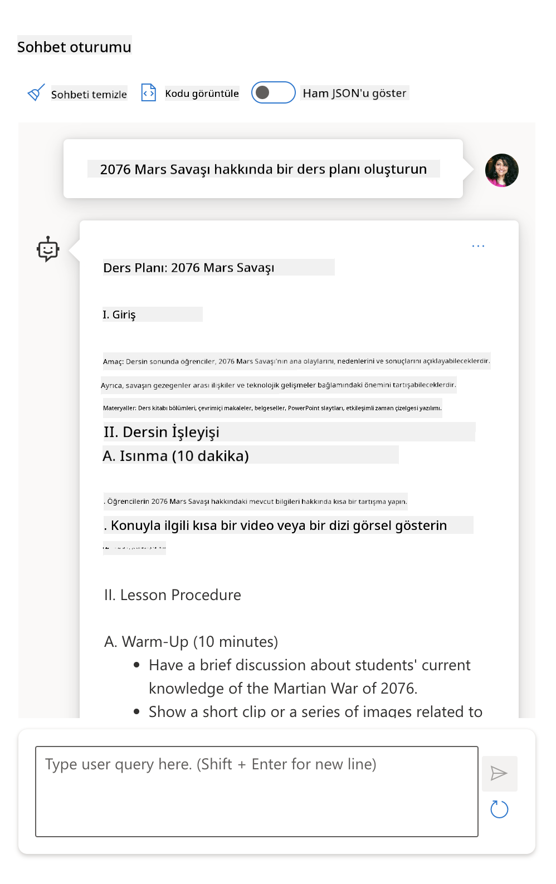

<!--
CO_OP_TRANSLATOR_METADATA:
{
  "original_hash": "0135e6c271f3ece8699050d4debbce88",
  "translation_date": "2025-10-17T16:23:25+00:00",
  "source_file": "04-prompt-engineering-fundamentals/README.md",
  "language_code": "tr"
}
-->
# İstek Mühendisliği Temelleri

[](https://youtu.be/GElCu2kUlRs?si=qrXsBvXnCW12epb8)

## GiriÅŸ
Bu modül, üretken yapay zeka modellerinde etkili istekler oluşturmak için temel kavramları ve teknikleri ele alır. Bir LLM'ye (Büyük Dil Modeli) yazdığınız isteğin şekli de önemlidir. Özenle hazırlanmış bir istek, daha kaliteli bir yanıt elde etmenizi sağlayabilir. Ancak, _istek_ ve _istek mühendisliği_ gibi terimler tam olarak ne anlama geliyor? Ve LLM'ye gönderdiğim istek _girdisini_ nasıl geliştirebilirim? Bu bölümde ve bir sonraki bölümde bu soruları yanıtlamaya çalışacağız.

_Üretken Yapay Zeka_, kullanıcı taleplerine yanıt olarak yeni içerikler (örneğin, metin, görseller, ses, kod vb.) oluşturma yeteneğine sahiptir. Bunu, doğal dil ve kod kullanımı için eğitilmiş OpenAI'nin GPT ("Üretken Önceden Eğitilmiş Dönüştürücü") serisi gibi _Büyük Dil Modelleri_ kullanarak başarır.

Kullanıcılar artık bu modellerle sohbet gibi tanıdık paradigmalar kullanarak, herhangi bir teknik uzmanlık veya eğitim gerektirmeden etkileşimde bulunabilir. Modeller _istek tabanlıdır_ - kullanıcılar bir metin girişi (istek) gönderir ve yapay zekadan bir yanıt (tamamlama) alır. Ardından, "yapay zeka ile sohbet ederek" çok aşamalı konuşmalarda isteklerini rafine edebilir ve yanıt beklentilerini karşılayana kadar iyileştirebilirler.

"İstekler" artık üretken yapay zeka uygulamaları için birincil _programlama arayüzü_ haline geliyor, modellere ne yapmaları gerektiğini söylüyor ve dönen yanıtların kalitesini etkiliyor. "İstek Mühendisliği", tutarlı ve kaliteli yanıtlar sağlamak için isteklerin _tasarımı ve optimizasyonuna_ odaklanan hızla büyüyen bir çalışma alanıdır.

## Öğrenme Hedefleri

Bu derste, İstek Mühendisliği'nin ne olduğunu, neden önemli olduğunu ve belirli bir model ve uygulama hedefi için daha etkili istekler nasıl oluşturabileceğimizi öğreneceğiz. İstek mühendisliği için temel kavramları ve en iyi uygulamaları anlayacağız - ve bu kavramların gerçek örneklere uygulandığını görebileceğimiz etkileşimli bir Jupyter Notebooks "sandbox" ortamını öğreneceğiz.

Bu dersin sonunda şunları yapabileceğiz:

1. İstek mühendisliğinin ne olduğunu ve neden önemli olduğunu açıklamak.
2. Bir isteğin bileşenlerini ve nasıl kullanıldıklarını tanımlamak.
3. İstek mühendisliği için en iyi uygulamaları ve teknikleri öğrenmek.
4. Öğrenilen teknikleri gerçek örneklere uygulamak, bir OpenAI endpoint kullanarak.

## Anahtar Terimler

İstek Mühendisliği: Yapay zeka modellerini istenen çıktıları üretmeye yönlendirmek için girdileri tasarlama ve iyileştirme pratiği.
Tokenizasyon: Metni, modelin anlayabileceği ve işleyebileceği daha küçük birimler olan tokenlara dönüştürme süreci.
Talimatla Ayarlanmış LLM'ler: Yanıt doğruluğunu ve alaka düzeyini artırmak için belirli talimatlarla ince ayar yapılmış Büyük Dil Modelleri (LLM'ler).

## Öğrenme Sandbox'ı

İstek mühendisliği şu anda bilimden çok bir sanat. Bunun için sezgimizi geliştirmek adına _daha fazla pratik yapmak_ ve uygulama alanı uzmanlığını önerilen teknikler ve modele özgü optimizasyonlarla birleştiren bir deneme-yanılma yaklaşımını benimsemek en iyi yoldur.

Bu derse eşlik eden Jupyter Notebook, öğrendiklerinizi uygulayabileceğiniz bir _sandbox_ ortamı sağlar - ister ders sırasında ister dersin sonunda yer alan kod zorluklarının bir parçası olarak. Alıştırmaları çalıştırmak için şunlara ihtiyacınız olacak:

1. **Bir Azure OpenAI API anahtarı** - dağıtılmış bir LLM için hizmet endpoint'i.
2. **Bir Python Çalışma Zamanı** - Notebook'un çalıştırılabileceği bir ortam.
3. **Yerel Çevre Değişkenleri** - _şimdi [KURULUM](./../00-course-setup/02-setup-local.md?WT.mc_id=academic-105485-koreyst) adımlarını tamamlayarak hazır olun_.

Notebook, _başlangıç_ alıştırmalarıyla birlikte gelir - ancak kendi _Markdown_ (açıklama) ve _Kod_ (istek talepleri) bölümlerinizi ekleyerek daha fazla örnek veya fikir denemeye ve istek tasarımı için sezginizi geliştirmeye teşvik ediliyorsunuz.

## Resimli Kılavuz

Bu derste ele alınan konuların genel bir resmini görmek ister misiniz? Her birinde düşünmeniz gereken ana konuları ve önemli çıkarımları size bir fikir veren bu resimli kılavuza göz atın. Ders yol haritası, temel kavramları ve zorlukları anlamaktan başlayarak, ilgili istek mühendisliği teknikleri ve en iyi uygulamalarla bunları ele almaya kadar uzanır. Bu kılavuzdaki "Gelişmiş Teknikler" bölümü, bu müfredatın _bir sonraki_ bölümünde ele alınan içeriğe atıfta bulunur.


## GiriÅŸimimiz

Åimdi, _bu konunun_ [eÄŸitimde yapay zeka inovasyonunu getirme](https://educationblog.microsoft.com/2023/06/collaborating-to-bring-ai-innovation-to-education?WT.mc_id=academic-105485-koreyst) misyonumuzla nasıl iliÅŸkili olduÄŸundan bahsedelim. _KiÅŸiselleÅŸtirilmiÅŸ öğrenme_ için yapay zeka destekli uygulamalar geliÅŸtirmek istiyoruz - bu yüzden uygulamamızın farklı kullanıcılarının nasıl "istekler" tasarlayabileceÄŸini düşünelim:

- **Yöneticiler**, yapay zekadan _müfredat verilerini analiz ederek kapsama alanındaki boşlukları belirlemesini_ isteyebilir. Yapay zeka sonuçları özetleyebilir veya kodla görselleştirebilir.
- **Eğitmenler**, yapay zekadan _belirli bir hedef kitle ve konu için bir ders planı oluşturmasını_ isteyebilir. Yapay zeka, belirtilen formatta kişiselleştirilmiş bir plan oluşturabilir.
- **Öğrenciler**, yapay zekadan _zor bir konuda kendilerine rehberlik etmesini_ isteyebilir. Yapay zeka, artık öğrencilere seviyelerine uygun dersler, ipuçları ve örneklerle rehberlik edebilir.

Bu sadece buzdağının görünen kısmı. [Eğitim için İstekler](https://github.com/microsoft/prompts-for-edu/tree/main?WT.mc_id=academic-105485-koreyst) - eğitim uzmanları tarafından derlenen açık kaynaklı istek kütüphanesine göz atın - olasılıkların daha geniş bir yelpazesini görmek için! _Bu isteklerden bazılarını sandbox'ta veya OpenAI Playground'da çalıştırmayı deneyin ve neler olduğunu görün!_

## İstek Mühendisliği Nedir?

Bu derse, **İstek Mühendisliği**ni belirli bir uygulama hedefi ve model için tutarlı ve kaliteli yanıtlar (tamamlamalar) sağlamak amacıyla metin girdilerini (istekleri) _tasarlama ve optimize etme_ süreci olarak tanımlayarak başladık. Bunu 2 aşamalı bir süreç olarak düşünebiliriz:

- Belirli bir model ve hedef için ilk isteği _tasarlamak_
- Yanıtın kalitesini artırmak için isteği _iteratif olarak iyileştirmek_

Bu, optimal sonuçlar elde etmek için kullanıcı sezgisi ve çabasını gerektiren bir deneme-yanılma sürecidir. Peki neden önemlidir? Bu soruyu yanıtlamak için önce üç kavramı anlamamız gerekiyor:

- _Tokenizasyon_ = modelin isteği nasıl "gördüğü"
- _Temel LLM'ler_ = temel modelin bir isteği nasıl "işlediği"
- _Talimatla Ayarlanmış LLM'ler_ = modelin artık "görevleri" nasıl görebildiği

### Tokenizasyon

Bir LLM, istekleri _token dizisi_ olarak görür ve farklı modeller (veya bir modelin farklı sürümleri) aynı isteği farklı şekillerde tokenleştirebilir. LLM'ler tokenlar üzerinde (ham metin üzerinde değil) eğitildiğinden, isteklerin nasıl tokenleştirildiği, oluşturulan yanıtın kalitesi üzerinde doğrudan bir etkiye sahiptir.

Tokenizasyonun nasıl çalıştığına dair bir fikir edinmek için aşağıda gösterilen [OpenAI Tokenizer](https://platform.openai.com/tokenizer?WT.mc_id=academic-105485-koreyst) gibi araçları deneyin. İsteğinizi kopyalayın - ve bunun tokenlara nasıl dönüştüğünü görün, boşluk karakterleri ve noktalama işaretlerinin nasıl ele alındığına dikkat edin. Bu örneğin daha eski bir LLM'yi (GPT-3) gösterdiğini unutmayın - bu nedenle daha yeni bir modelle denemek farklı bir sonuç üretebilir.


### Kavram: Temel Modeller

Bir istek tokenleştirildikten sonra, ["Temel LLM"](https://blog.gopenai.com/an-introduction-to-base-and-instruction-tuned-large-language-models-8de102c785a6?WT.mc_id=academic-105485-koreyst) (veya Temel model) işlevi, o dizideki bir sonraki tokeni tahmin etmektir. LLM'ler büyük metin veri setleri üzerinde eğitildiğinden, tokenlar arasındaki istatistiksel ilişkiler hakkında iyi bir anlayışa sahiptir ve bu tahmini belirli bir güvenle yapabilir. Ancak, istekteki veya tokendeki kelimelerin _anlamını_ anlamazlar; sadece bir sonraki tahminleriyle "tamamlayabilecekleri" bir desen görürler. Kullanıcı müdahalesi veya önceden belirlenmiş bir koşulla sonlandırılana kadar diziyi tahmin etmeye devam edebilirler.

İstek tabanlı tamamlamanın nasıl çalıştığını görmek ister misiniz? Yukarıdaki isteği Azure OpenAI Studio'nun [_Chat Playground_](https://oai.azure.com/playground?WT.mc_id=academic-105485-koreyst) bölümüne varsayılan ayarlarla girin. Sistem, istekleri bilgi talepleri olarak ele alacak şekilde yapılandırılmıştır - bu nedenle bu bağlamı karşılayan bir tamamlama görmelisiniz.

Peki ya kullanıcı, belirli bir kriteri veya görev hedefini karşılayan bir şey görmek isteseydi? İşte bu noktada _talimatla ayarlanmış_ LLM'ler devreye giriyor.


### Kavram: Talimatla Ayarlanmış LLM'ler

Bir [Talimatla Ayarlanmış LLM](https://blog.gopenai.com/an-introduction-to-base-and-instruction-tuned-large-language-models-8de102c785a6?WT.mc_id=academic-105485-koreyst), temel modelle başlar ve örnekler veya giriş/çıkış çiftleri (örneğin, çok aşamalı "mesajlar") ile ince ayar yapılarak açık talimatlar içerebilir - ve yapay zekanın yanıtı bu talimatı takip etmeye çalışır.

Bu, modelin _talimatları takip etmesini_ ve _geri bildirimlerden öğrenmesini_ sağlayarak, pratik uygulamalara daha uygun ve kullanıcı hedeflerine daha uygun yanıtlar üretmesini sağlayan İnsan Geri Bildirimi ile Takviyeli Öğrenme (RLHF) gibi teknikler kullanır.

Hadi deneyelim - yukarıdaki isteği tekrar gözden geçirin, ancak şimdi _sistem mesajını_ şu talimatı bağlam olarak sağlamak için değiştirin:

> _Size verilen içeriği ikinci sınıf bir öğrenci için özetleyin. Sonucu bir paragraf ve 3-5 madde ile sınırlayın._

Sonucun şimdi istenen hedefi ve formatı nasıl yansıttığını görün? Bir eğitmen artık bu yanıtı doğrudan sınıfındaki slaytlarında kullanabilir.


## Neden İstek Mühendisliğine İhtiyacımız Var?

Artık isteklerin LLM'ler tarafından nasıl işlendiğini bildiğimize göre, _neden_ istek mühendisliğine ihtiyacımız olduğunu konuşalım. Cevap, mevcut LLM'lerin _güvenilir ve tutarlı tamamlamaları_ elde etmeyi daha zor hale getiren bir dizi zorluk sunmasında yatmaktadır. Örneğin:

1. **Model yanıtları rastlantısaldır.** _Aynı istek_, farklı modeller veya model sürümleriyle muhtemelen farklı yanıtlar üretecektir. Ve hatta _aynı modelle_ farklı zamanlarda farklı sonuçlar üretebilir. _İstek mühendisliği teknikleri, daha iyi sınırlar sağlayarak bu varyasyonları en aza indirmemize yardımcı olabilir_.

1. **Modeller yanıtları uydurabilir.** Modeller, _büyük ama sınırlı_ veri setleriyle önceden eğitildiğinden, bu eğitim kapsamı dışındaki kavramlar hakkında bilgi eksikliği yaşarlar. Sonuç olarak, tamamlamalar bazen yanlış, hayali veya bilinen gerçeklerle doğrudan çelişkili olabilir. _İstek mühendisliği teknikleri, kullanıcıların yapay zekadan alıntılar veya mantık istemek gibi bu tür uydurmaları belirlemesine ve azaltmasına yardımcı olur_.

1. **Modellerin yetenekleri değişkenlik gösterebilir.** Daha yeni modeller veya model nesilleri daha zengin yeteneklere sahip olacak, ancak maliyet ve karmaşıklık açısından benzersiz tuhaflıklar ve ödünler de getirecektir. _İstek mühendisliği, model farklılıklarını soyutlayan ve ölçeklenebilir, sorunsuz yollarla modele özgü gereksinimlere uyum sağlayan en iyi uygulamalar ve iş akışları geliştirmemize yardımcı olabilir_.

Bunu OpenAI veya Azure OpenAI Playground'da eylemde görelim:

- Aynı isteği farklı LLM dağıtımlarıyla (örneğin, OpenAI, Azure OpenAI, Hugging Face) kullanın - varyasyonları gördünüz mü?
- Aynı isteği _aynı_ LLM dağıtımıyla (örneğin, Azure OpenAI Playground) tekrar tekrar kullanın - bu varyasyonlar nasıl farklılık gösterdi?

### Uydurma Örneği

Bu derste, **"uydurma"** terimini, LLM'lerin bazen eğitimlerindeki sınırlamalar veya diğer kısıtlamalar nedeniyle gerçeğe uygun olmayan bilgiler üretmesi olgusunu ifade etmek için kullanıyoruz. Popüler makalelerde veya araştırma makalelerinde bu olguyu _"halüsinasyonlar"_ olarak duymuş olabilirsiniz. Ancak, makine kaynaklı bir sonucu insan benzeri bir özelliğe atfederek davranışı yanlış bir şekilde insanlaştırmamak için _"uydurma"_ terimini kullanmanızı şiddetle öneriyoruz. Bu aynı zamanda [Sorumlu Yapay Zeka yönergelerini](https://www.microsoft.com/ai/responsible-ai?WT.mc_id=academic-105485-koreyst) terminoloji açısından güçlendirir ve bazı bağlamlarda saldırgan veya kapsayıcı olmayan olarak kabul edilebilecek terimleri ortadan kaldırır.

Uydurmaların nasıl çalıştığını anlamak ister misiniz? Yapay zekaya eğitim veri setinde bulunmayan bir konu için içerik oluşturmasını isteyen bir istek düşünün. Örneğin - şu isteği denedim:

> **İstek:** 2076'daki Mars Savaşı hakkında bir ders planı oluştur.
Bir web araması, Mars savaşları hakkında kurgusal hikayeler (örneğin, televizyon dizileri veya kitaplar) olduğunu gösterdi - ancak 2076 yılında geçen bir hikaye bulunmuyor. Mantık yürütme yoluyla, 2076'nın _gelecekte_ olduğunu ve bu nedenle gerçek bir olayla ilişkilendirilemeyeceğini söyleyebiliriz.

Peki, bu istemi farklı LLM sağlayıcılarıyla çalıştırdığımızda ne olur?

> **Yanıt 1**: OpenAI Playground (GPT-35)


> **Yanıt 2**: Azure OpenAI Playground (GPT-35)



> **Yanıt 3**: Hugging Face Chat Playground (LLama-2)


Beklendiği gibi, her model (veya model versiyonu) stokastik davranış ve model yeteneklerindeki farklılıklar nedeniyle biraz farklı yanıtlar üretiyor. Örneğin, bir model 8. sınıf seviyesindeki bir kitleyi hedeflerken, diğeri lise öğrencilerini hedef alıyor. Ancak, üç model de bilgisiz bir kullanıcıyı olayın gerçek olduğuna ikna edebilecek yanıtlar üretti.

_İstem mühendisliği_ teknikleri, örneğin _meta-istem oluşturma_ ve _sıcaklık ayarları_, modelin yanlış bilgi üretmesini bir ölçüde azaltabilir. Yeni istem mühendisliği _mimari_ yaklaşımları, bu etkileri azaltmak veya ortadan kaldırmak için yeni araçları ve teknikleri istem akışına sorunsuz bir şekilde entegre eder.

## Vaka Çalışması: GitHub Copilot

Bu bölümü, istem mühendisliğinin gerçek dünya çözümlerinde nasıl kullanıldığını anlamak için bir vaka çalışmasıyla tamamlayalım: [GitHub Copilot](https://github.com/features/copilot?WT.mc_id=academic-105485-koreyst).

GitHub Copilot, sizin "Yapay Zeka Eş Programcınız"dır - metin istemlerini kod tamamlama önerilerine dönüştürür ve Visual Studio Code gibi geliştirme ortamınıza entegre edilerek sorunsuz bir kullanıcı deneyimi sunar. Aşağıdaki blog serilerinde belgelenenlere göre, ilk versiyon OpenAI Codex modeline dayanıyordu - mühendisler hızla modeli ince ayar yapma ve kod kalitesini artırmak için daha iyi istem mühendisliği teknikleri geliştirme ihtiyacını fark ettiler. Temmuz ayında, [Codex'in ötesine geçen geliştirilmiş bir yapay zeka modelini tanıttılar](https://github.blog/2023-07-28-smarter-more-efficient-coding-github-copilot-goes-beyond-codex-with-improved-ai-model/?WT.mc_id=academic-105485-koreyst) ve daha hızlı öneriler sunmaya başladılar.

Öğrenme yolculuklarını takip etmek için aşağıdaki yazıları sırayla okuyabilirsiniz.

- **Mayıs 2023** | [GitHub Copilot Kodunuzu Anlamada Daha İyi Hale Geliyor](https://github.blog/2023-05-17-how-github-copilot-is-getting-better-at-understanding-your-code/?WT.mc_id=academic-105485-koreyst)
- **Mayıs 2023** | [GitHub İçinde: GitHub Copilot'un Arkasındaki LLM'lerle Çalışmak](https://github.blog/2023-05-17-inside-github-working-with-the-llms-behind-github-copilot/?WT.mc_id=academic-105485-koreyst).
- **Haziran 2023** | [GitHub Copilot için Daha İyi İstemler Nasıl Yazılır](https://github.blog/2023-06-20-how-to-write-better-prompts-for-github-copilot/?WT.mc_id=academic-105485-koreyst).
- **Temmuz 2023** | [GitHub Copilot, Codex'in Ötesine Geçiyor ve Geliştirilmiş Yapay Zeka Modeliyle Daha Akıllı ve Verimli Kodlama Sunuyor](https://github.blog/2023-07-28-smarter-more-efficient-coding-github-copilot-goes-beyond-codex-with-improved-ai-model/?WT.mc_id=academic-105485-koreyst)
- **Temmuz 2023** | [Geliştiriciler için İstem Mühendisliği ve LLM Rehberi](https://github.blog/2023-07-17-prompt-engineering-guide-generative-ai-llms/?WT.mc_id=academic-105485-koreyst)
- **Eylül 2023** | [Bir Kurumsal LLM Uygulaması Nasıl İnşa Edilir: GitHub Copilot'tan Alınan Dersler](https://github.blog/2023-09-06-how-to-build-an-enterprise-llm-application-lessons-from-github-copilot/?WT.mc_id=academic-105485-koreyst)

Ayrıca, [Mühendislik bloglarını](https://github.blog/category/engineering/?WT.mc_id=academic-105485-koreyst) inceleyerek, bu modellerin ve tekniklerin gerçek dünya uygulamalarını nasıl yönlendirdiğini gösteren [bu yazı](https://github.blog/2023-09-27-how-i-used-github-copilot-chat-to-build-a-reactjs-gallery-prototype/?WT.mc_id=academic-105485-koreyst) gibi daha fazla gönderiye ulaşabilirsiniz.

---

## İstem Tasarımı

İstem mühendisliğinin neden önemli olduğunu gördük - şimdi istemlerin nasıl _oluşturulduğunu_ anlayalım, böylece daha etkili istem tasarımı için farklı teknikleri değerlendirebiliriz.

### Temel Ä°stem

Temel istemle başlayalım: modele başka bir bağlam olmadan gönderilen bir metin girdisi. İşte bir örnek - ABD ulusal marşının ilk birkaç kelimesini OpenAI [Completion API](https://platform.openai.com/docs/api-reference/completions?WT.mc_id=academic-105485-koreyst) ile gönderdiğimizde, model hemen yanıtı _tamamlayarak_ sonraki birkaç satırı tahmin eder ve temel tahmin davranışını gösterir.

| İstem (Girdi)     | Tamamlama (Çıktı)                                                                                                                        |
| :----------------- | :----------------------------------------------------------------------------------------------------------------------------------------- |
| Oh say can you see | Görünüşe göre ABD ulusal marşı "The Star-Spangled Banner"ın sözlerini başlatıyorsunuz. Tam sözler şu şekilde devam eder... |

### Karmaşık İstem

Åimdi bu temel isteme baÄŸlam ve talimatlar ekleyelim. [Chat Completion API](https://learn.microsoft.com/azure/ai-services/openai/how-to/chatgpt?WT.mc_id=academic-105485-koreyst) ile bir istemi, _mesajlar_ koleksiyonu olarak oluÅŸturabiliriz:

- Kullanıcı girdisi ve asistan yanıtını yansıtan giriş/çıkış çiftleri.
- Asistan davranışı veya kişiliği için bağlam belirleyen sistem mesajı.

İstek artık aşağıdaki formda olup, _tokenizasyon_ bağlam ve konuşmadan ilgili bilgileri etkili bir şekilde yakalar. Sistem bağlamını değiştirmek, sağlanan kullanıcı girdileri kadar tamamlama kalitesi üzerinde etkili olabilir.

```python
response = openai.chat.completions.create(
    model="gpt-3.5-turbo",
    messages=[
        {"role": "system", "content": "You are a helpful assistant."},
        {"role": "user", "content": "Who won the world series in 2020?"},
        {"role": "assistant", "content": "The Los Angeles Dodgers won the World Series in 2020."},
        {"role": "user", "content": "Where was it played?"}
    ]
)
```

### Talimat Ä°stemi

Yukarıdaki örneklerde, kullanıcı istemi bilgi talebi olarak yorumlanabilecek basit bir metin sorgusuydu. _Talimat_ istemleriyle, bu metni bir görevi daha ayrıntılı bir şekilde belirtmek için kullanabilir, yapay zekaya daha iyi rehberlik sağlayabiliriz. İşte bir örnek:

| İstem (Girdi)                                                                                                                                                                                                                         | Tamamlama (Çıktı)                                                                                                        | Talimat Türü        |
| :------------------------------------------------------------------------------------------------------------------------------------------------------------------------------------------------------------------------------------- | :------------------------------------------------------------------------------------------------------------------------- | :------------------ |
| İç Savaş hakkında bir açıklama yazın                                                                                                                                                                                                   | _basit bir paragraf döndü_                                                                                              | Basit              |
| İç Savaş hakkında bir açıklama yazın. Önemli tarihleri ve olayları belirtin ve bunların önemini açıklayın                                                                                                                              | _bir paragraf ve ardından önemli olay tarihleriyle açıklamalar içeren bir liste döndü_                                             | Karmaşık             |
| İç Savaş hakkında bir paragraf yazın. Önemli tarihleri ve bunların önemini içeren 3 madde ekleyin. Önemli tarihi figürler ve katkılarıyla ilgili 3 madde daha ekleyin. Çıktıyı JSON dosyası olarak döndürün.                             | _daha kapsamlı detaylar döndü, bir metin kutusunda JSON formatında, dosyaya kopyalanıp doğrulanabilir_ | Karmaşık. Formatlı. |

## Ana İçerik

Yukarıdaki örneklerde, istem hala oldukça açık uçluydu ve LLM'nin önceden eğitilmiş veri setinin hangi kısmının ilgili olduğunu belirlemesine izin veriyordu. _Ana içerik_ tasarım modeliyle, giriş metni iki bölüme ayrılır:

- bir talimat (eylem)
- ilgili içerik (eylemi etkileyen)

İşte talimatın "bunu 2 cümlede özetle" olduğu bir örnek.

| İstem (Girdi)                                                                                                                                                                                                                                                                                                                                                                                                                                                                                                                                                                                                                                                                                      | Tamamlama (Çıktı)                                                                                                                                                                                                                                                                             |
| :-------------------------------------------------------------------------------------------------------------------------------------------------------------------------------------------------------------------------------------------------------------------------------------------------------------------------------------------------------------------------------------------------------------------------------------------------------------------------------------------------------------------------------------------------------------------------------------------------------------------------------------------------------------------------------------------------- | :---------------------------------------------------------------------------------------------------------------------------------------------------------------------------------------------------------------------------------------------------------------------------------------------- |
| Jüpiter, Güneş'ten beşinci gezegen ve Güneş Sistemi'nin en büyüğüdür. Güneş'in kütlesinin binde biri kadar bir kütleye sahiptir, ancak Güneş Sistemi'ndeki diğer tüm gezegenlerin toplamının iki buçuk katı kadardır. Jüpiter, çıplak gözle gece gökyüzünde görülebilen en parlak nesnelerden biridir ve kaydedilmiş tarihten önceki antik uygarlıklar tarafından bilinmektedir. Roma tanrısı Jüpiter'in adını almıştır. Dünya'dan bakıldığında, Jüpiter'in yansıyan ışığı görünür gölgeler oluşturacak kadar parlak olabilir ve ortalama olarak Ay ve Venüs'ten sonra gece gökyüzündeki üçüncü en parlak doğal nesnedir. <br/> **Bunu 2 kısa cümlede özetle** | Jüpiter, Güneş'ten beşinci gezegen ve Güneş Sistemi'nin en büyüğüdür, gece gökyüzünde en parlak nesnelerden biridir. Roma tanrısı Jüpiter'in adını taşıyan bu gaz devi, Güneş Sistemi'ndeki diğer tüm gezegenlerin toplam kütlesinin iki buçuk katına sahiptir. |

Ana içerik bölümü, daha etkili talimatlar oluşturmak için çeşitli şekillerde kullanılabilir:

- **Örnekler** - modele ne yapması gerektiğini açık bir talimatla söylemek yerine, ne yapması gerektiğine dair örnekler verin ve modelin deseni çıkarmasına izin verin.
- **İpuçları** - talimatın ardından bir "ipucu" vererek tamamlama sürecini başlatın ve modeli daha ilgili yanıtlar vermeye yönlendirin.
- **Åablonlar** - bunlar, belirli kullanım durumları için verilerle özelleÅŸtirilebilen yer tutucular (deÄŸiÅŸkenler) içeren tekrarlanabilir 'tariflerdir'.

Åimdi bunları uygulamalı olarak inceleyelim.

### Örnek Kullanımı

Bu yaklaşımda, ana içeriği kullanarak modele belirli bir talimat için istenen çıktının birkaç örneğini "beslersiniz" ve modelin istenen çıktının desenini çıkarmasına izin verirsiniz. Sağlanan örnek sayısına bağlı olarak sıfır atış istemi, tek atış istemi, birkaç atış istemi vb. olabilir.

İstem artık üç bileşenden oluşur:

- Bir görev açıklaması
- İstenen çıktının birkaç örneği
- Yeni bir örneğin başlangıcı (bu, örtük bir görev açıklaması haline gelir)

| Öğrenme Türü | İstem (Girdi)                                                                                                                                        | Tamamlama (Çıktı)         |
| :------------ | :---------------------------------------------------------------------------------------------------------------------------------------------------- | :-------------------------- |
| Sıfır atış     | "Güneş Parlıyor". İspanyolcaya çevir                                                                                                            | "El Sol está brillando".    |
| Tek atış      | "Güneş Parlıyor" => ""El Sol está brillando". <br> "Soğuk ve Rüzgarlı Bir Gün" =>                                                                 | "Es un día frío y ventoso". |
| Birkaç atış      | Oyuncu üsleri koştu => Beyzbol <br/> Oyuncu bir ace vurdu => Tenis <br/> Oyuncu bir altı vurdu => Kriket <br/> Oyuncu bir smaç yaptı => | Basketbol                  |
|               |                                                                                                                                                       |                             |

Sıfır atış isteminde modele açık bir talimat ("İspanyolcaya çevir") vermemiz gerektiğini, ancak tek atış istem örneğinde bunun çıkarıldığını fark edin. Birkaç atış örneği, daha fazla örnek eklemenin, ek talimatlar olmadan modellerin daha doğru çıkarımlar yapmasına nasıl izin verdiğini gösteriyor.

### İstem İpuçları

Ana içeriği kullanmanın bir başka tekniği, örnekler yerine _ipuçları_ sağlamaktır. Bu durumda, modelin istenen yanıt formatını yansıtan bir snippet ile _başlamasına yardımcı olarak_ doğru yöne yönlendirilmesini sağlıyoruz. Model daha sonra bu ipucunu alır ve bu doğrultuda devam eder.

| İpucu Sayısı | İstem (Girdi)                                                                                                                                                                                                                                                                                                                                                                                                                                               | Tamamlama (Çıktı)                                                                                                                                                                                                                                                                                       |
| :------------- | :----------------------------------------------------------------------------------------------------------------------------------------------------------------------------------------------------------------------------------------------------------------------------------------------------------------------------------------------------------------------------------------------------------------------------------------------------------- | :-------------------------------------------------------------------------------------------------------------------------------------------------------------------------------------------------------------------------------------------------------------------------------------------------------- |
| 0              | Jüpiter, Güneş'ten beşinci gezegen ve Güneş Sistemi'nin en büyüğüdür. Güneş'in kütlesinin binde biri kadar bir kütleye sahiptir, ancak Güneş Sistemi'ndeki diğer tüm gezegenlerin toplamının iki buçuk katı kadardır. Jüpiter, çıplak gözle gece gökyüzünde görülebilen en parlak nesnelerden biridir ve kaydedilmiş tarihten önceki antik uygarlıklar tarafından bilinmektedir. <br/>**Bunu Özetle**                                       | Jüpiter, Güneş Sistemi'nin en büyük gezegeni ve Güneş'ten beşinci gezegendir. Gaz devi olan Jüpiter, diğer tüm gezegenlerin toplam kütlesinin iki buçuk katına sahiptir ve gece gökyüzünde kolayca görülebilir. |
| 1              | Jüpiter, Güneş'ten itibaren beşinci gezegen ve Güneş Sistemi'ndeki en büyük gezegendir. Güneş'in kütlesinin binde biri kadar bir kütleye sahiptir, ancak Güneş Sistemi'ndeki diğer tüm gezegenlerin toplam kütlesinin iki buçuk katıdır. Jüpiter, gece gökyüzünde çıplak gözle görülebilen en parlak nesnelerden biridir ve kaydedilmiş tarihten önceki antik uygarlıklar tarafından biliniyordu. <br/>**Özetle** <br/> Öğrendiğimiz şey, Jüpiter | Güneş'ten itibaren beşinci gezegen ve Güneş Sistemi'ndeki en büyük gezegendir. Güneş'in kütlesinin binde biri kadar bir kütleye sahiptir, ancak diğer tüm gezegenlerin toplam kütlesinin iki buçuk katıdır. Çıplak gözle kolayca görülebilir ve antik çağlardan beri bilinmektedir.                        |
| 2              | Jüpiter, Güneş'ten itibaren beşinci gezegen ve Güneş Sistemi'ndeki en büyük gezegendir. Güneş'in kütlesinin binde biri kadar bir kütleye sahiptir, ancak Güneş Sistemi'ndeki diğer tüm gezegenlerin toplam kütlesinin iki buçuk katıdır. Jüpiter, gece gökyüzünde çıplak gözle görülebilen en parlak nesnelerden biridir ve kaydedilmiş tarihten önceki antik uygarlıklar tarafından biliniyordu. <br/>**Özetle** <br/> Öğrendiğimiz En Önemli 3 Gerçek:         | 1. Jüpiter, Güneş'ten itibaren beşinci gezegen ve Güneş Sistemi'ndeki en büyük gezegendir. <br/> 2. Güneş'in kütlesinin binde biri kadar bir kütleye sahiptir...<br/> 3. Jüpiter, antik çağlardan beri çıplak gözle görülebilmektedir ...                                                                       |
|                |                                                                                                                                                                                                                                                                                                                                                                                                                                                              |                                                                                                                                                                                                                                                                                                           |

### Prompt Åablonları

Bir prompt şablonu, _önceden tanımlanmış bir prompt tarifi_ olup, tutarlı kullanıcı deneyimlerini ölçeklendirmek için gerektiğinde saklanabilir ve yeniden kullanılabilir. En basit haliyle, [OpenAI'den bu örnek](https://platform.openai.com/examples?WT.mc_id=academic-105485-koreyst) gibi, hem etkileşimli prompt bileşenlerini (kullanıcı ve sistem mesajları) hem de API tabanlı istek formatını sağlayan bir prompt örnekleri koleksiyonudur - yeniden kullanım için destek sağlar.

Daha karmaşık bir formda, [LangChain'den bu örnek](https://python.langchain.com/docs/concepts/prompt_templates/?WT.mc_id=academic-105485-koreyst) gibi, _yer tutucular_ içerir ve bu yer tutucular kullanıcı girdisi, sistem bağlamı, harici veri kaynakları gibi çeşitli kaynaklardan gelen verilerle değiştirilebilir. Bu, bir kütüphane oluşturmayı ve yeniden kullanılabilir prompt'ları ölçekli bir şekilde programlı olarak tutarlı kullanıcı deneyimlerini yönlendirmek için kullanmayı mümkün kılar.

Son olarak, şablonların gerçek değeri, dikey uygulama alanları için _prompt kütüphaneleri_ oluşturma ve yayınlama yeteneğinde yatar - burada prompt şablonu artık hedeflenen kullanıcı kitlesi için yanıtları daha alakalı ve doğru hale getiren uygulamaya özgü bağlamı veya örnekleri yansıtacak şekilde _optimize edilmiştir_. [Prompts For Edu](https://github.com/microsoft/prompts-for-edu?WT.mc_id=academic-105485-koreyst) deposu, ders planlama, müfredat tasarımı, öğrenci rehberliği gibi ana hedeflere vurgu yaparak eğitim alanı için prompt'ların bir kütüphanesini derleyen bu yaklaşımın harika bir örneğidir.

## Destekleyici İçerik

Prompt oluşturmayı bir talimat (görev) ve bir hedef (ana içerik) olarak düşünürsek, _ikincil içerik_ çıktıyı bir şekilde **etkilemek için** sağladığımız ek bağlam gibidir. Bu, modelin yanıtını istenen kullanıcı hedeflerine veya beklentilerine uygun hale getirmesine yardımcı olabilecek ayar parametreleri, biçimlendirme talimatları, konu sınıflandırmaları vb. olabilir.

Örneğin: Bir müfredat kataloğu ile tüm mevcut kurslar hakkında geniş meta veriler (isim, açıklama, seviye, meta veri etiketleri, eğitmen vb.) sağlandığında:

- "2023 Sonbahar müfredat kataloğunu özetle" talimatını tanımlayabiliriz.
- İstenen çıktının birkaç örneğini sağlamak için ana içeriği kullanabiliriz.
- İkincil içeriği, en çok ilgilenilen 5 "etiketi" belirlemek için kullanabiliriz.

Artık model, birkaç örnekle gösterilen formatta bir özet sağlayabilir - ancak bir sonuç birden fazla etikete sahipse, ikincil içerikte belirtilen 5 etiketi önceliklendirebilir.

---

<!--
DERS ÅABLONU:
Bu birim temel kavram #1'i kapsamalıdır.
Kavramı örnekler ve referanslarla pekiştirin.

KAVRAM #3:
Prompt Mühendisliği Teknikleri.
Prompt mühendisliği için bazı temel teknikler nelerdir?
Bunu bazı alıştırmalarla gösterin.
-->

## Prompting En Ä°yi Uygulamalar

Artık prompt'ların nasıl _oluşturulabileceğini_ bildiğimize göre, bunları en iyi uygulamaları yansıtacak şekilde nasıl _tasarlayabileceğimizi_ düşünmeye başlayabiliriz. Bunu iki bölümde düşünebiliriz - doğru _zihniyete_ sahip olmak ve doğru _teknikleri_ uygulamak.

### Prompt Mühendisliği Zihniyeti

Prompt Mühendisliği bir deneme-yanılma sürecidir, bu yüzden üç geniş rehber faktörü akılda tutun:

1. **Alan Bilgisi Önemlidir.** Yanıt doğruluğu ve alaka düzeyi, uygulamanın veya kullanıcının çalıştığı _alanın_ bir fonksiyonudur. Teknikleri daha fazla **özelleştirmek** için sezginizi ve alan uzmanlığınızı uygulayın. Örneğin, sistem prompt'larınızda _alana özgü kişilikler_ tanımlayın veya kullanıcı prompt'larınızda _alana özgü şablonlar_ kullanın. Alanla ilgili bağlamları yansıtan ikincil içerik sağlayın veya modeli tanıdık kullanım kalıplarına yönlendirmek için _alana özgü ipuçları ve örnekler_ kullanın.

2. **Model Bilgisi Önemlidir.** Modellerin doğası gereği rastgele olduğunu biliyoruz. Ancak model uygulamaları, kullandıkları eğitim veri seti (önceden eğitilmiş bilgi), sağladıkları yetenekler (örneğin, API veya SDK aracılığıyla) ve optimize edildikleri içerik türü (örneğin, kod vs. görüntü vs. metin) açısından da farklılık gösterebilir. Kullandığınız modelin güçlü ve zayıf yönlerini anlayın ve bu bilgiyi _öncelikli görevler_ oluşturmak veya modelin yeteneklerine optimize edilmiş _özelleştirilmiş şablonlar_ oluşturmak için kullanın.

3. **Yineleme ve Doğrulama Önemlidir.** Modeller hızla gelişiyor ve prompt mühendisliği teknikleri de öyle. Bir alan uzmanı olarak, daha geniş topluluğa uygulanmayan başka bağlam veya kriterlere sahip olabilirsiniz. Prompt mühendisliği araçlarını ve tekniklerini kullanarak prompt oluşturmayı "hızlandırın", ardından kendi sezginizi ve alan uzmanlığınızı kullanarak sonuçları yineleyin ve doğrulayın. İçgörülerinizi kaydedin ve başkalarının gelecekte daha hızlı yinelemeler yapabilmesi için yeni bir temel olarak kullanılabilecek bir **bilgi tabanı** (örneğin, prompt kütüphaneleri) oluşturun.

## En Ä°yi Uygulamalar

Åimdi [OpenAI](https://help.openai.com/en/articles/6654000-best-practices-for-prompt-engineering-with-openai-api?WT.mc_id=academic-105485-koreyst) ve [Azure OpenAI](https://learn.microsoft.com/azure/ai-services/openai/concepts/prompt-engineering#best-practices?WT.mc_id=academic-105485-koreyst) uygulayıcıları tarafından önerilen yaygın en iyi uygulamalara bakalım.

| Ne                                | Neden                                                                                                                                                                                                                                               |
| :-------------------------------- | :------------------------------------------------------------------------------------------------------------------------------------------------------------------------------------------------------------------------------------------------ |
| En son modelleri değerlendirin.   | Yeni model nesilleri muhtemelen geliştirilmiş özelliklere ve kaliteye sahip olacaktır - ancak daha yüksek maliyetlere de neden olabilir. Etkilerini değerlendirin, ardından geçiş kararları alın.                                                    |
| Talimatları ve bağlamı ayırın.    | Modelinizin/sağlayıcınızın talimatları, birincil ve ikincil içeriği daha net bir şekilde ayırmak için _sınırlandırıcılar_ tanımlayıp tanımlamadığını kontrol edin. Bu, modellerin tokenlere daha doğru ağırlıklar atamasına yardımcı olabilir.         |
| Spesifik ve net olun.             | İstenen bağlam, sonuç, uzunluk, format, stil vb. hakkında daha fazla ayrıntı verin. Bu, yanıtların hem kalitesini hem de tutarlılığını artıracaktır. Tarifleri yeniden kullanılabilir şablonlarda yakalayın.                                      |
| Açıklayıcı olun, örnekler kullanın | Modeller "göster ve anlat" yaklaşımına daha iyi yanıt verebilir. `zero-shot` bir yaklaşım ile başlayın, burada bir talimat verirsiniz (ancak örnek yoktur), ardından birkaç örnek sağlayarak `few-shot` ile iyileştirme yapmayı deneyin. Benzerlikler kullanın. |
| Tamamlama için ipuçları kullanın. | İstenen sonuca doğru yönlendirmek için modele yanıt için başlangıç noktası olarak kullanabileceği bazı öncü kelimeler veya ifadeler verin.                                                                                                         |
| Tekrar Edin.                      | Bazen modele kendinizi tekrar etmeniz gerekebilir. Talimatları birincil içeriğinizin öncesinde ve sonrasında verin, bir talimat ve bir ipucu kullanın vb. Yineleyin ve doğrulayın, neyin işe yaradığını görün.                                      |
| Sıra Önemlidir.                   | Bilgiyi modele sunma sırası, öğrenme örneklerinde bile, yanıtı etkileyebilir. Bu, yakınlık yanlılığı nedeniyle olabilir. En iyi neyin işe yaradığını görmek için farklı seçenekler deneyin.                                                        |
| Modele bir "çıkış" verin.         | Modele, herhangi bir nedenle görevi tamamlayamazsa sağlayabileceği bir _yedek_ tamamlama yanıtı verin. Bu, modellerin yanlış veya uydurma yanıtlar üretme olasılığını azaltabilir.                                                                |
|                                   |                                                                                                                                                                                                                                                   |

Herhangi bir en iyi uygulamada olduğu gibi, model, görev ve alan temelinde _sonuçlarınız değişebilir_. Bunları bir başlangıç noktası olarak kullanın ve sizin için en iyi olanı bulmak için yineleyin. Yeni modeller ve araçlar kullanıma sunuldukça prompt mühendisliği sürecinizi sürekli olarak yeniden değerlendirin, süreç ölçeklenebilirliği ve yanıt kalitesine odaklanın.

<!--
DERS ÅABLONU:
Bu birim uygulanabilir bir kod zorluğu sağlamalıdır.

ZORLUK:
Yalnızca talimatlarda kod yorumları bulunan bir Jupyter Notebook'a bağlantı verin (kod bölümleri boş).

ÇÖZÜM:
Prompt'ların doldurulup çalıştırıldığı, bir örneğin nasıl olabileceğini gösteren bir Notebook kopyasına bağlantı verin.
-->

## Ödev

Tebrikler! Dersin sonuna geldiniz! Åimdi bu kavramları ve teknikleri gerçek örneklerle test etme zamanı!

Ödevimiz için, etkileşimli olarak tamamlayabileceğiniz alıştırmalar içeren bir Jupyter Notebook kullanacağız. Ayrıca kendi fikirlerinizi ve tekniklerinizi keşfetmek için Notebook'u kendi Markdown ve Kod hücrelerinizle genişletebilirsiniz.

### Başlamak için, repo'yu fork edin, ardından

- (Önerilen) GitHub Codespaces'i başlatın
- (Alternatif) Repo'yu yerel cihazınıza klonlayın ve Docker Desktop ile kullanın
- (Alternatif) Notebook'u tercih ettiğiniz Notebook çalışma zamanı ortamında açın.

### Sonra, ortam değişkenlerinizi yapılandırın

- Repo kökündeki `.env.copy` dosyasını `.env` olarak kopyalayın ve `AZURE_OPENAI_API_KEY`, `AZURE_OPENAI_ENDPOINT` ve `AZURE_OPENAI_DEPLOYMENT` değerlerini doldurun. [Öğrenme Alanı bölümüne](../../../04-prompt-engineering-fundamentals/04-prompt-engineering-fundamentals) geri dönerek nasıl yapılacağını öğrenin.

### Son olarak, Jupyter Notebook'u açın

- Çalışma zamanı çekirdeğini seçin. Seçenek 1 veya 2'yi kullanıyorsanız, yalnızca geliştirici konteyneri tarafından sağlanan varsayılan Python 3.10.x çekirdeğini seçin.

Alıştırmaları çalıştırmaya hazırsınız. Burada _doğru ve yanlış_ cevaplar olmadığını unutmayın - sadece deneme-yanılma yoluyla seçenekleri keşfetmek ve belirli bir model ve uygulama alanı için neyin işe yaradığını anlamak.

_Bu nedenle bu derste Kod Çözüm segmentleri bulunmamaktadır. Bunun yerine, Notebook'da "Benim Çözümüm:" başlıklı Markdown hücreleri olacak ve referans için bir örnek çıktı gösterecektir._

 <!--
DERS ÅABLONU:
Bölümü bir özet ve kendi kendine rehberli öğrenme kaynaklarıyla tamamlayın.
-->

## Bilgi Kontrolü

Aşağıdakilerden hangisi makul en iyi uygulamalara uygun iyi bir prompt'tur?

1. Bana kırmızı bir arabanın resmini göster
2. Bana bir uçurumun kenarında gün batımıyla park etmiş Volvo marka ve XC90 model kırmızı bir arabanın resmini göster
3. Bana Volvo marka ve XC90 model kırmızı bir arabanın resmini göster

Cevap: 2, en iyi prompt çünkü "ne" hakkında ayrıntılar sağlar ve spesifik bir araba markası ve modeli (sadece herhangi bir araba değil) ile genel ortamı da tanımlar. 3, bir sonraki en iyisidir çünkü o da oldukça açıklayıcıdır.

## 🚀 Zorluk

"Show me an image of red car of make Volvo and " cümlesini tamamla prompt'u ile "ipucu" tekniğini kullanabilir misiniz? Model ne yanıt veriyor ve bunu nasıl geliştirebilirsiniz?

## Harika İş! Öğrenmeye Devam Edin

Farklı Prompt Mühendisliği kavramları hakkında daha fazla bilgi edinmek ister misiniz? Bu konuyla ilgili diğer harika kaynakları bulmak için [devam eden öğrenme sayfasına](https://aka.ms/genai-collection?WT.mc_id=academic-105485-koreyst) gidin.

5. Derse geçin, burada [ileri düzey prompt tekniklerini](../05-advanced-prompts/README.md?WT.mc_id=academic-105485-koreyst) inceleyeceğiz!

---

**Feragatname**:  
Bu belge, AI çeviri hizmeti [Co-op Translator](https://github.com/Azure/co-op-translator) kullanılarak çevrilmiştir. Doğruluk için çaba göstersek de, otomatik çevirilerin hata veya yanlışlıklar içerebileceğini lütfen unutmayın. Belgenin orijinal dili, yetkili kaynak olarak kabul edilmelidir. Kritik bilgiler için profesyonel insan çevirisi önerilir. Bu çevirinin kullanımından kaynaklanan yanlış anlamalar veya yanlış yorumlamalar için sorumluluk kabul etmiyoruz.