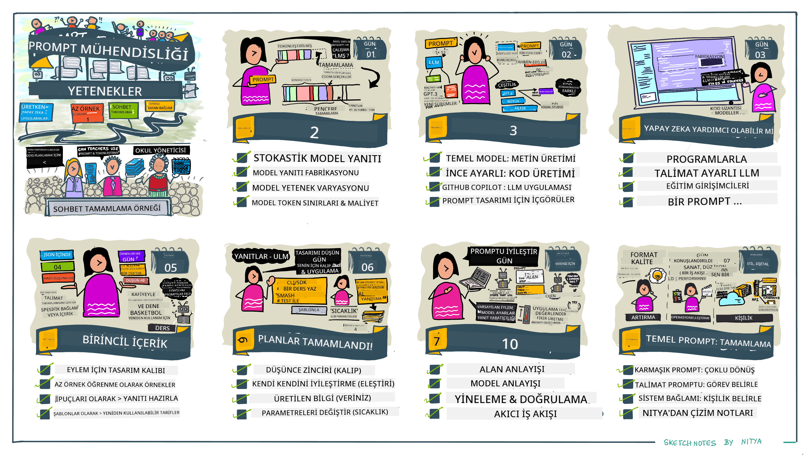
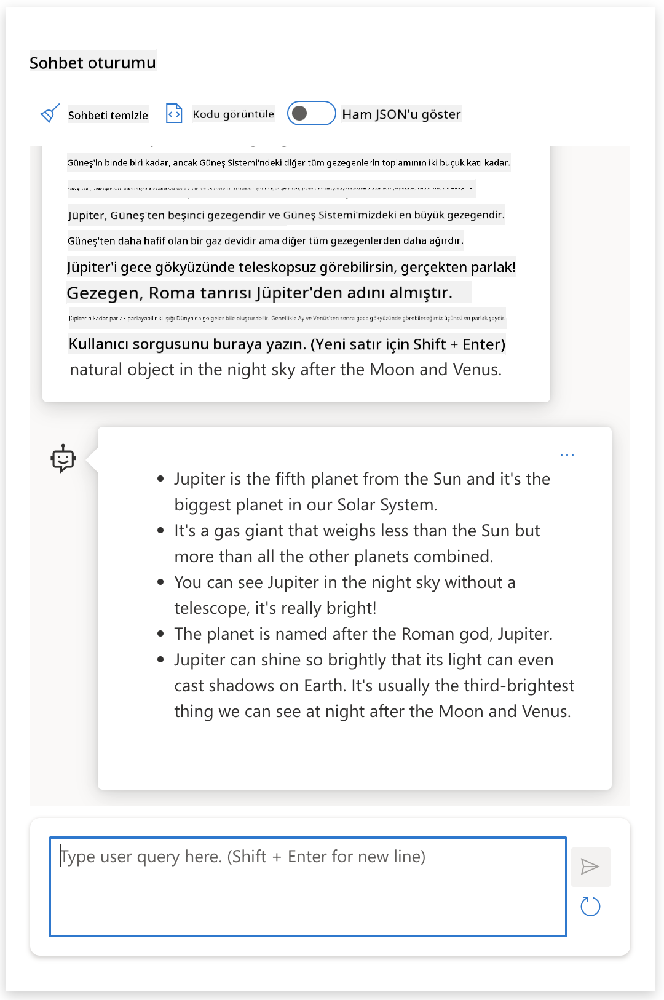

<!--
CO_OP_TRANSLATOR_METADATA:
{
  "original_hash": "a45c318dc6ebc2604f35b8b829f93af2",
  "translation_date": "2025-07-09T10:14:14+00:00",
  "source_file": "04-prompt-engineering-fundamentals/README.md",
  "language_code": "tr"
}
-->
# Prompt Mühendisliğinin Temelleri

[](https://aka.ms/gen-ai-lesson4-gh?WT.mc_id=academic-105485-koreyst)

## GiriÅŸ  
Bu modül, üretken yapay zeka modellerinde etkili promptlar oluşturmak için temel kavramlar ve teknikleri kapsar. Bir LLM’ye yazdığınız promptun şekli de önemlidir. Özenle hazırlanmış bir prompt, daha kaliteli yanıtlar elde etmenizi sağlar. Peki, _prompt_ ve _prompt mühendisliği_ gibi terimler tam olarak ne anlama geliyor? Ve LLM’ye gönderdiğim prompt _girdisini_ nasıl geliştirebilirim? Bu bölümde ve bir sonraki bölümde bu sorulara yanıt arayacağız.

_Uretken yapay zeka_, kullanıcı taleplerine yanıt olarak yeni içerikler (örneÄŸin metin, görsel, ses, kod vb.) oluÅŸturabilir. Bunu, doÄŸal dil ve kod kullanımı için eÄŸitilmiÅŸ OpenAI’nin GPT (“Generative Pre-trained Transformerâ€) serisi gibi _Büyük Dil Modelleri_ (LLM) kullanarak baÅŸarır.

Kullanıcılar artık bu modellerle teknik bilgi veya eğitim gerektirmeden, sohbet gibi tanıdık yöntemlerle etkileşim kurabilirler. Modeller _prompt tabanlıdır_ — kullanıcılar bir metin girdisi (prompt) gönderir ve yapay zekadan yanıt (tamamlama) alır. Ardından, yanıt beklentilerine uyana kadar çok turlu sohbetlerle promptlarını yineleyerek “yapay zeka ile sohbet†edebilirler.

“Promptlar†artık üretken yapay zeka uygulamaları için birincil _programlama arayüzü_ haline gelmiştir; modellere ne yapacaklarını söyler ve dönen yanıtların kalitesini etkiler. “Prompt Mühendisliği†ise, tutarlı ve kaliteli yanıtlar sunmak için promptların _tasarımı ve optimizasyonu_ üzerine hızla büyüyen bir çalışma alanıdır.

## Öğrenme Hedefleri

Bu derste, Prompt Mühendisliği’nin ne olduğunu, neden önemli olduğunu ve belirli bir model ile uygulama hedefi için daha etkili promptlar nasıl oluşturabileceğimizi öğreneceğiz. Prompt mühendisliği için temel kavramları ve en iyi uygulamaları anlayacak; bu kavramların gerçek örneklerde uygulandığı etkileşimli bir Jupyter Notebook “sandbox†ortamını keşfedeceğiz.

Bu dersin sonunda şunları yapabileceğiz:

1. Prompt mühendisliğinin ne olduğunu ve neden önemli olduğunu açıklamak.  
2. Bir promptun bileşenlerini tanımlamak ve nasıl kullanıldığını anlatmak.  
3. Prompt mühendisliği için en iyi uygulamalar ve teknikleri öğrenmek.  
4. Öğrenilen teknikleri gerçek örneklere uygulamak, OpenAI uç noktası kullanarak.

## Temel Terimler

Prompt Mühendisliği: Yapay zeka modellerini istenen çıktıları üretmeye yönlendirmek için girdilerin tasarlanması ve iyileştirilmesi uygulaması.  
Tokenizasyon: Metni, modelin anlayıp işleyebileceği daha küçük birimler olan tokenlara dönüştürme süreci.  
Talimatla İncelenmiş LLM’ler: Yanıt doğruluğu ve alaka düzeyini artırmak için belirli talimatlarla ince ayar yapılmış Büyük Dil Modelleri.

## Öğrenme Sandbox’u

Prompt mühendisliği şu anda daha çok bir sanat dalı. Bu konuda sezgimizi geliştirmek için en iyi yol, _daha fazla pratik yapmak_ ve uygulama alanı uzmanlığını önerilen teknikler ve model özelinde optimizasyonlarla birleştiren deneme-yanılma yaklaşımını benimsemektir.

Bu derse eşlik eden Jupyter Notebook, öğrendiklerinizi deneyebileceğiniz bir _sandbox_ ortamı sunar — ister ilerlerken ister dersin sonunda kod meydan okuması olarak. Alıştırmaları çalıştırmak için şunlara ihtiyacınız olacak:

1. **Bir Azure OpenAI API anahtarı** — dağıtılmış bir LLM için servis uç noktası.  
2. **Bir Python Çalışma Zamanı** — Notebook’un çalıştırılabileceği ortam.  
3. **Yerel Ortam Değişkenleri** — _hazırlık için [SETUP](./../00-course-setup/SETUP.md?WT.mc_id=academic-105485-koreyst) adımlarını tamamlayın_.

Notebook başlangıç alıştırmalarıyla gelir — ancak kendi _Markdown_ (açıklama) ve _Kod_ (prompt istekleri) bölümlerinizi ekleyerek daha fazla örnek veya fikir deneyebilir, prompt tasarımı konusunda sezginizi geliştirebilirsiniz.

## Görselleştirilmiş Rehber

Derse başlamadan önce genel resmi görmek ister misiniz? Bu görselleştirilmiş rehber, ana konuları ve her birinde düşünmeniz gereken temel çıkarımları size sunar. Ders yol haritası, temel kavramları ve zorlukları anlamaktan başlayıp, bunları ilgili prompt mühendisliği teknikleri ve en iyi uygulamalarla ele almaya kadar sizi yönlendirir. Bu rehberdeki “İleri Teknikler†bölümü, müfredatın _bir sonraki_ bölümünde ele alınan içeriğe işaret eder.



## Startup’ımız

Åimdi, _bu konunun_ eÄŸitimde yapay zeka inovasyonunu [getirme](https://educationblog.microsoft.com/2023/06/collaborating-to-bring-ai-innovation-to-education?WT.mc_id=academic-105485-koreyst) misyonumuzla nasıl iliÅŸkili olduÄŸundan bahsedelim. Biz, _kiÅŸiselleÅŸtirilmiÅŸ öğrenme_ için yapay zeka destekli uygulamalar geliÅŸtirmek istiyoruz — o halde uygulamamızın farklı kullanıcılarının nasıl “promptlar tasarlayabileceÄŸini†düşünelim:

- **Yöneticiler**, yapay zekadan _müfredat verilerini analiz ederek kapsama boşluklarını belirlemesini_ isteyebilir. Yapay zeka sonuçları özetleyebilir veya kodla görselleştirebilir.  
- **Eğitmenler**, yapay zekadan _hedef kitle ve konu için bir ders planı oluşturmasını_ talep edebilir. Yapay zeka, kişiselleştirilmiş planı belirli bir formatta hazırlayabilir.  
- **Öğrenciler**, yapay zekadan _zor bir konuda kendilerine özel ders vermesini_ isteyebilir. Yapay zeka, öğrencilerin seviyesine uygun dersler, ipuçları ve örneklerle rehberlik edebilir.

Bu sadece buzdağının görünen kısmı. Daha geniş bir perspektif için eğitim uzmanları tarafından derlenen açık kaynaklı prompt kütüphanesi [Prompts For Education](https://github.com/microsoft/prompts-for-edu/tree/main?WT.mc_id=academic-105485-koreyst)’a göz atın! _Sandbox’ta veya OpenAI Playground’da bu promptları deneyerek ne olduğunu görün!_

<!--  
DERS ÅABLONU:  
Bu birim temel kavram #1’i kapsamalı.  
Kavramı örnekler ve referanslarla pekiştirin.

KAVRAM #1:  
Prompt Mühendisliği.  
Tanımlayın ve neden gerekli olduğunu açıklayın.  
-->

## Prompt Mühendisliği Nedir?

Bu derse, belirli bir uygulama hedefi ve model için tutarlı ve kaliteli yanıtlar (tamalamalar) sunmak üzere metin girdilerini (promptları) _tasarlama ve optimize etme_ süreci olarak **Prompt Mühendisliği** tanımıyla başladık. Bunu iki aşamalı bir süreç olarak düşünebiliriz:

- Belirli bir model ve hedef için başlangıç promptunu _tasarlamak_  
- Yanıt kalitesini artırmak için promptu yineleyerek _iyileştirmek_

Bu, optimal sonuçlar için kullanıcı sezgisi ve çaba gerektiren zorunlu bir deneme-yanılma sürecidir. Peki neden önemli? Bu soruyu yanıtlamak için önce üç kavramı anlamamız gerekiyor:

- _Tokenizasyon_ = modelin promptu nasıl “gördüğü† 
- _Temel LLM’ler_ = temel modelin promptu nasıl “işlediği† 
- _Talimatla İncelenmiş LLM’ler_ = modelin artık “görevleri†nasıl algıladığı

### Tokenizasyon

Bir LLM, promptları _token dizisi_ olarak görür; farklı modeller (veya model sürümleri) aynı promptu farklı şekillerde tokenlara ayırabilir. LLM’ler tokenlar üzerinde (ham metin değil) eğitildiği için, promptların tokenlara dönüşme şekli oluşturulan yanıtın kalitesini doğrudan etkiler.

Tokenizasyonun nasıl çalıştığına dair sezgi kazanmak için aşağıdaki gibi araçları deneyin: [OpenAI Tokenizer](https://platform.openai.com/tokenizer?WT.mc_id=academic-105485-koreyst). Promptunuzu kopyalayın ve tokenlara nasıl dönüştüğüne, boşluk karakterleri ve noktalama işaretlerinin nasıl işlendiğine dikkat edin. Bu örnek eski bir LLM (GPT-3) gösteriyor — daha yeni modellerle denediğinizde farklı sonuçlar alabilirsiniz.


### Kavram: Temel Modeller

Bir prompt tokenlara ayrıldıktan sonra, ["Temel LLM"](https://blog.gopenai.com/an-introduction-to-base-and-instruction-tuned-large-language-models-8de102c785a6?WT.mc_id=academic-105485-koreyst) (veya Temel model) dizideki bir sonraki tokenı tahmin etmekle görevlidir. LLM’ler devasa metin veri kümeleri üzerinde eğitildiği için tokenlar arasındaki istatistiksel ilişkileri iyi bilir ve bu tahmini belli bir güvenle yapabilir. Ancak prompttaki kelimelerin _anlamını_ anlamazlar; sadece bir sonraki tahminle “tamamlayabilecekleri†bir desen görürler. Kullanıcı müdahalesi veya önceden belirlenmiş bir koşul tarafından durdurulana kadar diziyi tahmin etmeye devam edebilirler.

Prompt tabanlı tamamlama nasıl çalışıyor görmek ister misiniz? Yukarıdaki promptu Azure OpenAI Studio [_Chat Playground_](https://oai.azure.com/playground?WT.mc_id=academic-105485-koreyst)’a varsayılan ayarlarla girin. Sistem promptları bilgi talebi olarak ele alacak şekilde yapılandırılmıştır — bu yüzden bu bağlama uygun bir tamamlama görmelisiniz.

Peki ya kullanıcı belirli kriterleri veya görev hedefini karşılayan bir şey görmek isterse? İşte burada _talimatla incelenmiş_ LLM’ler devreye girer.


### Kavram: Talimatla İncelenmiş LLM’ler

Bir [Talimatla Ä°ncelenmiÅŸ LLM](https://blog.gopenai.com/an-introduction-to-base-and-instruction-tuned-large-language-models-8de102c785a6?WT.mc_id=academic-105485-koreyst), temel modelden baÅŸlayıp, açık talimatlar içeren örnekler veya giriÅŸ/çıkış çiftleri (örneÄŸin çok turlu “mesajlarâ€) ile ince ayar yapılır — ve yapay zekanın yanıtı bu talimatı takip etmeye çalışır.

Bu, İnsan Geri Bildirimi ile Pekiştirmeli Öğrenme (RLHF) gibi teknikler kullanır; modelin _talimatları takip etmesini_ ve _geri bildirimden öğrenmesini_ sağlar, böylece pratik uygulamalara daha uygun ve kullanıcı hedeflerine daha alakalı yanıtlar üretir.

Hadi deneyelim — yukarıdaki promptu tekrar açın, ancak _sistem mesajını_ aşağıdaki talimatı içerecek şekilde değiştirin:

> _Size verilen içeriği ikinci sınıf öğrencisi için özetleyin. Sonucu 3-5 madde ile bir paragraf halinde tutun._

Sonucun istenen hedef ve formata göre ayarlandığını görüyor musunuz? Bir eğitimci bu yanıtı doğrudan o sınıf için slaytlarında kullanabilir.



## Neden Prompt Mühendisliğine İhtiyacımız Var?

Artık promptların LLM’ler tarafından nasıl işlendiğini bildiğimize göre, prompt mühendisliğine _neden_ ihtiyaç duyduğumuzu konuşalım. Cevap, mevcut LLM’lerin _güvenilir ve tutarlı tamalamalar_ elde etmeyi zorlaştıran bir dizi zorluk barındırmasında yatıyor. Örneğin:

1. **Model yanıtları rastgeledir.** _Aynı prompt_, farklı modeller veya model sürümleriyle muhtemelen farklı yanıtlar üretir. Hatta _aynı model_ ile farklı zamanlarda farklı sonuçlar verebilir. _Prompt mühendisliği teknikleri, bu varyasyonları azaltmak için daha iyi sınırlar koymamıza yardımcı olur_.

1. **Modeller yanıt uydurabilir.** Modeller, _büyük ama sınırlı_ veri kümeleriyle önceden eğitildiği için eğitim kapsamı dışındaki kavramlar hakkında bilgi eksikliği vardır. Sonuç olarak, yanlış, hayali veya bilinen gerçeklerle çelişen yanıtlar üretebilirler. _Prompt mühendisliği teknikleri, kullanıcıların bu uydurmaları tespit edip azaltmasına yardımcı olur; örneğin yapay zekadan kaynak göstermesini veya mantık yürütmesini istemek gibi_.

1. **Model yetenekleri değişkenlik gösterir.** Yeni modeller veya model nesilleri daha zengin yeteneklere sahip olur ancak maliyet ve karmaşıklıkta benzersiz özellikler ve ödünler getirir. _Prompt mühendisliği, farklılıkları soyutlayan ve model özel gereksinimlere ölçeklenebilir, sorunsuz şekilde uyum sağlayan en iyi uygulamalar ve iş akışları geliştirmemize yardımcı olur_.

Bunu OpenAI veya Azure OpenAI Playground’da deneyelim:

- Aynı promptu farklı LLM dağıtımlarıyla (örneğin OpenAI, Azure OpenAI, Hugging Face) kullanın — varyasyonları gördünüz mü?  
- Aynı promptu _aynı_ LLM dağıtımıyla (örneğin Azure OpenAI playground) tekrar tekrar kullanın — bu varyasyonlar nasıl farklılaştı?

### Uydurma Örneği

Bu kursta, LLM’lerin bazen eÄŸitimlerindeki sınırlamalar veya diÄŸer kısıtlamalar nedeniyle gerçeÄŸe aykırı bilgi üretmesi olgusuna **“uydurmaâ€** terimini kullanıyoruz. Popüler makalelerde veya araÅŸtırma yazılarında buna _“halüsinasyonlarâ€_ da denebilir. Ancak, bu davranışı insan benzeri bir özellikmiÅŸ gibi göstermemek için _“uydurmaâ€_ terimini kullanmanızı ÅŸiddetle tavsiye ediyoruz. Bu aynı zamanda [Sorumlu Yapay Zeka yönergeleri](https://www.microsoft.com/ai/responsible-ai?WT.mc_id=academic-105485-koreyst) açısından da uygun, bazı baÄŸlamlarda saldırgan veya dışlayıcı sayılabilecek terimlerin kullanımını engelleyen bir yaklaşımdır.

Uydurmaların nasıl çalıştığını anlamak ister misiniz? Yapay zekaya eğitim veri setinde bulunmayan hayali bir konu için içerik üretmesini söyleyen bir prompt düşünün. Örneğin — ben şu promptu denedim:
# 2076 Mars Savaşı Ders Planı

## Dersin Amacı
Öğrencilerin 2076 Mars Savaşı'nın nedenlerini, gelişimini ve sonuçlarını anlamalarını sağlamak.

## Ders Süresi
2 saat

## Gerekli Materyaller
- Haritalar ve zaman çizelgeleri
- Video ve görsel materyaller
- Tartışma soruları

## Ders Akışı

### 1. GiriÅŸ (15 dakika)
- 2076 Mars Savaşı'nın genel tanıtımı
- Savaşın tarihsel bağlamı ve önemi

### 2. Savaşın Nedenleri (20 dakika)
- Mars'taki kaynak rekabeti
- Politik ve ekonomik gerilimler
- Teknolojik geliÅŸmelerin etkisi

### 3. Savaşın Gelişimi (30 dakika)
- Önemli çatışmalar ve stratejiler
- Tarafların kullandığı teknolojiler
- Kritik dönüm noktaları

### 4. Sonuçlar ve Etkiler (25 dakika)
- Savaşın Mars ve Dünya üzerindeki etkileri
- Uzay politikalarındaki değişiklikler
- Uzun vadeli sonuçlar

### 5. Tartışma ve Değerlendirme (20 dakika)
- Öğrencilerle grup tartışması
- Savaşın günümüzle bağlantıları
- Soru-cevap bölümü

## DeÄŸerlendirme
- Katılım ve tartışma performansı
- Kısa yazılı sınav veya ödev

## Ek Notlar
- Ders sırasında görsel materyallerin kullanımı teşvik edilir.
- Öğrencilerin aktif katılımı önemlidir.
Bir web araması, Mars savaşlarıyla ilgili kurgusal hikayeler (örneğin, televizyon dizileri veya kitaplar) olduğunu gösterdi - ancak 2076 yılında geçen hiçbir şey yok. Sağduyu da bize 2076'nın _gelecekte_ olduğunu ve dolayısıyla gerçek bir olayla ilişkilendirilemeyeceğini söylüyor.

Peki, bu istemi farklı LLM sağlayıcılarıyla çalıştırdığımızda ne oluyor?

> **Yanıt 1**: OpenAI Playground (GPT-35)


> **Yanıt 2**: Azure OpenAI Playground (GPT-35)


> **Yanıt 3**: : Hugging Face Chat Playground (LLama-2)


Beklendiği gibi, her model (veya model versiyonu) stokastik davranış ve model yeteneklerindeki farklılıklar nedeniyle biraz farklı yanıtlar üretiyor. Örneğin, bir model 8. sınıf öğrencisini hedeflerken diğeri lise öğrencisi varsayıyor. Ancak üç model de, bilgisiz bir kullanıcıyı bu olayın gerçek olduğuna ikna edebilecek yanıtlar üretti.

_metaprompting_ ve _temperature configuration_ gibi istem mühendisliği teknikleri, model uydurmalarını bir ölçüde azaltabilir. Yeni istem mühendisliği _mimari_leri, bu etkileri hafifletmek veya azaltmak için yeni araçları ve teknikleri istem akışına sorunsuzca entegre eder.

## Vaka Çalışması: GitHub Copilot

Bu bölümü, gerçek dünya çözümlerinde istem mühendisliğinin nasıl kullanıldığını anlamak için bir Vaka Çalışması ile tamamlayalım: [GitHub Copilot](https://github.com/features/copilot?WT.mc_id=academic-105485-koreyst).

GitHub Copilot, sizin "Yapay Zeka Eş Programcınız"dır - metin istemlerini kod tamamlama önerilerine dönüştürür ve geliştirme ortamınıza (örneğin, Visual Studio Code) entegre edilmiştir, böylece kesintisiz bir kullanıcı deneyimi sunar. Aşağıdaki blog serisinde belgelenen üzere, en erken versiyon OpenAI Codex modeline dayanıyordu - mühendisler modelin ince ayar yapılması ve daha iyi istem mühendisliği tekniklerinin geliştirilmesi gerektiğini hızla fark ettiler, böylece kod kalitesi artırıldı. Temmuz ayında, [Codex’in ötesine geçen geliştirilmiş bir yapay zeka modeli](https://github.blog/2023-07-28-smarter-more-efficient-coding-github-copilot-goes-beyond-codex-with-improved-ai-model/?WT.mc_id=academic-105485-koreyst) tanıttılar ve öneriler daha da hızlandı.

Öğrenme yolculuklarını takip etmek için yazıları sırasıyla okuyun.

- **Mayıs 2023** | [GitHub Copilot Kodunuzu Anlamada Daha İyi Oluyor](https://github.blog/2023-05-17-how-github-copilot-is-getting-better-at-understanding-your-code/?WT.mc_id=academic-105485-koreyst)
- **Mayıs 2023** | [GitHub İçinde: GitHub Copilot’un Arkasındaki LLM’lerle Çalışmak](https://github.blog/2023-05-17-inside-github-working-with-the-llms-behind-github-copilot/?WT.mc_id=academic-105485-koreyst)
- **Haziran 2023** | [GitHub Copilot için Daha İyi İstemler Nasıl Yazılır](https://github.blog/2023-06-20-how-to-write-better-prompts-for-github-copilot/?WT.mc_id=academic-105485-koreyst)
- **Temmuz 2023** | [GitHub Copilot, Geliştirilmiş Yapay Zeka Modeliyle Codex’in Ötesine Geçiyor](https://github.blog/2023-07-28-smarter-more-efficient-coding-github-copilot-goes-beyond-codex-with-improved-ai-model/?WT.mc_id=academic-105485-koreyst)
- **Temmuz 2023** | [Bir Geliştirici için İstem Mühendisliği ve LLM Rehberi](https://github.blog/2023-07-17-prompt-engineering-guide-generative-ai-llms/?WT.mc_id=academic-105485-koreyst)
- **Eylül 2023** | [Kurumsal Bir LLM Uygulaması Nasıl Kurulur: GitHub Copilot’tan Dersler](https://github.blog/2023-09-06-how-to-build-an-enterprise-llm-application-lessons-from-github-copilot/?WT.mc_id=academic-105485-koreyst)

Ayrıca, bu modellerin ve tekniklerin gerçek dünya uygulamalarını nasıl _uyguladığını_ gösteren [Mühendislik bloglarını](https://github.blog/category/engineering/?WT.mc_id=academic-105485-koreyst) ve [bu yazı gibi](https://github.blog/2023-09-27-how-i-used-github-copilot-chat-to-build-a-reactjs-gallery-prototype/?WT.mc_id=academic-105485-koreyst) diğer gönderileri de inceleyebilirsiniz.

---

<!--
DERS ÅABLONU:
Bu ünite temel kavram #2’yi kapsamalıdır.
Kavramı örnekler ve referanslarla pekiştirin.

KAVRAM #2:
İstem Tasarımı.
Örneklerle açıklanmıştır.
-->

## Ä°stem OluÅŸturma

İstem mühendisliğinin neden önemli olduğunu gördük - şimdi istemlerin nasıl _oluşturulduğunu_ anlayalım ki, daha etkili istem tasarımı için farklı teknikleri değerlendirebilelim.

### Temel Ä°stem

Temel istemle başlayalım: modele başka bir bağlam vermeden gönderilen metin girişi. İşte bir örnek - ABD milli marşının ilk birkaç kelimesini OpenAI [Completion API](https://platform.openai.com/docs/api-reference/completions?WT.mc_id=academic-105485-koreyst)’ye gönderdiğimizde, model hemen sonraki birkaç satırı _tamamlayarak_ temel tahmin davranışını gösteriyor.

| İstem (Girdi)     | Tamamlama (Çıktı)                                                                                                                        |
| :---------------- | :----------------------------------------------------------------------------------------------------------------------------------------- |
| Oh say can you see | ABD’nin milli marşı "The Star-Spangled Banner"ın sözlerine başladığınız anlaşılıyor. Tam sözleri şunlardır ... |

### Karmaşık İstem

Åimdi temel isteme baÄŸlam ve talimatlar ekleyelim. [Chat Completion API](https://learn.microsoft.com/azure/ai-services/openai/how-to/chatgpt?WT.mc_id=academic-105485-koreyst), bir dizi _mesaj_ olarak karmaşık bir istem oluÅŸturmamıza olanak tanır:

- _kullanıcı_ girdisi ve _asistan_ yanıtını yansıtan giriş/çıkış çiftleri.
- Asistan davranışı veya kişiliği için bağlamı belirleyen sistem mesajı.

İstek artık aşağıdaki biçimdedir; burada _tokenizasyon_, bağlam ve konuşmadan ilgili bilgileri etkili şekilde yakalar. Sistem bağlamını değiştirmek, sağlanan kullanıcı girdileri kadar tamamlama kalitesini etkileyebilir.

```python
response = openai.chat.completions.create(
    model="gpt-3.5-turbo",
    messages=[
        {"role": "system", "content": "You are a helpful assistant."},
        {"role": "user", "content": "Who won the world series in 2020?"},
        {"role": "assistant", "content": "The Los Angeles Dodgers won the World Series in 2020."},
        {"role": "user", "content": "Where was it played?"}
    ]
)
```

### Talimat Ä°stemi

Yukarıdaki örneklerde, kullanıcı istemi bilgi talebi olarak yorumlanabilecek basit bir metin sorgusuydu. _Talimat_ istemlerinde, bu metni yapay zekaya daha iyi rehberlik etmek için bir görevi daha ayrıntılı belirtmek için kullanabiliriz. İşte bir örnek:

| İstem (Girdi)                                                                                                                                                                                                                         | Tamamlama (Çıktı)                                                                                                        | Talimat Türü       |
| :------------------------------------------------------------------------------------------------------------------------------------------------------------------------------------------------------------------------------------- | :------------------------------------------------------------------------------------------------------------------------- | :------------------ |
| Write a description of the Civil War                                                                                                                                                                                                   | _basit bir paragraf döndürüldü_                                                                                           | Basit              |
| Write a description of the Civil War. Provide key dates and events and describe their significance                                                                                                                                     | _bir paragraf ve ardından önemli olay tarihleri ile açıklamalar içeren bir liste döndürüldü_                               | Karmaşık           |
| Write a description of the Civil War in 1 paragraph. Provide 3 bullet points with key dates and their significance. Provide 3 more bullet points with key historical figures and their contributions. Return the output as a JSON file | _daha kapsamlı detaylar içeren, JSON formatında ve dosyaya yapıştırılıp doğrulanabilecek bir metin kutusu döndürür_         | Karmaşık. Formatlı. |

## Birincil İçerik

Yukarıdaki örneklerde, istem hâlâ oldukça açık uçluydu ve LLM, önceden eğitildiği veri kümesinin hangi kısmının ilgili olduğuna karar verebiliyordu. _Birincil içerik_ tasarım deseninde, giriş metni iki bölüme ayrılır:

- bir talimat (eylem)
- eylemi etkileyen ilgili içerik

İşte talimatın "bunu 2 cümlede özetle" olduğu bir örnek.

| İstem (Girdi)                                                                                                                                                                                                                                                                                                                                                                                                                                                                                                                                                                                                                                                                                      | Tamamlama (Çıktı)                                                                                                                                                                                                                                                                             |
| :-------------------------------------------------------------------------------------------------------------------------------------------------------------------------------------------------------------------------------------------------------------------------------------------------------------------------------------------------------------------------------------------------------------------------------------------------------------------------------------------------------------------------------------------------------------------------------------------------------------------------------------------------------------------------------------------------- | :---------------------------------------------------------------------------------------------------------------------------------------------------------------------------------------------------------------------------------------------------------------------------------------------- |
| Jüpiter, Güneş'ten beşinci gezegen ve Güneş Sistemi'nin en büyüğüdür. Güneş'in kütlesinin binde biri kadar bir kütleye sahip bir gaz devidir, ancak Güneş Sistemi'ndeki diğer tüm gezegenlerin toplam kütlesinin iki buçuk katıdır. Jüpiter, çıplak gözle görülebilen en parlak nesnelerden biridir ve kayıtlı tarihten önceki eski uygarlıklar tarafından bilinmektedir. Roma tanrısı Jüpiter'in adını taşır.[19] Dünya'dan bakıldığında, yansıyan ışığı görünür gölgeler oluşturacak kadar parlak olabilir,[20] ve ortalama olarak Ay ve Venüs'ten sonra gece gökyüzündeki üçüncü en parlak doğal nesnedir. <br/> **Bunu 2 kısa cümlede özetle** | Jüpiter, Güneş'ten beşinci gezegen olup Güneş Sistemi'nin en büyüğüdür ve gece gökyüzündeki en parlak nesnelerden biridir. Roma tanrısı Jüpiter'in adını taşıyan bu gaz devi, Güneş Sistemi'ndeki diğer tüm gezegenlerin toplam kütlesinin iki buçuk katına sahiptir. |

Birincil içerik bölümü, daha etkili talimatlar vermek için çeşitli şekillerde kullanılabilir:

- **Örnekler** - modele açık bir talimat vermek yerine, ne yapılacağını gösteren örnekler verip kalıbı çıkarmasını sağlamak.
- **İpuçları** - talimatı, tamamlamayı yönlendiren ve modeli daha ilgili yanıtlar vermeye teşvik eden bir "ipuçları" ile takip etmek.
- **Åablonlar** - belirli kullanım durumları için verilerle özelleÅŸtirilebilen yer tutucular (deÄŸiÅŸkenler) içeren tekrarlanabilir istem "tarifleri".

Bunları uygulamada inceleyelim.

### Örnek Kullanımı

Bu yaklaşımda, bir talimat için istenen çıktının bazı örneklerini modele "besleyip", modelin istenen çıktı kalıbını çıkarmasını sağlıyoruz. Verilen örnek sayısına göre sıfır-atış (zero-shot), tek-atış (one-shot), birkaç-atış (few-shot) istemleri olabilir.

İstem artık üç bileşenden oluşur:

- Bir görev tanımı
- İstenen çıktının birkaç örneği
- Yeni bir örneğin başlangıcı (bu, örtük bir görev tanımı olur)

| Öğrenme Türü | İstem (Girdi)                                                                                                                                        | Tamamlama (Çıktı)         |
| :------------ | :---------------------------------------------------------------------------------------------------------------------------------------------------- | :-------------------------- |
| Sıfır-atış   | "The Sun is Shining". İspanyolcaya çevir                                                                                                            | "El Sol está brillando".    |
| Tek-atış     | "The Sun is Shining" => "El Sol está brillando". <br> "It's a Cold and Windy Day" =>                                                                 | "Es un día frío y ventoso". |
| Birkaç-atış  | Oyuncu üsleri koştu => Beyzbol <br/> Oyuncu ace vurdu => Tenis <br/> Oyuncu altı vurdu => Kriket <br/> Oyuncu smaç yaptı =>                          | Basketbol                  |
|              |                                                                                                                                                       |                             |

Sıfır-atış istemde açık talimat ("İspanyolcaya çevir") vermemiz gerektiğini, ancak tek-atış örnekte bunun çıkarıldığını fark edin. Birkaç-atış örneği, daha fazla örnek eklemenin modele ek talimat olmadan daha doğru çıkarımlar yapma imkanı sağladığını gösterir.

### İstem İpuçları

Birincil içeriği kullanmanın bir diğer yöntemi, örnekler yerine _ipuçları_ sağlamaktır. Bu durumda, modele istenen yanıt formatını yansıtan bir parçayla _başlayarak_ onu doğru yöne yönlendiriyoruz. Model, bu "ipuçunu alır" ve aynı tarzda devam eder.

| İpucu Sayısı | İstem (Girdi)                                                                                                                                                                                                                                                                                                                                                                                                                                               | Tamamlama (Çıktı)                                                                                                                                                                                                                                                                                       |
| :------------ | :----------------------------------------------------------------------------------------------------------------------------------------------------------------------------------------------------------------------------------------------------------------------------------------------------------------------------------------------------------------------------------------------------------------------------------------------------------- | :-------------------------------------------------------------------------------------------------------------------------------------------------------------------------------------------------------------------------------------------------------------------------------------------------------- |
| 0             | Jüpiter, Güneş'ten beşinci gezegen ve Güneş Sistemi'nin en büyüğüdür. Güneş'in kütlesinin binde biri kadar bir kütleye sahip bir gaz devidir, ancak Güneş Sistemi'ndeki diğer tüm gezegenlerin toplam kütlesinin iki buçuk katıdır. Jüpiter, çıplak gözle görülebilen en parlak nesnelerden biridir ve kayıtlı tarihten önceki eski uygarlıklar tarafından bilinmektedir.

**Bunu Özetle**                                       | Jüpiter, Güneş Sistemi'ndeki en büyük gezegen ve Güneş'ten beşinci sıradadır. Güneş'in kütlesinin 1/1000'i kadar olan bir gaz devidir, ancak diğer tüm gezegenlerin toplamından daha ağırdır. Antik uygarlıklar Jüpiter'i uzun zamandır bilmektedir ve gece gökyüzünde kolayca görülebilir. |
| 1              | Jüpiter, Güneş'ten beşinci gezegen ve Güneş Sistemi'nin en büyüğüdür. Güneş'in kütlesinin binde biri kadar olan bir gaz devidir, ancak Güneş Sistemi'ndeki diğer tüm gezegenlerin toplam kütlesinin iki buçuk katıdır. Jüpiter, çıplak gözle gece gökyüzünde görülebilen en parlak cisimlerden biridir ve kayıtlı tarihten önceki antik uygarlıklar tarafından bilinmektedir. <br/>**Bunu Özetle** <br/> Öğrendiğimiz şey, Jüpiter'in | Güneş'ten beşinci gezegen ve Güneş Sistemi'nin en büyüğü olduğudur. Güneş'in kütlesinin binde biri kadar olan bir gaz devidir, ancak diğer tüm gezegenlerin toplam kütlesinin iki buçuk katıdır. Çıplak gözle kolayca görülebilir ve antik çağlardan beri bilinmektedir.                        |
| 2              | Jüpiter, Güneş'ten beşinci gezegen ve Güneş Sistemi'nin en büyüğüdür. Güneş'in kütlesinin binde biri kadar olan bir gaz devidir, ancak Güneş Sistemi'ndeki diğer tüm gezegenlerin toplam kütlesinin iki buçuk katıdır. Jüpiter, çıplak gözle gece gökyüzünde görülebilen en parlak cisimlerden biridir ve kayıtlı tarihten önceki antik uygarlıklar tarafından bilinmektedir. <br/>**Bunu Özetle** <br/> Öğrendiğimiz En Önemli 3 Gerçek:         | 1. Jüpiter, Güneş'ten beşinci gezegen ve Güneş Sistemi'nin en büyüğüdür. <br/> 2. Güneş'in kütlesinin binde biri kadar bir gaz devidir...<br/> 3. Jüpiter, antik çağlardan beri çıplak gözle görülebilmektedir...                                                                       |
|                |                                                                                                                                                                                                                                                                                                                                                                                                                                                              |                                                                                                                                                                                                                                                                                                           |

### Ä°stek Åablonları

İstek şablonu, _önceden tanımlanmış bir istek reçetesi_ olup, ihtiyaç duyulduğunda saklanabilir ve yeniden kullanılabilir; böylece daha tutarlı kullanıcı deneyimleri ölçeklendirilerek sağlanabilir. En basit haliyle, [OpenAI’den bu örnek](https://platform.openai.com/examples?WT.mc_id=academic-105485-koreyst) gibi, hem etkileşimli istek bileşenlerini (kullanıcı ve sistem mesajları) hem de API tabanlı istek formatını içeren bir istek örnekleri koleksiyonudur - yeniden kullanım için destek sağlar.

Daha karmaşık bir biçimde, [LangChain’den bu örnek](https://python.langchain.com/docs/concepts/prompt_templates/?WT.mc_id=academic-105485-koreyst) gibi, _yer tutucular_ içerir ve bunlar çeşitli kaynaklardan (kullanıcı girişi, sistem bağlamı, dış veri kaynakları vb.) gelen verilerle değiştirilebilir; böylece dinamik olarak bir istek oluşturulabilir. Bu, programatik olarak tutarlı kullanıcı deneyimleri sağlamak için yeniden kullanılabilir istek kütüphaneleri oluşturmamıza olanak tanır.

Son olarak, şablonların gerçek değeri, dikey uygulama alanları için _istek kütüphaneleri_ oluşturup yayımlama yeteneğinde yatar - burada istek şablonu, uygulamaya özgü bağlam veya örnekleri yansıtacak şekilde _optimize edilir_, böylece yanıtlar hedeflenen kullanıcı kitlesi için daha alakalı ve doğru olur. [Prompts For Edu](https://github.com/microsoft/prompts-for-edu?WT.mc_id=academic-105485-koreyst) deposu, eğitim alanı için ders planlama, müfredat tasarımı, öğrenci rehberliği gibi temel hedeflere vurgu yaparak istek kütüphaneleri derleyen bu yaklaşımın harika bir örneğidir.

## Destekleyici İçerik

İstek yapısını bir talimat (görev) ve hedef (birincil içerik) olarak düşünürsek, _ikincil içerik_ ise **çıktıyı bir şekilde etkilemek için** sağladığımız ek bağlam gibidir. Bu, modelin yanıtını istenen kullanıcı hedeflerine veya beklentilerine uygun hale getirmesine yardımcı olabilecek ayar parametreleri, biçimlendirme talimatları, konu taksonomileri vb. olabilir.

Örneğin: Müfredattaki tüm mevcut kurslar hakkında kapsamlı meta veriler (isim, açıklama, seviye, meta etiketler, eğitmen vb.) içeren bir kurs kataloğu verildiğinde:

- "2023 Güz dönemi kurs kataloğunu özetle" talimatını tanımlayabiliriz
- Birincil içerik olarak istenen çıktının birkaç örneğini sağlayabiliriz
- İkincil içerik olarak en çok ilgi gören 5 "etiketi" belirtebiliriz.

Model, birkaç örnekle gösterilen formatta bir özet sunabilir - ancak bir sonuçta birden fazla etiket varsa, ikincil içerikte belirlenen 5 etikete öncelik verebilir.

---

<!--
DERS ÅABLONU:
Bu birim temel kavram #1'i kapsamalıdır.
Kavramı örnekler ve referanslarla pekiştirin.

KAVRAM #3:
İstek Mühendisliği Teknikleri.
İstek mühendisliği için bazı temel teknikler nelerdir?
Birkaç alıştırmayla gösterin.
-->

## İstek Hazırlamada En İyi Uygulamalar

Artık isteklerin nasıl _oluşturulabileceğini_ bildiğimize göre, onları en iyi uygulamaları yansıtacak şekilde nasıl _tasarlayacağımızı_ düşünmeye başlayabiliriz. Bunu iki bölümde düşünebiliriz - doğru _zihniyete_ sahip olmak ve doğru _teknikleri_ uygulamak.

### İstek Mühendisliği Zihniyeti

İstek mühendisliği deneme-yanılma sürecidir, bu yüzden üç geniş rehber faktörü aklınızda tutun:

1. **Alan Bilgisi Önemlidir.** Yanıt doğruluğu ve alaka, uygulamanın veya kullanıcının faaliyet gösterdiği _alan_ ile ilgilidir. Teknikleri daha da **özelleştirmek** için sezginizi ve alan uzmanlığınızı kullanın. Örneğin, sistem isteklerinizde _alan-spesifik kişilikler_ tanımlayın veya kullanıcı isteklerinde _alan-spesifik şablonlar_ kullanın. Alan-spesifik bağlamları yansıtan ikincil içerik sağlayın veya modeli tanıdık kullanım kalıplarına yönlendirmek için _alan-spesifik ipuçları ve örnekler_ kullanın.

2. **Modeli Anlamak Önemlidir.** Modellerin doğası gereği stokastik olduğunu biliyoruz. Ancak model uygulamaları, kullandıkları eğitim veri seti (önceden eğitilmiş bilgi), sağladıkları yetenekler (örneğin API veya SDK aracılığıyla) ve optimize edildikleri içerik türü (kod, görsel, metin vb.) açısından farklılık gösterebilir. Kullandığınız modelin güçlü ve zayıf yönlerini anlayın ve bu bilgiyi _görev önceliklendirmesi_ yapmak veya modelin yeteneklerine göre optimize edilmiş _özelleştirilmiş şablonlar_ oluşturmak için kullanın.

3. **Yineleme ve Doğrulama Önemlidir.** Modeller hızla gelişiyor, istek mühendisliği teknikleri de öyle. Bir alan uzmanı olarak, _kendi_ uygulamanız için topluluğun geneline uymayabilecek başka bağlamlar veya kriterleriniz olabilir. İstek mühendisliği araçları ve tekniklerini kullanarak istek oluşturmayı "hızlandırın", ardından sonuçları kendi sezginiz ve alan uzmanlığınızla yineleyin ve doğrulayın. Edindiğiniz bilgileri kaydedin ve başkalarının daha hızlı yinelemeler yapabilmesi için bir **bilgi tabanı** (örneğin istek kütüphaneleri) oluşturun.

## En Ä°yi Uygulamalar

Åimdi [OpenAI](https://help.openai.com/en/articles/6654000-best-practices-for-prompt-engineering-with-openai-api?WT.mc_id=academic-105485-koreyst) ve [Azure OpenAI](https://learn.microsoft.com/azure/ai-services/openai/concepts/prompt-engineering#best-practices?WT.mc_id=academic-105485-koreyst) uzmanlarının önerdiÄŸi yaygın en iyi uygulamalara bakalım.

| Ne Yapmalı                       | Neden                                                                                                                                                                                                                                             |
| :------------------------------ | :------------------------------------------------------------------------------------------------------------------------------------------------------------------------------------------------------------------------------------------------ |
| En yeni modelleri değerlendirin | Yeni model nesilleri muhtemelen geliştirilmiş özellikler ve kalite sunar - ancak maliyetleri de daha yüksek olabilir. Etkisini değerlendirin ve ardından geçiş kararları alın.                                                                       |
| Talimatları ve bağlamı ayırın   | Modelinizin/sağlayıcınızın talimatları, birincil ve ikincil içeriği daha net ayırmak için _sınırlandırıcılar_ tanımlayıp tanımlamadığını kontrol edin. Bu, modellerin tokenlere daha doğru ağırlık vermesine yardımcı olabilir.                      |
| Spesifik ve net olun            | İstenen bağlam, sonuç, uzunluk, format, stil vb. hakkında daha fazla detay verin. Bu, yanıtların kalitesini ve tutarlılığını artırır. Tarifleri yeniden kullanılabilir şablonlarda yakalayın.                                                     |
| Betimleyici olun, örnekler kullanın | Modeller "göster ve anlat" yaklaşımına daha iyi yanıt verebilir. Önce örneksiz `sıfır atış` talimat verin, sonra istenen çıktının birkaç örneğini sağlayarak `birkaç atış` ile iyileştirin. Benzetmeler kullanın.                                   |
| Tamamlama için ipuçları kullanın | Yanıtı istenen sonuca yönlendirmek için başlangıç noktası olarak kullanabileceği bazı kelime veya ifadeler verin.                                                                                                                                |
| Tekrar edin                     | Bazen modeli tekrar etmek gerekebilir. Birincil içeriğinizden önce ve sonra talimat verin, talimat ve ipucu kullanın vb. Ne işe yaradığını görmek için yineleyin ve doğrulayın.                                                                    |
| Sıra Önemlidir                  | Bilgileri modele sunma sırası çıktı üzerinde etkili olabilir, öğrenme örneklerinde bile yakınlık yanlılığı nedeniyle. En iyi sonucu görmek için farklı seçenekleri deneyin.                                                                       |
| Modele bir “çıkış†verin        | Modelin herhangi bir nedenle görevi tamamlayamadığında sunabileceği bir _geri dönüş_ yanıtı verin. Bu, modelin yanlış veya uydurma yanıtlar üretme olasılığını azaltabilir.                                                                      |
|                                |                                                                                                                                                                                                                                                   |

Herhangi bir en iyi uygulamada olduğu gibi, _deneyiminiz modele, göreve ve alana bağlı olarak değişebilir_. Bunları bir başlangıç noktası olarak kullanın ve sizin için en iyi olanı bulmak için yineleyin. Yeni modeller ve araçlar çıktıkça istek mühendisliği sürecinizi sürekli yeniden değerlendirin; süreç ölçeklenebilirliği ve yanıt kalitesine odaklanın.

<!--
DERS ÅABLONU:
Bu birim uygun ise bir kod meydan okuması sağlamalıdır

MEYDAN OKUMA:
Yalnızca kod yorumlarının talimatlarda olduğu (kod bölümleri boş) bir Jupyter Notebook bağlantısı.

ÇÖZÜM:
İsteklerin doldurulduğu ve çalıştırıldığı, bir örnek çıktıyı gösteren o Notebook’un kopyasına bağlantı.
-->

## Ödev

Tebrikler! Dersin sonuna geldiniz! Åimdi bu kavram ve tekniklerden bazılarını gerçek örneklerle test etme zamanı!

Ödevimiz için, etkileşimli olarak tamamlayabileceğiniz alıştırmalar içeren bir Jupyter Notebook kullanacağız. Kendi Markdown ve Kod hücrelerinizle Notebook’u genişleterek fikir ve teknikleri kendi başınıza keşfedebilirsiniz.

### Başlamak için, repoyu çatallayın, sonra

- (Önerilen) GitHub Codespaces’i başlatın
- (Alternatif) Repoyu yerel cihazınıza klonlayın ve Docker Desktop ile kullanın
- (Alternatif) Tercih ettiğiniz Notebook çalışma ortamıyla Notebook’u açın.

### Sonra, ortam değişkenlerinizi yapılandırın

- Repo kökünde bulunan `.env.copy` dosyasını `.env` olarak kopyalayın ve `AZURE_OPENAI_API_KEY`, `AZURE_OPENAI_ENDPOINT` ve `AZURE_OPENAI_DEPLOYMENT` değerlerini doldurun. Nasıl yapılacağını öğrenmek için [Learning Sandbox bölümüne](../../../04-prompt-engineering-fundamentals/04-prompt-engineering-fundamentals) geri dönün.

### Sonra, Jupyter Notebook’u açın

- Çalışma zamanı çekirdeğini seçin. 1. veya 2. seçeneği kullanıyorsanız, geliştirici konteynerinin sağladığı varsayılan Python 3.10.x çekirdeğini seçmeniz yeterlidir.

Alıştırmaları çalıştırmaya hazırsınız. Burada _doğru ya da yanlış_ cevaplar yoktur - sadece deneme-yanılma yoluyla seçenekleri keşfetmek ve belirli bir model ve uygulama alanı için neyin işe yaradığını sezgisel olarak anlamak amaçlanır.

_Bu nedenle, bu derste Kod Çözümü bölümleri yoktur. Bunun yerine, Notebook’ta "Çözümüm:" başlıklı Markdown hücreleri olacak ve referans için bir örnek çıktı gösterecektir._

 <!--
DERS ÅABLONU:
Bölümü özet ve kendi kendine öğrenme kaynakları ile sar.
-->

## Bilgi Kontrolü

Aşağıdakilerden hangisi makul en iyi uygulamalara uygun iyi bir istektir?

1. Bana kırmızı bir arabanın resmini göster
2. Bana kırmızı, Volvo marka ve XC90 model, bir uçurum kenarında güneş batarken park etmiş bir arabanın resmini göster
3. Bana kırmızı, Volvo marka ve XC90 model bir arabanın resmini göster

Cevap: 2, çünkü "ne" olduğu hakkında detay verir ve spesifiklere iner (sadece herhangi bir araba değil, belirli marka ve model) ayrıca genel ortamı da tanımlar. 3 ikinci en iyisidir çünkü o da çok sayıda açıklama içerir.

## 🚀 Meydan Okuma

"İpucu" tekniğini şu istekle kullanabilir misiniz: Cümleyi tamamla "Bana kırmızı, Volvo marka ve " ile başlayan bir arabanın resmini göster. Ne yanıt veriyor ve nasıl geliştirirsiniz?

## Harika İş! Öğrenmeye Devam Et

Farklı İstek Mühendisliği kavramları hakkında daha fazla bilgi edinmek ister misiniz? Bu konudaki diğer harika kaynakları bulmak için [devam eden öğrenme sayfasına](https://aka.ms/genai-collection?WT.mc_id=academic-105485-koreyst) gidin.

Bir sonraki derse, [ileri düzey istek tekniklerine](../05-advanced-prompts/README.md?WT.mc_id=academic-105485-koreyst) bakacağımız Ders 5’e geçin!

**Feragatname**:  
Bu belge, AI çeviri servisi [Co-op Translator](https://github.com/Azure/co-op-translator) kullanılarak çevrilmiştir. Doğruluk için çaba göstersek de, otomatik çevirilerin hatalar veya yanlışlıklar içerebileceğini lütfen unutmayınız. Orijinal belge, kendi dilinde yetkili kaynak olarak kabul edilmelidir. Kritik bilgiler için profesyonel insan çevirisi önerilir. Bu çevirinin kullanımı sonucu oluşabilecek yanlış anlamalar veya yorum hatalarından sorumlu değiliz.