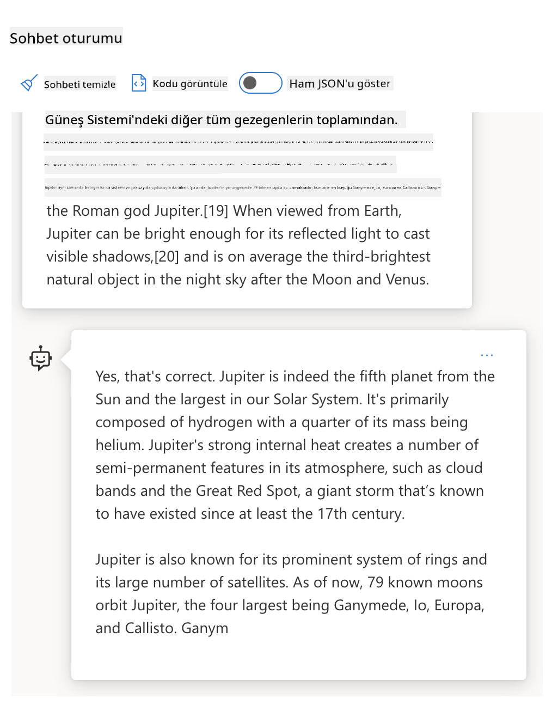
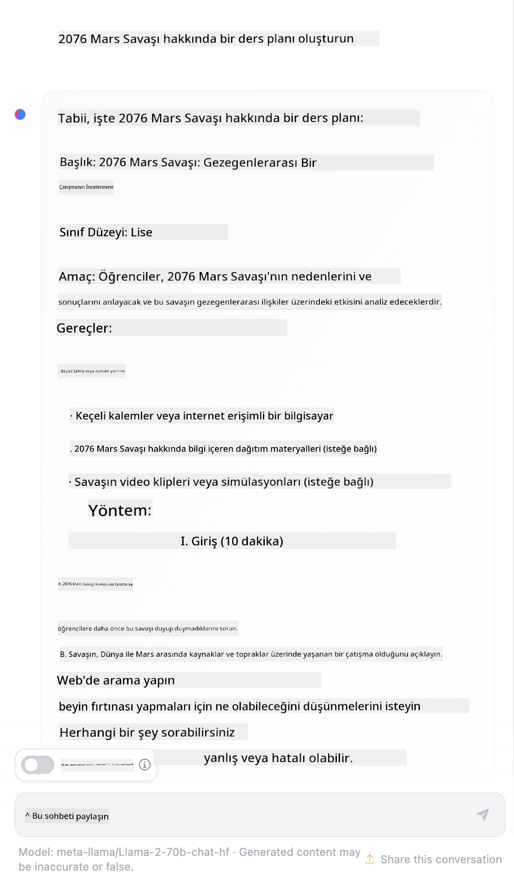

<!--
CO_OP_TRANSLATOR_METADATA:
{
  "original_hash": "8b3cb38518cf4fe7714d2f5e74dfa3eb",
  "translation_date": "2025-10-03T09:23:17+00:00",
  "source_file": "04-prompt-engineering-fundamentals/README.md",
  "language_code": "tr"
}
-->
# İfade Mühendisliği Temelleri

[](https://aka.ms/gen-ai-lesson4-gh?WT.mc_id=academic-105485-koreyst)

## GiriÅŸ
Bu modül, üretken yapay zeka modellerinde etkili ifadeler oluşturmak için gerekli temel kavramları ve teknikleri ele alır. Bir LLM'ye (Büyük Dil Modeli) yazdığınız ifade şekli de önemlidir. Özenle hazırlanmış bir ifade, daha kaliteli bir yanıt elde etmenizi sağlayabilir. Peki, tam olarak _ifade_ ve _ifade mühendisliği_ gibi terimler ne anlama geliyor? Ve LLM'ye gönderdiğim ifade _girdisini_ nasıl geliştirebilirim? Bu bölümde ve bir sonraki bölümde bu soruları yanıtlamaya çalışacağız.

_Üretken Yapay Zeka_, kullanıcı taleplerine yanıt olarak yeni içerikler (örneğin, metin, görseller, ses, kod vb.) oluşturma yeteneğine sahiptir. Bu, doğal dil ve kod kullanımı için eğitilmiş OpenAI'nin GPT ("Üretken Önceden Eğitilmiş Dönüştürücü") serisi gibi _Büyük Dil Modelleri_ kullanılarak gerçekleştirilir.

Kullanıcılar artık teknik uzmanlık veya eğitim gerektirmeden sohbet gibi tanıdık paradigmalarla bu modellerle etkileşim kurabilir. Modeller _ifade tabanlıdır_ - kullanıcılar bir metin girişi (ifade) gönderir ve yapay zekadan bir yanıt (tamamlama) alır. Daha sonra "yapay zeka ile sohbet ederek" çok aşamalı konuşmalar yapabilir, ifadelerini yanıt beklentilerine uygun hale gelene kadar düzenleyebilirler.

"İfadeler" artık üretken yapay zeka uygulamaları için birincil _programlama arayüzü_ haline geliyor, modellere ne yapmaları gerektiğini söylüyor ve dönen yanıtların kalitesini etkiliyor. "İfade Mühendisliği", tutarlı ve kaliteli yanıtlar sağlamak için ifadelerin _tasarımı ve optimizasyonuna_ odaklanan hızla büyüyen bir çalışma alanıdır.

## Öğrenme Hedefleri

Bu derste, İfade Mühendisliği'nin ne olduğunu, neden önemli olduğunu ve belirli bir model ve uygulama hedefi için daha etkili ifadeler nasıl oluşturabileceğimizi öğreneceğiz. İfade mühendisliği için temel kavramları ve en iyi uygulamaları anlayacağız - ve bu kavramların gerçek örneklere uygulandığını görebileceğimiz etkileşimli bir Jupyter Notebooks "sandbox" ortamını öğreneceğiz.

Bu dersin sonunda şunları yapabileceğiz:

1. İfade mühendisliğinin ne olduğunu ve neden önemli olduğunu açıklamak.
2. Bir ifadenin bileşenlerini ve nasıl kullanıldıklarını tanımlamak.
3. İfade mühendisliği için en iyi uygulamaları ve teknikleri öğrenmek.
4. Öğrenilen teknikleri gerçek örneklere uygulamak, bir OpenAI uç noktası kullanarak.

## Anahtar Terimler

İfade Mühendisliği: Yapay zeka modellerini istenen çıktıları üretmeye yönlendirmek için girdileri tasarlama ve iyileştirme pratiği.
Tokenizasyon: Metni, modelin anlayabileceği ve işleyebileceği daha küçük birimler olan tokenlara dönüştürme süreci.
Talimatla Ayarlanmış LLM'ler: Belirli talimatlarla yanıt doğruluğunu ve alaka düzeyini artırmak için ince ayar yapılmış Büyük Dil Modelleri (LLM'ler).

## Öğrenme Sandbox'ı

İfade mühendisliği şu anda bilimden çok bir sanat dalı gibidir. Bunun için sezgimizi geliştirmek için _daha fazla pratik yapmak_ ve uygulama alanı uzmanlığını önerilen teknikler ve modele özgü optimizasyonlarla birleştiren bir deneme-yanılma yaklaşımını benimsemek en iyi yoldur.

Bu derse eşlik eden Jupyter Notebook, öğrendiklerinizi _uygulayabileceğiniz_ bir _sandbox_ ortamı sağlar - ister ders sırasında ister sonunda yer alan kod zorluklarıyla birlikte. Alıştırmaları çalıştırmak için şunlara ihtiyacınız olacak:

1. **Bir Azure OpenAI API anahtarı** - dağıtılmış bir LLM için hizmet uç noktası.
2. **Bir Python Çalışma Zamanı** - Notebook'un çalıştırılabileceği bir ortam.
3. **Yerel Çevre Değişkenleri** - _şimdi [KURULUM](./../00-course-setup/02-setup-local.md?WT.mc_id=academic-105485-koreyst) adımlarını tamamlayarak hazır olun_.

Notebook, _başlangıç_ alıştırmalarıyla birlikte gelir - ancak kendi _Markdown_ (açıklama) ve _Kod_ (ifade talepleri) bölümlerinizi ekleyerek daha fazla örnek veya fikir denemeye ve ifade tasarımı için sezginizi geliştirmeye teşvik ediliyorsunuz.

## Resimli Kılavuz

Bu derste ele alınan konuların genel bir resmini görmek ister misiniz? Bu resimli kılavuzu inceleyin; ana konuları ve her birinde düşünmeniz gereken önemli çıkarımları size bir bakışta sunar. Ders yol haritası, temel kavramları ve zorlukları anlamaktan, bunları ilgili ifade mühendisliği teknikleri ve en iyi uygulamalarla ele almaya kadar sizi yönlendirir. Bu kılavuzdaki "İleri Teknikler" bölümü, bu müfredatın _bir sonraki_ bölümünde ele alınan içeriğe atıfta bulunur.


## GiriÅŸimimiz

Åimdi, _bu konunun_ [eÄŸitime yapay zeka yeniliklerini getirme](https://educationblog.microsoft.com/2023/06/collaborating-to-bring-ai-innovation-to-education?WT.mc_id=academic-105485-koreyst) giriÅŸim misyonumuzla nasıl iliÅŸkili olduÄŸunu konuÅŸalım. _KiÅŸiselleÅŸtirilmiÅŸ öğrenme_ için yapay zeka destekli uygulamalar geliÅŸtirmek istiyoruz - bu yüzden uygulamamızın farklı kullanıcılarının ifadeleri nasıl "tasarlayabileceÄŸini" düşünelim:

- **Yöneticiler**, yapay zekadan _müfredat verilerini analiz ederek kapsama alanındaki boşlukları belirlemesini_ isteyebilir. Yapay zeka sonuçları özetleyebilir veya kodla görselleştirebilir.
- **Eğitmenler**, yapay zekadan _hedef kitle ve konu için bir ders planı oluşturmasını_ isteyebilir. Yapay zeka, belirli bir formatta kişiselleştirilmiş planı oluşturabilir.
- **Öğrenciler**, yapay zekadan _zor bir konuda kendilerine rehberlik etmesini_ isteyebilir. Yapay zeka artık öğrencilere seviyelerine uygun dersler, ipuçları ve örneklerle rehberlik edebilir.

Bu sadece buzdağının görünen kısmı. [Eğitim için İfadeler](https://github.com/microsoft/prompts-for-edu/tree/main?WT.mc_id=academic-105485-koreyst) - eğitim uzmanları tarafından derlenen açık kaynaklı bir ifade kütüphanesine göz atın - olasılıkların daha geniş bir yelpazesini görmek için! _Bu ifadelerden bazılarını sandbox'ta veya OpenAI Playground'da çalıştırmayı deneyin ve neler olduğunu görün!_

<!--
DERS ÅABLONU:
Bu birim temel kavram #1'i kapsamalıdır.
Kavramı örnekler ve referanslarla pekiştirin.

KAVRAM #1:
İfade Mühendisliği.
Tanımlayın ve neden gerekli olduğunu açıklayın.
-->

## İfade Mühendisliği Nedir?

Bu derse **İfade Mühendisliği**ni, belirli bir uygulama hedefi ve model için tutarlı ve kaliteli yanıtlar (tamamlamalar) sağlamak amacıyla metin girdilerini (ifadeleri) _tasarlama ve optimize etme_ süreci olarak tanımlayarak başladık. Bunu 2 aşamalı bir süreç olarak düşünebiliriz:

- Belirli bir model ve hedef için _ilk ifadeyi tasarlamak_
- Yanıtın kalitesini artırmak için ifadeyi _tekrarlayarak iyileştirmek_

Bu, optimal sonuçlar elde etmek için kullanıcı sezgisi ve çabasını gerektiren bir deneme-yanılma sürecidir. Peki neden önemlidir? Bu soruyu yanıtlamak için önce üç kavramı anlamamız gerekiyor:

- _Tokenizasyon_ = modelin ifadeyi nasıl "gördüğü"
- _Temel LLM'ler_ = temel modelin ifadeyi nasıl "işlediği"
- _Talimatla Ayarlanmış LLM'ler_ = modelin artık "görevleri" nasıl görebildiği

### Tokenizasyon

Bir LLM ifadeleri bir _token dizisi_ olarak görür ve farklı modeller (veya bir modelin farklı sürümleri) aynı ifadeyi farklı şekillerde tokenleştirebilir. LLM'ler tokenlar üzerinde (ham metin üzerinde değil) eğitildiğinden, ifadelerin nasıl tokenleştirildiği, üretilen yanıtın kalitesini doğrudan etkiler.

Tokenizasyonun nasıl çalıştığına dair bir sezgi geliştirmek için aşağıda gösterilen [OpenAI Tokenizer](https://platform.openai.com/tokenizer?WT.mc_id=academic-105485-koreyst) gibi araçları deneyin. İfadenizi kopyalayın - ve bunun tokenlara nasıl dönüştüğünü görün, boşluk karakterleri ve noktalama işaretlerinin nasıl ele alındığına dikkat edin. Bu örneğin daha eski bir LLM'yi (GPT-3) gösterdiğini unutmayın - bu işlemi daha yeni bir modelle denemek farklı bir sonuç üretebilir.


### Kavram: Temel Modeller

Bir ifade tokenleştirildikten sonra, ["Temel LLM"](https://blog.gopenai.com/an-introduction-to-base-and-instruction-tuned-large-language-models-8de102c785a6?WT.mc_id=academic-105485-koreyst) (veya Temel model) işlevi, o dizideki tokenı tahmin etmektir. LLM'ler büyük metin veri setleri üzerinde eğitildiğinden, tokenlar arasındaki istatistiksel ilişkiler hakkında iyi bir anlayışa sahiptir ve bu tahmini belirli bir güvenle yapabilir. Ancak ifadede veya tokenda geçen kelimelerin _anlamını_ anlamazlar; sadece "bir sonraki tahminleriyle" tamamlayabilecekleri bir desen görürler. Kullanıcı müdahalesi veya önceden belirlenmiş bir koşulla sonlandırılana kadar diziyi tahmin etmeye devam edebilirler.

İfade tabanlı tamamlamanın nasıl çalıştığını görmek ister misiniz? Yukarıdaki ifadeyi Azure OpenAI Studio'nun [_Sohbet Playground'u_](https://oai.azure.com/playground?WT.mc_id=academic-105485-koreyst) varsayılan ayarlarıyla girin. Sistem ifadeleri bilgi talepleri olarak ele alacak şekilde yapılandırılmıştır - bu nedenle bu bağlamı karşılayan bir tamamlama görmelisiniz.

Peki ya kullanıcı belirli bir kriteri veya görev hedefini karşılayan bir şey görmek isteseydi? İşte burada _talimatla ayarlanmış_ LLM'ler devreye giriyor.



### Kavram: Talimatla Ayarlanmış LLM'ler

Bir [Talimatla Ayarlanmış LLM](https://blog.gopenai.com/an-introduction-to-base-and-instruction-tuned-large-language-models-8de102c785a6?WT.mc_id=academic-105485-koreyst), temel modelle başlar ve örnekler veya giriş/çıkış çiftleri (örneğin, çok aşamalı "mesajlar") ile ince ayar yapar. Bu çiftler açık talimatlar içerebilir - ve yapay zekanın yanıtı bu talimatı takip etmeye çalışır.

Bu, modelin _talimatları takip etmesini_ ve _geri bildirimlerden öğrenmesini_ sağlayarak, yanıtların pratik uygulamalara daha uygun ve kullanıcı hedeflerine daha alakalı olmasını sağlayan İnsan Geri Bildirimi ile Takviyeli Öğrenme (RLHF) gibi teknikler kullanır.

Hadi deneyelim - yukarıdaki ifadeyi tekrar ziyaret edin, ancak şimdi _sistem mesajını_ bağlam olarak şu talimatı sağlamak üzere değiştirin:

> _İçeriği ikinci sınıf bir öğrenci için özetleyin. Sonucu bir paragraf ve 3-5 madde ile sınırlayın._

Sonucun artık istenen hedefi ve formatı nasıl yansıttığını görün? Bir eğitmen artık bu yanıtı doğrudan o sınıf için slaytlarında kullanabilir.


## Neden İfade Mühendisliğine İhtiyacımız Var?

Artık ifadelerin LLM'ler tarafından nasıl işlendiğini bildiğimize göre, _neden_ ifade mühendisliğine ihtiyacımız olduğunu konuşalım. Cevap, mevcut LLM'lerin _güvenilir ve tutarlı tamamlamaları_ elde etmeyi daha zor hale getiren bir dizi zorluk sunmasında yatıyor. İfade oluşturma ve optimizasyonuna çaba harcamadan bu zorlukları aşmak mümkün değil. Örneğin:

1. **Model yanıtları rastlantısaldır.** _Aynı ifade_, farklı modeller veya model sürümleriyle farklı yanıtlar üretebilir. Ve hatta _aynı modelle_ farklı zamanlarda farklı sonuçlar üretebilir. _İfade mühendisliği teknikleri, daha iyi sınırlar sağlayarak bu varyasyonları en aza indirmemize yardımcı olabilir_.

1. **Modeller yanıtları uydurabilir.** Modeller _büyük ama sınırlı_ veri setleriyle önceden eğitildiğinden, bu eğitim kapsamının dışındaki kavramlar hakkında bilgi eksikliği yaşarlar. Sonuç olarak, yanlış, hayali veya bilinen gerçeklere doğrudan zıt tamamlamalar üretebilirler. _İfade mühendisliği teknikleri, kullanıcıların yapay zekadan alıntılar veya mantık istemek gibi uydurmaları belirlemesine ve azaltmasına yardımcı olur_.

1. **Model yetenekleri değişkenlik gösterebilir.** Daha yeni modeller veya model nesilleri daha zengin yeteneklere sahip olacak, ancak maliyet ve karmaşıklık açısından benzersiz özellikler ve ödünleşimler de getirecektir. _İfade mühendisliği, farklılıkları soyutlayan ve modelin özel gereksinimlerine ölçeklenebilir, sorunsuz bir şekilde uyum sağlayan en iyi uygulamalar ve iş akışları geliştirmemize yardımcı olabilir_.

Bunu OpenAI veya Azure OpenAI Playground'da görelim:

- Aynı ifadeyi farklı LLM dağıtımlarıyla (örneğin, OpenAI, Azure OpenAI, Hugging Face) kullanın - varyasyonları gördünüz mü?
- Aynı ifadeyi _aynı_ LLM dağıtımıyla (örneğin, Azure OpenAI Playground) tekrar tekrar kullanın - bu varyasyonlar nasıl farklılık gösterdi?

### Uydurma Örneği

Bu derste, LLM'lerin eğitimlerindeki sınırlamalar veya diğer kısıtlamalar nedeniyle bazen yanlış bilgi üretmesi olgusunu referans almak için **"uydurma"** terimini kullanıyoruz. Bu, popüler makalelerde veya araştırma makalelerinde _"halüsinasyonlar"_ olarak da adlandırıldığını duymuş olabilirsiniz. Ancak, bir makine tarafından üretilen bir sonucu insan benzeri bir özelliğe atfetmemek için davranışı antropomorfize etmemek adına _"uydurma"_ terimini kullanmanızı şiddetle öneriyoruz. Bu aynı zamanda [Sorumlu Yapay Zeka yönergelerini](https://www.microsoft.com/ai/responsible-ai?WT.mc_id=academic-105485-koreyst) terminoloji açısından güçlendirir, bazı bağlamlarda saldırgan veya kapsayıcı olmayan olarak kabul edilebilecek terimleri kaldırır.

Uydurmaların nasıl çalıştığını görmek ister misiniz? Yapay zekaya eğitim veri setinde bulunmayan bir konu için içerik oluşturmasını isteyen bir ifade düşünün. Örneğin - şu ifadeyi denedim:

> **İfade:** 2076'daki Mars Savaşı hakkında bir ders planı oluşturun.
Bir web araması, Mars savaşları hakkında kurgusal anlatılar (örneğin, televizyon dizileri veya kitaplar) olduğunu gösterdi - ancak 2076 yılında geçen bir olay bulunmuyor. Sağduyu da bize 2076'nın _gelecekte_ olduğunu ve bu nedenle gerçek bir olayla ilişkilendirilemeyeceğini söylüyor.

Peki, bu istemi farklı LLM sağlayıcılarıyla çalıştırdığımızda ne olur?

> **Yanıt 1**: OpenAI Playground (GPT-35)


> **Yanıt 2**: Azure OpenAI Playground (GPT-35)


> **Yanıt 3**: Hugging Face Chat Playground (LLama-2)



Beklendiği gibi, her model (veya model versiyonu), stokastik davranış ve model yeteneklerindeki farklılıklar nedeniyle biraz farklı yanıtlar üretiyor. Örneğin, bir model 8. sınıf seviyesindeki bir kitleyi hedeflerken, diğeri lise öğrencilerini hedef alıyor. Ancak üç model de, bilgisiz bir kullanıcıyı olayın gerçek olduğuna inandırabilecek yanıtlar üretti.

_Metaprompting_ ve _sıcaklık yapılandırması_ gibi istem mühendisliği teknikleri, modelin uydurmalarını bir dereceye kadar azaltabilir. Yeni istem mühendisliği _mimari_ yapıları, bu etkileri azaltmak veya hafifletmek için yeni araçları ve teknikleri istem akışına sorunsuz bir şekilde entegre eder.

## Vaka Çalışması: GitHub Copilot

Bu bölümü, istem mühendisliğinin gerçek dünya çözümlerinde nasıl kullanıldığını anlamak için bir vaka çalışmasıyla tamamlayalım: [GitHub Copilot](https://github.com/features/copilot?WT.mc_id=academic-105485-koreyst).

GitHub Copilot, sizin "Yapay Zeka Çift Programcınız"dır - metin istemlerini kod tamamlama önerilerine dönüştürür ve geliştirme ortamınıza (örneğin, Visual Studio Code) entegre edilerek sorunsuz bir kullanıcı deneyimi sunar. Aşağıdaki blog serisinde belgelenen ilk sürüm, OpenAI Codex modeline dayanıyordu - mühendisler, kod kalitesini artırmak için modeli ince ayar yapma ve daha iyi istem mühendisliği teknikleri geliştirme ihtiyacını hızla fark ettiler. Temmuz ayında, [Codex'in ötesine geçen geliştirilmiş bir yapay zeka modeli tanıttılar](https://github.blog/2023-07-28-smarter-more-efficient-coding-github-copilot-goes-beyond-codex-with-improved-ai-model/?WT.mc_id=academic-105485-koreyst) ve daha hızlı öneriler sundular.

Öğrenme yolculuklarını takip etmek için gönderileri sırayla okuyun.

- **Mayıs 2023** | [GitHub Copilot Kodunuzu Daha İyi Anlamaya Başlıyor](https://github.blog/2023-05-17-how-github-copilot-is-getting-better-at-understanding-your-code/?WT.mc_id=academic-105485-koreyst)
- **Mayıs 2023** | [GitHub'ın İçinden: GitHub Copilot'un Arkasındaki LLM'lerle Çalışmak](https://github.blog/2023-05-17-inside-github-working-with-the-llms-behind-github-copilot/?WT.mc_id=academic-105485-koreyst).
- **Haziran 2023** | [GitHub Copilot için Daha İyi İstemler Nasıl Yazılır](https://github.blog/2023-06-20-how-to-write-better-prompts-for-github-copilot/?WT.mc_id=academic-105485-koreyst).
- **Temmuz 2023** | [.. GitHub Copilot, Geliştirilmiş Yapay Zeka Modeliyle Codex'in Ötesine Geçiyor](https://github.blog/2023-07-28-smarter-more-efficient-coding-github-copilot-goes-beyond-codex-with-improved-ai-model/?WT.mc_id=academic-105485-koreyst)
- **Temmuz 2023** | [Geliştiriciler için İstem Mühendisliği ve LLM Rehberi](https://github.blog/2023-07-17-prompt-engineering-guide-generative-ai-llms/?WT.mc_id=academic-105485-koreyst)
- **Eylül 2023** | [Kurumsal Bir LLM Uygulaması Nasıl İnşa Edilir: GitHub Copilot'tan Alınan Dersler](https://github.blog/2023-09-06-how-to-build-an-enterprise-llm-application-lessons-from-github-copilot/?WT.mc_id=academic-105485-koreyst)

Ayrıca, bu modellerin ve tekniklerin gerçek dünya uygulamalarını nasıl yönlendirdiğini gösteren [bu gönderi](https://github.blog/2023-09-27-how-i-used-github-copilot-chat-to-build-a-reactjs-gallery-prototype/?WT.mc_id=academic-105485-koreyst) gibi daha fazla gönderi için [Mühendislik bloglarını](https://github.blog/category/engineering/?WT.mc_id=academic-105485-koreyst) inceleyebilirsiniz.

---

## İstem Tasarımı

İstem mühendisliğinin neden önemli olduğunu gördük - şimdi istemlerin nasıl _oluşturulduğunu_ anlayalım, böylece daha etkili istem tasarımı için farklı teknikleri değerlendirebiliriz.

### Temel Ä°stem

Temel istemle başlayalım: modele başka bir bağlam olmadan gönderilen bir metin girdisi. İşte bir örnek - ABD ulusal marşının ilk birkaç kelimesini OpenAI [Completion API](https://platform.openai.com/docs/api-reference/completions?WT.mc_id=academic-105485-koreyst)'sine gönderdiğimizde, model hemen yanıtı _tamamlar_ ve temel tahmin davranışını gösterir.

| İstem (Girdi)     | Tamamlama (Çıktı)                                                                                                                        |
| :----------------- | :----------------------------------------------------------------------------------------------------------------------------------------- |
| Oh say can you see | Görünüşe göre ABD'nin ulusal marşı "The Star-Spangled Banner"ın sözlerine başlıyorsunuz. Tam sözler şu şekilde devam eder... |

### Karmaşık İstem

Åimdi bu temel isteme baÄŸlam ve talimatlar ekleyelim. [Chat Completion API](https://learn.microsoft.com/azure/ai-services/openai/how-to/chatgpt?WT.mc_id=academic-105485-koreyst), bir _mesajlar_ koleksiyonu olarak karmaşık bir istem oluÅŸturmanıza olanak tanır:

- _Kullanıcı_ girdisi ve _asistan_ yanıtını yansıtan giriş/çıkış çiftleri.
- Asistanın davranışı veya kişiliği için bağlam belirleyen sistem mesajı.

İstek artık aşağıdaki formdadır ve _tokenizasyon_, bağlam ve konuşmadan ilgili bilgileri etkili bir şekilde yakalar. Artık sistem bağlamını değiştirmek, sağlanan kullanıcı girdileri kadar tamamlamaların kalitesi üzerinde etkili olabilir.

```python
response = openai.chat.completions.create(
    model="gpt-3.5-turbo",
    messages=[
        {"role": "system", "content": "You are a helpful assistant."},
        {"role": "user", "content": "Who won the world series in 2020?"},
        {"role": "assistant", "content": "The Los Angeles Dodgers won the World Series in 2020."},
        {"role": "user", "content": "Where was it played?"}
    ]
)
```


### Talimat Ä°stemi

Yukarıdaki örneklerde, kullanıcı istemi bilgi talebi olarak yorumlanabilecek basit bir metin sorgusuydu. _Talimat_ istemleriyle, bu metni bir görevi daha ayrıntılı bir şekilde belirtmek için kullanabilir, yapay zekaya daha iyi rehberlik sağlayabiliriz. İşte bir örnek:

| İstem (Girdi)                                                                                                                                                                                                                         | Tamamlama (Çıktı)                                                                                                        | Talimat Türü        |
| :------------------------------------------------------------------------------------------------------------------------------------------------------------------------------------------------------------------------------------- | :------------------------------------------------------------------------------------------------------------------------- | :------------------ |
| Amerikan İç Savaşı'nın bir tanımını yazın                                                                                                                                                                                              | _basit bir paragraf döndü_                                                                                                 | Basit              |
| Amerikan İç Savaşı'nın bir tanımını yazın. Önemli tarihleri ve olayları belirtin ve bunların önemini açıklayın                                                                                                                          | _bir paragraf ve ardından önemli olay tarihleriyle açıklamalar içeren bir liste döndü_                                     | Karmaşık           |
| Amerikan İç Savaşı'nın bir paragrafta tanımını yazın. Önemli tarihleri ve bunların önemini içeren 3 madde ekleyin. Önemli tarihi figürler ve katkılarıyla ilgili 3 madde daha ekleyin. Çıktıyı bir JSON dosyası olarak döndürün.          | _daha fazla ayrıntı içeren bir metin kutusu döndürdü, JSON formatında, kopyalayıp bir dosyaya yapıştırabilir ve doğrulayabilirsiniz_ | Karmaşık. Formatlı. |

## Birincil İçerik

Yukarıdaki örneklerde, istem hala oldukça açık uçluydu ve LLM'nin hangi önceden eğitilmiş veri kümesinin ilgili olduğunu belirlemesine izin veriyordu. _Birincil içerik_ tasarım modeliyle, giriş metni iki bölüme ayrılır:

- bir talimat (eylem)
- ilgili içerik (eylemi etkileyen)

İşte "bunu 2 cümlede özetleyin" talimatının olduğu bir örnek:

| İstem (Girdi)                                                                                                                                                                                                                                                                                                                                                                                                                                                                                                                                                                                                                                                                                      | Tamamlama (Çıktı)                                                                                                                                                                                                                                                                             |
| :-------------------------------------------------------------------------------------------------------------------------------------------------------------------------------------------------------------------------------------------------------------------------------------------------------------------------------------------------------------------------------------------------------------------------------------------------------------------------------------------------------------------------------------------------------------------------------------------------------------------------------------------------------------------------------------------------- | :---------------------------------------------------------------------------------------------------------------------------------------------------------------------------------------------------------------------------------------------------------------------------------------------- |
| Jüpiter, Güneş'ten beşinci gezegen ve Güneş Sistemi'ndeki en büyük gezegendir. Güneş'in kütlesinin binde biri kadar bir kütleye sahip bir gaz devidir, ancak Güneş Sistemi'ndeki diğer tüm gezegenlerin toplamının iki buçuk katıdır. Jüpiter, çıplak gözle gece gökyüzünde görülebilen en parlak nesnelerden biridir ve kayıtlı tarihten önceki antik uygarlıklar tarafından bilinmektedir. Roma tanrısı Jüpiter'in adını almıştır. Dünya'dan bakıldığında, Jüpiter'in yansıttığı ışık, görünür gölgeler oluşturacak kadar parlak olabilir ve ortalama olarak Ay ve Venüs'ten sonra gece gökyüzündeki üçüncü en parlak doğal nesnedir. <br/> **Bunu 2 kısa cümlede özetleyin** | Jüpiter, Güneş'ten beşinci gezegen ve Güneş Sistemi'ndeki en büyük gezegendir. Roma tanrısı Jüpiter'in adını alan bu gaz devi, diğer tüm gezegenlerin toplamının iki buçuk katı kütleye sahiptir ve gece gökyüzünde en parlak nesnelerden biridir. |

Birincil içerik bölümü, daha etkili talimatlar oluşturmak için çeşitli şekillerde kullanılabilir:

- **Örnekler** - modele ne yapması gerektiğini açık bir talimatla söylemek yerine, ne yapması gerektiğine dair örnekler verin ve modelin deseni çıkarmasına izin verin.
- **İpuçları** - talimatı, tamamlamayı yönlendiren ve modeli daha alakalı yanıtlar vermeye yönlendiren bir "ipucu" ile takip edin.
- **Åablonlar** - bunlar, belirli kullanım durumları için verilerle özelleÅŸtirilebilen deÄŸiÅŸkenlere (yer tutuculara) sahip tekrarlanabilir 'tariflerdir'.

Bunları uygulamada inceleyelim.

### Örnek Kullanımı

Bu, birincil içeriği, belirli bir talimat için istenen çıktının birkaç örneğini modele "beslemek" ve istenen çıktının desenini çıkarmasına izin vermek için kullandığınız bir yaklaşımdır. Sağlanan örnek sayısına bağlı olarak sıfır atış istemi, tek atış istemi, birkaç atış istemi vb. olabilir.

İstem artık üç bileşenden oluşur:

- Bir görev açıklaması
- İstenen çıktının birkaç örneği
- Yeni bir örneğin başlangıcı (bu, örtük bir görev açıklaması haline gelir)

| Öğrenme Türü | İstem (Girdi)                                                                                                                                        | Tamamlama (Çıktı)         |
| :------------ | :---------------------------------------------------------------------------------------------------------------------------------------------------- | :-------------------------- |
| Sıfır atış     | "Güneş parlıyor." İspanyolcaya çevir                                                                                                            | "El Sol está brillando."    |
| Tek atış      | "Güneş parlıyor." => ""El Sol está brillando." <br> "Soğuk ve rüzgarlı bir gün." =>                                                                 | "Es un día frío y ventoso." |
| Birkaç atış      | Oyuncu üsleri koştu => Beyzbol <br/> Oyuncu bir as vurdu => Tenis <br/> Oyuncu altılık vurdu => Kriket <br/> Oyuncu smaç yaptı => | Basketbol                  |
|               |                                                                                                                                                       |                             |

Sıfır atış isteminde açık bir talimat ("İspanyolcaya çevir") sağlamamız gerektiğine, ancak bunun tek atış istem örneğinde çıkarıldığını unutmayın. Birkaç atış örneği, daha fazla örnek eklemenin, ek talimatlar olmadan modellerin daha doğru çıkarımlar yapmasına nasıl olanak tanıdığını gösterir.

### İstem İpuçları

Birincil içeriği kullanmanın bir başka tekniği, örnekler yerine _ipuçları_ sağlamaktır. Bu durumda, modele istenen yanıt formatını yansıtan bir snippet ile _başlayarak_ doğru yönde bir itici güç veriyoruz. Model daha sonra "ipucunu alır" ve bu doğrultuda devam eder.

| İpucu Sayısı | İstem (Girdi)                                                                                                                                                                                                                                                                                                                                                                                                                                               | Tamamlama (Çıktı)                                                                                                                                                                                                                                                                                       |
| :------------- | :----------------------------------------------------------------------------------------------------------------------------------------------------------------------------------------------------------------------------------------------------------------------------------------------------------------------------------------------------------------------------------------------------------------------------------------------------------- | :-------------------------------------------------------------------------------------------------------------------------------------------------------------------------------------------------------------------------------------------------------------------------------------------------------- |
| 0              | Jüpiter, Güneş'ten beşinci gezegen ve Güneş Sistemi'ndeki en büyük gezegendir. Güneş'in kütlesinin binde biri kadar bir kütleye sahip bir gaz devidir, ancak Güneş Sistemi'ndeki diğer tüm gezegenlerin toplamının iki buçuk katıdır. Jüpiter, çıplak gözle gece gökyüzünde görülebilen en parlak nesnelerden biridir ve kayıtlı tarihten önceki antik uygarlıklar tarafından bilinmektedir. <br/>**Bunu Özetle**                                       | Jüpiter, Güneş Sistemi'ndeki en büyük gezegen ve Güneş'ten beşinci sıradadır. Gaz devi olan Jüpiter, diğer tüm gezegenlerin toplamından iki buçuk kat daha ağırdır ve gece gökyüzünde en parlak nesnelerden biridir. |
| 1              | Jüpiter, Güneş'e en yakın beşinci gezegen ve Güneş Sistemi'ndeki en büyük gezegendir. Güneş'in kütlesinin binde biri kadar bir kütleye sahip olan bu gaz devi, diğer tüm gezegenlerin toplam kütlesinin iki buçuk katıdır. Jüpiter, gece gökyüzünde çıplak gözle görülebilen en parlak nesnelerden biridir ve kaydedilmiş tarihten önceki dönemlerden beri antik uygarlıklar tarafından bilinmektedir. <br/>**Özetle** <br/> Öğrendiğimiz şey, Jüpiter'in | Güneş'e en yakın beşinci gezegen ve Güneş Sistemi'ndeki en büyük gezegen olduğudur. Güneş'in kütlesinin binde biri kadar bir kütleye sahip olan bu gaz devi, diğer tüm gezegenlerin toplam kütlesinin iki buçuk katıdır. Çıplak gözle kolayca görülebilir ve antik çağlardan beri bilinmektedir.                        |
| 2              | Jüpiter, Güneş'e en yakın beşinci gezegen ve Güneş Sistemi'ndeki en büyük gezegendir. Güneş'in kütlesinin binde biri kadar bir kütleye sahip olan bu gaz devi, diğer tüm gezegenlerin toplam kütlesinin iki buçuk katıdır. Jüpiter, gece gökyüzünde çıplak gözle görülebilen en parlak nesnelerden biridir ve kaydedilmiş tarihten önceki dönemlerden beri antik uygarlıklar tarafından bilinmektedir. <br/>**Özetle** <br/> Öğrendiğimiz En Önemli 3 Gerçek:         | 1. Jüpiter, Güneş'e en yakın beşinci gezegen ve Güneş Sistemi'ndeki en büyük gezegendir. <br/> 2. Güneş'in kütlesinin binde biri kadar bir kütleye sahip bir gaz devidir...<br/> 3. Jüpiter, antik çağlardan beri çıplak gözle görülebilmektedir ...                                                                       |
|                |                                                                                                                                                                                                                                                                                                                                                                                                                                                              |                                                                                                                                                                                                                                                                                                           |

### Prompt Åablonları

Bir prompt şablonu, _önceden tanımlanmış bir prompt tarifi_ olup, tutarlı kullanıcı deneyimlerini ölçeklendirmek için gerektiğinde saklanabilir ve yeniden kullanılabilir. En basit haliyle, [OpenAI'den bu örnek](https://platform.openai.com/examples?WT.mc_id=academic-105485-koreyst) gibi, hem etkileşimli prompt bileşenlerini (kullanıcı ve sistem mesajları) hem de API tabanlı istek formatını içerir - yeniden kullanım için destek sağlar.

Daha karmaşık bir formda, [LangChain'den bu örnek](https://python.langchain.com/docs/concepts/prompt_templates/?WT.mc_id=academic-105485-koreyst) gibi, _yer tutucular_ içerir ve bu yer tutucular, bir promptu dinamik olarak oluşturmak için çeşitli kaynaklardan (kullanıcı girdisi, sistem bağlamı, harici veri kaynakları vb.) gelen verilerle değiştirilebilir. Bu, tutarlı kullanıcı deneyimlerini **programatik olarak** ölçeklendirmek için kullanılabilecek yeniden kullanılabilir promptlar kütüphanesi oluşturmamıza olanak tanır.

Son olarak, şablonların gerçek değeri, dikey uygulama alanları için _prompt kütüphaneleri_ oluşturma ve yayınlama yeteneğinde yatmaktadır - burada prompt şablonu artık _uygulama özel bağlamını_ veya yanıtları hedeflenen kullanıcı kitlesi için daha alakalı ve doğru hale getiren örnekleri yansıtacak şekilde _optimize edilmiştir_. [Prompts For Edu](https://github.com/microsoft/prompts-for-edu?WT.mc_id=academic-105485-koreyst) deposu, eğitim alanı için ders planlama, müfredat tasarımı, öğrenci rehberliği gibi temel hedeflere vurgu yaparak promptlar kütüphanesi oluşturmanın harika bir örneğidir.

## Destekleyici İçerik

Prompt oluşturmayı bir talimat (görev) ve bir hedef (ana içerik) olarak düşünürsek, _ikincil içerik_, çıktıyı **bir şekilde etkilemek için** sağladığımız ek bağlam gibidir. Bu, modelin yanıtını istenen kullanıcı hedeflerine veya beklentilerine uygun hale getirmesine yardımcı olabilecek ayar parametreleri, biçimlendirme talimatları, konu sınıflandırmaları vb. olabilir.

Örneğin: Müfredattaki tüm mevcut kurslar hakkında geniş meta veriler (ad, açıklama, seviye, meta veri etiketleri, eğitmen vb.) içeren bir kurs kataloğu verildiğinde:

- "2023 Güz dönemi için kurs kataloğunu özetle" talimatını tanımlayabiliriz.
- İstenen çıktının birkaç örneğini sağlamak için birincil içeriği kullanabiliriz.
- İkincil içeriği, en çok ilgilenilen 5 "etiketi" belirlemek için kullanabiliriz.

Artık model, birkaç örnekle gösterilen formatta bir özet sağlayabilir - ancak bir sonuç birden fazla etikete sahipse, ikincil içerikte belirtilen 5 etiketi önceliklendirebilir.

---

<!--
DERS ÅABLONU:
Bu birim temel kavram #1'i kapsamalıdır.
Kavramı örnekler ve referanslarla pekiştirin.

KAVRAM #3:
Prompt Mühendisliği Teknikleri.
Prompt mühendisliği için bazı temel teknikler nelerdir?
Bunu bazı alıştırmalarla gösterin.
-->

## Prompting En Ä°yi Uygulamalar

Artık promptların nasıl _oluşturulabileceğini_ bildiğimize göre, bunları en iyi uygulamaları yansıtacak şekilde nasıl _tasarlayabileceğimizi_ düşünmeye başlayabiliriz. Bunu iki bölümde düşünebiliriz - doğru _zihniyete_ sahip olmak ve doğru _teknikleri_ uygulamak.

### Prompt Mühendisliği Zihniyeti

Prompt Mühendisliği, deneme-yanılma sürecidir, bu nedenle üç geniş rehber faktörü akılda tutun:

1. **Alan Bilgisi Önemlidir.** Yanıt doğruluğu ve alaka düzeyi, uygulamanın veya kullanıcının çalıştığı _alanın_ bir fonksiyonudur. Teknikleri daha fazla **özelleştirmek** için sezginizi ve alan uzmanlığınızı uygulayın. Örneğin, sistem promptlarınızda _alan özel kişilikler_ tanımlayın veya kullanıcı promptlarınızda _alan özel şablonlar_ kullanın. Alan özel bağlamları yansıtan ikincil içerik sağlayın veya modeli tanıdık kullanım kalıplarına yönlendirmek için _alan özel ipuçları ve örnekler_ kullanın.

2. **Model Bilgisi Önemlidir.** Modellerin doğası gereği stokastik olduğunu biliyoruz. Ancak model uygulamaları, kullandıkları eğitim veri seti (önceden eğitilmiş bilgi), sağladıkları yetenekler (örneğin, API veya SDK aracılığıyla) ve optimize edildikleri içerik türü (örneğin, kod vs. görüntüler vs. metin) açısından da farklılık gösterebilir. Kullandığınız modelin güçlü ve zayıf yönlerini anlayın ve bu bilgiyi _görevleri önceliklendirmek_ veya modelin yeteneklerine optimize edilmiş _özelleştirilmiş şablonlar_ oluşturmak için kullanın.

3. **Yineleme ve Doğrulama Önemlidir.** Modeller hızla gelişiyor ve prompt mühendisliği teknikleri de öyle. Bir alan uzmanı olarak, daha geniş topluluğa uygulanmayabilecek _sizin_ özel uygulamanız için başka bağlam veya kriterlere sahip olabilirsiniz. Prompt mühendisliği araçlarını ve tekniklerini kullanarak prompt oluşturmayı "hızlandırın", ardından kendi sezginizi ve alan uzmanlığınızı kullanarak sonuçları yineleyin ve doğrulayın. İçgörülerinizi kaydedin ve başkalarının gelecekte daha hızlı yinelemeler yapabilmesi için yeni bir temel olarak kullanılabilecek bir **bilgi tabanı** (örneğin, prompt kütüphaneleri) oluşturun.

## En Ä°yi Uygulamalar

Åimdi [OpenAI](https://help.openai.com/en/articles/6654000-best-practices-for-prompt-engineering-with-openai-api?WT.mc_id=academic-105485-koreyst) ve [Azure OpenAI](https://learn.microsoft.com/azure/ai-services/openai/concepts/prompt-engineering#best-practices?WT.mc_id=academic-105485-koreyst) uygulayıcıları tarafından önerilen yaygın en iyi uygulamalara bakalım.

| Ne                                | Neden                                                                                                                                                                                                                                               |
| :-------------------------------- | :------------------------------------------------------------------------------------------------------------------------------------------------------------------------------------------------------------------------------------------------ |
| En son modelleri değerlendirin.   | Yeni model nesilleri muhtemelen geliştirilmiş özelliklere ve kaliteye sahip olacaktır - ancak daha yüksek maliyetlere de neden olabilir. Etkilerini değerlendirin, ardından geçiş kararları alın.                                                    |
| Talimatları ve bağlamı ayırın     | Modelinizin/sağlayıcınızın talimatları, birincil ve ikincil içeriği daha net bir şekilde ayırt etmek için _ayırıcılar_ tanımlayıp tanımlamadığını kontrol edin. Bu, modellerin tokenlara daha doğru ağırlıklar atamasına yardımcı olabilir.                                                         |
| Spesifik ve net olun              | İstenen bağlam, sonuç, uzunluk, format, stil vb. hakkında daha fazla ayrıntı verin. Bu, yanıtların hem kalitesini hem de tutarlılığını artıracaktır. Tarifleri yeniden kullanılabilir şablonlarda yakalayın.                                                          |
| Açıklayıcı olun, örnekler kullanın| Modeller "göster ve anlat" yaklaşımına daha iyi yanıt verebilir. `Sıfır atış` yaklaşımıyla başlayın, burada bir talimat verirsiniz (ancak örnek yoktur), ardından birkaç örnek sağlayarak `birkaç atış` ile iyileştirme yapmayı deneyin. Benzetmeler kullanın. |
| Tamamlamaları başlatmak için ipuçları kullanın | İstenen sonuca doğru yönlendirmek için yanıt için başlangıç noktası olarak kullanabileceği bazı öncü kelimeler veya ifadeler verin.                                                                                                               |
| Tekrar Edin                       | Bazen modele kendinizi tekrar etmeniz gerekebilir. Birincil içeriğinizden önce ve sonra talimatlar verin, bir talimat ve bir ipucu kullanın vb. Ne işe yaradığını görmek için yineleyin ve doğrulayın.                                                         |
| Sıra Önemlidir                    | Bilgiyi modele sunma sırasınız, öğrenme örneklerinde bile, yanıtı etkileyebilir. Örneğin, son zamanlarda verilen bilgilere daha fazla ağırlık verilebilir. En iyi sonucu görmek için farklı seçenekler deneyin.                                                               |
| Modele bir "çıkış" verin          | Modelin herhangi bir nedenle görevi tamamlayamıyorsa sağlayabileceği bir _geri dönüş_ yanıtı verin. Bu, modellerin yanlış veya uydurma yanıtlar üretme olasılığını azaltabilir.                                                         |
|                                   |                                                                                                                                                                                                                                                   |

Herhangi bir en iyi uygulamada olduğu gibi, model, görev ve alan temelinde _sonuçlarınız değişebilir_. Bunları bir başlangıç noktası olarak kullanın ve sizin için en iyi olanı bulmak için yineleyin. Yeni modeller ve araçlar kullanıma sunuldukça prompt mühendisliği sürecinizi sürekli olarak yeniden değerlendirin, süreç ölçeklenebilirliği ve yanıt kalitesine odaklanın.

<!--
DERS ÅABLONU:
Bu birim uygulanabilir bir kod zorluğu sağlamalıdır.

ZORLUK:
Yalnızca talimatların kod yorumlarında olduğu bir Jupyter Notebook'a bağlantı verin (kod bölümleri boş).

ÇÖZÜM:
Promptların doldurulup çalıştırıldığı bir örneği gösteren Notebook'un bir kopyasına bağlantı verin.
-->

## Ödev

Tebrikler! Dersin sonuna geldiniz! Åimdi bu kavramları ve teknikleri gerçek örneklerle test etme zamanı!

Ödevimiz için, etkileşimli olarak tamamlayabileceğiniz alıştırmalar içeren bir Jupyter Notebook kullanacağız. Ayrıca kendi fikirlerinizi ve tekniklerinizi keşfetmek için Notebook'u kendi Markdown ve Kod hücrelerinizle genişletebilirsiniz.

### Başlamak için, repo'yu çatallayın, ardından

- (Önerilen) GitHub Codespaces'i başlatın
- (Alternatif) Repo'yu yerel cihazınıza klonlayın ve Docker Desktop ile kullanın
- (Alternatif) Notebook'u tercih ettiğiniz Notebook çalışma ortamıyla açın.

### Sonra, ortam değişkenlerinizi yapılandırın

- Repo kökündeki `.env.copy` dosyasını `.env` olarak kopyalayın ve `AZURE_OPENAI_API_KEY`, `AZURE_OPENAI_ENDPOINT` ve `AZURE_OPENAI_DEPLOYMENT` değerlerini doldurun. [Öğrenme Alanı bölümüne](../../../04-prompt-engineering-fundamentals/04-prompt-engineering-fundamentals) geri dönerek nasıl yapılacağını öğrenin.

### Ardından, Jupyter Notebook'u açın

- Çalışma zamanı çekirdeğini seçin. Seçenek 1 veya 2'yi kullanıyorsanız, yalnızca geliştirici konteyneri tarafından sağlanan varsayılan Python 3.10.x çekirdeğini seçin.

Alıştırmaları çalıştırmaya hazırsınız. Burada _doğru ve yanlış_ cevaplar olmadığını unutmayın - sadece deneme-yanılma yoluyla seçenekleri keşfetmek ve belirli bir model ve uygulama alanı için neyin işe yaradığını anlamak.

_Bu nedenle, bu derste Kod Çözümü bölümleri yoktur. Bunun yerine, Notebook'da "Benim Çözümüm:" başlıklı Markdown hücreleri olacak ve referans için bir örnek çıktı gösterecek._

 <!--
DERS ÅABLONU:
Bölümü bir özet ve kendi kendine öğrenme için kaynaklarla tamamlayın.
-->

## Bilgi Kontrolü

Aşağıdakilerden hangisi makul en iyi uygulamalara uygun iyi bir prompttur?

1. Bana kırmızı bir arabanın resmini göster
2. Bana Volvo marka ve XC90 model kırmızı bir arabanın, güneş batarken bir uçurum kenarında park etmiş resmini göster
3. Bana Volvo marka ve XC90 model kırmızı bir arabanın resmini göster

Cevap: 2, en iyi prompttur çünkü "ne" hakkında ayrıntılar sağlar ve spesifik bir araba markası ve modeli (sadece herhangi bir araba değil) ile genel ortamı da tanımlar. 3, bir sonraki en iyi seçenektir çünkü o da oldukça açıklayıcıdır.

## 🚀 Zorluk

"İpucu" tekniğini şu prompt ile kullanmayı deneyin: "Volvo marka kırmızı bir arabanın resmini göster ve " cümlesini tamamlayın. Model ne yanıt veriyor ve bunu nasıl geliştirebilirsiniz?

## Harika İş! Öğrenmeye Devam Edin

Farklı Prompt Mühendisliği kavramları hakkında daha fazla bilgi edinmek ister misiniz? Bu konuyla ilgili diğer harika kaynakları bulmak için [öğrenmeye devam etme sayfasına](https://aka.ms/genai-collection?WT.mc_id=academic-105485-koreyst) gidin.

5. Derse geçin, burada [ileri düzey prompt tekniklerini](../05-advanced-prompts/README.md?WT.mc_id=academic-105485-koreyst) inceleyeceğiz!

---

**Feragatname**:  
Bu belge, AI çeviri hizmeti [Co-op Translator](https://github.com/Azure/co-op-translator) kullanılarak çevrilmiştir. Doğruluk için çaba göstersek de, otomatik çevirilerin hata veya yanlışlık içerebileceğini lütfen unutmayın. Belgenin orijinal dili, yetkili kaynak olarak kabul edilmelidir. Kritik bilgiler için profesyonel insan çevirisi önerilir. Bu çevirinin kullanımından kaynaklanan yanlış anlamalar veya yanlış yorumlamalar için sorumluluk kabul edilmez.